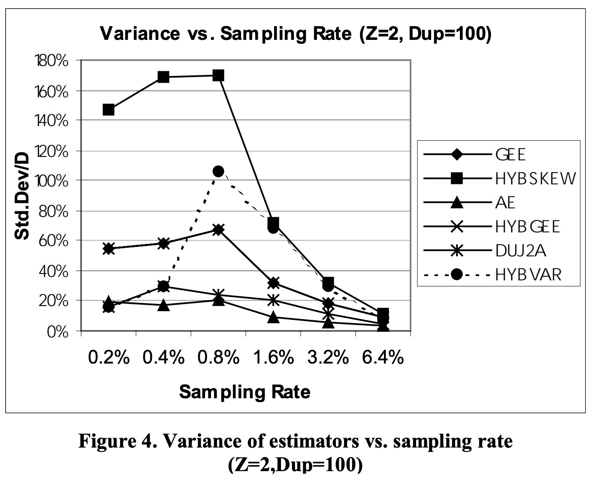
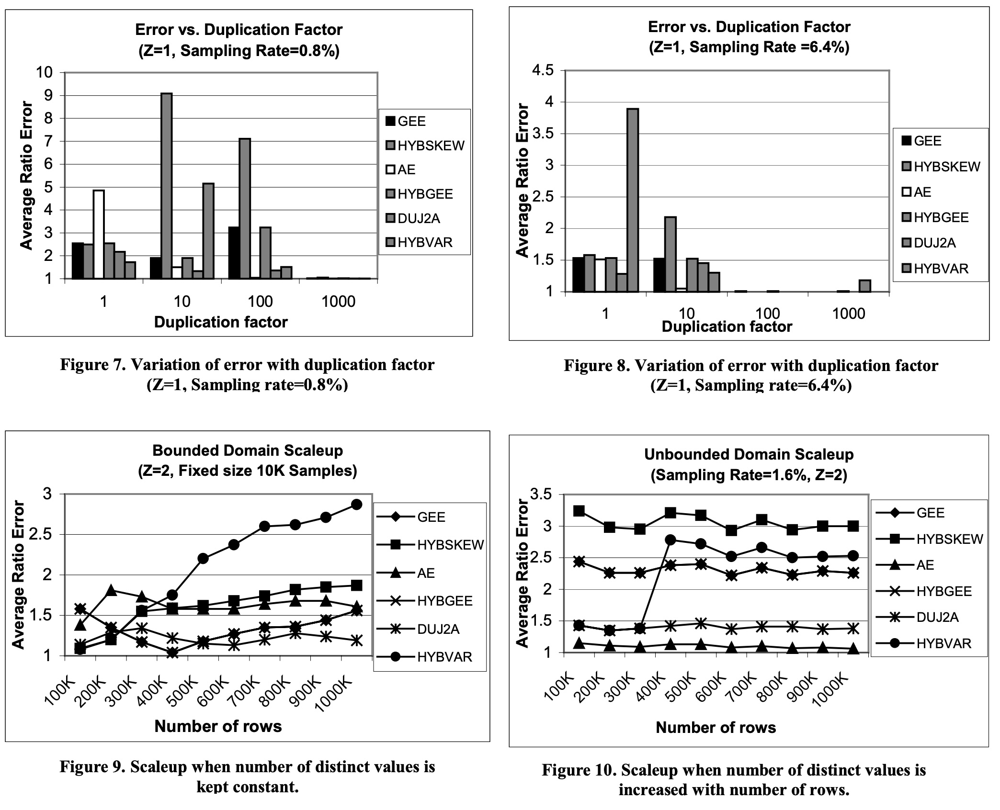

## AI论文解读 | Towards Estimation Error Guarantees For Distinct Values
        
### 作者        
digoal        
        
### 日期        
2025-10-15        
        
### 标签        
PostgreSQL , PolarDB , DuckDB , AI , 论文解读        
        
----        
        
## 背景  
      
https://dl.acm.org/doi/pdf/10.1145/335168.335230        
  
提示:          
```          
读懂《Towards Estimation Error Guarantees For Distinct Values》这篇论文需要提前掌握哪些基础知识, 请使用中文通熟易懂的讲解这些基础知识, 可以引用论文中的图、表或使用Markdown支持的图形(text,mermaid等)增加解释性. 
  
使用中文通熟易懂的解读《Towards Estimation Error Guarantees For Distinct Values》这篇论文, 其中的关键内容请着重讲解, 可以引用论文中的图、表或使用Markdown支持的图形(text,mermaid等)增加解释性. 
  
提取《Towards Estimation Error Guarantees For Distinct Values》这篇论文中的重要术语, 使用中文对这些术语进行通熟易懂的讲解, 可以引用论文中的图、表或使用Markdown支持的图形(text,mermaid等)增加解释性. 
```     
  
## 1 前置知识 
  
好的，为了读懂《Towards Estimation Error Guarantees for Distinct Values》这篇经典的数据库论文，您需要掌握一些基础知识。这篇论文融合了数据库问题、统计学思想和算法理论分析，所以我们需要从这几个方面入手。

下面我将用通俗易懂的方式，为你讲解所需的核心基础知识，并引用论文中的图表来帮助理解。

### 1\. 核心问题：什么是“不同值估计” (Distinct Value Estimation)？

想象一下你是一个大型电商平台的数据库管理员。老板问你：“我们网站昨天究竟有多少个独立访客？” 这就是要计算访客ID列中的“不同值”数量。

  * **精确计算方法**：

    1.  **排序去重 (Sort)**：将所有访客ID排序，然后遍历一遍计数。
    2.  **哈希去重 (Hash)**：将所有ID放入一个哈希表（HashSet），哈希表的大小就是不同值的数量。

  * **问题所在**：当数据量巨大时（例如数十亿条日志），上述方法需要扫描全部数据，并且在内存或磁盘上进行大量计算，这“极其昂贵且耗时”。

这篇论文的核心，就是研究如何在不查看所有数据的情况下，**通过只“看一小部分”数据（即随机抽样），来“估计”出总共有多少个不同值**。这对于数据库的**查询优化器**至关重要。优化器需要知道一个列的不同值数量，才能估算查询成本，选择最高效的执行计划 。

### 2\. 核心方法：随机抽样 (Random Sampling) 与基本概念

既然不能看全部数据，最直观的方法就是随机抽样。这篇论文的所有估计器都基于这个方法 。

**基础概念定义 (参考论文第2节)**：

  * $n$ ：数据表总行数 (例如：日志总条数)。
  * $D$ ：真实的不同值数量 (例如：真实的独立访客总数)。
  * $r$ ：随机抽样的样本大小 (例如：我们随机抽了10000条日志)。
  * $d$ ：在**样本中**发现的不同值数量。
  * $f_i$ ：在样本中，出现次数**恰好为 i 次**的不同值的数量。

**让我们用一个简单的例子来理解 $d$ 和 $f_i$ ：**

假设我们的样本 (r=10) 是：`{A, B, A, C, D, A, E, B, F, G}`

  * 样本中的不同值是 `{A, B, C, D, E, F, G}`，所以 $d=7$ 。
  * `A` 出现了3次。
  * `B` 出现了2次。
  * `C, D, E, F, G` 都只出现了1次。

那么：

  * $f_1$ (只出现1次的值的数量) = 5 (C, D, E, F, G)。
  * $f_2$ (只出现2次的值的数量) = 1 (B)。
  * $f_3$ (只出现3次的值的数量) = 1 (A)。
  * 样本中不同值的总数 $d = f_1 + f_2 + f_3 = 5 + 1 + 1 = 7$ 。

显然，样本中的不同值数量 $d$ 通常会**小于**真实的不同值数量 $D$ 。论文中所有“估计器”的目标，就是设计一个公式，利用 $n, r, d, f_i$ 这些已知信息，来猜出未知的 $D$ 。

### 3\. 什么是“估计器” (Estimator)？

估计器就是一个数学公式或算法，它接收样本的统计信息（ 如 $f_i$ ），然后给出一个对真实值 $D$ 的估计，我们称之为 $\hat{D}$ 。

论文提出了一个核心的估计器，叫做 **GEE (Guaranteed-Error Estimator)** 。它的公式是：

$$\hat{D}_{GEE} = \sqrt{\frac{n}{r}}f_1 + \sum_{j=2}^{r} f_j$$

**这个公式的直观理解是**：

1.  **$\sum_{j=2}^{r} f_j$**：这部分是样本中出现**超过一次**的所有不同值。我们有理由相信，这些值在总体数据中也是“高频”的。既然它们在小样本中都出现了不止一次，那我们很可能已经把所有这类高频值都捕捉到了。所以，这部分的数量可以直接计入最终估计。

2.  **$\sqrt{\frac{n}{r}}f_1$**：这部分是处理那些在样本中**只出现一次**的值（也叫“单例”，singletons）。这些值是“冰山一角” 。它们很可能代表了总体数据中大量“低频”的值，我们只是碰巧抽到了其中一小部分。 $f_1$ 就是我们看到的冰山尖。

      * 那么冰山到底有多大呢？论文通过理论推导，给出了一个缩放因子 $\sqrt{\frac{n}{r}}$ ，用它来放大我们看到的 $f_1$ ，从而估计出整个低频值的“冰山”的大小 。

### 4\. 关键影响因素：数据分布与数据倾斜 (Data Skew)

一个估计器是否好用，很大程度上取决于数据的分布特性，尤其是**数据倾斜 (Skew)** 。

  * **低倾斜 (Low Skew / Uniform Distribution)**：数据分布很均匀，每个不同值出现的次数都差不多。

      * *例子*：一个“主键”列，每个值只出现1次，是极端的低倾斜。或者一个“性别”列，男性和女性数量差不多。

  * **高倾斜 (High Skew / Zipfian Distribution)**：数据分布极不均匀，少数几个值占据了绝大多数的出现次数，而大量其他值则非常罕见 。

      * *例子*：在电商平台的城市列中，“北京”、“上海”可能出现了数百万次，而某个小县城的名字可能只出现了几次。

你可以通过下面的图示来直观理解：


**数据倾斜为什么重要？** 因为它严重影响抽样的结果。在高倾斜数据中，你很容易抽到那些高频值，却很难抽到大量的低频值，这使得估计变得非常困难。论文中的实验部分，通过控制Zipfian分布的参数Z来模拟不同程度的倾斜度（Z=0是低倾斜，Z=4是高倾斜），并观察各个估计器的表现。

### 5\. 如何评价一个估计器的好坏？

论文从理论和实验两个角度，使用以下几个指标来评价估计器：

1.  **准确性 (Accuracy) - Ratio Error**
    这篇论文使用“比率误差 (Ratio Error)”来衡量准确性 ，定义为 $max(\frac{\hat{D}}{D}, \frac{D}{\hat{D}})$ 。这个值永远 $\ge 1$ ，越接近1表示估计越准。

      * *例如*：真实值 D=100。如果估计 $\hat{D}$ = 120，比率误差是 1.2。如果估计 $\hat{D}$ = 80，比率误差是 100/80 = 1.25。

    下图（论文中的Figure 2）展示了在高倾斜数据下，不同估计器的比率误差随采样率的变化。你可以看到，HYBSKEW（黑方块线）在低采样率时误差非常大，而AE和HYBGEE表现则好得多。    

2.  **稳定性 (Stability) - Variance**
    方差衡量的是估计器结果的稳定性。一个好的估计器，在多次独立抽样后，给出的估计值不应该相差太大。
    下图（论文中的Figure 4）展示了不同估计器的方差（以标准差/真实值的形式）。你可以看到HYBSKEW的方差非常高且不稳定，而AE（黑三角线）的方差则一直很低，表现稳定 。   

3.  **理论保障 (Theoretical Guarantee) - Error Bounds**
    这是这篇论文最大的贡献之一。它不仅仅是提出了一个“感觉上”不错的估计器，而是从理论上证明了：

      * **负面结论 (Negative Result)**：任何基于抽样的估计器，在最坏情况下，其误差必然有一个**下限**，不可能无限精确 。这个误差下限大致是 $\sqrt{\frac{n}{r}}$ 。
      * **GEE的最优性 (Optimality)**：论文证明了GEE估计器的误差**上限**也大致是 $\sqrt{\frac{n}{r}}$ 。
      * **结论**：因为GEE的误差上限匹配了理论上的误差下限，所以GEE是一个**理论上最优**的估计器。

### 总结

要读懂这篇论文，你需要掌握以下几个关键点：

| 核心概念 | 通俗解释 |
| :--- | :--- |
| **问题背景** | 在大数据场景下，快速且低成本地估计一个列中有多少个不重复的值。 |
| **核心方法** | 基于随机抽样，而不是扫描全量数据。 |
| **关键参数** | 理解 $n, D, r, d, f_i$ 的含义，尤其是 $f_1$ （单例）的重要性。 |
| **估计器 (Estimator)** | 是一种利用样本信息（如 $f_i$ ）来猜测总体信息（ $D$ ）的数学公式。 |
| **数据倾斜 (Skew)** | 数据是均匀分布还是高度集中，是影响估计器性能的关键外部因素。 |
| **评价标准** | 通过比率误差（准确性）、方差（稳定性）和理论误差保障来综合评价一个估计器。 |

掌握了这些基础知识后，你就能更好地理解论文中提出的GEE、HYBGEE、AE等估计器背后的设计思想，以及它们为什么在某些数据分布上表现优异，而在另一些上则表现不佳。
  
## 2 解读论文 
  
好的，我们来一起深入解读这篇在数据库领域具有重要影响的论文——《Towards Estimation Error Guarantees for Distinct Values》。

这篇论文的核心在于解决了大数据背景下一个经典且棘手的问题：**如何快速且准确地估算一列数据中有多少个不重复的值？** 它不仅提出了创新的算法，更从理论上划定了所有此类算法的精度极限。

-----

### **1. 问题的背景：为何要“估计”而不是“精确计算”？**

想象一个拥有数十亿行记录的数据库表。要精确计算某一列（比如“用户ID”）的不重复值数量，传统的做法是扫描整个表，然后进行排序或哈希去重 。对于海量数据，这样的操作耗时巨大，成本高昂，在很多场景下是不可接受的 。

因此，通过**随机抽样**，只检查一小部分数据来“估计”总数，就成了唯一可行的方案 。这对于数据库查询优化器尤其重要，优化器需要这个估计值来判断不同查询路径的成本，从而选择最高效的执行计划 。

### **2. 论文的第一个里程碑：划定理论极限（负面结论）**

在介绍新算法之前，论文首先做了一件开创性的事：**证明所有基于抽样的估计方法都存在一个无法逾越的误差下限**。

这个“负面结论” (Negative Result) 指出，无论你的估计算法多么巧妙，只要你只检查了 $r$ 条数据（样本），而数据总量是 $n$ ，那么在某些“最坏情况”的数据分布下，你的估计误差至少与 $\sqrt{\frac{n-r}{2r}}$ 成正比 。

**这个结论的直观理解是什么？**

论文的证明巧妙地构建了两种极难区分的数据场景：

  * **场景A (低倾斜，不同值少)**：所有数据只有一个值，比如 `{A, A, A, ..., A}`。真实不同值数量 D = 1 。
  * **场景B (高倾斜，不同值多)**：有一个值 `x` 出现了绝大多数次，同时还隐藏着大量只出现一次的“稀有”值 `{y₁, y₂, ..., yₖ}` 。真实不同值数量 D = k+1。

当你进行随机抽样时，有很大概率只会抽到高频值 `x`，无论是在场景A还是场景B 。你的样本看起来可能都是 `{x, x, ..., x}`。此时，估计算法就陷入了两难：真实结果究竟是1，还是k+1？无论你怎么猜，总有一种场景会让你的误差变得很大 。这个两难的困境，从根本上决定了误差下限的存在。


这个理论下限为后续所有估计算法的评估提供了一个黄金标准。

### **3. 论文的第二个里程碑：GEE，一个理论最优的估计器**

在证明了理论极限后，论文提出了一个名为 **GEE (Guaranteed-Error Estimator)** 的新估计器，并证明了它的最坏情况误差刚好能达到这个理论极限，因此是“**理论上最优的**” 。

GEE的公式非常简洁优雅：
$$\hat{D}_{GEE} = \sqrt{\frac{n}{r}}f_1 + \sum_{j=2}^{r} f_j$$

其中：

  * $f_j$ 是指在样本中出现了 $j$ 次的不同值的个数 。
  * $\sum_{j=2}^{r} f_j$ ：代表样本中**出现超过一次**的所有不同值。算法认为，这些值在小样本中都能被多次看到，说明它们是“高频值”，我们很可能已经发现了所有这类值。所以，这部分可以直接计入总数 。
  * $f_1$ ：代表样本中**只出现一次**的值（“单例”）。这是最关键的部分。这些值是低频“冰山”的尖角。我们只看到了其中一小部分，背后可能隐藏着大量未被发现的低频值 。
  * $\sqrt{\frac{n}{r}}$ ：这就是那个神奇的“缩放因子”。论文从理论上推导出，用这个系数去乘以我们看到的“冰山一角”( $f_1$ )，就能最好地估计出整个低频值冰山的大小 。

**GEE的另一个创新之处**在于，它不仅给出一个估计值，还能提供一个**置信区间**（一个上限和下限） 。从下表（论文Table 1 & 2）可以看出，随着采样率的增加，这个区间的范围会迅速缩小，表明估计结果越来越可信 。

   

| 采样率 | 真实值(D) | 估计下限(LOWER) | 估计上限(UPPER) | 区间宽度 |
| :--- | :--- | :--- | :--- | :--- |
| **0.2%** | 10000 | 1814 | 817300 | \~81万 |
| **1.6%** | 10000 | 7999 | 207963 | \~20万 |
| **6.4%** | 10000 | 9987 | 11306 | \~1300 |

### **4. 从理论到实践：更智能的启发式估计器 (HYBGEE & AE)**

尽管GEE在理论上是最优的，但它的“最优”是针对“最坏情况”而言的。在某些特定数据分布下（尤其是**低倾斜且不同值很多**的情况），GEE的表现并不理想，会严重低估结果 。

为了解决这个问题，论文进一步提出了两种更实用的启发式算法：

1.  **HYBGEE (Hybrid with GEE)**: 这是一个混合模型。它首先用一个统计测试（卡方检验）来判断数据的“倾斜度” 。

      * 如果数据是高倾斜的，就使用GEE（因为它在高倾斜下表现优于之前的Shlosser估计器） 。
      * 如果数据是低倾斜的，就切换到另一种更适合低倾斜场景的“平滑Jackknife”估计器 。

2.  **AE (Adaptive Estimator)**: 这是一个更高级的自适应模型 。它摒弃了HYBGEE那种“非黑即白”的切换模式，而是试图根据样本自身的特征（比如 $f_1, f_2$ 等），**动态地、平滑地调整**对低频值的估计方式，从而避免混合模型在“倾斜度模糊”的临界区产生的不稳定和高方差问题 。

### **5. 实验效果：新算法表现如何？**

论文通过在真实数据集和多种参数的合成数据集上进行的大量实验，充分验证了新算法的优越性。

  * **在高倾斜数据上表现卓越**：下图（论文Figure 2）显示，在高倾斜数据上，新提出的**AE**（三角）和**HYBGEE**（X型）的误差（Average Ratio Error，越接近1越好）远低于之前的最佳算法HYBSKEW（方块）。    

  * **稳定性（方差）更低**：下图（论文Figure 4）展示了各个算法的稳定性。HYBSKEW（方块）的方差非常高，意味着它的估计结果忽高忽低，非常不稳定 。而**AE**（三角）的方差自始至终都非常低，表现稳健 。    

  * **扩展性好**：在数据规模不断增大的“Scaleup”实验中，AE、GEE等新算法的误差基本保持稳定，证明了它们能够很好地适应数据量的增长 。

### **结论与影响**

《Towards Estimation Error Guarantees for Distinct Values》这篇论文做出了三大贡献：

1.  **理论基石**：首次为“不同值估计”问题建立了坚实的理论基础，证明了所有抽样算法都存在一个误差下限 。
2.  **最优算法**：设计了GEE估计器，一个在理论上达到该下限的最优算法，并能提供可靠的置信区间 。
3.  **实用方案**：基于理论洞察，开发了HYBGEE和AE等自适应算法，它们通过感知数据分布的特征来优化估计，在各类实验中都展现了当前最顶尖的准确性和稳定性 。

这篇论文完美地结合了深刻的理论分析和强大的工程实践，为数据库核心技术的发展提供了重要的思路和工具。
  
## 3 术语 
  
好的，这篇论文《Towards Estimation Error Gu-arantees for Distinct Values》中包含了一些关键的专业术语。下面我将用通俗易懂的中文对它们进行讲解，并引用论文中的图表来帮助理解。

-----

### 1\. 估计器 (Estimator)

  * **讲解**：估计器是一个数学公式或一套算法，它的作用是根据一小部分**样本数据**的特征，来推测（或“估计”）全体数据的某个未知属性 。在这篇论文里，估计器的目标就是估计数据表中某一列的**不同值总数 (D)**。
  * **例子**：论文中提出的 GEE、AE、HYBGEE 都是不同类型的估计器 。

### 2\. 核心变量 (n, D, r, d, fᵢ)

这些是理解论文中所有公式的基础 。让我们用一个简单的例子来解释：

假设一个数据表有 **n=1,000,000** 行，其中“城市”这一列真实的不同值数量是 **D=156**。我们从中随机抽取了 **r=8000** 行作为样本。

在我们的样本中，统计结果如下：

  * 我们发现了 **d=111** 个不同的城市。
  * 其中，“北京”出现了10次，“上海”出现了8次...
  * 而“拉萨”、“西宁”、“海口”等城市都**只出现了1次**。假设这样的城市有 **f₁=60** 个。
  * “大连”、“厦门”等城市都**恰好出现了2次**。假设这样的城市有 **f₂=15** 个。
  * 以此类推...

这个关系可以用下图表示：


### 3\. 数据倾斜 (Data Skew)

  * **讲解**：这个术语描述了数据分布的不均匀程度 。
      * **低倾斜 (Low Skew)**：数据分布很均匀，不同值出现的次数相差不大。例如，一个用户的“性别”列。
      * **高倾斜 (High Skew)**：数据分布极不均匀，少数几个值占据了绝大多数，而大量其他值非常罕见 。例如，网站的“来源域名”列，来自几个主流搜索引擎的流量可能占了90%以上。
  * **实验模拟**：论文使用**广义Zipfian分布 (Z)** 来模拟不同程度的倾斜 。Z=0代表均匀分布（低倾斜），Z=4代表极度倾斜（高倾斜） 。

### 4\. 比率误差 (Ratio Error)

  * **讲解**：这是论文用来衡量估计器**准确性**的核心指标 。它被定义为估计值 ( $\hat{D}$ ) 与真实值 (D) 之间较大的比率，即 $max(\frac{\hat{D}}{D}, \frac{D}{\hat{D}})$ 。这个值总是大于等于1，越接近1，说明估计得越准 。
  * **优点**：与传统的相对误差相比，比率误差能同等看待高估和低估的情况 。例如，真实值是100，估计为200和估计为50，它们的比率误差都是2。
  * **图示**：论文中的大量图表，如 Figure 1, 2, 5-11 等，纵坐标都是“Average Ratio Error”，用来直观比较不同算法的准确性。        
    *上图（论文Figure 2）显示了在高倾斜数据 (Z=2) 下，HYBSKEW (黑方块) 的比率误差在低采样率时非常高，而 AE (黑三角) 则准确得多* 。

### 5\. 方差 (Variance)

  * **讲解**：方差用来衡量估计器结果的**稳定性**或**一致性** 。一个低方差的估计器，在多次重复抽样实验中，给出的估计值都比较接近 。反之，高方差的估计器可能这次估计1万，下次就估计10万，结果非常不稳定 。
  * **图示**：论文的 Figure 3, 4, 12, 14, 16 展示了各个估计器的方差情况，纵坐标通常是 `Std.Dev/D` (标准差/真实值)。      
    *上图（论文Figure 4）显示，HYBSKEW (黑方块) 的方差非常高且不稳定，而 AE (黑三角) 和 DUJ2A (星号) 的方差则小得多* 。

### 6\. 负面结论 (Negative Result)

  * **讲解**：这是论文的一个核心理论贡献。它证明了**任何**基于抽样的估计算法，无论设计多么精妙，都存在一个理论上的**误差下限** 。也就是说，想要达到任意高的精度是不可能的，除非样本大小接近数据总量 。
  * **意义**：这个结论为所有不同值估计算法设定了一个无法逾越的基准，衡量一个新算法好坏的标准之一就是看它离这个理论极限有多近 。

### 7\. GEE (Guaranteed-Error Estimator)

  * **讲解**：GEE是“带保证误差的估计器”的缩写 。这是论文提出的一个理论上最优的估计器，因为它在最坏情况下的误差能够达到“负面结论”所证明的理论下限 。
  * **公式**： $\hat{D}_{GEE} = \sqrt{\frac{n}{r}}f_{1}+\sum_{j=2}^{r}f_{j}$ 。
  * **核心思想**：它认为样本中出现多次的值 ( $\sum f_j, j \ge 2$ ) 已经是高频值的全部了，而只出现一次的值 ( $f_1$ ) 是大量低频值的“冰山一角”，需要用一个缩放因子( $\sqrt{n/r}$ )来放大，从而估计出整个冰山的大小 。

### 8\. 置信区间 (Confidence Interval)

  * **讲解**：这是GEE估计器一个独特且有价值的特性 。它不仅提供一个单一的估计值，还会给出一个包含下限 (LOWER) 和上限 (UPPER) 的区间 。这个区间有很高的概率包含了真实的不同值数量D 。
  * **价值**：区间的宽度直观地反映了当前估计的可信度 。如论文的Table 1和Table 2所示，随着采样率的增加，这个区间会迅速收窄，表明估计结果越来越精确 。   

| 采样率 | 真实值(D) | 下限(LOWER) | 上限(UPPER) | 区间宽度 |
| :--- | :--- | :--- | :--- | :--- |
| **0.2%** | 156 | 63 | 15712 | \~1.5万 |
| **6.4%** | 156 | 156 | 169 | 13 |

*上表（改编自论文Table 2）展示了在高倾斜数据下，GEE的置信区间随采样率增加而迅速收敛的过程* 。

### 9\. 启发式估计器 (Heuristic Estimators)

  * **讲解**：虽然GEE理论上最优，但在某些非最坏情况下表现不佳 。为此，论文提出了更注重实际效果的启发式估计器，它们会根据数据的特征进行自适应调整 。
  * **HYBGEE**：一个混合估计器，它先判断数据倾斜度，然后在高倾斜时使用GEE，在低倾斜时切换到另一种算法 。
  * **AE (Adaptive Estimator)**：一个更平滑的自适应估计器 。它不再进行硬切换，而是通过一个统一的公式，根据样本特征动态计算出最合适的参数，从而在各种数据分布下都能获得比较好的效果 。
  
## 参考        
         
https://dl.acm.org/doi/pdf/10.1145/335168.335230    
        
<b> 以上内容基于DeepSeek、Qwen、Gemini及诸多AI生成, 轻微人工调整, 感谢杭州深度求索人工智能、阿里云、Google等公司. </b>        
        
<b> AI 生成的内容请自行辨别正确性, 当然也多了些许踩坑的乐趣, 毕竟冒险是每个男人的天性.  </b>        
    
#### [期望 PostgreSQL|开源PolarDB 增加什么功能?](https://github.com/digoal/blog/issues/76 "269ac3d1c492e938c0191101c7238216")
  
  
#### [PolarDB 开源数据库](https://openpolardb.com/home "57258f76c37864c6e6d23383d05714ea")
  
  
#### [PolarDB 学习图谱](https://www.aliyun.com/database/openpolardb/activity "8642f60e04ed0c814bf9cb9677976bd4")
  
  
#### [PostgreSQL 解决方案集合](../201706/20170601_02.md "40cff096e9ed7122c512b35d8561d9c8")
  
  
#### [德哥 / digoal's Github - 公益是一辈子的事.](https://github.com/digoal/blog/blob/master/README.md "22709685feb7cab07d30f30387f0a9ae")
  
  
#### [About 德哥](https://github.com/digoal/blog/blob/master/me/readme.md "a37735981e7704886ffd590565582dd0")
  
  

  
