## AI论文解读 | Distinct Sampling For Highly-Accurate Answers To Distinct Values Queries And Event Reports
        
### 作者        
digoal        
        
### 日期        
2025-10-15        
        
### 标签        
PostgreSQL , PolarDB , DuckDB , AI , 论文解读        
        
----        
        
## 背景  
      
https://www.vldb.org/conf/2001/P541.pdf        
  
提示:          
```          
读懂《Distinct Sampling For Highly-Accurate Answers To Distinct Values Queries And Event Reports》这篇论文需要提前掌握哪些基础知识, 请使用中文通熟易懂的讲解这些基础知识, 可以引用论文中的图、表或使用Markdown支持的图形(text,mermaid等)增加解释性. 
  
使用中文通熟易懂的解读《Distinct Sampling For Highly-Accurate Answers To Distinct Values Queries And Event Reports》这篇论文, 其中的关键内容请着重讲解, 可以引用论文中的图、表或使用Markdown支持的图形(text,mermaid等)增加解释性. 
  
提取《Distinct Sampling For Highly-Accurate Answers To Distinct Values Queries And Event Reports》这篇论文中的重要术语, 使用中文对这些术语进行通熟易懂的讲解, 可以引用论文中的图、表或使用Markdown支持的图形(text,mermaid等)增加解释性. 
```     
  
## 1 前置知识 
  
好的，为了完全理解《Distinct Sampling for Highly-Accurate Answers to Distinct Values Queries and Event Reports》这篇论文，您需要掌握以下几个核心的基础知识。我会用通俗易懂的中文为您讲解，并结合论文中的图表示例。

-----

### 1\. 核心问题：唯一值计数 (The Distinct Count Problem)

**这是什么？**
想象一个巨大的数据表，比如电商网站的订单记录。一个常见的问题是：“在过去一年里，一共有多少个**不同**的客户下过单？” 。

在SQL（数据库查询语言）中，这个问题通常写作：

```sql
select count(distinct o_custkey)
 from orders
 where o_orderdate >= '2001-01-01'
```

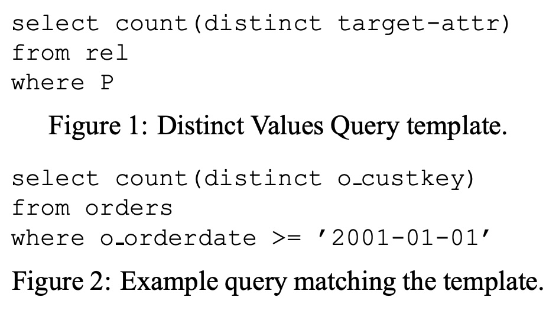 

*这个查询模板正是论文图2中的例子 。*

**为什么它是一个难题？**

  - **数据量巨大**：对于TB级别（万亿字节）的数据仓库，完整扫描整个表来找出所有不重复的客户ID，会非常耗时 。
  - **实时性要求高**：用户希望快速得到答案，哪怕是一个非常精确的近似值，也比漫长的等待要好 。

因此，学术界和工业界一直在寻找一种方法，能够不读取全部数据，或者只读取一遍数据，就快速**估算**出唯一值的数量。这篇论文提出的“Distinct Sampling”就是一种高级的解决方案。

### 2\. 为什么传统方法效果不佳：均匀随机抽样 (Uniform Random Sampling)

**传统方法是什么？**
最直观的估算方法是**随机抽样**。比如，从1亿条订单记录中随机抽取1%（即100万条），然后数这100万条记录里有多少个不同的客户，最后将结果乘以100。

**为什么这种方法不准？**
这种方法在处理“唯一值计数”时有致命缺陷，尤其是当数据分布不均（即**数据倾斜**）时。

**一个简单的比喻：**
想象一下你在统计一个生态保护区里有多少种不同的动物。保护区里有100万只蚂蚁（常见物种），但只有10只老虎（稀有物种）。

  - 你随机观察1000只动物。
  - 你很可能会看到很多蚂蚁，但极有可能一只老虎都看不到。
  - 根据你的样本，你可能会得出结论说“这里没有老虎”，从而严重低估了物种的总数。

在数据库中，“高频客户”就像蚂蚁，而“只下过一两次单的客户”就像老虎。随机抽样很容易漏掉这些“稀有”的客户，导致估算结果严重偏低。论文明确指出，先前的研究已经从理论上证明，依赖均匀抽样的方法无法为唯一值估算提供可靠的精度保证 。

### 3\. 必备基础知识

要理解论文提出的精妙算法，您需要了解以下几个技术概念：

#### (1) 数据倾斜 (Data Skew)

  - **概念**：指数据集中不同数值的出现频率差异巨大。有些值出现成千上万次，而许多其他值只出现一两次。
  - **重要性**：数据倾斜是导致传统抽样方法失效的根本原因。论文的算法设计必须能够有效应对各种倾斜程度的数据。在实验部分，论文使用了**Zipfian分布 (Zipf分布)** 来人工生成不同倾斜度的数据集，以测试算法的鲁棒性 。

#### (2) 哈希函数 (Hash Functions)

  - **概念**：哈希函数是一种数学函数，可以将任意大小的输入（例如，一个客户ID字符串）映射成一个固定大小的数字（哈希值）。
  - **关键特性**：
    1.  **一致性**：相同的输入永远得到相同的输出。例如 `hash("张三")` 永远等于 `12345`。
    2.  **随机性**：输入值的微小变化会导致输出值巨大且无规律的变化，且输出值会均匀分布在整个输出空间。
  - **在论文中的作用**：哈希函数是整个算法的基石。论文使用一个名为 `die-hash` 的特殊哈希函数 。它的作用是为**每一个不同的客户ID**（而不是每一条记录）赋予一个随机的“等级”（`die-level`）。这个“等级”决定了该客户的所有订单记录是否有资格被选入样本中。通过哈希，算法确保了对**客户ID本身**的公平抽样，而不是对订单记录的抽样，从而解决了数据倾斜问题。

#### (3) 流式算法 / 单遍扫描算法 (Streaming / One-Pass Algorithms)

  - **概念**：这类算法被设计用于处理无法一次性装入内存的超大规模数据流（如网络数据包、用户点击流等）。它们的核心限制是：数据只能从头到尾读取**一遍**，且可用的内存非常有限。
  - **在论文中的作用**：Distinct Sampling 就是一种单遍扫描算法 。它在扫描数据表的过程中，动态地维护一个特殊样本（`Distinct Sample`），扫描结束后即可用于估算。并且，当有新数据插入或删除时，它可以被**增量式维护**，无需重新扫描整个历史数据集 。

#### (4) 蓄水池抽样 (Reservoir Sampling)

  - **概念**：这是一个经典的流式算法，用于解决一个问题：如何从一个未知大小的数据流中，随机抽取 `k` 个元素，并保证每个元素被抽到的概率相等。
  - **基本思想**：
    1.  先将数据流中的前 `k` 个元素存入一个“蓄水池”（样本集合）。
    2.  继续处理第 `i` 个元素（`i > k`），以 `k/i` 的概率决定是否要将这个元素选入蓄水池。
    3.  如果决定要它，就从蓄水池中随机丢弃一个旧元素，然后将新元素放入。
    4.  重复此过程，直到数据流结束。
  - **在论文中的作用**：论文用它来解决一个子问题。Distinct Sampling不仅要对唯一值进行抽样，还希望保留每个被抽中值的**部分原始数据行**（最多`t`行） 。如果一个被抽中的高频客户（比如“张三”）有一万条订单记录，但我们只想保留他的最多 `t=100` 条记录作为样本，此时就会用到蓄水池抽样，来确保这100条记录是从他所有的一万条记录中均匀随机抽取的 。

下面是一个示意图，解释蓄水池抽样在论文中的角色：

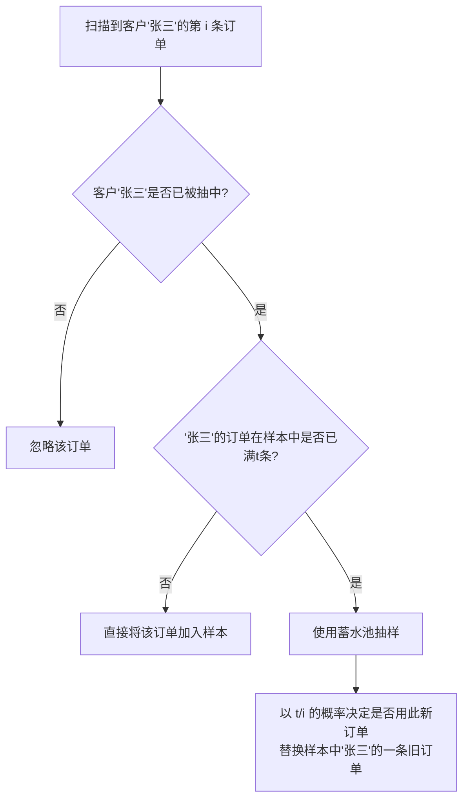

### 总结

要读懂这篇论文，您需要带着以下理解：

1.  **目标**：解决大数据环境下“唯一值计数”又慢又不准的痛点。
2.  **挑战**：传统随机抽样因为“数据倾斜”而完全不可靠。
3.  **核心思路**：论文的创新之处在于，它设计的抽样方案不是针对**数据行**，而是通过**哈希**直接针对**唯一值**本身进行概率抽样。
4.  **技术基石**：整个算法巧妙地融合了哈希函数、单遍扫描思想和蓄水池抽样，构建了一个既能处理海量数据，又能应对数据倾斜，还能被方便维护的精确估算框架。

掌握了这些背景知识后，您在阅读论文第3节的算法描述（如图3所示）时，就能更好地理解每一步操作背后的原理和动机了 。  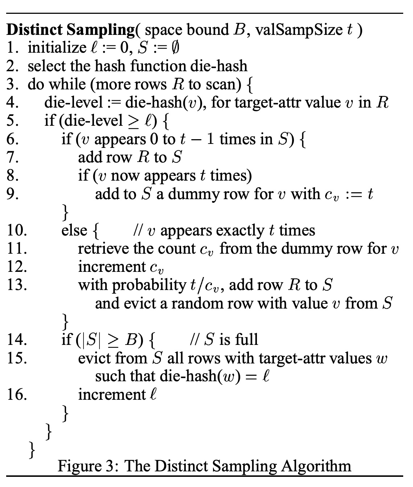 
  
## 2 解读论文 
  
好的，我们来通俗易懂地解读这篇重量级的数据库论文：《Distinct Sampling for Highly-Accurate Answers to Distinct Values Queries and Event Reports》。

这篇论文的核心思想是提出了一种名为 **“Distinct Sampling”（唯一值采样）** 的全新技术，用于在极大的数据集上快速且极其精确地估算“有多少个不同的值”这类问题，其效果远超传统方法。

-----

### 论文解读摘要

| 核心问题 | 在海量数据（如TB级）中，快速回答 `SELECT COUNT(DISTINCT column) FROM ... WHERE ...` 查询。 |
| :--- | :--- |
| **传统方法的困境** | 传统的随机抽样方法在这种问题上表现很差，估算误差通常高达50%-250% ，几乎没有实用价值。 |
| **本文的解决方案** | 提出一种创新的 **Distinct Sampling** 算法。它只扫描一遍数据，就能生成一个特殊的“小样本”，用于后续各种查询。 |
| **核心优势** | 1.  **高精度**：估算误差能控制在惊人的 **0%-10%** 。<br>2. **速度快**：查询速度提升 **2-4个数量级**（百倍到万倍）。<br>3. **灵活性强**：一次采样，可反复用于带不同`WHERE`条件的查询 。<br>4. **可维护性好**：支持数据增删改的**增量式维护**，无需重算 。 |

-----

### 一、核心痛点：为什么“唯一值计数”这么难？

想象一下，你要统计一个国家所有商店一年内的**不同顾客**数量。数据量可能有几十亿条交易记录。

  * **完整计算**：扫描所有记录，用一个巨大的哈希表记下所有出现过的顾客ID，最后数一下哈希表里有多少个ID。这非常慢，而且消耗巨大内存。
  * **传统抽样**：随机抽取1%的交易记录。这里问题就来了：
      * 你很可能会抽到很多“购物狂”（高频顾客）的记录。
      * 而那些一年只买一次东西的“稀客”（低频顾客）的记录，你很可能一条也抽不到。
      * 最终，你基于这个有偏差的样本进行估算，会严重低估真实的不同顾客总数。

这篇论文指出，之前的研究已经从理论上证明，依赖传统抽样来精确估算唯一值数量是几乎不可能的，需要抽取接近全部数据才行 。

### 二、关键创新：Distinct Sampling 算法详解

Distinct Sampling 的天才之处在于，它采样的对象不再是随机的**数据行**，而是通过哈希函数直接对**唯一值本身**（比如顾客ID）进行概率采样 。

我们可以用一个生动的比喻来理解这个算法（参考论文图3的逻辑 ）：   

**想象一个“精英俱乐部”招募会员的游戏：**

1.  **分配“潜力值”（`die-level`）** :

      * 宇宙中每一个可能的顾客ID（比如“张三”、“李四”），我们都通过一个特殊的哈希函数 `die-hash` 给他分配一个固定的、随机的“潜力值” 。这个值一旦分配，就永远不变。
      * 这个潜力值的分布很特别：潜力值为0的概率是1/2，为1的概率是1/4，为2的概率是1/8，以此类推 。高潜力值非常罕见。

2.  **设定“准入门槛”（`level l`）** :

      * 俱乐部一开始的“准入门槛” `l` 设置为0 。

3.  **扫描数据，处理会员申请**:

      * 我们开始从头到尾扫描交易记录。当看到一条“张三”的记录时，我们查看“张三”的潜力值 `die-level`。
      * **判断**：如果“张三”的潜力值 **大于等于** 当前的准入门槛 `l`，那么他就被接纳进俱乐部，他这条交易记录也被存入我们的样本 `S` 中 。
      * 如果他的潜力值低于门槛，那么他和他所有的记录都会被无视 。

4.  **俱乐部“人满为患”怎么办？**:

      * 样本空间 `S` 是有限的（比如最多存1万行）。当样本 `S` 被装满时，就会触发一个关键操作：
      * **提升门槛**：将准入门槛 `l` 提升1（`l++`）。
      * **淘汰会员**：所有潜力值刚好等于旧门槛的会员（现在他们不达标了），连同他们的所有记录，全部从样本 `S` 中被踢出去 。这样就腾出了空间。

5.  **游戏结束与估算**:

      * 当所有交易记录都扫描完毕后，我们得到了一个最终的准入门槛 `l` 和一个最终的样本 `S`。
      * **如何估算总数？** 因为准入门槛 `l` 意味着我们只考虑了世界上 `1 / 2^l` 的精英人士，所以最终的估算公式非常简单：
        $$\text{估算总唯一值数量} = (\text{样本 S 中不同顾客ID的数量}) \times 2^l$$
        这个公式在论文中有提及 。

下面是这个过程的简化流程图：

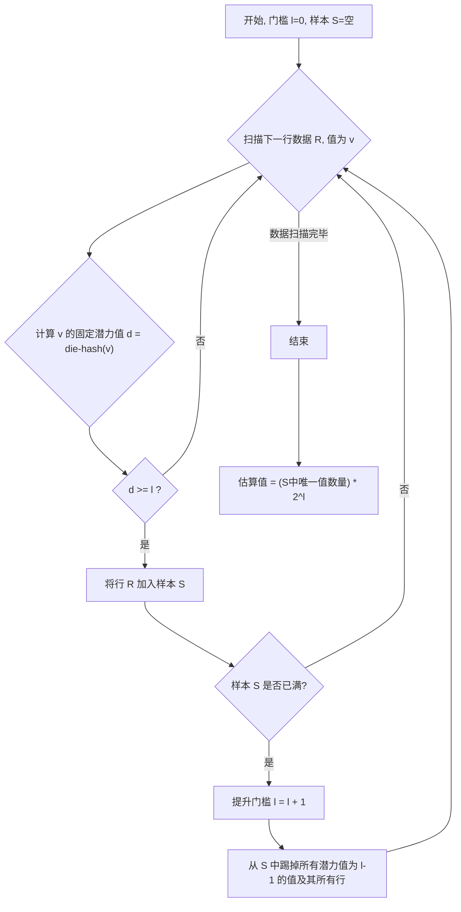

#### 为什么要保留原始数据行？

你可能会问，只记录顾客ID不就行了吗？论文考虑得更远。我们的查询通常带有 `WHERE` 条件，例如：“统计在‘北京’地区消费的不同顾客数量”。

这个 `WHERE` 条件（地区='北京'）可能在数据行的其它列上。因此，只保留顾客ID是不够的。Distinct Sampling 算法会为每个入选的顾客ID，保留**最多 `t` 条**他的原始交易记录 。如果这个顾客的记录超过 `t` 条，就使用 **蓄水池抽样（Reservoir Sampling）** 来确保这 `t` 条记录是公平随机的样本 。这样，在查询时，我们就可以在小样本上精确地应用 `WHERE` 条件了。

### 三、实验效果：碾压性的优势

论文通过在合成数据和真实世界数据集上的大量实验，证明了 Distinct Sampling 的卓越性能。

#### 1\. 对比合成数据（数据倾斜）

在图5中，论文比较了 Distinct Sampling 和当时最好的两种基于传统抽样的方法（GEE 和 AE）。  

  * **横轴 (zipf parameter)**：代表数据倾斜度，从0（均匀分布）到4（高度倾斜）。
  * **纵轴 (average ratio error)**：误差率，越接近1越好。
  * **结果**：
      * **Distinct Sampling (最下面的线)**：误差率始终在1.02以下（即**低于2%的相对误差**）。
      * **GEE 和 AE**：误差巨大，最高可达6.5倍（即550%的误差），完全不可用 。

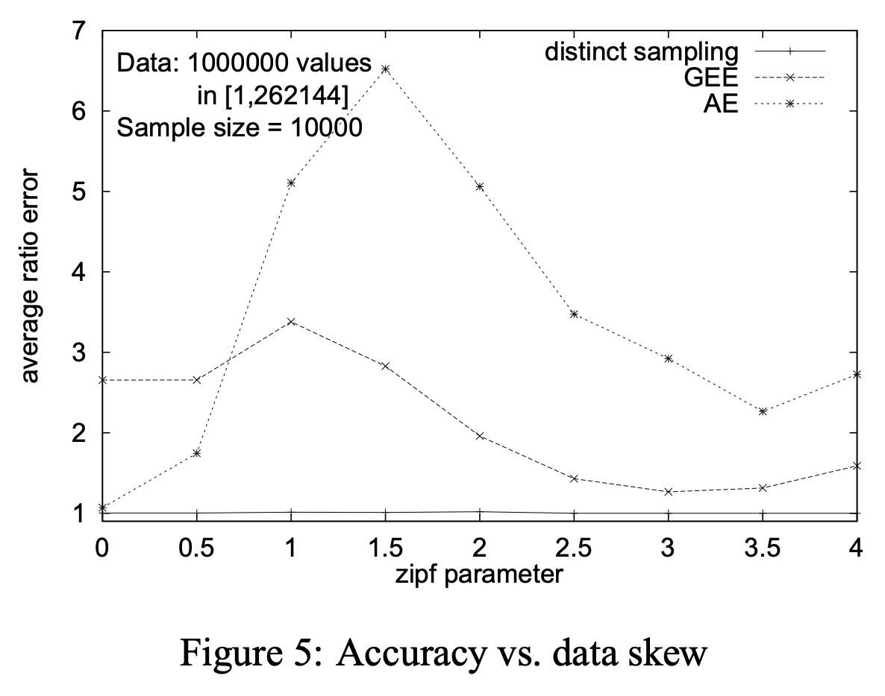 

*论文图5：在不同数据倾斜度下的精度对比* 

#### 2\. 对比真实世界数据（带查询条件）

论文使用了多个真实数据集，例如美国人口普查数据（Census）。其中一个查询是：“统计在政府部门工作的不同国籍的人数？” 。

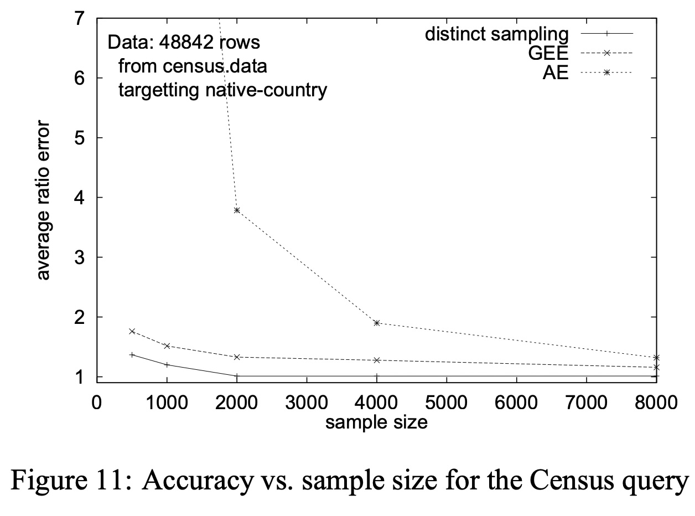 

*论文图11：Census 数据集查询精度对比* 

  * **结果**：如图11所示，随着样本量的增加，Distinct Sampling 的误差迅速下降到接近1.0（几乎无误差）。而 GEE 和 AE 的误差要大得多 。

#### 3\. 杀手级应用：电话客服中心报告

这是一个极具说服力的案例。生成一个完整的客服中心性能报告需要处理大量通话事件日志，非常耗时。

如论文中的表2所示 ： 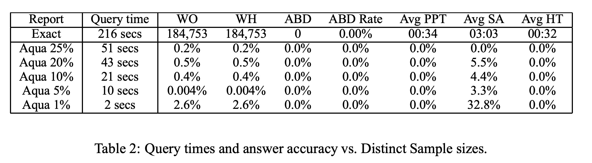 

| 样本类型 | 查询耗时 | 答案误差 (平均) |
| :--- | :--- | :--- |
| **精确计算** | 216 秒 | 0% |
| **Aqua 5% 样本** | 10 秒 | 大多为 0%，最高 3.3% |
| **Aqua 1% 样本** | **2 秒** | 大多为 0%-2.6%，一项为 32.8% |

  - **结论**：使用 Distinct Sampling（论文中称之为Aqua系统的一部分 ），可以将**216秒**的报告生成时间缩短到惊人的**2秒**，而绝大多数结果的误差都在3%以内 。对于另一个更复杂的报告，它甚至将**5个多小时**的计算缩短到了**10秒** ！这充分证明了其“2-4个数量级”的速度提升 。

### 四、总结与影响

这篇论文并非简单地对现有技术进行小幅改进，而是提出了一个全新的、颠覆性的框架来解决一个长期存在的难题。

  * **理论上**，它通过巧妙的哈希分级和动态调整门槛的机制，绕过了传统抽样方法的理论限制。
  * **实践中**，它提供了一种高精度、高速度、高灵活性的解决方案，尤其适用于需要快速决策支持的大数据仓库和实时事件流分析（如网络监控、呼叫中心报表）场景 。

总而言之，**Distinct Sampling 是第一个能够为带任意过滤条件的唯一值查询提供可靠精度保证的实用技术** ，对后续的近似查询处理领域产生了深远的影响。
  
## 3 术语 
  
好的，这是对论文《Distinct Sampling For Highly-Accurate Answers To Distinct Values Queries And Event Reports》中关键术语的中文通俗解读，并结合了论文中的图表和示例。

-----

### 1\. 唯一值查询 (Distinct Values Queries)

**通俗讲解**：
这是一种非常常见的数据库查询，目的是统计某个数据列中**不重复的值**有多少个。查询时通常还会附带一个或多个筛选条件（即`WHERE`子句） 。

**论文示例**：
论文在图1中给出了这类查询的通用模板 ： 

```sql
select count(distinct target-attr)
 from rel
 where P
```

其中 `target-attr` 是你关心的列，`P` 是任意的筛选条件。

 

一个具体的例子如图2所示 ，查询“今年（2001年）以来，共有多少个**不同**的客户下过订单？”：

```sql
select count(distinct o_custkey)
 from orders
 where o_orderdate >= '2001-01-01'
```

这个问题如果数据量巨大，直接计算会非常耗时，而这篇论文的技术正是为了快速、准确地**估算**这类查询的结果。

### 2\. Distinct Sampling (唯一值采样)

**通俗讲解**：
这是论文提出的核心算法。它不是像传统方法那样随机抽取数据**行**，而是设计了一种巧妙的机制，来对数据**值**本身进行概率采样 。其核心思想是：**一个值一旦被选中，那么它对应的所有数据行都有资格进入样本**；反之，一个值如果未被选中，那么它的所有数据行都会被忽略 。这种方法能有效避免传统抽样因数据倾斜（某些值出现次数特别多）而导致的估算不准问题。

### 3\. die-hash 和 die-level (哈希函数和“潜力值”)

**通俗讲解**：
这是 Distinct Sampling 算法的基石。

  * **`die-hash`**: 一个特殊的哈希函数。它会为数据库里每一个**可能的值**（比如，每一个顾客ID）分配一个固定不变的、随机的“等级”，论文称之为 `die-level` 。
  * **`die-level`**: 可以理解为每个值与生俱来的“**潜力值**”或“**幸运等级**” 。这个等级的分布很有特点：等级为0的概率是1/2，等级为1的概率是1/4，等级为2的概率是1/8... 以此类推，等级越高越罕见 。

**论文示例**：
在图4的算法运行示例中，第二列就展示了不同值（`attr value`）被 `die-hash` 计算出的 `die-level` 。比如，值为`0`的`die-level`是5，值为`2`的`die-level`是3。这个值在整个扫描过程中是恒定的 。

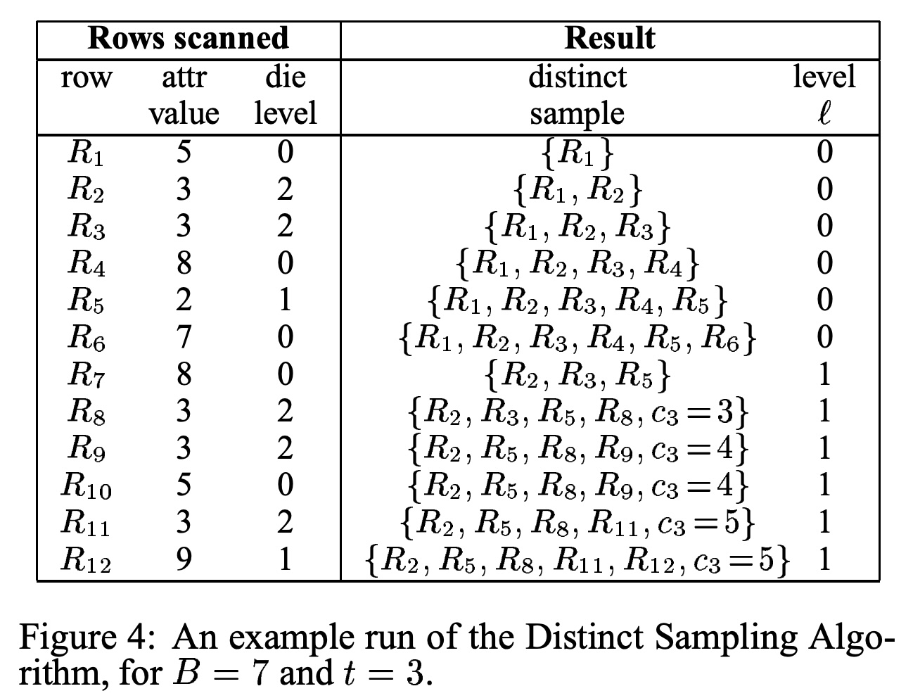 

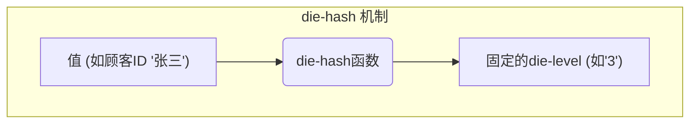

### 4\. level (l) (等级或“准入门槛”)

**通俗讲解**：
这是算法在运行过程中一个**动态变化的整数**，可以理解为采样的“**准入门槛**” 。算法开始时，门槛`l`为0 。当用于存放样本的空间满了之后，算法就会将门槛`l`加1，并把所有`die-level`刚好等于旧门槛的值（现在它们不达标了）从样本中剔除，以腾出空间 。

**论文示例**：
在图4的示例中，当扫描到第7行时，样本空间满了 。此时：  

1.  门槛 `level l` 从 **0** 提升到 **1**。
2.  所有 `die-level` 等于0的值（在例子中是值为`8`和`7`的行）被从样本中剔除。

最终的估算值会用 $2^l$ 这个因子进行放大，因为门槛`l`越高，代表采样率越低 。

### 5\. 蓄水池抽样 (Reservoir Sampling)

**通俗讲解**：
这是算法用来解决一个子问题的技术。对于一个被成功选入样本的高频值（比如顾客“张三”有一万条记录），我们不可能把他的所有记录都存下来，因为样本空间有限 。此时，算法会使用蓄水池抽样，从他的一万条记录中，公平地随机抽取`t`条（`t`是预设参数）放入样本中 。

**作用流程**：

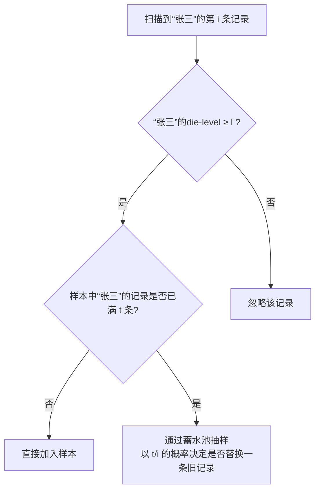

### 6\. valSampSize (t)

**通俗讲解**：
这是一个算法参数，它定义了对于**任何一个**进入样本的唯一值，我们最多为它保留多少条原始的数据行 。设置这个参数的目的是为了在有限的样本空间里容纳尽可能多的**不同值**，同时又为每个值保留足够的数据行，以便将来能处理带`WHERE`条件的查询 。

### 7\. Ratio Error (比率误差)

**通俗讲解**：
这是论文用来衡量估算结果准确度的指标 。它的计算公式是 `max(真实值 / 估算值, 估算值 / 真实值)` 。

  * **完美估算**：比率误差为 **1**。
  * **误差越大**：比率误差离1越远。例如，比率误差为1.5，意味着估算值要么是真实值的1.5倍，要么是它的1/1.5。

**论文示例**：
在图5、图7、图9等所有实验结果图中，纵轴 `average ratio error` 就是这个指标 。可以看到，`distinct sampling` 方法的线始终非常接近1，而其他方法（GEE, AE）则高出很多，说明其误差巨大 。

  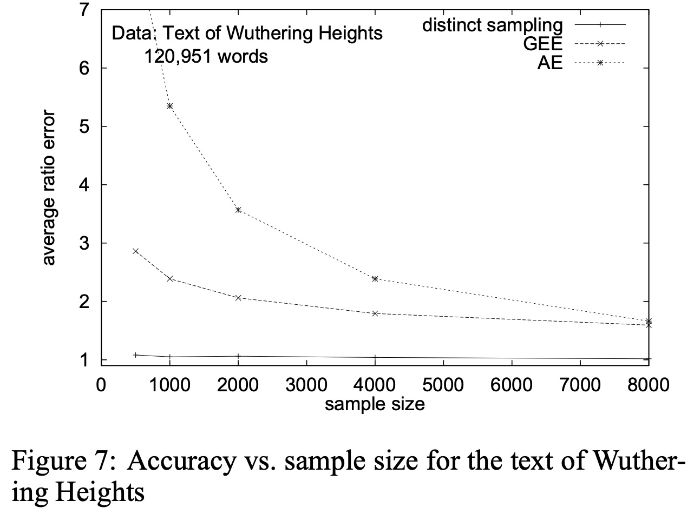  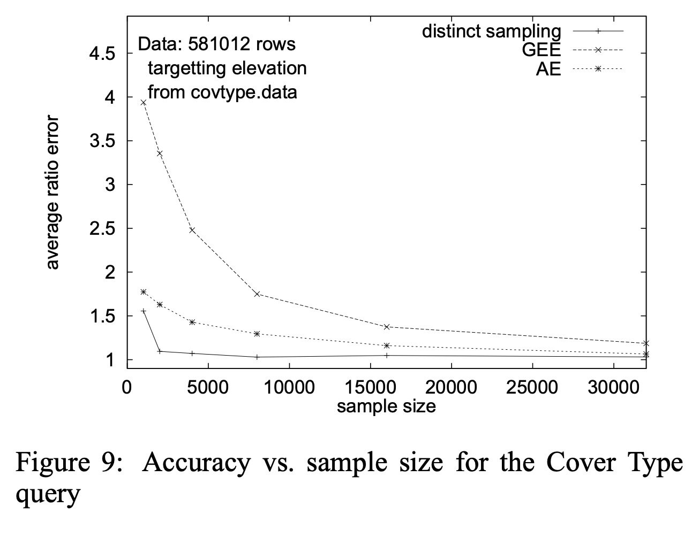 

### 8\. 基于会话的事件记录 (Session-based Event Recording)

**通俗讲解**：
这是一种常见的数据记录模式，在很多场景中（如IP网络通信、客户服务中心）都会出现 。在这种模式下，一系列逻辑相关的事件构成一个“会话”（Session），并且这个会话中的所有事件都会被标记上一个**相同的、唯一的ID** 。

**论文示例**：
论文以一个商业呼叫中心为例。一个顾客从打进电话到挂断电话，期间可能经历“等待”、“与客服A通话”、“被转接”、“与客服B通话”等多个事件。这些事件记录虽然是穿插在日志中的，但它们都会被标记上同一个 `workitem-id`（即会话ID） 。Distinct Sampling 在处理这类数据时特别有效，因为它能保证只要一个会话ID被选中，该会话的**所有**事件记录都会被采样，从而可以完整地分析整个通话过程 。
  
## 参考        
         
https://www.vldb.org/conf/2001/P541.pdf    
        
<b> 以上内容基于DeepSeek、Qwen、Gemini及诸多AI生成, 轻微人工调整, 感谢杭州深度求索人工智能、阿里云、Google等公司. </b>        
        
<b> AI 生成的内容请自行辨别正确性, 当然也多了些许踩坑的乐趣, 毕竟冒险是每个男人的天性.  </b>        
    
#### [期望 PostgreSQL|开源PolarDB 增加什么功能?](https://github.com/digoal/blog/issues/76 "269ac3d1c492e938c0191101c7238216")
  
  
#### [PolarDB 开源数据库](https://openpolardb.com/home "57258f76c37864c6e6d23383d05714ea")
  
  
#### [PolarDB 学习图谱](https://www.aliyun.com/database/openpolardb/activity "8642f60e04ed0c814bf9cb9677976bd4")
  
  
#### [PostgreSQL 解决方案集合](../201706/20170601_02.md "40cff096e9ed7122c512b35d8561d9c8")
  
  
#### [德哥 / digoal's Github - 公益是一辈子的事.](https://github.com/digoal/blog/blob/master/README.md "22709685feb7cab07d30f30387f0a9ae")
  
  
#### [About 德哥](https://github.com/digoal/blog/blob/master/me/readme.md "a37735981e7704886ffd590565582dd0")
  
  

  
