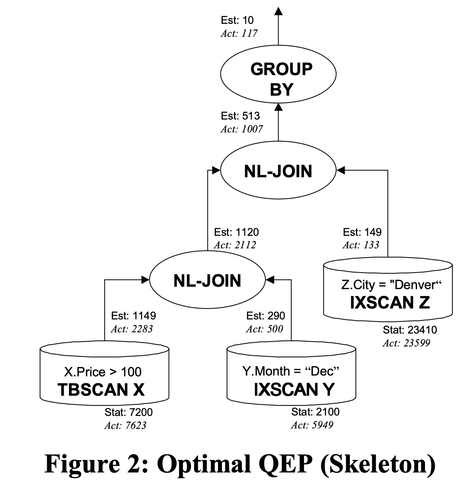
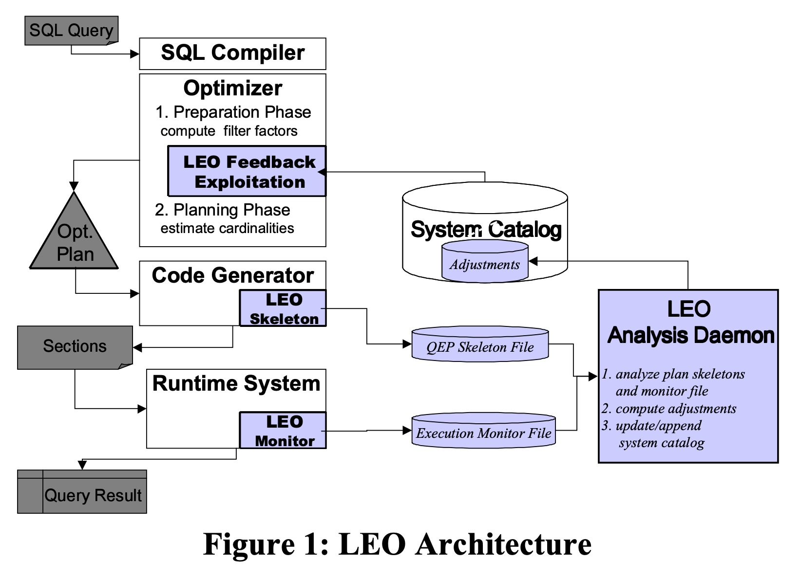
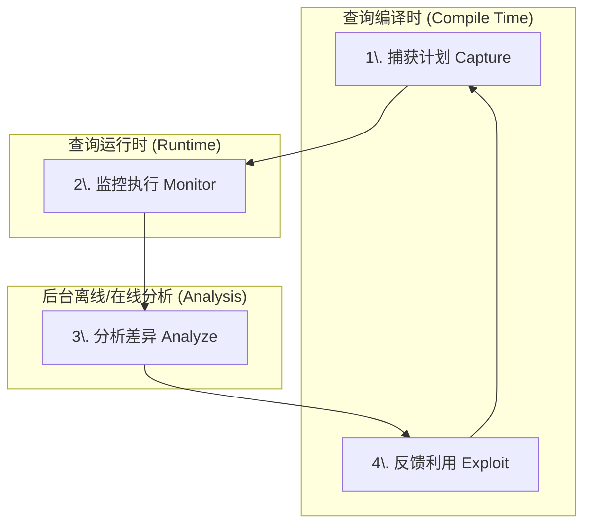
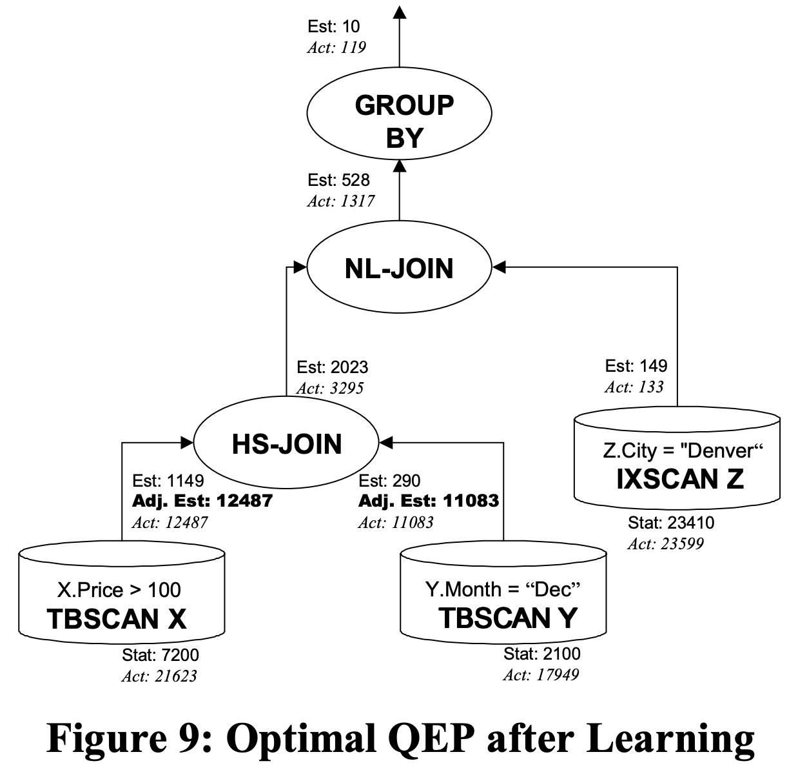
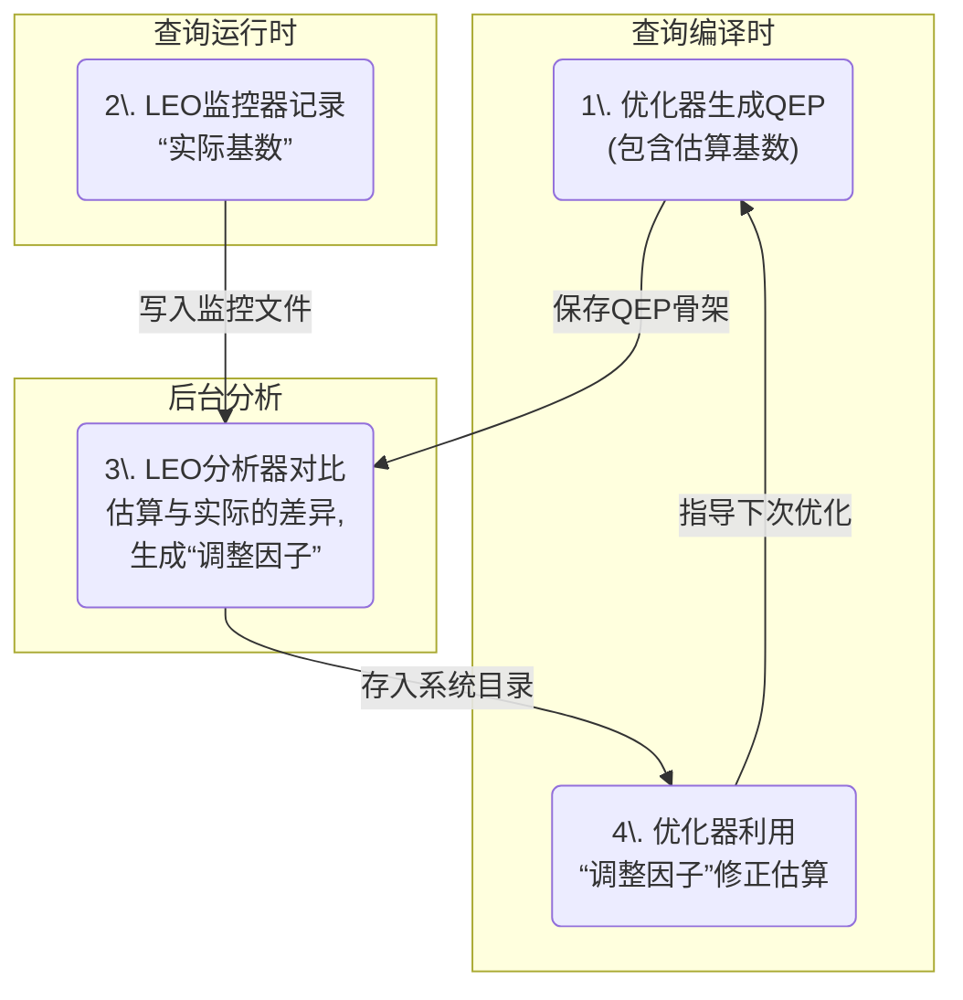

## AI论文解读 | Leo - Db2’s Learning Optimizer
        
### 作者        
digoal        
        
### 日期        
2025-10-15        
        
### 标签        
PostgreSQL , PolarDB , DuckDB , AI , 论文解读        
        
----        
        
## 背景  
      
https://www.vldb.org/conf/2001/P019.pdf        
  
提示:          
```          
读懂《Leo - Db2’s Learning Optimizer》这篇论文需要提前掌握哪些基础知识, 请使用中文通熟易懂的讲解这些基础知识, 可以引用论文中的图、表或使用Markdown支持的图形(text,mermaid等)增加解释性. 
  
使用中文通熟易懂的解读《Leo - Db2’s Learning Optimizer》这篇论文, 其中的关键内容请着重讲解, 可以引用论文中的图、表或使用Markdown支持的图形(text,mermaid等)增加解释性. 
  
提取《Leo - Db2’s Learning Optimizer》这篇论文中的重要术语, 使用中文对这些术语进行通熟易懂的讲解, 可以引用论文中的图、表或使用Markdown支持的图形(text,mermaid等)增加解释性. 
```     
  
## 1 前置知识 
  
好的，为了完全理解《LEO - DB2's LEarning Optimizer》这篇论文，你需要掌握一些数据库查询处理和优化的基础知识。我会用通俗易懂的方式为你讲解，并结合论文中的图表来帮助理解。

这篇论文的核心思想其实很简单：**让数据库优化器像人一样，从过去的错误中学习，下次做得更好。**

想象一下，你第一次去一个陌生的城市，导航软件（查询优化器）根据地图（数据库统计信息）给你规划了一条它认为最快的路线（查询执行计划）。但实际开的时候，你发现有一条路堵得水泄不通，导航的预测完全错了。如果你有记忆，下次你就会避开这条路。LEO就是让数据库拥有这种“记忆”和“学习”能力的系统。

要读懂这篇论文，你需要理解以下几个核心概念：

### 1\. 核心概念：数据库如何执行一条查询

当你向数据库发送一条SQL查询语句时，它并不是直接开始埋头找数据。它会先经过一个叫做 **“查询优化器” (Query Optimizer)** 的“大脑”。

  * **查询优化器 (Query Optimizer)**：这是数据库管理系统（DBMS）中最核心、最复杂的组件之一。它的工作不是执行查询，而是**找出执行这条查询的“最佳”方法**。对于同一条SQL，可能有成百上千种执行方式，优化器的目标就是从中选择一个成本最低（通常意味着执行时间最短）的方案。
  * **查询执行计划 (Query Execution Plan, QEP)**：这是优化器最终选择的方案。它就像一个流程图或者菜谱，详细说明了获取查询结果的每一步操作。

我们可以看一下论文中图2这个例子，它就是一个QEP的可视化展示：  

*论文中的图2：一个查询执行计划（QEP）的骨架* 

这个图应该从下往上看：

1.  **访问数据**：首先，系统分别从X、Y、Z三张表中读取数据。读取方式不同，比如对X表是`TBSCAN`（全表扫描），对Y和Z表是`IXSCAN`（索引扫描）。
2.  **执行操作**：读取数据后，开始进行`NL-JOIN`（嵌套循环连接）操作，先把X和Y表的结果连接起来，再和Z表的结果连接。
3.  **最终处理**：最后，对连接后的结果进行`GROUP BY`（分组）操作，得到最终的查询结果。

**你需要掌握的知识点**：理解数据库并不是直接运行SQL，而是先由优化器生成一个详细的执行计划（QEP），然后严格按照这个计划去执行。

### 2\. 关键问题：优化器为什么会犯错？

优化器是如何判断哪个QEP是“最佳”的呢？它依赖一个 **成本模型 (Cost Model)**。而这个模型最重要的输入，就是对每一步操作会产生多少行数据的**预测**，这个预测值在数据库领域被称为 **基数 (Cardinality)**。

  * **基数 (Cardinality)**：简单来说，就是**行数**。优化器需要估算QEP中每一步操作（如一次扫描、一次连接）会返回多少行数据。

**如果基数估算错了，成本模型就会算错，优化器很可能就会选出一个非常糟糕的执行计划。** 这也是LEO要解决的核心问题。

我们再来看图2，注意每个操作旁边的两个数字：   

  * **Est (Estimated)**：优化器**估计**的基数。
  * **Act (Actual)**：查询**实际**执行后返回的基数。

比如，对于`TBSCAN X`（扫描X表并应用`X.Price > 100`这个条件），优化器估计会得到 **1149** 行数据 ，但实际执行后却返回了 **2283** 行。这个误差接近100%！这个巨大的误差会向上传播，导致后续的Join操作和最终的成本估算都错得离谱。

优化器为什么会估算错呢？论文第一页就提到了几个原因 ：

1.  **统计信息过时 (Currency of information)**：优化器依赖预先收集的数据库统计信息（比如表有多大、某列有多少个不重复的值）。但如果数据更新频繁，而统计信息没及时更新，那它就是基于旧“地图”在导航。 
2.  **数据均匀分布假设 (Uniformity)**：在没有更详细信息时，优化器常常假设数据是均匀分布的。但现实世界的数据往往是倾斜的（比如，大部分商品的销售额都集中在少数爆款商品上）。 
3.  **谓词独立性假设 (Independence of predicates)**：当有多个过滤条件时（如 `Z.City = 'Denver'` AND `Y.Month = 'Dec'`），优化器会假设这两个条件是相互独立的，简单地将它们的选择率相乘。但实际上它们可能存在关联（比如丹佛市在十二月的销售额可能远高于其他月份）。 

**你需要掌握的知识点**：优化器的决策严重依赖于对 **基数（行数）** 的准确估算。由于统计信息陈旧、数据分布不均、错误的相关性假设等原因，这个估算经常会出错，导致选择了低效的执行计划。

### 3\. LEO的解法：引入反馈闭环 (Feedback Loop)

理解了问题所在，LEO的解决方案就很容易懂了。它为优化器引入了一个**反馈闭环**，让优化器能够“事后诸葛亮”，从错误中学习。

我们可以用论文中的图1（LEO架构图）来理解这个过程：   

*论文中的图1：LEO架构* 

这个闭环包含四个关键组件 ：

1.  **计划捕获 (LEO Skeleton)**：在查询编译时，LEO会把优化器选择的QEP以及其中所有的**估算基数 (Est)** 保存下来，形成一个“计划骨架”文件。 
2.  **执行监控 (LEO Monitor)**：在查询运行时，LEO会监控QEP中每个操作符**实际处理的行数 (Act)**，并记录下来。 
3.  **分析与学习 (LEO Analysis Daemon)**：这是一个独立的后台进程。它会比较“计划骨架”中的**估算值 (Est)** 和“监控文件”中的**实际值 (Act)**。 
4.  **反馈利用 (LEO Feedback Exploitation)**：分析组件根据差异计算出一个 **“调整因子” (Adjustment factor)** ，并存入系统目录（System Catalog）中。  当下一次有类似的查询需要优化时，优化器就会读取这个调整因子，修正自己原本的估算，从而做出更准确的判断。

**你需要掌握的知识点**：LEO的核心机制是一个反馈循环：**捕获计划和估算 -\> 监控实际执行 -\> 分析差异 -\> 计算调整因子 -\> 在未来优化中应用调整**。通过这个循环，优化器的估算能力会随着执行的查询越多而变得越准。

### 4\. 需要了解的一些数据库操作符

为了看懂QEP中的细节，你需要了解一些基本的操作符（Operator）是什么意思：

  * **TBSCAN (Table Scan / 全表扫描)**：从头到尾读取表中的每一行数据来查找满足条件的行。对于没有索引或者需要访问大部分数据的查询很常见。
  * **IXSCAN (Index Scan / 索引扫描)**：通过索引（类似书的目录）来快速定位需要的行，避免读取整张表，效率更高。
  * **NL-JOIN (Nested Loop Join / 嵌套循环连接)**：最基础的连接算法。它遍历外层表（左边的输入）的每一行，然后对于每一行，再去内层表（右边的输入）里查找匹配的行。
  * **HS-JOIN (Hash Join / 哈希连接)**：另一种连接算法。它通常会选择较小的表，在内存中基于连接键创建一个哈希表，然后扫描较大的表，用每一行的数据去哈希表中快速查找匹配项。这在处理大数据集时通常比NL-JOIN高效。
  * **GROUP BY (分组)**：根据指定的列对数据进行分组，通常用于聚合计算（如 `SUM`, `COUNT`）。

### 总结

在阅读这篇论文之前，请确保你对以下概念有一个清晰的认识：

1.  **查询处理流程**：知道SQL语句需要先被**优化器**编译成一个 **查询执行计划（QEP）** ，然后才能执行。
2.  **基数估算的重要性**：明白优化器的所有决策都基于**成本模型**，而**基数（行数）的估算**是成本模型最关键也最容易出错的环节。
3.  **LEO的核心思想**：理解LEO通过 **“监控实际值、对比估算值、计算调整因子、反馈给未来优化”** 这样一个反馈闭环来解决基数估算不准的问题。
4.  **基本数据库操作**：了解什么是全表扫描、索引扫描以及几种常见的表连接（Join）方式。

掌握了这些基础知识后，你再阅读论文原文时，就会对作者的动机、实现方法以及实验结果有更深刻的理解。
  
## 2 解读论文 
  
好的，这篇名为《LEO - DB2's LEarning Optimizer》的论文是一篇数据库领域的经典之作。它的核心思想非常巧妙，可以概括为：**让数据库查询优化器学会“吃一堑，长一智”，从过去的错误中学习，从而为未来的查询做出更明智的决策。**

我将为你分步解读这篇论文的关键内容。

### 第一部分：核心问题——聪明的优化器为什么会“犯傻”？

在我们日常使用的数据库背后，都有一个极其重要的“大脑”——**查询优化器 (Query Optimizer)**。当你发送一条SQL查询时，优化器并不会马上执行，而是会先生成很多种可能的执行方案，即**查询执行计划 (Query Execution Plan, QEP)**。然后，它会估算每种方案的“成本”（通常指执行时间），并选择成本最低的那个去执行 。

这个决策过程严重依赖于优化器对**基数 (Cardinality)** 的估算，也就是它预测QEP中每一步操作会返回多少行数据 。**如果这个估算错得离谱，优化器就极有可能选出一个非常糟糕、执行缓慢的计划** 。

论文指出，优化器的估算之所以会出错，主要有以下几个原因 ：

  * **统计信息陈旧**：优化器依赖的数据库统计信息可能已经过时，无法反映数据的最新状态 。
  * **数据分布不均**：优化器常常假设数据是均匀分布的，但现实世界的数据往往存在倾斜 。
  * **错误的独立性假设**：当有多个过滤条件时，优化器会假设它们是相互独立的，但实际上这些条件可能存在很强的关联性 。

### 第二部分：LEO的解决方案——引入“反馈-学习”闭环

为了解决上述问题，LEO（LEarning Optimizer）引入了一套开创性的**反馈闭环机制** 。它的核心逻辑就像我们人类学习一样：**实践 -\> 发现问题 -\> 分析原因 -\> 总结经验 -\> 改进未来**。

我们可以通过论文中的架构图（图1）和以下流程图来理解这个闭环：  

*论文中的图1：LEO系统架构图*



这个闭环的四个关键步骤如下：

1.  **捕获计划 (Capture)**：当优化器为一条查询选定了QEP后，LEO会把这个计划的关键信息（特别是其中每一步的**估算基数**）保存为一个“计划骨架” (QEP Skeleton) 。
2.  **监控执行 (Monitor)**：在查询实际运行时，LEO会监控QEP中的每一个操作，并记录下它们处理的**实际基数**（真实行数）。
3.  **分析差异 (Analyze)**：一个独立的后台“分析守护进程” (Analysis Daemon) 会定期工作。它会找出“计划骨架”和“监控日志”，然后逐一对比**估算基数**和**实际基数**之间的差异 。
4.  **反馈利用 (Exploit)**：当发现显著差异时，分析器会计算出一个 **“调整因子” (Adjustment Factor)** ，并将其存储在系统目录中 。当下一次优化器遇到涉及相同表、列或操作的查询时，它会读取这个调整因子来修正自己的估算，从而做出更准确的判断 。

通过这个不断循环的过程，LEO让优化器积累了宝贵的“实战经验”，使其估算能力越来越贴近真实情况 。

### 第三部分：一个生动的例子——LEO如何学习？

论文通过一个具体的查询和QEP（图2）非常直观地展示了LEO的工作过程。  

**查询语句示例** ：

```sql
SELECT ... FROM X, Y, Z
WHERE X.Price >= 100 AND Z.City = 'Denver' AND Y.Month = 'Dec'
  AND X.ID = Y.ID AND Y.NR = Z.NR
GROUP BY A
```

**学习前的QEP（图2）** ：
*论文中的图2：优化器原始的查询执行计划*

让我们从下往上分析这个图：

  * 在左下角对表X的扫描操作（`TBSCAN X`）中，优化器**估计(Est)** `X.Price >= 100`这个条件会筛选出 **1149** 行数据 。
  * 然而，监控组件发现，**实际(Act)** 返回了 **2283** 行 。这里的估算误差接近100%！
  * 这个巨大的误差被带到了上层的连接操作（`NL-JOIN`）中，导致后续所有步骤的估算都严重偏离了实际情况 。

LEO的分析器会捕捉到这些显著的差异，并计算出针对“表X的基数”和“谓词`X.Price >= 100`的选择率”的调整因子。

### 第四部分：学习成果——从“弯路”到“捷径”

当LEO积累了足够的学习经验后，它对优化器的影响是显著的。论文的图9展示了在LEO介入后，同一条查询的QEP发生了怎样的变化。

**学习后的QEP（图9）** ：   

*论文中的图9：经过LEO学习调整后的新QEP*

**最关键的变化**：

  * **连接方式改变**：优化器现在知道了连接X和Y会产生远比原先预想多得多的数据。因此，它放弃了之前低效的**嵌套循环连接 (NL-JOIN)**，转而选择了更适合处理大数据量的**哈希连接 (HS-JOIN)** 。
  * **访问方式改变**：对Y表的访问也从索引扫描（`IXSCAN`）变成了更合适的表扫描（`TBSCAN`），这也是基于更准确的基数估算做出的调整 。

这个新的QEP执行效率**提升了一个数量级以上** 。这充分证明了LEO的威力：通过修正错误的基数估算，它可以引导优化器找到一条截然不同但效率极高的“捷径”。

更重要的是，实现这一切的**监控开销极低**，论文的测试表明其对查询执行时间的性能影响**低于5%** 。

### 第五部分：LEO设计的精妙之处

除了核心的反馈闭环，LEO的一些设计细节也体现了其作为工业级解决方案的成熟度：

  * **不直接修改原始统计信息**：LEO并不会粗暴地修改数据库原有的统计数据。它将学习到的“调整因子”作为独立的一层信息存储 。这样做的好处是，如果学习出了问题，可以随时禁用LEO的调整功能，退回到原始状态，保证了系统的稳定性 。
  * **通用性强**：LEO的方法非常通用，它不仅能修正简单的过滤条件，还能学习和调整连接（Joins）、分组（GROUP BY）、去重（DISTINCT）等几乎所有会改变基数的操作 。这是传统方法（如多维直方图）难以企及的 。

### 总结

《LEO - DB2's LEarning Optimizer》这篇论文的贡献是革命性的：

  * 它提出并实现了一个通用的、自动化的**反馈学习框架**，让查询优化器能够从历史经验中持续自我完善 。
  * 它直击查询性能问题的根源——**不准确的基数估算**，并通过**监控实际值与估算值的差异**来动态修正模型 。
  * 实验证明，该方法**开销小、收益大**，能够将次优的查询计划优化至性能提升数倍甚至数十倍，极大地降低了数据库手动调优的复杂性和成本 。

简单来说，LEO让数据库优化器从一个依赖静态规则和过时地图的“新手司机”，成长为一个能够根据实时路况不断学习、规划最佳路线的“老司机”。
  
## 3 术语 
  
好的，这是从《LEO - DB2's LEarning Optimizer》论文中提取的核心术语及其通俗易懂的中文讲解。

### 1\. 查询优化器 (Query Optimizer)

  * **讲解**：查询优化器是数据库管理系统（DBMS）的“大脑” 。当你向数据库发送一条SQL查询时，它不会立即执行。相反，优化器会分析这条SQL，并生成许多种可能完成查询任务的方法。然后，它会估算每种方法的执行成本（通常是时间），并从中选择一个成本最低的方案来执行 。
  * **关联**：LEO的核心目的就是通过“学习”来帮助这个“大脑”做出更明智、更准确的决策 。

### 2\. 查询执行计划 (Query Execution Plan, QEP)

  * **讲解**：QEP是查询优化器最终选定的“行动方案” 。它就像一张详细的流程图或菜谱，规定了获取查询结果的每一步操作，例如先扫描哪张表、用什么方法连接、何时进行排序或分组等 。
  * **图解**：论文中的图2就是一个QEP的可视化表示，它清晰地展示了从底部的表数据读取（`TBSCAN`, `IXSCAN`）到中间的数据连接（`NL-JOIN`），再到顶部的最终处理（`GROUP BY`）的完整流程。

 

*来源：论文图2，一个典型的QEP*

### 3\. 基数 (Cardinality)

  * **讲解**：在数据库语境下，“基数”就是指**数据行的数量** 。优化器在评估一个QEP的成本时，最关键的一步就是估算这个计划中每一步操作会产生或处理多少行数据 。
  * **关联**：基数估算的不准确是导致优化器选择错误QEP的主要原因 。LEO通过对比**估算基数 (Est)** 和**实际基数 (Act)** 来发现并纠正错误，如上图QEP所示，几乎每个操作旁边都有这两个值的对比 。

### 4\. 选择率 (Selectivity)

  * **讲解**：选择率指的是一个过滤条件（例如 `WHERE X.Price >= 100`）能从表中筛选出多大比例的数据 。它本质上可以看作是“任意一行数据满足该条件的概率” 。例如，如果一个条件能筛选出10%的数据，那么它的选择率就是0.1。优化器会将表的总行数乘以选择率来估算过滤后的基数 。

### 5\. 反馈闭环 (Feedback Loop)

  * **讲解**：这是LEO系统的核心机制，它让优化器具备了从过去的错误中学习的能力 。这个闭环由四个步骤组成：捕获计划、监控执行、分析差异、反馈利用 。
  * **图解**：论文的图1完整展示了这个闭环架构。我们可以用下面的流程图来简化理解这个循环过程：

 



*该流程图诠释了论文图1中的LEO反馈闭环*

### 6\. 调整因子 (Adjustment Factor)

  * **讲解**：当LEO的分析组件发现估算基数与实际基数存在偏差时，它会计算出一个用于修正这个偏差的乘数，这个乘数就是“调整因子” 。它并不会直接修改数据库原始的统计信息，而是作为一个“补丁”独立存储 。
  * **计算示例**：假设原始估算是100行，但实际是200行。LEO会计算出一个调整因子（约为2.0）。下次优化器再做出100这个估算时，就会用它乘以调整因子2.0，得到更接近真实的200行这个新估算 。

### 7\. QEP骨架 (QEP Skeleton)

  * **讲解**：完整的QEP非常复杂，包含了大量执行细节 。为了方便后续分析，LEO在查询编译时，只提取并保存QEP中对分析至关重要的核心信息（如操作符、表、列以及估算基数等），形成一个简化的版本，这就是QEP骨架 。它就像是整个计划的“交通地图”，用于指导分析器解读监控数据 。

### 8\. 数据访问与连接方法

  * **TBSCAN (Table Scan / 全表扫描)**：一种数据读取方式，它会从头到尾扫描整张表来查找数据 。
  * **IXSCAN (Index Scan / 索引扫描)**：通过索引（类似书的目录）来快速定位和读取数据，通常比全表扫描更高效 。
  * **NL-JOIN (Nested Loop Join / 嵌套循环连接)**：一种基础的表连接算法。优化器通常在连接小数据集时会选择它 。
  * **HS-JOIN (Hash Join / 哈希连接)**：另一种更现代的连接算法，在处理大数据集时通常比嵌套循环连接效率更高 。
  * **关联**：LEO通过提供更准确的基数估算，能够帮助优化器在这些不同的方法间做出正确的选择。例如，论文的图9显示，在LEO学习后，优化器将原来错误的`NL-JOIN`换成了更高效的`HS-JOIN`，带来了数量级的性能提升 。   
  
## 参考        
         
https://www.vldb.org/conf/2001/P019.pdf    
        
<b> 以上内容基于DeepSeek、Qwen、Gemini及诸多AI生成, 轻微人工调整, 感谢杭州深度求索人工智能、阿里云、Google等公司. </b>        
        
<b> AI 生成的内容请自行辨别正确性, 当然也多了些许踩坑的乐趣, 毕竟冒险是每个男人的天性.  </b>        
    
#### [期望 PostgreSQL|开源PolarDB 增加什么功能?](https://github.com/digoal/blog/issues/76 "269ac3d1c492e938c0191101c7238216")
  
  
#### [PolarDB 开源数据库](https://openpolardb.com/home "57258f76c37864c6e6d23383d05714ea")
  
  
#### [PolarDB 学习图谱](https://www.aliyun.com/database/openpolardb/activity "8642f60e04ed0c814bf9cb9677976bd4")
  
  
#### [PostgreSQL 解决方案集合](../201706/20170601_02.md "40cff096e9ed7122c512b35d8561d9c8")
  
  
#### [德哥 / digoal's Github - 公益是一辈子的事.](https://github.com/digoal/blog/blob/master/README.md "22709685feb7cab07d30f30387f0a9ae")
  
  
#### [About 德哥](https://github.com/digoal/blog/blob/master/me/readme.md "a37735981e7704886ffd590565582dd0")
  
  

  
