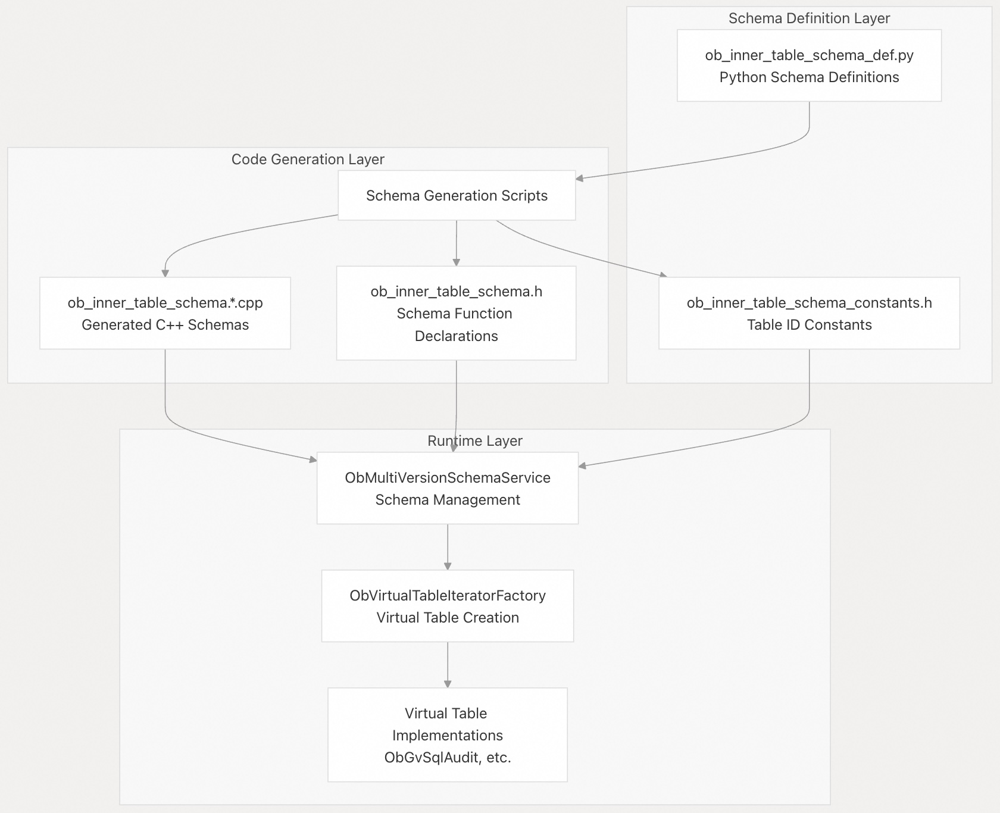
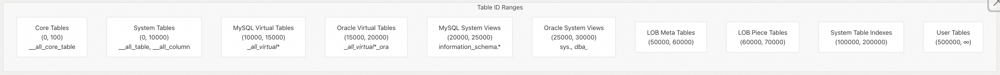
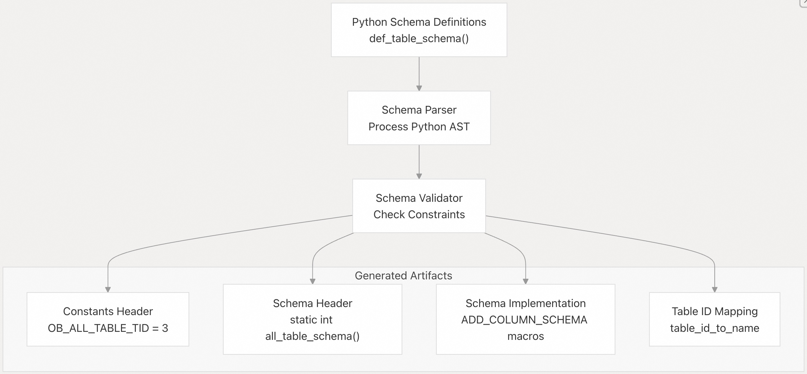
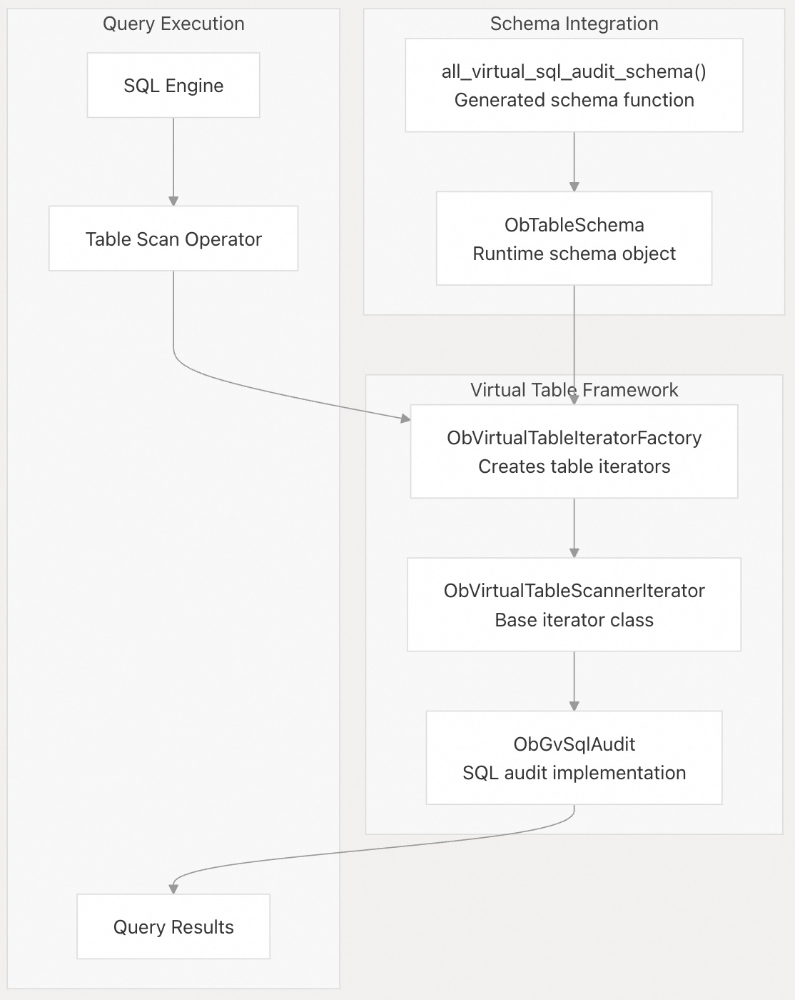

## 体系化剖析开源OB代码: 5.3 内部表 Schema 管理                       
                                          
### 作者                                  
digoal                                  
                                          
### 日期                                    
2025-10-15                                        
                                   
### 标签                                        
PostgreSQL , PolarDB , DuckDB , MySQL , OceanBase                                   
                                         
----                                     
                                     
## 背景                           
本文介绍 OceanBase 的内部表模式(Schema)管理系统，该系统定义并维护系统表、虚拟表和视图的元数据结构。该系统提供了一种集中式的方法，使用基于 Python 的定义来定义表模式(Schema)，这些定义会被编译成 C++ 代码以供运行时使用。  
  
## 概述  
OceanBase 的内部表模式管理系统负责定义、生成和维护所有系统内部表和视图的 Schema。该系统采用基于 Python 的定义框架，生成 C++ 代码，在提供类型安全和编译时验证的同时，保持了 Schema 演进的灵活性。  
  
### 系统架构  
  
  
  
**源文件:**  
- https://github.com/oceanbase/oceanbase/blob/8e2580cf/src/share/inner_table/ob_inner_table_schema_def.py#L1-L165
- https://github.com/oceanbase/oceanbase/blob/8e2580cf/src/share/inner_table/ob_inner_table_schema_constants.h#L1-L50
- https://github.com/oceanbase/oceanbase/blob/8e2580cf/src/share/inner_table/ob_inner_table_schema.h#L1-L50
  
## Schema 定义框架  
Schema 定义系统基于 Python 的 DSL（Domain Specific Language）构建，DSL 提供了一种声明式的方式来定义表模式。然后，Python 定义会被处理并生成相应的 C++ 代码。  
  
### 表 ID 范围和类别  
OceanBase 使用不相交的表 ID 范围来对不同类型的内部表进行分类( 有点类似 PostgreSQL OID ? )：  
  
  
  
**源文件:**  
- https://github.com/oceanbase/oceanbase/blob/8e2580cf/src/share/inner_table/ob_inner_table_schema_def.py#L5-L16
  
### Python Schema 定义结构  
Python 模式定义使用具有预定义字段和辅助函数的结构化方法：  
  
预定义字段	| 目的 |	例子  
---|---|---  
`table_name` | 	表标识符 |	`'__all_table'`  
`table_id` | 	唯一数字ID	| `'3'`  
`table_type` | 	表分类	| `'SYSTEM_TABLE'`，`'VIRTUAL_TABLE'`  
`rowkey_columns` | 	主键定义 |	`[('tenant_id', 'int'), ('table_id', 'int')]`  
`normal_columns` | 	非键列 |	`[('table_name', 'varchar:256'), ('schema_version', 'int')]`  
`partition_expr` | 	分区策略	| `['hash', 'tenant_id', 16]`  
  
系统支持各种列类型，包括`int`、`varchar`、`longtext`、`timestamp`和`varbinary`，并支持长度约束。  
  
**源文件:**  
- https://github.com/oceanbase/oceanbase/blob/8e2580cf/src/share/inner_table/ob_inner_table_schema_def.py#L86-L127
- https://github.com/oceanbase/oceanbase/blob/8e2580cf/src/share/inner_table/ob_inner_table_schema_def.py#L224-L334
  
## C++ 代码生成过程  
Schema 生成过程将 Python 定义转换为 C++ 实现：  
  
  
  
### 生成的 C++ Schema 函数  
每个表定义在 `ObInnerTableSchema` 类中生成一个对应的 C++ 函数：  
```  
// Generated from Python definition  
static int all_table_schema(share::schema::ObTableSchema &table_schema);  
static int all_column_schema(share::schema::ObTableSchema &table_schema);  
```  
  
使用 `ADD_COLUMN_SCHEMA` 宏来定义具有精确类型信息的列：  
  
**源文件:**  
- https://github.com/oceanbase/oceanbase/blob/8e2580cf/src/share/inner_table/ob_inner_table_schema.h#L344-L346
- https://github.com/oceanbase/oceanbase/blob/8e2580cf/src/share/inner_table/ob_inner_table_schema.1_50.cpp#L200-L250
  
## 虚拟表实现  
虚拟表提供系统状态的动态视图，并通过虚拟表迭代器框架实现：  
  
### 虚拟表架构  
  
  
  
**源文件:**  
- https://github.com/oceanbase/oceanbase/blob/8e2580cf/src/observer/virtual_table/ob_virtual_table_iterator_factory.cpp#L1-L50
- https://github.com/oceanbase/oceanbase/blob/8e2580cf/src/observer/virtual_table/ob_gv_sql_audit.h#L1-L50
  
### 列定义枚举  
系统生成列定义枚举用以进行 `type-safe` 的列访问：  
```  
struct ALL_VIRTUAL_PLAN_STAT_CDE {  
  enum {  
    TENANT_ID = common::OB_APP_MIN_COLUMN_ID,  
    SVR_IP,  
    SVR_PORT,  
    PLAN_ID,  
    SQL_ID,  
    // ... additional columns  
  };  
};  
```  
  
这些列定义枚举可在虚拟表实现中实现高效且 `type-safe` 的列访问。  
  
**源文件:**  
- https://github.com/oceanbase/oceanbase/blob/8e2580cf/src/share/inner_table/ob_inner_table_schema.h#L33-L113
  
## Schema 管理基础设施(Infra)  
### Schema 服务集成  
生成的 Schema 通过定义良好的接口与 `OceanBase 的模式管理系统` 集成：  
  
组件 |	责任  
---|---  
`ObMultiVersionSchemaService` |	管理 Schema 版本和缓存  
`ObSchemaService` |	提供 Schema 查找和验证  
`ObTableSchema` |	运行时 Schema 表示  
`ObInnerTableSchema` |	静态 Schema 生成函数  
  
### 系统视图 和 Information Schema  
schema management system 通过生成如下系统视图来支持 MySQL 和 Oracle 兼容性：  
- MySQL 兼容性：`information_schema` 视图类似 `TABLES`、`COLUMNS`、`STATISTICS`   
- Oracle 兼容性：`DBA_*`、`USER_*` 和 `ALL_*` 视图  
  
每个视图都被映射到提供了相关数据的底层虚拟表。  
  
**源文件:**  
- https://github.com/oceanbase/oceanbase/blob/8e2580cf/tools/deploy/mysql_test/test_suite/inner_table/r/mysql/desc_sys_views_in_mysql.result#L1-L50
- https://github.com/oceanbase/oceanbase/blob/8e2580cf/tools/deploy/mysql_test/test_suite/inner_table/r/mysql/desc_virtual_table_in_mysql.result#L1-L50
  
## Schema 演变和版本控制  
模式管理系统通过版本控制机制支持 Schema 演变：  
- 1、Schema 版本跟踪：每次 Schema 更改都会增加一个版本号  
- 2、向后兼容性：可以添加带 default 值的新列  
- 3、迁移支持：可以通过 DDL 操作应用 Schema 更改  
- 4、验证规则：列约束确保演变过程中的数据完整性  
    
系统通过要求新列可为空或具有默认值来保持兼容性，从而防止对现有功能进行重大更改。    
      
**源文件:**  
- https://github.com/oceanbase/oceanbase/blob/8e2580cf/src/share/inner_table/ob_inner_table_schema_def.py#L33-L36
  
#### [期望 PostgreSQL|开源PolarDB 增加什么功能?](https://github.com/digoal/blog/issues/76 "269ac3d1c492e938c0191101c7238216")
  
  
#### [PolarDB 开源数据库](https://openpolardb.com/home "57258f76c37864c6e6d23383d05714ea")
  
  
#### [PolarDB 学习图谱](https://www.aliyun.com/database/openpolardb/activity "8642f60e04ed0c814bf9cb9677976bd4")
  
  
#### [PostgreSQL 解决方案集合](../201706/20170601_02.md "40cff096e9ed7122c512b35d8561d9c8")
  
  
#### [德哥 / digoal's Github - 公益是一辈子的事.](https://github.com/digoal/blog/blob/master/README.md "22709685feb7cab07d30f30387f0a9ae")
  
  
#### [About 德哥](https://github.com/digoal/blog/blob/master/me/readme.md "a37735981e7704886ffd590565582dd0")
  
  

  
