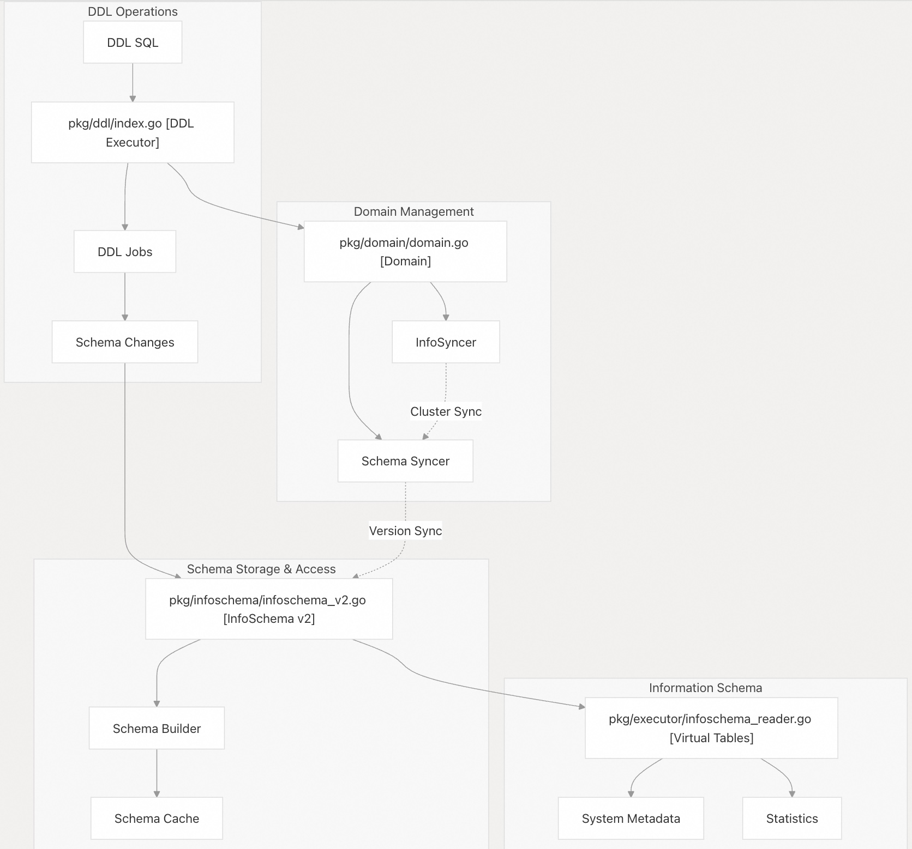

## TiDB 源码学习: 1 设计蓝图                         
                                            
### 作者                                    
digoal                                    
                                            
### 日期                                      
2025-10-15                                          
                                     
### 标签                                          
PostgreSQL , PolarDB , DuckDB , MySQL , TiDB                                     
                                           
----                                       
                                       
## 背景                             
开篇了, 第一篇照惯例俯瞰 TiDB 代码库设计蓝图。TiDB 是一个开源的分布式 SQL 数据库，它与 MySQL 兼容，并致力于实现水平扩展、强一致性和高可用性。TiDB 实现了无状态 SQL 层（TiDB Server），Server 层与分布式存储层（TiKV）和集群元数据管理器（PD，Placement Driver）协同工作。  
  
本文将综述 TiDB 主架构层、关键代码实体(代码文件)以及主要子系统之间的关系。  
  
## TiDB 系统架构  
TiDB 是由一组无状态 SQL 服务器(Server)组成的，它们与分布式存储和元数据服务进行协调。下图将系统概念映射到相应的代码实体(代码文件)：  
  
图：TiDB 系统架构及代码实体  
  
    
  
## 主要模块  
### SQL查询处理管道  
TiDB 中的 SQL 查询生命周期由一系列转换和执行实现，每个转换和执行都映射到特定的代码实体。下图展示了 SQL 查询处理主管道和支持系统：  
  
图：SQL 查询处理管道和代码实体  
  
    
  
### 存储、Schema和元数据管理  
TiDB 将计算和存储分离，使用键值接口与 TiKV 分布式存储引擎交互。Schema 和元数据通过分布式 DDL 和 InfoSchema 系统进行管理。  
  
图表：Schema 和 DDL 管理系统（代码实体）  
  
    
  
### 构建系统和开发工作流程  
TiDB 代码库使用 Go 模块进行依赖管理，并使用 Bazel 进行构建、测试和静态分析。构建系统(builder system)是基础，并支持所有其他组件。  
  
图表：构建和开发工作流程（代码实体）  
  
    
  
### 数据导入、导出和备份  
TiDB 提供了数据迁移、备份和恢复的工具。这些工具作为单独的模块实现，但与核心 TiDB 服务器和存储集成。  
  
工具	| 描述	| 关键代码实体/路径  
---|---|---  
导出(Dumpling)	| 逻辑数据导出	| `dumpling/`，`build/image/base`  
导入(Lightning)	| 高速数据导入	| `pkg/lightning/`，`build/image/base`  
备份和恢复(Backup & Restore)	| 备份和恢复	| `br/pkg/task/restore.go`  
  
## 关键接口和抽象  
代码库定义了几个支持模块化和测试的关键接口：  
- `exec.Executor` - 所有与 query 执行相关的通用接口  
- `kv.Storage` - 分布式存储后端的抽象  
- `sessionctx.Context` - 会话级上下文和变量管理  
- `infoschema.InfoSchema` - 元数据和 Schema 信息访问  
- `plannercore.Plan` - 查询计划(Query plan)表示和优化  
  
这些接口允许系统支持多个存储后端、执行策略和部署配置，同时保持各层之间的清晰分离。  
        
#### [期望 PostgreSQL|开源PolarDB 增加什么功能?](https://github.com/digoal/blog/issues/76 "269ac3d1c492e938c0191101c7238216")
  
  
#### [PolarDB 开源数据库](https://openpolardb.com/home "57258f76c37864c6e6d23383d05714ea")
  
  
#### [PolarDB 学习图谱](https://www.aliyun.com/database/openpolardb/activity "8642f60e04ed0c814bf9cb9677976bd4")
  
  
#### [PostgreSQL 解决方案集合](../201706/20170601_02.md "40cff096e9ed7122c512b35d8561d9c8")
  
  
#### [德哥 / digoal's Github - 公益是一辈子的事.](https://github.com/digoal/blog/blob/master/README.md "22709685feb7cab07d30f30387f0a9ae")
  
  
#### [About 德哥](https://github.com/digoal/blog/blob/master/me/readme.md "a37735981e7704886ffd590565582dd0")
  
  

  
