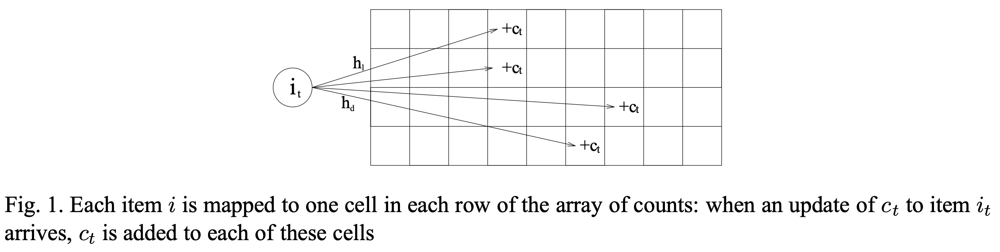
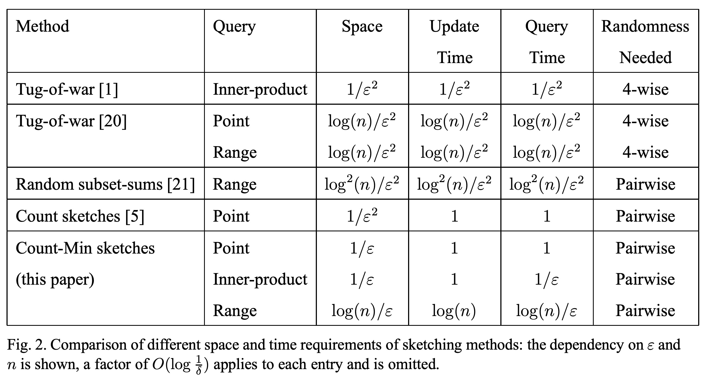

## AI论文解读 | An Improved Data Stream Summary: The Count-Min Sketch And Its Applications
        
### 作者        
digoal        
        
### 日期        
2025-10-16        
        
### 标签        
PostgreSQL , PolarDB , DuckDB , AI , 论文解读        
        
----        
        
## 背景  
      
http://dimacs.rutgers.edu/~graham/pubs/papers/cm-full.pdf        
  
提示:          
```          
读懂《An Improved Data Stream Summary: The Count-Min Sketch And Its Applications》这篇论文需要提前掌握哪些基础知识, 请使用中文通熟易懂的讲解这些基础知识, 可以引用论文中的图、表或使用Markdown支持的图形(text,mermaid等)增加解释性. 
  
使用中文通熟易懂的解读《An Improved Data Stream Summary: The Count-Min Sketch And Its Applications》这篇论文, 其中的关键内容请着重讲解, 可以引用论文中的图、表或使用Markdown支持的图形(text,mermaid等)增加解释性. 
  
提取《An Improved Data Stream Summary: The Count-Min Sketch And Its Applications》这篇论文中的重要术语, 使用中文对这些术语进行通熟易懂的讲解, 可以引用论文中的图、表或使用Markdown支持的图形(text,mermaid等)增加解释性. 
```     
  
## 1 前置知识 
  
要透彻理解这篇关于 Count-Min Sketch 的经典论文 ，你需要提前掌握以下几个核心基础知识。这篇论文的精髓在于它如何巧妙地运用哈希（Hashing）和概率论，在极小的空间内（即“亚线性空间” ）近似地“记住”一个庞大数据流 。

以下是你需要的基础知识，我会用通俗的语言为你讲解：

### 1\. 什么是“数据流” (Data Stream)？

**核心概念：** 数据流是指数据像水流一样源源不断地、快速地到来，你通常只有一次机会（One-Pass）看到它。

  * **论文中的体现：** 论文将数据流描述为一个不断更新的巨大向量 $a$ 。当一个更新 $(i_t, c_t)$ 到来时，它意味着向量的第 $i_t$ 个元素增加了 $c_t$ 这么多 。
  * **通俗理解：** 想象你在一个高速收费站，每通过一辆车（ 一个数据项 $i_t$ ），你就给这辆车的计费账户（ $a_{i_t}$ ）增加一笔费用（ $c_t$ ）。但车流量巨大，你不可能记住每辆车的完整通行记录。
  * **核心限制：** 最大的挑战是，你没有足够的内存（硬盘空间）来存储所有数据 。你需要用非常少的空间（论文称之为“概要”或 Sketch ）来总结整个数据流。

### 2\. 什么是“哈希函数” (Hash Function)？

**核心概念：** 哈希函数就像一个“分院帽”（来自《哈利·波特》）。它能把一个任意大小的输入（ 比如一个物品的名字 $i$ ），映射到一个固定大小的编号上（ 比如一个数组的索引位置 $j$ ）。

  * **论文中的体现：** CM Sketch 的核心结构是一个 $d \times w$ 的二维数组（你可以想象成 $d$ 行、 $w$ 列的表格）。它还选了 $d$ 个不同的哈希函数（ $h_1, ..., h_d$ ）。
  * **工作原理：** 当一个数据 $(i_t, c_t)$ 到来时，CM Sketch 会用这 $d$ 个哈希函数分别计算 $d$ 个位置。
      * 第 1 个哈希函数 $h_1$ 算出第 1 行的位置： $h_1(i_t)$
      * 第 2 个哈希函数 $h_2$ 算出第 2 行的位置： $h_2(i_t)$
      * ...
      * 第 $d$ 个哈希函数 $h_d$ 算出第 $d$ 行的位置： $h_d(i_t)$
  * 然后，它把 $c_t$ 这个值同时加到这 $d$ 个位置上 。

**图解（来自论文图1  的解释）：**



论文中的图1  非常好地展示了这个过程。

```text
         +---+---+---+---+---+---+
行 1:    |   |   |   |+c_t |   |   |  <-- h_1(i_t) 指向这里
         +---+---+---+---+---+---+
行 a:    |   |+c_t |   |   |   |   |  <-- h_a(i_t) 指向这里
         +---+---+---+---+---+---+
         ...
         +---+---+---+---+---+---+
行 d:    |   |   |   |   |   |+c_t |  <-- h_d(i_t) 指向这里
         +---+---+---+---+---+---+
           ^
           |
         (i_t)  <-- 新来的数据项
```

如图所示，一个数据项 $i_t$ 进来后，会被 $d$ 个不同的哈希函数（ 如图中的 $h_1, h_a, h_d$ ）映射到每一行的不同位置，然后把它的值 $c_t$ 累加到这些位置的计数器上 。

### 3\. 什么是“近似查询” (Approximate Query)？

**核心概念：** 由于我们没有存储所有原始数据，所以无法给出100%准确的答案。我们只能给出一个“八九不离十”的近似答案。

  * **论文中的体现：** 论文的目标是回答“点查询”（Point Query），即“物品 $i$ 出现了多少次？” 。
  * **CM Sketch 的做法：** 当你想查询 $i$ 的计数值时，它会再次用那 $d$ 个哈希函数找到 $d$ 个位置，并查看这 $d$ 个位置上的计数值。
  * **关键操作：** 它会返回这 $d$ 个值中的**最小值**（Min）。

**为什么取最小值？**
因为哈希函数可能会“碰撞”（Collision），即两个不同的物品 $i$ 和 $k$ 被同一个哈希函数 $h_j$ 映射到了同一个位置。这样一来，那个位置上的计数值就会是 $a_i + a_k + ...$ （以及其他碰撞物品的值），这个值必然**大于等于** $a_i$ 的真实值 。

我们查询的 $d$ 个值，都是被不同物品“污染”过的。但我们相信，这 $d$ 个值中，总有一个受到的“污染”最少。因此，取最小值是离真实值最近的估计 。

### 4\. 概率与近似保证 (ε 和 δ)

**核心概念：** 既然是近似，我们就必须在数学上描述“近似”的程度。这通常用两个参数来表示： $\epsilon$ (epsilon) 和 $\delta$ (delta)。

  * **$\epsilon$ (错误范围)：** 控制你“错多少”。
      * **通俗理解：** $\epsilon$ 越小，答案越准。
      * **论文中的体现：** 论文保证估计值 $\hat{a}_i$ 不会超过真实值 $a_i$ 太多，具体的错误范围是 $\epsilon \cdot ||a||_1$ （其中 $||a||_1$ 是所有计数的总和）。
  * **$\delta$ (失败概率)：** 控制你“多大概率会错”。
      * **通俗理解：** $\delta$ 越小，结果越可靠。
      * **论文中的体现：** 论文保证，上述的错误范围 $\epsilon \cdot ||a||_1$ 是有 $1-\delta$ 的概率成立的 。

**它们如何影响 Sketch？**
为了达到你设定的 $\epsilon$ 和 $\delta$ ，论文给出了 Sketch 应该设置多大 ：

1.  **宽度 $w$ （列数）** ： $w = \lceil e/\epsilon \rceil$ 。 $\epsilon$ 越小（要求越准）， $w$ 就越大（表格越宽）。这能减少哈希碰撞。
2.  **深度 $d$ （行数）** ： $d = \lceil \ln(1/\delta) \rceil$ 。 $\delta$ 越小（要求越可靠）， $d$ 就越大（哈希函数越多）。这能确保 $d$ 个值里取最小值的操作更可靠。

### 5\. 基础概率论（马尔可夫不等式）

**核心概念：** 论文的数学证明非常简洁，它依赖于一个基础的概率不等式：马尔可夫不等式 (Markov Inequality)。

  * **通俗理解：** 这个不等式说，“一个非负随机变量的值，会远远超过其平均值的概率是很小的”。
  * **论文中的体现：** 论文用这个不等式来证明 $\delta$ 概率保证 。他们计算出哈希碰撞带来的“额外错误”（ $X_{i,j}$ ）的期望（平均值）很小 ，然后用马尔可夫不等式证明，这个错误值变得非常大（ 超过 $\epsilon ||a||_1$ ）的概率极小 。

### 总结

要读懂这篇论文，你不需要成为数据挖掘专家，但你需要：

1.  理解**数据流**的限制（空间小、只能看一遍）。
2.  熟悉**哈希函数**的作用（映射、碰撞）。
3.  接受**近似**的概念（为什么只能近似，以及为什么取最小值）。
4.  了解 **$\epsilon$ 和 $\delta$** 这两个参数的含义（控制准确度和可靠度）。

掌握了这些，你就能明白 Count-Min Sketch 是如何用一个 $d \times w$ 的小表格，通过 $d$ 个哈希函数 ，巧妙地实现对海量数据流的快速、低内存、高可靠性的近似统计。
  
## 2 解读论文 
  
这是一篇数据流处理领域的奠基性论文 ，它介绍了一种名为 **Count-Min Sketch (CM Sketch)** 的全新数据结构 。

简单来说，这篇论文解决了一个核心问题：**当数据像洪水一样（即“数据流”）源源不断地涌来时，我们如何在极其有限的内存空间下，快速地、近似地“记住”每个数据项出现的次数？**

Count-Min Sketch 的革命性在于，它将解决这个问题的空间和时间成本，在关键因子上从 $O(1/\epsilon^2)$ 优化到了 $O(1/\epsilon)$ 。这里的 $\epsilon$ 是你允许的错误率，假设你允许1%的错误（ $\epsilon=0.01$ ）， $1/\epsilon^2$ 就是 10000，而 $1/\epsilon$ 仅为 100。这是一个巨大的飞跃。

### 1\. 核心问题：数据流的挑战

首先，我们得理解论文要处理的“数据流场景” 。

  * **海量数据：** 数据量极大，比如整个互联网的IP数据包，你无法将其全部存入内存 。
  * **持续更新：** 数据以“更新” $(i_t, c_t)$ 的形式不断到来 。这可以理解为：在 $t$ 时刻，第 $i_t$ 号物品的数量增加了 $c_t$ 。
  * **模型：**
      * **“收银机” (Cash Register) 模型：** $c_t$ 总是正数（只增加，不减少）。
      * **“十字转门” (Turnstile) 模型：** $c_t$ 可以是负数（有增有减），但保证任何时候 $a_i$ 的总数非负 。

**传统方法的困境：**
在 CM Sketch 出现之前，已有的“概要”(Sketch)结构存在几大痛点：

1.  **空间太大：** 空间复杂度通常依赖于 $O(1/\epsilon^2)$ 。
2.  **更新太慢：** 每次更新数据，可能需要的时间与整个 Sketch 的大小成正比 。
3.  **哈希太复杂：** 需要“p-wise”这种强独立性的哈希函数，计算复杂 。

### 2\. 关键内容：Count-Min Sketch 如何工作？

CM Sketch 的设计非常简洁、巧妙。它是一个二维数组（矩阵），命名为 `count` 。

**2.1 数据结构**

它由两个参数 $\epsilon$ （错误率）和 $\delta$ （失败概率）定义 。

1.  **宽度 $w$ ：** $w = \lceil e/\epsilon \rceil$ （ $e$ 是自然对数的底）。宽度 $w$ 与你期望的**错误率 $\epsilon$** 相关。 $\epsilon$ 越小（要求越准）， $w$ 越大。
2.  **深度 $d$ ：** $d = \lceil \ln(1/\delta) \rceil$ 。深度 $d$ 与你期望的**可靠性 $\delta$** 相关。 $\delta$ 越小（要求越可靠）， $d$ 越大。
3.  **哈希函数：** $d$ 个不同的哈希函数 $h_1, \dots, h_d$ 。这些哈希函数只需要“成对独立”(pairwise independent) ，这比以前的要求简单得多。

它的结构可以用下图表示：

```text
       <---- 宽度 w ( = ceil(e/ε) ) ---->
     列 1     列 2     ...     列 w
   +-------+-------+-------+-------+
行 1 | count[1,1] | ...   | ...   |count[1,w]|   <- h_1
   +-------+-------+-------+-------+
行 2 | count[2,1] | ...   | ...   |count[2,w]|   <- h_2
   +-------+-------+-------+-------+
...
   +-------+-------+-------+-------+
行 d | count[d,1] | ...   | ...   |count[d,w]|   <- h_d
   +-------+-------+-------+-------+
 ^
 | 深度 d ( = ceil(ln(1/δ)) )
```

**2.2 更新操作 (Update)**

这是 CM Sketch 极其高效的地方。当一个更新 $(i_t, c_t)$ 到达时 ：

CM Sketch 会用**所有 $d$ 个哈希函数**分别计算 $i_t$ 的位置，然后把 $c_t$ 加到这 $d$ 个位置上 。

**$\forall j \in [1, d]: \quad count[j, h_j(i_t)] = count[j, h_j(i_t)] + c_t$** 

这个过程就像论文图1所示意的那样（下图为该图的文字示意）： 

```text
            +---+---+---+---+---+---+
行 1:       |   |   |   |+c_t |   |   |  <-- h_1(i_t) 映射到这里
            +---+---+---+---+---+---+
行 2:       |   |+c_t |   |   |   |   |  <-- h_2(i_t) 映射到这里
            +---+---+---+---+---+---+
...
            +---+---+---+---+---+---+
行 d:       |   |   |   |   |   |+c_t |  <-- h_d(i_t) 映射到这里
            +---+---+---+---+---+---+
              ^
              |
          (i_t, c_t)  <-- 新来的更新
```

  * **速度极快：** 每次更新只需要计算 $d$ 个哈希值和 $d$ 次加法，时间复杂度为 $O(d)$ ，即 $O(\ln(1/\delta))$ 。这与数据总量 $n$ 和 Sketch 总大小 $wd$ 都无关，非常快 。

**2.3 查询操作 (Point Query)**

这是 CM Sketch 最精妙的地方，也是它名字的由来：“Count”（计数）和“Min”（取最小）。

当我们要查询物品 $i$ 的近似计数值 $\hat{a}_i$ 时 ：

1.  **Count (计数)：** 我们像更新一样，用 $d$ 个哈希函数 $h_1, \dots, h_d$ 找到 $d$ 个对应的位置，并读取这 $d$ 个位置上的值。
2.  **Min (取最小)：** 我们返回这 $d$ 个值中的**最小值** 。

**$\hat{a}\_i = \min\_{j=1 \dots d} count[j, h_j(i)]$**

### 3\. 灵魂解析：为什么“取最小值”是有效的？

理解了这一点，你就理解了 CM Sketch 的灵魂。

**关键洞察：哈希碰撞只会导致“高估”**

在“非负”模型下（ $c_t \ge 0$ ），我们来看 `count[j, h_j(i)]` 这个值里到底存了什么：
它存储了 $a_i$ （ $i$ 的真实计数值），**加上**所有其他“不幸”与 $i$ 碰撞到同一个位置的物品 $k$ 的计数值 $a_k$ （ 即 $h_j(k) = h_j(i)$ ）。

$count[j, h_j(i)] = a_i + \sum_{k \neq i, h_j(k)=h_j(i)} a_k$

由于 $a_k$ 都是非负的，所以这个“噪声” $\sum a_k$ 必然 $\ge 0$ 。
因此，我们得到的任何一个估计值 $count[j, h_j(i)]$ 都**必然大于等于** $a_i$ 的真实值 。

**$\hat{a}_i \ge a_i$** 

CM Sketch 永远不会低估（这是单边错误 ）。

**为什么取“最小”？**

  * 我们有 $d$ 个哈希函数，相当于 $d$ 次独立的“抽签”机会。
  * 每个 $count[j, h_j(i)]$ 都是一个被“污染”了的 $a_i$ 。
  * 因为哈希函数是随机的，我们期望总有一个 $j$ 使得 $h_j$ 发生的碰撞最少，即这个位置的“噪声”最小。
  * 通过取 $d$ 个值中的**最小值**，我们就是在选择那个“污染最轻”的估计值 。

**概率保证：**
论文接着用非常简单的**马尔可夫不等式** (Markov inequality)  证明（而不是像以前的工作那样使用复杂的切比雪夫或切诺夫界 ）：

1.  单个计数器 $count[j, h_j(i)]$ 中的“噪声”期望（平均值）很小，不超过 $\frac{\epsilon}{e} \cdot ||a||_1$ （ $||a||_1$ 是所有计数的总和 ）。
2.  利用马尔可夫不等式，可以证明这个噪声“大得离谱”（ 超过 $\epsilon \cdot ||a||_1$ ）的概率很小 。
3.  因为我们有 $d = \lceil \ln(1/\delta) \rceil$ 行，所以 $d$ 行的噪声 **全都** “大得离谱”的概率被控制在 $\delta$ 以下 。
4.  因此，至少有一行的噪声很小（ $\le \epsilon \cdot ||a||_1$ ）。

所以，我们取到的最小值 $\hat{a}_i$ 就能满足以下保证：
**以 $1-\delta$ 的概率， $\hat{a}_i \le a_i + \epsilon ||a||_1$** 。

### 4\. 拓展应用：CM Sketch 还能做什么？

CM Sketch 不仅仅能做“点查询”，它还可以作为“黑盒” ，高效解决其他数据流问题：

1.  **内积查询 (Inner Product Query)：** 近似计算两个向量 $a$ 和 $b$ 的内积 $a \odot b = \sum a_i b_i$ 。这在数据库中可用于估算 Join 的大小 。
2.  **范围查询 (Range Query)：** 近似计算 $\sum_{i=l}^r a_i$ 。论文采用了“二叉树” (dyadic ranges) 的思想，通过维护 $O(\log n)$ 个 CM Sketch 来实现 。
3.  **分位数 (Quantiles)：** 基于高效的范围查询，可以通过二分查找的方式快速找到任意 $\phi$ - 分位数 。
4.  **频繁项 (Heavy Hitters)：** 找到那些出现次数超过某个阈值 $\phi ||a||_1$ 的项 。CM Sketch 能以极快的速度解决这个问题 。

### 5\. 总结：革命性的对比

论文在图2 (Figure 2) 中清晰地对比了 CM Sketch 与先前工作的性能，下图是该表的简化版（仅对比 $\epsilon$ 因子）： 

| 方法 (Method) | 查询类型 (Query) | 空间 (Space) | 更新时间 (Update) |
| :--- | :--- | :--- | :--- |
| Tug-of-war [1] | 内积 (Inner-product) | $O(1/\epsilon^2)$ | $O(1/\epsilon^2)$ |
| Count sketches [5] | 点查询 (Point) | $O(1/\epsilon^2)$ | $O(1)$ |
| **Count-Min (本文)** | **点查询 (Point)** | **$O(1/\epsilon)$** | **$O(1)$** |
| **Count-Min (本文)** | **内积 (Inner-product)** | **$O(1/\epsilon)$** | **$O(1)$** |
| **Count-Min (本文)** | **范围 (Range)** | **$O(\log(n)/\epsilon)$** | **$O(\log n)$** |

注：上表忽略了所有 $O(\log(1/\delta))$ 因子

**结论：**
Count-Min Sketch 之所以成为经典，因为它：

1.  **更省空间：** 将关键的空间依赖从 $1/\epsilon^2$ 降至 $1/\epsilon$ 。
2.  **更新极快：** 更新时间仅为 $O(\log(1/\delta))$ ，与数据规模 $n$ 无关 。
3.  **足够简单：** 仅需成对独立的哈希函数 ，分析简单（仅用马尔可夫不等式），非常易于在实际中（甚至硬件中）实现 。
  
## 3 术语 
  
以下是论文《An Improved Data Stream Summary: The Count-Min Sketch and its Applications》中的一些重要术语及其通俗讲解：

### 1\. 核心概念

**数据流 (Data Stream)**

  * **讲解：** 想象一条永不停歇的河流，数据就像河水一样不断流过 。你通常只有一次机会看到它们，并且没有足够的内存（或硬盘）来存下所有流过的数据 。
  * **论文中的模型：** 论文将数据流抽象为一个非常非常大的向量 $\mathbf{a}$ 。当一个更新 $(i_t, c_t)$ 到来时，意味着向量的第 $i_t$ 个元素 $a_{i_t}$ 增加了 $c_t$ 。

**Sketch (概要 / 草图)**

  * **讲解：** 也称为 "Synopsis" (摘要) 。由于无法存储所有数据，我们创建并维护一个非常小的“总结”或“速写”，这就是 Sketch 。它占用的空间远小于原始数据（称为“亚线性空间” ），因此只能用来近似回答查询 。

**参数 $\epsilon$ (epsilon) 和 $\delta$ (delta)**

  * **讲解：** 这是用户在使用 Sketch 时设定的两个“容忍度”参数 。
      * **$\epsilon$ (Error / 错误率):** 你能容忍答案“错多少” 。 $\epsilon$ 越小（例如0.01），代表你要求错误范围越小，答案越准 。
      * **$\delta$ (Failure Probability / 失败概率):** 你能容忍“答案超出 $\epsilon$ 错误范围”这件事发生的概率有多大 。 $\delta$ 越小（例如0.001），代表你要求结果越可靠（即 $1-\delta$ 的概率保证结果正确）。

### 2\. CM Sketch 数据结构

**https://www.google.com/search?q=Count-https://www.google.com/search?q=Min Sketch (CM概要)**

  * **讲解：** 论文提出的核心数据结构，它是一种非常高效的 Sketch 。它本质上是一个 $d \times w$ 的二维数组（表格），里面全是计数器 。
  * **维度 (Dimensions):**
      * **宽度 $w = \lceil e/\epsilon \rceil$** 。宽度主要由 $\epsilon$ 控制。表格越宽，数据碰撞的概率越低，答案越准。
      * **深度 $d = \lceil \ln(1/\delta) \rceil$** 。深度主要由 $\delta$ 控制。表格越深（即哈希函数越多），结果的可靠性越高。

**成对独立 (Pairwise Independent)**

  * **讲解：** 这是 CM Sketch 对哈希函数的要求 。通俗地说，它不需要一个“完美”的随机哈希函数（那很慢），只需要保证任意两个不同的数据项 $i$ 和 $k$ ，它们被哈希到同一个位置的概率足够低（ 等于 $1/w$ ）。这个要求使得哈希函数构造简单且计算极快 。

### 3\. CM Sketch 的操作

**更新 (Update Procedure)**

  * **讲解：** 当一个更新 $(i_t, c_t)$ 到达时，CM Sketch 会用 $d$ 个不同的哈希函数（每一行对应一个）计算 $d$ 个位置 。然后，它把 $c_t$ 这个值**同时加到**这 $d$ 个位置的计数器上 。  
  * **示意图 (源自论文图1的描述 )：**
    ```text
    数据项 i_t 到达...

         h_1(i_t) ->   第1行, 第k_1列: +c_t
         h_2(i_t) ->   第2行, 第k_2列: +c_t
         ...
         h_d(i_t) ->   第d行, 第k_d列: +c_t


         <---- 宽度 w ---->
       +---+---+---+---+---+
    行 1 |   |   |+c_t |   |   |
       +---+---+---+---+---+
    行 2 |+c_t |   |   |   |   |
       +---+---+---+---+---+
       ...
       +---+---+---+---+---+
    行 d |   |   |   |+c_t |   |
       +---+---+---+---+---+
    ```

**点查询 (Point Query)**

  * **讲解：** 这是 CM Sketch 最核心的查询，意思是“查询数据项 $i$ 的当前计数值 $a_i$ 是多少？” 。
  * **操作：**
    1.  (https://www.google.com/search?q=Count): 像更新一样，用 $d$ 个哈希函数找到 $d$ 个对应的位置，读取这 $d$ 个计数器上的值 。
    2.  (https://www.google.com/search?q=Min): 返回这 $d$ 个值中的**最小值 (https://www.google.com/search?q=Minimum)** 。
  * **为什么有效：** 由于哈希碰撞，每个计数器上的值 $count[j, h_j(i)]$ 都是 $a_i$ 的真实值**加上**所有碰撞到这里的“噪声” 。因此，这个值必然 $\ge a_i$ （即 CM Sketch 永远不会低估）。我们取 $d$ 个值中的最小值，就是期望选中那个“噪声污染”最小、最接近真实值的估计 。

### 4\. 数据流模型

**收银机模型 (Cash Register Model)**

  * **讲解：** 一种数据流模型，其中所有的更新值 $c_t$ 都是正数（ $c_t > 0$ ）。这就像一个只能收款的收银机，金额只增不减。

**十字转门模型 (Turnstile Model)**

  * **讲解：** 一种更通用的模型，允许更新值 $c_t$ 为负数（即可以增加也可以减少）。就像一个十字转门，可以有人进（+1）也可以有人出（-1）。论文进一步区分了 $a_i$ 始终非负的“非负情况”和 $a_i$ 可以为负的“一般情况” 。

### 5\. 查询与应用

**$L_1$ 范数 ( $L_1$ norm )**

  * **讲解：** 指向量 $\mathbf{a}$ 中所有元素绝对值的总和，即 $||a||_1 = \sum |a_i|$ 。在 CM Sketch 中，点查询的错误保证是与 $||a||_1$ 相关的：估计值 $\hat{a}_i$ 不会超过 $a_i + \epsilon ||a||_1$ 。

**范围查询 (Range Query)**

  * **讲解：** 查询一个区间 $[l, r]$ 内所有项的计数值总和 $\sum_{i=l}^r a_i$ 。
  * **二进范围 (Dyadic Ranges):** 论文中使用的一种高效解决范围查询的技巧 。它指形如 $[x2^y+1 \dots (x+1)2^y]$ 的标准区间 。任何范围 $[l, r]$ 都可以被拆解为 $O(\log n)$ 个不重叠的二进范围 。通过为不同层级的二进范围维护 CM Sketch，就可以高效回答范围查询 。

**频繁项 / 重击者 (Heavy Hitters)**

  * **讲解：** 指数据流中那些“重量级”的项 。即那些计数值 $a_i$ 超过总计数 $||a||_1$ 一个特定比例 $\phi$ 的项 ( 即 $a_i \ge \phi ||a||_1$ ) 。CM Sketch 可以高效地找出这些项 。

**分位数 (Quantiles)**

  * **讲解：** 找到数据流中的“中位数”或“95百分位”这样的项 。例如，找到排名在第 $k\phi ||a||_1$ 的项 。CM Sketch 可以通过其高效的范围查询能力来解决这个问题 。
  
## 参考        
         
http://dimacs.rutgers.edu/~graham/pubs/papers/cm-full.pdf    
        
<b> 以上内容基于DeepSeek、Qwen、Gemini及诸多AI生成, 轻微人工调整, 感谢杭州深度求索人工智能、阿里云、Google等公司. </b>        
        
<b> AI 生成的内容请自行辨别正确性, 当然也多了些许踩坑的乐趣, 毕竟冒险是每个男人的天性.  </b>        
  
    
#### [期望 PostgreSQL|开源PolarDB 增加什么功能?](https://github.com/digoal/blog/issues/76 "269ac3d1c492e938c0191101c7238216")
  
  
#### [PolarDB 开源数据库](https://openpolardb.com/home "57258f76c37864c6e6d23383d05714ea")
  
  
#### [PolarDB 学习图谱](https://www.aliyun.com/database/openpolardb/activity "8642f60e04ed0c814bf9cb9677976bd4")
  
  
#### [PostgreSQL 解决方案集合](../201706/20170601_02.md "40cff096e9ed7122c512b35d8561d9c8")
  
  
#### [德哥 / digoal's Github - 公益是一辈子的事.](https://github.com/digoal/blog/blob/master/README.md "22709685feb7cab07d30f30387f0a9ae")
  
  
#### [About 德哥](https://github.com/digoal/blog/blob/master/me/readme.md "a37735981e7704886ffd590565582dd0")
  
  

  
