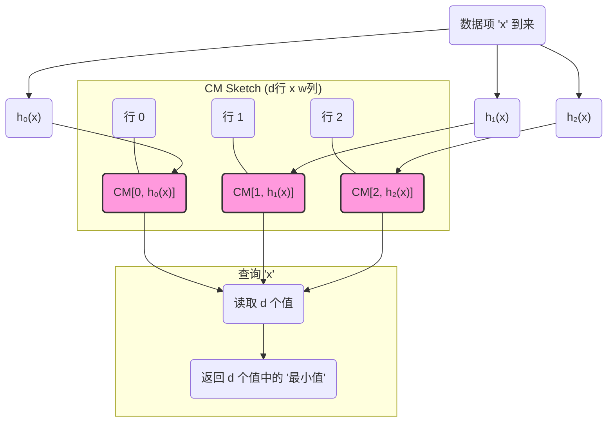
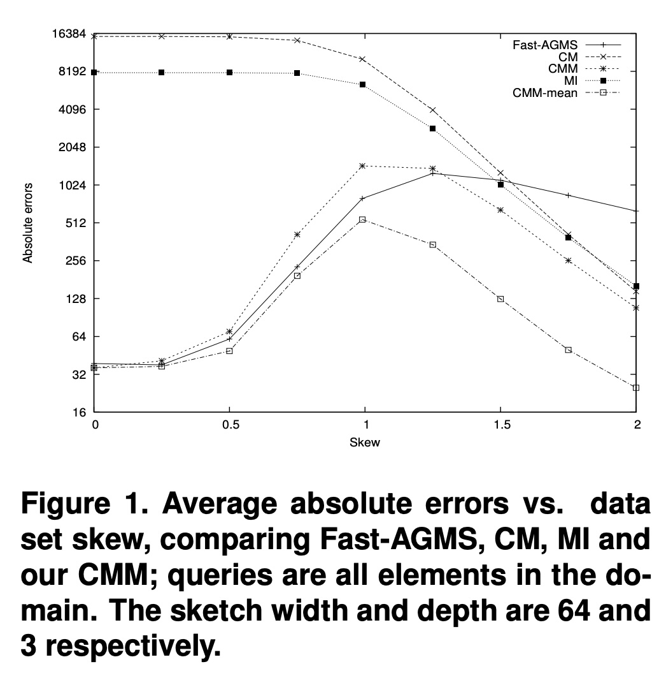
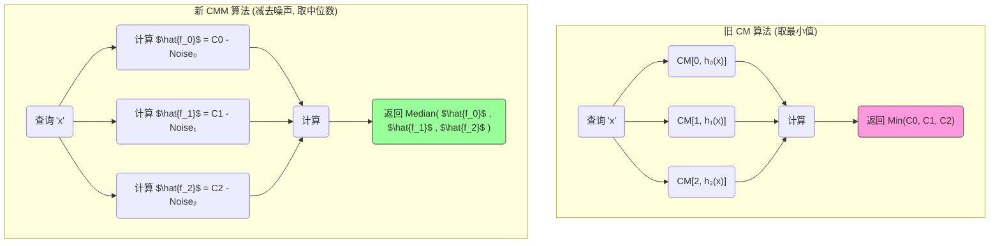
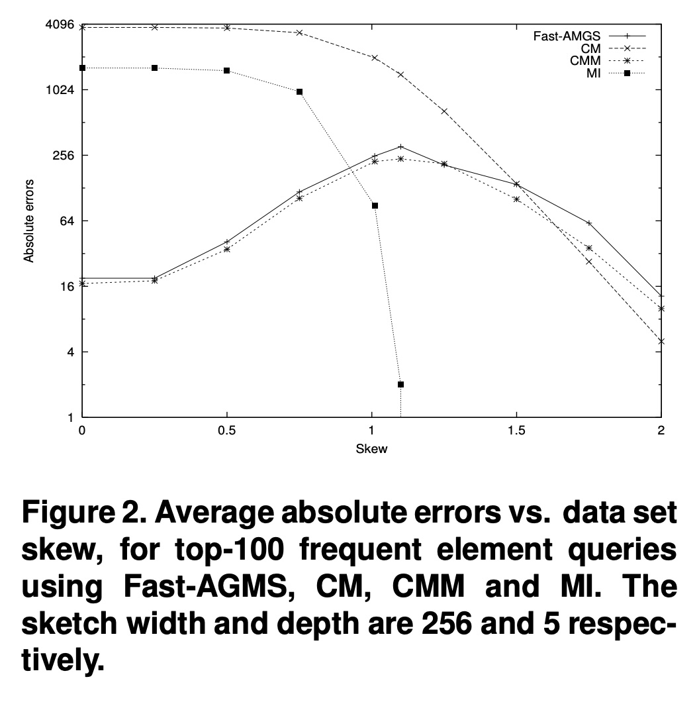
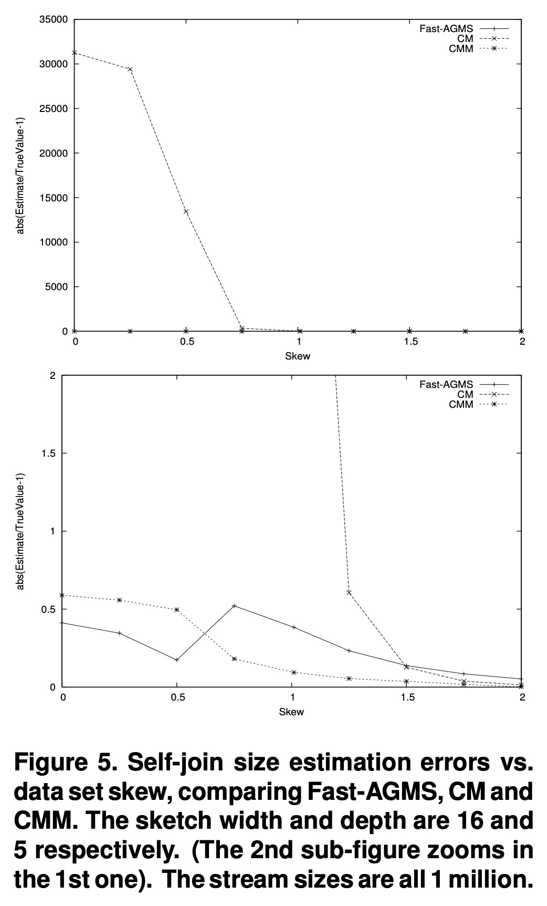

## AI论文解读 | New Estimation Algorithms For Streaming Data: Count-Min Can Do More
        
### 作者        
digoal        
        
### 日期        
2025-10-16        
        
### 标签        
PostgreSQL , PolarDB , DuckDB , AI , 论文解读        
        
----        
        
## 背景  
      
https://webdocs.cs.ualberta.ca/~drafiei/papers/cmm.pdf        
  
提示:          
```          
读懂《New Estimation Algorithms For Streaming Data: Count-Min Can Do More》这篇论文需要提前掌握哪些基础知识, 请使用中文通熟易懂的讲解这些基础知识, 可以引用论文中的图、表或使用Markdown支持的图形(text,mermaid等)增加解释性. 
  
使用中文通熟易懂的解读《New Estimation Algorithms For Streaming Data: Count-Min Can Do More》这篇论文, 其中的关键内容请着重讲解, 可以引用论文中的图、表或使用Markdown支持的图形(text,mermaid等)增加解释性. 
  
提取《New Estimation Algorithms For Streaming Data: Count-Min Can Do More》这篇论文中的重要术语, 使用中文对这些术语进行通熟易懂的讲解, 可以引用论文中的图、表或使用Markdown支持的图形(text,mermaid等)增加解释性. 
```     
  
## 1 前置知识 
  
要读懂这篇论文《New Estimation Algorithms for Streaming Data: Count-min Can Do More》 ，你需要对“数据流处理”和“近似查询算法”领域的一些基本概念有所了解。这篇论文的核心是提出一种新算法（CMM） ，它改进了已有的 Count-Min (CM) 摘要结构 ，使其在更多场景下能媲美甚至超越另一种主流算法 Fast-AGMS (Count-Sketch) 。

以下是你需要提前掌握的基础知识，我会用通俗易懂的方式为你讲解：

### 1\. 什么是数据流 (Data Stream)?

想象一下你家水龙头打开后的水，水流是连续不断的。**数据流**  就像这个水流，它是指数据以极快的速度、连续不断地到来 ，例如：

  * 网站的实时点击记录 
  * 骨干网络路由器的IP流量数据 
  * 传感器的实时读数 

**数据流的核心挑战：**

1.  **量太大：** 你不可能把所有数据都存下来（比如存到硬盘上），因为内存和硬盘空间有限 。
2.  **速度太快：** 数据来得太快，你来不及对每个数据都进行复杂处理，更不可能“回头”去重新扫描数据 。
3.  **单遍处理 (One Pass)：** 算法必须在数据到达时立即处理它，并且处理完就（基本）丢弃，这叫“单遍处理” 。

### 2\. 什么是 Sketch (数据摘要)?

面对“存不下”和“算不完”的挑战，我们只能退而求其次：**不追求100%的精确答案，而是追求一个“八九不离十”的近似答案** 。

**Sketch (摘要)** 就是为了实现这个目标的“小本本” 。它是一种高度压缩的数据结构（通常是一个小数组或矩阵），用非常有限的内存（比如几 MB）来“总结”整个庞大的数据流（比如几 TB）。

当新数据到来时，Sketch 会用一种特殊的方式（哈希函数）快速更新这个“小本本” 。当需要查询时，我们就去查这个“小本本”，它会给我们一个近似值 。

### 3\. 什么是哈希函数 (Hash Function)?

这是所有 Sketch 技术的核心工具。你可以把**哈希函数**想象成一个“搅拌机”或“映射器”。

  * 它能把任意数据（比如一个IP地址、一个网址）“搅拌”成一个固定范围内的数字（比如 0 到 99 之间）。
  * 这个过程非常快，而且对于同一个输入，总是得到同一个输出。
  * 理想情况下，它会把不同的输入“均匀地”搅拌到所有可能的输出数字上 。

**关键问题：哈希冲突 (Hash Collision)**
如果两个**不同**的数据（比如 “A” 和 “B”）经过哈希函数“搅拌”后，得到了**相同**的数字（比如 5），这就叫哈希冲突。在 Sketch 中，这意味着 “A” 和 “B” 的信息会被累加到同一个计数器上，导致计数器值偏高 。**这（冲突）是所有近似算法产生误差的主要来源**，论文中称之为“噪声 (noise)” 。

### 4\. 论文中重点解决的两类查询

这篇论文主要关注两种查询 ：

1.  **多重性查询 (Multiplicity / Point Query)：**

      * **通俗讲：** "某个特定项（比如 IP 地址 1.2.3.4）在数据流中出现了多少次？" 。
      * **应用：** 找到访问量最大的网页（Top-K查询）、识别网络攻击（冰山查询）等的基础 。

2.  **自连接大小估计 (Self-Join Size)：**

      * **通俗讲：** 也叫“二阶频率矩”( $F_2$ ) 。
      * **公式：** $\sum f_i^2$ ，其中 $f_i$ 是数据流中第 $i$ 个项的出现次数 。
      * **意义：** 这个值反映了**数据的“倾斜”程度 (Skew)** 。
          * 如果数据很**均匀**（所有项出现次数都差不多），这个值会很小。
          * 如果数据很**倾斜**（少数项出现了绝大多数次，比如“二八定律”），这个值会非常大。
      * 论文提到，旧的 Count-Min 算法只在数据**高度倾斜**时表现好 。

### 5\. 必须理解的两种核心 Sketch (论文的“主角”和“对手”)

这篇论文的标题是“Count-Min 能做更多”，它就是在讲 Count-Min (CM) 这种 Sketch。你需要了解 CM 是如何工作的，以及它的主要竞争对手 Fast-AGMS 是如何工作的。

#### A. Count-Min Sketch (CM) 

这是本文要改进的主角。

  * **结构：** 一个 $d \times w$ 的二维数组（ $d$ 行, $w$ 列 ），可以想象成 $d$ 个独立的记分牌 。
  * **哈希：** 需要 $d$ 个**不同**的哈希函数 ( $h_0, h_1, ...$ )，每行（每个记分牌）对应一个 。
  * **更新 (项 $x$ 到来)：**
    1.  对**每一行** $i$ （ 从 0 到 $d-1$ ）：
    2.  计算 $j = h_i(x)$ （ $x$ 在第 $i$ 个记分牌上的位置 ）。
    3.  将该位置的计数器 $CM[i, j]$ 加 1 。
  * **查询 ( $x$ 的次数 )：**
    1.  对**每一行** $i$ （ 从 0 到 $d-1$ ）：
    2.  计算 $j = h_i(x)$ 。
    3.  读取 $d$ 个计数器的值： $CM[0, h_0(x)], CM[1, h_1(x)], ...$
    4.  返回这 $d$ 个值中的**最小值 (Minimum)** 。

**CM 的逻辑：**
由于哈希冲突，每个计数器 $CM[i, j]$ 的值**总是大于或等于** $x$ 的真实次数（因为别的项也可能撞到这里）。这叫“单边误差” 。我们有 $d$ 个独立的估计值，我们相信那个**最小的值**是受“噪声”污染最少的，因此最接近真实值 。



#### B. Fast-AGMS Sketch (也叫 Count-Sketch) 

这是 CM 的主要竞争对手，论文中反复用来对比 。

  * **结构：** 也是一个 $d \times w$ 的二维数组 。
  * **哈希：** 每行需要**两组**哈希函数：
    1.  $h_i$ ：决定更新哪一列（位置）。
    2.  $s_i$ ：决定是 +1 还是 -1（符号）。
  * **更新 (项 $x$ 到来)：**
    1.  对**每一行** $i$ ：
    2.  计算位置 $j = h_i(x)$ 。
    3.  计算符号 $v = s_i(x)$ (得到 +1 或 -1)。
    4.  将 $CM[i, j]$ 加上 $v$ ( 即 $CM[i, j] = CM[i, j] + v$ ) 。
  * **查询 ( $x$ 的次数 )：**
    1.  对**每一行** $i$ ：
    2.  计算位置 $j = h_i(x)$ 和符号 $v = s_i(x)$ 。
    3.  获取估计值 $v \times CM[i, j]$ (用符号 $v$ 乘以计数器的值)。
    4.  返回这 $d$ 个估计值中的**中位数 (Median)** 。

**Fast-AGMS 的逻辑：**
这种“加/减”操作非常巧妙。当别的项 $y$ 与 $x$ 冲突（ $h_i(x) = h_i(y)$ ）时， $y$ 带来的噪声可能是 +1 或 -1，在统计上它们会相互抵消。因此，它的估计是**无偏的 (Unbiased)** ，即估计值可能偏高也可能偏低，但平均来看是准确的。

### 6\. 统计学基础

  * **有偏估计 (Biased) vs. 无偏估计 (Unbiased)：**
      * **有偏：** 估计值系统性地偏高或偏低。CM 的估计总是偏高（单边误差）。
      * **无偏：** 估计值的期望等于真实值。Fast-AGMS 是无偏的 。论文的**核心贡献之一**就是为 CM 结构设计了一种**无偏估计**的新算法 CMM 。
  * **方差 (Variance)：** 衡量估计值稳定性的指标。方差越小，估计值越接近真实值 。论文证明了他们的新 CMM 算法与 Fast-AGMS 具有**相同的方差** 。
  * **均值 (Mean) vs. 中位数 (Median) vs. 最小值 (Minimum)：**
      * CM 用**最小值** 。
      * Fast-AGMS 用**中位数** 。
      * 本文提出的 CMM 算法也用**中位数** 。中位数的好处是不容易受极端异常值（噪声特别大）的影响。
  * **数据倾斜 (Skew) / Zipfian 分布：**
      * 这是评估算法性能时常用的一种数据模型 。
      * 低倾斜（比如 Zipf 参数为 0）意味着数据是**均匀分布**的。
      * 高倾斜（比如 Zipf 参数为 2）意味着数据是**高度集中**的。
      * 观察论文中的图 1 ：横坐标是 Skew（倾斜度）。你会发现 CM 算法（虚线）在低倾斜度时误差（纵坐标）非常高，但在高倾斜度时误差反而下降了。而 Fast-AGMS 和论文提出的 CMM 在低倾斜度时表现好得多。 

### 总结：你需要知道什么？

1.  **背景：** 数据流太大存不下，必须用 Sketch 做**近似查询**。
2.  **工具：** Sketch 依赖**哈希函数**，但哈希会带来 **冲突（噪声）** ，导致误差。
3.  **查询类型：** 重点是查“出现次数”（Multiplicity）和“数据倾斜度”（Self-Join Size）。
4.  **旧算法 (CM)：** 用 $d$ 个哈希，更新时总是 `+1`，查询时取**最小值**。它有**单边误差**（总偏高），只在数据**高度倾斜**时好用 。
5.  **竞争算法 (Fast-AGMS)：** 用 $d \times 2$ 个哈希，更新时 `+1` 或 `-1`，查询时取**中位数**。它是**无偏的**，在各种倾斜度下都表现不错 。

**读这篇论文时，你的重点是看懂：**
作者是如何在**不改变 CM 结构**  的前提下，仅仅通过一种新的**查询计算方法**（他们称之为 CMM ，核心思想是“估计并减去噪声” ），就让 CM 达到了 Fast-AGMS 一样的**无偏性**  和**低方差** ，从而在低倾斜数据上也能表现出色 。
  
## 2 解读论文 
  
这是一篇关于数据流处理的经典论文。用一句话总结：

**这篇论文给古老的 Count-Min (CM) 摘要算法设计了一个“性能升级包”（即 CMM 算法），让它在保持原有优势的同时，还能在它不擅长的领域（低倾斜数据）上达到和竞争对手 (Fast-AGMS) 一样的高精度 。**

这使得 Count-Min 成为一个更加灵活和强大的“瑞士军刀”式工具 。

-----

为了帮您彻底理解，我们来通俗地拆解这篇论文的关键内容：

### 1\. 背景：Count-Min (CM) 是什么？它有什么痛点？

想象一下，你需要在高速公路上统计每种颜色汽车的流量，但你只有一个很小的记事本。数据流（汽车）源源不断，你不可能记下每一辆车，只能用“摘要”(Sketch) 来估算。

  * **Count-Min (CM) 摘要**：是Cormode和Muthukrishnan在2005年提出的一种经典摘要结构 。它就像一个 $d \times w$ 的二维记分牌（ $d$ 行, $w$ 列 ） 。

  * **CM 的工作方式**：

    1.  **更新**：当一辆“蓝色”汽车（ 数据项 $x$ ）开过，你用 $d$ 个不同的哈希函数（可以理解为 $d$ 种不同的“随机分配规则”）。
    2.  第1个规则说 $CM[0, h_0(x)]$ 计数器加 1。
    3.  第2个规则说 $CM[1, h_1(x)]$ 计数器加 1。
    4.  ...
    5.  你把 $d$ 个对应位置都加 1 。
    6.  **查询（旧算法）** ：当你想知道“蓝色”汽车有多少辆时，你用同样的 $d$ 个规则找到那 $d$ 个计数器，然后**返回它们中的最小值** 。

  * **CM 的痛点**：

      * **哈希冲突**：很可能“红色”汽车的某个规则也会指向“蓝色”汽车的计数器，导致计数器虚高。
      * **单边误差 (One-sided Error)**：CM 返回的最小值 *永远* 大于或等于真实值 。
      * **实际表现（论文的核心发现）** ：作者们通过实验发现，这种“取最小值”的旧算法，**只有在数据分布极不均匀（高度倾斜，如“二八定律”）时才比较准** 。
      * **被对手吊打**：如果数据分布比较均匀（例如，每种颜色的车差不多多），CM 的误差会变得非常大 。而它的竞争对手 **Fast-AGMS** (也叫 Count-Sketch) 在这种情况下表现得好得多 。

下面这个（简化的）图表展示了论文发现的“痛点”：
````
```mermaid
xychart-beta
    title "论文发现的问题：旧 CM 算法的性能 [类比: 188]"
    x-axis "数据倾斜度 (Skew)" [0, 2]
    y-axis "估计误差 (Error)" [0, 100]
    line "Fast-AGMS (对手)" (0, 10), (0.5, 15), (1, 20), (1.5, 15), (2, 10)
    line "CM (旧算法)" (0, 90), (0.5, 80), (1, 40), (1.5, 15), (2, 5)

    legend [ "Fast-AGMS (对手)", "CM (旧算法)" ]
    note "在低倾斜 (0.0) 时" at (0, 90) : "CM 误差巨大 "
    note "在低倾斜 (0.0) 时" at (0, 10) : "Fast-AGMS 表现很好 "
    note "在高倾斜 (2.0) 时" at (2, 5) : "CM 表现很好 "
```
````

### 2\. 核心贡献：CMM 算法 (Count-Mean-Min)

面对这个“痛点”，作者们没有重新设计一个新的数据结构，而是在 *原有* 的 Count-Min 记分牌上，设计了一种全新的**查询算法**，他们称之为 **CMM** (Count-Mean-Min) 。

**CMM 的核心思想：估计并减去“噪声”**

旧的 CM 算法（取最小值）太保守了，它知道每个计数器都“脏了”（有噪声），所以只敢取最小的那个 。

CMM 算法则更进一步 ：

1.  **承认噪声**：它承认一个计数器 $C$ 的值 = $真实值 + 噪声$ 。
2.  **估计噪声**：它试图估算出这个“噪声”大概有多大 。
3.  **减去噪声**：它从 $C$ 中减去这个估计的噪声，得到一个更接近真实值的“残差” 。

**CMM 具体如何估计噪声？**

这是一个非常巧妙的设计：

  * 我们知道，在 CM 的第 $i$ 行（第 $i$ 个记分牌），所有 $w$ 个计数器的总和，等于数据流的总大小 $N$ 。
  * 当我们要查询项 $q$ （“蓝色”汽车）时，我们查看它在第 $i$ 行的计数器 $C = CM[i, h_i(q)]$ 。
  * 这个 $C$ 包含了 $q$ 的真实值 $f_q$ ，以及其他所有撞到这个位置的项（噪声）。
  * **关键假设**：噪声是“均匀”地洒在所有 $w$ 个计数器上的。
  * **噪声估计**：作者提出，可以**用所有 其他 $w-1$ 个 计数器的平均值**来估计 $C$ 桶里的噪声 。
  * 所有其他计数器的总和是： $N - C$ 。
  * 它们的平均值（即噪声估计值）是： $Noise = (N - C) / (w - 1)$ 。
  * **CMM 的新估计值**（来自第 $i$ 行）： $\hat{f_i} = C - Noise = CM[i, h_i(q)] - (N - CM[i, h_i(q)]) / (w - 1)$ 。

**最后一步：取中位数**
旧 CM 算法是取 $d$ 个估计值的**最小值** 。
新 CMM 算法是取 $d$ 个“残差”估计值 $\hat{f_0}, \hat{f_1}, ...$ 的**中位数** (Median) 。



### 3\. 实验结果：CMM 真的有效吗？

论文通过大量实验证明，CMM 算法的效果非常好。

  * **理论上**：作者证明了 CMM 算法是**无偏估计** (Unbiased) ，这意味着它的估计值不会系统性地偏高或偏低。这与 Fast-AGMS 的特性一致 。并且，CMM 和 Fast-AGMS 的估计方差（衡量误差大小的指标）也几乎相同 。

  * **实践中**：

      * **多重性查询（见图1, 图2）** ：在数据**不倾斜**（Skew 接近 0）时，CMM（图中的 `CMM` 和 `CMM-mean`）的误差远低于旧的 `CM` 算法 ，并且和 `Fast-AGMS` 的误差曲线几乎重叠 。       
      * **自连接大小查询（见图5）** ：这是另一个重要查询，用于估计数据的倾斜度 。结果更夸张，在低倾斜时，旧 `CM` 算法的误差高到“爆表”（纵坐标高达 30000+），而 `CMM` 和 `Fast-AGMS` 的误差则非常小，几乎相同 。    

**结论**：实验证明，CMM 算法成功地让 Count-Min 在“低倾斜”这个弱点上，达到了与 Fast-AGMS 相同的SOTA（State-of-the-art）水平 。

### 4\. 论文的“点睛之笔”：为什么 CM "Can Do More"？

这篇论文的真正影响力在于它提出了一个观点：Count-Min 结构现在比 Fast-AGMS **更灵活** 。

想象一下，你现在拥有了 Count-Min 这个“记分牌”和两个“查询工具”：

1.  **工具A（旧 CM 算法）** ：取最小值。

      * **优点**：能提供“单边误差”保证 。这在某些场景下至关重要。例如，在“查找所有访问量超过100万的网页”（冰山查询）时，CM 算法能保证**绝不会漏掉**任何一个达标的网页（没有假阴性），它只会多返回一些不达标的（假阳性）。
      * **缺点**：在低倾斜数据上，误差较大 。

2.  **工具B（新 CMM 算法）** ：减噪声，取中位数。

      * **优点**：无偏估计 ，在所有数据分布（尤其是低倾斜）上都非常准确 ，精度媲美 Fast-AGMS 。
      * **缺点**：没有“单边误差”保证，估计值可能偏高也可能偏低。

**结论就是：**
Fast-AGMS 这种结构，*只能* 提供工具B（高精度无偏估计）。
而 Count-Min 这种结构，现在可以让你**自由选择**：

  * 当你需要“单边误差”保证时，你就用工具A（旧 CM 算法）。
  * 当你需要“最高精度”时，你就用工具B（新 CMM 算法）。

你只需要构建**一个** Count-Min 摘要，就能享受两种算法的好处，因此 Count-Min "Can Do More" 。
  
## 3 术语 
  
好的，这篇论文《New Estimation Algorithms for Streaming Data: Count-min Can Do More》的核心在于提出了一种名为**CMM**的新算法，旨在改进现有的**Count-min sketch**技术，使其在处理各类数据时都能获得与**Fast-AGMS**相媲美的精确度。

以下是该论文中关键术语的中文讲解，并结合了论文中的图表进行说明，以帮助您更好地理解。

### 核心概念

#### 1\. 数据流 (Data Stream)

  * **讲解**:
    数据流可以想象成一个源源不断、持续到达的数据序列，就像一条永不停歇的河流 。由于数据量巨大甚至无限，我们通常无法将其完全存储下来再进行处理 。因此，我们需要高效的算法，能够在数据到达时进行实时分析，并且只使用有限的内存 。典型的应用场景包括实时分析网络流量、监控传感器网络数据、追踪网站点击流等 。

#### 2\. 概要 (Sketch)

  * **讲解**:
    "概要"是一种数据结构，它通过一次性遍历数据流来构建一个高度浓缩的数据摘要 。这个摘要的体积远小于原始数据，但保留了数据的关键统计特征 。使用概要进行查询时，得到的结果通常是近似值，但其优点是空间占用小、处理速度快，非常适合数据流环境 。论文中重点讨论了两种著名的概要技术：**Count-min Sketch** 和 **Fast-AGMS Sketch** 。

-----

### 解决的问题 (查询类型)

#### 3\. 多重性查询 / 点查询 (Multiplicity Query / Point Query)

  * **讲解**:
    这是数据流分析中的一个基本问题，即查询某个特定数据项在数据流中总共出现了多少次 。例如，在网络流量分析中，查询某个特定IP地址发起了多少次连接请求。这个问题也被称为频率查询（frequency query）。

#### 4\. 自连接大小 / 二阶频率矩 (Self-join Size / Second Frequency Moment)

  * **讲解**:
    自连接大小的数学定义是数据流中所有不同数据项出现频率的平方和，即 $\sum f_i^2$ ，其中 $f_i$ 是数据项 $i$ 的频率 。这个值可以被通俗地理解为衡量**数据倾斜度**的一个关键指标 。
      * 如果数据分布非常均匀（例如，每个数据项都只出现1次），那么这个值会很小。
      * 如果数据分布非常倾斜，即少数数据项占据了绝大多数的出现次数，那么这个值会非常大 。
        了解数据的倾斜度有助于优化查询策略和选择更合适的算法 。

-----

### 核心技术与算法

#### 5\. Count-min Sketch (CM Sketch)

  * **讲解**:
    这是一种由 Cormode 和 Muthukrishnan 提出的高效概要数据结构 。它是一个二维的计数器数组（可以想象成一个表格）。
      * **工作原理**: 当一个新数据项到达时，会使用多组（d组）独立的哈希函数，将这个数据项映射到每一行的一个位置，并给对应位置的计数器加一 。
      * **查询方式 (CM算法)**: 在查询某个数据项的频率时，同样用这些哈希函数找到它在每一行对应的计数器，然后返回这些计数器中的**最小值**作为估计结果 。这个估计值保证**不会低于**真实频率（即单边误差）。
      * **问题**: 论文指出，传统的CM算法仅在数据高度倾斜时表现良好，在数据分布较为均匀时，其准确性远不如Fast-AGMS 。

#### 6\. Fast-AGMS Sketch (又名 Count-sketch)

  * **讲解**:
    这是另一种影响力很大的概要技术 。
      * **工作原理**: 它也使用一个二维计数器数组。但与CM不同的是，当一个数据项到来时，它除了用哈希函数确定每行要更新的计数器位置外，还会用**第二个哈希函数**随机生成一个符号（+1 或 -1），然后将这个符号值累加到计数器上 。
      * **查询方式**: 查询时，同样计算出每行对应的计数值，再乘以对应的符号（+1或-1），最后返回所有行结果的**中位数** 。这个估计是**无偏**的，意味着估计结果可能高于也可能低于真实值，但其期望值等于真实值 。

#### 7\. CMM 算法 (Count-Mean-Min)

  * **讲解**:
    这是本篇论文提出的核心创新算法，它**沿用现有的Count-min Sketch数据结构，但设计了全新的估计算法** 。
      * **核心思想**: 传统的CM算法之所以会高估频率，是因为多个不同的数据项可能通过哈希碰撞被计入同一个计数器。这些来自其他数据项的“贡献”可以被视作“噪声” 。CMM算法的核心就是尝试**估计并减去这个噪声** 。
      * **估算方式**: 对于一个待查询的计数器，CMM算法会计算该行**其他所有计数器的平均值**，并将其作为噪声的估计值 。然后从原始计数值中减去这个噪声，得到一个修正后的估计值 。最后，返回所有行修正后结果的**中位数** 。
      * **优势**: 理论和实验均证明，CMM算法的估计是**无偏**的，并且其准确性与Fast-AGMS非常接近，尤其在数据不那么倾斜的情况下，它极大地提升了原CM算法的性能 。

-----

### 性能对比与关键发现

#### 8\. 数据倾斜度 (Skew)

  * **讲解**:
    描述了数据分布的不均匀程度。在论文的实验中，作者使用了Zipfian分布来模拟不同倾斜度的数据 。Zipfian参数（skew）越大，代表数据越倾斜（即少数“热门”数据占据了主导地位）。
      * **Skew = 0**: 代表均匀分布。
      * **Skew \> 1**: 代表高度倾斜的分布。

#### 论文核心结论的图示解读

论文中的 **Figure 1** 和 **Figure 2** 直观地展示了不同算法的性能差异。

    

**Figure 1: 查询所有数据项时的平均绝对误差**

  * **横轴 (Skew)**: 代表数据倾斜度，从0（均匀）到2（高度倾斜）。
  * **纵轴 (Absolute errors)**: 代表估计值与真实值的平均差值，越低越好。
  * **解读**:
      * 当数据不倾斜时（**Skew \< 1.0**），**CMM** 和 **Fast-AGMS** 的误差（虚线和点线）远低于传统的 **CM** 算法（实线）。这证明了CMM在低倾斜数据上的巨大优势。
      * 随着数据倾斜度增加（**Skew \> 1.5**），传统 **CM** 算法的优势开始显现，其误差变得最低 。
      * 在整个区间内，**CMM** 和 **Fast-AGMS** 的性能曲线都非常接近，证明了论文的观点：通过CMM算法，Count-min sketch可以达到与Fast-AGMS相媲美的性能 。

**总结**:
这篇论文通过提出CMM算法，极大地扩展了Count-min Sketch的应用场景。用户可以在同一个数据结构上，根据数据特征和查询需求灵活选择两种估计算法：

1.  **CM 算法**: 适用于需要**单边误差保证**（结果绝不低于真实值）或在**数据高度倾斜**时的场景 。
2.  **CMM 算法**: 在绝大多数情况下（尤其是数据倾斜度不高时）能提供**更准确的无偏估计**，性能媲美Fast-AGMS 。

因此，论文认为，配备了CMM算法的Count-min Sketch比Fast-AGMS更加灵活和强大 。
  
## 参考        
         
https://webdocs.cs.ualberta.ca/~drafiei/papers/cmm.pdf    
        
<b> 以上内容基于DeepSeek、Qwen、Gemini及诸多AI生成, 轻微人工调整, 感谢杭州深度求索人工智能、阿里云、Google等公司. </b>        
        
<b> AI 生成的内容请自行辨别正确性, 当然也多了些许踩坑的乐趣, 毕竟冒险是每个男人的天性.  </b>        
  
    
#### [期望 PostgreSQL|开源PolarDB 增加什么功能?](https://github.com/digoal/blog/issues/76 "269ac3d1c492e938c0191101c7238216")
  
  
#### [PolarDB 开源数据库](https://openpolardb.com/home "57258f76c37864c6e6d23383d05714ea")
  
  
#### [PolarDB 学习图谱](https://www.aliyun.com/database/openpolardb/activity "8642f60e04ed0c814bf9cb9677976bd4")
  
  
#### [PostgreSQL 解决方案集合](../201706/20170601_02.md "40cff096e9ed7122c512b35d8561d9c8")
  
  
#### [德哥 / digoal's Github - 公益是一辈子的事.](https://github.com/digoal/blog/blob/master/README.md "22709685feb7cab07d30f30387f0a9ae")
  
  
#### [About 德哥](https://github.com/digoal/blog/blob/master/me/readme.md "a37735981e7704886ffd590565582dd0")
  
  

  
