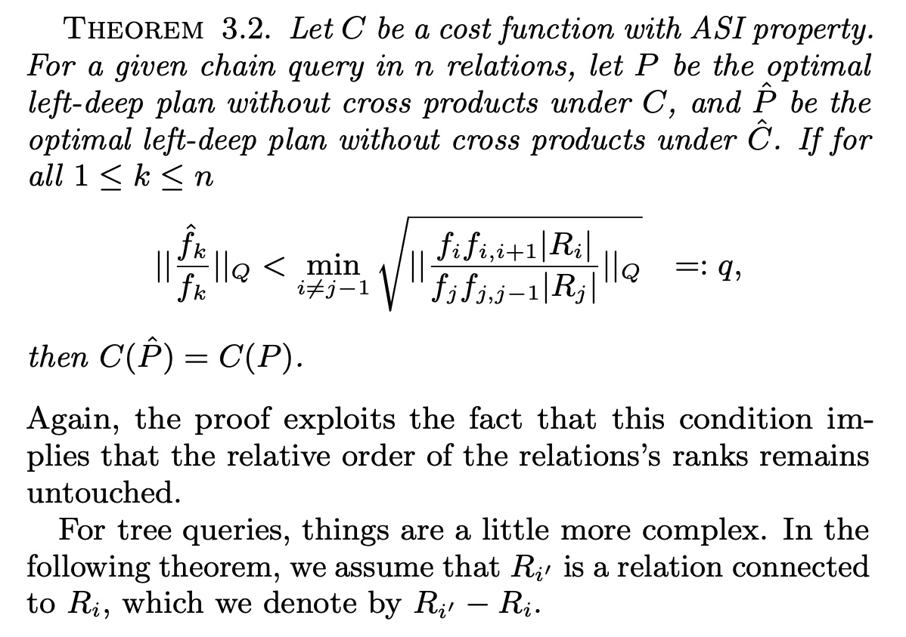
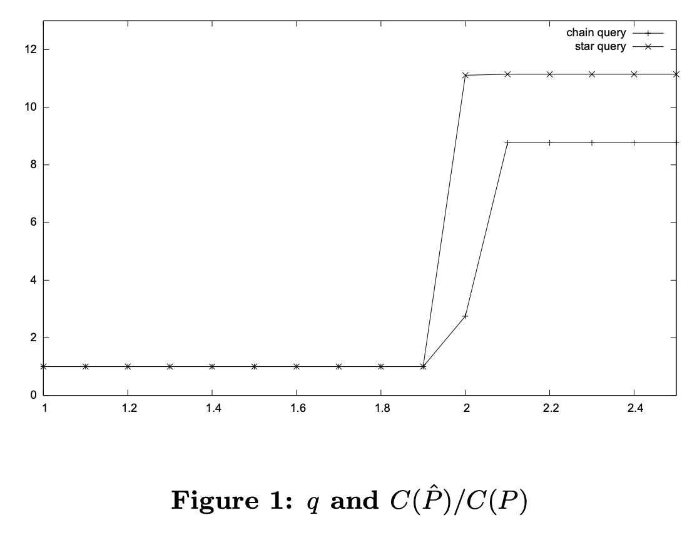
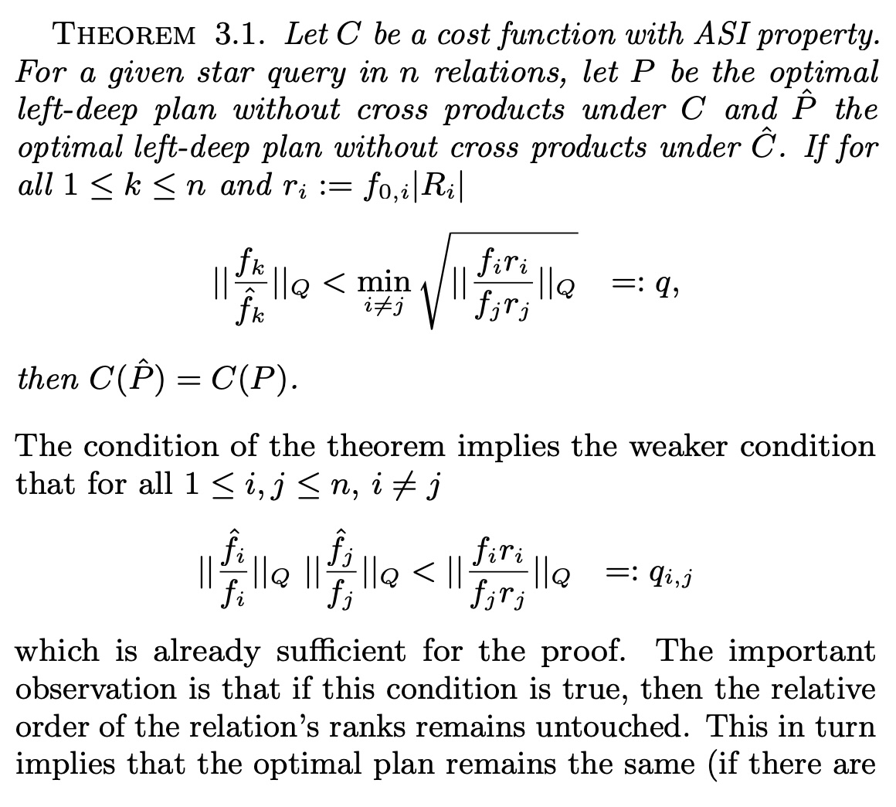
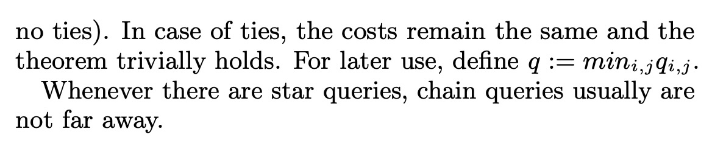
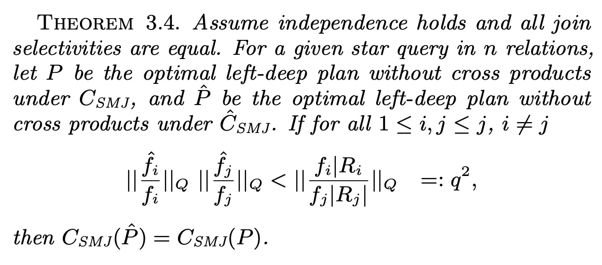
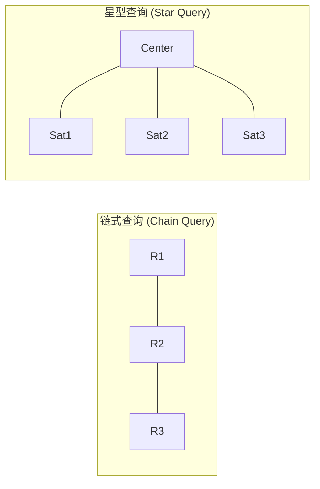
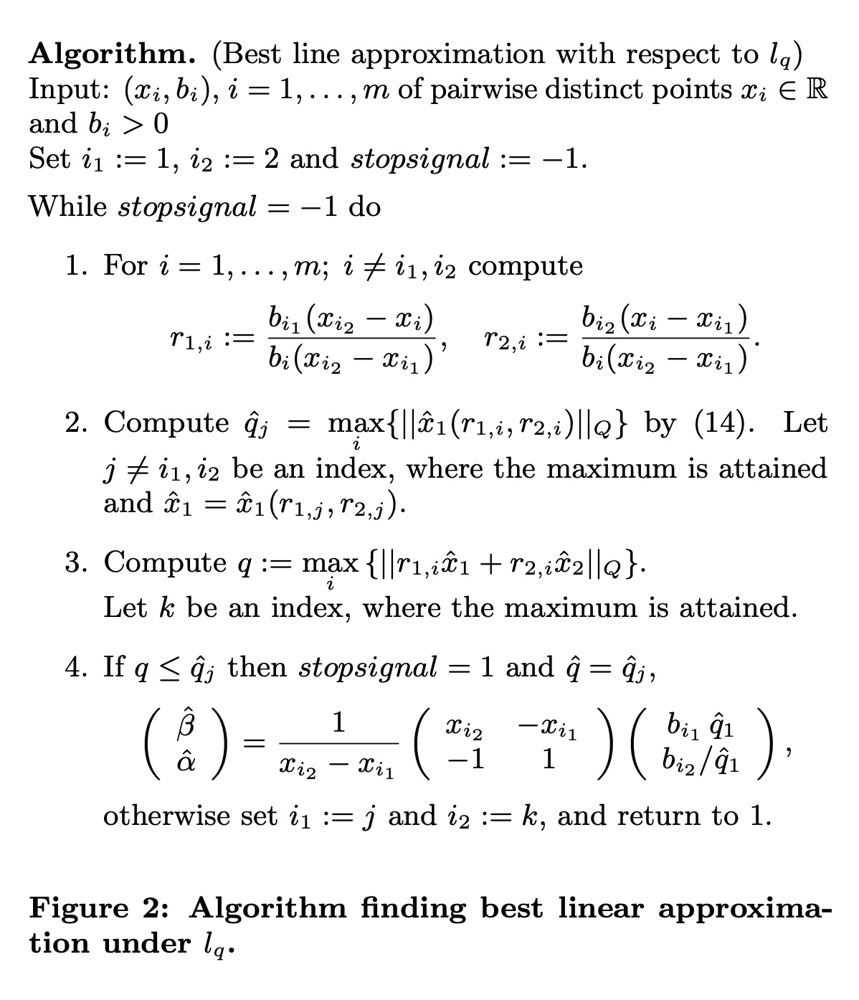
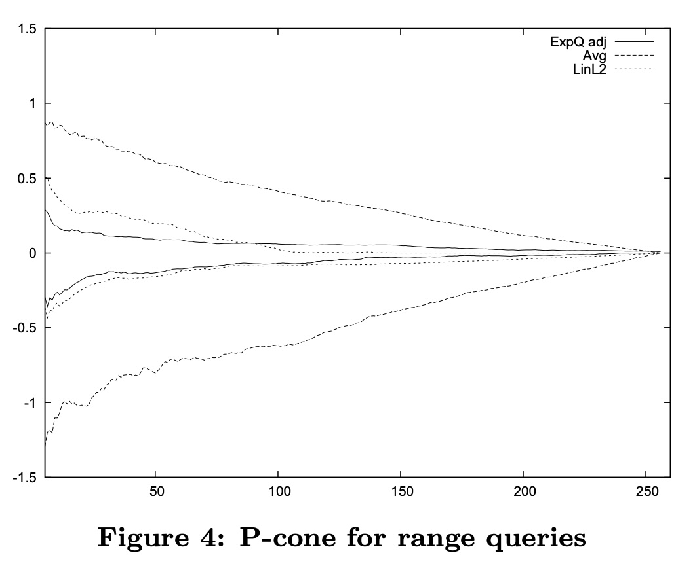

## AI论文解读 | Preventing Bad Plans By Bounding The Impact Of Cardinality Estimation Errors
        
### 作者        
digoal        
        
### 日期        
2025-10-16        
        
### 标签        
PostgreSQL , PolarDB , DuckDB , AI , 论文解读        
        
----        
        
## 背景  
      
https://www.vldb.org/pvldb/vol2/vldb09-657.pdf        
  
提示:          
```          
读懂《Preventing Bad Plans By Bounding The Impact Of Cardinality Estimation Errors》这篇论文需要提前掌握哪些基础知识, 请使用中文通熟易懂的讲解这些基础知识, 可以引用论文中的图、表或使用Markdown支持的图形(text,mermaid等)增加解释性. 
  
使用中文通熟易懂的解读《Preventing Bad Plans By Bounding The Impact Of Cardinality Estimation Errors》这篇论文, 其中的关键内容请着重讲解, 可以引用论文中的图、表或使用Markdown支持的图形(text,mermaid等)增加解释性. 
  
提取《Preventing Bad Plans By Bounding The Impact Of Cardinality Estimation Errors》这篇论文中的重要术语, 使用中文对这些术语进行通熟易懂的讲解, 可以引用论文中的图、表或使用Markdown支持的图形(text,mermaid等)增加解释性. 
```     
  
## 1 前置知识 
  
好的，为了完全理解《Preventing Bad Plans by Bounding the Impact of Cardinality Estimation Errors》这篇论文，您需要掌握以下几个领域的基础知识。我会用通俗易懂的语言，并结合论文中的图表来进行解释。

核心来说，这篇论文在解决一个数据库领域的经典难题：**查询优化器估算错了怎么办？**

-----

### 基础知识一：数据库查询优化 (Query Optimization)

想象一下，你让导航软件规划一条从A到B的路线。导航软件就是“查询优化器”，它不会只给一条路，而是会根据实时路况、距离、过路费等信息，计算出成千上万条可能的“执行计划”（路线），然后选择一个“成本”最低的（比如最快或最短的）。

在数据库中，当你执行一条SQL查询语句时，数据库内部的**查询优化器 (Query Optimizer)** 也在做同样的事情 。

  * **查询计划 (Query Plan)**：这是数据库执行查询的具体步骤 。例如，对于一个多表连接查询，是先连接A和B，再连接C，还是先连接B和C，再连接A？不同的连接顺序、不同的连接算法（比如哈希连接、排序合并连接）都会产生不同的执行计划，其执行效率可能天差地别 。
  * **成本估算 (Cost Estimation)**：优化器会为每个可能的计划估算一个执行成本（通常是I/O和CPU的综合开销）。选择成本最低的计划去执行。
  * **基数估算 (Cardinality Estimation)**：在所有成本估算的输入参数中，最重要的就是**基数**，即一个操作（如过滤、连接）后会返回多少行数据 。这就像导航软件估算每条路上的车流量一样。如果车流量估算错了，那么“最快路线”的预测就毫无意义。

**这篇论文的出发点**：论文指出，成本模型本身通常很准，但基数估算却常常出错 。错误的基数估算会导致优化器选出一个实际运行起来非常慢的“坏计划” 。

### 基础知识二：查询计划的类型 (Types of Query Plans)

论文为了在理论上进行严谨的推导，聚焦于几种常见的查询结构。了解它们有助于理解论文中定理的适用场景。

  * **链式查询 (Chain Query)**：像链条一样，表与表依次连接。例如 `R1 JOIN R2 JOIN R3 JOIN ...`。

    ```mermaid
    graph LR
        R1 --- R2 --- R3 --- R4
    ```

    论文中的定理3.2和图1都分析了这种查询 。      

  * **星型查询 (Star Query)**：一个中心表（事实表）与多个周边表（维度表）进行连接。

    ```mermaid
    graph TD
        R0(中心表) --- R1(卫星表)
        R0 --- R2(卫星表)
        R0 --- R3(卫星表)
        R0 --- R4(卫星表)
    ```

    论文中的定理3.1、定理3.4和图1也分析了这种查询 。         

  * **左深树 (Left-Deep Tree)**：这是一种常见的计划树形态，它的所有右子节点都是一个基础表 。这种结构易于流水线式执行。

    ```mermaid
    graph TD
        subgraph Left-Deep Plan
            Join3["(R1 ⋈ R2) ⋈ R3"] --> Join2["(R1 ⋈ R2)"]
            Join3 --> R3
            Join2 --> R1
            Join2 --> R2
        end
    ```

    论文中的定理都限定在“无交叉连接的左深树计划”这个范围内进行讨论 。

### 基础知识三：误差度量与数据拟合 (Error Metrics & Data Fitting)

这篇论文的核心创新在于提出了一种新的误差度量方式。要理解它的优越性，首先需要了解传统的度量方式。

假设真实值是 `f`，估算值是 `f̂`。

1.  **$l_{\infty}$ 误差 (最大绝对误差)**: $max(|f_i - \hat{f_i}|)$ 。它关心的是“最坏情况下，估算值与真实值的差了多少”。但这在数据库中用处不大，因为对于一个基数是10的表和基数是1000万的表，同样的绝对误差100，其影响是完全不同的 。

2.  **$l_2$ 误差 (均方根误差)**: $\sqrt{\sum(f_i - \hat{f_i})^2}$ 。这是统计学和机器学习中最常用的误差，比如“最小二乘法”就是最小化这个误差 。但它同样不适合衡量基数估算的质量，因为它对所有点的误差一视同仁，且不能为最坏情况提供一个明确的界限 。

3.  **q-误差 (q-error)**：这是本文提出的核心概念 。
    $$q = max(\frac{\hat{f}}{f}, \frac{f}{\hat{f}})$$
    这个公式的含义是：**估算值与真实值之间的最大比率**。

      * **对称性**: 把估算值放大2倍（ $\hat{f}/f = 2$ ）和缩小到1/2（ $f/\hat{f} = 2$ ），q-误差都是2。它同等看待高估和低估 。
      * **乘法性质**: 这一点至关重要。论文指出，在多表连接中，基数估算的误差是**以乘法形式传播的** 。因此，使用一个乘法性质的误差度量（q-error）来衡量和控制误差是最自然、最有效的 。
      * **提供保证**: 如果 q-error 小于q，那么估算值一定在 `[f/q, f*q]` 的范围内 。

论文中的这张表格清晰地展示了不同误差度量下的“最佳”近似是不同的 ：

| | $\hat{f}_{30}$ ( 平均值, 最小化 $l_2$ ) | $\hat{f}_{\sqrt{600}}$ ( q-middle, 最小化 $l_q$ ) | $\hat{f}_2$ ( 线性函数, 最小化 $l_2$ ) | ... |
| :--- | :---: | :---: | :---: | :---: |
| **$l_2$ 误差** | **20** (最小) | 33.5 | **14.0** (最小) | ... |
| **$l_{\infty}$ 误差** | 30 | 27.6 | 18.0 | ... |
| **$l_q$ 误差** | 3 | **2.4** (最小) | 2.8 | ... |

这个表格告诉我们：如果你想优化 $l_2$ 误差，你应该用平均值来近似；但如果你想优化 q-误差，你应该用 `q-middle` ( $\sqrt{min \times max}$ ) 。

### 基础知识四：数据摘要 (Data Synopses)

数据库不可能在每次优化时都扫描全表来获得精确的基数。因此，它会在内存中维护一些数据的“摘要”或“概要”(Synopsis)，比如直方图 (Histogram) 。

  * **直方图 (Histogram)**：将数据划分成多个“桶”(bucket)，每个桶记录一些统计信息。最常见的直方图（如等深直方图）会假设桶内的数据是均匀分布的，并用桶内频率的**平均值**来代表这个桶里所有值的频率 。
  * **论文的改进**: 本文认为，用平均值来做摘要是一种优化 $l_2$ 误差的策略，但这对于查询计划的稳定性很不利 。论文提出，我们应该构建一种新的数据摘要，其目标是**最小化q-误差**。例如，使用一个线性函数或指数函数来拟合一个桶内的数据，并找到那个能让q-误差最小的函数 。

-----

### 总结：如何串联这些知识来理解论文

1.  **问题背景 (知识点1, 4)**: 数据库查询优化器依赖基数估算来选择最佳执行计划。这种估算是通过直方图等数据摘要完成的，但传统的摘要方法（如用平均值）可能导致很大的估算误差。
2.  **核心论点 (知识点3)**: 传统的误差度量（ 如 $l_2$ ）无法准确反映基数误差对查询计划质量的影响。论文提出 **q-误差** 这一新指标，因为它具有乘法性质，能更好地匹配误差在连接查询中的传播规律 。
3.  **关键贡献与证明 (知识点2, 3)**:
      * **理论保证**: 论文通过一系列定理证明了q-误差的优越性。
          * **保证计划最优**: 对于星型、链式等查询，只要q-误差被控制在某个阈值内，优化器选出的计划就**依然是最佳计划** 。
          * **保证成本上限**: 即使q-误差超出了阈值导致选错了计划，这个坏计划的实际成本也不会超过最优计划成本的 $q^4$ 倍 。这是个非常强大的结论，它为最坏情况提供了一个明确的边界。
      * **实践方法**: 论文不仅提出了理论，还给出了一套数学算法，用于计算如何找到最小化q-误差的近似函数（比如一条直线） 。
4.  **实验验证**: 论文最后通过实验展示，使用最小化q-误差（LinQ, ExpQ）构建的数据摘要，其q-误差远小于传统方法（Avg, LinL2），从而能生成更稳定、更高质量的查询计划 。

掌握了以上基础知识后，您就可以更好地理解这篇论文的动机、核心思想、理论推导和实践价值了。
  
## 2 解读论文 
  
好的，这篇名为《Preventing Bad Plans by Bounding the Impact of Cardinality Estimation Errors》的论文是数据库查询优化领域的一篇经典之作。它精准地指出了一个核心问题，并提供了一套严谨的理论和实用的解决方案。

下面我将用通俗易懂的方式，为您深入解读这篇论文。

### 核心思想一览

想象一下，你用导航软件规划路线。软件的最终目的是给你一条“最快”的路线。为了做到这一点，它必须准确预测每条路上的“车流量”。

  * **数据库查询优化器**：就像导航软件 。
  * **查询计划 (Plan)**：就是软件规划出的具体路线（先走A街，再上B高速...）。
  * **基数 (Cardinality)**：就是路上的“车流量”，即一个数据库操作后会返回多少行数据。
  * **成本 (Cost)**：就是预计的“通行时间”。

**这篇论文要解决的问题是**：导航软件对“车流量”（基数）的预测总是会出错，有时错得离谱 。一个微小的预测错误，可能导致它推荐一条看似最快，实则堵死人的“坏路线”（Bad Plan）。我们该如何衡量这种预测错误，并控制它带来的最坏影响？

-----

### 关键内容一：重新定义“误差”—— 引入 q-error

论文首先抛出一个根本性问题：我们应该用什么标准来衡量基数估算的“误差” ？

传统上，人们常用**绝对误差**（ $|真实值 - 估算值|$ ）或**平方误差**（ $(真实值 - 估算值)^2$ ）。但论文认为这些标准不适用于数据库。比如，对于一个真实有100万行结果的操作，估算成101万行（误差1万）和估算成99万行（误差1万），影响不大。但对于一个真实只有1000行的结果，估算成1万1千行（误差1万），这就完全是灾难了。

因此，论文提出了一个全新的误差度量标准：**q-error** 。

$$q\text{-error} = max(\frac{估算值}{真实值}, \frac{真实值}{估算值})$$

**q-error的特性和优势：**

1.  **乘法性质**：它衡量的是“比率”而不是“差值”。估算值是真实值的2倍，或者真实值是估算值的2倍，q-error都是2 。这至关重要，因为在多表连接查询中，误差正是以**乘法形式**逐级放大的 。
2.  **对称性**：它同等看待高估和低估，这在优化中非常重要 。
3.  **提供明确边界**：如果q-error为`q`，那么我们能保证估算值一定在 `[真实值 / q, 真实值 * q]` 这个区间内 。

论文中的一个表格清晰地对比了不同误差标准下的“最佳”近似函数是完全不同的，说明选择正确的误差度量是后续一切工作的基础 。

-----

### 关键内容二：为什么 q-error 是最佳选择？（三大理论支柱）

这部分是论文的核心贡献，它从理论上雄辩地证明了q-error的优越性。

#### 1\. 保证计划最优性 (Guarantees Plan Optimality)

论文通过一系列数学定理（定理3.1, 3.2, 3.3）证明了一个惊人的结论：

> 对于链式查询、星型查询等常见结构，只要基数估算的 **q-error** 被控制在某个特定的、可计算的阈值之下，那么即使估算值不是100%准确，查询优化器也**保证能选出那个真正的最优计划** 。



论文中的**图1**生动地展示了这一点。    

  * **X轴**是q-error的大小 。
  * **Y轴**是“优化器所选计划的真实成本”与“最优计划的真实成本”的比值 。

从图中可以看到，当q-error从1.0增长到大约1.9时，Y轴的值始终是1 。这意味着尽管估算有误差，但优化器选出的计划依然是最好的。然而，一旦q-error突破了这个阈值，成本比率瞬间“跳涨”了8到11倍 。这说明，将q-error控制在某个范围内，是防止选出坏计划的关键。

#### 2\. 为坏计划的成本提供“上限保证” (Bounds the Cost)

那么，如果q-error不幸超出了那个阈值，导致优化器选了一个坏计划，情况会变得多糟呢？论文给出了第二个、也是更具普适性的强大保证（定理3.5）：

> 如果所有中间结果的基数估算的最大q-error为`q`，那么优化器选出的坏计划，其真实成本**最多**是最优计划成本的 $q^4$ 倍 。
> $$C(\hat{P}) \le q^4 \times C(P_{optimal})$$

这个 $q^4$ 的边界提供了一个清晰、可量化的关系，直接将**估算精度**（由q-error衡量）和**计划质量**（由成本比率衡量）联系在了一起。这是其他任何误差度量都无法做到的。

举个例子，假设我们用两种方法来构建数据摘要（比如直方图）：

  * 方法A（传统方法）产生的最大q-error是3.5 。那么它选出的坏计划成本可能是最优的 $3.5^4 \approx 151$ 倍 。
  * 方法B（论文提出的新方法）产生的最大q-error是2.1 。那么最坏情况下的成本也只是最优的 $2.1^4 \approx 20$ 倍 。

显然，方法B更加稳健可靠。

#### 3\. 最小化误差传播 (Minimizes Error Propagation)

由于q-error是乘法性质的，最小化每个估算的q-error，就等于直接最小化了误差在整个查询计划中逐级放大的总效应 。

-----

### 关键内容三：如何构建最小化 q-error 的数据摘要？

理论的价值在于实践。论文的后半部分详细阐述了如何实际构建能最小化q-error的数据摘要（Synopsis）。

传统直方图在每个“桶”内用**平均值**来近似数据，这本质上是在最小化 $l_2$ （平方）误差 。论文则提出，我们应该用一个简单的函数（ 如线性函数 $\beta + \alpha x$ 或指数函数 $e^{\beta+\alpha x}$ ）来拟合每个桶内的数据，并且拟合的目标是**最小化q-error** 。

论文为此专门设计了一套算法（如图2所示），可以通过迭代的方式，高效地找到这个最佳拟合函数 。     

#### 实验结果

论文通过实验对比了多种数据摘要方法，结果令人信服。

  * **对于单个桶的近似**：如下表所示，论文提出的`LinQ`（最小化q-error的线性函数）和`ExpQ`（最小化q-error的指数函数）方法，其q-error和最坏成本边界（ $q^4$ ）远优于传统方法。

| 近似方法 | q-error | 最坏成本边界 ( $q^4$ ) | 备注 |
| :--- | :---: | :---: | :--- |
| Avg (平均值) | 3.51 | 151 | 传统直方图做法  |
| Qmiddle (q-中值) | 2.77 | 59 | |
| LinL2 (最小化 $l_2$ 的线性函数) | 2.92 | 72 | |
| **LinQ (论文方法)** | **2.16** | **22** | **显著更优**  |
| **ExpQ (论文方法)** | **2.11** | **20** | **表现最好**  |

  * **对于完整的直方图**：在给定相同存储空间（320字节）的情况下，论文提出的分段式LinQ直方图（Piecewise LinQ）的q-error比其他流行方法（如V-Optimal、小波、抽样等）低了**数个数量级** 。这意味着它的估算结果要稳定和准确得多。

### 结论与启示

这篇论文的贡献是里程碑式的：

1.  **定义了正确的“尺子”** ：它告诉我们，衡量基数估算误差应该用q-error，而不是其他标准。
2.  **建立了理论桥梁**：它首次将估算误差（q-error）与查询计划的最优性及最坏成本联系起来，提供了 $q^4$ 这个强大的理论边界。
3.  **提供了实用工具**：它给出了一套具体的算法，用于构建能最小化q-error的新型数据摘要，并通过实验证明了其巨大优势。

总而言之，这篇论文通过“定义正确的误差度量”这一根本性创新，为构建更稳定、更可预测的数据库查询优化器铺平了道路。
  
## 3 术语 
  
好的，这篇论文引入了一些关键的术语来构建其理论体系。下面我将提取这些重要术语，并用通俗易懂的方式进行讲解。

### 1\. 基数估算 (Cardinality Estimation)

  * **讲解**: 在数据库执行一个查询前，它需要预测每一步操作会产生多少行数据 。这个预测过程就叫“基数估算”。基数就是指一个表或一个中间结果集中的数据行数 。这个估算值是后续所有成本计算的基础，一旦估算错误，整个计划的成本就可能错得离谱 。
  * **类比**: 基数估算就像为导航软件预测路况，如果把一条畅通无阻的路预测为严重拥堵，导航软件就会推荐一条很慢的绕行路线。

### 2\. q-误差 (q-error)

  * **讲解**: 这是论文提出的核心概念，一种衡量基数估算误差的新方法 。它的计算方式是取“估算值除以真实值”和“真实值除以估算值”中的较大者 。
    $$q\text{-error} = max(\frac{估算值}{真实值}, \frac{真实值}{估算值})$$
    这个度量方式的核心优势在于它具有**对称的乘法特性** 。例如，把100错估成200（2倍）和错估成50（1/2倍），q-误差都是2。这非常适合衡量在多表连接中以乘法形式传播的误差 。

### 3\. 数据摘要 (Synopsis)

  * **讲解**: 数据库不可能为了估算就去读取全表数据。因此，它会在内存中维护一个数据的浓缩版本或“摘要”，用来快速进行基数估算 。最常见的摘要就是直方图 。论文的目标就是利用其理论，构建出能最小化q-误差的新型数据摘要 。

### 4\. 查询计划的类型 (Query Types)

论文为了进行理论推导，聚焦于几种经典的查询结构。

  * **链式查询 (Chain Query)**
      * **讲解**: 指的是查询中的表像链条一样依次连接 。例如 `A JOIN B JOIN C`。
        ```mermaid
         graph LR
             A --- B --- C --- D
        ```
  * **星型查询 (Star Query)**
      * **讲解**: 指的是一个中心表（通常是事实表）与多个周边“卫星表”（通常是维度表）进行连接 。
        ```mermaid
         graph TD
             中心表 --- 卫星表A
             中心表 --- 卫星表B
             中心表 --- 卫星表C
        ```
    论文中的多个关键定理都是在这些查询结构上证明的 。

### 5\. ASI 属性 (Adjacent Sequence Interchange Property)

  * **讲解**: 这是查询优化理论中的一个经典属性 。一个具备ASI属性的成本函数意味着，我们可以通过一个简单的“rank”函数来两两比较相邻表的最优连接顺序，从而推导出全局最优的连接顺序 。论文在推导“计划最优性保证”时，借助了这个属性来简化证明过程 。

### 6\. 成本边界 ( $q^4$ ) (Cost Bound)

  * **讲解**: 这是论文最惊艳的理论成果之一 。它指的是，如果你的基数估算的最大q-误差为`q`，那么因为这个误差而选出的“坏计划”，其真实运行成本**最多**是最优计划的 $q^4$ 倍 。这个边界为估算误差所带来的最坏影响给出了一个明确的、可量化的上限。

### 7\. $l_q$ 下的最佳近似 ( Best Approximation under $l_q$ )

  * **讲解**: 指的是找到一个近似函数（比如一条直线），用它来拟合一批数据点，并使得拟合结果的q-误差最小化 。这与我们熟知的“最小二乘法”（最小化 $l_2$ 误差）是不同的目标 。论文的第4节花了大量篇幅推导并设计了实现这一目标的算法 。

| 误差度量 | 目标 | 常见应用 |
| :--- | :--- | :--- |
| $l_2$ 误差 | 最小化 $\sum(真实值-估算值)^2$ | 最小二乘法、传统直方图的均值近似  |
| $l_q$ 误差 (本文提出) | 最小化 $max(\frac{估算值}{真实值}, \frac{真实值}{估算值})$ | 构建对计划质量更稳健的数据摘要  |

### 8\. p-误差 (p-error)

  * **讲解**: 这是为了在图表中更直观地展示误差而引入的一个辅助术语 。它与q-误差本质上等价，但它带有正负号，可以明确地表示估算是“高估”了还是“低估”了 。论文中的图4就使用了p-误差来绘制“p-cone”，展示了不同查询范围下的最大高估和最大低估情况 。   
  
## 参考        
         
https://www.vldb.org/pvldb/vol2/vldb09-657.pdf    
        
<b> 以上内容基于DeepSeek、Qwen、Gemini及诸多AI生成, 轻微人工调整, 感谢杭州深度求索人工智能、阿里云、Google等公司. </b>        
        
<b> AI 生成的内容请自行辨别正确性, 当然也多了些许踩坑的乐趣, 毕竟冒险是每个男人的天性.  </b>        
  
    
#### [期望 PostgreSQL|开源PolarDB 增加什么功能?](https://github.com/digoal/blog/issues/76 "269ac3d1c492e938c0191101c7238216")
  
  
#### [PolarDB 开源数据库](https://openpolardb.com/home "57258f76c37864c6e6d23383d05714ea")
  
  
#### [PolarDB 学习图谱](https://www.aliyun.com/database/openpolardb/activity "8642f60e04ed0c814bf9cb9677976bd4")
  
  
#### [PostgreSQL 解决方案集合](../201706/20170601_02.md "40cff096e9ed7122c512b35d8561d9c8")
  
  
#### [德哥 / digoal's Github - 公益是一辈子的事.](https://github.com/digoal/blog/blob/master/README.md "22709685feb7cab07d30f30387f0a9ae")
  
  
#### [About 德哥](https://github.com/digoal/blog/blob/master/me/readme.md "a37735981e7704886ffd590565582dd0")
  
  

  
