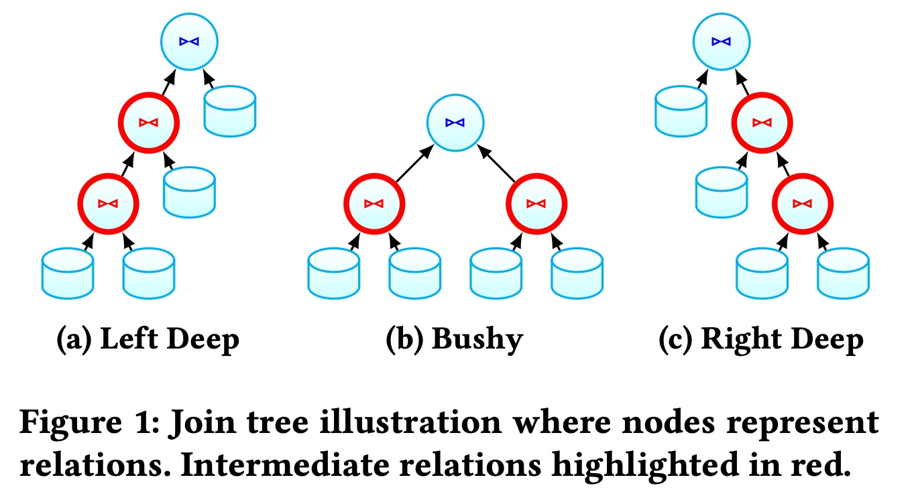
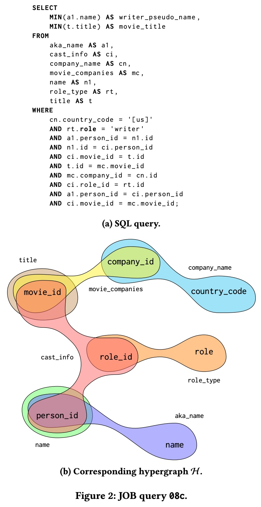
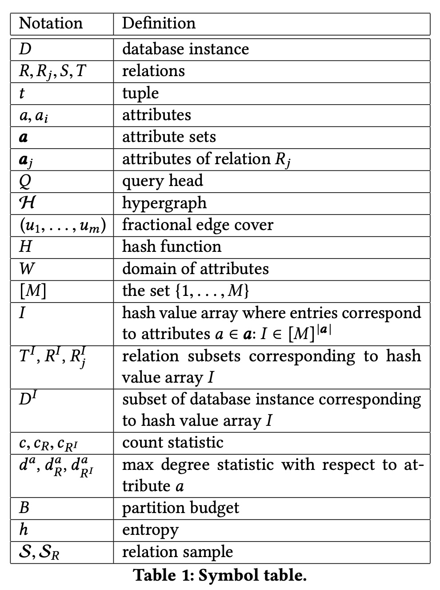
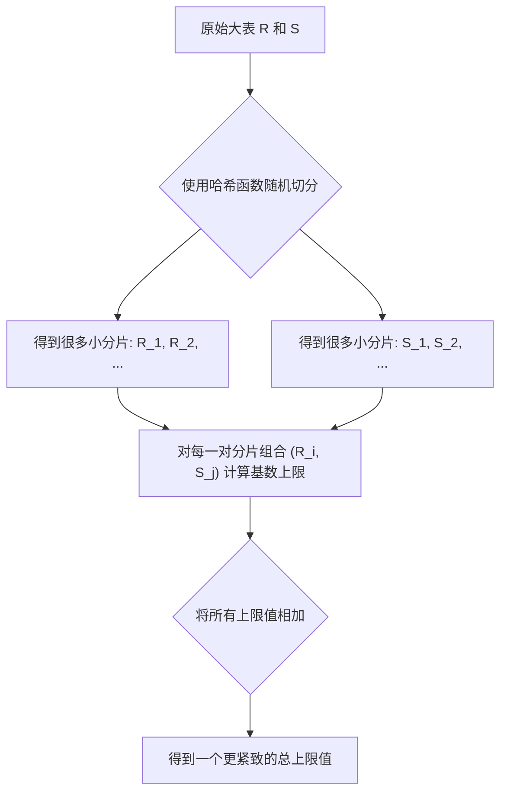
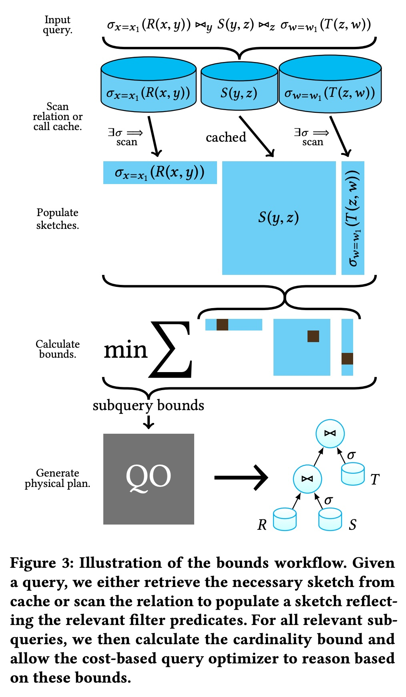
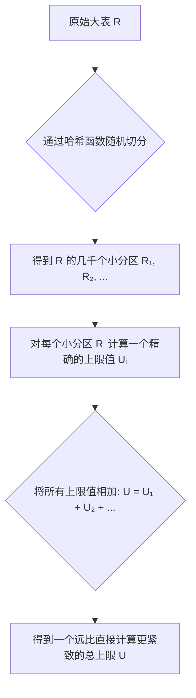
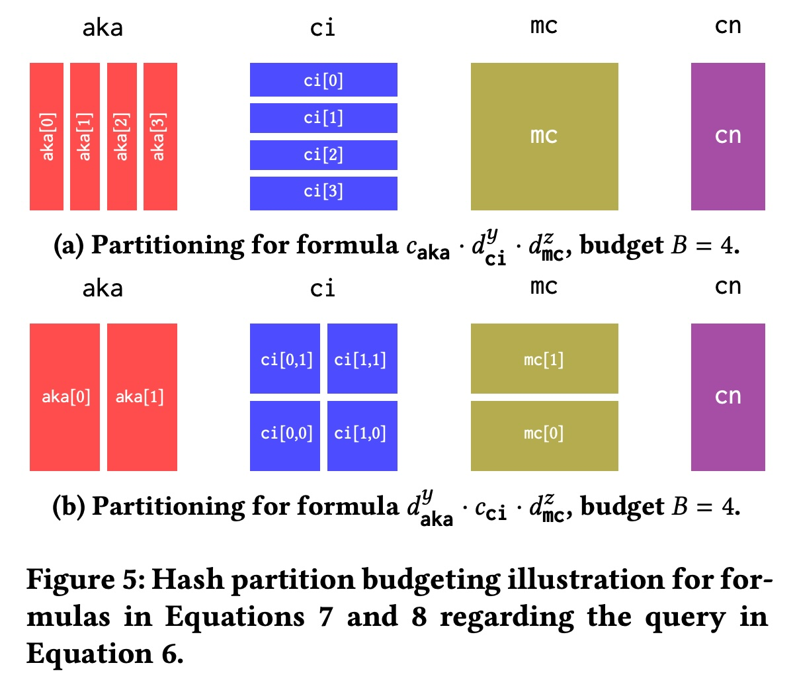
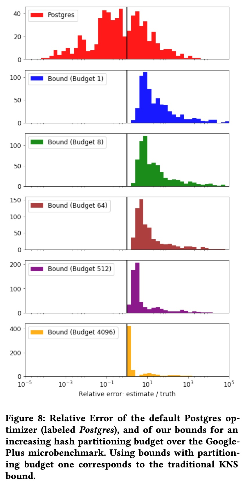
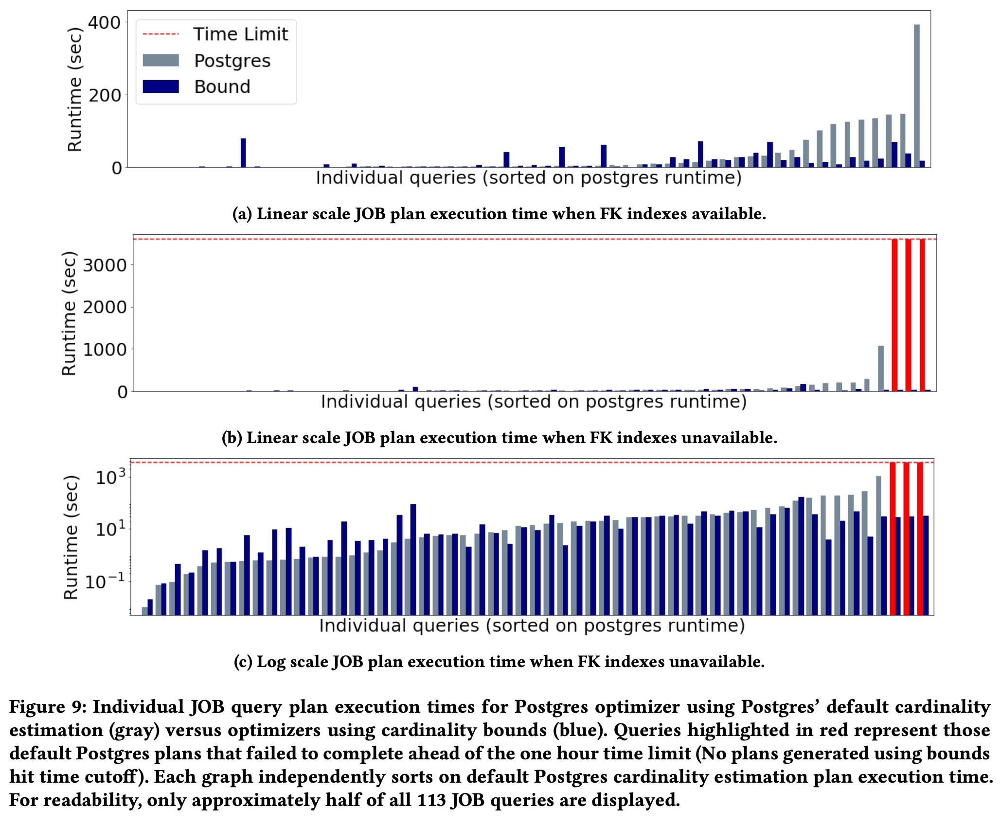

## AI论文解读 | Pessimistic Cardinality Estimation: Tighter Upper Bounds For Intermediate Join Cardinalities
        
### 作者        
digoal        
        
### 日期        
2025-10-16        
        
### 标签        
PostgreSQL , PolarDB , DuckDB , AI , 论文解读        
        
----        
        
## 背景  
      
https://dl.acm.org/doi/pdf/10.1145/3299869.3319894        
  
提示:          
```          
读懂《Pessimistic Cardinality Estimation: Tighter Upper Bounds For Intermediate Join Cardinalities》这篇论文需要提前掌握哪些基础知识, 请使用中文通熟易懂的讲解这些基础知识, 可以引用论文中的图、表或使用Markdown支持的图形(text,mermaid等)增加解释性. 
  
使用中文通熟易懂的解读《Pessimistic Cardinality Estimation: Tighter Upper Bounds For Intermediate Join Cardinalities》这篇论文, 其中的关键内容请着重讲解, 可以引用论文中的图、表或使用Markdown支持的图形(text,mermaid等)增加解释性. 
  
提取《Pessimistic Cardinality Estimation: Tighter Upper Bounds For Intermediate Join Cardinalities》这篇论文中的重要术语, 使用中文对这些术语进行通熟易懂的讲解, 可以引用论文中的图、表或使用Markdown支持的图形(text,mermaid等)增加解释性. 
```     
  
## 1 前置知识 
  
好的，为了读懂《Pessimistic Cardinality Estimation: Tighter Upper Bounds For Intermediate Join Cardinalities》这篇论文，您需要掌握一些关于数据库查询处理、信息论和数据结构的基础知识。

下面我将用通俗易懂的中文为您讲解这些核心概念，并引用论文中的图表来帮助理解。

### 核心脉络

这篇论文的核心思想很简单：数据库在执行一个复杂的、涉及多张表的查询（JOIN操作）时，很难精确估算每一步会产生多少数据。错误的估算（尤其是**低估**）会导致数据库选择一个性能极差的执行方案，造成查询时间过长甚至系统崩溃 。

为了解决这个问题，作者提出了一种“悲观”策略：我们不追求猜对准确的数值，而是去计算一个有理论保证的 **“最坏情况”的上限值 (Upper Bound)** 。这样一来，数据库至少可以避免那些最糟糕的执行方案，从而变得更加稳定和健壮。

-----

### 基础知识一：数据库如何执行多表查询

#### 1\. 什么是查询优化器 (Query Optimizer)？

当你向数据库发送一条SQL查询语句时，数据库内部有一个叫做“查询优化器”的核心组件。它的工作就是分析你的SQL，并找出完成这个查询最高效的执行方式（称为“物理执行计划”）。

例如，查询 `A JOIN B JOIN C JOIN D`，优化器需要决定是先连接A和B，再连接C，最后连接D？还是先连接C和D，再连接A，最后连接B？不同的顺序，性能可能天差地别。

#### 2\. 什么是物理连接计划 (Physical Join Plan)？

优化器选择的执行顺序和方法，通常可以用一个“树”形结构来表示。论文的图1展示了三种典型的连接树形态：   

  * **(a) 左深树 (Left Deep)**：像一条向左倾斜的链条，每次都将新的表连接到之前结果的右侧 。这是很多数据库系统默认喜欢的结构。
  * **(b) 浓密树 (Bushy)**：结构更复杂，可以并行执行多个连接操作，然后再将它们的结果连接起来 。
  * **(c) 右深树 (Right Deep)**：与左深树相反，像一条向右倾斜的链条 。

在这些树中，除了最底层的原始数据表（图中的圆柱体）外，所有中间节点（图中的**红色圆圈**）都代表一个“**中间结果**” (Intermediate relations) 。

#### 3\. 核心难题：基数估计 (Cardinality Estimation)

“基数” (Cardinality) 就是指一张表或一个结果集里有多少行数据。

查询优化器做决策时，最关键的依据就是**估算**这些红色圆圈代表的“中间结果”的基数 。如果优化器认为某个中间结果很小，它可能会选择一种执行方案；如果认为很大，则会选择另一种。

问题在于，这个估算非常困难，尤其是在多表连接时。传统方法依赖于一些简单的统计数据和“数据列之间相互独立”的假设 。但在真实世界的数据中，这种独立假设常常是不成立的，导致估算严重失准，特别是**倾向于低估** 。

  * **高估**：告诉优化器中间结果有100万行，实际只有1万行。优化器可能会选择一个更保守、但稍慢的方案。问题不大。
  * **低估**：告诉优化器中间结果只有100行，实际却有10亿行！优化器可能会选择一个非常激进的方案（比如把这“100行”数据全部加载到内存），结果导致内存溢出，查询性能急剧下降，这就是所谓的“**执行过程中的大规模数据爆炸**” (massive blowup during execution) 。

这篇论文的工作，就是为了解决这个致命的“低估”问题。

-----

### 基础知识二：论文的理论基石（有点数学味）

作者并非凭空创造上限理论，而是站在了信息论和图论巨人的肩膀上。

#### 1\. 用超图 (Hypergraph) 来描述查询

一个普通的图，一条边只能连接两个顶点。而**超图**的一条“超边”可以连接任意多个顶点 。

我们可以用超图来描述一个SQL查询的结构：

  * **顶点 (Vertices)**：查询中涉及到的所有**属性列**（如 `movie_id`, `person_id`）。
  * **超边 (Hyperedges)**：查询中的每一张**数据表**。一张表包含了哪些属性列，这条超边就连接哪些顶点。

论文的图2就给出了一个很好的例子，(a) 是一个复杂的SQL查询，(b) 是它对应的超图表示。你可以看到像 `cast_info` 这张表，就是一条连接了 `movie_id`, `person_id`, `role_id` 三个顶点的超边 。   

这种数学化的表示，是后续应用信息论公式的基础。

#### 2\. 信息熵 (Entropy) 和连接大小的关系

信息熵在信息论中用来度量一个系统的不确定性。一个系统的状态越多，熵就越大。

这和数据库有什么关系呢？论文巧妙地指出：一个查询结果集的大小，与这个结果集中所有属性的“联合熵”直接相关 。简单来说：  
$$log(\text{查询结果的行数}) = \text{联合熵}$$  
因此，如果我们能**给“熵”计算一个上限，我们就能给“查询结果的行数”计算一个上限**。  

基于这个思想，前人的研究（如AGM bound  和 KNS bound ）已经推导出了一系列利用熵来估算基数上限的数学公式。

#### 3\. 两个关键的统计量

这些理论公式依赖两个从数据表中提取的关键统计信息（你可以在论文的符号表 Table 1 中找到它们的定义 ）：   

  * **计数 (Count, c)**：就是表的总行数。
  * **最大度 (Max Degree, d)**：在一个属性列上，出现次数最多的那个值的出现次数 。
      * **例子**：一张“订单表”中有“城市”这一列。如果“北京”出现了1000次，是所有城市中出现次数最多的，那么“城市”列的 `max degree` 就是1000。这个值反映了数据的倾斜程度。

-----

### 基础知识三：论文的核心技术创新

直接使用上面提到的理论公式计算出的上限值，虽然有理论保证，但往往“过于悲观”，离真实值太远，实用性不强。这篇论文的核心贡献就是通过一种**数据素描 (Data Sketching)** 的技术，让这个上限变得更“紧致”(tighter) 。

#### 1\. 核心思想：分而治之

作者的方法非常直观：

> 与其对一整张大表计算一次宏观的、不精确的上限，不如把大表随机切分成很多小块，对每一小块计算一个更精确的上限，最后再把所有小块的上限值加起来。

这个过程就像下面这样：



#### 2\. Bound Sketch (BS) 数据结构

为了实现上述“分而治之”的思想，作者设计了一个名为 **Bound Sketch (BS)** 的数据结构 。

你可以把它想象成一个多维表格。当我们用哈希函数对表的属性列进行处理时，每一行数据都会被映射到这个多维表格的一个单元格里。BS要做的就是在**一个单元格（一个小分片）** 内，存储前面提到的两个关键统计量：

1.  落入这个单元格的**行数 (count)** 。
2.  在这些行中，各个属性列的**最大度 (max degree)** 。

通过预先计算好每张表的BS，在查询优化时，优化器就可以直接利用这些细粒度的统计信息，将理论公式应用在各个“小分片”上，然后求和，从而得到一个比之前紧致得多的基数上限 。

论文的工作流程图（图3）完美地总结了这一过程：   

1.  **输入查询**：收到一条SQL查询 。
2.  **填充Sketches**：根据查询涉及的表和过滤条件，扫描数据表（或从缓存读取）来创建或更新BS 。
3.  **计算上限**：对查询的各个部分，利用BS中的细粒度统计数据，应用理论公式计算基数上限，并取所有可能公式中的最小值 。
4.  **生成物理计划**：将这个更可靠的上限值提供给查询优化器（QO），让它做出更明智的决策，生成一个健壮的执行计划 。

### 总结

要读懂这篇论文，您需要理解：

1.  **数据库的痛点**：查询优化器依赖于基数估计，而错误的低估会导致灾难性的性能问题。
2.  **论文的目标**：不求精确，但求一个可靠的“上限”，以规避最坏情况，实现“悲观”但稳健的优化。
3.  **理论基础**：通过超图对查询建模，并利用信息熵理论来构建基数上限的数学公式。
4.  **核心创新**：提出Bound Sketch数据结构，通过“哈希分区”的策略，将宏观、粗糙的上限计算，转化为对许多微观、细粒度分片的上限计算再求和，从而得到一个更紧致、更实用的结果。

掌握了这些知识后，您就可以更轻松地理解论文中的具体算法、实验设计和结论了。
  
## 2 解读论文 
  
好的，这篇名为《Pessimistic Cardinality Estimation: Tighter Upper Bounds For Intermediate Join Cardinalities》的论文，旨在解决一个数据库领域长期存在的棘手问题：如何让数据库在处理复杂的多表连接查询时，不做出灾难性的错误决策。

下面，我将为您通俗地解读这篇论文的核心思想与关键技术。

### 核心问题：数据库的“致命低估”

想象一下，您在使用导航软件规划路线，软件告诉你一条小路只需要5分钟，而高速公路需要30分钟。你选择了小路，结果却堵了2个小时。这是因为导航软件严重**低估**了小路的拥堵情况。

数据库的**查询优化器 (Query Optimizer)** 就面临着同样的问题。当您执行一条涉及多张表连接 (JOIN) 的SQL查询时，优化器需要决定一个“执行计划”，即先连接哪两张表，再连接下一张，等等。这个决策严重依赖于它对每一步连接产生的“**中间结果**”有多少行数据（即**基数 Cardinality**）的估算。

  - **如果高估了**：优化器可能会选择一个保守但稍慢的方案，问题不大。
  - **如果低估了**：优化器可能会认为中间结果很小，从而选择一个激进的方案（比如试图将数据全部加载到内存中）。当实际执行时，中间结果的数据量远超预期（即“数据爆炸”），就会导致内存溢出、磁盘IO飙升，查询性能急剧下降，甚至使整个系统崩溃 。

在真实世界的数据中，由于数据之间存在复杂的关联性，优化器传统的估算方法常常会犯这种“致命低估”的错误 。

### 论文的“悲观”智慧：不求猜准，但求稳妥

这篇论文提出了一种“悲观主义”的解决方案：我们不追求精确地猜对中间结果的行数，而是去计算一个**有理论保证的、绝不会被突破的“上限值” (Upper Bound)** 。

这样做的好处是，优化器虽然可能不会选到那个理论上最快的“小路”，但它**绝对能避开所有会导致严重拥堵的“天坑”路线**，从而保证查询性能的稳定和健壮 (Robustness) 。

### 理论基石：用信息论给数据量“加个盖”

论文的方法并非凭空而来，而是建立在坚实的数学理论之上。

1.  **用超图 (Hypergraph) 描述查询**：
    一个SQL查询可以被抽象成一个数学上的“超图”。其中，每个**属性列**（如 `user_id`, `movie_id`）是一个**顶点**，每一张参与连接的**数据表**则是一条连接其所含属性列顶点的**超边** 。

    例如，论文中的图2就展示了一个复杂的SQL查询  如何被转换成一个直观的超图 。这种转换使得复杂的查询可以用数学语言来分析。    

2.  **AGM/KNS 上限理论**：
    前人的研究发现，查询结果集的大小与信息论中的“熵”存在深刻联系 。简单来说，`log(查询结果行数)` 正比于结果集中所有属性的联合熵 。因此，只要能计算出熵的上限，就能推导出查询结果行数的上限 。这些理论公式主要依赖两个关键的统计量：

      * **c (Count)**：表的总行数 。
      * **d (Max Degree)**：某个属性列中，出现次数最多的那个值的出现次数 。

然而，直接将这些理论公式应用在整张大表上，得出的上限值虽然可靠，但往往“过于悲观”，离真实值太远，缺乏实用价值。

### 关键创新：从“松散”到“紧致”的上限

这篇论文最核心的贡献在于，它提出了一套方法，极大地 **“收紧” (tighten)** 了这个理论上限，使其变得非常接近真实值，从而具备了实用性。

其核心思想是 **“分而治之”** ：

> 与其对一整张百万行的大表计算一个宏观、粗糙的上限，不如先用哈希函数将这张大表随机切分成几千个“小分区”，然后对每个“小分区”计算一个更精确的上限，最后将所有小分区的上限值加起来 。

这个过程可以用下面的流程图来理解：



为了实现这一思想，作者设计了两个关键技术：

1.  **Bound Sketch (BS) 数据结构**：
    这是一种专门为此设计的数据摘要结构 。它像一个多维表格，通过对数据行的多个属性进行哈希计算，将每一行数据映射到表格的一个单元格里 。这个单元格就代表了一个“小分区”。BS为每个这样的分区存储了精细化的统计信息：落入该分区的**行数 (count)** 和各属性的**最大度 (max degree)** 。

    通过预先为每张表计算好BS，优化器就拥有了关于数据分布的“高精度地图”，而不再是只有一张粗糙的世界地图。

2.  **哈希分区预算 (Hash Partition Budgeting)**：
    如果分区切得太细，分区的组合数量会呈指数级增长，导致计算上限本身就变得非常耗时 。为此，作者引入了“预算”机制 。它会设定一个计算资源上限（比如，总共只考虑4096个分区组合），然后根据不同的上限计算公式，智能地将这个“预算”分配给最关键的属性列进行分区 。

    论文中的图5生动地展示了这一策略：对于一个固定的预算 B=4，两种不同的上限计算公式会导致截然不同的分区方式，从而确保计算效率和效果 。    

### 实践效果：显著的性能提升

论文通过在两个真实数据集上的实验，验证了其方法的有效性。

  * **上限紧致度**：在GooglePlus数据集上的实验（图8）表明，随着分区预算的增加，该方法计算出的上限值（彩色柱状图）的误差迅速减小，越来越贴近真实值（黑线左侧），并且远比Postgres默认的估算（红色柱状图）要集中和可靠 。    

  * **查询执行时间**：这是衡量一个优化技术最终价值的指标。在Join Order Benchmark (JOB) 这个行业标准测试集上，结果非常惊人：

      * 在有外键索引的情况下，使用该方法生成的计划，总执行时间比Postgres默认**快1.7倍** 。
      * 在**没有外键索引**（更能体现基数估算重要性的场景）的情况下，这个优势扩大到了**超过10倍** ！

    论文中的图9直观地展示了这一差距。对于那些非常耗时的查询，Postgres默认的计划（灰色/红色条）可能需要几十分钟甚至超时失败，而使用该论文方法的计划（蓝色条）往往在几十秒内就能完成 。    

    这充分证明，一个可靠的上限值能够有效帮助优化器规避那些灾难性的执行计划。

### 结论

这篇论文的核心贡献在于，它将深刻的数学理论（信息论、超图）与巧妙的工程实践（数据素描、哈希预算）相结合，提出了一种**实用且高效**的方法来计算多表连接基数的紧致上限。通过用这种“悲观”但可靠的上限值替代传统优化器中充满风险的估算值，它能够显著提升数据库处理复杂查询时的**稳定性和性能**，避免了因“致命低估”而导致的性能灾难。
  
## 3 术语 
  
好的，这是对《Pessimistic Cardinality Estimation: Tighter Upper Bounds For Intermediate Join Cardinalities》这篇论文中重要术语的中文解读。

-----

### 1\. 基数估计 (Cardinality Estimation)

  * **讲解**：
    “基数”指的是一张数据表或一个查询结果中有多少行数据 。基数估计是数据库查询优化器（Query Optimizer）的核心任务，它需要“猜测”执行查询的每一步会产生多少行数据 。这个猜测的准确性直接决定了数据库是选择一个高效的执行计划还是一个灾难性的慢计划 。论文指出，传统的估计方法在多表连接时常常会严重**低估**实际的数据量，导致性能问题 。

  * **图示解释**：
    数据库优化器在决定如何执行 `A JOIN B JOIN C` 时，需要回答如下问题：

    ```mermaid
    graph TD
        subgraph Plan 1
            A[表 A] --> AB(A JOIN B);
            B[表 B] --> AB;
            AB -- "估算这里有多少行？" --> ABC("(A JOIN B) JOIN C");
            C[表 C] --> ABC;
        end
        subgraph Plan 2
            B2[表 B] --> BC(B JOIN C);
            C2[表 C] --> BC;
            BC -- "估算这里又有多少行？" --> ABC2("A JOIN (B JOIN C)");
            A2[表 A] --> ABC2;
        end
    ```

    对中间结果（如 `A JOIN B`）行数的估算就是基数估计。

### 2\. 中间连接基数 (Intermediate Join Cardinalities)

  * **讲解**：
    当执行一个涉及多张表的查询时，数据库会分步进行连接，每一步都会产生一个临时的、不作为最终结果输出的“中间结果” 。这个中间结果的行数就是中间连接基数 。准确估计这些中间基数是查询优化的关键，也是最大的难点，因为中间结果的特性很难从原始表中推断出来 。

  * **图示解释** (引用论文图1)：    
    在下方的连接树中，数据库（圆柱体）是最底层的原始数据，而**红色圆圈**部分就代表了执行过程中产生的“中间结果” 。这篇论文的核心目标就是为这些红色部分的基数提供一个可靠的上限。
    *(a) 左深树, (b) 浓密树, (c) 右深树*

### 3\. 上限 (Upper Bounds)

  * **讲解**：
    这篇论文提出一种“悲观”策略：与其追求一个可能严重错误的精确估计值，不如计算一个有理论保证的、**绝不会低于**真实值的“上限” 。这样，优化器至少可以避免那些因严重低估而导致的灾难性计划，从而使查询计划更加稳健 (robust) 。论文的核心工作就是利用数据摘要技术，让这个上限尽可能地“紧致”(tight)，即接近真实值 。

### 4\. 超图 (Hypergraph)

  * **讲解**：
    超图是一种数学工具，用于对SQL查询的结构进行建模 。在一个查询的超图表示中，每个**属性列**（如`movie_id`）是一个**顶点**，而每一张**数据表**则是一条可以连接多个顶点的**超边** 。这种抽象表示是应用后续信息论公式（如AGM/KNS Bound）的基础 。

  * **图示解释** (引用论文图2)：    
    下图展示了一个复杂的SQL查询 (a) 及其对应的超图 (b) 。例如，`cast_info` 这张表就是一条连接了 `person_id`, `movie_id`, `role_id` 三个顶点的超边。

### 5\. Bound Sketch (BS)

  * **讲解**：
    这是论文提出的核心数据结构，是一种数据摘要或“素描”(sketch) 。它的核心思想是**分而治之**：通过随机哈希函数，将一张大表逻辑上切分成许多个小的分区 。BS为每一个小分区存储了两个关键的统计量：

    1.  **计数 (Count)**：落入该分区的行数 。
    2.  **最大度 (Max Degree)**：在该分区内，某个属性列出现次数最多的那个值的出现次数 。

    通过对这些细粒度的分区数据应用理论公式并求和，最终得到的总上限会比直接对整张表计算要紧致得多 。

### 6\. 随机哈希分区 (Random Hash Partitioning)

  * **讲解**：
    这是构建Bound Sketch的技术手段 。通过一个或多个哈希函数，将表中的每一行根据其属性值映射到一个逻辑“桶”或分区中 。例如，论文中给出了一个简单的例子，使用 `h(x) = x % 2` 这个哈希函数将一张表 `R(x,y)` 切分成了 `2x2=4` 个逻辑分区 。

  * **图示解释** (引用论文图示)：
    下图形象地展示了原始表 `R(x,y)` 是如何被哈希函数逻辑上分解为四个不相交的子集的过程 。Bound Sketch就是对这四个子集分别计算统计信息。

### 7\. 最大度 (Max Degree, d)

  * **讲解**：
    最大度是Bound Sketch中存储的一个关键统计量，指的是在一个数据分区内，某个属性上出现次数最多的值的出现频率 。例如，在一个分区中，属性 `city_id` 的值 `{1, 2, 2, 3, 2}`，那么 `city_id` 的最大度就是3（因为值 `2` 出现了3次）。这个指标反映了数据的局部倾斜程度，对于收紧基于信息熵的上限公式至关重要。

### 8\. 哈希分区预算 (Hash Partition Budgeting)

  * **讲解**：
    这是一个为了控制计算复杂度的优化策略 。如果查询涉及的连接属性很多，将每个属性都进行精细的哈希分区，会导致分区组合的数量爆炸式增长，使得计算上限本身变得非常耗时 。为此，作者引入了“预算”机制：设定一个可计算的分区组合总数（如 B=4096），然后根据不同的上限公式，智能地将这个预算分配给最需要分区的属性 。这在保证上限紧致度的同时，也控制了优化时间。
  
## 参考        
         
https://dl.acm.org/doi/pdf/10.1145/3299869.3319894    
        
<b> 以上内容基于DeepSeek、Qwen、Gemini及诸多AI生成, 轻微人工调整, 感谢杭州深度求索人工智能、阿里云、Google等公司. </b>        
        
<b> AI 生成的内容请自行辨别正确性, 当然也多了些许踩坑的乐趣, 毕竟冒险是每个男人的天性.  </b>        
  
    
#### [期望 PostgreSQL|开源PolarDB 增加什么功能?](https://github.com/digoal/blog/issues/76 "269ac3d1c492e938c0191101c7238216")
  
  
#### [PolarDB 开源数据库](https://openpolardb.com/home "57258f76c37864c6e6d23383d05714ea")
  
  
#### [PolarDB 学习图谱](https://www.aliyun.com/database/openpolardb/activity "8642f60e04ed0c814bf9cb9677976bd4")
  
  
#### [PostgreSQL 解决方案集合](../201706/20170601_02.md "40cff096e9ed7122c512b35d8561d9c8")
  
  
#### [德哥 / digoal's Github - 公益是一辈子的事.](https://github.com/digoal/blog/blob/master/README.md "22709685feb7cab07d30f30387f0a9ae")
  
  
#### [About 德哥](https://github.com/digoal/blog/blob/master/me/readme.md "a37735981e7704886ffd590565582dd0")
  
  

  
