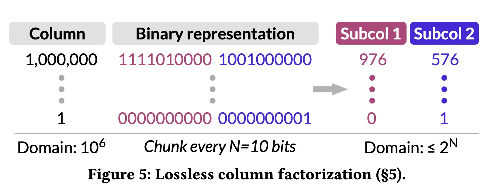

## AI论文解读 | Neurocard: One Cardinality Estimator For All Tables
        
### 作者        
digoal        
        
### 日期        
2025-10-16        
        
### 标签        
PostgreSQL , PolarDB , DuckDB , AI , 论文解读        
        
----        
        
## 背景  
      
https://arxiv.org/pdf/2006.08109        
  
提示:          
```          
读懂《Neurocard: One Cardinality Estimator For All Tables》这篇论文需要提前掌握哪些基础知识, 请使用中文通熟易懂的讲解这些基础知识, 可以引用论文中的图、表或使用Markdown支持的图形(text,mermaid等)增加解释性. 
  
使用中文通熟易懂的解读《Neurocard: One Cardinality Estimator For All Tables》这篇论文, 其中的关键内容请着重讲解, 可以引用论文中的图、表或使用Markdown支持的图形(text,mermaid等)增加解释性. 
  
提取《Neurocard: One Cardinality Estimator For All Tables》这篇论文中的重要术语, 使用中文对这些术语进行通熟易懂的讲解, 可以引用论文中的图、表或使用Markdown支持的图形(text,mermaid等)增加解释性. 
```     
  
## 1 前置知识 
  
好的，为了完全理解《NeuroCard: One Cardinality Estimator For All Tables》这篇论文，你需要掌握一些数据库和机器学习领域的基础知识。下面我将用通俗易懂的中文为你逐一讲解，并引用论文中的图表来帮助理解。

这些基础知识可以分为五个关键部分：

1.  **数据库查询优化与基数估计** (问题的背景)
2.  **概率密度估计** (核心思想)
3.  **深度自回归模型** (核心技术)
4.  **连接 (Join) 操作与数据采样** (解决多表问题的关键)
5.  **无损列分解** (工程上的优化技巧)

-----

### 1\. 数据库查询优化与基数估计 (The "Why")

想象一下，你使用导航软件从家到公司，软件会为你规划出多条路线（比如走高速、走市区、走小路），并告诉你哪条最快。数据库在执行一个复杂的SQL查询时，也面临同样的问题。

  * **查询计划 (Query Plan)**: 对于一条SQL查询，数据库可以有多种执行方式，比如先连接A表和B表，再连接C表；或者先连接B表和C表，再连接A表。每种方式就是一个“查询计划”。
  * **查询优化器 (Query Optimizer)**: 它的任务就像导航软件，从众多查询计划中，选择一个成本最低（通常是执行最快）的计划。 
  * **基数估计 (Cardinality Estimation)**: 为了做出明智的选择，优化器需要估算每一步操作会产生多少行数据，这个“行数”就是**基数**。例如，优化器需要知道“A表和B表连接后，大概会产生多少行结果？”。这个估算如果严重失准，就像导航软件算错了路况，很可能会导向一条极其拥堵的路线，导致查询性能急剧下降。 

论文指出，传统的基数估计器在面对多表连接的复杂查询时，误差会呈指数级增长 ，这正是NeuroCard想要解决的核心问题。

-----

### 2\. 概率密度估计 (The Core Idea)

传统的基数估计方法（如直方图）非常粗糙，它们通常会做一些简化的假设，比如“各个列之间是相互独立的”，但这在真实世界的数据中往往是不成立的（例如，城市和邮政编码强相关）。

NeuroCard采用了一种更根本的方法：**数据驱动 (data-driven)**，它不再依赖简化的假设，而是尝试直接学习整个数据库的**联合概率分布**。 

  * **什么是概率分布？**
    你可以把它理解为数据生成的“蓝图”。它描述了数据库中出现任意一行特定数据的概率是多少。例如，一个关于用户的数据库，它的概率分布可以告诉我们，一个“30岁、住在北京、职位是工程师”的用户出现的概率。

  * **如何用概率分布来估计基数？**
    一旦我们有了这个精确的“蓝图”（ 即概率模型 $p(\cdot)$ ），任何查询的基数都可以通过下面的公式计算：
    $$\text{查询基数} = \text{总行数} \times \text{查询命中概率}$$
    其中，“查询命中概率”可以通过概率模型计算得出。 

    这篇论文的目标，就是用一个单一的深度学习模型，去学习数据库中**所有表**连接在一起后的联合概率分布 $P(\text{all tables})$ 。     

    > **论文图1的直观解释**: 

    > 这张图形象地展示了NeuroCard的核心思想。左边是各种各样的多表连接查询，我们需要估计它们的基数（Cardinality）。右边的NeuroCard用一个神经网络，学习了**所有表**的联合概率分布 `P(all tables)`。有了这个模型，无论左边的查询涉及到哪些表的子集，都可以向这个统一的模型提问，从而得到基数估计。 

-----

### 3\. 深度自回归模型 (The "How")

既然目标是学习数据的联合概率分布，那么用什么模型来学呢？NeuroCard选择了**深度自回归模型 (Deep Autoregressive Model)**。 

  * **自回归 (Autoregressive)**: 这个词听起来很复杂，但原理很简单，就是“用前面的信息预测下一个”。最典型的例子就是手机输入法：当你输入“我爱”时，输入法会预测下一个词可能是“中国”。

  * **在数据库中的应用**:
    自回归模型将一张表的多个列看作一个序列。它学习的是在给定前面所有列值的条件下，当前列出现某个值的概率。用数学公式表达就是概率的链式法则：
    $$p(A_1, A_2, ..., A_n) = p(A_1) \times p(A_2 | A_1) \times p(A_3 | A_1, A_2) \times \dots$$
    这个公式的美妙之处在于，它没有任何独立性假设，可以精确地表达任意复杂的联合分布。     

    > **论文图3的直观解释**:

    > 这张图展示了自回归模型的内部结构。一行数据 $(x_1, ..., x_n)$ 输入模型后，模型会依次计算出 $P(X_1)$ , $P(X_2|x_1)$ , $P(X_3|x_1, x_2)$ ... 等一系列条件概率。将它们全部乘起来，就得到了整行数据 $(x_1, ..., x_n)$ 出现的概率。 

-----

### 4\. 连接 (Join) 操作与数据采样 (Handling "All Tables")

NeuroCard最大的创新点是处理多表连接。它的目标是学习所有表进行**全外连接 (Full Outer Join)** 后的数据分布。 

  * **为什么是全外连接？**
    因为全外连接保留了所有表的所有信息。即使某张表的某一行在另一张表中没有匹配项，它依然会出现在结果中。这保证了模型有足够的信息去回答只涉及部分表的查询。如果使用内连接 (Inner Join)，那些没有匹配上的数据就会丢失。 

  * **挑战**:
    一个数据库中所有表的全外连接结果可能是天文数字（论文中提到JOB-light数据集的6张表连接后有 $2 \times 10^{12}$ 行 ），直接计算出来再让模型学习是**完全不可行**的。

  * **解决方案：无偏连接采样 (Unbiased Join Sampling)**
    既然不能把整片“海洋”（全连接结果）都给模型，那就从中舀几瓢“水”（采样一些数据）给模型尝尝。关键是，舀水的方式必须是**公平的 (unbiased)**，即“海洋”中任何一滴水被舀到的概率都必须完全相等。  这样，模型通过学习这些样本，就能推断出整个“海洋”的样貌。
    NeuroCard使用了一种高效的采样算法，它可以在不实际计算全连接的情况下，直接从中抽取公平的、独立的样本。     

    > **论文图2的直观解释**:

    > 这个架构图清晰地展示了采样过程。底层的**Tables**和**Join Schema**首先经过`prepare`阶段，生成**Join Count Tables**（用于计算采样权重）。然后**Join Sampler**（连接采样器）利用这些信息，高效地生成`tuples from join`（来自连接结果的样本元组），并将这些样本流式地喂给上层的**Autoregressive Core**（自回归模型核心）进行训练。 

-----

### 5\. 无损列分解 (Lossless Column Factorization)

这是一个非常实用的工程优化技巧，用于解决模型大小的问题。

  * **问题**:
    如果一个列（比如用户ID）有几百万个不同的值，自回归模型就需要一个巨大的参数矩阵（称为嵌入矩阵）来表示这些值，这会导致模型变得非常臃肿。 

  * **解决方案**:
    将一个大的数值拆分成几个小的数值。例如，一个32位的整数，可以把它看作4个8位的整数。模型不再学习这个32位大整数的分布，而是学习这4个8位小整数的联合分布。    

    > **论文图5的直观解释**:

    > 这张图完美地诠释了列分解。一个取值范围高达一百万的列，其值（如1,000,000）首先被转换为二进制表示。然后，这个二进制串被切成几段（图中是每10位一段）。每一段再被转换回十进制，形成新的、取值范围小得多的“子列”（Subcol 1, Subcol 2）。 

  * **为什么是“无损”的？**
    因为NeuroCard使用的是自回归模型。该模型会学习这些子列之间的相关性（ 例如， $p(\text{subcol}_2 | \text{subcol}_1)$ ）。因此，从理论上讲，原始列的信息没有在分解过程中丢失，这与假设各部分独立的直方图等方法有本质区别。 

### 总结

要读懂 NeuroCard 论文，你需要理解：

  * **目标**：为了让数据库**查询优化器**更准，需要提供精确的**基数估计**。
  * **思路**：通过学习数据的**概率分布**来解决问题，而不是依赖简化的规则和假设。
  * **模型**：使用强大的**深度自回归模型**，因为它能捕捉列与列之间复杂的关联，没有任何独立性假设。
  * **核心挑战与方案**：
      * 为了处理任意多表查询，模型学习**全外连接**的分布。
      * 因为全外连接太大，所以采用**无偏连接采样**技术来高效获取训练数据。
      * 为了让模型更小、更实用，对高基数列采用**无损列分解**技巧。

掌握了这些概念，你就能更好地理解 NeuroCard 如何将这些技术巧妙地结合起来，构建一个能够覆盖整个数据库、功能强大且准确的基数估计器。
  
## 2 解读论文 
  
好的，我们来一起用通俗易懂的方式解读《NeuroCard: One Cardinality Estimator For All Tables》这篇重量级论文。

### 核心思想：用一个模型估算所有查询

想象一下，数据库的“查询优化器”就像一个城市交通的智能调度系统。当你输入一条SQL查询（比如“查找过去一年在北京地区购买过手机和耳机的30岁以下用户”），这个系统需要规划出一条最快的执行路径（是先筛选用户，还是先连接订单表？）。为了做出最佳决策，它必须能准确预测每一步操作会产生多少数据量，这个数据量就是**基数 (Cardinality)**。

传统方法在估算复杂的多表连接查询时，误差很大，常常导致查询性能灾难 。

NeuroCard提出了一个颠覆性的想法：**不再为每一种查询或每张表单独建模，而是训练一个统一的、全知全能的深度学习模型，让它学会整个数据库中所有表之间所有可能的关联 。**

  

> **论文图解核心思想 (Figure 1)**
> 左边是用户可能发起的各种多表连接查询，我们需要估算它们的基数（比如50或1000）。右边的NeuroCard用一个单一的深度自回归神经网络，学习了所有表的联合概率分布 `P(all tables)` 。之后，无论什么样的查询（无论涉及多少张表），都可以向这一个模型提问，从而得到准确的基数估计 。

-----

### NeuroCard如何克服三大挑战？

为了实现这个宏伟目标，NeuroCard必须解决三个关键的挑战。

#### 挑战一：高昂的训练成本 (High Training Cost)

**问题**：要让模型学习所有表的关联，最直接的方法是先将数据库里所有表通过“全外连接 (Full Outer Join)”操作连接成一张超级大表。但这张超级大表的行数可能是天文数字（论文中一个6表的库连接后就有2万亿行），在现实中根本无法计算和存储 。

**NeuroCard的解决方案：无偏连接采样 (Unbiased Join Sampling)**

既然我们无法把整片“海洋”（全连接结果）都展示给模型，那就只从“海洋”中公平地（无偏地）舀几瓢“水”（采样一些数据行）给模型学习 。

这个过程的关键在于“公平”。NeuroCard采用了一种先进的采样算法，它**不需要真正执行那个庞大的连接操作**，而是通过一系列精巧的计算（动态规划），直接从原始表中抽取样本，并能保证每个可能存在于最终连接结果中的数据行，都有完全相等的被抽中概率 。

  

> **论文图解系统架构 (Figure 2)**
> 整个系统的工作流程如上图所示。底部的原始数据表 (`Tables`) 首先经过一个准备阶段 (`prepare`)，计算出用于采样的权重信息 (`Join Count Tables`) 。然后，**Join Sampler**（连接采样器）利用这些信息，高效地生成连接后的样本数据 (`tuples from join`)，并将它们源源不断地提供给上层的**Autoregressive Core**（自回归模型核心）进行训练 。

#### 挑战二：缺乏通用性 (Lack of Generality)

**问题**：假设我们为 `A ⋈ B ⋈ C` 这个三表连接训练了一个模型，这个模型无法直接用来估算 `A ⋈ B` 或者单表 `A` 的查询 。难道要为每一种可能的表组合都训练一个模型吗？这显然不现实，因为组合的数量会随着表的增多而爆炸式增长 。

**NeuroCard的解决方案：学习全外连接 + 处理模式子集 (Schema Subsetting)**

1.  **学习最全的信息**：NeuroCard的模型学习的是所有表**全外连接**后的数据分布 。因为全外连接保留了所有表的全部信息，所以理论上它包含了回答任何子集查询所需要的信息 。

2.  **处理查询子集**：当一个查询只涉及部分表时（例如，模型学了`A-B-C`，但查询只有`A`），NeuroCard需要修正一个叫做“扇出 (Fanout)”效应的偏差 。简单来说，`A`表的一行数据可能因为与`B`表和`C`表的多行数据匹配，而在超级大表中重复出现了很多次。直接用这个模型估算单表`A`的查询，结果会被放大。
    为了解决这个问题，NeuroCard在训练时，让模型额外学习了一些“虚拟列”，比如每个表是否有匹配项的“指示列”和记录重复次数的“扇出列” 。在查询时，通过这些虚拟列的值，就可以精确地将结果缩减回正确的范围 。     

> **论文图解扇出效应 (Figure 4)**
> 在这个例子中，原始表A中 `A.x=2` 只有1行 。但在(c)所示的全连接结果中，由于和B、C表的连接，`A.x=2` 出现了3次 。NeuroCard通过学习额外的扇出信息（比如 `F_B.x`），可以在查询单表A时，将估算结果从3修正回正确的1 。

#### 挑战三：模型体积过大 (Large Model Size)

**问题**：深度学习模型的大小通常与它需要记忆的“东西”数量有关。如果一个列（比如用户ID）有数百万个不同的值，模型就需要一个非常大的参数矩阵来表示它们，这会导致模型占用巨大的存储空间，变得不切实际 。

**NeuroCard的解决方案：无损列分解 (Lossless Column Factorization)**

这是一个非常巧妙的工程优化。它将一个取值范围很大的列，分解成多个取值范围很小的“子列” 。    

> **论文图解列分解 (Figure 5)**
> 如图所示，一个取值高达一百万的列，其值（如1,000,000）可以先转换成二进制形式，然后像切蛋糕一样把它切成几段（比如每10位一段） 。每一小段再转换回十进制，就成了一个取值范围小得多的新列（子列） 。模型现在只需要学习这些小范围子列的联合分布即可 。

这个过程之所以是“无损的”，是因为NeuroCard使用的**自回归模型**会捕捉这些子列之间的全部相关性，从而完整地保留了原始列的信息 。通过这种方式，模型大小可以被压缩数百倍 。

-----

### 实验效果：准确、高效、可扩展

论文通过在多个基准测试集上的实验，证明了NeuroCard的卓越性能。

  * **极高的准确性**：

      * 在流行的JOB-light基准测试上，NeuroCard取得了新的最佳成绩，最大误差仅为8.5倍，比之前的最好方法提升了4.6倍 。
      * 在更困难、包含更多范围查询的JOB-light-ranges测试集上，NeuroCard的准确性比之前的方法高出15到34倍 。
      * 在包含16张表和多键连接的复杂场景JOB-M中，NeuroCard依然表现出色，准确性比传统方法高出10倍以上，同时模型大小仅为27MB 。

  * **高效的构建与更新**：

      * NeuroCard只需要学习几百万个采样样本（通常在5分钟内完成），就能达到业界顶尖的准确度 。
      * 当数据更新时，它支持快速的增量训练，只需几秒到几分钟即可恢复大部分准确性，非常实用 。

### 总结

《NeuroCard》这篇论文的核心贡献在于：

1.  **提出了一个统一的、数据驱动的基数估计框架**，用单个模型捕捉数据库中所有表之间的复杂关联，摆脱了传统方法的独立性假设 。
2.  **巧妙地结合了无偏连接采样、全外连接学习和无损列分解等技术**，成功解决了训练成本、通用性和模型大小这三大现实挑战 。
3.  **在多个基准测试中取得了SOTA（State-of-the-art）的成果**，证明了该方法在准确性和效率上的巨大优势，为数据库查询优化领域开辟了新的道路 。

总而言之，NeuroCard是第一个能够对十几张表进行无假设概率建模的基数估计器，是深度学习技术与经典数据库问题成功结合的典范 。
  
## 3 术语 
  
好的，这是对《NeuroCard: One Cardinality Estimator For All Tables》论文中关键术语的提取与通俗讲解。

### 1\. 基数估计 (Cardinality Estimation)

  * **讲解**: “基数”在数据库里指的就是数据表的“行数”。基数估计是指在SQL查询执行前，预估查询的每一步会返回多少行结果 。这个估算至关重要，因为它直接影响查询优化器选择哪种执行方案 。一个错误的估算可能导致数据库选择一个极其缓慢的查询计划，就像导航软件算错了路况，把你导向了一条世纪大拥堵的路。

### 2\. 查询优化器 (Query Optimizer)

  * **讲解**: 查询优化器是数据库的大脑 。对于同一条SQL查询，通常有成百上千种执行方式（比如先连接A、B表，还是先过滤C表）。查询优化器的任务就是利用基数估计等信息，从中挑选出成本最低（通常意味着执行最快）的一个查询计划 。

### 3\. 数据驱动 (Data-Driven) vs. 查询驱动 (Query-Driven)

  * **讲解**: 这是两种基数估计的方法论。
      * **查询驱动 (Query-Driven)**: 像备考一样，通过学习历史查询（“题库”）和它们的真实基数（“答案”）来预测新查询的基数 。它的缺点是如果遇到题库里没有的新题型（未见过的查询），就可能估不准 。
      * **数据驱动 (Data-Driven)**: 不依赖历史查询，而是尝试直接学习数据本身的分布规律，理解数据是如何生成的 。一旦掌握了数据的“蓝图”，理论上就能回答任何关于这份数据的查询 。NeuroCard就是一种典型的数据驱动方法 。

### 4\. 深度自回归模型 (Deep Autoregressive Model)

  * **讲解**: 这是一种强大的深度学习模型，核心思想是“看上文，猜下文” 。它将一行数据的多个列看作一个序列，然后按顺序学习每一个列的条件概率，即在已知前面所有列值的条件下，当前列出现某个特定值的概率 。这种模型因为不作任何独立性假设，所以能精确地捕捉列与列之间任意复杂的关联关系 。    

    > **论文图解模型架构 (Figure 3)**

    > 这张图展示了自回归模型的内部工作原理。一行数据 $(x_1, ..., x_n)$ 输入模型后，模型会依次计算出 $P(X_1)$ , $P(X_2|x_1)$ , $P(X_3|x_1, x_2)$ ... 等一系列条件概率 。

### 5\. 全外连接 (Full Outer Join)

  * **讲解**: 这是一种连接数据表的方式，它会保留参与连接的所有表中的所有行。即使某张表的某一行在另一张表中找不到匹配项，它依然会出现在最终结果里（不匹配的字段会用NULL填充）。NeuroCard选择学习所有表的全外连接分布，就是为了确保模型包含了数据库的全部信息，从而能回答针对任何表子集的查询 。如果用内连接(Inner Join)，那些没有匹配上的数据就会丢失，模型信息就不完整了 。

### 6\. 无偏连接采样 (Unbiased Join Sampling)

  * **讲解**: 要学习全外连接的分布，但又不能把它真正计算出来（因为它太大了），怎么办？答案是采样。无偏连接采样是一种高级技术，它可以在不实际执行连接操作的情况下，从理论上的连接结果中抽取样本 。最关键的是“无偏”，它保证了最终连接结果中的任何一行数据，被抽中的概率都是完全相等的 。这样得到的样本才能真实地反映整体的数据分布，供模型进行有效学习。

### 7\. 无损列分解 (Lossless Column Factorization)

  * **讲解**: 这是NeuroCard处理高基数列（即一个列有非常多不同值的列，如用户ID）的独门秘技 。它将一个大数值拆分成几个小数值来学习，从而大幅减小模型体积 。

      * **例如**: 一个32位的ID，可以分解成4个8位的子列。模型不再学习这个32位大ID的分布，而是学习这4个8位小子列的联合分布 。
      * **为什么“无损”** : 因为NeuroCard使用的是自回归模型，该模型会学习这些子列之间的相关性，比如`P(子列2 | 子列1)`。因此，理论上原始列的全部信息都被保留了下来，没有在分解中丢失 。    

    > **论文图解列分解 (Figure 5)**

    > 上图清晰地展示了这个过程。一个取值范围很大的列（ Domain: $10^6$ ），其值先被转换成二进制，再被切成小块（Subcol 1, Subcol 2），每个小块的取值范围就小了很多（ Domain: $\le2^{N}$ ） 。

### 8\. 模式子集化 (Schema Subsetting)

  * **讲解**: 这个术语描述了一种核心挑战：NeuroCard的模型学习了所有表（全模式）的联合分布，但用户查询可能只涉及其中几张表（模式子集）。直接用这个“全知”模型去估算“部分”问题，结果会不准确，需要进行校正 。

### 9\. 虚拟列 (Virtual Columns)

  * **讲解**: 这是NeuroCard为了解决“模式子集化”问题而引入的辅助列，它们在物理上不存在，是在采样和训练时动态生成的 。主要有两种：

      * **指示列 (Indicators)**: 一个布尔值，用来标记某一行数据在某个表中是否有真实的匹配伙伴 。这有助于区分内连接和外连接的情况 。
      * **扇出列 (Fanouts)**: 记录一个连接键（key）在它所在的表中总共出现了多少次 。这个值可以用来修正因一对多连接导致的数据“膨胀”效应 。    

    > **论文图解虚拟列 (Figure 4c)**

    > 在这张全外连接的结果表中，蓝色标注的 `FB.x`, `FC.y` 就是扇出列，记录了B表x列和C表y列中某个值的出现次数 。而 `IA`, `IB`, `IC` 就是指示列，标记了该行数据在A、B、C三表中是否真实存在 。

### 10\. Q-误差 (Q-error)

  * **讲解**: 这是衡量基数估计器准确度的黄金标准 。它的计算公式是：
    $$Q-error = \\max(\\frac{\\text{真实基数}}{\\text{估计基数}}, \\frac{\\text{估计基数}}{\\text{真实基数}})$$
    
    Q-error的值永远大于等于1 。这个值越接近1，说明估计得越准确。例如，Q-error为10，表示估计值和真实值之间差了10倍（可能是10倍也可能是1/10）。
  
## 参考        
         
https://arxiv.org/pdf/2006.08109    
        
<b> 以上内容基于DeepSeek、Qwen、Gemini及诸多AI生成, 轻微人工调整, 感谢杭州深度求索人工智能、阿里云、Google等公司. </b>        
        
<b> AI 生成的内容请自行辨别正确性, 当然也多了些许踩坑的乐趣, 毕竟冒险是每个男人的天性.  </b>        
  
    
#### [期望 PostgreSQL|开源PolarDB 增加什么功能?](https://github.com/digoal/blog/issues/76 "269ac3d1c492e938c0191101c7238216")
  
  
#### [PolarDB 开源数据库](https://openpolardb.com/home "57258f76c37864c6e6d23383d05714ea")
  
  
#### [PolarDB 学习图谱](https://www.aliyun.com/database/openpolardb/activity "8642f60e04ed0c814bf9cb9677976bd4")
  
  
#### [PostgreSQL 解决方案集合](../201706/20170601_02.md "40cff096e9ed7122c512b35d8561d9c8")
  
  
#### [德哥 / digoal's Github - 公益是一辈子的事.](https://github.com/digoal/blog/blob/master/README.md "22709685feb7cab07d30f30387f0a9ae")
  
  
#### [About 德哥](https://github.com/digoal/blog/blob/master/me/readme.md "a37735981e7704886ffd590565582dd0")
  
  

  
