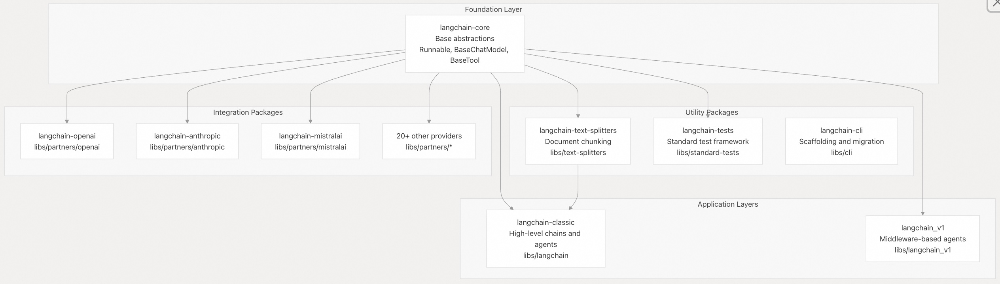
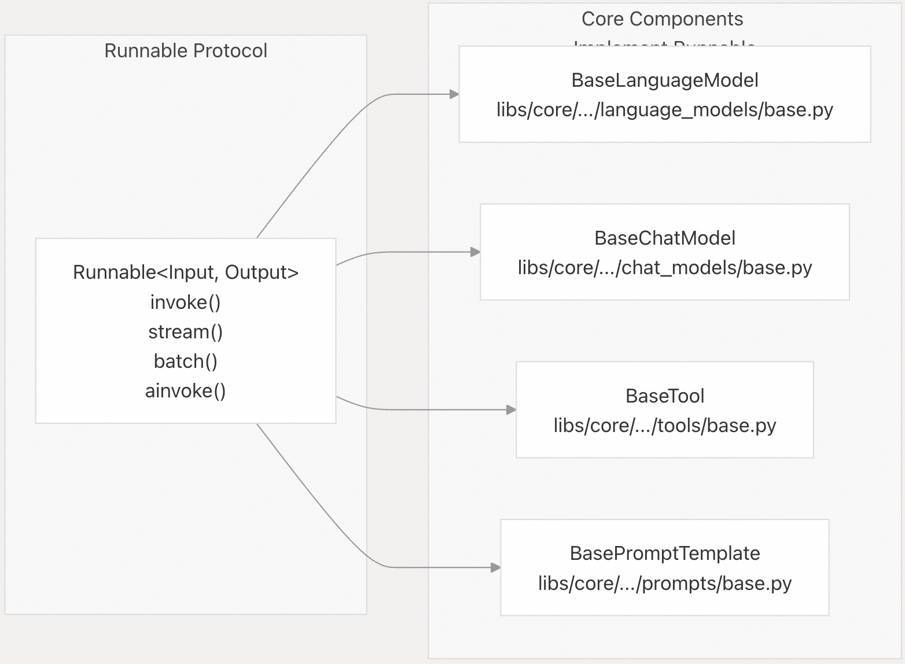
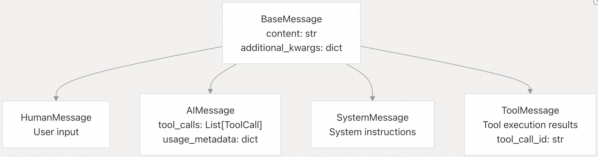
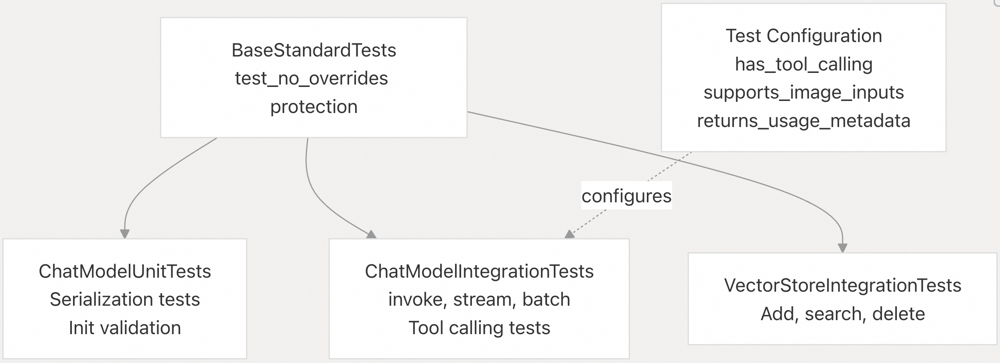

## LangChain 源码学习: 1 设计思想                          
                                              
### 作者                                      
digoal                                      
                                              
### 日期                                        
2025-10-16                                            
                                       
### 标签                                            
AI Agent , Powered by LLM , LangChain , 设计思想                                        
                                             
----                                         
                                         
## 背景    
本文从 high-level 角度介绍 LangChain 代码库的结构、架构理念和核心组件。帮助理解 LangChain 代码库是如何组织成一个模块化框架，用于构建由大型语言模型 (LLM) 驱动的应用程序。  
  
## 代码库架构  
LangChain 以 monorepo 模块化的形式组织，位于 `libs/` 目录中，每个包在生态系统中都有不同的用途。LangChain 以 langchain-core 为基础, 遵循清晰的依赖关系层次结构。  
  
### 包组织  
  
  
  
### 依赖关系  
LangChain 代码库强制执行严格的依赖项管理以维护模块化。每个包都声明了最低限度的必需依赖项，并通过依赖组提供可选的集成。   
  
包	| 必需的依赖项	| 包的功能  
---|---|---  
`langchain-core`	| `langsmith`，`jsonpatch`，`PyYAML`，`pydantic`，`tenacity`	| 核心抽象  
`langchain-classic`	| `langchain-core`，`langchain-text-splitters`，`SQLAlchemy`，`requests`	| High-level 功能  
`langchain-text-splitters`	| `langchain-core`	| 文档处理, 例如对文档进行切分以满足RAG场景向量化需求  
Partner 包	| `langchain-core` + partner SDK	| 独立集成  
  
依赖关系执行通过 `libs/langchain/tests/unit_tests/test_dependencies.py` 进行验证.   
  
如果未经批准就添加新的必需依赖项，则会导致 CI 失败.   
  
## 核心设计原则  
### 1. 内置电池(开箱即用的组件)，并可更换电池(组件可替换)  
  
LangChain 提供全面的开箱即用功能，同时保留了组件的可替换性。集成的组件被隔离到单独的软件包中，用户只需安装所需的组件即可：  
```  
pip install langchain-core  # Just abstractions  
pip install langchain-openai  # Add OpenAI support  
pip install langchain-anthropic  # Add Anthropic support  
```  
  
### 2. 通用 Runnable 接口  
LangChain 中的所有内容都实现了该 `Runnable` 接口，从而实现了统一的组合模式(composition patterns)。这是 LangChain 表达式语言（LCEL, LangChain Expression Language）的基础。  
  
  
  
### 3. Provider 抽象  
LangChain 支持两种集成模式(integration patterns)：  
  
1、兼容 OpenAI 的 API 继承和重用：  
- `BaseChatOpenAI` 提供共享实现  
- `ChatOpenAI`，`AzureChatOpenAI`，`ChatXAI`，`ChatDeepSeek` 都继承自 `BaseChatOpenAI`   
  
2、Provider 专属功能的原生实现：  
- `ChatAnthropic` 为 Claude 专属功能实现的自定义消息格式（`cache_control`，`extended thinking`）  
- `ChatMistralAI`，`ChatGroq`，`ChatFireworks` 提供优化的实现  
  
## 关键抽象概述  
### 消息协议  
  
  
  
这层结构标准化了组件之间的通信，并支持工具调用工作流程，通过 `AIMessage.tool_calls` 触发工具执行，并通过 `ToolMessage` 返回结果。  
  
### 模式组合  
LangChain 提供多种组合原语：  
  
模式	| 类	| 目的  
---|---|---  
Sequential	| `RunnableSequence`	| 通过`|`操作符链接组件  
Parallel	| `RunnableParallel`	| 同时执行多个组件  
Branching	| `RunnableBranch`	| 根据输入的条件路由  
Lambda	| `RunnableLambda`	| 将任意函数包装为 Runnable  
  
## 包版本控制  
LangChain 代码库使用以下语义版本控制方案：   
- `langchain-core` : 目前处于 `1.0.0a8` (alpha)  
- langchain-classic：目前处于 `1.0.0a1`（alpha）  
- 重大变更会增加次要版本号  
- 错误修复和增加新功能增加补丁版本号  
  
## 测试基础设施 (Infrastructure)  
LangChain 通过 `langchain-tests` 提供全面的测试框架：  
  
  
  
合作伙伴包继承自这些基类，并配置属性以启用相关的测试套件。VCR cassettes 模拟 HTTP 交互以进行确定性测试。  
  
## 社区和生态系统  
LangChain 与更广泛的生态系统相融合：  
- `LangSmith`：LLM 应用的可观察性和评估平台  
- `LangGraph`：用于构建有状态AI agent工作流的低级框架  
- `LangGraph Platform`：长期运行 AI agent 的部署平台  
- 20 多个合作伙伴集成：OpenAI、Anthropic、Mistral、Groq、Fireworks、XAI、DeepSeek 等  
  
模块化架构允许用户逐步采用组件，从简单的 `langchain-core` 开始，然后根据需要添加集成。  
  
## 安装  
```  
# Core abstractions only  
pip install langchain-core  
  
# Classic high-level functionality  
pip install langchain-classic  
  
# With provider integrations  
pip install langchain-classic[openai,anthropic]  
  
# Text splitting utilities  
pip install langchain-text-splitters  
  
# CLI tools  
pip install langchain-cli  
```  
       
#### [期望 PostgreSQL|开源PolarDB 增加什么功能?](https://github.com/digoal/blog/issues/76 "269ac3d1c492e938c0191101c7238216")
  
  
#### [PolarDB 开源数据库](https://openpolardb.com/home "57258f76c37864c6e6d23383d05714ea")
  
  
#### [PolarDB 学习图谱](https://www.aliyun.com/database/openpolardb/activity "8642f60e04ed0c814bf9cb9677976bd4")
  
  
#### [PostgreSQL 解决方案集合](../201706/20170601_02.md "40cff096e9ed7122c512b35d8561d9c8")
  
  
#### [德哥 / digoal's Github - 公益是一辈子的事.](https://github.com/digoal/blog/blob/master/README.md "22709685feb7cab07d30f30387f0a9ae")
  
  
#### [About 德哥](https://github.com/digoal/blog/blob/master/me/readme.md "a37735981e7704886ffd590565582dd0")
  
  

  
