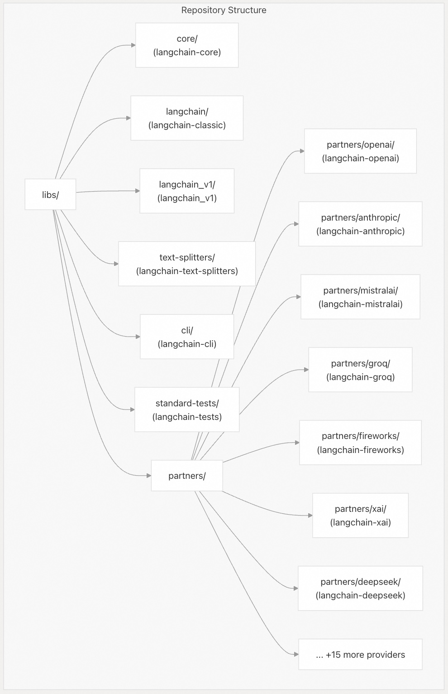
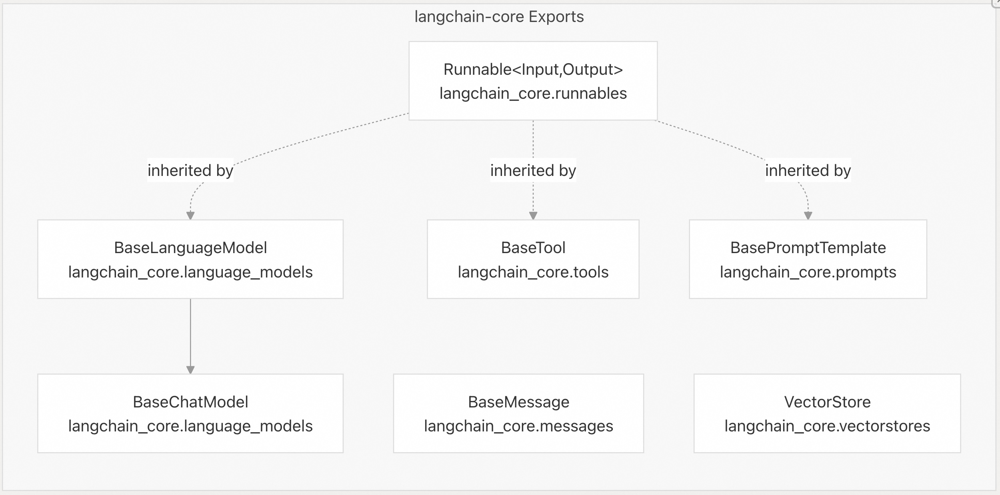
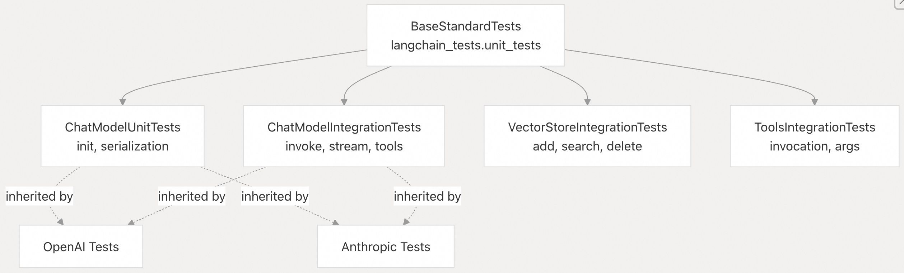
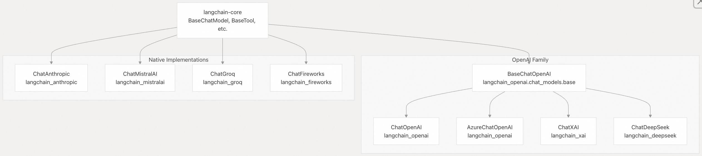
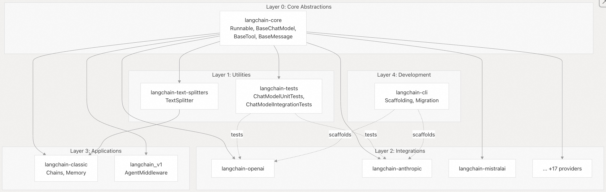

## LangChain 源码学习: 1.1 包生态系统                            
                                                
### 作者                                        
digoal                                        
                                                
### 日期                                          
2025-10-16                                              
                                         
### 标签                                              
AI Agent , Powered by LLM , LangChain , 源码学习                                         
                                               
----                                           
                                           
## 背景      
本文全面概述 LangChain 项目的 `monorepo` 目录结构，详细说明每个包的用途和依赖关系。文档涵盖核心抽象层（`langchain-core`）、主要应用程序包（`langchain-classic`、`langchain_v1`）、实用程序包（`langchain-text-splitters`、`langchain-cli`、`langchain-tests`）以及 20 多个合作伙伴集成包的生态系统。  
  
## Monorepo 组织  
LangChain 项目仓库 `libs/` 目录下为 Monorepo 组织(每个目录代表一个独立包?)，每个包都作为独立的 PyPI 发行版进行维护。这种架构支持模块化安装 —— 用户只需安装所需的包，而不是完整安装一个单一的框架。  
  
  
  
目录到包的映射(Directory-to-Package Mapping)  
  
目录路径	| PyPI 包名称	| 主要用途  
---|---|---  
`libs/core/` | 	`langchain-core` | 	基础抽象（`Runnable`、`BaseChatModel` 等）  
`libs/langchain/` | 	`langchain-classic` | 	High-level chains, legacy components  
`libs/langchain_v1/` | 	`langchain_v1` | 	下一代基于中间件的代理系统  
`libs/text-splitters/` | 	`langchain-text-splitters` | 	文档分块实用程序  
`libs/cli/` | 	`langchain-cli` | 	项目脚手架和迁移工具  
`libs/standard-tests/` | 	`langchain-tests` | 	可重复使用的集成测试框架  
`libs/partners/{provider}/` | 	`langchain-{provider}` | 	Provider-specific 集成  
  
## 基础软件包：`langchain-core`  
`langchain-core` 软件包定义了所有其他软件包所依赖的稳定抽象。它具有最少的依赖项（`Pydantic`、`LangSmith`、`PyYAML`、`packaging`），以保持轻量级的安装占用空间。  
  
  
  
依赖项:  
```  
dependencies = [  
    "langsmith>=0.3.45,<1.0.0",  
    "tenacity!=8.4.0,>=8.1.0,<10.0.0",  
    "jsonpatch>=1.33.0,<2.0.0",  
    "PyYAML>=5.3.0,<7.0.0",  
    "typing-extensions>=4.7.0,<5.0.0",  
    "packaging>=23.2.0,<26.0.0",  
    "pydantic>=2.7.4,<3.0.0",  
]  
```  
  
`langchain-core` 的版本在 `libs/core/langchain_core/version.py` 中可找到 `VERSION = "1.0.0a8"`。 `langchain-core` 包是所有 LangChain 包唯一的必需依赖项，用于强制执行抽象层。  
  
## 主要应用包  
### langchain-classic  
`langchain-classic` 软件包（安装时名为`langchain-classic`，过去称为`langchain`）提供了诸如chains、agents和memory(向量存储, Agent 记忆?)等高级抽象。这是 LangChain 应用程序的传统入口点。  
  
所需依赖项:  
```  
dependencies = [  
    "langchain-core>=1.0.0a7,<2.0.0",  
    "langchain-text-splitters>=1.0.0a1,<2.0.0",  
    "langsmith>=0.1.17,<1.0.0",  
    "pydantic>=2.7.4,<3.0.0",  
    "SQLAlchemy>=1.4.0,<3.0.0",  
    "requests>=2.0.0,<3.0.0",  
    "PyYAML>=5.3.0,<7.0.0",  
    "async-timeout>=4.0.0,<5.0.0; python_version < \"3.11\"",  
]  
```  
  
可选的 Provider 程序依赖项 (该包定义了 Provider-集成包 的可选依赖组) ：  
```  
[project.optional-dependencies]  
anthropic = ["langchain-anthropic"]  
openai = ["langchain-openai"]  
google-vertexai = ["langchain-google-vertexai"]  
google-genai = ["langchain-google-genai"]  
fireworks = ["langchain-fireworks"]  
ollama = ["langchain-ollama"]  
together = ["langchain-together"]  
mistralai = ["langchain-mistralai"]  
groq = ["langchain-groq"]  
aws = ["langchain-aws"]  
deepseek = ["langchain-deepseek"]  
xai = ["langchain-xai"]  
perplexity = ["langchain-perplexity"]  
```  
  
用户可以根据使用的 Provider-集成包 进行安装, 例如：`pip install langchain-classic[openai,anthropic]` 。  
  
测试依赖正确性：  
```  
libs/langchain/tests/unit_tests/test_dependencies.py  
```  
  
确保未经明确批准不会添加任何新的必需依赖项，从而保持“内置电池(包)但电池(包)可更换”的理念。   
  
### langchain_v1  
`langchain_v1` 软件包实现了下一代基于中间件的代理(agent)架构。这代表着从传统的 `ReAct-style 代理` 向可组合、可观察和可控制的工作流(workflow)的根本转变。  
  
## 实用程序包  
### `langchain-text-splitters` (langchain 文本分割器)  
提供文档分块实用程序，用于将大文本分解为适合 LLM 处理的较小片段。此包仅依赖 `langchain-core`，无任何第三方集成依赖。  
  
关键组件：  
- `TextSplitter` 基类  
- 各格式分割器（`HTML`、`Markdown`、`JSON`、`code` 等）  
- Tokenizer 集成（`tiktoken`、`HuggingFace`）  
  
安装方法：`pip install langchain-text-splitters`  
  
### langchain-tests  
`langchain-tests` 包为集成包提供了可重用的测试套件。它通过基础测试类在所有 Provider-集成包 中强制执行标准测试行为。  
  
标准测试类：  
  
  
  
使用方法, Provider-集成包 中采用标准继承方式使用测试类：  
```  
# tests/unit_tests/test_standard.py  
from langchain_tests.unit_tests import ChatModelUnitTests  
  
class TestParrotChainStandard(ChatModelUnitTests):  
    @pytest.fixture  
    def chat_model_class(self) -> Type[BaseChatModel]:  
        return ChatParrotChain  
```  
  
框架包括通过诸如`has_tool_calling`、`supports_image_inputs`和`returns_usage_metadata`等属性进行基于能力的测试，这些属性可以启用或禁用特定的测试套件。  
  
### langchain-cli  
`langchain-cli` 软件包提供了用于构建新集成、管理模板和生成迁移脚本的开发人员工具。它作为独立工具运行，运行时不依赖于其他 LangChain 软件包。  
  
## 合作伙伴集成包  
LangChain 为提供商(Provider)集成维护了 20 多个独立的包，每个包都遵循一致的结构并依赖 `langchain-core` 基本抽象。  
  
### 集成架构  
  
  
  
集成模式：  
  
1、基于继承的重用：凡是与 `OpenAI` 兼容的 API（`xAI`、`DeepSeek`、`Groq`、`Fireworks`）提供商, 可继承 `BaseChatOpenAI` 获得最大化代码重用。  
  
2、原生实现：具有独特功能的提供商（Anthropic's cache control, extended thinking）直接在 `BaseChatModel` 中进行实现。  
  
### 可用的集成举例  
  
`libs/langchain/pyproject.toml` 已包含的生态系统包：  
  
包	| 提供者	| 特殊功能  
---|---|---  
`langchain-openai` | 	OpenAI, Azure OpenAI	| GPT-4, structured output, function calling  
`langchain-anthropic` | 	Anthropic	| Claude, prompt caching, extended thinking  
`langchain-mistralai` | 	Mistral	| Mistral models  
`langchain-google-vertexai` | 	Google Vertex AI	| Gemini, PaLM  
`langchain-google-genai` | 	Google AI	| Gemini via API  
`langchain-groq` | 	Groq	| Fast inference  
`langchain-fireworks` | 	Fireworks AI	| Multiple models  
`langchain-ollama` | 	Ollama	| Local model serving  
`langchain-aws` | 	AWS Bedrock	| Claude, Titan, etc.  
`langchain-xai` | 	xAI	| Grok models  
`langchain-deepseek` | 	DeepSeek	| DeepSeek models  
`langchain-perplexity` | 	Perplexity	| Search-augmented models  
  
## 依赖层次结构  
依赖结构强制执行清晰的架构分层，其中所有包都依赖于 `langchain-core`，并且不存在循环依赖。  
  
    
  
依赖规则：  
  
1、核心包的稳定性最重要：`langchain-core` 具有最少的第三方依赖性（`Pydantic`、`LangSmith`、`PyYAML`）并定义所有基本接口。  
  
2、实用程序包看重独立性：`langchain-text-splitters` 仅依赖 `langchain-core`，不依赖其他任何集成包。  
  
3、合作伙伴集成包之间要隔离：合作伙伴包（`OpenAI`、`Anthropic` 等）都依赖 `langchain-core` 但不相互影响，从而实现独立安装。  
  
4、应用层：`langchain-classic` 和 `langchain_v1` 位于堆栈顶部，通过可选依赖项导入集成包。  
  
5、开发工具：`langchain-cli` 和 `langchain-tests` 独立运行，仅在开发期间使用。  
  
`uv.lock` 文件：每个包都维护自己的`uv.lock`文件，用于可重复的构建，固定传递依赖关系，同时遵循 `pyproject.toml` 中定义的版本范围。  
  
## 软件包安装模式  
### 最小化安装  
对于仅使用核心抽象的应用程序：  
```  
pip install langchain-core  
```  
  
### 安装指定供应商(Provider)的包  
对于使用特定供应商程序的应用程序：  
```  
pip install langchain-core langchain-openai  
pip install langchain-core langchain-anthropic  
```  
  
### 完整的应用程序堆栈  
对于具有 chains 和多个供应商的综合应用程序：  
```  
pip install langchain-classic[openai,anthropic]  
# Automatically includes: langchain-core, langchain-text-splitters,   
# langchain-openai, langchain-anthropic  
```  
  
### 开发安装  
对于在 monorepo 上工作的贡献者，可以通过 `[tool.uv.sources]` 配置允许跨包进行本地开发，而无需 PyPI 发布。  
```  
[tool.uv.sources]  
langchain-core = { path = "../core", editable = true }  
langchain-tests = { path = "../standard-tests", editable = true }  
langchain-text-splitters = { path = "../text-splitters", editable = true }  
langchain-openai = { path = "../partners/openai", editable = true }  
```  
  
## 软件包版本和兼容性  
### 核心版本控制  
`langchain-core` 在 1.0 开发周期中，遵循 semantic 版本控制，并发布 alpha 版本。当前版本为 `1.0.0a8` 。  
  
### Python 版本支持  
所有软件包都需要 `Python >=3.10.0,<4.0.0` ，反映了现代 Python 类型和异步特性。  
  
### Pydantic 兼容性  
包生态系统与 `Pydantic v2.7` 至 `v2.14` 保持兼容性，并通过 CI 进行测试。确保在利用 v2 功能的同时，跨 Pydantic minor 版本的稳定性。  
  
### 依赖性测试  
最低版本兼容性是通过专用测试基础设施强制执行的，确保软件包与声明的版本范围可work，而不仅仅是最新版本。  
         
#### [期望 PostgreSQL|开源PolarDB 增加什么功能?](https://github.com/digoal/blog/issues/76 "269ac3d1c492e938c0191101c7238216")
  
  
#### [PolarDB 开源数据库](https://openpolardb.com/home "57258f76c37864c6e6d23383d05714ea")
  
  
#### [PolarDB 学习图谱](https://www.aliyun.com/database/openpolardb/activity "8642f60e04ed0c814bf9cb9677976bd4")
  
  
#### [PostgreSQL 解决方案集合](../201706/20170601_02.md "40cff096e9ed7122c512b35d8561d9c8")
  
  
#### [德哥 / digoal's Github - 公益是一辈子的事.](https://github.com/digoal/blog/blob/master/README.md "22709685feb7cab07d30f30387f0a9ae")
  
  
#### [About 德哥](https://github.com/digoal/blog/blob/master/me/readme.md "a37735981e7704886ffd590565582dd0")
  
  

  
