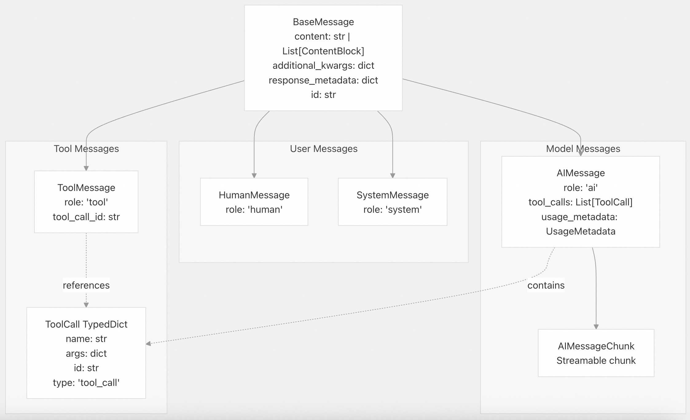
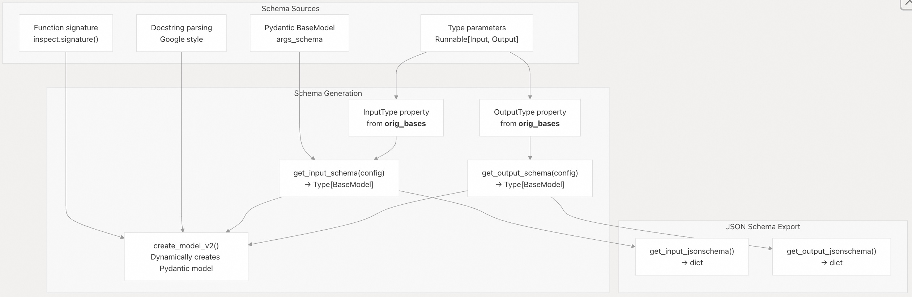

## LangChain 源码学习: 2 核心架构                             
                                                  
### 作者                                          
digoal                                          
                                                  
### 日期                                            
2025-10-16                                                
                                           
### 标签                                                
AI Agent , Powered by LLM , LangChain , 源码学习                                           
                                                 
----                                             
                                             
## 背景        
本文重点讲解构成 LangChain 架构基础的基本抽象和设计模式。涵盖了统一所有组件的 `Runnable` 接口、`LCEL`（LangChain 表达式语言）组合系统以及语言模型、工具、提示词和消息的核心抽象。  
  
有关这些抽象的实现细节，后续将分开单独分享：  
- `Runnable` 接口和 LCEL 组合模式  
- 语言模型实现  
- 工具系统及函数调用  
- 消息类型和提示词模板  
- 以及基于这些抽象构建的供应商集成包等。  
  
## `Runnable` 接口：通用组合能力  
`Runnable[Input, Output]` (`libs/core/langchain_core/runnables/base.py`) 是 LangChain 架构的基石, LangChain 中的每个组件（语言模型、工具、提示、检索器(指检索生成)、输出解析器）都实现了此接口，从而实现了统一的组合和执行模式。  
  
### Runnable 接口约定  
  
  
  
主要接口方法：  
- `invoke(input, config)` - 同步单次执行  
- `ainvoke(input, config)` - 异步单次执行  
- `stream(input, config)` - 流式输出生成  
- `batch(inputs, config)` - 并行批处理执行  
- 通过 `|` 运算符创建 `RunnableSequence`  
  
### 通过泛型实现类型安全  
`Runnable[Input, Output]` 使用 Python 泛型来提供编译时类型安全：  
  
  
  
类型参数在运行时通过 `__orig_bases__` 进行内省，以生成用于输入/输出验证和 `JSON Schema` 生成的 `Pydantic` 模型。  
  
## LCEL：通过运算符实现声明式组合  
LCEL（LangChain 表达式语言）支持使用管道符 (`|`) 对 `Runnable` 对象进行声明式组合。这会创建一个有向无环图，数据从左向右流动。  
  
### 核心组合原语  
  
  
  
### 代码中的组合示例  
`Runnable` 中的 `__or__` 运算符实现支持链接式调用：  
```  
# From libs/core/langchain_core/runnables/base.py:608-627  
def __or__(self, other):  
    """Compose this Runnable with another to create a RunnableSequence."""  
    return RunnableSequence(self, coerce_to_runnable(other))  
```  
  
这可以构建如下组合：  
- `prompt | model` → `RunnableSequence[PromptTemplate, BaseChatModel]`  
- `model | parser` → `RunnableSequence[BaseChatModel, OutputParser]`  
- `prompt | model | parser` → `Nested RunnableSequence`  
  
## 核心抽象层级  
所有主要的 LangChain 组件均继承自 `Runnable`，从而构建出统一的类型系统：  
  
  
  
## 聊天模型的消息协议  
聊天模型通过 `langchain_core.messages` 中定义的强类型消息协议进行通信：  
  
  
  
工具调用中的消息流：  
- `HumanMessage` - 用户输入  
- 带 `tool_calls` 的 `AIMessage` - 模型请求工具执行  
- `ToolMessage` - 工具执行结果  
- `AIMessage` - 使用工具后的最终响应  
  
## 配置系统  
每个 `Runnable` 都接受一个 `RunnableConfig` 字典，用于控制执行行为：  
  
   
  
配置传播：  
- 配置通过序列按层次进行合并  
- 可运行子组件继承父级回调/标签/元数据  
- `ensure_config()` 用于标准化并验证配置字典  
  
## 回调与追踪系统  
回调系统在执行的每个阶段都提供了可观察性钩子：  
  
   
  
回调(callback)管理器模式：  
- `CallbackManager.configure()` 创建具有继承权的管理器  
- 运行管理器跟踪父子(parent-child)关系  
- 追踪器使用 `run_id`，`parent_run_id` 创建 `Run` 对象  
  
## 模式推断和验证  
LangChain 能自动推断输入/输出模式，用于验证和文档生成：  
  
   
  
工具模式示例：   
  
对于工具、模式(schema), 由以下方式生成：  
- 显式 `args_schema`（Pydantic 模型或 JSON schema 字典）  
- 如果没有明确的schema ，则用函数签名(Function signature) + 文档字符串(docstring)  
- `create_schema_from_function()` 通过类型注解和文档字符串进行内省  
  
## 图表示和可视化  
每个 `Runnable` 都可生成图表示，用于可视化和分析：  
  
   
  
图构建：  
- `Runnable` 实现 `get_graph()` 方法以构建其子图  
- 自动添加 输入/输出 模式(schema)节点  
- 按序列展平嵌套图  
- Parallels 创建分支  
  
## 执行模式(Patterns)  
`Runnable` 接口支持多种针对不同使用场景优化的执行模式：  
  
| 模式 | 方法 | 使用场景 | 实现方式 |  
|---|---|---|---|  
| 单次调用 | `invoke()` | 一个输入 → 一个输出 | 直接执行，阻塞直至完成 |  
| 异步调用 | `ainvoke()` | 异步上下文 | 默认通过 `run_in_executor(invoke)` 实现 |  
| 流式输出 | `stream()` | 实时输出 | 返回 `Iterator`，逐块生成结果 |  
| 异步流式 | `astream()` | 异步实时输出 | 返回 `AsyncIterator` |  
| 批量执行 | `batch()` | 多个输入并行处理 | 默认使用 `ThreadPoolExecutor` |  
| 异步批量 | `abatch()` | 异步并行执行 | 使用带并发限制的 `asyncio.gather()` |  
| 按完成顺序批量 | `batch_as_completed()` | 结果就绪即处理 | 生成 `(index, result)` 元组 |  
| 事件流 | `astream_events()` | 细粒度事件追踪 | 为每个回调发射 `StreamEvent` |  
  
默认实现：  
- `ainvoke()` → 通过 `run_in_executor()` 在线程池中运行 `invoke()`  
- `stream()` → 调用 `invoke()` 并一次性生成结果（可重写以支持真流式）  
- `batch()` → 使用 `ThreadPoolExecutor` 并行调用 `invoke()`  
- `abatch()` → 使用 `asyncio.gather()` 并行调用 `ainvoke()`  
  
## 序列化与反序列化  
LangChain 组件可序列化为 JSON，以便持久化和传输：  
  
   
  
可序列化组件：  
- `RunnableSerializable` 同时继承并扩展了 `Runnable` 和 `Serializable`  
- 链(chains)、提示(prompts)和大多数内置组件都是可序列化的  
- 自定义组件可以通过 `lc_serializable = True` 选择性加入可序列化能力  
      
#### [期望 PostgreSQL|开源PolarDB 增加什么功能?](https://github.com/digoal/blog/issues/76 "269ac3d1c492e938c0191101c7238216")
  
  
#### [PolarDB 开源数据库](https://openpolardb.com/home "57258f76c37864c6e6d23383d05714ea")
  
  
#### [PolarDB 学习图谱](https://www.aliyun.com/database/openpolardb/activity "8642f60e04ed0c814bf9cb9677976bd4")
  
  
#### [PostgreSQL 解决方案集合](../201706/20170601_02.md "40cff096e9ed7122c512b35d8561d9c8")
  
  
#### [德哥 / digoal's Github - 公益是一辈子的事.](https://github.com/digoal/blog/blob/master/README.md "22709685feb7cab07d30f30387f0a9ae")
  
  
#### [About 德哥](https://github.com/digoal/blog/blob/master/me/readme.md "a37735981e7704886ffd590565582dd0")
  
  

  
