## LangChain 源码学习: 3 外部提供商(Provider)包集成                               
                                                    
### 作者                                            
digoal                                            
                                                    
### 日期                                              
2025-10-16                                                  
                                             
### 标签                                                  
AI Agent , Powered by LLM , LangChain , 源码学习                                             
                                                   
----                                               
                                               
## 背景          
本文介绍 LangChain 如何通过标准化接口和外部包提供商(Provider)的适配器、大语言模型 (LLM) 进行集成。并解释 OpenAI、Anthropic、MistralAI、Groq 和 Fireworks 等主要提供商的架构模式、常见集成方法和实现细节。  
  
## 集成架构  
LangChain 的提供商集成系统遵循分层架构，每个提供商的包都实现了 `langchain-core` 中定义的核心抽象。这将允许应用程序在提供商之间进行切换，同时保持一致的接口。  
  
### 合作伙伴生态系统概述  
LangChain 的合作伙伴生态系统包含 80 多个集成包，通过一个中央注册系统进行管理。  
  
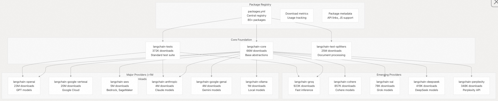  
  
### 提供商程序包结构  
  
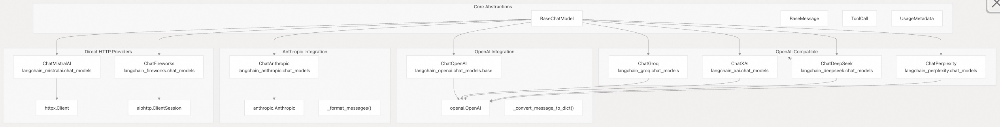  
  
**源文件:**  
- https://github.com/langchain-ai/langchain/blob/e3fc7d8a/libs/packages.yml#L1-L754
- https://github.com/langchain-ai/langchain/blob/e3fc7d8a/libs/partners/openai/langchain_openai/chat_models/base.py#L447-L448
- https://github.com/langchain-ai/langchain/blob/e3fc7d8a/libs/partners/anthropic/langchain_anthropic/chat_models.py#L502-L502
- https://github.com/langchain-ai/langchain/blob/e3fc7d8a/libs/partners/xai/pyproject.toml#L9-L14
- https://github.com/langchain-ai/langchain/blob/e3fc7d8a/libs/partners/deepseek/pyproject.toml#L9-L12
- https://github.com/langchain-ai/langchain/blob/e3fc7d8a/libs/partners/perplexity/pyproject.toml#L9-L13
  
### 常见的集成模式  
所有提供商集成均实现若干通用模式，这些模式通过标准测试套件加以强制执行：  
  
| 模式 | 目的 | 实现方式 | 测试方式 |  
|------|------|----------|----------|  
| 消息转换 | 将 LangChain 消息转换为提供商格式 | `_convert_message_to_dict()`、`_format_messages()` | `langchain-tests` 中的消息兼容性测试 |  
| 响应解析 | 将提供商响应转换为 LangChain 格式 | `_format_output()`、`_convert_dict_to_message()` | 标准响应格式测试 |  
| 流式支持 | 处理实时响应流 | `_stream()`、`astream()` 配合分块处理 | 流式合规性测试 |  
| 工具调用 | 支持函数/工具调用 | `bind_tools()`，以及工具调用的解析与格式化 | 工具调用标准测试 |  
| 使用量追踪 | 监控令牌(`token`)消耗 | 创建并聚合 `UsageMetadata` | 使用量元数据验证 |  
| 错误处理 | 处理提供商特定的错误 | 自定义异常处理与重试机制 | 错误处理合规性测试 |  
| 功能矩阵 | 标准化能力报告 | 通过功能标志标明是否支持工具调用、结构化输出等 | 功能兼容性验证 |  
  
### 集成标准和测试  
`langchain-tests` 软件包提供了标准化的测试套件，确保所有提供商的行为一致：  
  
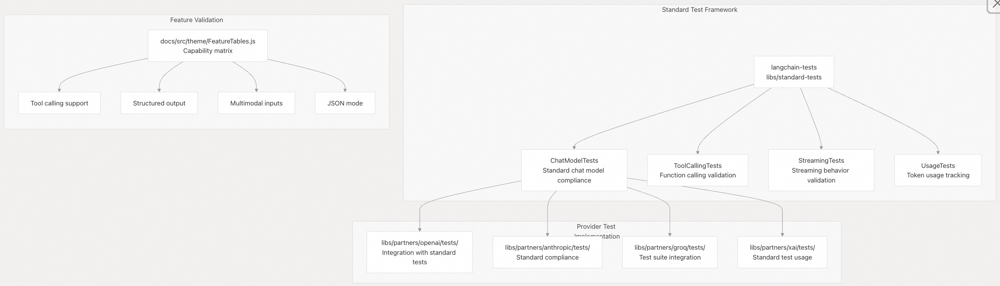  
  
**源文件:**  
- https://github.com/langchain-ai/langchain/blob/e3fc7d8a/libs/packages.yml#L293-L297
- https://github.com/langchain-ai/langchain/blob/e3fc7d8a/libs/partners/openai/langchain_openai/chat_models/base.py#L251-L319
- https://github.com/langchain-ai/langchain/blob/e3fc7d8a/libs/partners/anthropic/langchain_anthropic/chat_models.py#L282-L491
- https://github.com/langchain-ai/langchain/blob/e3fc7d8a/docs/src/theme/FeatureTables.js#L7-L273
- https://github.com/langchain-ai/langchain/blob/e3fc7d8a/libs/partners/openai/tests/unit_tests/chat_models/test_base.py#L1-L72
- https://github.com/langchain-ai/langchain/blob/e3fc7d8a/libs/partners/anthropic/tests/unit_tests/test_chat_models.py#L1-L50
  
## 主要提供商实现  
### OpenAI 集成  
OpenAI 集成最为全面，同时支持 Chat Completions API 和较新的 Responses API。  
  
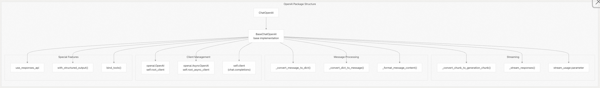  
  
主要特点：  
- 双 API 支持：通过 `use_responses_api` 参数实现 Chat Completions API 和较新的 Responses API  
- 高级流：通过 `stream_usage=True` 开启令牌(token)使用情况跟踪  
- 结构化输出：原生 JSON schema支持和函数调用(function calling)  
- 客户端缓存：自动的客户端重用(指上下文缓存/重用?)以优化性能  
  
**源文件:**  
- https://github.com/langchain-ai/langchain/blob/e3fc7d8a/libs/partners/openai/langchain_openai/chat_models/base.py#L447-L818
- https://github.com/langchain-ai/langchain/blob/e3fc7d8a/libs/partners/openai/pyproject.toml#L14-L16
  
### Anthropic 集成  
Anthropic 集成为 Claude 模型提供了全面的支持，具有高级消息合并和工具调用功能。  
  
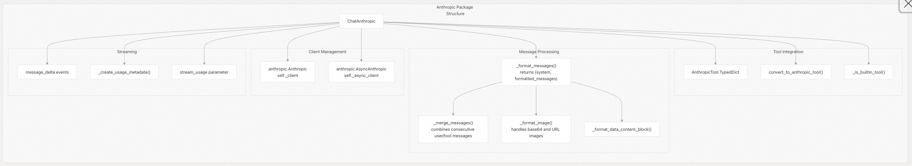  
  
主要特点：  
- 消息合并：通过 `_merge_messages()` 自动合并会话中连续的用户消息/工具消息  
- 多模态支持：通过 `_format_data_content_block()` 处理原生图像和文档  
- 内置工具：检测并可调用 Anthropic 的原生工具，例如`computer_use`，`web_search`  
- 系统消息处理：从消息序列中分离并提取系统消息(system message)  
  
**源文件:**  
- https://github.com/langchain-ai/langchain/blob/e3fc7d8a/libs/partners/anthropic/langchain_anthropic/chat_models.py#L502-L1200
- https://github.com/langchain-ai/langchain/blob/e3fc7d8a/libs/partners/anthropic/langchain_anthropic/chat_models.py#L143-L188
- https://github.com/langchain-ai/langchain/blob/e3fc7d8a/libs/partners/anthropic/pyproject.toml#L9-L12
  
### MistralAI 集成  
MistralAI 集成采用直接 HTTP 客户端通信方式，并包含专门的工具调用 ID 格式化逻辑。  
  
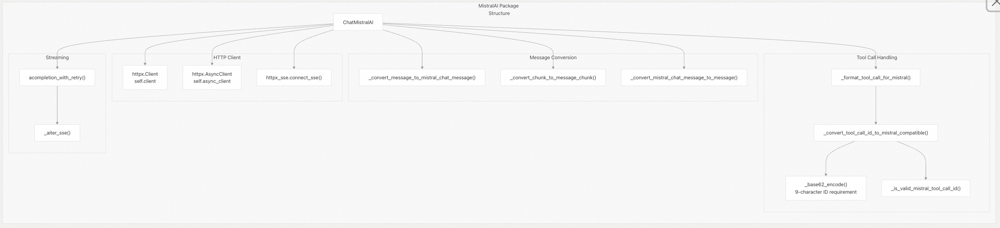  
  
主要特点：  
- `Direct HTTP`：使用 `httpx` 而非官方 SDK，以实现最大控制力  
- 工具调用 ID 格式化：针对 Mistral 要求的 9 位 base62 字符串  
- 服务器发送事件(Server-Sent Events)：流式响应的自定义 SSE 处理  
- 重试逻辑：内置基于韧性(tenacity-based)的重试机制  
  
**源文件:**  
- https://github.com/langchain-ai/langchain/blob/e3fc7d8a/libs/partners/mistralai/langchain_mistralai/chat_models.py#L385-L600
- https://github.com/langchain-ai/langchain/blob/e3fc7d8a/libs/partners/mistralai/langchain_mistralai/chat_models.py#L104-L133
- https://github.com/langchain-ai/langchain/blob/e3fc7d8a/libs/partners/mistralai/pyproject.toml#L9-L15
  
## 消息格式翻译  
每个提供商程序包都需要处理不同的消息格式，由专门的转换函数处理：  
  
### OpenAI 消息格式  
  
OpenAI 消息格式通过 `convert_to_openai_messages()` 函数处理，该函数将 LangChain 消息转换为与 OpenAI 兼容的消息字典。  
  
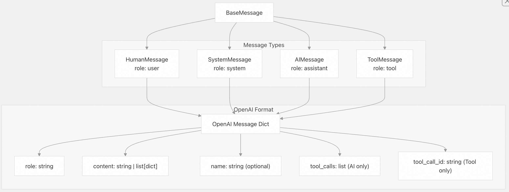  
  
**源文件:**  
- https://github.com/langchain-ai/langchain/blob/e3fc7d8a/libs/partners/openai/langchain_openai/chat_models/base.py#L251-L319
- https://github.com/langchain-ai/langchain/blob/e3fc7d8a/libs/partners/openai/langchain_openai/chat_models/base.py#L134-L203
  
### Anthropic 消息格式  
Anthropic 需要对系统消息和消息合并进行特殊处理：  
  
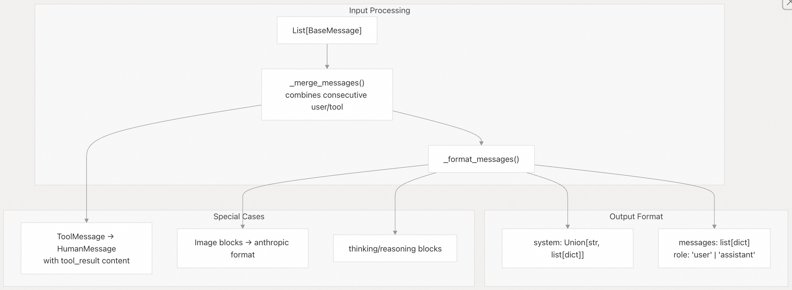  
  
**源文件:**  
- https://github.com/langchain-ai/langchain/blob/e3fc7d8a/libs/partners/anthropic/langchain_anthropic/chat_models.py#L143-L188
- https://github.com/langchain-ai/langchain/blob/e3fc7d8a/libs/partners/anthropic/langchain_anthropic/chat_models.py#L282-L491
  
## 工具调用集成  
提供商集成通过标准化接口实现工具调用，但格式因提供商而异.   
  
### 工具调用流程  
  
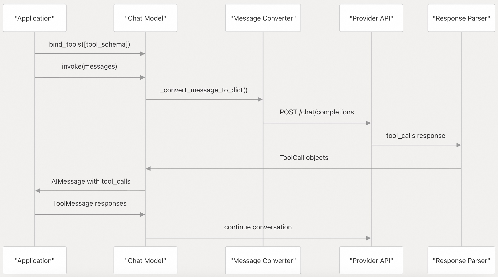  
  
### 各提供商的工具调用格式  
  
| 提供商 | 工具调用格式 | ID 要求 | 特殊功能 |  
|--------|--------------|---------|----------|  
| OpenAI | `function` 类型，含 `name` 与 `arguments` | 任意字符串 | 并行工具调用、结构化输出 |  
| Anthropic | `tool_use` 内容块 | 生成的 UUID | 内置工具、服务器端工具（MCP） |  
| MistralAI | `function` 类型 | 9 位 base62 字符串 | 需进行 ID 转换 |  
| Groq | 与 OpenAI 兼容的格式 | 任意字符串 | 与 OpenAI 相同 |  
  
**源文件:**  
- https://github.com/langchain-ai/langchain/blob/e3fc7d8a/libs/partners/openai/langchain_openai/chat_models/base.py#L272-L290
- https://github.com/langchain-ai/langchain/blob/e3fc7d8a/libs/partners/anthropic/langchain_anthropic/chat_models.py#L333-L366
- https://github.com/langchain-ai/langchain/blob/e3fc7d8a/libs/partners/mistralai/langchain_mistralai/chat_models.py#L294-L319
  
## 流和异步支持  
所有提供商集成都支持同步流和异步流：  
  
### 流式架构  
  
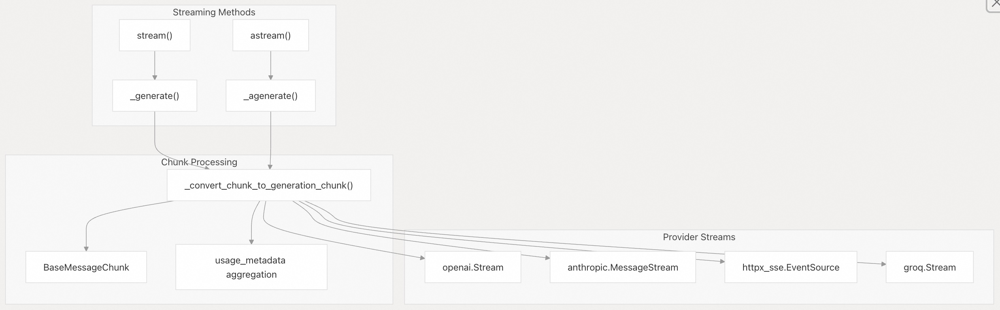  
  
### 使用量元数据追踪  
提供商通过 `UsageMetadata` 接口跟踪 token 使用量：  
  
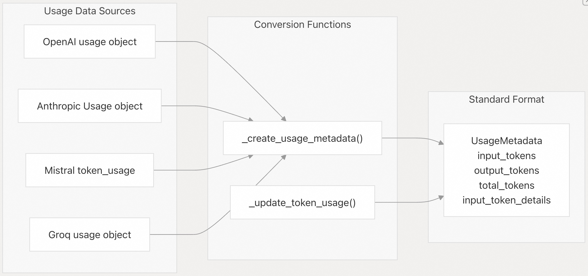  
  
**源文件:**  
- https://github.com/langchain-ai/langchain/blob/e3fc7d8a/libs/partners/openai/langchain_openai/chat_models/base.py#L474-L479
- https://github.com/langchain-ai/langchain/blob/e3fc7d8a/libs/partners/anthropic/langchain_anthropic/chat_models.py#L1410-L1420
- https://github.com/langchain-ai/langchain/blob/e3fc7d8a/libs/partners/mistralai/langchain_mistralai/chat_models.py#L267-L274
  
## 包配置  
每个提供程序集成都是独立打包的，具有特定的依赖关系：  
  
### 依赖管理  
  
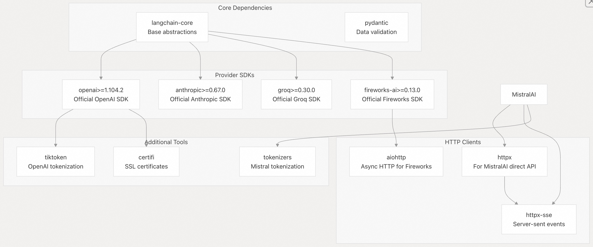  
  
**源文件:**  
- https://github.com/langchain-ai/langchain/blob/e3fc7d8a/libs/partners/openai/pyproject.toml#L9-L13
- https://github.com/langchain-ai/langchain/blob/e3fc7d8a/libs/partners/anthropic/pyproject.toml#L9-L13
- https://github.com/langchain-ai/langchain/blob/e3fc7d8a/libs/partners/mistralai/pyproject.toml#L9-L15
- https://github.com/langchain-ai/langchain/blob/e3fc7d8a/libs/partners/fireworks/pyproject.toml#L9-L15
- https://github.com/langchain-ai/langchain/blob/e3fc7d8a/libs/partners/groq/pyproject.toml#L9-L9
    
#### [期望 PostgreSQL|开源PolarDB 增加什么功能?](https://github.com/digoal/blog/issues/76 "269ac3d1c492e938c0191101c7238216")
  
  
#### [PolarDB 开源数据库](https://openpolardb.com/home "57258f76c37864c6e6d23383d05714ea")
  
  
#### [PolarDB 学习图谱](https://www.aliyun.com/database/openpolardb/activity "8642f60e04ed0c814bf9cb9677976bd4")
  
  
#### [PostgreSQL 解决方案集合](../201706/20170601_02.md "40cff096e9ed7122c512b35d8561d9c8")
  
  
#### [德哥 / digoal's Github - 公益是一辈子的事.](https://github.com/digoal/blog/blob/master/README.md "22709685feb7cab07d30f30387f0a9ae")
  
  
#### [About 德哥](https://github.com/digoal/blog/blob/master/me/readme.md "a37735981e7704886ffd590565582dd0")
  
  

  
