## LangChain 源码学习: 4 应用开发                                 
                                                      
### 作者                                              
digoal                                              
                                                      
### 日期                                                
2025-10-16                                                    
                                               
### 标签                                                    
AI Agent , Powered by LLM , LangChain , 源码学习                                               
                                                     
----                                                 
                                                 
## 背景            
本文介绍用于构建 LangChain 应用程序的工具、实用程序与设计模式，涵盖以下三个关键领域：  
1、文本分割器和文档处理 - 在保留语义结构的情况下, 对文档进行分块的组件  
  
2、CLI 和项目脚手架 - 用于创建和管理 LangChain 项目的命令行工具  
  
3、V1 中间件代理系统 - 具有可组合中间件钩子(hook)的下一代代理架构  
  
## 文本分割器和文档处理  
`langchain-text-splitters` 软件包可用于在保留语义结构的同时将文档拆分成块。文本拆分器对于检索增强生成 (RAG) 工作流至关重要，因为该工作流中的文档必须适合 LLM 上下文窗口大小。  
  
### TextSplitter 层次结构  
  
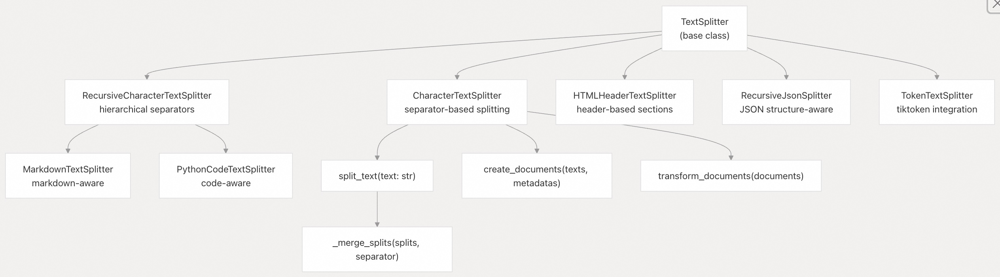  
  
### 核心分割策略  
基类 `TextSplitter` 实现了基于 `chunk_size` 与 `chunk_overlap` 的切分策略：  
  
| 参数 | 用途 | 默认值 |  
|------|------|--------|  
| `chunk_size` | 每个片段的最大长度（由 `length_function` 度量） | 4000 |  
| `chunk_overlap` | 相邻片段之间的重叠字符数 | 200 |  
| `length_function` | 用于度量片段长度的函数 | `len` |  
| `keep_separator` | 是否在片段中保留分隔符 | `False` |  
| `add_start_index` | 是否在元数据中添加 `start_index` 字段 | `False` |  
  
**包含overlap的文本切分算法**  
  
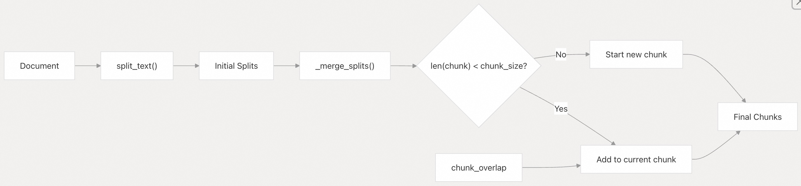  
  
### 格式专用分割器  
  
**RecursiveCharacterTextSplitter**：按层级尝试多种分隔符进行切分。  
```  
# Default separators: ["\n\n", "\n", " ", ""]  
splitter = RecursiveCharacterTextSplitter(  
    chunk_size=1000,  
    chunk_overlap=200,  
    separators=["\n\n", "\n", " ", ""]  
)  
```  
  
**HTMLHeaderTextSplitter**：按 HTML 标题切分，同时保留文档层级结构。  
```  
headers_to_split_on = [  
    ("h1", "Header 1"),  
    ("h2", "Header 2"),  
    ("h3", "Header 3"),  
]  
splitter = HTMLHeaderTextSplitter(headers_to_split_on)  
# Returns Documents with metadata: {"Header 1": "...", "Header 2": "..."}  
```  
  
**MarkdownHeaderTextSplitter**：对 Markdown 文档采用类似策略。  
```  
headers_to_split_on = [  
    ("#", "Header 1"),  
    ("##", "Header 2"),  
    ("###", "Header 3"),  
]  
splitter = MarkdownHeaderTextSplitter(headers_to_split_on)  
```  
  
**RecursiveJsonSplitter**：在切分过程中保留 JSON 结构。  
```  
splitter = RecursiveJsonSplitter(  
    max_chunk_size=1000,  
    min_chunk_size=100  
)  
# Maintains valid JSON in each chunk  
```  
  
### 分词器(Tokenizer) 集成  
文本分割器与分词器集成，以实现准确的(Token)“标记/令牌”计数：  
  
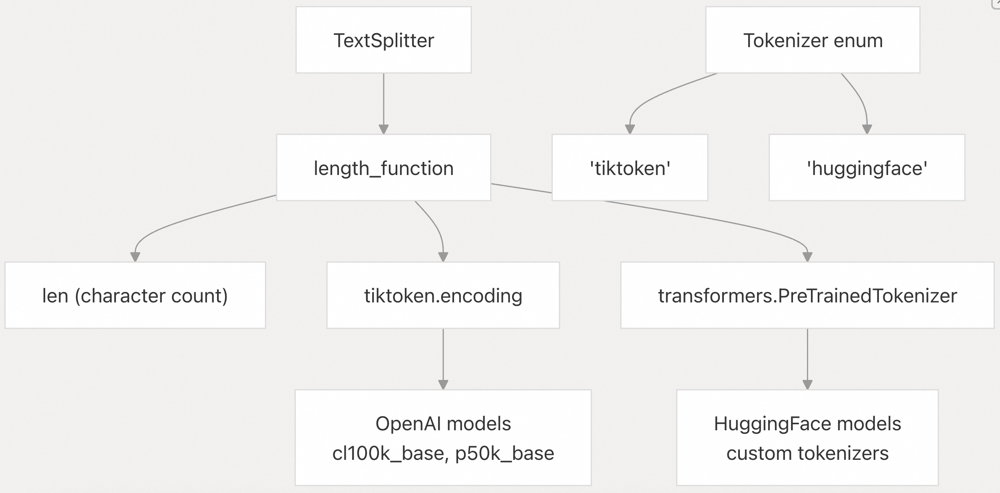  
  
## CLI 工具与项目管理  
`langchain-cli` 包为 LangChain 应用开发提供了一套完整的命令行工具，包含三个主要命令命名空间，分别对应不同的开发场景。  
  
### 核心 CLI 结构  
  
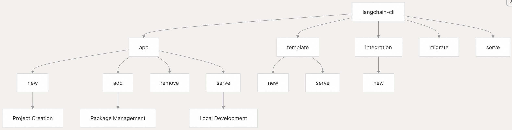  
  
**CLI 命令结构与工作流**  
  
### 应用项目管理  
`langchain app` 命令用于管理包含多个组件的完整 LangChain 应用：  
  
| 命令 | 用途 | 关键参数 |  
|------|------|----------|  
| `langchain app new` | 创建新的 LangServe 应用 | `--package`、`--pip`、`--non-interactive` |  
| `langchain app add` | 向现有应用添加模板 | `--api-path`、`--repo`、`--branch`、`--pip` |  
| `langchain app remove` | 从应用中移除模板 | 需指定要移除的 API 路径 |  
| `langchain app serve` | 启动开发服务器 | `--port`、`--host`、`--app` |  
  
项目创建过程会生成标准目录结构：  
  
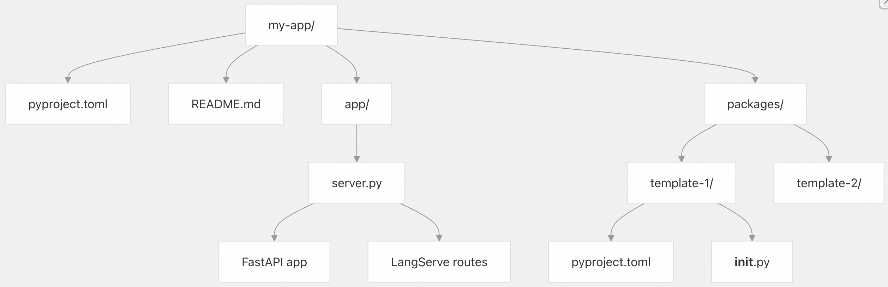  
  
**LangChain 应用项目结构**  
  
### 模板开发  
模板是可复用的 LangChain 组件，可在多个应用间共享和集成：  
  
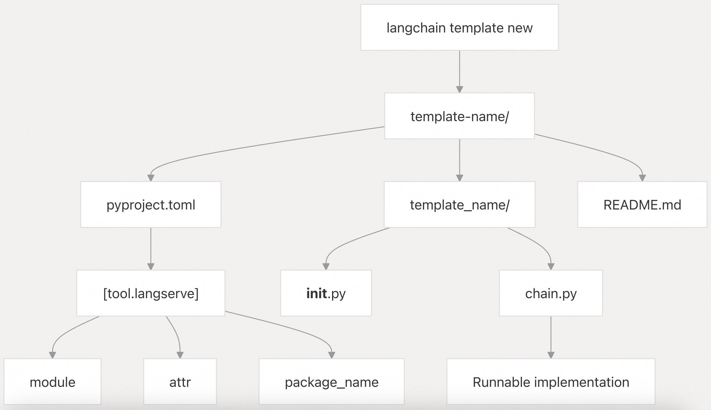  
  
**模板结构与 LangServe 集成**  
  
## V1中间件代理系统  
`langchain_v1` 包引入了一种基于可组合中间件的新一代代理架构。与传统代理模式不同，该中间件系统通过拦截钩子（interceptor hooks）提供对代理执行流程的细粒度控制。  
  
### 使用 `create_agent` 创建代理  
  
`create_agent` 工厂函数构建一个集成中间件的 LangGraph `CompiledStateGraph`：  
  
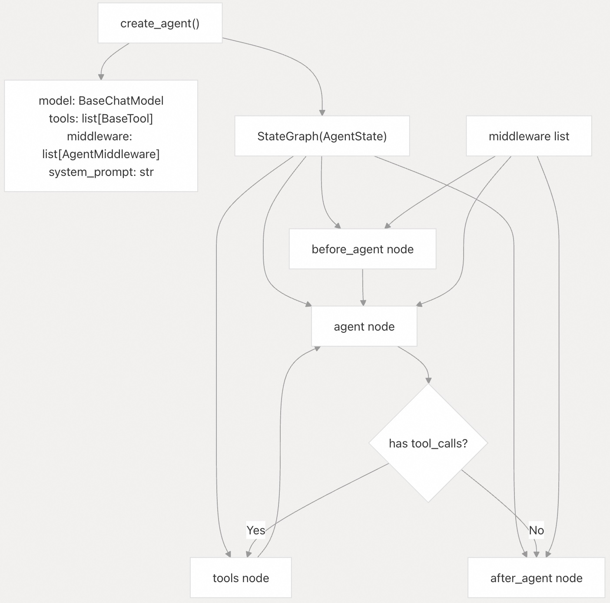  
  
**`create_agent` 工厂架构**  
  
### AgentMiddleware 钩子类型  
  
`AgentMiddleware` 在代理执行生命周期中定义了六个钩子点：  
  
| 钩子 | 触发时机 | 可修改内容 | 返回类型 | 典型用途 |  
|------|----------|------------|----------|----------|  
| `before_agent` | 代理启动前 | 状态 | `dict[str, Any]` | 初始化状态、加载上下文 |  
| `before_model` | 每次模型调用前 | 状态 | `dict[str, Any]` | 注入动态提示、过滤工具 |  
| `wrap_model_call` | 模型执行前后 | 请求/响应 | `ModelResponse \| AIMessage` | 重试逻辑、降级策略、缓存 |  
| `after_model` | 模型响应后 | 状态 | `dict[str, Any]` | 验证输出、后处理 |  
| `wrap_tool_call` | 工具执行前后 | 请求/响应 | `ToolMessage \| Command` | 工具重试、监控 |  
| `after_agent` | 代理执行完成后 | 状态 | `dict[str, Any]` | 清理资源、日志记录 |  
  
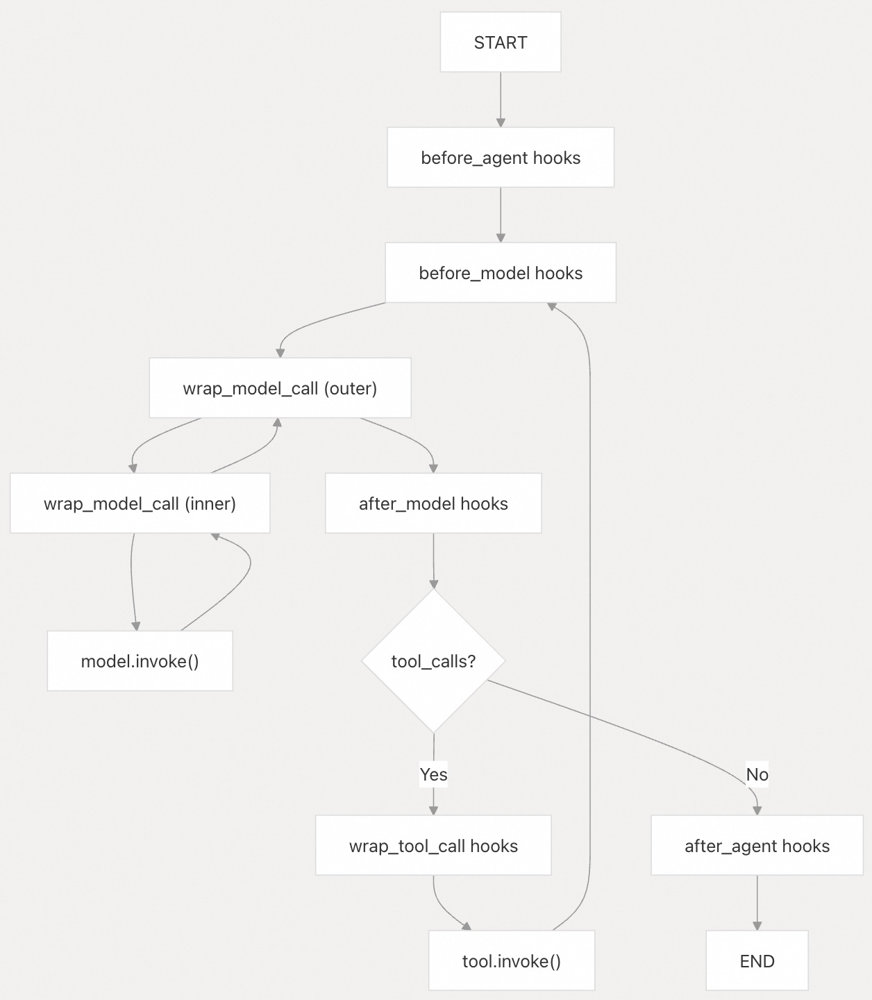  
  
**中间件钩子执行流程**  
  
### 中间件组合  
  
中间件采用包装器（wrapper）模式进行组合，列表中第一个中间件成为最外层：  
```  
# middleware=[Auth, Cache, Retry]  
# Execution order: Auth → Cache → Retry → Model → Retry → Cache → Auth  
  
class AuthMiddleware(AgentMiddleware):  
    def wrap_model_call(self, request, handler):  
        # Outer layer - runs first  
        return handler(request)  
  
class CacheMiddleware(AgentMiddleware):  
    def wrap_model_call(self, request, handler):  
        # Middle layer  
        if cached := get_cache(request):  
            return cached  
        return handler(request)  
  
class RetryMiddleware(AgentMiddleware):  
    def wrap_model_call(self, request, handler):  
        # Inner layer - closest to model  
        for attempt in range(3):  
            try:  
                return handler(request)  
            except Exception:  
                if attempt == 2:  
                    raise  
```  
  
### ModelRequest 与状态管理  
  
`ModelRequest` 数据类为中间件提供对代理状态和运行时上下文的访问：  
```  
@dataclass  
class ModelRequest:  
    model: BaseChatModel  
    system_prompt: str | None  
    messages: list[AnyMessage]  
    tool_choice: Any | None  
    tools: list[BaseTool | dict]  
    response_format: ResponseFormat | None  
    state: AgentState  
    runtime: Runtime[ContextT]  
    model_settings: dict[str, Any]  
```  
  
`AgentState` 是带有特殊注释的 `TypedDict`：  
```  
class AgentState(TypedDict):  
    messages: Required[Annotated[list[AnyMessage], add_messages]]  
    jump_to: NotRequired[Annotated[JumpTo | None, EphemeralValue, PrivateStateAttr]]  
    structured_response: NotRequired[Annotated[ResponseT, OmitFromInput]]  
    thread_model_call_count: NotRequired[Annotated[int, PrivateStateAttr]]  
```  
  
中间件可扩展自定义字段状态：  
```  
class CustomState(AgentState):  
    custom_field: NotRequired[str]  
  
class CustomMiddleware(AgentMiddleware):  
    state_schema = CustomState  
      
    def before_model(self, state, runtime):  
        return {"custom_field": "value"}  
```  
  
### 具体中间件实现  
**HumanInTheLoopMiddleware**：在关键步骤中断执行，等待人工确认。  
```  
middleware = HumanInTheLoopMiddleware(  
    interrupt_on={  
        "sensitive_tool": {  
            "allowed_decisions": ["approve", "edit", "reject"]  
        }  
    }  
)  
```  
  
**PlanningMiddleware**：管理任务列表与规划流程。  
```  
# Adds "todos" field to state  
# Provides write_todos tool for task management  
middleware = PlanningMiddleware()  
```  
  
**ModelFallbackMiddleware**：在主模型失败时自动切换备用模型。  
```  
middleware = ModelFallbackMiddleware(  
    fallback_models=[  
        ChatOpenAI(model="gpt-4o"),  
        ChatOpenAI(model="gpt-3.5-turbo")  
    ]  
)  
```  
  
**AnthropicPromptCachingMiddleware**：启用 Anthropic 的提示缓存功能。  
```  
middleware = AnthropicPromptCachingMiddleware(  
    min_messages_to_cache=3,  
    ttl="5m"  
)  
# Adds cache_control to messages  
```  
  
### 基于装饰器的中间件  
  
对于简单场景，可通过装饰器创建中间件，无需继承基类：  
```  
from langchain.agents.middleware import before_model, after_model, wrap_model_call  
  
@before_model  
def log_before(state: AgentState, runtime: Runtime):  
    print(f"Calling model with {len(state['messages'])} messages")  
  
@after_model(can_jump_to=["end"])  
def conditional_exit(state: AgentState, runtime: Runtime):  
    if should_exit(state):  
        return {"jump_to": "end"}  
  
@wrap_model_call  
def retry_on_error(request: ModelRequest, handler):  
    for attempt in range(3):  
        try:  
            return handler(request)  
        except Exception:  
            if attempt == 2:  
                raise  
  
agent = create_agent(  
    model=model,  
    tools=tools,  
    middleware=[log_before, conditional_exit, retry_on_error]  
)  
```  
  
### 使用 `jump_to` 控制流程  
  
中间件可通过设置 `jump_to` 状态字段控制图执行路径：  
```  
class EarlyExitMiddleware(AgentMiddleware):  
    @hook_config(can_jump_to=["end"])  
    def before_model(self, state, runtime):  
        if len(state["messages"]) > 10:  
            return {"jump_to": "end"}  
  
# Creates conditional edge from before_model node to END  
```  
  
有效目标值：`"tools"`、`"model"`、`"end"`  
  
## 开发工作流  
  
### 本地开发与测试  
  
CLI 提供集成的开发服务器功能：  
  
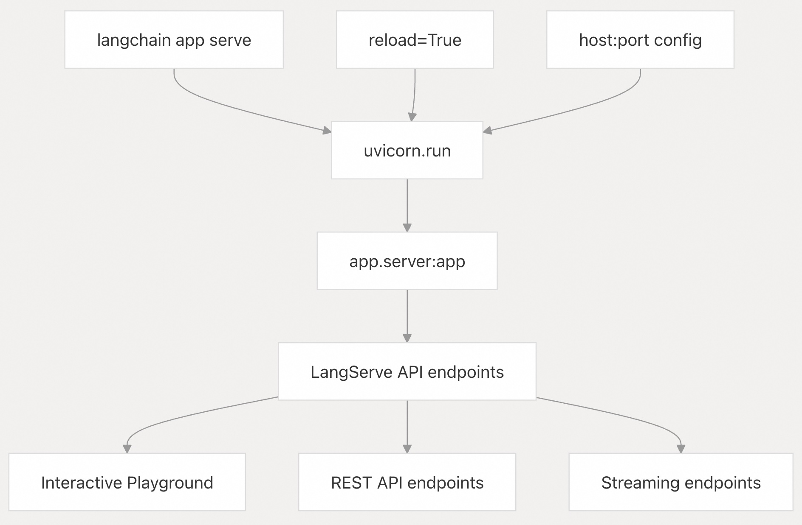  
  
**开发服务器架构**  
  
### 包管理流程  
  
模板与依赖项管理采用基于 Git 的方式：  
  
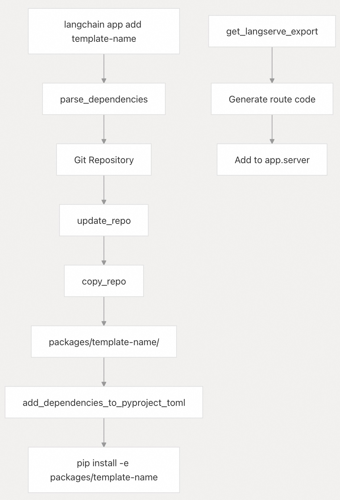  
  
**包添加工作流**  
  
## 项目结构与组织  
  
### 标准应用布局  
  
LangChain 应用遵循一致的目录结构，实现关注点分离并支持模块化开发：  
  
| 目录/文件 | 用途 | 关键组件 |  
|----------|------|----------|  
| `pyproject.toml` | 项目元数据与依赖声明 | 包名、依赖项、工具配置 |  
| `app/server.py` | FastAPI 应用入口 | LangServe 路由定义、应用配置 |  
| `packages/` | 可复用模板组件 | 各模板子目录 |  
| `README.md` | 项目文档 | 安装说明、使用示例 |  
  
### 集成点  
  
应用通过标准化接口与更广泛的 LangChain 生态系统集成：  
  
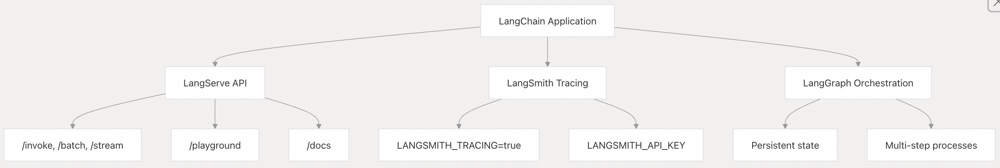  
  
**LangChain 应用集成生态**  
    
    
#### [期望 PostgreSQL|开源PolarDB 增加什么功能?](https://github.com/digoal/blog/issues/76 "269ac3d1c492e938c0191101c7238216")
  
  
#### [PolarDB 开源数据库](https://openpolardb.com/home "57258f76c37864c6e6d23383d05714ea")
  
  
#### [PolarDB 学习图谱](https://www.aliyun.com/database/openpolardb/activity "8642f60e04ed0c814bf9cb9677976bd4")
  
  
#### [PostgreSQL 解决方案集合](../201706/20170601_02.md "40cff096e9ed7122c512b35d8561d9c8")
  
  
#### [德哥 / digoal's Github - 公益是一辈子的事.](https://github.com/digoal/blog/blob/master/README.md "22709685feb7cab07d30f30387f0a9ae")
  
  
#### [About 德哥](https://github.com/digoal/blog/blob/master/me/readme.md "a37735981e7704886ffd590565582dd0")
  
  

  
