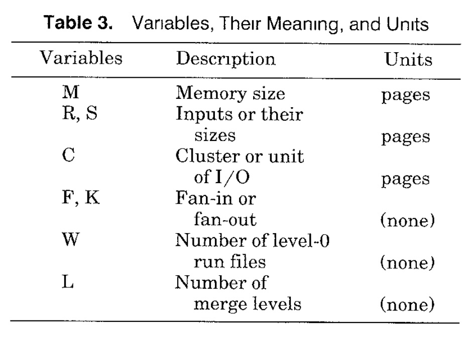
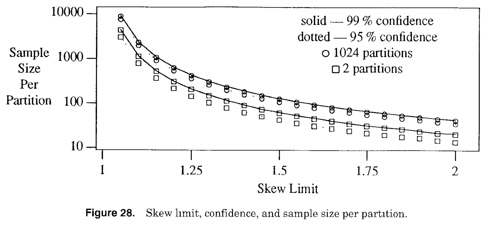

## AI论文解读 | Query Evaluation Techniques For Large Databases
        
### 作者        
digoal        
        
### 日期        
2025-10-17        
        
### 标签        
PostgreSQL , PolarDB , DuckDB , AI , 论文解读        
        
----        
        
## 背景  
      
https://dl.acm.org/doi/pdf/10.1145/152610.152611        
  
提示:          
```          
读懂《Query Evaluation Techniques For Large Databases》这篇论文需要提前掌握哪些基础知识, 请使用中文通熟易懂的讲解这些基础知识, 可以引用论文中的图、表或使用Markdown支持的图形(text,mermaid等)增加解释性. 
  
使用中文通熟易懂的解读《Query Evaluation Techniques For Large Databases》这篇论文, 其中的关键内容请着重讲解, 可以引用论文中的图、表或使用Markdown支持的图形(text,mermaid等)增加解释性. 
  
提取《Query Evaluation Techniques For Large Databases》这篇论文中的重要术语, 使用中文对这些术语进行通熟易懂的讲解, 可以引用论文中的图、表或使用Markdown支持的图形(text,mermaid等)增加解释性. 
```     
  
## 1 前置知识 
  
好的，为了更好地理解Goetz Graefe的经典论文《Query Evaluation Techniques for Large Databases》，你需要掌握一些数据库和计算机科学的基础知识。这篇论文是数据库查询处理领域的综述性文章，内容广泛且深入。以下是一些关键的基础知识点，我会尽量用通俗易懂的中文来解释，并引用论文中的图表来辅助说明：

1.  **数据库基础概念 (Database Fundamentals)**

      * **数据库管理系统 (DBMS)**: 它是管理数据库的软件，负责数据的存储、检索、安全、并发控制等。论文的目标就是探讨DBMS内部如何高效执行用户查询 。
      * **数据模型 (Data Model)**: 定义数据如何组织、存储和操作的方式。论文主要基于**关系模型 (Relational Model)** ，但也提及了对象模型  等。你需要了解关系模型的基本概念，如：
          * **关系 (Relation)**: 可以看作一张二维表。
          * **元组 (Tuple)**: 表中的一行记录。
          * **属性 (Attribute)**: 表中的一列。
          * **主键 (Primary Key)** / **外键 (Foreign Key)**: 用于唯一标识元组和建立关系之间联系的概念（虽然论文不直接讨论键，但理解它们有助于理解Join等操作）。

2.  **关系代数 (Relational Algebra)**

      * 这是关系数据库中操作数据的理论基础，是一套定义在关系上的运算符号 。论文中的查询执行计划最终体现的就是关系代数（或其变种）的操作序列。你需要了解核心的关系代数操作符，例如：
          * **选择 ( Selection, $\sigma$ )**: 选取满足特定条件的元组（行的子集）。
          * **投影 ( Projection, $\pi$ )**: 选取特定的属性（列的子集），可能涉及去重。
          * **连接 ( Join, $\bowtie$ )**: 将两个关系基于共同属性的值组合起来，最常见的是等值连接 (Equi-Join)。这是论文中重点讨论的操作之一 (Section 5) 。
          * **集合操作**: 并集 ( $\cup$ )、交集 ( $\cap$ )、差集 ( $-$ )。
          * **笛卡尔积 ( Cartesian Product, $\times$ )**: 将两个关系的每一行进行组合。
          * **除法 ( Division, $\div$ )**: 用于表达“所有”类型的查询，对应论文中的**通用量化 (Universal Quantification)** (Section 6) 。
      * 理解关系代数有助于明白查询语句（如SQL）在逻辑层面表达了什么计算。

3.  **查询处理流程 (Query Processing Pipeline)**

      * 你需要了解一个数据库查询（通常用SQL等高级语言编写）是如何被DBMS处理并执行的。论文的 **Figure 1 (来源 )** 和 **Figure 2 (来源 )** 清晰地展示了这个流程：      
        ```mermaid
        graph LR
            A[用户接口/查询语言] --> B(解析 Parsing);
            B --> C(查询验证 Validation);
            C --> D(视图解析 View Resolution);
            D --> E(查询优化 Optimization);
            E --> F(计划编译 Plan Compilation);
            F --> G(查询执行 Execution);
            G --> H{文件/索引/缓冲区/磁盘};

            subgraph "DBMS 内部"
                direction LR
                B; C; D; E; F; G;
            end
        ```
      * **查询解析 (Parsing)**: 将文本查询转换成内部表示（如语法树）。
      * **查询验证 (Validation)**: 检查查询涉及的表、列是否存在，权限是否满足等 。
      * **查询优化 (Query Optimization)**: 这是查询处理中最复杂的部分之一。优化器将逻辑查询（表达“做什么”）转换成一个高效的**物理查询执行计划 (Query Evaluation Plan, QEP)**（表达“怎么做”）。优化器会估算不同执行计划的成本（通常是I/O和CPU消耗），选择成本最低的那个。论文假设优化已经完成，重点关注执行计划的*执行*阶段。
      * **查询执行 (Query Execution)**: 由查询执行引擎 (Query Execution Engine) 负责执行优化器产生的计划 。这正是本论文的核心内容。

4.  **物理查询执行计划与操作符 (Physical QEP and Operators)**

      * **物理代数 (Physical Algebra)**: 不同于逻辑层面的关系代数，物理代数包含具体的实现算法 。例如，逻辑上的“Join”操作可以对应物理上的“Nested-Loops Join”、“Sort-Merge Join”或“Hash Join”等具体算法 。**Figure 3 (来源 )** 展示了逻辑代数表达式和物理代数表达式（QEP）的区别。    
      * **操作符 (Operators)**: 查询执行计划通常被表示为一棵由物理操作符组成的树（或图）。每个操作符实现一个特定的功能（如扫描、排序、连接、聚合）。
      * **迭代器模型 (Iterator Model)**: 这是实现操作符的一种非常流行和实用的方式 。每个操作符都提供 `open()`, `next()`, `close()` 三个接口 。`next()` 调用会请求其子操作符（输入源）产生下一条记录（元组）。这种**需求驱动 (demand-driven)** 的方式可以很好地支持**流水线 (pipelining)** 执行，避免中间结果完全物化到磁盘 。**Table 1 (来源 )** 和 **Figure 5 (来源 )** 详细说明了迭代器模型。      

5.  **核心算法 (Core Algorithms)**

      * **外部排序 (External Sorting)**: 由于数据量远超内存（“Large Databases”），排序必须在磁盘上进行 。你需要理解**外部归并排序 (External Merge Sort)** 的基本原理：在内存中生成初始有序的**顺串 (runs)**，然后反复**归并 (merge)** 这些顺串直到整个文件有序 。论文讨论了优化，如**置换选择 (Replacement Selection)** 、**归并扇入度 (Fan-in, F)** 、**预读 (Read-ahead)** 、**簇大小 (Cluster size, C)**  和归并策略优化  等 (Section 2.1)。**Table 2 (来源 )** 总结了排序算法的分类。    
      * **哈希 (Hashing)**: 哈希是另一种处理大数据集的核心技术，尤其适用于等值匹配 。你需要了解哈希函数、哈希表的基本概念。在数据库中，哈希常用于：
          * **哈希连接 (Hash Join)**: 将一个表（较小的，Build Input）建成内存哈希表，然后扫描另一个表（Probe Input），用其连接属性值探测哈希表寻找匹配 。
          * **哈希聚合/去重 (Hash Aggregation/Duplicate Removal)**: 使用哈希表将相同分组键（或整个元组）的项聚集在一起进行计算或去重 。
          * **处理哈希冲突和溢出 (Handling Collisions and Overflow)**: 当哈希表大小超过内存时，需要处理溢出。论文讨论了**溢出避免 (avoidance)** 和**溢出解决 (resolution)** ，特别是**混合哈希 (Hybrid Hashing)** （**Figure 8, 来源 **）和**递归分区 (Recursive Partitioning)** （ **Figure 9, 来源** ） (Section 2.2)。      

6.  **存储与I/O (Storage and I/O)**

      * **磁盘存储**: 理解数据如何在磁盘上以**页 (Page)** 或**块 (Block)** 为单位进行存储和访问 。连续存储的块称为**簇 (Cluster)** 或**区 (Extent)** 。
      * **I/O成本**: 磁盘访问（读写）通常是查询执行的主要瓶颈 。需要了解磁盘访问时间主要由寻道时间、旋转延迟和传输时间组成。因此，顺序I/O通常比随机I/O快得多。论文中的成本分析经常以I/O次数或传输页数为单位 (参考 **Table 3 (来源 )** 中的变量 M, R, S, C)。   
      * **文件扫描 (File Scan)**: 即顺序读取整个文件（表）的操作 。使用**预读 (Read-ahead)**  可以提高扫描效率。
      * **索引 (Indexing)**: 索引是加速数据检索的关键技术 。最常用的是 **B+树 (B+-tree)** 。你需要理解索引如何帮助快速定位满足条件的记录，避免全表扫描。论文也提及了其他索引结构和**聚簇索引 (Clustering Index)** vs **非聚簇索引 (Non-clustering Index)**  的概念 (Section 3.2)。
      * **缓冲管理 (Buffer Management)**: DBMS在内存中维护一个缓冲区 (Buffer Pool) 来缓存从磁盘读取的数据页，以减少物理I/O次数 。需要了解基本的页面替换策略（如LRU）及其在数据库场景下的局限性  (Section 3.3)。

7.  **性能评估与成本模型 (Performance Evaluation and Cost Models)**

      * 理解衡量算法性能的指标，主要是**I/O成本**和**CPU成本**。论文中的成本函数主要关注I/O 。
      * 能够看懂论文中使用的简化成本公式，了解它们是如何基于输入大小(R, S)、内存大小(M)、簇大小(C)、扇入/扇出度(F)等参数来估算I/O量的。

8.  **并行处理基础 (Parallel Processing Basics)** - *这部分在论文后半段 (Section 9, 10)，初读时可先了解基本概念*

      * **并行计算目标**: **加速 (Speedup)**（用更多资源更快解决同一问题）和**规模扩展 (Scaleup)**（用更多资源解决更大问题，时间不变）。
      * **并行体系结构**: **共享内存 (Shared Memory)**、**共享磁盘 (Shared Disk)**、**无共享 (Shared Nothing)** 。
      * **并行形式**: **查询间并行 (Inter-query)**、**查询内并行 (Intra-query)**，后者又分为**操作符间并行 (Inter-operator, 流水线/ bushy)** 和**操作符内并行 (Intra-operator, 分区)** 。
      * **数据分区 (Data Partitioning)**: 在并行数据库中，数据通常被水平分区（如哈希分区、范围分区）存储在多个节点/磁盘上，以便并行处理 。
      * **负载均衡 (Load Balancing)与数据倾斜 (Data Skew)**: 并行处理面临的关键问题是如何均匀分配工作负载，以及如何处理数据分布不均（倾斜）导致某些节点负载过重的情况 。

掌握了以上这些基础知识，尤其是关系代数、查询处理流程、外部排序、哈希（特别是溢出处理）、索引和迭代器模型，你就能更好地理解这篇论文的核心内容和它所讨论的各种查询评估技术了。祝你阅读顺利！
  
## 2 解读论文 
  
好的，我们来一起解读Goetz Graefe这篇经典的数据库领域综述论文《Query Evaluation Techniques For Large Databases》（大型数据库查询评估技术）。这篇论文写于1993年，但其中阐述的许多核心原理和技术至今仍然是现代数据库系统查询处理的基础。我会尽量用通俗易懂的语言，结合论文中的图表来解释关键内容。

**论文核心目标与背景**

这篇论文旨在全面概述在大型数据库（当时指几MB到几TB，现在可能更大）中高效执行复杂查询（涉及多个操作）的算法和软件架构 。作者指出，即使是新兴的对象数据库或可扩展数据库，也无法回避处理海量数据的性能挑战，反而可能因为数据模型更复杂而加剧问题 。因此，理解高效的查询执行技术至关重要 。

论文处于数据库系统架构中的这个位置（参考 **Figure 1** ）：它位于**查询优化器**之下，**文件和索引系统**之上，负责具体执行由优化器生成的查询计划 。   


**关键内容讲解**

1.  **查询执行引擎架构：迭代器模型 (Architecture of Query Execution Engines: Iterator Model)** 

      * **逻辑代数 vs 物理代数**: 数据库查询首先被表达为逻辑操作（如关系代数中的Join），优化器会将其转换为物理操作的序列（查询执行计划 QEP），每个物理操作对应一个具体的算法（如Hash Join） 。**Figure 3**  直观展示了逻辑上的交集操作如何映射到一个包含文件扫描、排序和归并连接（用于实现交集）的物理计划。物理代数才有具体的执行成本 。    
      * **数据流**: 如何在计划中的不同操作符之间传递数据？
          * 简单的办法是用临时文件，但这效率低下 。
          * 为每个操作符创建一个进程，用进程间通信（如管道）传递数据，但操作系统调度和通信开销大 。
      * **迭代器模型 (Iterator Model)**: 这是论文推崇且广泛应用的模型 。它将每个物理操作符实现为一个“迭代器”，提供三个基本接口：`open()`, `next()`, `close()` 。
          * `open()`: 初始化操作符，准备产生数据，可能会调用子操作符的`open()`。
          * `next()`: 请求操作符产生下一条结果元组。操作符会调用其子操作符的`next()`来获取输入元组，处理后返回结果。这是**需求驱动 (demand-driven)** 的 。
          * `close()`: 清理状态，释放资源，会调用子操作符的`close()`。
      * **Table 1**  给出了几个操作符（如打印、扫描、选择、哈希连接、归并连接、排序）的`open/next/close`大致功能和需要维护的状态。   
      * **优点**:
          * **流水线 (Pipelining)**: 数据项在操作符之间流动，无需等待整个中间结果生成，通常避免了写临时文件 。
          * **低开销**: 操作符间的调用只是简单的函数调用，比进程间通信快得多 。
          * **内存高效**: 只在需要时产生数据，内存占用（时间-空间乘积）低 。
          * **灵活性**: 可以支持各种形状的查询计划（如 **Figure 4**  展示的左深、右深、 bushy 树） 。    
      * **Figure 5**  展示了Volcano系统中迭代器的具体实现方式，通过函数指针和状态记录来连接操作符 。    

2.  **两大基础技术：排序与哈希 (Sorting and Hashing)** 

    这两种技术是处理大型数据集中进行匹配（如Join）和分组（如Aggregation）的基础方法 。

      * **外部排序 (External Sorting)**:

          * 由于数据远超内存，必须使用**外部归并排序** 。
          * **阶段一：生成初始有序顺串 (Run Generation)**:
              * 方法1：内存排序（如快速排序），生成内存大小的顺串 。
              * 方法2：**置换选择 (Replacement Selection)**，利用堆（优先队列）持续读入新数据替换已输出的最小数据，平均能生成约2倍内存大小的顺串，减少后续归并趟数 。
          * **阶段二：归并顺串 (Run Merging)**:
              * 将多个顺串合并成一个更长的顺串，重复此过程直到只剩一个顺串 。
              * **扇入度 (Fan-in, F)**: 一次可以归并多少个顺串，受限于内存大小(M)和每个顺串的缓冲区大小（通常等于I/O**簇大小 Cluster size, C**） 。F ≈ M/C - 1。
              * **归并趟数 (Merge Levels, L)**: L ≈ log\<sub\>F\</sub\>(W)，其中W是初始顺串数量 。总I/O量约等于 2 \* R \* L (读写各一遍)。
          * **优化**:
              * **I/O优化**: 使用**预读 (Read-ahead)** 和**预测 (Forecasting)** 减少I/O等待 ；使用**大簇 (Large Cluster)** 减少I/O次数，虽然会降低扇入度，但通常整体性能更优 。**Figure 7** 和 **Table 4**  展示了簇大小对I/O成本的影响，存在最优值。      
              * **归并策略**: **Figure 6**  对比了朴素逐层归并和优化的归并策略（优先合并最短的顺串，调整第一趟归并的扇入度，确保后续都是满扇入度），后者可以显著减少I/O 。    
              * **利用剩余内存**: 如果排序输入略大于内存，生成初始顺串时可以反向排序，结束后内存中留下的数据可以直接参与第一趟归并，类似混合哈希的效果 。

      * **哈希 (Hashing)**:

          * 主要用于等值匹配，期望时间复杂度 O(N) 。
          * **基本思想**: 将一个输入（Build Input）建成内存哈希表，用另一个输入（Probe Input）探测匹配 。
          * **哈希溢出 (Hash Overflow)**: 当Build Input大于内存时发生 。
          * **处理溢出**:
              * 基本方法都是**分区 (Partitioning)**：使用哈希函数将输入分割成多个分区（桶），保证每个分区都能放入内存，然后逐个处理分区 。分区数量（**扇出度 Fan-out, F**）同样受限于内存 M 和簇大小 C，F ≈ M/C - 1 。
              * **混合哈希 (Hybrid Hashing)** (参考 **Figure 8** ): 是一种优化的溢出处理策略。在第一次分区时，尽量将 F-1 个分区保留在内存中处理，只将溢出的第F个（或更多）分区写入磁盘 。这样可以最大限度利用内存，减少写磁盘的数据量 。    
              * **递归分区 (Recursive Partitioning)** (参考 **Figure 9** ): 如果分区后，某个分区仍然大于内存，则对该分区再次进行哈希分区，直到所有分区都能放入内存 。总I/O量约等于 2 \* R \* L，其中L是递归深度 L ≈ log\<sub\>F\</sub\>(R/M) 。   
          * **数据倾斜 (Data Skew)**: 哈希方法的主要弱点。如果哈希函数不好或数据本身分布不均，可能导致某些分区特别大，严重影响性能 。
          * **处理倾斜**: **桶调优 (Bucket Tuning)** / **动态换出 (Dynamic Destaging)** ；或者在分区前收集统计信息（如直方图）来更智能地划分分区边界 。

3.  **核心操作的算法实现 (Algorithms for Core Operations)**

      * **聚合与去重 (Aggregation and Duplicate Removal)**:

          * 问题类似（都需要将相同项聚集），常由同一模块实现 。
          * **基于排序**: 先按分组/去重键排序，然后扫描一遍完成聚合/去重 。关键优化是**早期聚合/去重 (Early Aggregation/Removal)**，在生成和归并顺串的过程中就进行聚合/去重，可以大大减少中间文件大小和I/O量 。
          * **基于哈希**: 使用哈希表，键是分组/去重键。插入时检查是否已存在，存在则聚合（或直接丢弃，在去重时），不存在则插入 。只有当**输出结果**大于内存时才需要溢出处理（分区） 。
          * **性能对比 (Figure 11)** : 两者成本都是对数增长。分析上哈希通常略优，但排序的早期聚合优化效果显著，且哈希受倾斜影响，实际性能可能很接近 。    

      * **二元匹配操作（连接 Join 等）(Binary Matching Operations)**:

          * 包括 Join, Semi-Join, Outer Join, Intersection, Union, Difference 等多种操作，核心都是匹配两个输入的元素 (**Figure 12** ) 。论文以 Join 为例讲解算法。    
          * **嵌套循环连接 (Nested-Loops Join)**:
              * 最简单，对外部输入的每一行，扫描内部输入的整个表寻找匹配 。
              * 优点：通用性强，可处理任意连接条件 。
              * 缺点：对于大数据集性能极差，成本 O(R \* S) 。
              * 优化：**块嵌套循环 (Block Nested-Loops)**，一次读入一块外部输入，然后扫描内部输入 。成本 O(R \* S / M)。**索引嵌套循环 (Index Nested-Loops)**，利用内部输入上的索引快速查找匹配，避免全扫描 。
          * **排序归并连接 (Sort-Merge Join)**:
              * 前提：两个输入都按连接键排好序 。
              * 过程：类似归并排序的归并阶段，同步扫描两个输入，找到匹配项 。需要处理重复值（可能需要回溯内部输入） 。
              * 成本：主要是排序成本 O(R log R + S log S)，归并阶段是线性的 。
              * 优点：如果输入已有序（如来自索引扫描或前一个归并连接），则无需排序，非常高效 。输出结果也是有序的，可能对后续操作有利（称为“**有趣顺序 Interesting Orderings**”） 。
          * **哈希连接 (Hash Join)**:
              * 过程：选择较小的输入作为 Build Input，在内存中构建哈希表；扫描较大的输入作为 Probe Input，用连接键探测哈希表查找匹配 。
              * 成本：如果 Build Input 能放入内存，成本是线性的 O(R + S) 。如果需要溢出处理（混合哈希或递归分区），成本是对数增长的 O((R+S) \* log\<sub\>F\</sub\>(R/M)) 。
              * 优点：通常是等值连接最高效的算法，尤其当一个输入远小于另一个时 。
              * 缺点：只适用于等值连接；对数据倾斜敏感 。
          * **基于指针的连接 (Pointer-Based Joins)** : 如果数据中存储了指向关联对象的物理指针（如 OID），可以利用这些指针进行连接，避免按值查找。可以改造嵌套循环、排序归并、哈希连接算法来利用指针 。性能取决于指针的访问模式（顺序 vs 随机） 。
          * **算法比较 (Figure 15)** : 对于大数据，嵌套循环不可行。排序归并和哈希连接成本都是对数增长。哈希连接通常更快，特别是输入大小差异大时。基于指针的连接性能变化很大 。    

      * **通用量化（除法 Division）(Universal Quantification)**:

          * 处理“所有 (for all)”类型的查询，如“找到选修了 *所有* 数据库课程的学生” 。
          * 虽然可以用复杂的聚合或集合操作代替，但直接的除法算法更清晰高效 。
          * **算法**:
              * **基于排序 (Naive Division)** : 对被除数和除数进行特定排序，然后通过一次合并扫描找出商 。
              * **基于哈希 (Hash-Division)** : 为除数构建哈希表并编号；为每个可能的商（候选者）维护一个位图 (bitmap)，标记其匹配了哪些除数项；最后检查哪些候选者的位图是全集的 。这个算法非常高效，性能接近 Semi-Join 。
              * **基于聚合**: 将除法转换为计数聚合问题 。需要先用 Semi-Join 确保计数范围正确，并可能要去重 。

4.  **排序与哈希的对偶性与权衡 (Duality and Tradeoffs of Sort and Hash)** 

      * 论文专门用一节 (Section 7) 总结了两者的相似和不同之处 (**Table 7**  是一个很好的总结)。    
      * **核心对偶性 (Figure 17)**:    
          * **排序**: 物理分区（生成内存大小的顺串）+ 逻辑合并（按键值归并） 。
          * **哈希**: 逻辑分区（按哈希值分桶）+ 物理合并（简单拼接结果） 。
      * **性能权衡**:
          * **输入大小差异**: 哈希连接对输入大小差异不敏感（递归深度只取决于较小的 Build Input），优于排序归并（需要对两个输入都排序） 。
          * **数据倾斜**: 排序对数据倾斜不敏感，而哈希则非常敏感 。
          * **输出顺序**: 排序自然产生有序输出，利于后续操作（有趣顺序） 。哈希输出无序 。
          * **内存使用**: 排序的置换选择优化可以减少归并趟数 ；哈希的混合哈希优化可以减少写盘量 。
          * **结论**: 两者各有优劣，没有绝对的胜者。现代数据库通常两者都实现，由优化器根据成本估算（考虑倾斜风险、输入大小等）来选择 。选择依据是**相对输入大小**和**倾斜风险**，而不是绝对大小或内存大小 。

5.  **复杂查询计划的执行与调度 (Execution of Complex Query Plans)** 

      * 当查询计划包含多个操作符，特别是 bushy 树结构或流水线执行时，需要考虑资源（内存、磁盘带宽）在并发操作符间的分配和调度 。
      * **调度点 ("Stop" Points)**: 某些算法（如排序完成顺串生成后、最终归并前）存在自然的暂停点，方便在不同子计划间切换执行 。混合哈希需要稍作修改才能支持强制的暂停点 。
      * **内存分配**: 倾向于按比例分配给并发的操作符，基于它们处理的数据量 。
      * **执行顺序**: 对于递归哈希分区，**广度优先 (breadth-first)** 执行所有同层分区，比**深度优先 (depth-first)** 更有利于资源共享和控制 。但顶层操作符可以用深度优先以更快返回第一条结果 。
      * **动态/自适应查询执行**: 由于成本估算误差，预先优化的计划可能不是最优的。可以考虑执行一部分计划，根据实际中间结果大小重新优化剩余部分，或者动态调整资源分配 。**Figure 24**  展示了一个动态决策树的概念。    

6.  **并行查询执行机制与算法 (Mechanisms and Algorithms for Parallel Query Execution)** 

      * **目标**: 获得**加速比 (Speedup)** 和**规模扩展性 (Scaleup)** 。
      * **并行形式**:
          * **查询间并行**: 同时执行多个用户查询 。
          * **查询内并行**: 将单个查询的执行并行化 。
              * **操作符间并行**: 流水线并行（垂直）或 bushy 树并行（水平） 。
              * **操作符内并行**: 将一个操作符的工作（及数据）分区，交给多个进程/线程并行处理 。这是最常用、扩展性最好的方式。
      * **实现模型**:
          * **括号模型 (Bracket Model)** (如 Gamma): 每个操作符在一个独立的进程模板中执行，通过网络收发数据 (**Figure 25** )。缺点是即使在单机或无需数据重分区时，也需要进程间通信 。    
          * **操作符模型 (Operator Model)** (如 Volcano): 引入一个特殊的**交换 (Exchange)** 操作符来封装并行相关的逻辑（进程管理、数据重分区、流控） (**Figure 26**, **Figure 27** )。其他数据操作符无需关心并行细节 。更灵活，可以在单进程、多进程单操作符、多进程多操作符等模式间切换 。      
      * **负载均衡与数据倾斜**: 并行查询性能的关键 。需要有效的**分区策略**来均分数据和负载。处理倾斜的方法包括**倾斜避免**（采样预估分区边界）和**倾斜解决**（运行时检测到倾斜后重新分区） 。研究表明，即使少量采样也能较好地避免严重倾斜 (**Figure 28** )。   
      * **并行算法**:
          * 基本思想：将数据分区，每个节点处理本地分区，最后合并结果。
          * **并行排序**: 可能涉及本地排序+数据交换（重分区）。需要注意数据交换可能引发的**死锁**问题，特别是当生产者按一种顺序发送，消费者需要按另一种顺序（排序）接收时 (**Figure 30**, **Figure 32** )。论文给出了避免死锁的策略 (**Figure 31** )。       
          * **并行连接**: **对称分区**（两个输入都按连接键分区）或 **分片-复制 (Fragment-and-Replicate)**（一个输入分区，另一个复制到所有节点） 。后者不适用于某些操作（如Outer Join, Union）。**Semi-Join 优化**可以减少网络传输 。
          * **并行聚合/去重/除法**: 通常分两步：本地聚合/去重/除法 + 全局聚合/合并结果 。

7.  **其他性能提升技术 (Additional Techniques for Performance Improvement)** 

      * **预计算与派生数据 (Precomputation and Derived Data)** : 存储预先计算好的结果（如物化视图、连接索引 ）来加速查询，但需要维护成本 。
      * **数据压缩 (Data Compression)** : 减少存储空间和I/O传输量 。很多操作（如等值比较、投影、连接）可以直接在压缩数据上进行，无需解压，进一步提升CPU效率和内存利用率 。
      * **代理处理 (Surrogate Processing)** : 使用记录标识符（RID）或对象标识符（OID）代替整个记录进行中间处理，减少数据复制开销，提高内存和缓存效率 。
      * **位向量过滤 (Bit Vector Filtering / Bloom Filters)** : 用于**概率性 Semi-Join** 。在并行连接中，用一个输入的哈希信息（位向量）过滤另一个输入，在数据传输前就剔除大量不可能匹配的元组，显著减少通信量 。也可用于顺序执行的归并连接和哈希连接的递归层次中 。

**总结与展望**

这篇论文系统性地梳理了当时大型数据库查询执行的各种核心技术和架构思想。它强调了**迭代器模型**的优雅和高效，深入分析了**排序**和**哈希**这两种基石性技术的原理、优化和对偶关系，并探讨了**并行处理**的机制和挑战。论文中的许多观点，如排序与哈希的权衡、迭代器模型、并行分区思想、处理数据倾斜的重要性等，至今仍有重要的指导意义。它为后续数据库查询处理的研究和发展奠定了坚实的基础。
  
## 3 术语 
  
好的，我们来提取并讲解《Query Evaluation Techniques For Large Databases》这篇论文中的一些重要术语：

1.  **查询处理 (Query Processing)**

      * 讲解：指数据库系统接收用户查询（通常是SQL等高级语言）到最终返回结果的整个过程 。它弥合了高级查询语言和底层文件系统之间的鸿沟 。
      * 过程（参考 **Figure 2** ）：    
        ```mermaid
        graph LR
            A[查询语句] --> B(解析);
            B --> C(验证);
            C --> D(视图解析);
            D --> E(查询优化);
            E --> F(计划编译);
            F --> G(执行);
            G --> H[结果];
        ```
      * 重要性：理解整个流程有助于定位查询评估技术在其中的作用。

2.  **查询优化器 (Query Optimizer)**

      * 讲解：查询处理流程中的一个关键组件，负责将用户提交的逻辑查询（描述需要什么数据）转换成一个高效的物理查询执行计划（描述如何获取数据） 。它的目标通常是最小化查询执行的成本（如I/O、CPU时间等） 。
      * 重要性：优化器生成的计划质量直接决定了查询执行的效率。本文主要关注优化器*之后*的执行阶段。

3.  **查询执行引擎 (Query Execution Engine)**

      * 讲解：负责实际执行由查询优化器生成的物理查询计划的组件 。它包含了一系列可执行的操作符（算法）以及协调这些操作符执行的机制 。
      * 重要性：这是本文的核心关注点，探讨引擎内部使用的各种算法和架构。

4.  **逻辑代数 vs 物理代数 (Logical Algebra vs. Physical Algebra)**

      * 讲解：
          * **逻辑代数**：更接近数据模型（如关系代数），定义了查询可以表达*什么*，但不涉及具体实现算法 。例如，逻辑上的“Join”操作。
          * **物理代数**：定义了查询*如何*执行，包含了具体的算法实现 。每个物理操作符都有相关的成本函数 。例如，物理上的“Hash Join”、“Sort-Merge Join”算法都对应逻辑上的“Join”。
      * 关系（参考 **Figure 3** ）：查询优化器的工作就是将逻辑代数表达式映射到最优的物理代数表达式（QEP）。   
      * 重要性：区分两者有助于理解查询优化的目标和查询执行的基础。

5.  **查询评估/执行计划 (Query Evaluation/Execution Plan - QEP)**

      * 讲解：查询优化器的输出，是一个由物理操作符组成的树状（或图状）结构，详细说明了执行查询的具体步骤和算法选择 。
      * 计划形状（参考 **Figure 4** ）：常见的计划形状有左深树 (Left-deep)、右深树 (Right-deep) 和 浓密树 (Bushy)，它们在流水线执行和资源利用方面有不同的特性 。   
      * 重要性：QEP是查询执行引擎的“蓝图”。

6.  **迭代器模型 (Iterator Model)**

      * 讲解：一种非常流行和高效的查询执行模型，其中每个物理操作符都实现为一个“迭代器”，提供 `open()`, `next()`, `close()` 三个标准接口 。上层操作符通过调用下层（输入）操作符的 `next()` 来按需获取数据项（元组） 。
      * **Table 1**  展示了几个典型操作符的迭代器函数功能。**Figure 5**  展示了其在Volcano系统中的实现结构。     
      * 优点：天然支持流水线执行，避免中间结果物化，内存效率高，控制流简单（函数调用） 。
      * 重要性：现代数据库系统广泛采用的基础执行模型。

7.  **外部排序 / 外部归并排序 (External Sorting / External Merge Sort)**

      * 讲解：当要排序的数据量远大于可用内存时使用的排序算法 。它通常包括两个阶段：1) 在内存中生成尽可能长的初始有序序列（称为**顺串 Run**），并写入磁盘 ；2) 反复将磁盘上的多个顺串**归并 (Merge)** 成更长的顺串，直到整个文件有序 。
      * 关键参数：**扇入度 (Fan-in, F)**  指一次归并可以合并多少个顺串，受内存限制；**簇大小 (Cluster Size, C)**  指每次I/O读写的单位大小。
      * 优化：**置换选择 (Replacement Selection)**  可以生成更长的初始顺串；**预读 (Read-ahead)**  和**大簇I/O**  可以提高归并效率。
      * 重要性：许多数据库操作（如排序输出、Sort-Merge Join、分组聚合）的基础。

8.  **哈希 (Hashing)**

      * 讲解：利用哈希函数将数据项映射到桶（Bucket）中的技术，主要用于快速等值查找和分组 。
      * 应用：**哈希连接 (Hash Join)** 、**哈希聚合/去重 (Hash Aggregation/Duplicate Removal)** 。
      * **哈希溢出 (Hash Overflow)**：当构建的哈希表（通常是Join中的Build Input或聚合的中间结果）大小超过内存时发生 。
      * **溢出处理**:
          * **分区 (Partitioning)**：使用哈希函数将输入分割成多个能放入内存的分区文件，然后逐个处理 。**扇出度 (Fan-out, F)**  指一次可以分成的分区数。
          * **混合哈希 (Hybrid Hashing)** (参考 **Figure 8** )：在分区时，尽可能将一部分分区保留在内存中直接处理，只将溢出的分区写入磁盘，最大限度利用内存 。    
          * **递归分区 (Recursive Partitioning)** (参考 **Figure 9** )：如果分区后的文件仍然大于内存，则对其再次进行分区，直到所有分区都能放入内存 。    
      * 重要性：与排序并列的两大核心数据处理技术之一，尤其擅长等值匹配。

9.  **数据倾斜 (Data Skew)**

      * 讲解：在并行处理或使用哈希分区时，数据没有被均匀地分配到各个处理单元或分区桶中，导致某些单元/桶处理的数据量远超其他单元/桶的现象 。
      * 影响：严重影响哈希算法和并行算法的性能，使得整体执行时间取决于处理最多数据的那个单元/桶 。
      * 处理：**倾斜避免**（如通过采样预先确定更好的分区边界）和**倾斜解决**（如运行时检测到倾斜后重新分区） 。
      * 重要性：设计和选择哈希/并行算法时必须考虑的关键问题。

10. **排序与哈希的对偶性 (Duality of Sort and Hash)**

      * 讲解：排序和哈希在处理大数据时有很多相似之处和可以相互类比（对偶）的概念 (参考 **Table 7** )。例如，排序的“归并”对应哈希的“分区”；排序的“扇入度”对应哈希的“扇出度”；排序的“预读”对应哈希的“写后” ；排序的多趟归并对应哈希的递归分区 。**Figure 17**  图示了归并和分区的对偶关系。      
      * 重要性：理解这种对偶性有助于更深刻地认识这两种技术的本质、优缺点和适用场景，甚至可以将一种技术的优化思路借鉴到另一种技术上。

11. **连接算法 (Join Algorithms)**

      * 讲解：实现逻辑Join操作的具体物理算法 (Section 5 )。
          * **嵌套循环连接 (Nested-Loops Join)** ：简单但通常效率低。
          * **排序归并连接 (Sort-Merge Join)** ：需要输入有序，输出也有序。
          * **哈希连接 (Hash Join)** ：通常是等值连接最高效的选择，但对倾斜敏感。
      * 重要性：Join是关系数据库中最核心也往往是最耗时的操作之一，其算法选择至关重要。

12. **通用量化 / 除法 (Universal Quantification / Division)**

      * 讲解：处理带有“所有”(for all) 语义的查询的操作 (Section 6 )。关系代数中对应除法操作 。
      * 算法：论文介绍了基于排序的直接法（Naive Division ）、基于哈希的直接法（Hash-Division ）以及基于聚合的间接法 。Hash-Division 被证明非常高效 。
      * 重要性：虽然不常用，但对于需要表达“所有”条件的查询是必要的。

13. **并行查询处理 (Parallel Query Processing)**

      * 讲解：利用多个处理器、内存、磁盘来同时执行一个查询的不同部分或不同操作，以提高性能 (Section 9 )。
      * 目标：**加速 (Speedup)**  和 **规模扩展 (Scaleup)** 。
      * 形式：**操作符内并行 (Intra-operator parallelism)** （将数据分区，多个实例处理不同分区）是最常用和可扩展的方式。
      * 实现模型：**括号模型 (Bracket Model)**  和 **操作符模型 (Operator Model)**  (使用**交换 Exchange** 操作符 )。
      * 重要性：现代高性能数据库系统的关键技术。

14. **位向量过滤 / 布隆过滤器 (Bit Vector Filtering / Bloom Filters)**

      * 讲解：一种概率性数据结构，用于快速判断一个元素是否*可能*在一个集合中 。它使用一个位数组和多个哈希函数 。可能会有“假阳性”（判断元素在集合中，但实际不在），但绝不会有“假阴性” 。
      * 应用：主要用于并行或分布式连接（作为一种**概率性 Semi-Join**） 。在发送数据前，用一个输入的位向量过滤另一个输入，可以提前剔除大量肯定不会连接成功的元组，显著减少网络通信量 。也可用于顺序哈希连接的递归分区中 。
      * 重要性：一种非常有效的性能优化手段，尤其是在分布式和并行环境中。

这些术语构成了理解大型数据库查询评估技术的基础框架。掌握它们将有助于你深入阅读和理解这篇论文以及相关的数据库文献。
  
## 参考        
         
https://dl.acm.org/doi/pdf/10.1145/152610.152611    
        
<b> 以上内容基于DeepSeek、Qwen、Gemini及诸多AI生成, 轻微人工调整, 感谢杭州深度求索人工智能、阿里云、Google等公司. </b>        
        
<b> AI 生成的内容请自行辨别正确性, 当然也多了些许踩坑的乐趣, 毕竟冒险是每个男人的天性.  </b>        
  
    
#### [期望 PostgreSQL|开源PolarDB 增加什么功能?](https://github.com/digoal/blog/issues/76 "269ac3d1c492e938c0191101c7238216")
  
  
#### [PolarDB 开源数据库](https://openpolardb.com/home "57258f76c37864c6e6d23383d05714ea")
  
  
#### [PolarDB 学习图谱](https://www.aliyun.com/database/openpolardb/activity "8642f60e04ed0c814bf9cb9677976bd4")
  
  
#### [PostgreSQL 解决方案集合](../201706/20170601_02.md "40cff096e9ed7122c512b35d8561d9c8")
  
  
#### [德哥 / digoal's Github - 公益是一辈子的事.](https://github.com/digoal/blog/blob/master/README.md "22709685feb7cab07d30f30387f0a9ae")
  
  
#### [About 德哥](https://github.com/digoal/blog/blob/master/me/readme.md "a37735981e7704886ffd590565582dd0")
  
  

  
