## AI论文解读 | Volcano - An Extensible And Parallel Query Evaluation System
        
### 作者        
digoal        
        
### 日期        
2025-10-17        
        
### 标签        
PostgreSQL , PolarDB , DuckDB , AI , 论文解读        
        
----        
        
## 背景  
      
https://cs-people.bu.edu/mathan/reading-groups/papers-classics/volcano.pdf        
  
提示:          
```          
读懂《Volcano - An Extensible And Parallel Query Evaluation System》这篇论文需要提前掌握哪些基础知识, 请使用中文通熟易懂的讲解这些基础知识, 可以引用论文中的图、表或使用Markdown支持的图形(text,mermaid等)增加解释性. 
  
使用中文通熟易懂的解读《Volcano - An Extensible And Parallel Query Evaluation System》这篇论文, 其中的关键内容请着重讲解, 可以引用论文中的图、表或使用Markdown支持的图形(text,mermaid等)增加解释性. 
  
提取《Volcano - An Extensible And Parallel Query Evaluation System》这篇论文中的重要术语, 使用中文对这些术语进行通熟易懂的讲解, 可以引用论文中的图、表或使用Markdown支持的图形(text,mermaid等)增加解释性. 
```     
  
## 1 前置知识 
  
理解《Volcano - An Extensible And Parallel Query Evaluation System》这篇论文，你需要具备一些数据库系统实现、操作系统和并行计算的基础知识。这篇论文之所以经典，是因为它提出的“迭代器模型 (Iterator Model)”和“Exchange 算子”是现代几乎所有主流数据库（如 SQL Server, PostgreSQL, Spark SQL 等）查询执行引擎的基石。

以下是理解这篇论文所需的核心基础知识，我会用通俗的语言为你讲解，并结合论文中的图示。

-----

### 1\. 基础知识一：数据库查询处理的流程

首先，你需要知道当你在数据库中执行一条 SQL 语句（例如 `SELECT * FROM T1 JOIN T2 ON T1.id = T2.id WHERE T1.age > 30`）时，数据库在“幕后”做了什么。

这个过程通常分为两步：

1.  **查询优化 (Query Optimization)**：数据库的“大脑”（查询优化器）会分析你的 SQL，并生成一个高效的**执行计划 (Execution Plan)**。这个计划通常是一个树形结构，称为“查询树”或“计划树”。
2.  **查询执行 (Query Execution)**：数据库的“工人”（查询执行引擎）会拿到这个计划，并严格按照计划去获取和处理数据。

**Volcano 论文主要关注的就是第二步：如何设计一个高效、可扩展、可并行的查询执行引擎。**

在论文的图4  和图5  中，你看到的那些树状结构（如 `Print` -\> `Join` -\> `Scan`）就是查询执行计划。  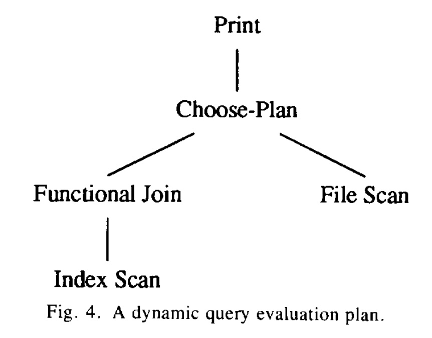  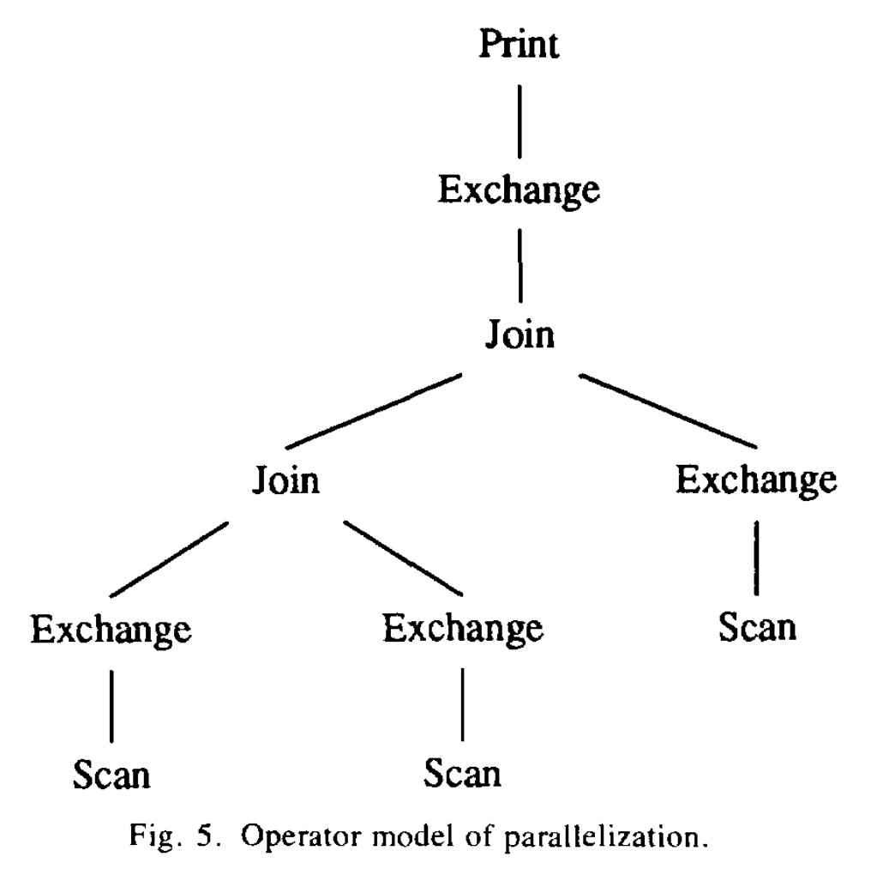  

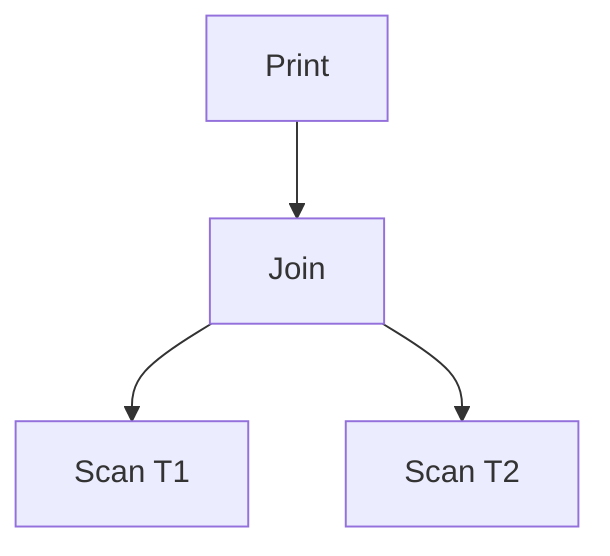

*这是一个简化的查询树，表示先扫描两张表，然后将结果连接，最后打印出来。*

-----

### 2\. 基础知识二：迭代器模型 (The Iterator Model)

这是理解 Volcano 的**最核心概念**。

在 Volcano 之前，一种常见的执行方式是“物化” (Materialize)。比如上图的 Join，需要先把 `Scan T1` 的**所有**结果都拿到，存成一个临时文件，再把 `Scan T2` 的**所有**结果拿到，再读这两个临时文件来计算 Join。这种方式浪费大量磁盘 I/O 和存储空间 。

Volcano 提出了一个优雅得多的模型：**迭代器模型**，也叫“火山模型”或“拉取模型 (Pull-based)” 。

**核心思想：** 查询树中的每个算子（Operator，如图中的 `Join`、`Scan`）都被实现为一个“迭代器”。每个迭代器都提供三个标准接口 ：

1.  `open()`：初始化。比如 `Scan` 算子要打开文件句柄；`Join` 算子要申请内存建哈希表。
2.  `next()`：**获取下一条数据**。这是模型的精髓。
3.  `close()`：清理资源。比如关闭文件、释放内存。

**工作流程（拉取模式）：**

数据流是“自上而下”请求，“自下而上”流动的。

1.  顶层的 `Print` 算子调用 `next()`，它想获取一条数据来打印。
2.  `Print` 算子会向它的子节点 `Join` 算子调用 `next()`。
3.  `Join` 算子发现自己也需要数据，于是向它的子节点 `Scan T1` 和 `Scan T2` 调用 `next()`。
4.  `Scan T1` 算子从磁盘读取一条记录，然后通过 `next()` 的返回值传给 `Join` 。
5.  `Join` 算子拿到数据后（比如先从 T1 拿到一条，构建哈希表），再从 `Scan T2` 拿数据进行匹配。如果匹配成功，它就把这条“Join 好的”数据返回给 `Print`。
6.  `Print` 拿到数据，打印，然后再次调用 `next()` 来要下一条，重复此过程，直到 `Join` 返回“数据已取完”的信号 。

这个模型就像一个“拉”数据的管道，数据一次只处理一条（或一批），不需要中间物化 。论文中的图2  就展示了这种调用关系：`filter` 算子（上层）通过其状态记录中的 `Input` 指针调用 `file-scan` 算子（下层）的函数。  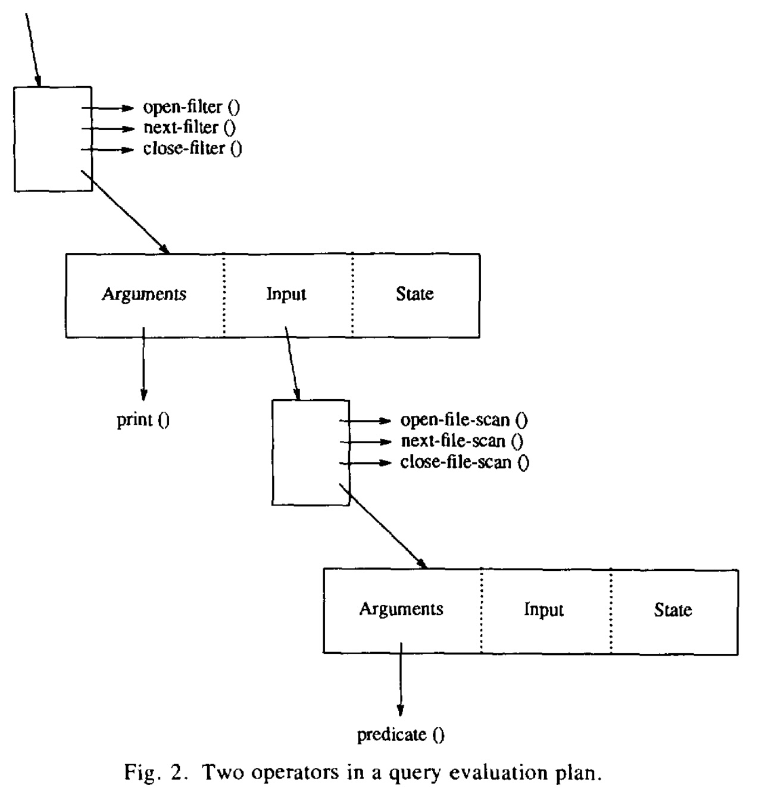  

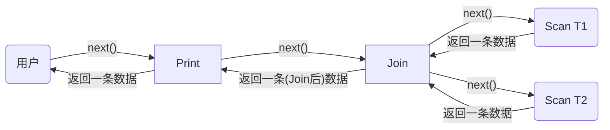

*迭代器模型的“拉取” (Pull) 流程*

-----

### 3\. 基础知识三：可扩展性 (Extensibility)

Volcano 的目标之一是“可扩展”，即能方便地添加新功能（新算子、新算法、新数据类型）。

迭代器模型天生就支持“算子”的可扩展性。只要你实现一个新算子（比如 `NewJoinAlgo`）也遵守 `open-next-close` 接口，它就能像乐高积木一样插入到查询树的任何位置，而它的父算子和子算子根本不需要知道它是谁 。

但 Volcano 还做了一件更绝的事：**分离机制与策略 (Separation of Mechanism and Policy)** 。

**核心思想：** 算子本身（机制）只负责“控制流程”（比如循环、建哈希表），而不负责具体的“数据逻辑”（策略） 。

**Volcano 如何实现：** 通过 **Support Functions (支持函数)** 。

例如，一个 `Filter` 算子（对应 `WHERE` 子句）的 `next()` 逻辑是：
`while (true):`
`   record = child.next() `
`   if (record == EOF): return EOF `
`   if (  **evaluate_predicate(record)** ):  // 调用支持函数 `
`     return record `

`Filter` 算子本身不知道 `evaluate_predicate` 到底是在比较 `age > 30` 还是 `name = 'Volcano'`。这个逻辑是作为“支持函数” 被“插”进来的。

**好处：** 如果你想支持一种新的数据类型（比如“地理位置”）和一个新的操作（比如 `is_inside_polygon`），你不需要修改 `Filter` 算子本身，只需要提供一个新的 `evaluate_predicate` 支持函数 。这使得 Volcano 具有极强的扩展性，甚至做到了“数据模型无关” (data model independence) 。

-----

### 4\. 基础知识四：并行计算 (Parallelism)

这是论文的另一大重点。你需要了解两种最基本的数据库并行方式 ：

1.  **Inter-Operator Parallelism (算子间并行)**：

      * **也叫流水线并行 (Pipelining)** 。
      * **类比：** 汽车装配线。CPU 1 负责 `Scan`（拧轮胎），CPU 2 负责 `Join`（装发动机）。CPU 1 拧好一个轮胎就立即传给 CPU 2，两者同时在工作。
      * 论文中的图6  展示了这种垂直的并行。  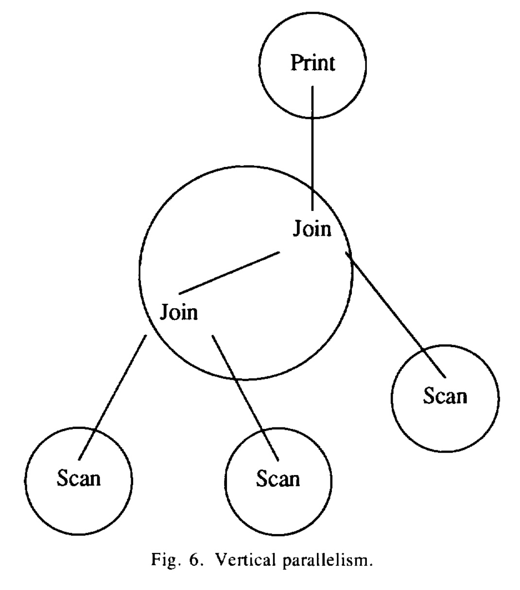  

2.  **Intra-Operator Parallelism (算子内并行)**：

      * **也叫分区并行 (Partitioning)** 。
      * **类比：** 1000 封信需要盖邮戳。你（一个算子）一个人盖很慢。于是你把信分成 5 堆（分区），找来 4 个朋友（共 5 个 CPU），每人盖一堆。
      * 数据被水平切分（Partitioned），每个 CPU 对自己的那份数据执行**相同**的操作。
      * 论文中的图7  展示了这种水平的并行，多个 `Join` 进程在处理数据的不同分区。  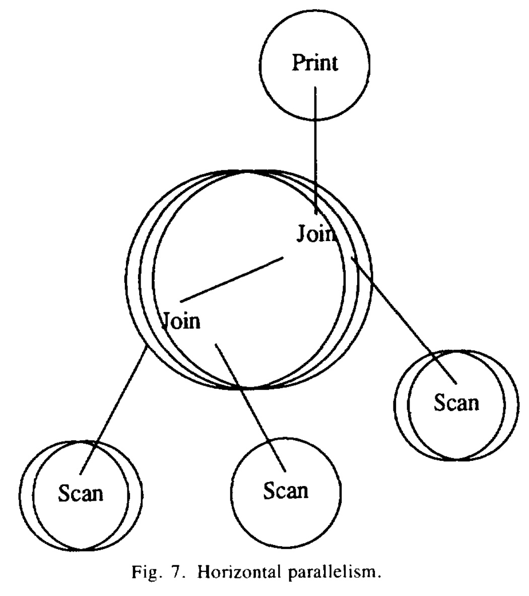  

**Volcano 的妙招：`exchange` 算子**

Volcano 再次使用了一个优雅的设计：它把“并行”这件事也抽象成了一个特殊的算子，叫 **`exchange`** 。

`exchange` 算子是连接“单进程迭代器”和“多进程并行”的桥梁 。

  * **对上层（父算子）** ：`exchange` 算子伪装成一个普通的迭代器，同样提供 `open-next-close` 接口。
  * **对下层（子算子）** ：`exchange` 算子负责启动多个并行的子进程 ，并从它们那里收集数据。

**核心功能：** `exchange` 算子封装了所有与并行相关脏活累活 ：

1.  **进程/线程管理：** 启动和管理并行的“工人”进程 。
2.  **数据分区：** 当用于算子内并行时，它负责把数据（比如用哈希）分发给不同的工人。
3.  **数据流转换：** 这是一个关键点。在 `exchange` *之上*（单进程内），数据流是**需求驱动 (Demand-driven)** 的（即迭代器“拉”数据）。在 `exchange` *之下*（多进程间），数据流是**数据驱动 (Data-driven)** 的（即并行的子进程“推”数据过来）。`exchange` 算子内部有一个缓冲区（论文中叫 `port` ）来协调这两种模式。

论文中的图5  展示了如何通过在查询树中插入 `exchange` 算子来实现一个复杂的并行计划。    

**最大好处：正交性 (Orthogonality)** 。
这意味着，实现 `Join` 算子的工程师**完全不需要关心**并行！他们只需要写好单进程的 `open-next-close` 迭代器 。当需要并行时，优化器只需要在 `Join` 算子下面插入一个 `exchange` 算子 ，`Join` 算子就能在毫不知情的情况下实现并行执行。这极大地简化了系统设计。

-----

### 5\. 基础知识五：动态查询评估 (Dynamic Query Evaluation)

最后，你需要了解为什么查询优化有时不能“一步到位”。

  * **问题：** 有时在编译（优化）SQL 时，我们并不知道查询的具体参数。
  * **例子：** `SELECT * FROM users WHERE age = ?`。这个 `?` 是一个运行时变量 。
      * 如果运行时 `age = 30`，这个年龄的人很多，用全表扫描 (File Scan) 可能更快。
      * 如果运行时 `age = 90`，这个人很少，用索引扫描 (Index Scan) 会快得多。
  * 优化器在编译时无法做出最佳选择 。

**Volcano 的方案：`choose-plan` 算子** 。

这也是一个“元算子” (meta-operator) 。它在查询树中提供一个“二选一”（或多选一）的分支点 。

  * **工作流程：** 当执行到 `choose-plan` 算子的 `open()` 时，它会检查运行时的参数（比如 `?` 的值），然后根据策略（一个支持函数） **选择一个**子树分支来执行 ，而放弃其他分支。
  * 论文中的图4  完美地展示了这一点：`Choose-Plan` 算子在运行时决定是走左边的 `Index Scan` 路径，还是走右边的 `File Scan` 路径。    

-----

### 总结：

要读懂 Volcano，你需要：

1.  **宏观上**：理解 SQL 查询会被转换成一个**查询树 (Query Tree)**。
2.  **单进程**：理解**迭代器模型** (`open-next-close`) 是如何像管道一样“拉”数据的 。
3.  **可扩展**：理解通过**支持函数 (Support Functions)** 将“控制”与“逻辑”分离，实现了可插拔的扩展性 。
4.  **多进程**：理解**算子间 (Pipelining)** 和 **算子内 (Partitioning)** 两种并行方式 。
5.  **精髓**：理解 **`exchange`** 算子  如何封装了所有并行细节（特别是数据流转换），以及 **`choose-plan`** 算子  如何支持运行时决策。

掌握了这些，你就会发现这篇论文的设计是如此的清晰和强大，它定义了后续几十年数据库查询引擎的基本形态。
  
## 2 解读论文 
  
这是一篇在数据库系统领域具有里程碑意义的论文。Volcano（火山）系统提出的查询执行模型，成为了后续几乎所有现代关系型数据库（如 SQL Server, PostgreSQL, Spark SQL 等）执行引擎的设计蓝图。

简单来说，Volcano 设计了一个如同“乐高积木”一样的查询执行引擎，它**优雅地解决了两大难题**：

1.  **可扩展性 (Extensibility)**：如何轻松地为数据库添加新的功能（如新的Join算法、新的数据类型）？
2.  **并行化 (Parallelism)**：如何让查询自动在多个CPU上并行执行，以提高速度？

Volcano 的核心思想是，它**将“数据操作”和“并行控制”这两个复杂问题彻底分开了** 。

下面，我们将用通俗的语言，为你解读 Volcano 的几个关键设计。

-----

### 关键内容一：迭代器模型 (Iterator Model) - Volcano 的基石

这是 Volcano 最核心的贡献，也被称为“火山模型”或“拉取模型 (Pull-based Model)”。

在 Volcano 之前，执行一个复杂的查询（比如 Join）常常需要把中间结果完整地写到磁盘上，再读出来，这非常慢 。Volcano 提出，查询执行树中的每个操作（如“扫描”、“连接”、“过滤”）都应该是一个**迭代器 (Iterator)** 。

每个迭代器都必须提供三个标准接口（API）：

1.  `open()`：初始化操作，例如申请内存、打开文件。
2.  `next()`：**获取下一条结果**。这是模型的精髓。
3.  `close()`：清理操作，例如释放内存、关闭文件。

**工作流程 (需求驱动 Demand-Driven)：**

数据流是“自上而下”发出请求，“自下而上”流回数据的 。

想象一个查询计划：`Print(Filter(Scan(Table)))`。

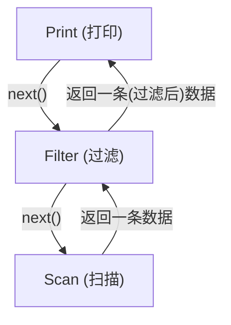

1.  **用户**调用 `Print` 的 `next()`，说：“请给我一条数据”。
2.  **`Print`** 算子转头向它的子节点 `Filter` 调用 `next()`，说：“请给我一条数据”。
3.  **`Filter`** 算子也转头向它的子节点 `Scan` 调用 `next()`，说：“请给我一条数据”。
4.  **`Scan`** 算子从磁盘读取一条数据（比如 `record 1`），然后通过 `next()` 返回给 `Filter`。
5.  **`Filter`** 拿到 `record 1`，判断它是否满足条件。
      * **如果不满足**：`Filter` 会继续向 `Scan` 调用 `next()`，要下一条（`record 2`），然后重复判断，直到找到一条满足条件的。
      * **如果满足**：`Filter` 停止调用 `Scan`，将 `record 1` 通过 `next()` 返回给 `Print`。
6.  **`Print`** 拿到 `record 1`，打印出来。
7.  用户再次调用 `Print.next()`，整个过程重复，直到 `Scan` 算子返回“数据已取完”。

**好处：**

  * **高效**：数据像流水一样在算子间传递，不需要中间存储，内存占用极低 。
  * **可组合**：`Filter` 算子不关心它的子节点是 `Scan` 还是另一个 `Join`。只要对方有 `next()` 接口，它就能工作。这被称为“匿名输入” (anonymous inputs)。这为可扩展性奠定了基础。

论文中的 **图2**  就展示了这种嵌套调用关系，上层的 `filter` 算子通过 `Input` 指针调用下层 `file-scan` 算子的函数 。     

-----

### 关键内容二：可扩展性 (Extensibility) - “机制与策略分离”

Volcano 的目标是成为一个可扩展的系统，让研究人员可以轻松试验新算法和新数据类型 。它通过两个方式实现：

**1. 轻松添加新算子（Operator）**
得益于迭代器模型，如果你发明了一种新的 Join 算法，你只需要把它实现为一个遵循 `open-next-close` 接口的迭代器，就可以像“乐高积木”一样插入到任何查询树中，而其他算子完全感知不到 。

**2. 强大的“支持函数” (Support Functions)**
这是 Volcano 另一个绝妙的设计。它贯彻了“机制与策略分离”的原则 。

  * **机制 (Mechanism)**：算子本身，它只负责“控制流程”，比如 `Filter` 算子只负责循环调用 `next()`。
  * **策略 (Policy)**：具体的数据操作，比如 `Filter` 算子中 `age > 30` 这个比较逻辑。

Volcano 的算子本身是“中空”的 。它把所有具体的数据操作（如比较、哈希、计算）都**外包**给“支持函数” 。

**举个例子：**
`Filter` 算子在 `open()` 时，会接收一个指向“谓词函数”的指针（即支持函数） 。
当 `Filter.next()` 拿到一条数据时，它不会自己去比较，而是调用这个“支持函数” ，问：“这条数据是否满足条件？”

**好处：**
如果你想添加一种新的数据类型（比如“地理位置”）和新的操作（比如 `is_inside_polygon`），你**不需要修改 `Filter` 算子**。你只需要实现一个新的“谓词函数”并传给 `Filter` 算子即可。

这使得 Volcano 摆脱了特定数据模型的束缚，成为了一个通用的、可扩展的集合处理器 。

-----

### 关键内容三：并行化 (Parallelism) - `exchange` 算子的魔力

这是 Volcano 最具开创性的贡献： **它让“并行”也变成了一个“乐高积木”** 。

在 Volcano 之前，如果要让 `Join` 算法并行，就必须重写 `Join` 算法，加入多线程、锁、数据同步等复杂逻辑。

Volcano 提出，数据操作算子（如 `Join`, `Sort`）不应该关心自己是否在并行 。所有与并行相关的工作，都应该交给一个特殊的**元算子 (meta-operator)**——`exchange` 算子 。

（*元算子是指不直接操作数据，而是提供额外控制功能的算子* 。）

**核心思想：正交性 (Orthogonality)**
`exchange` 算子将“数据操作”和“并行控制”这两个问题**正交化**（即解耦）了 。

**`exchange` 算子的工作：**

1.  **伪装**：`exchange` 算子本身也是一个迭代器。对于它*上面*的父算子（消费者），它表现得像一个普通的迭代器（提供 `open-next-close`）。
2.  **控制**：`exchange` 算子负责所有并行的脏活累活：
      * 启动新的进程或线程（即“工人”） 。
      * 将数据进行分区（比如按 Key 哈希）并分发给不同的“工人”。
      * 在进程间传输数据。

**关键洞察：数据流的转换**
`exchange` 算子是两种数据流模型的“翻译官” ：

  * 在 `exchange` **之上**（单个进程内部），Volcano 使用的是迭代器“拉取”模型（需求驱动）。
  * 在 `exchange` **之下**（跨多个进程），`exchange` 启动的“工人”会主动地“推送”数据（数据驱动）。

`exchange` 算子内部有缓冲区（论文中称为 `port` ）来协调这两种模式的切换。

**好处：**
**图 5**  展示了一个并行的查询计划。`Join` 算子和 `Scan` 算子都是普通的单进程代码。但是，通过在它们之间插入 `exchange` 算子，Volcano 就能自动实现并行：    

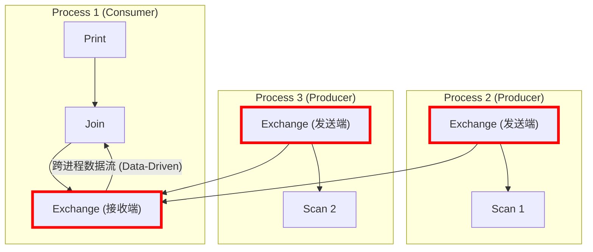

*（这是一个简化的示意图，展示 `exchange` 如何跨进程工作）*

  * `Join` 算子（在 Process 1）调用 `Exchange.next()` 拉取数据。
  * `Exchange` 算子（接收端）等待数据。
  * `Exchange` 算子（发送端，在 Process 2 和 3）从 `Scan` 拉取数据，然后主动“推送”给接收端。

`Join` 算子完全不知道数据是来自 3 个并行的进程，它以为只是在从一个普通的子节点拉取数据。

`exchange` 算子一个模块就支持了所有类型的并行 ：

  * **垂直并行（流水线）** ：如 **图6** 所示，一个算子（如Scan）在一个进程，另一个算子（如Join）在另一个进程 。   
  * **水平并行（分区）** ：如 **图7** 所示，多个进程执行*相同*的操作（如Join），但处理数据的不同分区 。   
  * **丛林并行（Bushy）** ：查询树的不同子树同时执行 。

-----

### 关键内容四：动态查询评估 (Dynamic Query Evaluation)

Volcano 还解决了一个实际问题：有些查询在“编译时”无法确定最优计划。

**问题：**
比如一个嵌入在C++代码里的查询：`SELECT * FROM users WHERE age = ?`。
`?` 是一个运行时变量 。

  * 如果 `? = 90`（人很少），使用“索引扫描”最快。
  * 如果 `? = 30`（人很多），使用“全表扫描”可能更快 。

优化器在编译时不知道 `?` 的值，怎么办？

**Volcano 的方案：`choose-plan` 元算子** 。

优化器可以生成一个包含*多个*备选计划的“动态计划” 。`choose-plan` 算子就是这个计划的“分叉路口”。

如 **图4**  所示：    

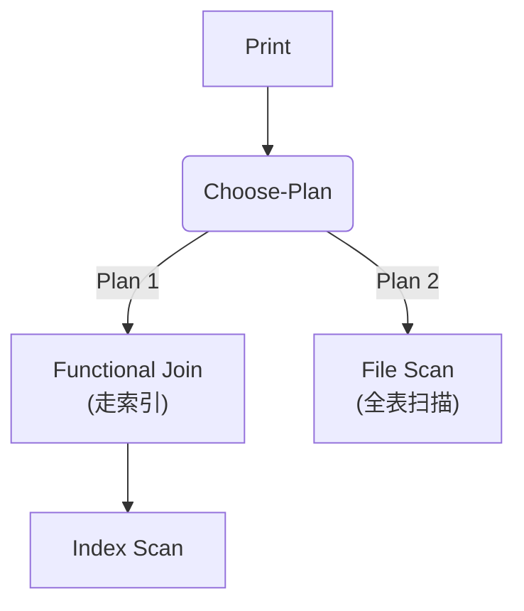

当查询执行到 `choose-plan` 算子的 `open()` 时 ，它会检查 `?` 的运行时值，然后调用一个支持函数（策略）来做决定：是走 Plan 1（索引）还是 Plan 2（全表扫描） 。

**好处：**
系统避免了在每次执行时都重新优化的巨大开销，而是做到了在运行时进行轻量级的“计划选择” 。

-----

### 总结

Volcano 并不是一个完整的数据库系统，而是一个用于数据库研究的查询执行“工具箱” 。但它提出的思想是革命性的：

1.  **迭代器模型** (`open-next-close`) 成为单进程查询执行的标准。
2.  **支持函数** (`Support Functions`) 实现了机制与策略的分离，提供了极佳的扩展性。
3.  **`exchange` 算子** 巧妙地将并行问题与数据操作问题“正交”解耦，使得并行化变得简单且可扩展。

Volcano 是第一个将“可扩展性”和“并行化”有效结合的查询执行引擎 ，它的设计理念深深地影响了此后三十年的所有主流数据库系统。
  
## 3 术语 
  
好的, 这篇名为《Volcano - 一个可扩展的并行查询评估系统》的论文介绍了数据库查询处理领域一个里程碑式的系统. 以下是该论文中一些重要术语的中文讲解, 并引用了论文中的图表以帮助理解.

### 1\. 迭代器模型 (Iterator Model)

迭代器模型是 Volcano 系统设计中最核心的概念. 你可以将它理解为一种数据处理的“流水线”模式, 但这个流水线是**按需拉动 (Demand-Driven)** 的.

每个查询处理操作 (如文件扫描、连接、过滤) 都被封装成一个“迭代器”.  所有的迭代器都遵循一个简单的 `open-next-close` 协议:

  * **`open()`**: 初始化操作, 比如为排序操作分配内存, 或为哈希连接建立哈希表.
  * **`next()`**: 核心函数. 上层操作符调用下层操作符的 `next()` 来请求一条数据. 这个请求会逐级向下传递, 直到最底层的数据源 (如文件扫描) 产生一条记录, 然后再逐级向上传递和处理.
  * **`close()`**: 清理和释放资源.

这种模式的优点是效率高、内存占用少, 因为数据是一条一条地在操作符之间流动的, 无需将中间结果完全物化到磁盘. 

论文中的图2形象地展示了两个迭代器 (一个 `filter` 过滤器和一个 `file-scan` 文件扫描器) 是如何连接在一起工作的. 上层的 `filter` 调用下层 `file-scan` 的 `next()` 函数来获取数据.

  

*图2：查询评估计划中的两个操作符. 展示了上层 filter 操作符通过其输入指针调用下层 file-scan 操作符的 open-next-close 接口, 实现了需求驱动的数据拉取.*

### 2\. 流 (Streams)

在 Volcano 中, “流”是对迭代器输出的一种抽象.  它的核心思想是 **“匿名输入” (anonymous inputs)** .

这意味着, 任何一个操作符在处理数据时, 它只需要知道如何从它的输入源（即下一个迭代器）中通过调用 `next()` 来获取数据, 而完全不需要关心这个输入源究竟是一个文件扫描、一个连接操作, 还是一个复杂的子查询树. 

这种设计是 Volcano 实现可扩展性的基石之一, 因为它允许任何操作符自由地、任意地组合在一起, 形成复杂的查询计划. 

### 3\. 支持函数 (Support Functions)

支持函数是 Volcano 实现数据模型无关性 (Data Model Independence) 和可扩展性的关键机制.

Volcano 的核心操作符 (如排序、连接) 本身只提供通用的“算法框架” (algorithm shells) , 它们并不知道如何解释具体的数据.  比如, 哈希连接操作符知道如何建立哈希表和探测匹配, 但它不知道如何计算具体某个字段的哈希值, 也不知道如何判断两条记录是否相等.

这些具体的数据操作逻辑, 就是通过“支持函数”作为参数传递给操作符的.  例如, 在进行连接时, 你需要向连接操作符提供一个用于计算哈希值的函数和一个用于比较键值的函数.

这种设计将 **“对集合的控制逻辑”**  (例如, 如何迭代数据) 与 **“对单个数据项的解释和操作”**  (例如, 比较两个值) 完美地分离开来 , 使得 Volcano 可以轻松支持新的数据类型和操作, 而无需修改核心的查询处理算法. 

### 4\. 元操作符 (Meta-operators)

元操作符是一种特殊的操作符, 它们不直接参与数据内容的计算或转换 (如筛选、连接), 而是提供对查询处理流程的**控制能力**.  论文介绍了两个创新的元操作符.

#### 4.1. `choose-plan` (计划选择) 操作符

这个元操作符用于实现 **“动态查询评估计划” (Dynamic Query Evaluation Plans)** .

在传统数据库中, 查询计划在编译时就已确定. 但有时最优计划依赖于运行时才能知道的参数 (例如, 嵌入在应用程序中的查询, 其过滤条件的值由用户输入决定).

`choose-plan` 操作符允许一个查询计划包含多个备选的子计划. 在查询**运行时**, 它会根据当时的具体参数 (如变量值、系统负载等) 来选择执行哪一个最优的子计划. 

下图4展示了一个简单的动态计划: 系统可以在运行时根据条件选择性, 决定是使用更快的“索引扫描 + 函数式连接”路径, 还是使用“全文件扫描”路径. 

  

*图4：一个动态查询评估计划. Choose-Plan 操作符可以在运行时决定执行左边的索引扫描路径还是右边的文件扫描路径.*

#### 4.2. `exchange` (交换) 操作符

`exchange` 是 Volcano 实现并行查询的核心, 也是另一个元操作符.  它的革命性在于, 它将**所有与并行处理相关的复杂问题 (如数据分区、进程间通信、流量控制) 都封装在了这一个操作符内部**. 

这使得数据操作 (Data Manipulation) 和并行化 (Parallelism) 两个问题变得**正交 (orthogonal)**. 查询计划中的其他所有操作符 (如 join, sort) 在设计和实现时完全不需要考虑并行执行的细节, 它们就像在单进程环境中运行一样.  当需要并行执行时, 只需在查询计划的适当位置插入 `exchange` 操作符即可.

`exchange` 操作符支持两种主要的并行方式:

  * **垂直并行 (Vertical Parallelism)**: 也称为流水线并行, 不同的操作符运行在不同的进程或处理器上.
  * **水平并行 (Horizontal Parallelism)**: 也称为分区并行, 将数据分成多份, 让多个进程对不同的数据子集执行相同的操作. 

下图5展示了一个复杂的并行查询计划, 其中 `exchange` 操作符被插入到 `scan` 和 `join` 操作之间, 用于协调和管理并行执行. 

  

*图5：并行化的操作符模型. Exchange 操作符被插入查询计划中, 以实现不同部分（如 Scan 和 Join）的并行处理.*

### 5\. 一对一匹配 (One-to-One Match) 操作符

这是一个非常通用和强大的**物理操作符 (physical operator)**, 而不是逻辑操作符. 它将大量功能相似的集合匹配操作整合到了一个模块中. 

这个操作符能够实现包括:

  * **连接类**: Join, Semi-join, Outer Join, Anti-join
  * **集合类**: Intersection (交集), Union (并集), Difference (差集)
  * **一元操作**: Aggregation (聚合), Duplicate Elimination (去重)

其基本原理如下图3所示, 通过识别两个输入集合 R 和 S 中匹配的部分 (B)、不匹配的部分 (A 和 C), 然后根据具体操作的需要, 对这些部分进行组合输出.  例如, "Join" 输出的是匹配部分 B, 而 "Left outer join" 输出的是 A 和 B 的组合.

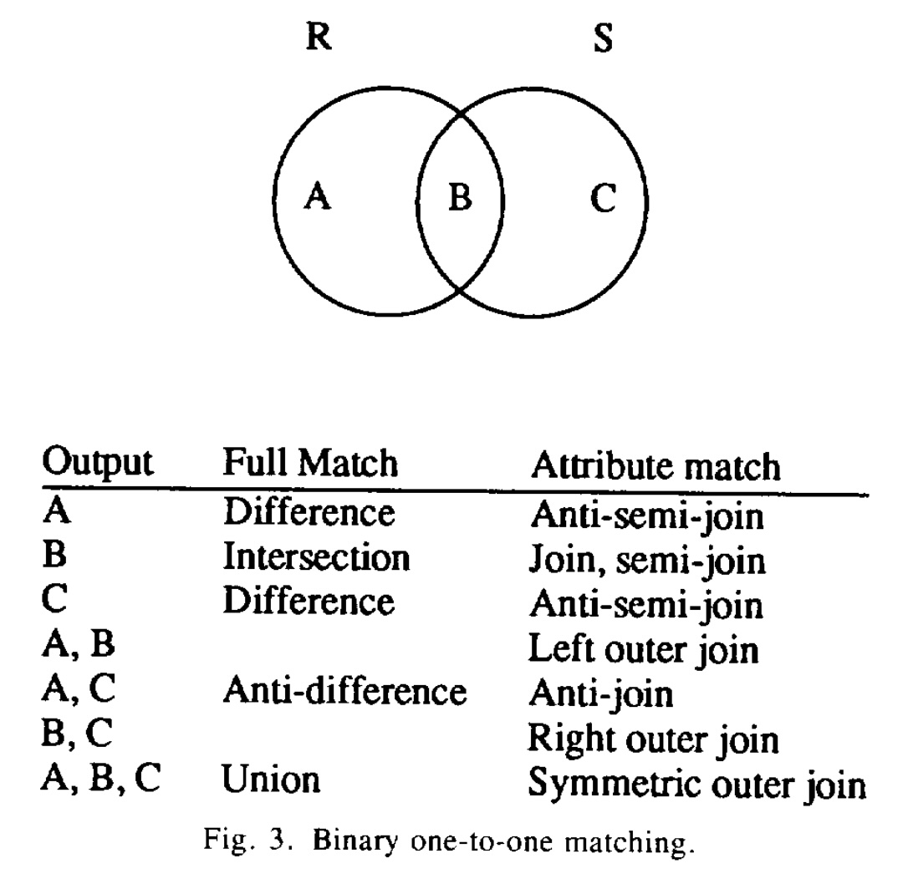  

*图3：二元一对一匹配. 该图表展示了 One-to-One Match 操作符如何根据两个集合 R 和 S 的匹配与否, 实现多种不同的集合和连接操作.*

通过实现这一个高度参数化的操作符, Volcano 用极少的代码量实现了传统数据库系统需要多个独立操作符才能完成的功能.

### 6\. 数据流模式: 需求驱动 (Demand-Driven) vs. 数据驱动 (Data-Driven)

Volcano巧妙地结合了两种数据流模型:

  * **进程内 (Within a process)**: 使用**需求驱动**数据流.  这就是前面提到的迭代器模型, 上层操作符“拉取”数据, 控制权在消费者手中. 这种方式对于单进程环境非常高效. 
  * **进程间 (Between processes)**: 使用**数据驱动**数据流.  这是通过 `exchange` 操作符实现的, 生产者进程主动“推送”数据给消费者进程. 这种方式更适合网络环境和多进程并行计算, 可以减少通信延迟. 

`exchange` 操作符的一个关键作用就是作为这两种数据流模式之间的 **“翻译器”** . 
  
## 参考        
         
https://cs-people.bu.edu/mathan/reading-groups/papers-classics/volcano.pdf    
        
<b> 以上内容基于DeepSeek、Qwen、Gemini及诸多AI生成, 轻微人工调整, 感谢杭州深度求索人工智能、阿里云、Google等公司. </b>        
        
<b> AI 生成的内容请自行辨别正确性, 当然也多了些许踩坑的乐趣, 毕竟冒险是每个男人的天性.  </b>        
  
    
#### [期望 PostgreSQL|开源PolarDB 增加什么功能?](https://github.com/digoal/blog/issues/76 "269ac3d1c492e938c0191101c7238216")
  
  
#### [PolarDB 开源数据库](https://openpolardb.com/home "57258f76c37864c6e6d23383d05714ea")
  
  
#### [PolarDB 学习图谱](https://www.aliyun.com/database/openpolardb/activity "8642f60e04ed0c814bf9cb9677976bd4")
  
  
#### [PostgreSQL 解决方案集合](../201706/20170601_02.md "40cff096e9ed7122c512b35d8561d9c8")
  
  
#### [德哥 / digoal's Github - 公益是一辈子的事.](https://github.com/digoal/blog/blob/master/README.md "22709685feb7cab07d30f30387f0a9ae")
  
  
#### [About 德哥](https://github.com/digoal/blog/blob/master/me/readme.md "a37735981e7704886ffd590565582dd0")
  
  

  
