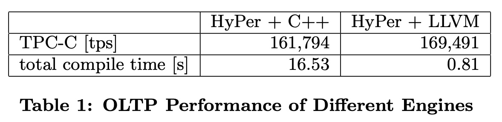

## AI论文解读 | Efficiently Compiling Efficient Query Plans For Modern Hardware
        
### 作者        
digoal        
        
### 日期        
2025-10-17        
        
### 标签        
PostgreSQL , PolarDB , DuckDB , AI , 论文解读        
        
----        
        
## 背景  
      
https://www.vldb.org/pvldb/vol4/p539-neumann.pdf        
  
提示:          
```          
读懂《Efficiently Compiling Efficient Query Plans For Modern Hardware》这篇论文需要提前掌握哪些基础知识, 请使用中文通熟易懂的讲解这些基础知识, 可以引用论文中的图、表或使用Markdown支持的图形(text,mermaid等)增加解释性. 
  
使用中文通熟易懂的解读《Efficiently Compiling Efficient Query Plans For Modern Hardware》这篇论文, 其中的关键内容请着重讲解, 可以引用论文中的图、表或使用Markdown支持的图形(text,mermaid等)增加解释性. 
  
提取《Efficiently Compiling Efficient Query Plans For Modern Hardware》这篇论文中的重要术语, 使用中文对这些术语进行通熟易懂的讲解, 可以引用论文中的图、表或使用Markdown支持的图形(text,mermaid等)增加解释性. 
```     
  
## 1 前置知识 
  
好的，为了透彻理解《Efficiently Compiling Efficient Query Plans For Modern Hardware》这篇论文，你需要掌握以下几个核心领域的基础知识。这篇论文的精髓在于，它摒弃了传统的数据库查询执行方式，而是将查询编译成对现代CPU极其友好的底层机器码，从而实现性能的巨大飞跃。

下面我将为你通俗易懂地讲解这些必备知识，并引用论文中的图表示例。

-----

### 1\. 数据库查询处理的基础知识

首先，你需要了解数据库是如何执行一条SQL查询语句的。

#### A. 查询执行计划 (Query Execution Plan)

当你写下一条SQL语句（例如 `SELECT ... FROM ... WHERE ...`），你只是告诉数据库你**想要什么**（声明式），而不是**如何获取**（过程式）。数据库内部的“查询优化器”会将你的SQL语句转换成一个详细的执行步骤，这个步骤通常是一个由多个“算子”（Operator）组成的树形结构，称为查询执行计划。

常见的算子包括：

  * **Table Scan (表扫描)**: 从表中读取数据。
  * **Selection/Filter (选择/过滤)**: 根据 `WHERE` 条件筛选数据行。
  * **Join (连接)**: 将两个表的数据根据连接条件合并。
  * **Aggregation (聚合)**: 执行 `GROUP BY`, `SUM()`, `COUNT()` 等操作。

例如，论文图3中的左半部分就是一个查询执行计划树。 

  

Figure 3 from the paper, showing an execution plan tree.

> **图解**: 这是论文中一个查询的执行计划 。数据从底部的表 $R_1, R_2, R_3$ 开始，经过过滤( $\sigma$ )、聚合( $\Gamma$ )和连接( $\bowtie$ )算子，最终在顶部输出结果。

#### B. “拉”模型：火山/迭代器模型 (The "Pull" Model: Volcano/Iterator Model)

这是传统数据库最经典的执行模型 。你可以把它想象成一条“需求驱动”的流水线。

  * **工作方式**: 树顶部的算子（比如连接）为了产生一条结果，会调用其子算子（比如表扫描）的 `next()` 函数，说：“给我下一条数据”。子算子收到请求后，也会同样向它的子算子请求数据，这个请求一直传递到最底层的算子。底层算子从磁盘或内存中取到一条数据后，再层层向上传递，直到顶层。

  * **可视化对比**:


  * **缺点 (也是本论文要解决的核心痛点)**:
    1.  **函数调用开销巨大**: 每处理一条数据（元组），都可能涉及多次 `next()` 函数调用。在处理数百万行数据时，这就意味着数百万次的函数调用开销 。
    2.  **不利于CPU优化**: 这种频繁的、通常是虚函数  的调用，会严重干扰现代CPU的**分支预测**机制，导致CPU频繁等待，性能下降 。
    3.  **数据局部性差**: 数据和处理逻辑分散在各个独立的算子中，CPU缓存无法有效利用 。

### 2\. 现代CPU硬件架构知识

这篇论文的论点建立在“CPU的计算效率，而非磁盘I/O，是现代内存数据库的性能瓶颈”  这一观察之上。因此，理解CPU的工作原理至关重要。

#### A. CPU缓存和数据局部性 (CPU Cache & Data Locality)

CPU的计算速度远快于内存的读取速度。为了弥补这个差距，CPU内置了多级高速缓存（L1, L2, L3 Cache）。

  * **内存层级**: `CPU寄存器` \> `L1/L2/L3缓存` \> `主内存(RAM)`。访问速度逐级递减，成本也逐级降低。
  * **数据局部性**: 高效的程序应该让CPU大部分时间都在访问高速缓存，而不是频繁地去主内存取数据。这就要求数据具有良好的“局部性”：
      * **时间局部性**: 最近访问过的数据，很可能马上会再次被访问。
      * **空间局部性**: 当访问某个内存地址后，很可能马上会访问其相邻的地址。

**与论文的关联**: 传统迭代器模型每次处理一条元组，就要在不同算子的代码和数据之间来回跳转，破坏了数据局部性 。而论文提出的**数据中心 (data-centric)** 方法，则让一小段紧凑的代码（一个pipeline片段）处理大量连续的数据，从而最大化地利用CPU缓存 。

#### B. 分支预测 (Branch Prediction)

为了提升效率，现代CPU会像流水线一样同时处理多条指令。当遇到一个条件判断（如 `if-else`）时，CPU不知道该执行哪个分支的代码，它会**猜测**一个最可能的分支，并提前开始执行。

  * **猜对了**: 流水线继续顺畅运行，性能很高。
  * **猜错了 (mis-prediction)**: CPU必须丢弃已经提前执行的所有指令，清空流水线，然后从正确的分支重新开始。这个过程代价非常高昂。

**与论文的关联**: 迭代器模型中大量的虚函数调用，对于CPU来说就是极难预测的分支 。论文通过生成没有复杂调用和分支的线性代码，使得CPU可以准确预测执行路径，避免性能损失 。

### 3\. 替代查询执行模型

在理解论文的创新之前，需要了解一些已经被提出的、用于改进传统迭代器模型的方案。论文的图1就是一个极佳的总结。

  

Figure 1 from the paper, comparing different execution engines.

> **图解**: 这张图比较了不同执行模型处理TPC-H查询1的性能 。
>
>   * **"tuple at a time"**: 就是传统的迭代器模型，非常慢。
>     * **"column at a time"**: 每个算子处理完一整列（或整个中间结果）再交给下一个算子，这被称为**物化模型**。它避免了频繁的函数调用，但代价是消耗大量内存带宽来读写中间结果 。
>     * **"vector at a time"**: 也叫**向量化或批处理模型**，是前两者的折中。它一次处理一小批（一个向量，比如1000行）数据 。这摊销了函数调用开销，性能更好，是VectorWise等现代分析型数据库的核心思想。
>   * **Hand-Coded C Program**: 手写的C程序，代表了理论上的性能极限。
>
> **这篇论文的目标，就是通过编译技术，让数据库的执行效率无限接近手写C代码的水平。**

### 4\. 编译器基础知识

这是实现论文思想的关键技术。

#### A. 即时编译 (Just-In-Time Compilation - JIT)

传统的程序要么是解释执行（如Python脚本，逐行翻译执行），要么是提前编译（Ahead-Of-Time, AOT，如C++，编译成可执行文件后运行）。JIT结合了两者的优点，它在**程序运行时**才将代码（或中间语言）编译成针对当前机器最优化的本地机器码。

**与论文的关联**: 论文提出的方法不是解释执行查询计划，也不是提前编译成一个通用的C++程序，而是在用户提交查询后，针对这个**具体的查询**，在运行时动态生成最高效的机器码并立即执行 。

#### B. LLVM (Low Level Virtual Machine)

LLVM并不是一个像Java虚拟机那样的东西，它是一个强大的**编译器基础设施** 。它提供了一整套工具和库，可以让你非常方便地生成、优化和编译代码。

  * **核心**: 它定义了一种中间表示（IR），类似于一种通用的、类型安全的汇编语言。
  * **工作流程**: 开发者只需要将自己的语言（在这里是查询计划）转换成LLVM IR，然后LLVM强大的后端优化器和JIT引擎就会负责剩下的工作——生成为特定CPU（如Intel x86, ARM）优化过的、极快的机器码。

**与论文的关联**: 论文选择LLVM作为其编译器后端 。相比于生成C++代码再调用GCC/Clang编译（这会非常慢，可能需要几秒钟 ），直接生成LLVM IR并使用其JIT引擎，编译时间可以缩短到毫秒级 ，同时还能对生成的代码进行更精细的控制，从而获得极致性能 。

-----

### 总结

要读懂这篇论文，你需要搭建一个如下的知识体系：

1.  **理解问题**: 了解传统数据库的**迭代器模型**及其在现代硬件上的**性能瓶颈**（函数调用开销、分支预测失败、数据局部性差）。
2.  **理解背景**: 知道为了解决这些问题，业界已经有了**物化模型**和**向量化模型**等改进方案，但它们仍未达到极致性能。
3.  **理解目标**: 明白这篇论文追求的目标是**CPU效率最大化**，这需要充分利用**CPU缓存**和**分支预测**等硬件特性。
4.  **理解方案**: 掌握论文提出的核心思想——**数据驱动的“推”模型**和**查询编译**，并了解其实现工具——**JIT编译**和**LLVM框架**。

有了这些基础，你就能更好地理解论文中为何要提出“数据中心”、“流水线边界 (pipeline boundaries)”等概念，以及它是如何通过 `produce()` 和 `consume()` 接口将查询计划巧妙地翻译成高效的线性代码片段的。
  
## 2 解读论文 
  
好的，这篇名为《为现代硬件高效编译高效的查询计划》的论文，是数据库领域一篇非常重要的作品。它提出了一个革命性的方法，让数据库查询能像为特定硬件“量身定做”的手写代码一样快。

下面，我将为你通俗易懂地解读这篇论文的核心思想和关键内容。

### 论文解决了什么痛点？

在过去，数据库性能的瓶颈主要是磁盘I/O。但随着内存越来越大、越来越便宜，整个数据库都可以放入内存中，这时，**CPU的计算效率**反倒成了新的瓶颈 。

传统的数据库查询执行模型，即 **迭代器模型（Iterator Model）** ，在这种新形势下显得力不从心 。它的工作方式就像一条“拉动”的流水线：顶层算子需要数据时，就向下一层要，一层层地请求，数据再一层层地返回 。这种模型虽然设计优雅、易于组合 ，但在现代CPU上运行时有三大硬伤：

1.  **巨大的函数调用开销**：每处理一条数据，都可能触发一长串的函数调用（通常还是开销更大的虚函数调用），处理上百万行数据就是上百万次调用开销 。
2.  **糟糕的CPU缓存局部性**：代码在不同算子的逻辑之间频繁跳转，数据在内存中也是离散的，导致CPU缓存命中率极低 。
3.  **频繁的分支预测失败**：大量的函数调用和复杂的逻辑判断，使得CPU的“分支预测”功能频繁失灵，导致CPU流水线中断，空耗性能 。

论文中的图1非常直观地展示了这个问题：

  

Figure 1 from the paper, comparing different execution engines.

> **图1解读**: 这张图比较了不同模型执行一个简单聚合查询的速度。传统的“一次一元组 (tuple at a time)”模型（如DBMS "X"和MySQL 4.1）性能最差 。后来的“一次一向量 (vector at a time)”或“一次一列 (column at a time)”模型（如MonetDB/X100）性能好了很多 ，但它们与**手写的C程序 (Hand-Coded C Program)** 之间仍然存在巨大的性能鸿沟 。**这篇论文的核心目标，就是用一种自动化的方法填补这个鸿沟**。

-----

### 核心思想：数据驱动的“推”模型与查询编译

为了解决上述痛点，作者提出了一个全新的查询执行模型，其核心是**数据驱动 (Data Centric)** 和 **查询编译 (Query Compilation)**。

#### 1\. 从“拉”模型到“推”模型 (From Pull to Push)

作者颠覆了传统的数据流控制方向。不再是上层算子去“拉”数据，而是底层算子主动将处理好的数据“推”给上层算子 。


这种“推”模型的好处在于，数据可以被连续处理，直到遇到一个不得不中断的地方为止。

#### 2\. 流水线边界 (Pipeline Boundaries) 与代码生成

作者定义了一个关键概念：**流水线中断点 (Pipeline Breaker)**。一个算子如果需要将正在CPU寄存器中处理的数据写入到主内存，那么它就是一个中断点 。典型的中断点包括：

  * 构建哈希表的Join算子 。
  * 需要排序的Sort算子。
  * 进行分组聚合的Aggregation算子 。

整个查询执行过程因此被这些中断点划分成若干个**流水线片段**。论文的策略是，**将每个流水线片段编译成一个高度优化的、紧凑的C++或底层代码循环** 。

让我们通过论文中的例子（图2、3、4）来理解这个过程：

  

Figures 2 and 3 from the paper.

> **图2&3解读**: 左边是SQL查询 ，中间是它的逻辑执行计划树 。右边则根据中断点（哈希连接和聚合都需要物化数据）划分出了**流水线边界**（虚线框） 。整个执行计划被分成了4个独立的流水线片段。

基于这个划分，系统不再是按照算子逐个执行，而是编译生成如下的目标代码：

  

Figure 4 from the paper.

> **图4解读**: 这是为图3计划生成的目标伪代码 。可以看到，它完全不是按算子调用的，而是变成了几个紧凑的循环：
> 1.  **片段1**: 循环读取表`R1`，执行过滤条件`t.x=7`，然后直接将结果物化到第一个Join的哈希表中 。Scan、Filter和Join的构建操作被“融合”在了一个循环里。
> 2.  **片段2**: 类似地，处理`R2`的数据并进行聚合 。
> 3.  **片段3**: 将聚合结果物化到第二个Join的哈希表中 。
> 4.  **片段4**: 循环读取`R3`，在两个哈希表中进行探测（Probe），并输出最终结果 。
>
> 这种生成的代码**算子边界被模糊化** ，取而代之的是以数据为中心的处理流程。在一个片段（如片段1）内部，数据尽可能地保存在CPU寄存器中 ，代码也是一段连续执行的紧凑循环，这**极大地提升了CPU缓存效率和执行效率** 。

-----

### 实现利器：LLVM JIT编译器

如何高效地生成上述代码？论文最初尝试生成C++源码再调用系统编译器（如GCC）进行编译，但发现这种方式有两大缺点：

  * **编译太慢**：编译一个复杂查询可能需要数秒钟，对于需要快速响应的数据库系统来说无法接受 。
  * **控制力不足**：无法完全控制生成的汇编代码，难以进行极致的底层优化 。

因此，作者最终选择了 **LLVM (Low Level Virtual Machine)** 框架 。LLVM是一个强大的编译器工具集，它允许程序在运行时动态生成代码，并通过**即时编译 (Just-In-Time, JIT)** 技术直接在内存中将其转换为高效的本地机器码 。

使用LLVM的好处是：

  * **编译速度极快**：通常只需要几毫秒，比调用C++编译器快几个数量级 。
  * **控制力强**：可以直接生成汇编级别的指令，进行各种底层优化，让代码对CPU更友好 。
  * **无缝混合编程**：可以将查询中复杂的部分（如哈希表的管理）用C++实现并预编译，而将连接各个部分的数据处理流水线用LLVM动态生成。如下图所示，C++代码像一个个“齿轮”，而LLVM生成的代码则是驱动它们的“链条” 。

  

Figure 6 from the paper.

-----

### 惊艳的性能表现

论文通过将其实现集成到HyPer数据库中，并与其他系统进行了对比，结果令人印象深刻。

| 系统 | Q1 (ms) | Q3 (ms) | Q5 (ms) | 编译总时间 (s) |
| :--- | :---: | :---: | :---: | :---: |
| DB X (商业数据库) | 4221 | 16410 | 15212 | - |
| MonetDB | 72 | 112 | 12028 | - |
| VectorWise | 98 | 436 | 1107 | - |
| HyPer (C++后端) | 142 | 141 | 1416 | 16.53 |
| **HyPer (LLVM后端)** | **35** | **80** | **1105** | **0.81** |

    

> **表1和表2数据解读**:
> * **执行性能**: 在OLAP查询（Q1-Q5）上，基于LLVM的HyPer版本性能全面领先，通常比其他先进的内存数据库快2-4倍 。即使是与自己原先的C++编译后端相比，性能提升也十分显著，尤其是在简单的聚合查询Q1上，速度快了4倍 。
> * **编译性能**: LLVM版本的编译总时间仅为0.81秒，而C++后端则需要16.53秒，慢了20倍以上 。这证明了JIT编译的巨大优势。

  
  

更深入的底层分析（表3）表明，LLVM生成的代码在**分支数量、分支预测错误率、指令缓存和数据缓存的未命中数**等关键CPU性能指标上，都远优于其他系统 。这直接印证了该方法设计的成功之处。

### 结论

这篇论文的核心贡献可以总结为：

1.  **提出了一种数据驱动的查询处理架构**，通过将数据从一个“流水线中断点”推向下个中断点，模糊了算子边界，实现了极致的数据局部性。
2.  **开创性地将LLVM JIT编译技术引入数据库查询执行**，实现了极快的编译速度和接近手写代码的运行效率。

它证明了通过深入理解现代硬件的特性，并采用编译技术生成“CPU友好”的代码，可以极大地释放数据库系统的性能潜力，为后续高性能数据库的设计开辟了全新的道路。
  
## 3 术语 
  
好的，这篇论文引入了数据库查询执行领域的一些关键术语和思想。下面我将用通俗易懂的方式，结合论文中的图表，对这些重要术语进行讲解。

-----

### 1\. 迭代器模型 (Iterator Model / Volcano-style processing)

  * **讲解**: 这是传统数据库最经典的一种查询执行方式 。你可以把它想象成一条“**老板驱动**”的流水线。最终的客户（顶层算子）需要一个产品（一条查询结果），于是他对他的下级（子算子）说“给我一个零件 (`next()`)”。这个下级又对他的下级发出同样请求，命令一层层传递下去，直到最底层的工人（扫描算子）从仓库（数据表）中拿到一个原材料（一行数据），再一层层加工并传递上来 。

  * **痛点**: 每生产一个最小零件（处理一行数据），都需要从上到下发号施令，再从下到上传递成果 。这导致了大量的沟通成本（函数调用开销），并且每个工人都只关心自己的小任务，整体效率低下（不利于CPU缓存和分支预测） 。

### 2\. "一次一元组" vs. "一次一向量" (Tuple at a time vs. Vector at a time)

这两个术语描述了数据在算子之间流转的粒度，论文的图1清晰地展示了它们的区别。

  

Figure 1 from the paper, comparing different execution engines. 

  * **一次一元组 (Tuple at a time)**: 这是传统迭代器模型的处理方式 。每个 `next()` 调用只处理并返回**一条**数据记录（元组） 。如图1所示，这种方式性能最差 。

  * **一次一向量 (Vector at a time)**: 这是一种改进模型，算子之间不再是一条一条地传递数据，而是一批一批地传递（例如一次1000条） 。这一批数据被称为一个“向量”或“块”。这样做的好处是**摊销**了 `next()` 的调用开销，性能得到显著提升 。MonetDB/X100 (VectorWise) 就是这种模型的代表 。

### 3\. 流水线 (Pipelining) vs. 物化 (Materialization)

  * **流水线 (Pipelining)**: 指数据可以像水流一样，直接从一个算子传递给下一个算子，而不需要在中间存储 。例如，一个过滤算子（Selection）检查完一条数据后，如果符合条件，就立即把它交给上层的连接算子（Join），自身不保留数据副本 。流水线的优点是节省内存和带宽 。

  * **物化 (Materialization)**: 指一个算子必须将其处理完的**所有**中间结果完整地写入内存，然后下一个算子才能开始处理 。例如，构建哈希表的Join算子，必须先把一侧输入表的所有数据都读取并存入哈希表中（物化），然后才能开始处理另一侧的输入 。物化的缺点是消耗更多的内存带宽 。

### 4\. 数据驱动 (Data Centric) vs. 算子驱动 (Operator Centric)

这是本文提出的核心思想转变。

  * **算子驱动 (Operator Centric)**: 传统模型以“算子”为中心，代码逻辑围绕着算子的 `next()` 接口设计，数据只是被动地在算子间传递 。

  * **数据驱动 (Data Centric)**: 新模型以“数据”为中心 。它的目标是让数据在CPU寄存器中停留尽可能长的时间 。为了实现这个目标，代码的组织方式被彻底改变，不再是独立的算子，而是将多个算子的逻辑“融合”成一段连续的代码，专门处理一批数据 。

### 5\. “推”模型 (“Push-based”) vs. “拉”模型 (“Pull-based”)

这形象地描述了数据流的控制方向。


  * **“拉”模型 (Pull-based)**: 传统迭代器模型就是典型的“拉”模型，数据流由消费方（上层算子）发起拉取动作来驱动 。
  * **“推”模型 (Push-based)**: 本文提出的模型是“推”模型，数据流由生产方（下层算子）发起推送动作来驱动 。数据被主动地从一个处理阶段推向下一个阶段 。

### 6\. 流水线中断点 (Pipeline Breaker)

  * **讲解**: 在“推”模型中，数据可以顺畅地在CPU寄存器中流动，但这个流动不是无限的。当遇到一个算子，它**不得不**将数据从寄存器写入主内存时，这个流畅的流水线就被“中断”了 。这个点就叫做**流水线中断点**。
  * **例子**: 哈希连接（Hash Join）和聚合（Aggregation）等算子通常是中断点，因为它们需要构建哈希表等内存数据结构 。
  * **作用**: 这个概念是实现数据驱动模型的关键。整个查询计划被中断点分割成多个**流水线片段** 。论文的目标就是为每一个片段编译生成一段独立的、高效的、紧凑的循环代码 。

  

Figure 3 from the paper, showing an execution plan tree.

> **图3解读**: 图右侧的虚线框就清晰地标示出了流水线边界。数据从R1流出，经过过滤，直到碰上第一个中断点（`⋈a=b`的哈希表构建），这是一个片段。

### 7\. LLVM 与 JIT (即时编译)

  * **LLVM (Low Level Virtual Machine)**: 这是一个强大的**编译器基础设施** 。它提供了一套工具，可以方便地将高级语言（在这里是查询计划）转换成一种中间代码，并能对这些代码进行深度优化，最后生成针对特定CPU的、极快的机器码 。

  * **JIT (Just-In-Time) Compilation)**: 即**即时编译**。传统的编译是在程序运行前完成的（AOT），而JIT是在**程序运行时**才进行编译 。在本文中，数据库系统在收到一条SQL查询后，利用LLVM的JIT引擎，动态地为这条查询生成专属的、最优的机器码，然后立刻执行 。这相比于先生成C++代码再调用外部编译器的方式，编译速度快了几个数量级，通常只需几毫秒 。

### 8\. 数据局部性 (Data Locality) 与 分支预测 (Branch Prediction)

这两个是来自计算机体系结构的术语，也是本文方法能够取得成功的根本原因。

  * **数据局部性 (Data Locality)**: 指的是CPU在访问数据时，倾向于集中访问一小块内存区域 。由于本文提出的模型将多个操作融合在一个紧凑的循环中，处理连续的数据块，因此**数据局部性**非常好，CPU可以一直从高速缓存中读取数据，避免了访问慢速主内存的开销 。

  * **分支预测 (Branch Prediction)**: 现代CPU为了提高效率，会猜测 `if-else` 等条件语句会走哪个分支，并提前执行。如果猜错，代价会非常高昂 。传统迭代器模型中大量的虚函数调用，对CPU来说是极难预测的分支 。而本文生成的是简单、线性的代码，分支结构清晰可预测，大大降低了预测失败率 。
  
## 参考        
         
https://www.vldb.org/pvldb/vol4/p539-neumann.pdf    
        
<b> 以上内容基于DeepSeek、Qwen、Gemini及诸多AI生成, 轻微人工调整, 感谢杭州深度求索人工智能、阿里云、Google等公司. </b>        
        
<b> AI 生成的内容请自行辨别正确性, 当然也多了些许踩坑的乐趣, 毕竟冒险是每个男人的天性.  </b>        
  
    
#### [期望 PostgreSQL|开源PolarDB 增加什么功能?](https://github.com/digoal/blog/issues/76 "269ac3d1c492e938c0191101c7238216")
  
  
#### [PolarDB 开源数据库](https://openpolardb.com/home "57258f76c37864c6e6d23383d05714ea")
  
  
#### [PolarDB 学习图谱](https://www.aliyun.com/database/openpolardb/activity "8642f60e04ed0c814bf9cb9677976bd4")
  
  
#### [PostgreSQL 解决方案集合](../201706/20170601_02.md "40cff096e9ed7122c512b35d8561d9c8")
  
  
#### [德哥 / digoal's Github - 公益是一辈子的事.](https://github.com/digoal/blog/blob/master/README.md "22709685feb7cab07d30f30387f0a9ae")
  
  
#### [About 德哥](https://github.com/digoal/blog/blob/master/me/readme.md "a37735981e7704886ffd590565582dd0")
  
  

  
