## AI论文解读 | Multi-Core, Main-Memory Joins: Sort Vs. Hash Revisited
        
### 作者        
digoal        
        
### 日期        
2025-10-17        
        
### 标签        
PostgreSQL , PolarDB , DuckDB , AI , 论文解读        
        
----        
        
## 背景  
      
https://www.vldb.org/pvldb/vol7/p85-balkesen.pdf        
  
提示:          
```          
读懂《Multi-Core, Main-Memory Joins: Sort Vs. Hash Revisited》这篇论文需要提前掌握哪些基础知识, 请使用中文通熟易懂的讲解这些基础知识, 可以引用论文中的图、表或使用Markdown支持的图形(text,mermaid等)增加解释性. 
  
使用中文通熟易懂的解读《Multi-Core, Main-Memory Joins: Sort Vs. Hash Revisited》这篇论文, 其中的关键内容请着重讲解, 可以引用论文中的图、表或使用Markdown支持的图形(text,mermaid等)增加解释性. 
  
提取《Multi-Core, Main-Memory Joins: Sort Vs. Hash Revisited》这篇论文中的重要术语, 使用中文对这些术语进行通熟易懂的讲解, 可以引用论文中的图、表或使用Markdown支持的图形(text,mermaid等)增加解释性. 
```     
  
## 1 前置知识 
  
好的，为了完全理解《Multi-Core, Main-Memory Joins: Sort vs. Hash Revisited》这篇论文，你需要掌握一些数据库和现代计算机体系结构的基础知识。这篇论文的核心在于，经典的数据库算法在现代硬件上表现如何，以及如何针对硬件特性进行深度优化。

下面我将为你通俗易懂地讲解这些必备的基础知识，并结合论文中的图表进行说明。

### 1\. 数据库核心概念

#### 1.1. 连接 (Join) 操作

这是最基础的概念。简单来说，连接就是根据某些共同的列，将两个或多个表中的数据行组合在一起。

**例子**:
假设你有两张表：`学生表` (学号, 姓名) 和 `成绩表` (学号, 成绩)。你想知道每个学生的名字和他对应的成绩，就需要通过“学号”这个共同列把两张表连接起来。

这篇论文讨论的就是如何最高效地完成这个“连接”操作，尤其是在数据量巨大且全部在内存中的场景下。

#### 1.2. 两种经典的连接算法：排序合并 vs. 哈希

论文的标题就点明了主角：Sort (排序) vs. Hash (哈希)。

  * **排序合并连接 (Sort-Merge Join)**
    这个算法的思路非常直观，分两步：

    1.  **排序 (Sort)**: 分别将两个表按照用于连接的键（比如“学号”）进行排序。
    2.  **合并 (Merge)**: 像拉拉链一样，用两个指针同时遍历两个已排序的表。如果指针指向的键相等，就说明匹配成功，输出结果；如果不等，就把键值较小的那个指针向前移动一位，继续比较。

  * **哈希连接 (Hash Join)**
    这个算法通常更快，也分两步：

    1.  **构建阶段 (Build)**: 选择两个表中较小的一个，基于连接键在内存中创建一个**哈希表**（可以理解为一个查询速度极快的字典）。
    2.  **探测阶段 (Probe)**: 遍历另一个（较大的）表，用每一行的连接键去哈希表中查找。如果找到了，就说明匹配成功。

> **论文的争议点**: 传统上认为哈希连接更快 ，但近期的研究认为，随着硬件发展，排序合并连接可能更具优势 。这篇论文就是要通过详尽的实验来验证，在现代多核CPU上，到底谁才是赢家。

-----

### 2\. 现代CPU硬件架构

这是理解这篇论文**最关键**的部分。论文的论点完全建立在现代CPU的特性之上。

#### 2.1. 多核并行与线程 (Multi-Core Parallelism & Threads)

现代CPU通常有多个“核心 (Core)”，每个核心可以独立执行计算任务。这意味着我们可以把一个大任务（比如给一个大表排序）拆分成许多小任务，让多个核心同时处理，这就是**并行计算**。在软件层面，我们通过创建多个**线程 (Thread)** 来利用多核能力。

> **论文关联**: 论文中讨论的所有算法，如 `m-way`、`radix` 等，都是并行算法，它们被设计为可以同时在数十个线程上运行 。论文中的很多图表（如Figure 13和17）的横坐标都是“线程数”，用于展示算法的**扩展性 (Scalability)**——即增加计算资源（CPU核心）后，性能是否能线性提升。 

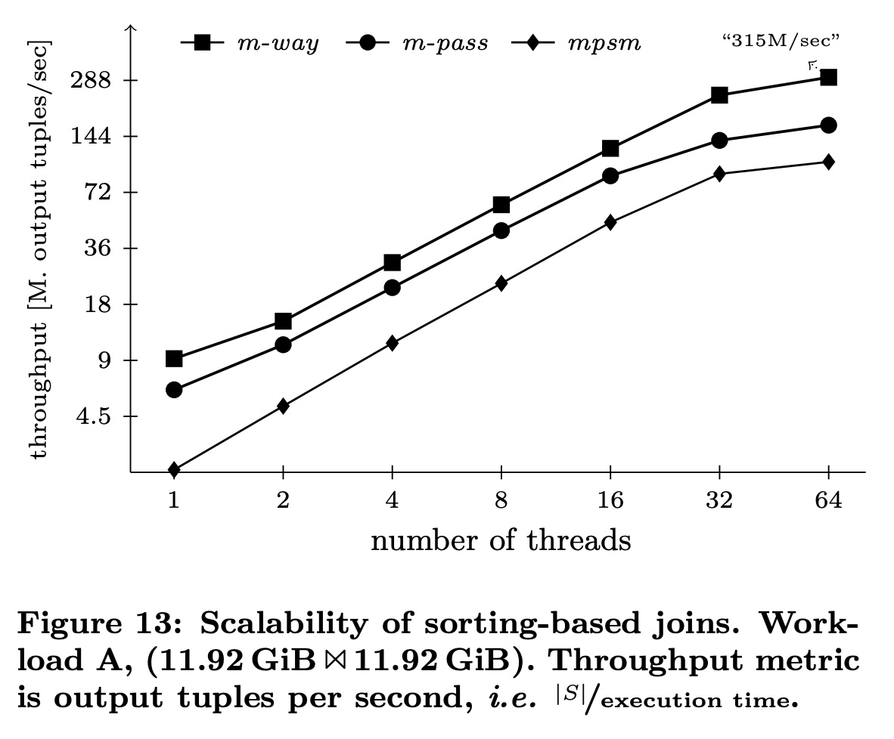  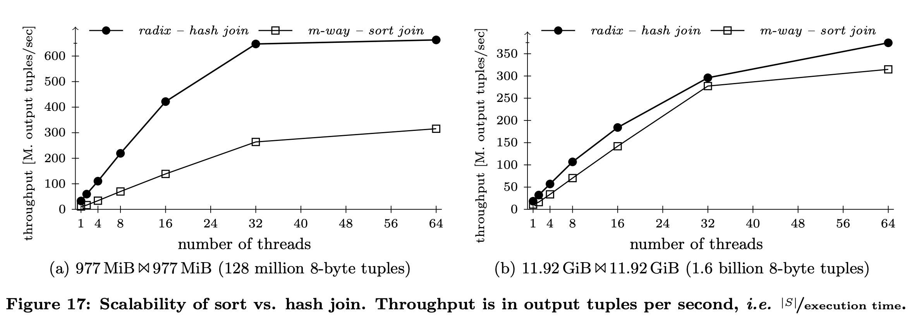  

#### 2.2. 存储层次结构与缓存 (Memory Hierarchy & Cache)

CPU的计算速度远快于从主内存（RAM）中读取数据的速度。为了缓解这个矛盾，CPU内部设置了多级高速缓存（L1, L2, L3 Cache）。

你可以用下面的图来理解这个结构：

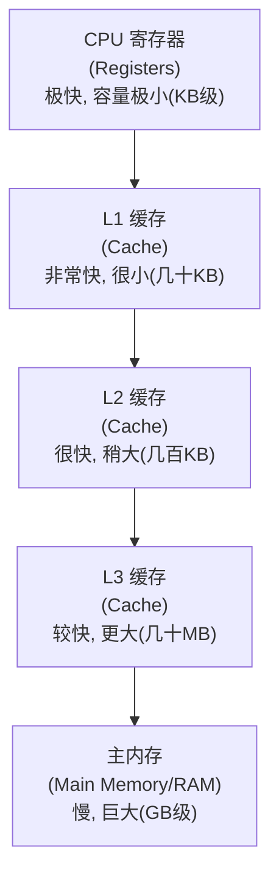

  * **核心思想**: 数据离CPU越近，访问速度越快，但容量越小。
  * **缓存命中 (Cache Hit)**: CPU需要的数据恰好在缓存中，速度很快。
  * **缓存未命中 (Cache Miss)**: 数据不在缓存中，必须去更慢的下一级存储（甚至主内存）去取，会造成巨大的性能损失。

> **论文关联**: “缓存意识 (Cache-conscious)”是论文中的高频词。
> * **对于哈希连接**: 如果构建的哈希表太大，无法装入CPU缓存（特别是L3缓存），那么探测阶段的每次内存访问都可能导致“缓存未命中”，性能会急剧下降 。因此，论文中的**基数分区 (Radix Partitioning)**  技术就是为了将大表切分成多个小块，确保每个小块的哈希表都能装进缓存里。
> * **对于排序合并连接**: 论文将排序过程也分成了三个阶段：(i) 寄存器内排序, (ii) 缓存内排序, (iii) 缓存外排序 ，目的就是最大化地利用缓存，减少对主内存的访问。

#### 2.3. SIMD (单指令多数据流)

SIMD (Single Instruction, Multiple Data) 是一种特殊的CPU指令，它允许一条指令同时对多个数据进行操作。

**打个比方**:

  * **普通指令 (SISD)**: 你想计算4组加法 `1+5`, `2+6`, `3+7`, `4+8`。你需要执行4次加法指令。
  * **SIMD指令**: 你可以将 `[1, 2, 3, 4]` 和 `[5, 6, 7, 8]` 这两组数据加载到特殊的SIMD寄存器中，然后用**一条**SIMD加法指令，一次性得到结果 `[6, 8, 10, 12]`。

论文中提到的 **AVX** (Advanced Vector Extensions) 就是Intel CPU支持的一种256位宽的SIMD指令集 ，它可以同时操作8个32位（4字节）的数据。

> **论文关联**: SIMD是提升排序合并连接性能的“秘密武器”。论文详细介绍了如何利用SIMD来实现高效的排序。
> * **排序网络 (Sorting Networks)**: 如论文中的 **Figure 1** 所示，一个排序网络由一系列“比较器”组成。这些比较器只需要`min`和`max`操作 ，而SIMD指令恰好可以并行地执行这些操作，从而实现对多组数据同时进行排序 。
> * **Bitonic合并网络**: 如论文中的 **Figure 2** 所示，这是用来合并两个已排序序列的特殊网络。它的结构同样非常规整，能够被高效地用SIMD指令实现 。

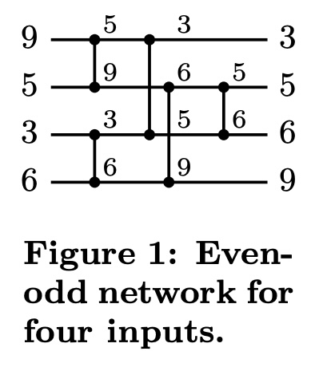  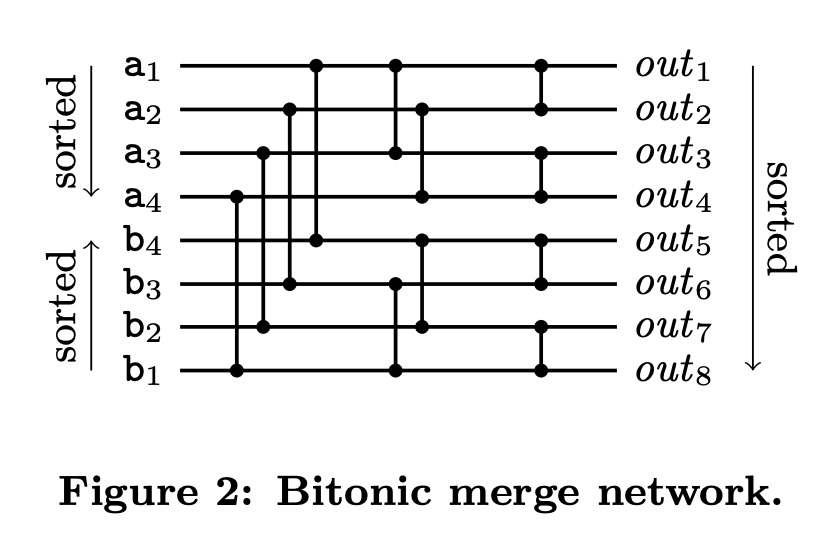  

Figure 1 and 2 from the paper, showing sorting and merging networks that are well-suited for SIMD implementation. 

#### 2.4. NUMA (非统一内存访问架构)

在拥有多个CPU芯片（Socket）的高端服务器上，每个芯片都有自己直连的“本地内存”，访问这些内存速度最快。但是，一个芯片也可以访问连接在其他芯片上的“远程内存”，只是速度会慢很多，因为需要跨芯片通信。这种内存访问速度不均匀的架构就是NUMA (Non-Uniform Memory Access)。

> **论文关联**: 为了在多芯片服务器上获得极致性能，算法必须是“NUMA感知 (NUMA-aware)”的 。
> * 论文中的`m-way`算法在设计时就充分考虑了NUMA 。从 **Figure 4** 可以看出，算法的初始阶段（如local sort）都严格限制在各个NUMA区域内部进行，只读取本地内存 。
> * 只有在必须交换数据的阶段（如图中的Phase 2），才进行跨NUMA区域的数据传输 ，并且通过**多路合并 (multi-way merging)**  等技术来尽可能地掩盖跨区域访问带来的延迟。

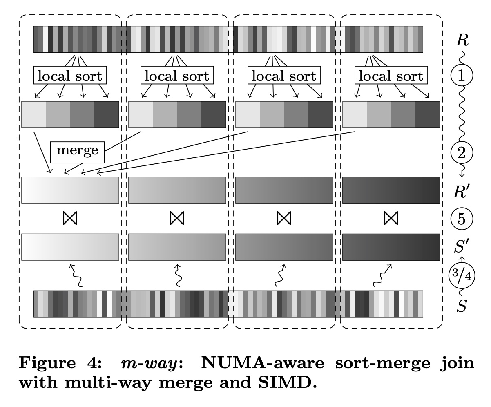  

Figure 4 from the paper, illustrating a NUMA-aware sort-merge join algorithm. 

### 总结

为了读懂这篇论文，你需要将上述知识点串联起来。论文的整体逻辑是：

1.  **提出问题**：在配备了多核、多级缓存、SIMD和NUMA架构的现代CPU上，经典的排序合并连接和哈希连接，哪个更快？
2.  **深度优化**：作者没有使用基础版的算法，而是将两种算法都用上了最前沿的硬件优化技术。
      * **排序合并连接**：利用SIMD指令集（AVX）加速排序和合并过程；设计NUMA感知的并行策略来减少跨芯片内存访问；通过多路合并来平衡计算和内存带宽。
      * **哈希连接**：利用基数分区来保证中间数据块足够小，可以完全放入CPU缓存；利用软件管理缓冲区（software-managed buffers）来减少TLB-miss（另一种硬件性能瓶颈）。
3.  **实验对比**：在真实的硬件平台上，对优化到极致的两种算法进行全方位的性能测试，最终得出“**在大多数情况下，深度优化的哈希连接仍然比深度优化的排序合并连接更快，只有在数据量极其巨大时，后者才开始显现竞争力**”的结论 。

掌握了以上这些背景知识，你就能更好地理解论文中各种技术选择背后的动机以及实验结果的深层含义。
  
## 2 解读论文 
  
好的，我们来一起深入解读这篇经典的数据库性能论文——《Multi-Core, Main-Memory Joins: Sort vs. Hash Revisited》。

这篇论文的核心在于探讨一个古老但历久弥新的问题：在现代多核CPU上，当数据完全加载于内存中时，数据库中最常见的“连接（Join）”操作，到底是 **排序合并（Sort-Merge）** 算法快，还是 **哈希（Hash）** 算法更快？

### 1\. 核心争论：一场发生在现代硬件上的“世纪对决”

传统上，哈希连接被认为是内存连接操作的王者 。但近年来，一些研究指出，随着现代CPU的SIMD（单指令多数据流）指令集越来越强大，排序合并连接有可能实现反超 。这篇论文就是为了终结这场争论，通过在真实的现代硬件上对两种算法的“极限优化版”进行一次终极对决。

### 2\. 参赛选手：被优化到极致的算法

论文中比较的不是基础版的算法，而是经过针对性优化的多个变种。

  * **排序合并阵营 (Sort-Merge Joins)**

      * `m-way`: 作者提出的最强版本，一个高度并行的排序合并连接算法。它经过精心设计，能够充分利用NUMA架构，并通过“多路合并”技术来平衡计算和内存带宽 。
      * `m-pass`: 另一个排序合并的变种，它采用多轮次的“两两合并”策略 。
      * `mpsm`: 对当时一个号称性能超群的“大规模并行排序合并连接”算法的复现 。

  * **哈希连接阵营 (Hash-Based Joins)**

      * `radix` (基数哈希连接): 这是哈希连接的“速度之王”。其核心思想是，在构建哈希表之前，先通过一次或多次 **分区（Partitioning）** 操作将大表切分成许多小块，确保每个小块都能完全放入CPU的缓存中，从而极大减少昂贵的内存访问 。
      * `n-part` (无分区哈希连接): 一个更简单的并行哈希连接算法，所有线程共同构建一个共享的大哈希表 。

### 3\. 比赛场地：必须了解的现代硬件特性

要理解这场对决，关键是要了解比赛场地——现代CPU的架构特性。

  * **多核与NUMA**：现代服务器有多个CPU芯片（Socket），每个芯片有多个核心。一个核心访问与自己芯片直连的“本地内存”很快，但访问连接在其他芯片上的“远程内存”就会慢很多。这就是NUMA（非统一内存访问架构）。优秀的算法必须是“NUMA感知”的，尽可能避免跨芯片的内存访问 。

      * 论文中的`m-way`算法就做了很好的示范（如下图Figure 4），它将计算任务分解，使得大部分排序工作（local sort）都在各个NUMA区域内独立完成，只在必要时才进行跨区域的数据合并（merge）。    

      Figure 4 from the paper, illustrating a NUMA-aware sort-merge join algorithm.   

  * **SIMD (单指令多数据流)**：这是排序合并连接阵营的“秘密武器” 。像AVX这样的指令集允许CPU用一条指令同时处理多个数据（比如，一次性比较8对数字的大小），极大地加速了排序和合并这种规整的计算任务 。

  * **多级缓存**：CPU访问缓存的速度比访问主内存快几个数量级。因此，算法设计的核心目标之一就是提高**缓存命中率**。哈希连接中的基数分区（Radix Partitioning）就是为了这个目的而生的 。

### 4\. 关键发现与最终赛果

经过在64线程高端服务器上的一系列严苛测试，论文得出了几个颠覆性的关键结论。

#### 发现一：哈希连接，王者依旧！

尽管排序合并连接在SIMD的加持下性能大幅提升，但在绝大多数场景下，**深度优化的基数哈希连接 (`radix`) 仍然明显更快** 。

从下图（Figure 14）可以看出，无论是处理几亿条还是几十亿条数据，`radix`（图中的`rdx`）完成每个元组连接所需的CPU周期数（纵坐标，越低越好）都显著低于`m-way` 。在处理中等规模数据时，`radix`甚至能比`m-way`快2倍以上 。

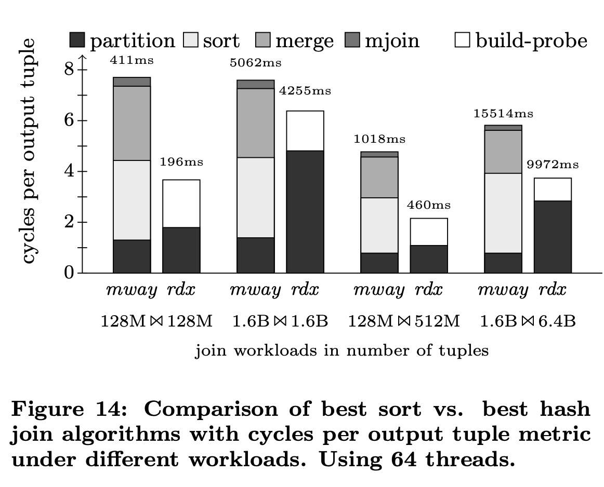  

Figure 14 from the paper, comparing the performance of the best sort-merge join (mway) and the best hash join (rdx) across different workloads. 

#### 发现二：排序的最佳姿势，竟然是“先分区”

这是论文一个非常深刻的洞见。传统上认为，“分区”是哈希连接的专属操作。但作者通过实验证明，对于排序任务，传统的“先排序小块，再多路合并”（Sort-then-Merge）的性能，远不如 **“先用类似哈希分区的技术把数据按范围分区，再在各个分区内独立排序”（Partition-then-Sort）** 。

原因在于，分区操作可以非常高效地利用全部的内存带宽，而多路合并操作随着数据量的增大，会因为缓存失效和计算开销而变得越来越慢 。从下图（Figure 7）可以看到，随着输入数据规模的增加（横坐标），`Sort-Then-Merge` 的性能急剧下降，而 `Partition-Then-Sort` 则保持了非常稳定的高吞吐率 。

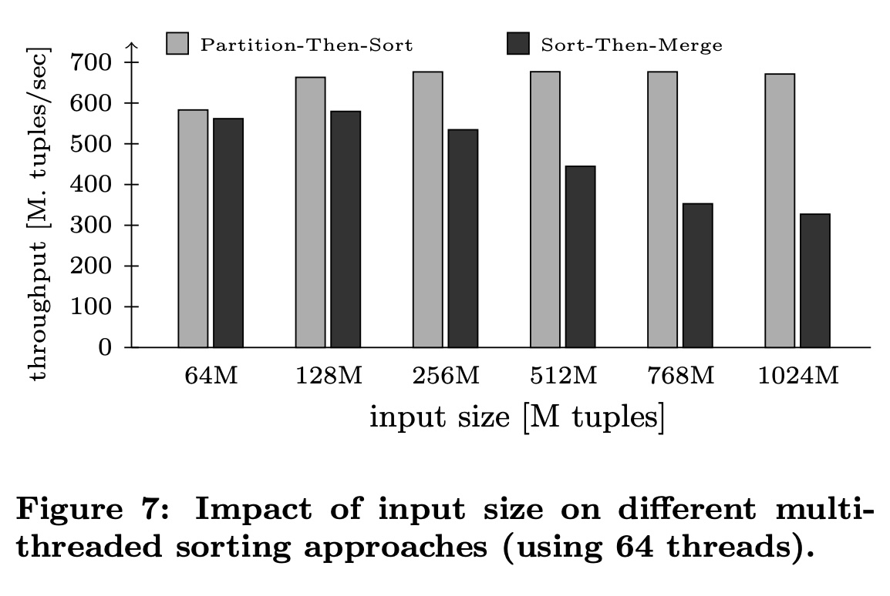  

Figure 7 from the paper, showing that the 'Partition-then-Sort' approach is significantly more performant and scalable than the traditional 'Sort-then-Merge' approach for large datasets.

#### 发现三：数据规模是最终的平衡手

那么排序合并连接就永无翻身之日了吗？也不是。论文指出，当**输入的数据规模变得极其巨大时**（例如，两个表都是10亿条记录以上，总数据量达到几十GB），排序合并连接的性能开始追上甚至逼近哈希连接 。

如下图（Figure 15）所示，随着数据量的持续增长（横坐标），`radix – hash join` 的性能曲线开始下降（因为需要更多轮次的分区），而 `m-way – sort join` 则表现出更强的稳定性。在这个量级上，考虑到排序合并连接还能产生一个**有序的输出结果**（这对后续的查询处理可能很有用），它就成了一个非常有竞争力的选择 。

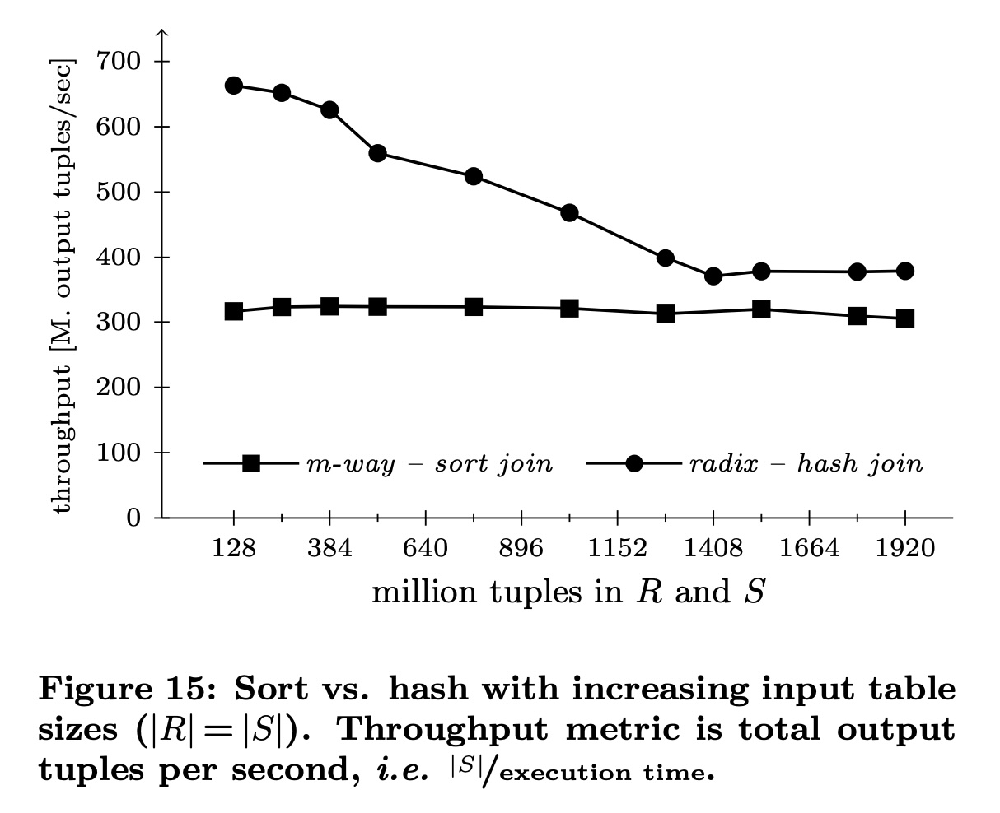  

Figure 15 from the paper, illustrating that as input table sizes become very large, the performance of sort-merge join approaches that of radix-hash join. 

### 总结

这篇论文通过极其详尽和严谨的实验，为“排序 vs. 哈希”之争给出了一个清晰的答案：

1.  **在当前主流的多核硬件上，对于绝大多数内存连接场景，优化到极致的基数哈希连接（Radix-Hash Join）仍然是性能之王** 。
2.  **排序合并连接（Sort-Merge Join）并非没有机会**。随着SIMD等硬件的进步，它的性能已大幅提升，并且在处理超大规模数据集时，它能成为一个极具吸引力的替代方案，特别是当查询需要有序结果时 。
3.  **论文最大的贡献之一是揭示了“分区”这一操作的普适价值**。它不仅是最高效哈希连接的核心，也是最高效排序算法的核心，这展示了算法设计与现代硬件架构深度结合的重要性。

总而言之，这篇论文不仅给出了“谁更快”的答案，更重要的是，它展示了**如何**在现代硬件上榨干每一滴性能，为数据库内核开发者提供了宝贵的实践指南。
  
## 3 术语 
  
好的，这篇论文《Multi-Core, Main-Memory Joins: Sort vs. Hash Revisited》中包含了许多关于数据库算法和现代计算机体系结构的关键术语。下面我将用通俗易懂的中文为您逐一讲解，并引用论文中的图表来帮助理解。

### 一、核心连接算法 (Join Algorithms)

数据库中的“连接（Join）”操作是将两个或多个表根据共同的字段关联起来。这篇论文的核心就是比较以下两种主流的连接算法在现代硬件上的表现。

#### 1\. 排序合并连接 (Sort-Merge Join)

这是一种思路非常直观的算法，分为两步：

  * **排序 (Sort)**: 将需要连接的两个表（论文中称为R和S）分别按照连接键（例如：用户ID）进行排序 。
  * **合并 (Merge)**: 使用两个指针同时从头到尾扫描两个已经排好序的表，像拉拉链一样找出匹配的记录 。

论文中实现了多个优化版本，其中最强的是 **m-way** 。

#### 2\. 哈希连接 (Hash Join)

这种算法通常更快，也分为两步：

  * **构建 (Build)**: 选择两个表中较小的一个，在内存中为它创建一个**哈希表**（可以理解为一个查询极快的索引） 。
  * **探测 (Probe)**: 遍历另一个较大的表，用每一条记录的连接键去哈希表中查找匹配项 。

论文中性能最好的是 **radix（基数哈希连接）** ，它在构建哈希表前会先进行分区。

### 二、关键硬件与体系结构 (Hardware & Architecture)

理解这些术语是看懂这篇论文为何如此强调“硬件感知（Hardware-Conscious）”的关键。

#### 1\. SIMD (单指令，多数据流)

SIMD是一种特殊的CPU指令，允许用一条指令同时对多个数据执行相同的操作，极大地提升了并行计算能力 。论文中使用的 **AVX** 就是一种256位的SIMD指令集 ，可以一次性处理8个4字节的数据。

  * **应用场景**：SIMD特别适合加速排序算法中的批量比较和交换操作 。论文中的**排序网络 (Sorting Networks)** 和 **Bitonic合并网络 (Bitonic Merge Networks)** 就是为SIMD量身定制的算法结构 。如下图（Figure 1 & 2）所示，这些网络结构规整，可以被高效地转换为SIMD的`min/max`等指令 。

  

  

Figure 1 and 2 from the paper, showing sorting and merging networks that are well-suited for SIMD implementation.

#### 2\. NUMA (非统一内存访问架构)

在拥有多个CPU芯片（Socket）的高端服务器上，每个CPU访问与自己直连的“本地内存”速度快，而访问连接在其他CPU上的“远程内存”速度慢 。这种内存访问速度不均匀的架构就是NUMA。

  * **算法设计要求**：为了达到极致性能，算法必须是“NUMA感知”的，尽量在本地内存中完成计算，减少跨CPU的数据传输 。论文中的`m-way`算法就做了深度优化，如下图（Figure 4）所示，它将数据分区到各个NUMA区域，大部分排序工作（local sort）都在本地完成，只在最后的合并阶段（merge）才进行必要的跨区数据交换 。

  

Figure 4 from the paper, illustrating a NUMA-aware sort-merge join algorithm. 

#### 3\. CPU缓存与存储层次 (CPU Cache & Memory Hierarchy)

CPU的计算速度远超主内存（RAM）的读写速度，因此在CPU和主内存之间设置了多级高速缓存（L1, L2, L3）来缓解瓶颈。

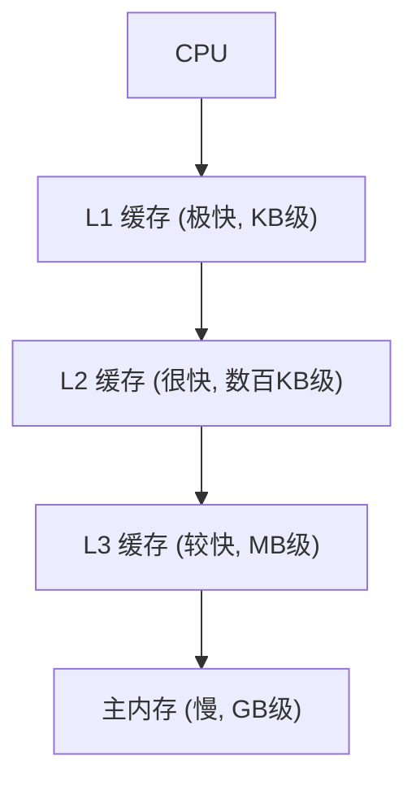

  * **缓存意识 (Cache-Conscious)**：算法的性能很大程度上取决于能否让数据尽可能地停留在靠近CPU的缓存中 。如果频繁地从主内存读取数据（称为“缓存未命中” Cache Miss），性能会急剧下降 。

#### 4\. TLB (转译后备缓冲区)

TLB是CPU内部一个用于加速虚拟地址到物理地址转换的缓存。如果一个算法需要同时访问大量离散的内存页，超出了TLB的容量，就会导致频繁的“TLB未命中”，严重影响性能 。

### 三、核心优化技术 (Core Techniques & Optimizations)

#### 1\. 基数分区 (Radix Partitioning)

这是哈希连接（`radix`算法）的核心优化。它通过一个或多个轮次，将大表根据连接键的哈希值切分成许多小的数据块（分区） 。

  * **目的**：确保每个分区足够小，可以完全放入CPU缓存中 。这样，后续为每个小分区构建和探测哈希表时，就能实现极高的缓存命中率，避免性能瓶颈 。

#### 2\. 软件管理缓冲区 (Software-Managed Buffers)

这是对基数分区过程的进一步优化。在将数据写入目标分区前，先在CPU缓存中为每个分区设置一个小的临时缓冲区 。数据先写入这个缓冲区，等缓冲区满了之后，再整块地拷贝到主内存的目标分区位置 。

  * **目的**：极大地减少了对TLB的压力。因为CPU在大部分时间内只需要访问存放这些缓冲区的少数几个内存页，从而避免了因分区数量过多导致的TLB未命中问题 。如下图（Figure 6）所示，使用了该技术后（`sw managed buf`），即使分区数量（fan-out）很大，性能也几乎不受影响 。

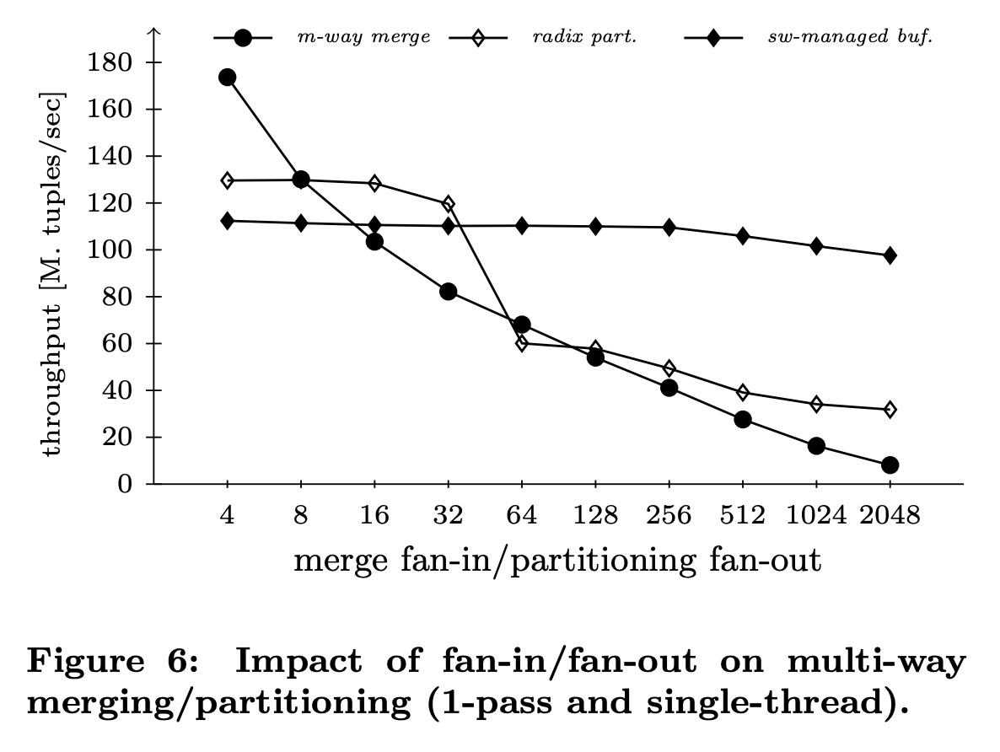  

Figure 6 from the paper, showing the robust performance of partitioning with software-managed buffers compared to naive radix partitioning. 

#### 3\. 多路合并 (Multi-way Merging)

传统的合并操作一次只合并两个已排序的序列。而多路合并则可以一次性合并多个（例如8个或更多）已排序的序列 。

  * **目的**：减少对内存的读写次数，节省宝贵的内存带宽 。当算法受限于内存带宽时（例如在多线程并行场景下），这项技术尤为重要 。

#### 4\. 先分区后排序 (Partition-then-Sort)

这是论文针对排序算法提出的一个关键优化。传统的并行排序是“先排序小块，再合并”（Sort-then-Merge），但论文发现这种方法在数据量大时效率低下 。

  * **新策略**：借鉴哈希分区的思想，先对数据进行范围分区，然后让每个线程独立地对自己负责的分区进行排序 。如下图（Figure 7）所示，这种`Partition-then-Sort`策略的性能随着数据量的增加依然保持稳定，远胜于传统的`Sort-then-Merge` 。

  

Figure 7 from the paper, showing that the 'Partition-then-Sort' approach is significantly more performant and scalable than the traditional 'Sort-then-Merge' approach for large datasets. 

掌握了以上这些术语，您就能更好地理解这篇论文中各种算法设计的精妙之处，以及它们是如何在现代复杂的硬件环境下进行性能博弈的。
  
## 参考        
         
https://www.vldb.org/pvldb/vol7/p85-balkesen.pdf    
        
<b> 以上内容基于DeepSeek、Qwen、Gemini及诸多AI生成, 轻微人工调整, 感谢杭州深度求索人工智能、阿里云、Google等公司. </b>        
        
<b> AI 生成的内容请自行辨别正确性, 当然也多了些许踩坑的乐趣, 毕竟冒险是每个男人的天性.  </b>        
  
    
#### [期望 PostgreSQL|开源PolarDB 增加什么功能?](https://github.com/digoal/blog/issues/76 "269ac3d1c492e938c0191101c7238216")
  
  
#### [PolarDB 开源数据库](https://openpolardb.com/home "57258f76c37864c6e6d23383d05714ea")
  
  
#### [PolarDB 学习图谱](https://www.aliyun.com/database/openpolardb/activity "8642f60e04ed0c814bf9cb9677976bd4")
  
  
#### [PostgreSQL 解决方案集合](../201706/20170601_02.md "40cff096e9ed7122c512b35d8561d9c8")
  
  
#### [德哥 / digoal's Github - 公益是一辈子的事.](https://github.com/digoal/blog/blob/master/README.md "22709685feb7cab07d30f30387f0a9ae")
  
  
#### [About 德哥](https://github.com/digoal/blog/blob/master/me/readme.md "a37735981e7704886ffd590565582dd0")
  
  

  
