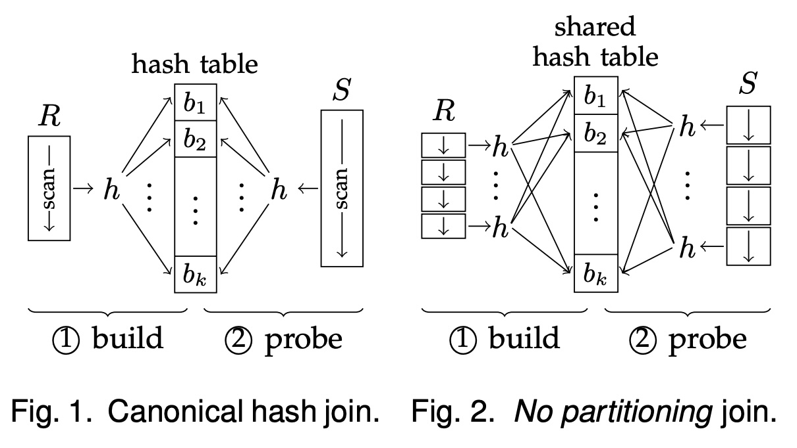
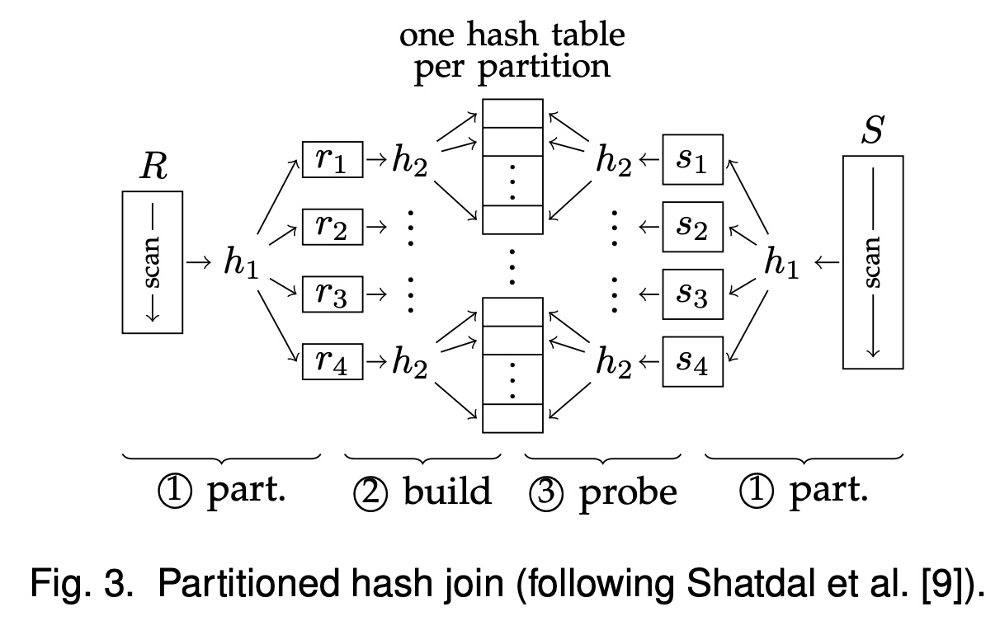
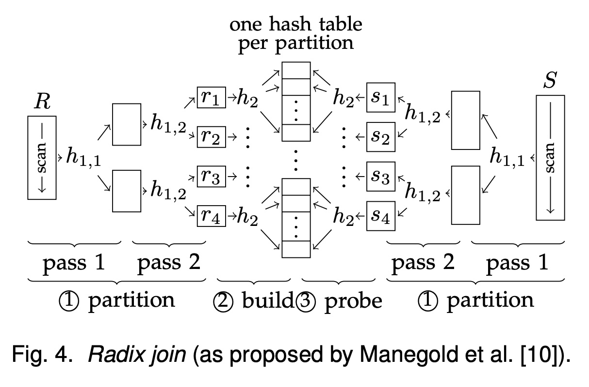
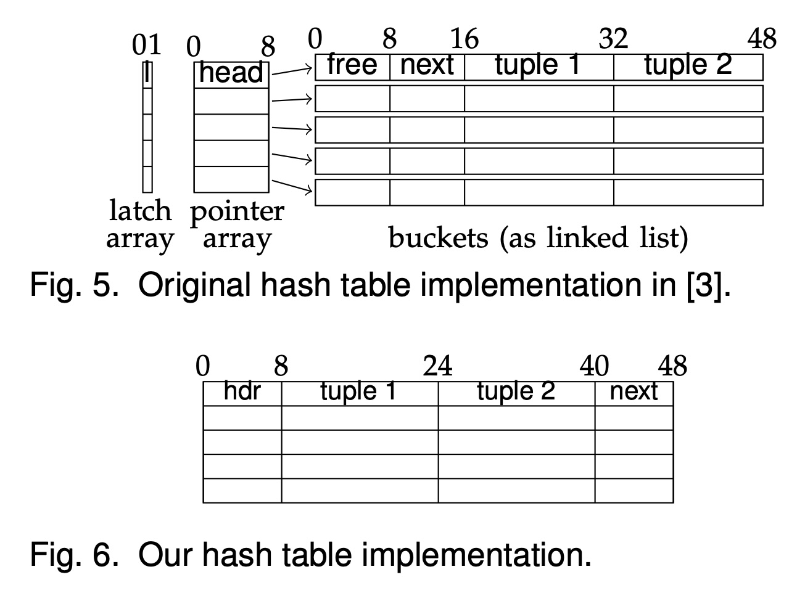
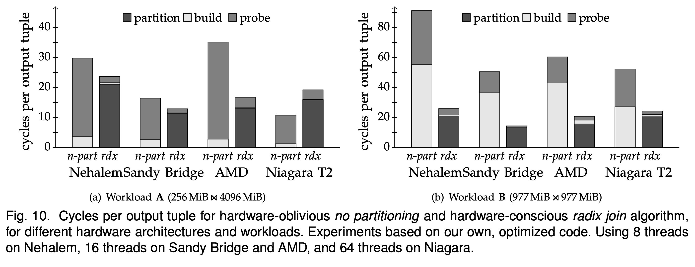

## AI论文解读 | Main-Memory Hash Joins On Modern Processor Architectures
        
### 作者        
digoal        
        
### 日期        
2025-10-17        
        
### 标签        
PostgreSQL , PolarDB , DuckDB , AI , 论文解读        
        
----        
        
## 背景  
      
https://cs.uwaterloo.ca/~tozsu/publications/other/hash-joins-tkde-final.pdf        
  
提示:          
```          
读懂《Main-Memory Hash Joins On Modern Processor Architectures》这篇论文需要提前掌握哪些基础知识, 请使用中文通熟易懂的讲解这些基础知识, 可以引用论文中的图、表或使用Markdown支持的图形(text,mermaid等)增加解释性. 
  
使用中文通熟易懂的解读《Main-Memory Hash Joins On Modern Processor Architectures》这篇论文, 其中的关键内容请着重讲解, 可以引用论文中的图、表或使用Markdown支持的图形(text,mermaid等)增加解释性. 
  
提取《Main-Memory Hash Joins On Modern Processor Architectures》这篇论文中的重要术语, 使用中文对这些术语进行通熟易懂的讲解, 可以引用论文中的图、表或使用Markdown支持的图形(text,mermaid等)增加解释性. 
```     
  
## 1 前置知识 
  
好的，为了完全理解《Main-Memory Hash Joins On Modern Processor Architectures》这篇论文，你需要掌握一些数据库、算法和计算机体系结构的基础知识。下面我将用通俗易懂的中文为你讲解这些概念，并引用论文中的图表来帮助理解。

### 核心脉络

这篇论文探讨的核心问题是：在现代多核CPU上，实现内存哈希连接（Hash Join）算法时，我们应该选择哪种设计哲学？

1.  **硬件无关 (Hardware-Oblivious)**：设计一种通用算法，不针对特定硬件进行优化。这种方法的信念是，现代CPU已经足够智能（例如通过自动预取、多线程技术），可以自己隐藏大部分硬件延迟，从而让简单的算法也能跑得很快。
2.  **硬件感知 (Hardware-Conscious)**：设计一种精细的算法，其参数和逻辑都根据CPU的特性（如缓存大小、TLB条目数）进行调整。这种方法的信念是，只有“因地制宜”，才能将硬件性能压榨到极致。

论文通过对这两种哲学的代表性算法进行实现、优化和在多种硬件平台上的对比，最终得出了结论。

-----

### 必备基础知识

#### 1\. 数据库基础 - 什么是“连接” (Join) 操作?

这是最基础的概念。在关系型数据库中，数据存储在不同的表中。**Join 操作** 的目的就是根据某些共同的键（Key），将两个或多个表中的行组合起来。

**举个例子**：假设我们有两张表，`学生表` 和 `成绩表`。

| 学生ID | 姓名 |
| :--- | :--- |
| 1 | 张三 |
| 2 | 李四 |

| 学生ID | 课程 | 成绩 |
| :--- | :--- | :-- |
| 1 | 数学 | 95 |
| 2 | 数学 | 88 |
| 1 | 英语 | 92 |

我们想知道每个学生的各科成绩，就需要通过 `学生ID` 这个共同的键将它们连接起来。

```sql
SELECT 姓名, 课程, 成绩
FROM 学生表
INNER JOIN 成绩表 ON 学生表.学生ID = 成绩表.学生ID;
```

Join 是数据库查询中非常常见且极其消耗性能的操作，因此优化 Join 算法至关重要。

#### 2\. 核心算法 - 哈希连接 (Hash Join) 的原理

哈希连接是一种非常高效的实现等值连接（即 `ON table1.key = table2.key`）的算法。论文中提到的所有算法都是它的变体。其经典实现分为两个阶段，正如论文中的 **Figure 1** 所示。

  

> **图解** ：
>
>   * **关系 R 和 S**：代表要连接的两张表。通常，R 是较小的那张表。
>   * **① 构建阶段 (Build Phase)**：
>     1.  选择较小的表 R。
>     2.  遍历 R 中的每一行（论文中称为元组 Tuple）。
>     3.  使用一个哈希函数 `h` 计算连接键的哈希值。
>     4.  将这一行数据存入哈希表（Hash Table）中。哈希表的桶（bucket）由哈希值决定。
>   * **② 探测阶段 (Probe Phase)**：
>     1.  遍历较大的表 S 中的每一行。
>     2.  使用**相同的哈希函数 `h`** 计算连接键的哈希值。
>     3.  用这个哈希值去哈希表中查找对应的桶。
>     4.  如果桶中存在连接键相同的行，那么就找到了匹配项，输出连接结果。

**优点**：它的预期时间复杂度是 $O(|R| + |S|)$ ，意味着它只需要分别完整地遍历两个表一次，速度非常快。

#### 3\. 关键背景 - 现代CPU的体系结构

这是理解这篇论文**最关键的部分**，因为论文的全部核心都在于讨论算法如何与现代硬件交互。

##### a. CPU缓存 (Cache)

CPU的运行速度远快于内存（RAM）。为了弥补这个速度鸿沟，CPU内部设置了多级高速缓存（通常是 L1, L2, L3 Cache）。

  * **工作原理**：CPU 读取数据时，会先看 L1 Cache 有没有，没有再看 L2，还没有再看 L3，最后才去访问内存。数据以“缓存行”（Cache Line，通常是64字节）为单位在内存和 Cache 之间传输。
  * **缓存命中 (Cache Hit)**：要的数据在 Cache 里，速度飞快。
  * **缓存未命中 (Cache Miss)**：数据不在 Cache 里，必须去访问慢速的内存，导致CPU空等，性能急剧下降。

**与论文的关系**：经典的哈希连接在探测阶段会随机访问哈希表，如果哈希表非常大（大于CPU缓存），那么几乎每次访问都会导致 **Cache Miss** 。这是“硬件感知”派算法要解决的首要问题。

##### b. TLB (Translation Lookaside Buffer, 转译后备缓冲器)

现代操作系统使用虚拟内存，程序访问的是虚拟地址，需要由CPU的内存管理单元（MMU）将其翻译成物理地址，才能真正访问内存。这个映射关系存储在“页表”（Page Table）中，而页表本身在内存里。

  * **问题**：每次访问内存都先要去内存里查页表，等于访问一次内存变成了两次，性能会减半。
  * **TLB 的作用**：TLB 是 MMU 内部的一块**高速缓存**，专门用来缓存近期使用过的“虚拟地址 -\> 物理地址”的映射关系。
  * **TLB Miss**：如果要访问的虚拟地址的映射关系不在 TLB 中，就需要去内存中查询页表，这个过程同样会带来显著的性能开销 。

**与论文的关系**：当一个算法（特别是分区算法）需要同时访问大量离散的内存区域（每个区域都在不同的内存页上）时，TLB 很容易被撑爆，导致大量的 **TLB Miss** 。这是“硬件感知”派算法要解决的另一个核心问题。

##### c. SMT (Simultaneous Multi-threading, 同步多线程)

SMT，也就是英特尔所称的“超线程”（Hyper-threading），允许一个物理CPU核心（Physical Core）同时执行多个线程（硬件线程/逻辑核心）。

  * **工作原理**：当一个线程因为某些原因（比如等待内存数据，即 Cache Miss）而停顿时，物理核心的计算单元并不会闲着，而是会立即切换去执行另一个线程的指令 。
  * **作用**：通过“填补”等待时间，提高单个物理核心的资源利用率 。

**与论文的关系**：“硬件无关”派的一个核心论点就是，我们不需要通过复杂的分区算法来避免 Cache Miss，因为 SMT 技术可以很好地“隐藏”这些等待延迟 。当一个线程在等内存时，CPU会自动调度同一核心上的另一个线程来工作。

-----

### 4\. 论文的核心对决：两种主流的哈希连接实现

现在，结合上面的基础知识，我们来看看论文对比的两种算法。

#### 4.1 硬件无关 (Hardware-Oblivious) 方法: **No Partitioning Join**

这种方法是经典哈希连接的一个直接的并行化版本，如论文 **Figure 2** 所示。

  

> **图解** ：
> 1.  所有工作线程（threads）共享一个**全局的、巨大的哈希表** 。
> 2.  在构建阶段，所有线程并发地往这个共享哈希表中插入数据。因为是并发写入，所以需要使用锁（Latch）来保证线程安全 。
> 3\.  在探测阶段，所有线程并发地从这个共享哈希表中读取数据进行匹配。

  * **哲学**：简单粗暴。相信现代CPU的SMT技术能隐藏随机内存访问带来的 Cache Miss 延迟 。
  * **优点**：算法简单，不需要根据硬件进行参数调优 。
  * **缺点**：巨大的哈希表会导致严重的 Cache Miss 和 TLB Miss 问题；多线程并发写入共享哈希表可能引起锁竞争。

#### 4.2 硬件感知 (Hardware-Conscious) 方法: **Radix Join**

这种方法的核心思想是“分而治之”（Divide and Conquer），通过 **分区（Partitioning）** 来解决 Cache 和 TLB 的问题。

##### 第一步：分区哈希连接 (Partitioned Hash Join) - 解决 Cache Miss

如论文 **Figure 3** 所示，它在经典的 Build 和 Probe 之前增加了一个 **Partition** 阶段。

  

> **图解** ：
>
> 1.  **① 分区 (part.)**：使用一个哈希函数 `h1` 将 R 表和 S 表分别划分成许多个小分区（`r1, r2...` 和 `s1, s2...`）。`h1` 保证了 `ri` 中的数据只会与 `si` 中的数据匹配。
> 2.  **② 构建 (build)** & **③ 探测 (probe)**：对每一对分区（如 `r1` 和 `s1`）执行一次经典的哈希连接。

**核心思想**：通过分区，使得每个小分区 `ri` 构建的哈希表足够小，可以**完全放入CPU缓存** 。这样，在探测对应的 `si` 分区时，几乎所有的访问都是 Cache Hit，从而极大提升性能。

##### 第二步：基数分区 (Radix Partitioning) - 解决 TLB Miss

上面的分区方法虽然解决了 Cache Miss，但如果一次性分区的数量太多（比如几百上千个），每个分区都需要一个独立的内存缓冲区，会导致同时操作的内存页过多，从而**打爆 TLB** 。

**Radix Join** 通过多轮（multi-pass）分区来解决这个问题，如论文 **Figure 4** 所示。

  

> **图解** ：
>
> 1.  **第一轮分区 (pass 1)**：使用哈希键的**前几位**（比如前4位），将数据分成 $2^4=16$ 个较大的中间分区。因为分区数量少，不会导致 TLB Miss。
> 2.  **第二轮分区 (pass 2)**：再对每个中间分区，使用哈希键的**后几位**（比如后4位），进一步细分成更小的分区。
> 3.  经过多轮分区，最终得到足够小、可以放进 Cache 的分区，同时每一轮操作的分区扇出（fan-out）都控制在 TLB 的承受范围内。

  * **哲学**：精耕细作。算法的每一步都精心设计，以适应CPU缓存和TLB的限制。
  * **优点**：缓存和TLB效率极高，通常性能更好且更稳定。
  * **缺点**：算法复杂，需要根据硬件参数（如Cache大小、TLB条目数）进行调优，且分区阶段本身也有开销。

### 总结

掌握了以上这些基础知识后，你就可以轻松理解这篇论文的脉络了。论文的后续内容无非是在这个框架下，进行更深入的实验和分析：

  * 对两种算法进行代码层面的优化（例如优化哈希表结构、内存对齐等）。
  * 在不同的CPU架构（Intel, AMD, Sun SPARC）和不同的工作负载（Workload）下对比它们的性能。
  * 分析 SMT、VM Page Size 等因素对两种算法性能的影响。
  * 最终回答在什么情况下“硬件无关”的方法有优势，而在什么情况下“硬件感知”的方法是必须的。

希望这份讲解对你理解这篇经典的论文有帮助！
  
## 2 解读论文 
  
好的，这篇《Main-Memory Hash Joins On Modern Processor Architectures》是数据库领域一篇非常经典的论文。它深入探讨了在现代多核CPU上，如何高效地执行内存哈希连接（Hash Join）这一核心操作。

简单来说，论文的核心是在两条技术路线之间进行了一场“巅峰对决”：

1.  **硬件无关 (Hardware-Oblivious)**：设计一种“通用”算法，不依赖特定CPU的参数（如缓存大小）。这种方法的拥护者认为，现代CPU已经足够智能，可以通过乱序执行、硬件预取和同步多线程（SMT）等技术自动隐藏内存访问的延迟，因此简单的算法就能表现得很好 。
2.  **硬件感知 (Hardware-Conscious)**：设计一种“量身定制”的算法，根据CPU的缓存大小、TLB（转译后备缓冲器）条目数等参数进行精细调整 。这种方法的拥护者认为，只有充分利用硬件特性，才能压榨出极致性能 。

这篇论文通过严谨的实验和优化，最终给出了一个清晰但又辩证的结论。下面我们来深入解读其中的关键内容。

### 两大核心算法的对决

#### 1\. 硬件无关的代表：No Partitioning Join (不分区连接)

这是最直接的并行哈希连接实现，其工作方式如论文中的 **Figure 2** 所示：

  

> **工作流程**:
> 1.  **构建 (Build)**: 所有CPU核心（线程）并发地向一个**全局共享的哈希表**中插入数据（来自小表 R） 。
> 2.  **探测 (Probe)**: 所有线程再并发地用大表 S 的数据去探测这个共享哈希表，寻找匹配项 。

  * **设计哲学**：简单、直接 。它完全不关心数据是否能装进CPU缓存，而是寄希望于CPU的SMT（同步多线程，如Intel的超线程）技术来“隐藏”因随机访问巨大哈希表而导致的内存延迟（Cache Miss） 。
  * **论文的优化**：作者发现，之前研究中使用的 `no partitioning` 代码实现效率低下 。原因是其哈希表结构不合理（如下图左），一次插入可能需要三次独立的内存访问（访问锁、指针、数据桶），导致大量缓存未命中 。作者通过将锁和数据紧凑地存放在一起（如下图右），大大优化了缓存效率，**将性能提升了约3倍** 。

| 原始实现 (Figure 5) | 作者的优化实现 (Figure 6) |
| :--- | :--- |
| 锁、指针、数据分离，访问效率低 。 | 锁和数据在结构上相邻，提高缓存局部性 。 |

  

#### 2\. 硬件感知的代表：Radix Join (基数连接)

这是一种精心设计的、分阶段的算法，旨在完美适配现代CPU的内存层次结构 。其核心思想是“分而治之”。

**第一步：分区 (Partitioning) - 解决缓存未命中 (Cache Miss)**

Radix Join 做的第一件事，就是将大表拆分成一个个可以**完全放入CPU缓存**的小数据块（分区）。

> **流程**:
> \* **① 分区(part.)**: 使用哈希函数 `h1` 将 R 表和 S 表都切分成 N 个分区 。`h1` 保证了 `ri` 分区的数据只会与 `si` 分区的数据匹配 。
> \* **② 构建(build) & ③ 探测(probe)**: 每次只处理一对分区（如 `r1` 和 `s1`）。为 `r1` 构建一个小型哈希表，这个哈希表小到可以装进L1/L2缓存 。然后用 `s1` 进行探测，此时几乎所有的内存访问都会在高速缓存中命中，速度极快。

**第二步：多轮基数分区 (Radix) - 解决TLB未命中 (TLB Miss)**

如果一次性分区的数量太多（比如上千个），每个分区都需要一个独立的内存页，这会超出CPU中TLB（用于缓存内存地址映射）的容量，导致大量的TLB Miss，性能同样会下降 。

Radix Join 通过多轮分区来解决这个问题，如 **Figure 4** 所示：

  

> **流程**:
> \* **第一轮 (pass 1)**: 使用哈希值的前几位，将数据粗略地分成少量（如16个）大分区。这个数量远小于TLB的容量 。
> \* **第二轮 (pass 2)**: 对每个大分区，再使用哈希值的后几位进行二次细分 。
>
>   * 通过这种方式，既能保证最终分区足够小以适应缓存，又能确保每一轮操作都不会超出TLB的限制。

  * **设计哲学**：精耕细作，步步为营 。算法的每一步都与硬件特性紧密耦合，需要知道缓存大小和TLB条目数等参数 。
  * **论文的优化**：作者同样发现，之前的Radix Join实现存在性能问题。主要原因是在分区后，它会先为**所有**分区建立哈希表，然后再对**所有**分区进行探测 。这导致在探测一个分区时，其对应的哈希表早已被从CPU缓存中逐出 。作者通过**对每个分区立刻执行构建和探测**的策略，确保了哈希表能一直保留在缓存中，从而获得了巨大的性能提升 。

### 关键实验结论：硬件感知还是无关？

论文通过在多种CPU架构（Intel, AMD, SPARC）和不同工作负载下的对比，得出了以下关键结论：

#### 1\. 大多数情况下，硬件感知 (Radix Join) 完胜

如下图 **Figure 10** 所示，无论是在Intel、AMD还是Niagara T2平台上，当处理两个大小相似的表时（Workload B），Radix Join（图中 `rdx`）的性能都远超 No Partitioning（图中 `n-part`），快了约2.5到3.5倍 。

  

原因在于，当构建表（R）的规模变大时，No Partitioning 算法的构建成本（Build Cost）会因为大量的缓存未命中而急剧上升 。而 Radix Join 由于其优秀的缓存效率，性能几乎不受表大小变化的影响，表现得非常稳定 。

#### 2\. 特殊场景下，硬件无关 (No Partitioning) 具有竞争力

论文发现，在拥有 **激进SMT（Aggressive SMT）** 的架构上，硬件无关算法的表现会非常好 。典型代表就是 Sun/Oracle 的 SPARC T4 处理器，它一个物理核心可以同时运行8个硬件线程 。

> 如上图所示，在SPARC T4上，当每个核心只跑一个线程时（`n-part-T4 (1-thr/core)`），No Partitioning 性能很差。但当每个核心跑满8个线程时（`n-part-T4 (8-thr/core)`），性能提升了超过4倍，变得与Radix Join极具竞争力 。这是因为海量的硬件线程成功地“隐藏”了内存访问延迟 。

然而，在主流的x86服务器上（如Intel的2路超线程），这种SMT带来的好处对于优化过的代码来说微乎其微 。

#### 3\. 优化技术可以模糊两种方法的界限

论文还探索了如何为两种算法引入对方的优点：

  * **让“硬件无关”变得“感知”** ：通过使用 **缓存行对齐 (Cache Alignment)** 和 **软件预取 (Software Prefetching)** 等技术，可以将 No Partitioning 算法的性能提升约40% 。但这实际上也放弃了其纯粹“硬件无关”的特性，因为需要知道缓存行大小等参数 。
  * **让“硬件感知”变得更强、更鲁棒**：通过使用**软件管理的缓冲区 (Software-Managed Buffers)**，可以在分区时显著减少TLB压力，允许单轮创建更多的分区，从而提升性能并降低对参数设置的敏感度 。

### 最终结论

这篇论文最终得出结论：

> 在当前（论文发表时）和主流的多核架构上，**硬件感知的方法（如Radix Join）在性能和稳定性上通常都优于硬件无关的方法** 。为了追求极致性能，仔细地将算法与底层硬件相匹配仍然是至关重要的 。

然而，论文也极具前瞻性地指出，**未来的处理器发展趋势可能会改变这一结论** 。如果处理器架构朝着像 SPARC T4 那样拥有更强劲的片上多线程能力的方向发展，那么简单、通用的硬件无关算法可能会变得越来越有吸引力 。
  
## 3 术语 
  
好的，这篇论文《Main-Memory Hash Joins On Modern Processor Architectures》包含了一些数据库和计算机体系结构领域的关键术语。下面我将用通俗易懂的中文对它们进行讲解，并引用论文中的图表来帮助理解。

### 核心算法与设计哲学

#### 1\. 硬件无关 (Hardware-Oblivious)

  * **讲解**：这是一种算法设计哲学，指的是在设计算法时不考虑特定硬件的参数（如CPU缓存大小、TLB条目数） 。它相信现代硬件足够智能，能够通过自动预取、同步多线程（SMT）等技术来隐藏自身的性能瓶颈 。因此，一个简单的、通用的算法也能在不同平台上获得不错的性能 。
  * **论文中的代表**：**No Partitioning Join** 算法就是这种哲学的典型实现 。

#### 2\. 硬件感知 (Hardware-Conscious)

  * **讲解**：这与“硬件无关”相对，是一种“量体裁衣”的算法设计哲学。它主张通过精确地调整算法参数（例如哈希表大小）来最大限度地利用特定硬件架构的特性（如CPU缓存和TLB） 。这种方法认为，精细的参数调优带来的性能提升是值得的 。
  * **论文中的代表**：**Radix Join**（基数连接）算法是这种哲学的典范 。

#### 3\. 哈希连接 (Hash Join)

  * **讲解**：这是一种高效执行数据库等值连接（Join）操作的算法。它通常分为两个阶段：
    1.  **构建阶段 (Build Phase)**：为其中一个较小的表（R）在内存中创建一个哈希表 。
    2.  **探测阶段 (Probe Phase)**：遍历另一个表（S），并使用哈希表来快速查找匹配的数据行 。
  * **图示 (Figure 1)**：下图展示了经典哈希连接的两个阶段 。    

#### 4\. 不分区连接 (No Partitioning Join)

  * **讲解**：这是一种硬件无关的并行哈希连接算法 。它的核心思想是让所有CPU线程并发地读写一个**全局共享的哈希表** 。该算法不进行数据分区，而是依赖现代处理器的SMT等特性来隐藏因随机内存访问导致的缓存延迟 。
  * **图示 (Figure 2)**：下图展示了多个线程如何并发地对一个共享哈希表进行构建和探测操作 。    

#### 5\. 基数连接 (Radix Join)

  * **讲解**：这是一种经典的硬件感知哈希连接算法 。它的核心思想是通过**分区 (Partitioning)**，将大表切分成多个足够小的数据块，使得每个数据块的哈希表都能完全装入CPU缓存中，从而避免缓存未命中 。
  * **关键步骤**：
    1.  **分区 (Partitioning)**：将两个输入表（R和S）根据哈希键分成多个不相交的小分区 。
    2.  **构建 (Build)**：为每个小分区 `rᵢ` 构建一个独立的、能放入缓存的哈希表 。
    3.  **探测 (Probe)**：用对应的分区 `sᵢ` 来探测哈希表 。
  * **图示 (Figure 4)**：下图展示了一个典型的两轮（two-pass）基数连接过程 。    

### 关键硬件概念

#### 6\. CPU 缓存 (CPU Cache)

  * **讲解**：位于CPU和主内存之间的高速存储器，用于缓解CPU与内存之间的速度差异。当哈希表的大小超过CPU缓存时，访问哈希表几乎每次都会导致“缓存未命中”（Cache Miss），从而严重影响性能 。硬件感知算法（如Radix Join）的主要目的之一就是通过分区来提高缓存命中率 。

#### 7\. TLB (Translation Lookaside Buffer, 转译后备缓冲器)

  * **讲解**：这是CPU内部用于缓存虚拟地址到物理地址映射关系的高速缓存 。在分区过程中，如果一次性创建的分区数量过多，每个分区都会占用不同的内存页，这会导致TLB需要缓存大量的地址映射。当映射关系超过TLB容量时，就会发生“TLB未命中”（TLB Miss），同样会造成显著的性能开销 。
  * **与算法的关系**：Radix Join通过多轮分区（multi-pass partitioning）来确保每一轮创建的分区数量（fan-out）不会超过TLB的条目限制 。

#### 8\. SMT (Simultaneous Multi-threading, 同步多线程)

  * **讲解**：一种允许单个物理CPU核心同时执行多个硬件线程的技术（Intel称之为“超线程”） 。其原理是当一个线程因等待内存（如缓存未命中）而停顿时，CPU核心可以利用空闲的计算资源去执行另一个线程的指令 。
  * **与算法的关系**：硬件无关算法（如No Partitioning Join）的一个核心论点就是，SMT可以有效“隐藏”缓存未命中带来的延迟，从而使其性能具有竞争力 。而论文实验表明，这种效果在具有激进SMT（如SPARC T4，每核8线程）的架构上尤其明显 。

#### 9\. NUMA (Non-Uniform Memory Access, 非一致性内存访问)

  * **讲解**：在多处理器（multi-socket）系统中，每个CPU都有自己的本地内存，访问本地内存的速度快，而访问其他CPU的远程内存则会慢很多 。这种内存访问速度不一致的特性被称为NUMA。论文提到，针对NUMA特性进行算法调优可以提升并行哈希连接的性能 。
  
## 参考        
         
https://cs.uwaterloo.ca/~tozsu/publications/other/hash-joins-tkde-final.pdf    
        
<b> 以上内容基于DeepSeek、Qwen、Gemini及诸多AI生成, 轻微人工调整, 感谢杭州深度求索人工智能、阿里云、Google等公司. </b>        
        
<b> AI 生成的内容请自行辨别正确性, 当然也多了些许踩坑的乐趣, 毕竟冒险是每个男人的天性.  </b>        
  
    
#### [期望 PostgreSQL|开源PolarDB 增加什么功能?](https://github.com/digoal/blog/issues/76 "269ac3d1c492e938c0191101c7238216")
  
  
#### [PolarDB 开源数据库](https://openpolardb.com/home "57258f76c37864c6e6d23383d05714ea")
  
  
#### [PolarDB 学习图谱](https://www.aliyun.com/database/openpolardb/activity "8642f60e04ed0c814bf9cb9677976bd4")
  
  
#### [PostgreSQL 解决方案集合](../201706/20170601_02.md "40cff096e9ed7122c512b35d8561d9c8")
  
  
#### [德哥 / digoal's Github - 公益是一辈子的事.](https://github.com/digoal/blog/blob/master/README.md "22709685feb7cab07d30f30387f0a9ae")
  
  
#### [About 德哥](https://github.com/digoal/blog/blob/master/me/readme.md "a37735981e7704886ffd590565582dd0")
  
  

  
