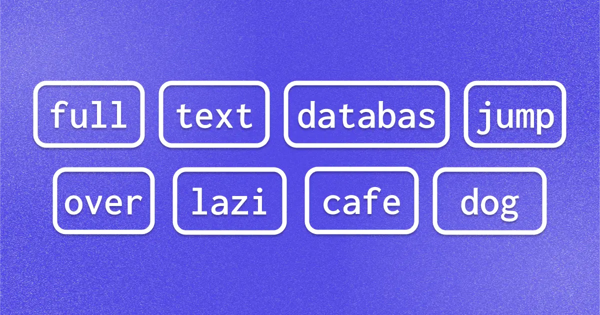
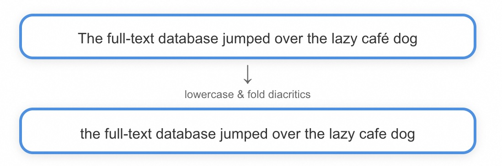
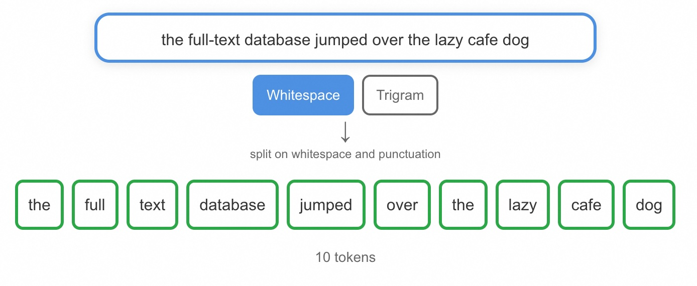
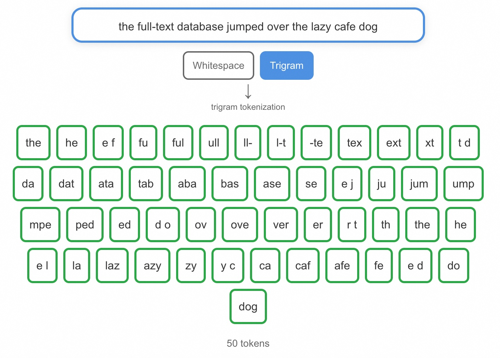
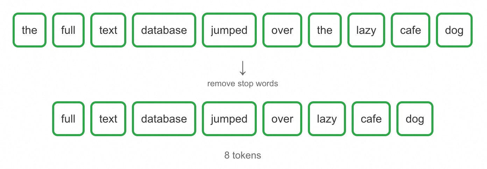
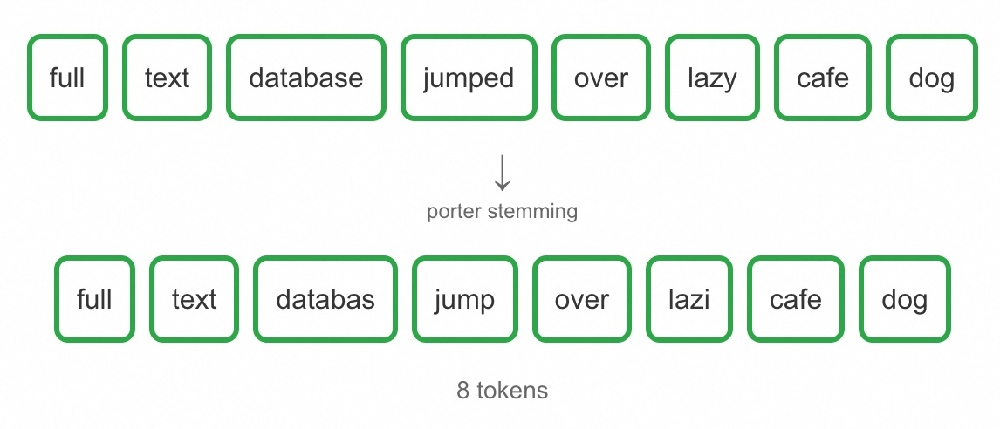
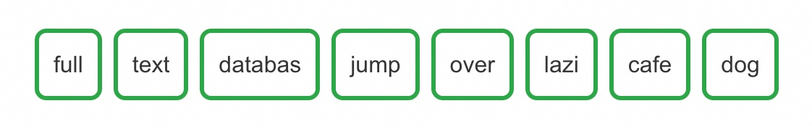

## 全文检索的地基: 标记化(Tokenization)原理详解  
          
### 作者          
digoal          
          
### 日期          
2025-10-17         
          
### 标签          
PostgreSQL , PolarDB , DuckDB , ParadeDB , 全文检索 , 词元化 , 标记化 , tokenization , 字符归一化 , 分词 , 停用词过滤 , 词干提取        
          
----          
          
## 背景    
全文检索相信大家不陌生, 例如在PG中有存储文本经过分词处理后的tsvector类型(里面存储了词元/标记(tokens), 位置等关键信息)、用于全文检索的查询表达式类型tsquery, 还提供了一些接口函数, 将文本转换为tsvector, 例如to_tsvector, 还提供了倒排索引例如GIN, RUM来提升全文检索速度, 以及ts_rank等函数来计算最终搜索结果和tsquery的匹配度得分, 从而进行排序.  
  
但是大家知道文本是经过了哪些阶段最终变成token的吗?  
  
下面翻译一篇来自 paradedb 的文章  
- https://www.paradedb.com/blog/when-tokenization-becomes-token  
  
这篇文章介绍了文本搜索中**分词（Tokenization）流水线**的工作原理。它通过一个示例句子，逐步展示了文本如何经过以下处理阶段，最终转化为用于搜索的“词元”（tokens）：  
- 1. **字符归一化**：转为小写、去除变音符号（如 `é` → `e`）；    
- 2. **分词**：按空格、标点等将文本切分为基本单元，不同分词器（如 `whitespace`、`n-gram`）策略不同；    
- 3. **停用词过滤**：移除“the”“and”等无意义高频词；    
- 4. **词干提取（stemming）**：将不同形式的词（如 `jumped`、`jumping`）归约为统一词干（如 `jump`），以提升召回率。  
  
文章强调，虽然分词过程不显眼，但它是搜索系统准确性和相关性的基础，直接影响后续的索引、查询和排序效果。  
  
# 从文本到标记：标记化管道的工作原理 (From Text to Token: How Tokenization Pipelines Work)  
  
  
  
当你在搜索框中输入一个句子时，很容易想象搜索引擎看到的和你看到的是一样的。实际上，搜索引擎（或 [搜索数据库](https://www.paradedb.com/blog/elasticsearch-acid-test) ）并不存储文本块，也不存储句子。它们甚至不像我们想象的那样存储单词。它们会拆解输入文本（包括索引文本和查询文本），将其清理干净，然后将其重新组合成更抽象、更实用的东西：token(词条/标记/词元)。这些词条就是你用来搜索的内容，也是存储在[倒排索引](https://www.paradedb.com/learn/search-concepts/full-text-search#indexing)中用于搜索的内容。  
  
倒排索引原理参考:   
- [《PostgreSQL rum 索引结构 - 比gin posting list|tree 的ctid(行号)多了addition info》](../201907/20190706_01.md)    
- [《PostgreSQL GIN索引实现原理》](../201702/20170204_01.md)    
- [《PostgreSQL 9种索引的原理和应用场景》](../201706/20170627_01.md)    
  
让我们放慢速度，观察管道的运行情况，在每个阶段暂停，看看文本是如何被分解和重塑的，以及这对结果有何影响。  
  
我们将使用“The quick brown fox jumps over the lazy dog”的变体作为测试用例。它包含了所有使分词变得有趣的元素：大写字母、标点符号、重音符号，以及在流程(pipeline)中移动(经过每个阶段处理后的输出)时会发生变化的单词。最终，它看起来会有所不同，但完全适合搜索。  
  
```  
The full-text database jumped over the lazy café dog  
```  
  
> 这并非完整的流程，只是简单介绍一下词汇搜索系统中常见的一些过滤器。不同的数据库和搜索引擎会将许多过滤器以可组合的构建块的形式公开(expose)，您可以根据需要启用、禁用或重新排序来组合使用。  
>   
> 无论您使用的是 [Lucene](https://github.com/apache/lucene) / [Elasticsearch](https://github.com/elastic/elasticsearch)、 [Tantivy](https://github.com/quickwit-oss/tantivy) / [ParadeDB](https://github.com/paradedb/paradedb)还是Postgres全文搜索，都适用这一通用思想。  
  
## 字符归一化 - 使用大小写和字符折叠过滤文本  
在考虑拆分文本之前，我们需要考虑过滤掉所有无用的内容。这通常意味着审核组成文本字符串的字符：将所有字母转换为小写，如果我们知道可能需要，我们会将任何变音符号（例如 résumé、façade 或 Noël 中的变音符号）折叠到其基本字母。  
  
此步骤确保在标记化开始之前字符已规范化且一致。`Café` 变为 `cafe`，`résumé` 变为 `resume`，这样搜索即可匹配，不受重音影响。小写确保 `database` 与 `Database` 匹配，尽管这可能会引入一些问题：例如 `Olive`（名称）与 `olive`（零食）匹配。大多数系统都接受这种权衡：误报总比漏报好。 **代码搜索是一个明显的例外，因为它通常需要保留符号并遵循驼峰式大小写 或 PascalCase 大小写规则。**   
  
让我们看看输入字符串是如何转换的。我们将大写字母 `T` 替换为小写字母 `t`，并将 `é` 折叠为 `e`。这没什么特别的。所有这些框都是交互式的，所以你可以随意输入你自己的句子来查看结果。  
  
  
  
当然，这里可以应用更多的过滤器，但为了简洁起见，我们继续。  
  
## 分词 - 使用标记化将文本拆分为可搜索的部分  
标记化阶段将过滤后的文本拆分成可索引的单元。在这个阶段，我们不再将句子视为单个单元，而是将其视为一系列离散的、可搜索的部分（称为标记(tokens)）。  
  
处理英文文本最常见的方法是简单的空格和标点符号标记：按空格和标点符号进行拆分，即可得到标记。但即使是这个基本步骤也存在细微差别：制表符、换行符或带连字符的单词（例如全文）的行为都可能有所不同。每个系统都有其自身的特性，默认的 `Lucene` 标记器会将 `it’s` 拆分为 `[it's]`，而 `Tantivy` 则会拆分为 `[it, s]` 。  
  
> 哪个更好？各有利弊：`it's` 看起来更正确，并且跳过了存储无用的 token `s`，但它在搜索时无法匹配 `it` 。  
  
一般来说，标记器有三类：  
  
1、**面向词的分词器** 会根据词的边界将文本拆分成单个单词。这包括基于空格进行拆分的简单空白分词器，以及能够识别非英语字符集的更复杂的语言感知分词器。这些分词器适用于大多数需要匹配完整单词的搜索应用。  
  
> 这些通用词法库（例如 [Jieba](https://github.com/fxsjy/jieba) 和 [Lindera](https://github.com/lindera/lindera)）通常用于提供能够处理中文、韩文、日文和汉字的标记器。  
  
2、**部分词标记器** 将单词拆分成更小的片段，用于匹配单词的各个部分或处理复合词。[N元(n-gram)](https://en.wikipedia.org/wiki/N-gram)语法标记器会创建重叠的字符序列，而边缘 N 元(edge n-gram)语法标记器则专注于前缀或后缀。这些标记器对于自动补全功能和模糊匹配非常有用，但可能会在搜索结果中产生干扰。  
  
3、**结构化文本分词器** 专为特定数据格式（例如 URL、email、file paths 或 结构化数据）而设计。它们会保留有意义的分隔符，并处理特定领域的模式，而这些模式会被通用分词器处理得乱七八糟。当您的内容包含需要特殊处理的文本时，这些功能至关重要。  
  
对于我们的示例，我们将使用一个简单的标记器，但您也可以切换到下面的三元组（长度为 3 的 `n-gram`, 使用`pg_trgm`插件的`show_trgm()`函数也可自行验证拆分效果）标记器，以了解输出会有多么不同。  
  
  
  
  
  
## 停用词过滤 - 使用停用词来去除填充词  
有些词没什么分量。它们到处出现，稀释了词义：“the”、“and”、“of”、“are”。这些词是停用词。搜索引擎通常会把它们完全丢弃，认为剩下的词会传递更多信息。  
  
> 当我们删除停用词时，我们仍然保留每个标记在文档中的原始位置。这允许位置查询（找到与 “cat 和 dog 中间间隔 5 个词以内” 匹配的文本，即使我们已经丢弃了这些停用词）。  
  
这并非没有风险。在《The Who》中，“the” 很重要。这就是为什么停用词列表通常是可配置的，而不是通用的。在支持 [BM25](https://www.paradedb.com/learn/search-concepts/bm25) 的系统中，它们通常会被完全忽略，因为排名公式会降低非常常见的术语的权重，但在不支持 BM25 的系统（例如 Postgres tsvector）中，停用词至关重要。  
  
> Lucene 和 Tantivy 默认都关闭了停用词，当在解析英语文本并启用停用词时，它们使用相同的默认列表：`[a, an, and, are, as, at, be, but, by, for, if, in, into, is, it, no, not, of, on, or, such, that, the, their, then, there, these, they, this, to, was, will, with]`   
  
  
  
你有注意到在删除停用词后，标记列表会立即变得更加集中吗？我们已经从 10 个标记减少到了 8 个，剩下的标记将具有更大的语义权重。  
  
## 词干提取（stemming） - 将不同形式的词（如 jumped、jumping）归约为统一词干  
`Jump`，`jumped`，`jumps`，`jumping`。人类可以立即发现其中的联系。计算机则不能，除非我们给它们提供一种方式。  
  
> 另一种方法是向量搜索，它用词汇词干提取来搜索语义。  
  
词干提取。词干提取器是一种基于规则的机器，它可以将单词分解成一个共同的核心。有时，这个过程很优雅，有时则很粗暴。大多数现代英语词干提取的基础源自 [马丁·波特 (Martin Porter) 于 1980 年提出的算法](https://www.cs.toronto.edu/~frank/csc2501/Readings/R2_Porter/Porter-1980.pdf) ，该算法定义了一种为搜索引擎提供一致的规则，在保留词形结构的同时去除后缀。如今，许多词干提取器都基于 [Snowball](https://snowballstem.org/) 算法。  
  
结果可能看起来很奇怪。`Database` 变成了 `databas`, `lazy` 变成了 `lazi`. 但这没关系, 因为词干提取器不在乎美观，他们在乎的是一致性。如果每种形式的 `lazy` 都折叠到 `lazi` , 搜索引擎仅需处理一次/一个。  
  
> 单词也可能被过度词干化(破坏意思)，例如 `university` 和 `universe` ，它们都源于 `univers`，但含义却大不相同。  
  
还一种更复杂的方法: 词形还原，它利用语言学知识将词转换为其词典形式，但它比词干提取的“足够好(足够就好, 不是最好, 权衡了效率和效果)”方法更复杂，计算成本也更高。  
  
> [词形还原](https://en.wikipedia.org/wiki/Lemmatization)使用实际的单词列表来确保只生成真实的单词。为了准确做到这一点，它需要知道源词的“词性”（名词、动词等）。  
  
  
  
以上是最终的转换过程：我们的词条已被精简为基本词干。`Jumped` 变成了 `jump`、`lazy` 变成了 `lazi` , `database` 变成了 `databas` 。这些词干可能看起来不像真正的单词，但它们起着至关重要的作用：保持一致。无论你搜索的是 `jumping` 、 `jumped` 还是 `jumps`，它们都会精简为 `jump` 并匹配我们索引中的内容。这就是词干提取的强大之处：弥合了人类表达同一概念的多种方式之间的差距。  
  
## 最后得到的 tokens (词元/标记)  
我们的句子已经经历了完整的流程。最初的句子 “The full-text database jumped over the lazy café dog” 经过了每个阶段的转换：去除标点符号和小写化转换，拆分成单个单词，过滤掉常见的停用词，最终精简为词干。  
  
结果是一组干净的八个标记：  
  
  
  
这个转换过程适用于我们存储在倒排索引中的所有数据(tsvector)，也适用于我们的查询(tsquery)。当有人搜索 “databases are jump” 时，该查询首先也会被标记化：小写、拆分、删除停用词并提取词干。它变成了 `databas` 和 `jump`，这将与我们的索引内容完美匹配。  
  
## 为什么“词元化/标记化”转换如此重要  
标记化并没有得到应有的赞誉。没有人会在会议上吹嘘他们的停用词过滤器。但它是搜索引擎中默默无闻的引擎。没有它，`dogs` 就不会匹配 `dog`，`jumping` 也不会找到 `jump`。  
  
每个搜索引擎都在这方面投入巨资，因为其他一切（评分、排名、相关性）都取决于获取正确的词元 (token)。这虽然不光鲜亮丽，但却非常精准。当你把这部分做好后，搜索的其他部分都会更加高效。  
  
此文的广告放在了最后, 很良心:  
  
开始使用 [ParadeDB](https://paradedb.com/) 并了解现代搜索数据库如何为您处理标记化。  
    
#### [期望 PostgreSQL|开源PolarDB 增加什么功能?](https://github.com/digoal/blog/issues/76 "269ac3d1c492e938c0191101c7238216")
  
  
#### [PolarDB 开源数据库](https://openpolardb.com/home "57258f76c37864c6e6d23383d05714ea")
  
  
#### [PolarDB 学习图谱](https://www.aliyun.com/database/openpolardb/activity "8642f60e04ed0c814bf9cb9677976bd4")
  
  
#### [PostgreSQL 解决方案集合](../201706/20170601_02.md "40cff096e9ed7122c512b35d8561d9c8")
  
  
#### [德哥 / digoal's Github - 公益是一辈子的事.](https://github.com/digoal/blog/blob/master/README.md "22709685feb7cab07d30f30387f0a9ae")
  
  
#### [About 德哥](https://github.com/digoal/blog/blob/master/me/readme.md "a37735981e7704886ffd590565582dd0")
  
  

  
