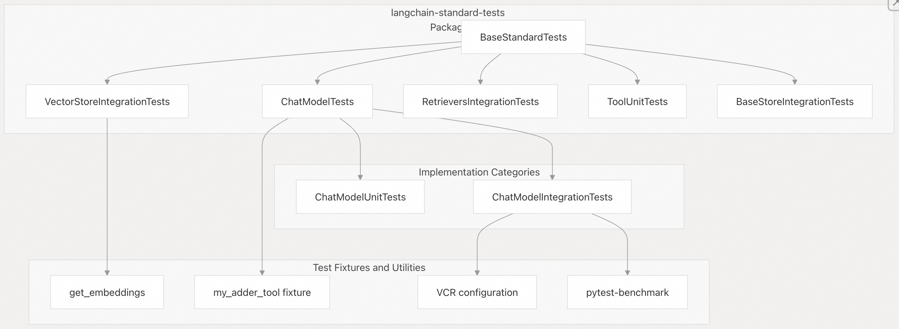
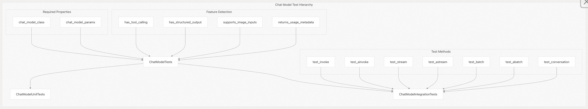
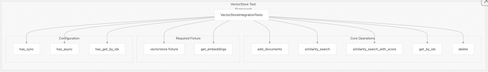
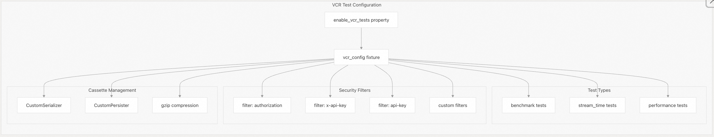
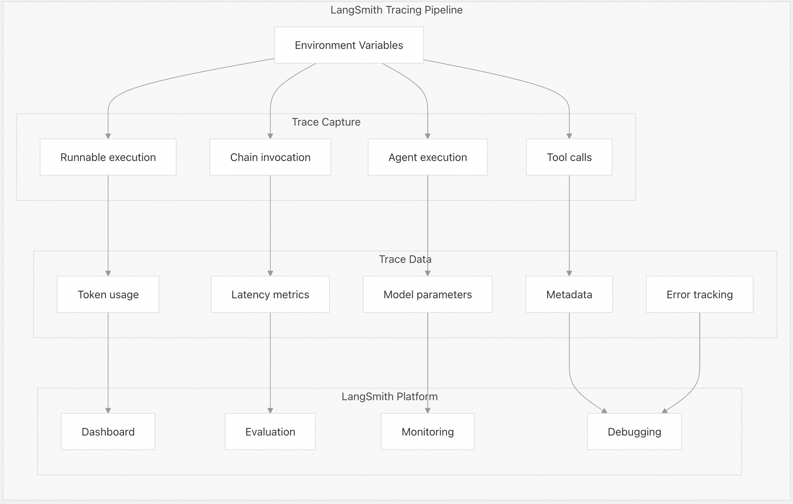

## LangChain 源码学习: 5 代码测试与评估框架                                   
                                                        
### 作者                                                
digoal                                                
                                                        
### 日期                                                  
2025-10-17                                                      
                                                 
### 标签                                                      
AI Agent , Powered by LLM , LangChain , 源码学习                                                 
                                                       
----                                                   
                                                   
## 背景              
本文介绍 LangChain 全面的测试与评估框架。该框架提供标准化的测试套件，用于确保 LangChain 各种实现之间的一致性和合规性，同时支持与 LangSmith 集成，以在开发和生产环境中实现可观测性与评估能力。    
  
评估与测试系统包含两个主要组成部分：    
- **`langchain-standard-tests`** 包：为 LangChain 集成提供合规性测试；    
- **LangSmith 集成**：用于追踪、监控和评估大语言模型（LLM）应用。    
  
## 测试框架架构  
  
LangChain 的测试框架围绕一组分层的基础测试类构建，为不同类型的 LangChain 组件提供标准化的测试模式。  
  
    
  
**源文件**：    
- `libs/standard-tests/langchain_tests/base.py`   
- `libs/standard-tests/langchain_tests/unit_tests/chat_models.py`   
- `libs/standard-tests/langchain_tests/integration_tests/chat_models.py`   
- `libs/standard-tests/langchain_tests/integration_tests/vectorstores.py`   
  
该框架提供了若干关键抽象：  
  
| 测试类 | 用途 | 目标组件 |  
|--------|------|----------|  
| `BaseStandardTests` | 所有标准测试的根类 | 所有组件 |  
| `ChatModelTests` | 聊天模型测试的基础类 | 聊天模型 |  
| `ChatModelUnitTests` | 聊天模型的单元测试 | 单个聊天模型类 |  
| `ChatModelIntegrationTests` | 聊天模型的集成测试 | 实时聊天模型 API |  
| `VectorStoreIntegrationTests` | 向量存储实现的测试 | 向量数据库 |  
| `RetrieversIntegrationTests` | 检索器实现的测试 | 文档检索器 |  
  
## 标准化测试框架  
  
`langchain-standard-tests` 包提供了一套全面的标准化测试，确保所有 LangChain 集成在行为上保持一致并符合规范。  
  
### 包结构  
  
标准测试包在 `libs/standard-tests/pyproject.toml` 中定义，其关键依赖包括：  
  
- `pytest` 和 `pytest-asyncio`：用于执行测试   
- `pytest-benchmark` 和 `pytest-codspeed`：用于性能测试    
- `pytest-recording` 和 `vcrpy`：用于记录 HTTP 交互    
- `syrupy`：用于快照测试    
- `httpx`：用于 HTTP 客户端测试   
  
### 聊天模型(chat model)测试  
  
聊天模型测试采用两级方法：**单元测试**用于验证基本功能，**集成测试**用于验证实时 API 调用。  
  
    
  
**源文件**：    
- `libs/standard-tests/langchain_tests/unit_tests/chat_models.py`  
- `libs/standard-tests/langchain_tests/integration_tests/chat_models.py`  
  
实现者必须提供两个关键属性：  
  
- `chat_model_class`：要测试的聊天模型类    
- `chat_model_params`：模型初始化参数    
  
框架通过自省来自动检测模型能力：  
  
- `has_tool_calling`：若重写了 `bind_tools` 方法则为真    
- `has_structured_output`：若重写了 `with_structured_output` 方法则为真    
- 功能支持标志包括 `supports_image_inputs`、`supports_anthropic_inputs` 等    
  
### 核心测试方法  
  
集成测试套件验证聊天模型的核心功能：  
  
| 测试方法 | 用途 | 验证内容 |  
|----------|------|----------|  
| `test_invoke` | 基本调用 | 返回有效的 `AIMessage` |  
| `test_ainvoke` | 异步调用 | 异步兼容性 |  
| `test_stream` | 流式响应 | 生成 `AIMessageChunk` 对象 |  
| `test_astream` | 异步流式响应 | 异步流式兼容性 |  
| `test_batch` | 批处理 | 支持多个输入 |  
| `test_conversation` | 多轮对话 | 保持对话上下文 |  
  
示例实现模式见：`libs/standard-tests/langchain_tests/integration_tests/chat_models.py`   
```  
def test_invoke(self, model: BaseChatModel) -> None:  
    result = model.invoke("Hello")  
    assert result is not None  
    assert isinstance(result, AIMessage)  
    assert isinstance(result.text(), str)  
    assert len(result.content) > 0  
```  
  
### 向量存储测试  
  
向量存储测试聚焦于 CRUD 操作、相似性搜索和元数据处理。  
  
    
  
**源文件**：`libs/standard-tests/langchain_tests/integration_tests/vectorstores.py`   
  
测试使用标准化的 `DeterministicFakeEmbedding`（嵌入维度为6），以确保测试结果在不同运行中保持一致和可复现。测试套件验证以下内容：  
- 文档的添加和检索    
- 带相似分值和不带相似分值的相似性搜索  
- 元数据过滤功能  
- 基于ID的文档访问  
- 文档删除功能  
  
### 基于 VCR 的性能与成本管理测试  
  
对于涉及 HTTP 调用的集成测试，框架支持 **VCR（Video Cassette Recorder）测试**，可缓存响应并支持性能基准测试。  
  
    
  
**源文件**：`libs/standard-tests/langchain_tests/integration_tests/chat_models.py`  
  
VCR 配置会自动过滤敏感请求头，并支持压缩的“磁带”（cassette）以节省存储空间。这使得无需实际调用 API 即可进行可复现(回放)的性能测试，从而控制成本。  
  
## LangSmith 集成  
  
LangSmith 通过自动追踪、监控和评估工作流，为 LangChain 应用提供全面的可观测性与评估能力。  
  
### 追踪与可观测性  
  
LangSmith 追踪通过环境变量来启用，启用后可自动捕获所有 LangChain 操作的执行轨迹。  
  
    
  
**源文件**：    
- `docs/docs/how_to/index.mdx`     
- `docs/docs/tutorials/agents.ipynb`   
  
配置方式如下：  
- `LANGSMITH_TRACING="true"`：启用追踪    
- `LANGSMITH_API_KEY`：提供身份验证密钥    
- `LANGSMITH_PROJECT`：指定项目名称    
  
### 评估工作流  
  
LangSmith 提供多种评估能力，无缝集成到 LangChain 开发流程中：  
  
| 评估类型 | 用途 | 集成点 |  
|----------|------|--------|  
| 数据集评估 | 在精选示例上测试 | 来自 LangSmith 数据集的示例选择器 |  
| 性能指标 | 衡量速度与准确性 | 自动记录在追踪记录中 |  
| A/B 测试 | 比较不同模型变体 | 基于项目的组织方式 |  
| 回归测试 | 防止性能退化 | 持续集成（CI）流程 |  
  
### 开发集成  
  
LangSmith 会为教程中的示例自动生成追踪记录，可用于调试.    
  
tutorials 中的示例追踪引用：    
- RAG 教程跟踪 - 显示检索和生成步骤  
- 代理教程跟踪 - 演示工具调用行为  
  
**源文件**：    
- `docs/docs/tutorials/rag.ipynb`   
- `docs/docs/tutorials/agents.ipynb`   
  
## 测试实现模式  
  
### 为新集成实现测试  
  
开发新的 LangChain 集成时，应遵循以下模式：  
  
1、从适当的基类继承：选择 `ChatModelUnitTests`、`ChatModelIntegrationTests` 或其他专用测试类  
  
2、实现所需的属性：提供 `chat_model_class` 和 `chat_model_params`  
  
3、配置功能标志：根据需要覆盖属性，例如 `has_tool_calling` , `supports_image_inputs`  
  
4、添加 VCR 配置：用于进行 HTTP 调用的集成测试  
  
示例结构如下：  
  
```python  
class TestMyChatModelIntegration(ChatModelIntegrationTests):  
    @property  
    def chat_model_class(self) -> Type[MyChatModel]:  
        return MyChatModel  
      
    @property  
    def chat_model_params(self) -> dict:  
        return {"model": "model-001", "temperature": 0}  
```  
  
### 测试执行与 CI 集成  
  
测试框架与 LangChain 整体的 CI/CD 流程深度集成。测试通过 `pytest` 执行，并使用特定标记（markers）进行分类：  
  
- `@pytest.mark.requires`：需要特定依赖项的测试    
- `@pytest.mark.scheduled`：计划执行相关的测试    
- `@pytest.mark.compile`：编译相关测试    
  
**源文件**：    
- `libs/standard-tests/pyproject.toml`   
- `libs/standard-tests/langchain_tests/integration_tests/chat_models.py`   
  
该框架在确保所有 LangChain 集成遵循统一测试标准的同时，也为组件特定需求保留了灵活性，并通过 LangSmith 集成支持全面的评估工作流。  
    
#### [期望 PostgreSQL|开源PolarDB 增加什么功能?](https://github.com/digoal/blog/issues/76 "269ac3d1c492e938c0191101c7238216")
  
  
#### [PolarDB 开源数据库](https://openpolardb.com/home "57258f76c37864c6e6d23383d05714ea")
  
  
#### [PolarDB 学习图谱](https://www.aliyun.com/database/openpolardb/activity "8642f60e04ed0c814bf9cb9677976bd4")
  
  
#### [PostgreSQL 解决方案集合](../201706/20170601_02.md "40cff096e9ed7122c512b35d8561d9c8")
  
  
#### [德哥 / digoal's Github - 公益是一辈子的事.](https://github.com/digoal/blog/blob/master/README.md "22709685feb7cab07d30f30387f0a9ae")
  
  
#### [About 德哥](https://github.com/digoal/blog/blob/master/me/readme.md "a37735981e7704886ffd590565582dd0")
  
  

  
