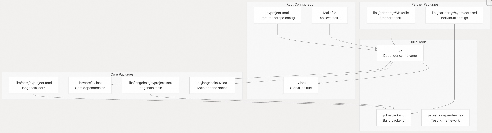
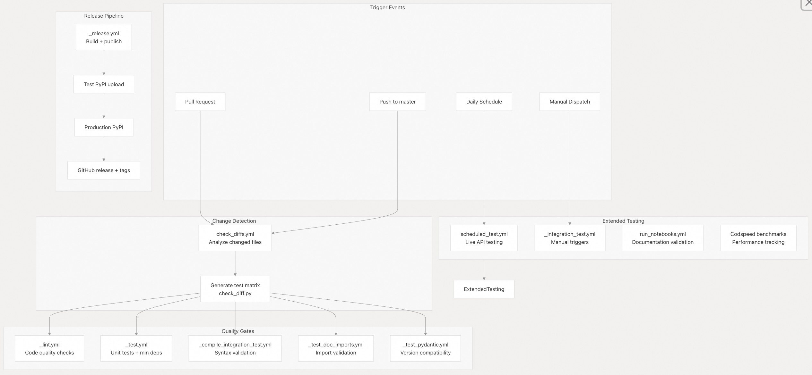
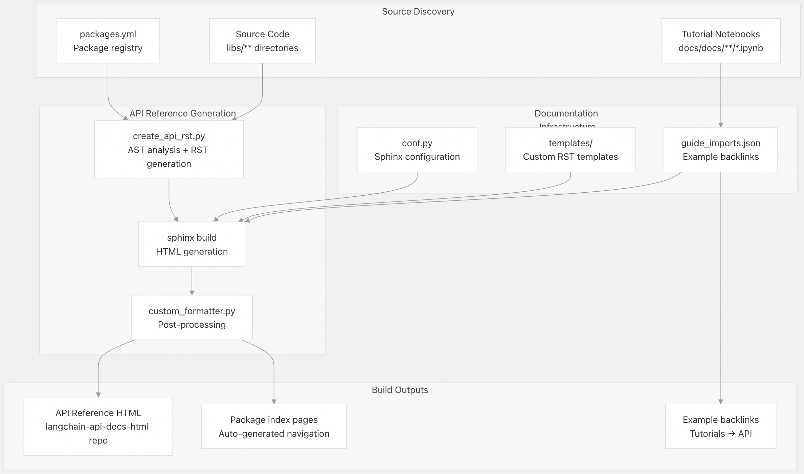
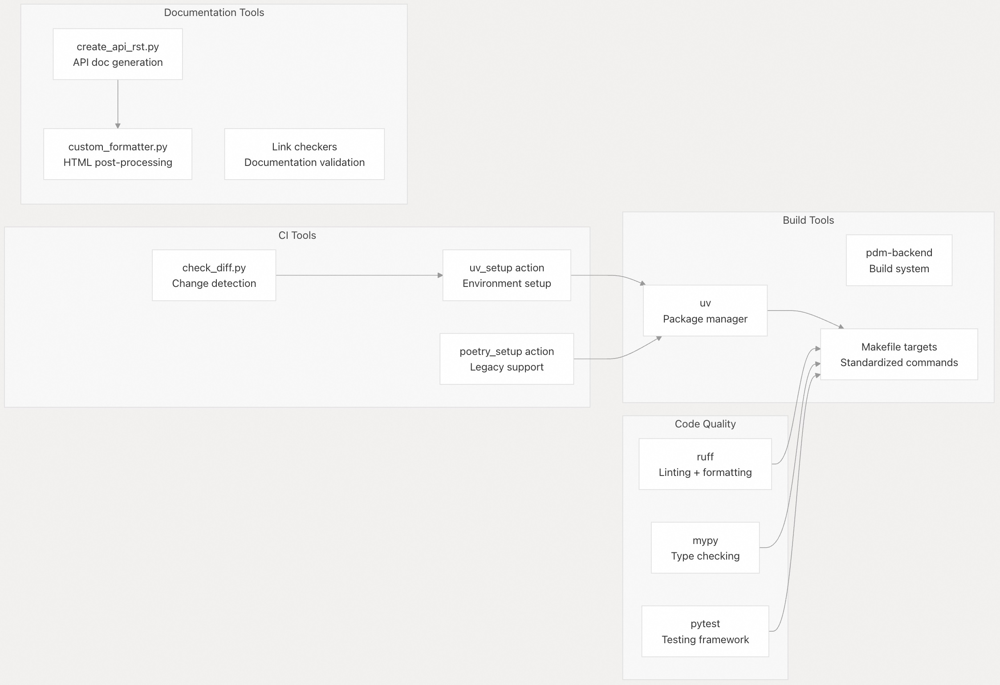

## LangChain 源码学习: 6 开发者体验（Developer Experience）                                   
                                                          
### 作者                                                  
digoal                                                  
                                                          
### 日期                                                    
2025-10-17                                                        
                                                   
### 标签                                                        
AI Agent , Powered by LLM , LangChain , 源码学习                                                   
                                                         
----                                                     
                                                     
## 背景                
LangChain 仓库为其单体仓库（monorepo）结构提供了全面的基础设施和工具支持，包括自动化构建系统、使用 `uv` 进行依赖管理、持续集成（CI）工作流以及文档生成。这套开发者体验基础设施确保了代码质量，加速开发流程，并在整个包含 50 多个包的生态系统中保持一致性。  
  
## 构建系统架构  
  
LangChain 在整个单体仓库（monorepo）中使用 `uv` 作为主要的依赖管理器和构建工具。该系统同时支持传统的基于 Poetry 的包和现代的基于 `uv` 的包，并能自动检测和处理这两种格式。  
  
### 构建系统概览  
  
  
  
构建系统对所有包均使用 `pdm-backend` 作为构建后端，在每个 `pyproject.toml` 文件中进行配置，例如：  
- `libs/langchain/pyproject.toml`   
- `libs/core/pyproject.toml`   
  
`uv` 工具负责管理整个单体仓库（monorepo）中的虚拟环境、依赖解析和包安装。  
  
**源文件：**   
- `pyproject.toml`   
- `libs/langchain/pyproject.toml`   
- `libs/core/pyproject.toml`   
- `Makefile`   
  
### 依赖管理配置  
  
单体仓库（monorepo）采用了一套复杂的依赖管理策略，包括依赖分组和本地包引用：  
  
| 包名 | 核心依赖 | 测试依赖 | 特殊功能 |  
|------|----------|----------|----------|  
| `langchain-core` | `langsmith`, `tenacity`, `pydantic` | `pytest`, `syrupy`, `blockbuster` | 支持基准测试 |  
| `langchain` | `langchain-core`, `langchain-text-splitters` | 扩展测试套件 | 可选的合作伙伴扩展 |  
| 合作伙伴(提供商)包 | `langchain-core` | 集成测试分组 | 提供商特定依赖 |  
  
每个包在 `pyproject.toml` 中定义了以下依赖分组：  
- `test`：核心测试依赖  
- `test_integration`：集成测试依赖  
- `lint`：代码质量工具（如 `ruff`、`mypy`）  
- `typing`：类型依赖检查  
- `dev`：开发工具  
  
**源文件：**   
- `libs/core/pyproject.toml`   
- `libs/langchain/pyproject.toml`   
- `pyproject.toml`   
  
### 本地包引用  
  
在开发过程中，单体仓库通过 `[tool.uv.sources]` 部分实现包之间的本地链接：  
```  
[tool.uv.sources]  
langchain-core = { path = "./libs/core", editable = true }  
langchain-text-splitters = { path = "./libs/text-splitters", editable = true }  
langchain-openai = { path = "./libs/partners/openai", editable = true }  
```  
  
这使得开发者可以在包边界之间快速开发和测试，同时在发布时仍能保持正确的打包结构。  
  
**源文件：**   
- `pyproject.toml`   
- `libs/langchain/pyproject.toml`   
- `libs/core/pyproject.toml`   
  
## CI/CD 基础设施  
  
CI/CD 系统基于 GitHub Actions，使用动态测试矩阵，仅对发生变更的包进行高效测试。该基础设施支持多种测试策略、依赖兼容性检查以及自动化发布。  
  
### CI/CD 工作流架构  
  
  
  
CI 系统在 `.github/scripts/check_diff.py` 中实现智能变更检测，动态生成测试矩阵，仅测试发生文件变更的包及其依赖项。  
  
**源文件：**   
- `.github/workflows/check_diffs.yml`  
- `.github/workflows/scheduled_test.yml`  
- `.github/workflows/_release.yml`  
  
### 测试策略  
  
测试基础设施采用多层验证机制.   
  
#### 最小依赖下的单元测试  
  
`_test.yml` 工作流对每个包运行两次测试：  
  
1、来自 lockfiles 的当前依赖项  
  
2、支持的最小依赖版本  
  
这确保了在支持的依赖版本范围内（由 `.github/scripts/get_min_versions.py` 计算得出）的兼容性。  
  
**源文件：**   
- `.github/workflows/_test.yml`   
  
#### 集成测试编译验证  
  
在运行昂贵的集成测试之前，系统会使用 `pytest` 标记来验证所有集成测试是否能正确编译和导入：  
```  
# Integration tests marked with @pytest.mark.compile  
uv run pytest -m compile tests/integration_tests  
```  
  
**源文件：**   
- `.github/workflows/_compile_integration_test.yml`   
  
#### 定期的线上 API 测试  
  
每天定时运行针对核心合作伙伴包的集成测试，连接真实的 API。测试矩阵可配置，涵盖主要服务提供商：  
```  
DEFAULT_LIBS: '["libs/partners/openai", "libs/partners/anthropic", "libs/partners/fireworks", ...]'  
  
```  
  
**源文件：**   
- `.github/workflows/scheduled_test.yml`  
  
## 文档系统  
  
LangChain 使用自动化文档生成系统，从源代码自动生成 API 参考文档，并维护示例与 API 文档之间的链接。  
  
### 文档生成流水线  
  
  
文档系统会自动发现包，使用 `importlib` 和 `inspect` 分析 Python 模块，并根据对象类型套用对应的 Sphinx 模板, 生成结构化的 RST 文件。  
  
**源文件：**   
- `docs/api_reference/create_api_rst.py`   
- `.github/workflows/api_doc_build.yml`   
  
### API 参考文档生成流程  
  
`create_api_rst.py` 脚本负责执行全面的源码分析：  
- 1、发现包：递归扫描 `libs/` 和 `libs/partners/` 目录  
- 2、模块加载：用 `importlib.import_module()` 加载 Python 模块  
- 3、对象分类：按类型对类进行分类（Pydantic、Runnable、TypedDict 等）  
- 4、选择模板：根据对象类型分配适当的 Sphinx 模板  
- 5、生成 RST：使用自动摘要表创建结构化文档  
  
在 `docs/api_reference/create_api_rst.py` 中实现对象分类逻辑  
```  
if type(type_) is typing_extensions._TypedDictMeta:  
    kind: ClassKind = "TypedDict"  
elif issubclass(type_, Runnable) and issubclass(type_, BaseModel):  
    kind = "RunnablePydantic"  
elif issubclass(type_, BaseModel):  
    kind = "Pydantic"  
```  
  
**源文件：**   
- `docs/api_reference/create_api_rst.py`  
- `docs/api_reference/conf.py`  
  
### 文档构建基础设施  
  
通过 GitHub Actions 每天自动构建 API 文档，由 `api_doc_build.yml` 编排整个流程：  
  
1、Repository Checkout：基于 `packages.yml` 配置克隆合作伙伴仓库(Repository)  
2、安装依赖项：以可编辑模式覆盖式安装所有依赖包  
3、生成文档：运行 `create_api_rst.py` 和 Sphinx 构建文档  
4、部署：将结果推送到 `langchain-api-docs-html` 存储库  
  
构建过程中使用 `docs/vercel_overrides.txt` 中的特殊依赖项进行覆盖，以解决文档构建时的包版本冲突问题  
  
**源文件：**   
- `.github/workflows/api_doc_build.yml`  
- `.github/scripts/prep_api_docs_build.py`  
  
## 开发工具  
  
仓库包含大量开发工具和脚本，用于自动化常见任务并维护代码质量。  
  
### 开发工具概览  
  
  
**源文件：**   
- `Makefile`  
- `.github/actions/uv_setup/action.yml`  
- `.github/actions/poetry_setup/action.yml`  
  
### Makefile 目标  
  
根目录的 `Makefile` 提供了标准化命令，用于常见开发任务：  
  
| 目标(makefile target) | 用途 | 示例 |  
|------|------|----------|  
| `docs_build` | 构建文档 | `cd docs && make build` |  
| `api_docs_build` | 构建 API 参考文档 | `python docs/api_reference/create_api_rst.py` |  
| `lint` | 运行代码质量检查 | `uv run --group lint ruff check docs cookbook` |  
| `format` | 格式化代码 | `uv run --group lint ruff format docs cookbook` |  
  
每个包里面也包含一个标准化的 `Makefile`，提供如 `test`、`integration_tests`、`lint_package` 和 `lint_tests` 等目标(makefile target)。  
  
**源文件：**   
- `Makefile`  
- `libs/partners/deepseek/Makefile`   
  
### GitHub Actions  
  
仓库使用自定义 GitHub Actions 来处理常见的 CI 任务：  
  
#### UV 设置 Action  
  
提供标准化的 Python 和 `uv` 环境设置，并支持缓存：  
```  
- name: 'Set up Python + UV'  
  uses: "./.github/actions/uv_setup"  
  with:  
    python-version: "3.11"  
    cache-suffix: "test-libs/core"  
```  
  
该 Action 负责 `uv` 安装、Python 环境配置以及跨操作系统的缓存管理。  
  
**源文件：**   
- `.github/actions/uv_setup/action.yml`  
  
#### Poetry 设置 Action（遗留）  
  
为尚未迁移到 `uv` 的 Poetry 包保持兼容性：  
```  
- name: 'Set up Python + Poetry'  
  uses: "./.github/actions/poetry_setup"  
  with:  
    python-version: "3.11"  
    poetry-version: "1.8.4"  
```  
  
**源文件：**   
- `.github/actions/poetry_setup/action.yml`   
  
### 开发脚本  
  
多个 Python 脚本用于自动化开发工作流.   
  
#### 变更检测（`check_diff.py`）  
  
分析 Git 变更，确定哪些包需要测试，仅测试受影响的包及其依赖项来缩短 CI 运行时间。  
  
#### API 文档构建准备（`prep_api_docs_build.py`）  
  
协调复杂的多仓库 checkout 和组织流程，为文档构建做准备：  
```  
def move_libraries(packages: list) -> None:  
    """Move libraries from their source locations to the target directories."""  
    for package in packages:  
        repo_name = package["repo"].split("/")[1]  
        source_path = package["path"]  
        target_dir = get_target_dir(package["name"])  
```  
  
**源文件：**   
- `.github/scripts/prep_api_docs_build.py`   
  
#### 版本同步  
  
自动化检查确保 `pyproject.toml` 与版本文件中的版本号保持一致，防止发布时出现版本不匹配。  
  
**源文件：**   
- `.github/workflows/check_core_versions.yml`   
  
这套开发者体验基础设施使 LangChain 团队能够在整个生态系统中保持高质量代码、快速开发周期和全面测试，同时最大限度地减少人工干预。  
  
# 附录: UV 工具介绍  
  
在 LangChain 的开发者体验（Developer Experience）文档中，**`uv`** 被明确指定为其单体仓库（monorepo）中的**主要依赖管理器和构建工具**。下面我们将结合文档内容和 `uv` 本身的特性，详细介绍它在 LangChain 项目中的角色、优势以及具体用法。  
  
## 一、什么是 `uv`？  
  
`uv` 是由 [Astral](https://astral.sh/)（即 Ruff 背后的团队）开发的一款**超高速 Python 包安装器和解析器**，目标是替代 `pip`、`pip-tools`、`virtualenv`，甚至部分替代 `poetry` 和 `pipenv`。它用 Rust 编写，性能远超传统工具（官方称比 `pip` 快 10–100 倍）。  
  
核心功能包括：  
- 虚拟环境管理（类似 `venv` + `virtualenv`）  
- 依赖解析与安装（类似 `pip` + `pip-tools`）  
- 支持 `pyproject.toml` 中的依赖组（dependency groups）  
- 本地路径依赖（local path dependencies）  
- 与现代 Python 打包标准（PEP 621、PEP 631）兼容  
  
> 官网：https://docs.astral.sh/uv/  
  
## 二、LangChain 中 `uv` 的核心用途  
  
根据文档，`uv` 在 LangChain 单体仓库中承担以下关键角色：  
  
### 1. **统一依赖管理**  
- 替代传统的 `poetry` 或 `pip` + `requirements.txt`  
- 管理 **50+ 个子包**之间的依赖关系  
- 支持 **混合模式**：既兼容旧的 Poetry 包，也支持新的 `uv` 原生包（自动检测）  
  
### 2. **本地包引用（Local Package Linking）**  
LangChain 使用 `uv` 的 `[tool.uv.sources]` 功能实现**开发时的本地依赖链接**，例如：  
  
```toml  
# pyproject.toml  
[tool.uv.sources]  
langchain-core = { path = "libs/core" }  
langchain-text-splitters = { path = "libs/text-splitters" }  
```  
  
这使得：  
- 开发者修改 `langchain-core` 后，`langchain` 包能**立即使用最新代码**，无需发布或安装  
- 但发布时仍使用 PyPI 上的正式版本（因为 `uv` 在构建时会忽略 `path` 源，除非显式指定）  
  
> 这解决了 monorepo 中“跨包开发”的经典难题。  
  
### 3. **依赖分组（Dependency Groups）**  
LangChain 在 `pyproject.toml` 中定义了多个依赖组，例如：  
  
```toml  
[dependency-groups]  
test = ["pytest", "syrupy"]  
lint = ["ruff", "mypy"]  
dev = ["uv", "build"]  
```  
  
然后通过 `uv` 命令一键安装特定组：  
  
```bash  
uv run --group lint ruff check .  
uv run --group test pytest  
```  
  
这比 Poetry 的 `--with` 或 pip 的多文件管理更简洁高效。  
  
### 4. **虚拟环境与执行环境管理**  
`uv` 自动创建和管理虚拟环境，并支持直接运行命令：  
  
```bash  
# 安装所有依赖（包括 dev 组）  
uv sync --all-extras --dev  
  
# 运行测试  
uv run pytest  
  
# 格式化代码  
uv run ruff format .  
```  
  
无需手动激活 `venv`，`uv` 会自动处理。  
  
## 三、LangChain 中 `uv` 的典型用法示例  
  
### 1. **安装依赖**  
```bash  
# 安装核心依赖 + 开发依赖  
uv sync --all-extras --dev  
```  
  
### 2. **运行测试**  
```bash  
# 运行单元测试（使用 test 依赖组）  
uv run --group test pytest tests/  
  
# 运行集成测试  
uv run --group test_integration pytest tests/integration/  
```  
  
### 3. **代码检查与格式化**  
```bash  
# 静态检查  
uv run --group lint ruff check .  
  
# 类型检查  
uv run --group typing mypy .  
  
# 自动格式化  
uv run --group lint ruff format .  
```  
  
### 4. **构建文档**  
```bash  
# 生成 API 文档  
uv run python docs/api_reference/create_api_rst.py  
  
# 构建 Sphinx 文档  
cd docs && uv run make html  
```  
  
### 5. **本地开发多包联动**  
当你同时修改 `core` 和 `langchain` 时：  
- 只需在根目录运行 `uv sync`  
- `uv` 会自动将 `libs/core` 作为 `langchain-core` 的本地源  
- 所有包共享同一个虚拟环境，避免版本冲突  
  
## 四、为什么 LangChain 选择 `uv`？  
  
| 优势 | 说明 |  
|------|------|  
| ⚡ **极速** | 依赖解析和安装速度远超 pip/poetry，提升 CI 和本地开发效率 |  
| 🧩 **Monorepo 友好** | 原生支持本地路径依赖和跨包开发 |  
| 📦 **标准兼容** | 基于 PEP 621/631，未来兼容性好 |  
| 🔧 **工具集成** | 与 Ruff、Mypy 等现代工具链无缝协作 |  
| 🔄 **渐进迁移** | 允许 Poetry 和 uv 包共存，降低迁移成本 |  
  
## 五、与 Poetry 的对比（LangChain 的混合策略）  
  
LangChain 目前处于**从 Poetry 向 uv 迁移的过渡期**：  
- 新包（如 `langchain-core`）已全面采用 `uv` + `pdm-backend`  
- 旧包仍保留 Poetry 配置  
- CI 中同时支持 `.github/actions/poetry_setup` 和 `.github/actions/uv_setup`  
  
但长期来看，`uv` 将成为唯一标准。  
  
## 六、学习资源  
  
- 官方文档：https://docs.astral.sh/uv/  
- GitHub 仓库：https://github.com/astral-sh/uv  
- LangChain 的 `pyproject.toml` 示例（见文档中引用的文件）  
  
## 总结  
  
在 LangChain 的开发者体验中，`uv` 不仅仅是一个“更快的 pip”，而是**整个 monorepo 开发基础设施的核心**。它通过：  
- 高性能依赖解析  
- 本地包链接  
- 依赖分组  
- 统一执行环境  
  
极大地简化了大规模 Python 项目的开发、测试和发布流程，是现代 Python 工程化的重要工具。  
  
如果你正在参与 LangChain 开发或构建类似规模的项目，强烈建议掌握 `uv` 的使用。  
      
#### [期望 PostgreSQL|开源PolarDB 增加什么功能?](https://github.com/digoal/blog/issues/76 "269ac3d1c492e938c0191101c7238216")
  
  
#### [PolarDB 开源数据库](https://openpolardb.com/home "57258f76c37864c6e6d23383d05714ea")
  
  
#### [PolarDB 学习图谱](https://www.aliyun.com/database/openpolardb/activity "8642f60e04ed0c814bf9cb9677976bd4")
  
  
#### [PostgreSQL 解决方案集合](../201706/20170601_02.md "40cff096e9ed7122c512b35d8561d9c8")
  
  
#### [德哥 / digoal's Github - 公益是一辈子的事.](https://github.com/digoal/blog/blob/master/README.md "22709685feb7cab07d30f30387f0a9ae")
  
  
#### [About 德哥](https://github.com/digoal/blog/blob/master/me/readme.md "a37735981e7704886ffd590565582dd0")
  
  

  
