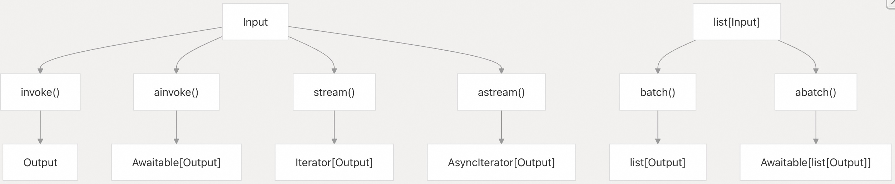

## LangChain 源码学习: 2.1 Runnable 接口与 LCEL（LangChain 表达式语言）                                
                                                            
### 作者                                                    
digoal                                                    
                                                            
### 日期                                                      
2025-10-17                                                          
                                                     
### 标签                                                          
AI Agent , Powered by LLM , LangChain , 源码学习                                                     
                                                           
----                                                       
                                                       
## 背景                  
本文介绍 LangChain 应用执行的基础核心组件：**`Runnable` 接口** 和 **LangChain 表达式语言（LCEL）**。    
“`Runnable` 抽象”为可调用、可批处理、可流式输出以及可组合的组件提供了标准化接口，而 LCEL 则支持以声明式方式将这些组件组合成复杂的处理链。  
  
## 核心 Runnable 接口  
  
`Runnable` 接口定义了 LangChain 中可执行组件的基础抽象。所有能够处理输入并生成输出的组件都要实现该接口，从而在整个框架中提供一致的执行模型。  
  
### Runnable 抽象基类  
  
  
  
`Runnable` 类定义为：  
  
```python  
Runnable(ABC, Generic[Input, Output])  
```  
  
其中 `Input` 和 `Output` 是泛型参数，用于指定该组件预期的输入和输出类型。  
  
**源文件：**   
- [`libs/core/langchain_core/runnables/base.py`](https://github.com/langchain-ai/langchain/blob/e3fc7d8a/libs/core/langchain_core/runnables/base.py#L122-L254)  
  
### 核心执行方法  
  
每个 `Runnable` 都提供四种主要的执行模式：  
  
| 方法 | 用途 | 返回值 |  
|------|------|--------|  
| `invoke` | 同步处理单个输入 | `Output` |  
| `ainvoke` | 异步处理单个输入 | `Awaitable[Output]` |  
| `batch` | 并行处理多个输入 | `list[Output]` |  
| `stream` | 在生成过程中流式输出片段 | `Iterator[Output]` |  
  
  
  
默认实现包含内置优化：    
- `batch` 通过线程池并行调用 `invoke`    
- `ainvoke` 使用 `asyncio` 的线程池来执行同步(sync)版本  
  
**源文件：**   
- [`libs/core/langchain_core/runnables/base.py`](https://github.com/langchain-ai/langchain/blob/e3fc7d8a/libs/core/langchain_core/runnables/base.py#L827-L1055)   
  
## LCEL 组合模式  
  
LangChain 表达式语言（LCEL）支持以声明式方式将 `Runnable` 组件组合成复杂链。其组合基于两个核心原语：  
- **`RunnableSequence`**：用于顺序执行  
- **`RunnableParallel`**：用于并发执行  
  
### 使用 RunnableSequence 进行顺序组合  
  
顺序链可通过管道操作符 `|` 或 `pipe()` 方法创建：  
```python  
chain = prompt | llm | output_parser  
```  
  
  
  
`|` 操作符会创建一个 `RunnableSequence`，前一个组件的输出自动作为下一个组件的输入。这是在 `RunnableSequence(self, coerce_to_runnable(other))` 调用的 `__or__` 方法中实现的。  
  
**源文件：**    
- [`libs/core/langchain_core/runnables/base.py`](https://github.com/langchain-ai/langchain/blob/e3fc7d8a/libs/core/langchain_core/runnables/base.py#L614-L635)
- https://github.com/langchain-ai/langchain/blob/e3fc7d8a/libs/core/langchain_core/runnables/base.py#L169-L176   
  
### 使用 RunnableParallel 进行并行组合  
  
并行执行可通过字典字面(literals)或显式使用 `RunnableParallel` 实现：  
```python  
parallel = {"llm1": llm1, "llm2": llm2}  
```  
  
  
  
当在序列中使用字典字面(literals)时，会自动转换为 `RunnableParallel`，它将**相同输入**分发给每个子组件，并将输出收集为字典。  
  
**源文件：**   
- [`libs/core/langchain_core/runnables/base.py`](https://github.com/langchain-ai/langchain/blob/e3fc7d8a/libs/core/langchain_core/runnables/base.py#L181-L186)   
  
### 类型强制转换与自动包装(wrapping)  
  
LCEL 会自动将多种对象转换为 `Runnable` 实例，例如：  
- 普通函数调用 → `RunnableLambda`  
- 字典/mapping → `RunnableParallel`  
  
  
  
该转换在使用 `|` 操作符或 `pipe()` 方法时，通过 `coerce_to_runnable` 函数自动完成。  
  
**源文件：**   
- [`libs/core/langchain_core/runnables/base.py`](https://github.com/langchain-ai/langchain/blob/e3fc7d8a/libs/core/langchain_core/runnables/base.py#L635-L635)   
  
## 模式自省与类型安全  
  
`Runnable` 接口提供全面的**模式自省（schema introspection）**能力，支持运行时类型检查、自动验证及工具集成。  
  
### 输入与输出模式属性  
  
每个 `Runnable` 都将其期望的输入和输出模式暴露为 **Pydantic 模型**：  
- `.input_schema`：输入结构  
- `.output_schema`：输出结构  
  
  
  
模式系统通过泛型参数进行类型自省。例如，`Runnable[str, int]` 会自动生成对应的输入/输出模式(schema)。  
  
**源文件：**   
- [`libs/core/langchain_core/runnables/base.py`](https://github.com/langchain-ai/langchain/blob/e3fc7d8a/libs/core/langchain_core/runnables/base.py#L299-L512)  
  
### 动态模式(schema)生成  
  
模式可根据配置动态生成，尤其适用于可配置字段：  
  
| 方法 | 用途 |  
|------|------|  
| `get_input_schema(config)` | 获取指定配置下的输入模式 |  
| `get_output_schema(config)` | 获取指定配置下的输出模式 |  
| `get_input_jsonschema(config)` | 输入的 JSON Schema 表示 |  
| `config_schema()` | 配置参数的模式 |  
  
**源文件：**   
- [`libs/core/langchain_core/runnables/base.py`](https://github.com/langchain-ai/langchain/blob/e3fc7d8a/libs/core/langchain_core/runnables/base.py#L364-L578)  
  
## 配置与运行时行为  
  
`Runnable` 接口通过 `RunnableConfig` 系统支持丰富的运行时配置，可在不修改底层实现的情况下动态调整行为。  
  
### RunnableConfig 结构  
  
  
  
通过设置 `configurable` 字段影响执行行为、追踪（tracing）和运行时参数修改。  
  
**源文件：**   
- [`libs/core/langchain_core/runnables/config.py`](https://github.com/langchain-ai/langchain/blob/e3fc7d8a/libs/core/langchain_core/runnables/config.py#L43-L88)   
  
### 方法链与修饰器  
  
`Runnable` 接口支持方法链式调用，用于常见行为修改，例如：  
- `.with_config(...)`：附加配置  
- `.with_retry(...)`：添加重试策略  
- `.with_fallbacks(...)`：设置备用组件  
- `.with_listeners(...)`：注册回调监听器  
  
  
  
这些方法返回**新的 `Runnable` 实例**，原始接口保持不变。  
  
**源文件：**   
- [`libs/core/langchain_core/runnables/base.py`](https://github.com/langchain-ai/langchain/blob/e3fc7d8a/libs/core/langchain_core/runnables/base.py#L773-L823)   
  
## 图式表示与可视化  
  
每个 `Runnable` 都可生成其结构的**图表示（graph representation）**，便于可视化和分析复杂链。  
  
### 图结构  
  
  
  
`get_graph()` 方法返回一个 `Graph` 对象，描述该 `Runnable` 及其内部组合结构。  
  
**源文件：**    
- [`libs/core/langchain_core/runnables/base.py`](https://github.com/langchain-ai/langchain/blob/e3fc7d8a/libs/core/langchain_core/runnables/base.py#L580-L599)   
- [`libs/core/langchain_core/runnables/graph.py`](https://github.com/langchain-ai/langchain/blob/e3fc7d8a/libs/core/langchain_core/runnables/graph.py#L257-L304)   
  
### 执行流可视化  
  
  
  
此流程适用于所有执行方法（`invoke`、`batch`、`stream`），并具有异步和流行为的变种表示。  
   
**源文件：**   
- [`libs/core/langchain_core/runnables/base.py`](https://github.com/langchain-ai/langchain/blob/e3fc7d8a/libs/core/langchain_core/runnables/base.py#L827-L869)
      
#### [期望 PostgreSQL|开源PolarDB 增加什么功能?](https://github.com/digoal/blog/issues/76 "269ac3d1c492e938c0191101c7238216")
  
  
#### [PolarDB 开源数据库](https://openpolardb.com/home "57258f76c37864c6e6d23383d05714ea")
  
  
#### [PolarDB 学习图谱](https://www.aliyun.com/database/openpolardb/activity "8642f60e04ed0c814bf9cb9677976bd4")
  
  
#### [PostgreSQL 解决方案集合](../201706/20170601_02.md "40cff096e9ed7122c512b35d8561d9c8")
  
  
#### [德哥 / digoal's Github - 公益是一辈子的事.](https://github.com/digoal/blog/blob/master/README.md "22709685feb7cab07d30f30387f0a9ae")
  
  
#### [About 德哥](https://github.com/digoal/blog/blob/master/me/readme.md "a37735981e7704886ffd590565582dd0")
  
  

  
