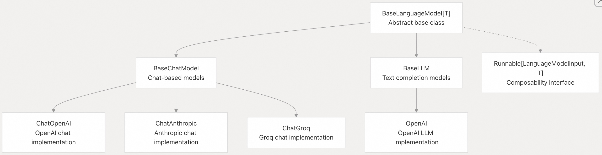
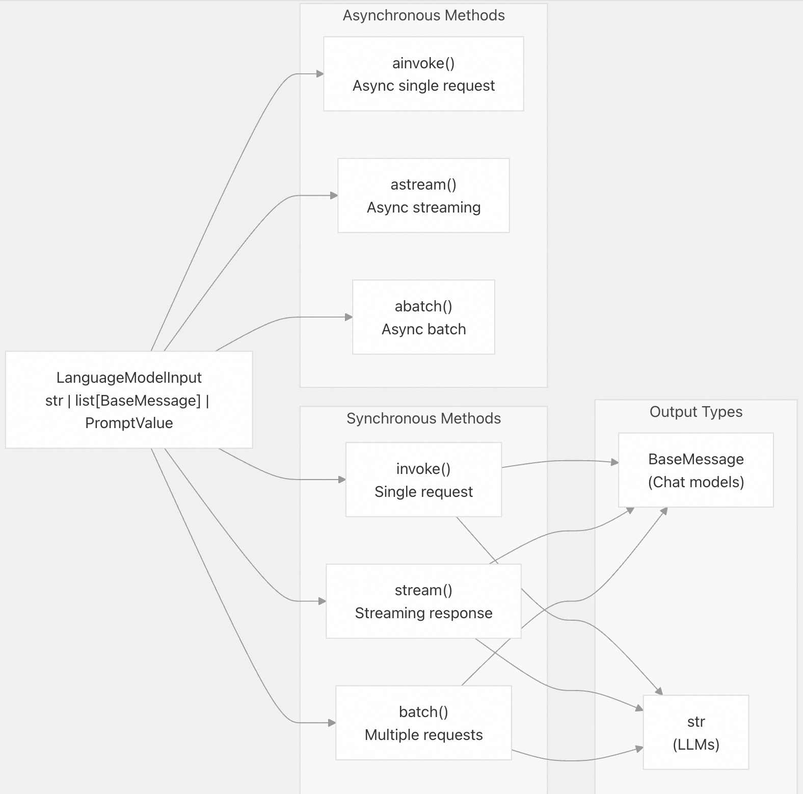
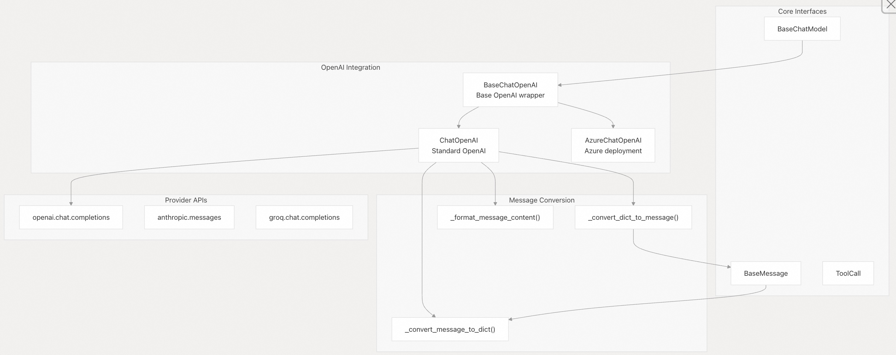
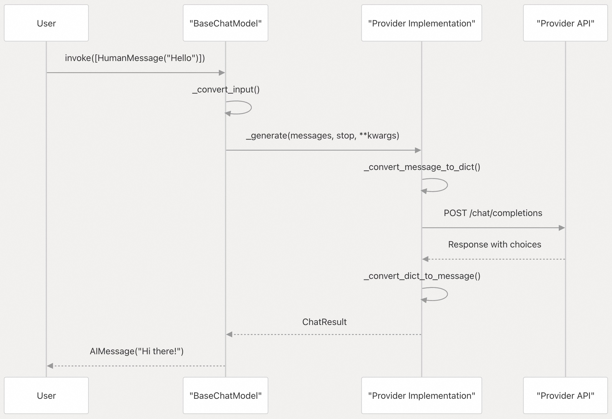
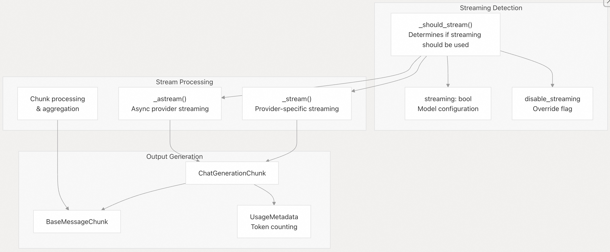
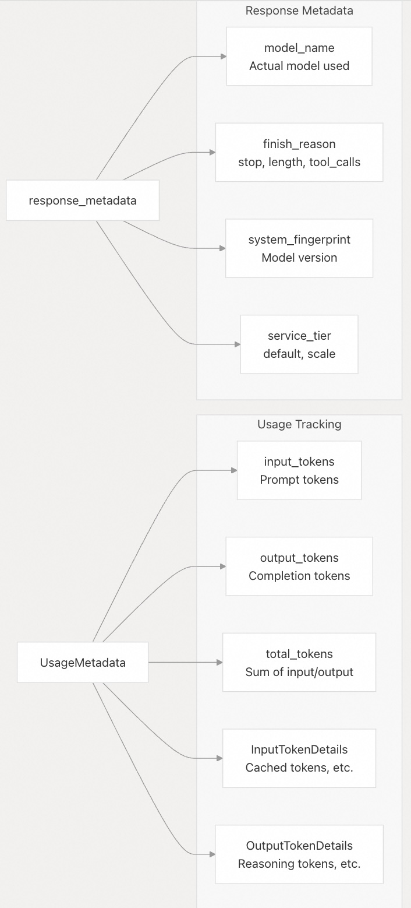

## LangChain 源码学习: 2.2 语言模型与聊天模型核心抽象                                  
                                                              
### 作者                                                      
digoal                                                      
                                                              
### 日期                                                        
2025-10-17                                                            
                                                       
### 标签                                                            
AI Agent , Powered by LLM , LangChain , 源码学习                                                       
                                                             
----                                                         
                                                         
## 背景                    
本文介绍 LangChain 中用于语言模型和聊天模型的核心抽象，这些抽象构成了与不同提供商的大语言模型（LLM）交互的基础。这些抽象为文本补全模型和对话式聊天模型提供了统一的接口，同时支持针对特定提供商的优化。  
  
## 基础语言模型继承体系  
  
LangChain 的语言模型抽象采用清晰的继承层次结构，在不同模型类型之间分离关注点，同时通过共享接口维持一致性。  
  
  
  
**源文件：**    
- `libs/core/langchain_core/language_models/base.py`   
- `libs/core/langchain_core/language_models/chat_models.py`   
- `libs/core/langchain_core/language_models/llms.py`   
  
`BaseLanguageModel` 类作为根抽象，通过泛型参数 `T` 指定输出类型（`LLM` 为 `str`，聊天模型为 `BaseMessage`）。所有语言模型均实现 `Runnable` 接口，从而支持通过 LangChain 表达式语言（LCEL）进行组合。  
  
## 聊天模型 vs 文本补全模型  
  
LangChain 根据交互模式将语言模型分为两类：  
  
| 方面 | 聊天模型（`BaseChatModel`） | 文本补全模型（`BaseLLM`） |  
|------|----------------------------|--------------------------|  
| 输入类型 | `list[BaseMessage]` 或对话式提示 | `str` 或字符串提示 |  
| 输出类型 | `BaseMessage`（通常是 `AIMessage`） | `str` |  
| 使用场景 | 对话式 AI、结构化交互 | 文本补全、生成任务 |  
| 提供商示例 | GPT-4、Claude、Gemini | GPT-3.5 Instruct、text-davinci |  
| 消息支持 | 系统消息、人类消息、AI 消息、工具消息 | 仅纯文本 |  
  
**源文件：**    
- `libs/core/langchain_core/language_models/chat_models.py`   
- `libs/core/langchain_core/language_models/llms.py`   
  
## 核心接口方法  
  
聊天模型和 LLM 均实现了一套一致的方法，以支持不同的交互模式。  
  
  
  
**源文件：**    
- `libs/core/langchain_core/language_models/chat_models.py`   
- `libs/core/langchain_core/language_models/base.py`   
  
### 关键方法签名  
`BaseChatModel` 中定义的核心方法包括：  
- `invoke(input, config, stop, **kwargs) -> BaseMessage`：单次同步请求    
- `ainvoke(input, config, stop, **kwargs) -> BaseMessage`：单次异步请求    
- `stream(input, config, stop, **kwargs) -> Iterator[BaseMessageChunk]`：流式响应    
- `astream(input, config, stop, **kwargs) -> AsyncIterator[BaseMessageChunk]`：异步流式    
- `batch(inputs, config, stop, **kwargs) -> list[BaseMessage]`：批量处理    
  
**源文件：**    
- `libs/core/langchain_core/language_models/chat_models.py`  
  
## 提供商集成架构  
  
LangChain 的提供商集成遵循标准化模式：每个提供商实现基础抽象，同时处理其特有的细节。  
  
  
  
**源文件：**    
- `libs/partners/openai/langchain_openai/chat_models/base.py`  
  
### 提供商实现模式  
  
每个提供商通常实现以下内容：  
- 基本配置：模型名称、API 凭证、请求参数  
- 消息转换：LangChain 和提供商消息之间的格式转换  
- 请求处理：使用适当的身份验证构建 API 请求  
- 响应处理：将提供商的响应结果转换为 LangChain 消息对象  
- 流支持：处理实时响应块  
- 错误处理：将提供商的错误映射到 LangChain 异常  
  
**源文件：**    
- `libs/partners/openai/langchain_openai/chat_models/base.py`   
- `libs/partners/groq/pyproject.toml`   
- `libs/partners/mistralai/pyproject.toml`   
  
## 消息处理流程  
  
下图展示了消息如何从输入到输出流经聊天模型：  
  
  
  
**源文件：**    
- `libs/core/langchain_core/language_models/chat_models.py`  
- `libs/partners/openai/langchain_openai/chat_models/base.py`  
  
### 输入处理  
  
聊天模型通过 `LanguageModelInput` 类型接受多种输入格式：  
- `str` → 转换为 `StringPromptValue`，再转为 `HumanMessage`    
- `list[BaseMessage]` → 直接用作对话历史    
- `PromptValue` → 提取为适当的消息格式    
- `Sequence[MessageLikeRepresentation]` → 转换为 `BaseMessage` 对象    
  
**源文件：**    
- `libs/core/langchain_core/language_models/chat_models.py`   
- `libs/core/langchain_core/language_models/base.py`   
  
## 流式与异步支持  
  
LangChain 的语言模型提供全面的流式和异步能力。  
  
  
  
**源文件：**    
- `libs/core/langchain_core/language_models/chat_models.py`  
  
### 流式配置  
  
模型支持多种流式配置选项：  
- `streaming: bool`：全局启用/禁用流   
- `disable_streaming: Union[bool, Literal["tool_calling"]]`：覆盖流式行为    
- `stream_usage: bool`：在流式响应中包含 token 使用量    
- 基于Callback的流式检测以实现兼容性  
  
**源文件：**    
- `libs/core/langchain_core/language_models/chat_models.py`   
- `libs/partners/openai/langchain_openai/chat_models/base.py`   
  
## Token 使用量与元数据  
  
聊天模型提供了关于 API 调用的详细元数据，包括 token 使用量和模型信息。  
  
  
  
**源文件：**    
- `libs/core/langchain_core/messages/ai.py`   
- `libs/partners/openai/langchain_openai/chat_models/base.py`  
  
## 高级功能  
  
### 结构化输出支持  
  
许多提供商通过响应格式化支持生成结构化输出:   
- JSON Schema: 定义期望的输出结构  
- Function Calling: 使用工具进行结构化响应  
- Pydantic Models: 类型安全的结构化输出解析  
  
**源文件：**    
- `libs/partners/openai/langchain_openai/chat_models/base.py`   
- `libs/core/langchain_core/language_models/chat_models.py`   
  
### 缓存与速率限制  
  
语言模型集成了 LangChain 的缓存和速率限制基础设施:  
- 缓存集成：支持语义缓存和精确缓存  
- 速率限制：内置速率限制器支持 API 配额  
- 重试逻辑：可配置请求失败时的重试策略  
  
**源文件：**    
- `libs/core/langchain_core/language_models/base.py`   
- `libs/core/langchain_core/language_models/chat_models.py`   
- `libs/core/langchain_core/language_models/llms.py`   
  
### 配置与调试  
  
模型提供丰富的配置选项和调试能力:  
- 模型参数：温度、最大令牌数、停止序列(停词, 模型在生成该词时将停止输出)  
- API 配置：基本 URL、身份验证、超时  
- 调试：响应头、请求/响应日志  
- 验证：验证配置参数、模型相关的特定约束  
  
**源文件：**    
- `libs/partners/openai/langchain_openai/chat_models/base.py`  
    
#### [期望 PostgreSQL|开源PolarDB 增加什么功能?](https://github.com/digoal/blog/issues/76 "269ac3d1c492e938c0191101c7238216")
  
  
#### [PolarDB 开源数据库](https://openpolardb.com/home "57258f76c37864c6e6d23383d05714ea")
  
  
#### [PolarDB 学习图谱](https://www.aliyun.com/database/openpolardb/activity "8642f60e04ed0c814bf9cb9677976bd4")
  
  
#### [PostgreSQL 解决方案集合](../201706/20170601_02.md "40cff096e9ed7122c512b35d8561d9c8")
  
  
#### [德哥 / digoal's Github - 公益是一辈子的事.](https://github.com/digoal/blog/blob/master/README.md "22709685feb7cab07d30f30387f0a9ae")
  
  
#### [About 德哥](https://github.com/digoal/blog/blob/master/me/readme.md "a37735981e7704886ffd590565582dd0")
  
  

  
