## LangChain 源码学习: 2.3 工具与函数调用（Tools and Function Calling）                                   
                                                                
### 作者                                                        
digoal                                                        
                                                                
### 日期                                                          
2025-10-17                                                              
                                                         
### 标签                                                              
AI Agent , Powered by LLM , LangChain , 源码学习                                                         
                                                               
----                                                           
                                                           
## 背景                      
本文介绍 LangChain 的工具系统和函数调用基础设施。内容涵盖：  
- 如何通过 “`BaseTool` 抽象” 定义工具；  
- 如何将 Python 函数和 Pydantic 模型自动转换为工具 Schema；  
- 这些 Schema 如何在不同大语言模型（LLM）提供商的格式之间进行转换（如 OpenAI、Anthropic 等）；  
- 工具执行流水线、输入验证机制；  
- 以及特殊模式如 `InjectedToolArg`。  
  
## BaseTool 抽象  
  
`BaseTool` 类定义了 LangChain 中所有工具的核心接口。工具是可运行（`Runnable`）对象，可由代理调用，也可由用户直接调用。  
  
### 核心属性  
  
| 属性 | 类型 | 描述 |  
|------|------|------|  
| `name` | `str` | 工具的唯一标识符，供 LLM 选择使用 |  
| `description` | `str` | 说明何时/如何/为何使用该工具；可包含少量示例（few-shot） |  
| `args_schema` | `ArgsSchema \| None` | Pydantic 模型或 JSON Schema 字典的自定义输入参数 |  
| `return_direct` | `bool` | 若为 `True`，代理在工具执行后停止循环 |  
| `response_format` | `Literal["content", "content_and_artifact"]` | 控制输出结构 |  
  
`args_schema` 属性是工具操作的核心。它可以是：  
- Pydantic v2 `BaseModel` 子类  
- Pydantic v1 `BaseModel` 子类（通过 `pydantic.v1`）  
- JSON 模式 字典  
- `None`（此时 Schema 从 `_run` 方法签名中推断）  
  
**BaseTool 类继承结构**    
  
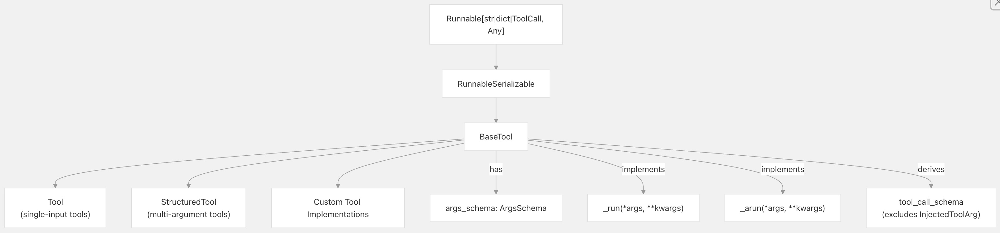  
  
**源文件：**  
- `libs/core/langchain_core/tools/base.py`   
  
### Schema 验证与类型安全  
  
`BaseTool` 使用自定义元类（metaclass）在类定义时验证 Schema 注解，防止常见错误。    
```  
# ❌ This raises SchemaAnnotationError  
class BadTool(BaseTool):  
    args_schema: BaseModel = MySchema  # Missing type[...]  
      
# ✅ Correct annotation  
class GoodTool(BaseTool):  
    args_schema: type[BaseModel] = MySchema  
```  
  
**源文件：**  
- `libs/core/langchain_core/tools/base.py`  
- `libs/core/tests/unit_tests/test_tools.py`   
  
## 从函数创建工具  
  
LangChain 提供多种方式将 Python 函数转换为工具，并自动推断 Schema。  
  
### `@tool` 装饰器  
  
`@tool` 装饰器可将任意函数转换为 `StructuredTool`：  
  
**从函数到工具的转换**  
  
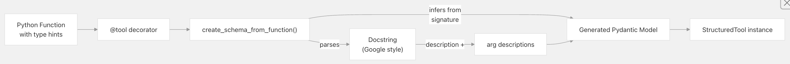  
  
示例用法  
```  
@tool  
def search_api(query: str, max_results: int = 10) -> str:  
    """Search the API for the query.  
      
    Args:  
        query: The search query string  
        max_results: Maximum number of results to return  
    """  
    return f"Results for {query}"  
```  
  
该装饰器会：  
- 1、提取函数签名和类型提示  
- 2、解析文档字符串以获取描述（Google 样式格式）  
- 3、创建具有与参数匹配的字段的 Pydantic 模型  
- 4、返回 `StructuredTool` 生成的模式  
  
**源文件：**  
- `libs/core/langchain_core/tools/base.py`   
- `libs/core/tests/unit_tests/test_tools.py`   
  
### Schema 推断流程  
  
`create_schema_from_function` 工具负责生成 Schema：  
  
**Schema 创建流水线**  
  
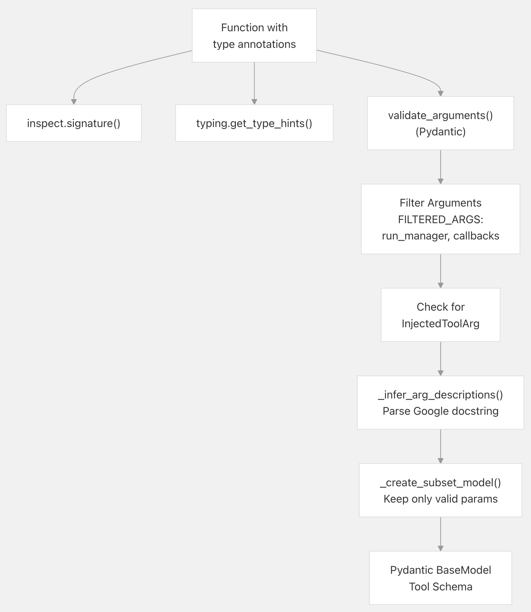  
  
关键特性：  
- 自动过滤：`run_manager` 和 `callbacks` 参数不会包含在 Schema 中；  
- 文档字符串解析：从 Google 风格的文档字符串(Google-style docstrings)中提取的参数描述  
- 注入参数处理：标记为 `InjectedToolArg` 的参数不会出现在工具调用中。  
- Pydantic 版本兼容性：适用于 Pydantic v1 和 v2  
  
**源文件：**  
- `libs/core/langchain_core/tools/base.py`     
- `libs/core/langchain_core/utils/function_calling.py`   
  
### `StructuredTool.from_function()`  
  
如需更多控制，可使用工厂方法：  
```  
def my_tool(x: int, y: str) -> dict:  
    """Does something."""  
    return {"x": x, "y": y}  
  
tool = StructuredTool.from_function(  
    func=my_tool,  
    name="custom_name",  
    description="Custom description",  
    args_schema=CustomSchema,  # Optional: override inferred schema  
)  
```  
  
**源文件：**  
- `libs/core/langchain_core/tools/structured.py`   
- `libs/core/tests/unit_tests/test_tools.py`   
  
## Schema 定义模式(Patterns)  
  
### (Explicit)显式 Pydantic 模型  
  
为获得最大控制，可显式定义 Schema：  
```  
class SearchSchema(BaseModel):  
    query: str = Field(description="The search query")  
    max_results: int = Field(default=10, description="Max results")  
    filters: dict | None = Field(default=None, description="Optional filters")  
  
class SearchTool(BaseTool):  
    name: str = "search"  
    description: str = "Search the database"  
    args_schema: type[BaseModel] = SearchSchema  
      
    def _run(self, query: str, max_results: int = 10,   
             filters: dict | None = None) -> str:  
        # Implementation  
        pass  
```  
  
**源文件：**  
- `libs/core/tests/unit_tests/test_tools.py`   
  
### JSON Schema 字典  
  
适用于动态 Schema 或外部集成：  
```  
tool = StructuredTool.from_function(  
    func=my_func,  
    name="json_schema_tool",  
    args_schema={  
        "type": "object",  
        "properties": {  
            "arg1": {"type": "integer", "description": "First arg"},  
            "arg2": {"type": "string", "enum": ["a", "b", "c"]}  
        },  
        "required": ["arg1", "arg2"]  
    }  
)  
```  
  
**源文件：**  
- `libs/core/tests/unit_tests/test_tools.py`   
  
### `tool_call_schema` 属性  
  
`BaseTool` 提供 `tool_call_schema` 属性，返回用于 LLM 工具调用的 Schema。它与 `args_schema` 的区别在于排除了注入参数(injected arguments)：  
```  
# args_schema includes ALL parameters  
tool.args_schema  # Has: query, max_results, run_manager  
  
# tool_call_schema excludes injected args  
tool.tool_call_schema  # Has: query, max_results (run_manager excluded)  
```  
  
**转换流程：**    
  
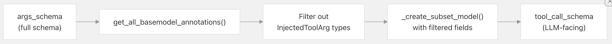  
  
**源文件：**  
- `libs/core/langchain_core/tools/base.py`   
  
---  
  
## 函数调用 Schema 转换  
  
LangChain 提供工具，用于在不同 LLM 提供商格式之间转换工具 Schema。  
  
### OpenAI 函数格式  
  
`convert_to_openai_function()` 工具可将 LangChain 工具转换为 OpenAI 的函数调用 Schema：  
  
**OpenAI 函数 Schema 结构**    
  
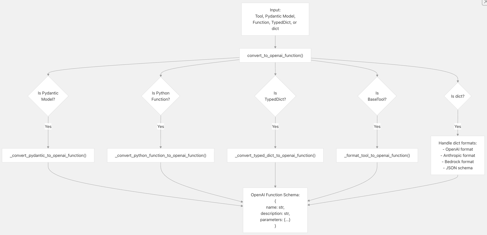  
  
**OpenAI 工具格式：**    
```  
from langchain_core.utils.function_calling import convert_to_openai_tool  
  
# Converts to:  
# {  
#   "type": "function",  
#   "function": {  
#     "name": "search",  
#     "description": "Search the database",  
#     "parameters": {  
#       "type": "object",  
#       "properties": {  
#         "query": {"type": "string", "description": "Search query"}  
#       },  
#       "required": ["query"]  
#     }  
#   }  
# }  
tool_schema = convert_to_openai_tool(my_tool)  
```  
  
**源文件：**  
- `libs/core/langchain_core/utils/function_calling.py`   
  
### 多提供商格式支持  
  
转换工具支持多种输入格式：  
  
| 输入格式 | 示例 | 转换路径 |  
|----------|------|----------|  
| OpenAI 格式 | `{"name": "...", "parameters": {...}}` | 直通（仅做最小验证） |  
| Anthropic 格式 | `{"name": "...", "input_schema": {...}}` | 将 `input_schema` 转为 `parameters` |  
| Bedrock Converse | `{"toolSpec": {"name": "...", "inputSchema": {"json": {...}}}}` | 从嵌套结构中提取 |  
| JSON Schema | `{"title": "...", "properties": {...}}` | 将 `title` 转为 `name` |  
  
**跨提供商转换**    
  
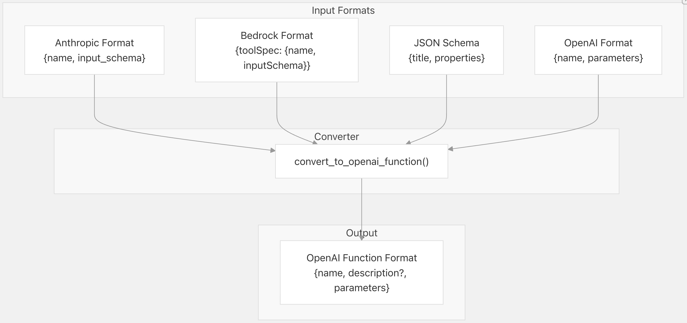  
  
**源文件：**  
- `libs/core/langchain_core/utils/function_calling.py`  
- `libs/core/tests/unit_tests/utils/test_function_calling.py`  
  
### 严格模式（Strict Mode）与额外属性  
  
对于 OpenAI 的严格模式（保证 Schema 严格遵循），可使用 `strict=True` 参数：  
```  
function_schema = convert_to_openai_function(tool, strict=True)  
  
# Adds "strict": True and sets additionalProperties: false recursively  
# {  
#   "name": "...",  
#   "parameters": {  
#     "type": "object",  
#     "properties": {...},  
#     "additionalProperties": false  # Added for all object types  
#   },  
#   "strict": true  
# }  
```  
  
`strict` 标志(flag)会递归地为所有对象 Schema 添加 `"additionalProperties": false`，以满足 OpenAI 要求。  
  
**源文件：**  
- `libs/core/langchain_core/utils/function_calling.py`   
  
## 工具执行流水线  
  
工具执行流水线负责输入解析、验证和调用。  
  
### 调用流程  
  
**工具执行流水线**    
  
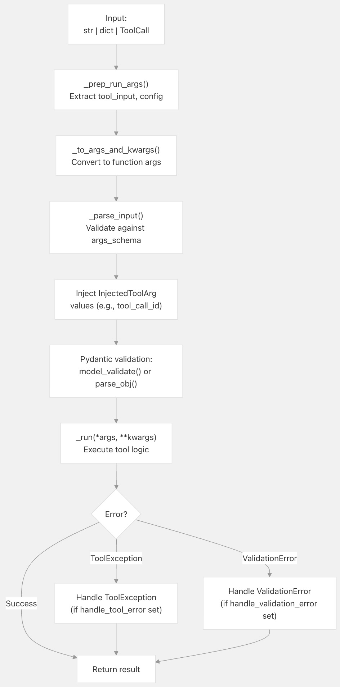    
  
**源文件：**  
- `libs/core/langchain_core/tools/base.py`   
  
### 输入解析与验证  
  
`_parse_input` 方法处理三种输入类型：  
  
1、**字符串输入**：适用于单参数工具；  
- Wraps in dict with single key from `args_schema`  
- Validates against schema  
  
2、**字典输入**：适用于多参数工具；  
- 验证每个字段  
- 注入 `InjectedToolArg` 值  
- 返回已验证的字典  
  
3、**ToolCall 输入**：来自 LLM 的工具调用。  
- 提取 `args` 字典  
- 验证并注入为字典  
  
**验证逻辑：**    
```  
# From _parse_input method  
if isinstance(tool_input, str):  
    if args_schema is dict:  
        raise ValueError("String inputs not allowed with JSON schema")  
    key = next(iter(get_fields(args_schema).keys()))  
    args_schema.model_validate({key: tool_input})  
    return tool_input  
  
elif isinstance(tool_input, dict):  
    # Inject InjectedToolCallId if needed  
    for k, v in get_all_basemodel_annotations(args_schema).items():  
        if _is_injected_arg_type(v, injected_type=InjectedToolCallId):  
            if tool_call_id is None:  
                raise ValueError("InjectedToolCallId requires tool_call_id")  
            tool_input[k] = tool_call_id  
      
    result = args_schema.model_validate(tool_input)  
    return {k: getattr(result, k) for k in tool_input}  
```  
  
**源文件：**  
- `libs/core/langchain_core/tools/base.py`   
  
### 错误处理  
  
`BaseTool` 提供两种错误处理机制：  
  
**错误处理配置**    
  
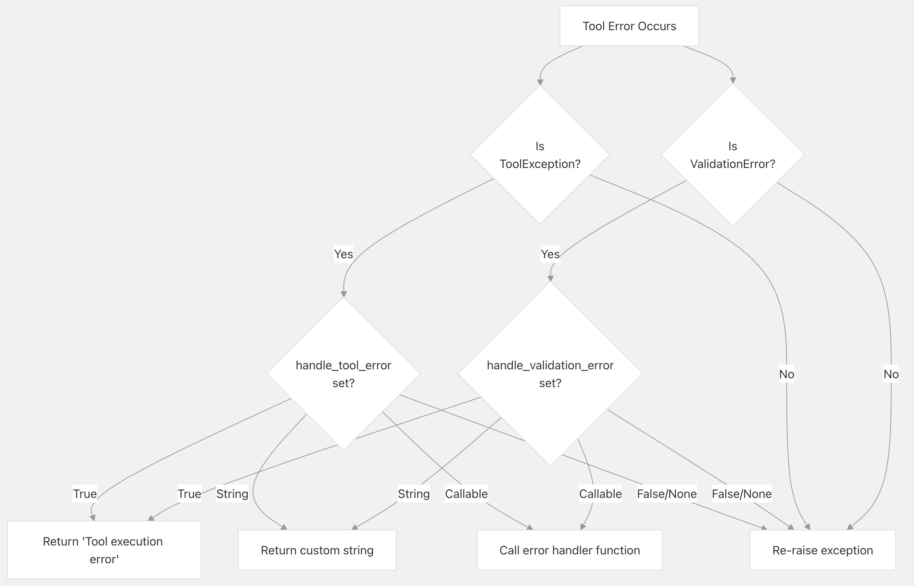  
  
**示例：**    
```  
# Boolean: return generic error message  
tool = MyTool(handle_tool_error=True)  
# Returns "Tool execution error" on ToolException  
  
# String: return custom message  
tool = MyTool(handle_tool_error="Something went wrong")  
# Returns "Something went wrong" on ToolException  
  
# Callable: custom error handling  
def handle_error(e: ToolException) -> str:  
    log_error(e)  
    return f"Error: {e}"  
  
tool = MyTool(handle_tool_error=handle_error)  
# Calls handle_error(e) on ToolException  
```  
  
**源文件：**  
- `libs/core/langchain_core/tools/base.py`     
- `libs/core/tests/unit_tests/test_tools.py`   
  
  
## `InjectedToolArg` 模式(Pattern)  
  
`InjectedToolArg` 模式允许工具在运行时接收上下文参数，而无需将这些参数暴露给 LLM。  
  
### 核心类型  
```  
from typing import Annotated  
from langchain_core.tools.base import InjectedToolArg, InjectedToolCallId  
  
# Generic injected argument  
InjectedToolArg = Annotated[T, "injected"]  
  
# Specific: receives the tool call ID  
InjectedToolCallId = Annotated[str, InjectedToolArg]  
```  
  
**InjectedToolArg 类型层次结构**  
  
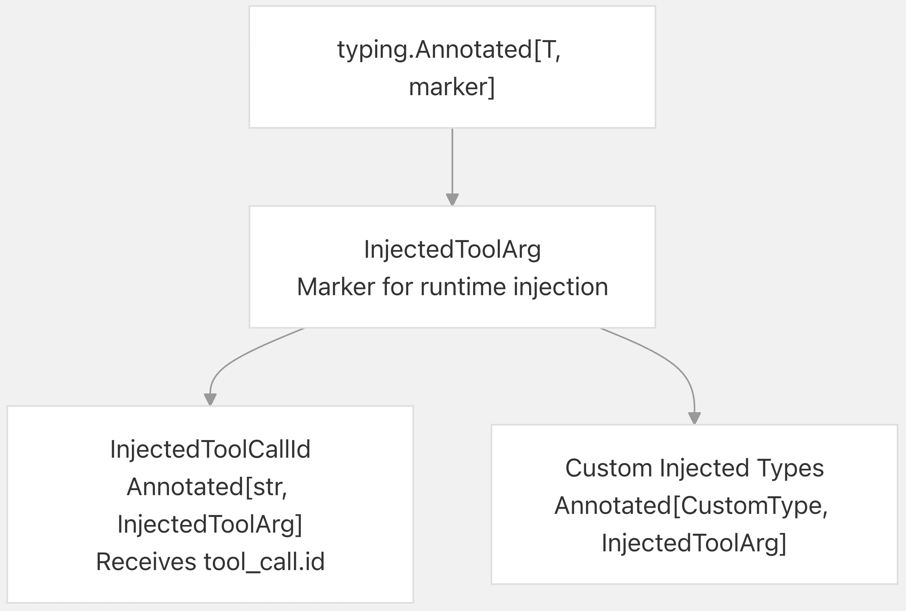    
  
### 使用示例  
  
```  
from typing import Annotated  
from langchain_core.tools import tool  
from langchain_core.tools.base import InjectedToolCallId  
  
@tool  
def my_tool(  
    query: str,  
    tool_call_id: Annotated[str, InjectedToolCallId]  
) -> str:  
    """Execute a query.  
      
    Args:  
        query: The search query  
    """  
    # tool_call_id is automatically injected, not in LLM schema  
    log_call(tool_call_id, query)  
    return f"Results for {query}"  
  
# The generated schema excludes tool_call_id:  
# {  
#   "name": "my_tool",  
#   "parameters": {  
#     "properties": {  
#       "query": {"type": "string", "description": "The search query"}  
#     },  
#     "required": ["query"]  
#   }  
# }  
```  
  
**源文件：**  
- `libs/core/langchain_core/tools/base.py`   
- `libs/core/tests/unit_tests/test_tools.py`   
  
### Schema 过滤  
  
Schema 过滤发生在多个环节：  
- 1、Schema 创建：`create_schema_from_function()` 在 `include_injected=False` 时排除注入参数；  
- 2、tool_call_schema：始终排除 LLM 消耗的注入参数  
- 3、验证：`_parse_input()` 在验证前注入值。  
  
  
**过滤流程：**    
  
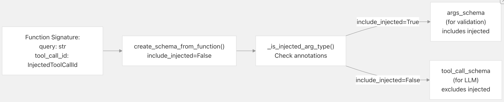    
  
**源文件：**  
- `libs/core/langchain_core/tools/base.py`   
  
### 执行期间的注入  
  
当工具以 `ToolCall` 对象（包含 `tool_call_id`）调用时，`tool_call_id` 值会被自动注入：  
```  
# From _parse_input method  
for k, v in get_all_basemodel_annotations(input_args).items():  
    if _is_injected_arg_type(v, injected_type=InjectedToolCallId):  
        if tool_call_id is None:  
            raise ValueError(  
                "When tool includes an InjectedToolCallId argument, "  
                "tool must always be invoked with a full model ToolCall"  
            )  
        tool_input[k] = tool_call_id  # Inject the value  
```  
  
这确保了 `tool_call_id` 参数可用：  
- LLM 永远看不到 `tool_call_id` 参数  
- 工具实现自动接收 ID  
- 验证通过，因为值在验证之前被注入  
  
**源文件：**  
- `libs/core/langchain_core/tools/base.py`   
  
## 工具与聊天模型的集成  
  
### 将工具绑定到模型  
  
聊天模型通过 `bind_tools()` 方法绑定工具：  
```  
from langchain_core.tools import tool  
  
@tool  
def search(query: str) -> str:  
    """Search for information."""  
    return f"Results for {query}"  
  
# Bind tool to model  
model_with_tools = model.bind_tools([search])  
  
# Model can now call the tool  
response = model_with_tools.invoke("Search for Python tutorials")  
# response.tool_calls contains tool invocation requests  
```  
  
**与聊天模型的工具调用流程**    
  
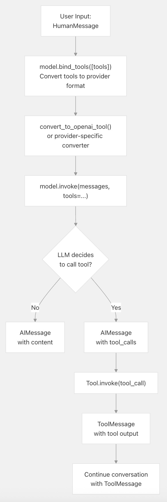    
  
**源文件：**  
- `libs/core/langchain_core/language_models/chat_models.py`   
  
### ToolCall 结构  
  
当 LLM 决定调用工具时，会返回一个包含 `tool_calls` 的 `AIMessage`：  
```  
# AIMessage.tool_calls structure  
[  
    {  
        "name": "search",  
        "args": {"query": "Python tutorials"},  
        "id": "call_abc123",  # Provider-generated ID  
        "type": "tool_call"  
    }  
]  
```  
  
该 `ToolCall` 字典可直接传给 `Tool.invoke()`：  
```  
tool_call = response.tool_calls[0]  
result = search.invoke(tool_call)  
# Returns ToolMessage with the result  
```  
  
**源文件：**  
- `libs/core/langchain_core/messages/tool.py`   
- `libs/core/langchain_core/tools/base.py`  
  
### 提供商特定的工具格式  
  
不同提供商要求不同的工具 Schema 格式。LangChain 会透明地处理转换：  
  
| 提供商 | 格式转换器 | 关键差异 |  
|--------|------------|----------|  
| OpenAI | `convert_to_openai_tool()` | 使用 `parameters` 键，支持 `strict` 模式 |  
| Anthropic | 自定义转换 | 使用 `input_schema` 键，支持 `cache_control` |  
| Bedrock | 自定义转换 | 使用嵌套的 `toolSpec.inputSchema.json` 结构 |  
| 其他 | 自定义转换 | 使用不同的属性名 |  
  
`bind_tools()` 方法会根据模型类型自动选择合适的转换器。  
  
**源文件：**  
- `libs/core/langchain_core/utils/function_calling.py`   
  
## 工具响应格式  
  
### Content vs. Content-and-Artifact  
  
`response_format` 属性控制工具输出的结构：  
  
**Content 格式（默认）**：仅返回内容。  
```  
tool = MyTool(response_format="content")  
result = tool.invoke(input)  
# result = "simple string output"  
# Converted to: ToolMessage(content="simple string output")  
```  
  
**Content-and-Artifact 格式**：同时返回内容和附加产物（artifact）。  
```  
tool = MyTool(response_format="content_and_artifact")  
result = tool.invoke(input)  
# result = ("user-facing message", {"data": "artifact"})  
# Converted to: ToolMessage(  
#     content="user-facing message",  
#     artifact={"data": "artifact"}  
# )  
```  
  
**响应格式处理**    
  
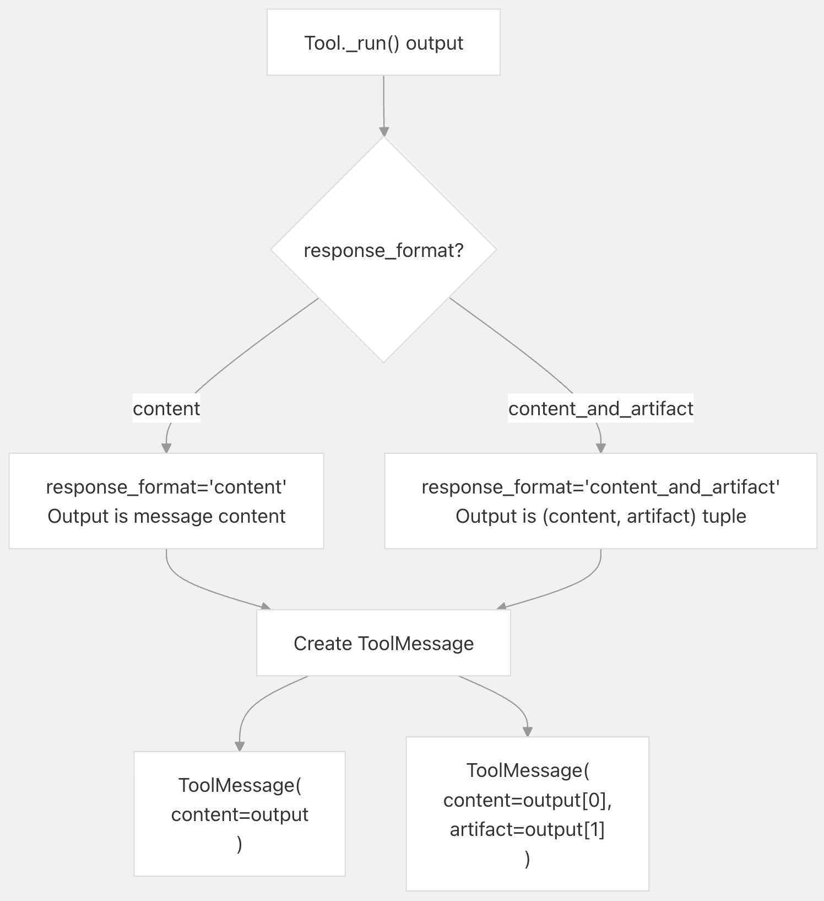    
  
artifact 模式适用于：  
- 返回结构化数据的同时附带人类可读的消息  
- 保留原始(raw) API 响应，同时提供格式化的输出  
- 支持结构化结果的下游处理  
  
**源文件：**  
- `libs/core/langchain_core/tools/base.py`  
  
## 总结  
  
LangChain 工具系统提供：  
  
- 统一的工具抽象（`BaseTool`）；具有模式验证的所有工具的统一接口.   
- 自动 Schema 推断与验证；将函数转换为具有类型提示和文档字符串的工具.   
- 多格式支持；在 OpenAI、Anthropic 和其他提供商之间转换模式.  
- 强大的验证；基于 Pydantic 的输入验证，具有自定义错误处理功能.  
- InjectedToolArg 模式；注入运行时上下文而不暴露给 LLM.  
- 灵活的响应；支持简单内容和内容工件模式.  
  
该架构使开发者只需定义一次工具，即可在不同 LLM 提供商间复用，享受自动的 Schema 转换与验证能力。  
    
#### [期望 PostgreSQL|开源PolarDB 增加什么功能?](https://github.com/digoal/blog/issues/76 "269ac3d1c492e938c0191101c7238216")
  
  
#### [PolarDB 开源数据库](https://openpolardb.com/home "57258f76c37864c6e6d23383d05714ea")
  
  
#### [PolarDB 学习图谱](https://www.aliyun.com/database/openpolardb/activity "8642f60e04ed0c814bf9cb9677976bd4")
  
  
#### [PostgreSQL 解决方案集合](../201706/20170601_02.md "40cff096e9ed7122c512b35d8561d9c8")
  
  
#### [德哥 / digoal's Github - 公益是一辈子的事.](https://github.com/digoal/blog/blob/master/README.md "22709685feb7cab07d30f30387f0a9ae")
  
  
#### [About 德哥](https://github.com/digoal/blog/blob/master/me/readme.md "a37735981e7704886ffd590565582dd0")
  
  

  
