## AI论文解读 | Relaxed Operator Fusion for In-Memory Databases: Making Compilation, Vectorization, and Prefetching Work Together At Last
        
### 作者        
digoal        
        
### 日期        
2025-10-18        
        
### 标签        
PostgreSQL , PolarDB , DuckDB , AI , 论文解读        
        
----        
        
## 背景  
      
https://www.vldb.org/pvldb/vol11/p1-menon.pdf        
  
提示:          
```          
读懂《Relaxed Operator Fusion for In-Memory Databases: Making Compilation, Vectorization, and Prefetching Work Together At Last》这篇论文需要提前掌握哪些基础知识, 请使用中文通熟易懂的讲解这些基础知识, 可以引用论文中的图、表或使用Markdown支持的图形(text,mermaid等)增加解释性. 
  
使用中文通熟易懂的解读《Relaxed Operator Fusion for In-Memory Databases: Making Compilation, Vectorization, and Prefetching Work Together At Last》这篇论文, 其中的关键内容请着重讲解, 可以引用论文中的图、表或使用Markdown支持的图形(text,mermaid等)增加解释性. 
  
提取《Relaxed Operator Fusion for In-Memory Databases: Making Compilation, Vectorization, and Prefetching Work Together At Last》这篇论文中的重要术语, 使用中文对这些术语进行通熟易懂的讲解, 可以引用论文中的图、表或使用Markdown支持的图形(text,mermaid等)增加解释性. 
```     
  
## 1 前置知识 
  
要读懂这篇论文《Relaxed Operator Fusion for In-Memory Databases: Making Compilation, Vectorization, and Prefetching Work Together At Last》，你需要对数据库系统和现代计算机体系结构有一些基本了解。这篇论文的核心是提出一种新的查询处理模型，叫作“松弛算子融合”（Relaxed Operator Fusion, ROF），它巧妙地结合了三种CPU优化技术： **查询编译（Compilation）** 、 **向量化（Vectorization, SIMD）** 和 **预取（Prefetching）** 。

以下是理解这篇论文所需的核心基础知识，我会用通俗的语言为你讲解：

### 1. 内存数据库 (In-Memory Databases)

* **是什么？**
    传统的数据库把数据主要存储在较慢的硬盘（HDD或SSD）上。而“内存数据库”（In-Memory DBMS）则把主要数据都放在速度极快的内存（DRAM）中 。
* **为什么重要？**
    因为内存的访问速度比硬盘快成千上万倍。当数据都在内存中时，查询的瓶颈就不再是等待硬盘读取数据（I/O瓶颈），而是转移到了CPU的处理速度上（CPU瓶颈）。因此，这篇论文研究的所有技术，都是为了榨干CPU的性能。

### 2. 数据库查询处理模型

当你向数据库发送一条SQL查询语句时，数据库会先把它转换成一个“查询计划”（Query Plan），就像一个执行步骤的蓝图。然后，“查询执行引擎”会来执行这个计划。

#### a. 算子 (Operators) 和火山模型 (Volcano Model)
* **是什么？**
    查询计划由一系列“算子”组成，比如“表扫描”（Scan）、“过滤”（Filter, 论文中用 $\sigma$ 表示）、“连接”（Join, 论文中用 $\bowtie$ 表示）、“聚合”（Aggregate, 论文中用 $\Gamma$ 表示）等 。

    传统的执行模型叫“火山模型”或“一次一元组”（Tuple-at-a-time）模型 。你可以把它想象成一条 **“按需取货”** 的流水线：
    1.  最顶层的算子（如“输出结果”）需要一个数据。
    2.  它就向它的子算子（如“聚合”）要一个数据。
    3.  “聚合”算子就向它的子算子（如“连接”）要一个数据...
    4.  ...一直传递到最底层的“表扫描”算子，从表中取出 **一条数据（元组）** ，然后层层向上传递和处理。
* **有什么问题？**
    这种模型在现代CPU上效率很低。因为每处理一条数据，都要在不同算子（函数）之间来回调用，开销很大 。更重要的是，它**无法**很好地利用我们稍后要讲的“向量化”和“预取”技术，因为这两种技术都需要**一次性看到和处理“一批”数据** 。

#### b. 查询编译 (Query Compilation) 和算子融合 (Operator Fusion)
* **是什么？**
    为了解决火山模型的低效问题，现代内存数据库（如Hyper）采用“查询编译”（Query Compilation）技术 。它不再“解释”执行查询计划，而是把整个查询计划（或计划的一部分） **编译成高效的本地机器码** （Native Code）。

    与编译相伴的，就是“算子融合”（Operator Fusion）。它会把流水线上连续的多个算子“融合”进一个大的循环（Loop）中。

* **举个例子：**
    请看论文的 **Figure 2a** 和 **Figure 2c**。  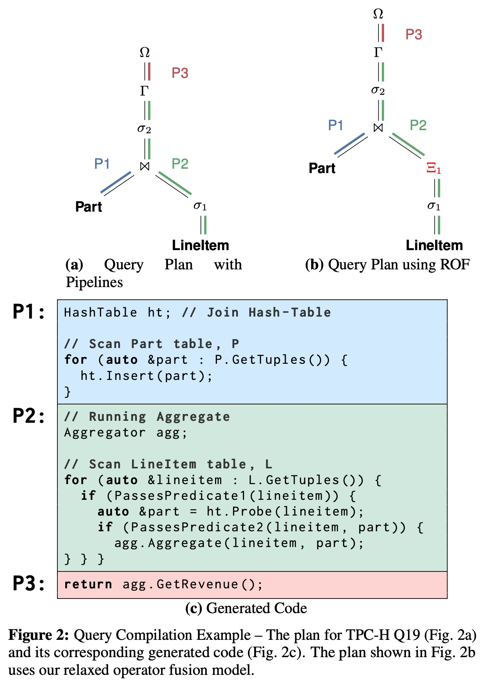  
    * Figure 2a 中的 **P2** 是一个“流水线”（Pipeline），它包含了`Scan LineItem`、`Join` (ht.Probe) 和 `Aggregate` (agg.Aggregate) 三个算子 。
    * 在 Figure 2c 的代码中，这三个操作**被融合在同一个 `for` 循环里** (代码块P2)。
    * **好处：** 数据（元组）从`Scan`到`Join`再到`Aggregate`，是直接通过CPU的**寄存器**（CPU内部最快的存储）传递的 ，完全不需要写入内存。这极大地减少了“物化”（Materialization，即把中间结果写回内存）的开销 。

* **有什么问题？**
    这看起来很完美，但它本质上还是“一次一元组”的处理模式（循环体每次处理一个`lineitem`）。这就导致了它与下面两项强大的CPU优化技术**存在根本冲突** 。

### 3. 现代CPU优化技术

这篇论文的重点，是让以下两种技术与“查询编译”协同工作。

#### a. 向量化 (Vectorization / SIMD)
* **是什么？**
    SIMD 的全称是“单指令，多数据”（Single Instruction, Multiple Data）。你可以把它想象成：
    * 普通CPU指令是“小勺子”，一次只能处理一个数据（比如 `a + b`）。
    * SIMD指令是“大铲子”，一次可以同时处理多个数据（比如 `[a1, a2, a3, a4] + [b1, b2, b3, b4]`，一步到位）。
* **为什么重要？**
    它能极大地提升计算吞吐量 。
* **如何用于数据库？**
    论文的 **Figure 3** 展示了向量化模型 。注意看 P2 的代码，它不再是 `L.GetTuples()`（一次一个），而是 `L.GetBlocks()`（一次一批）。`PassesPredicate1` 函数也是对一整个 `block` 的数据进行处理 。  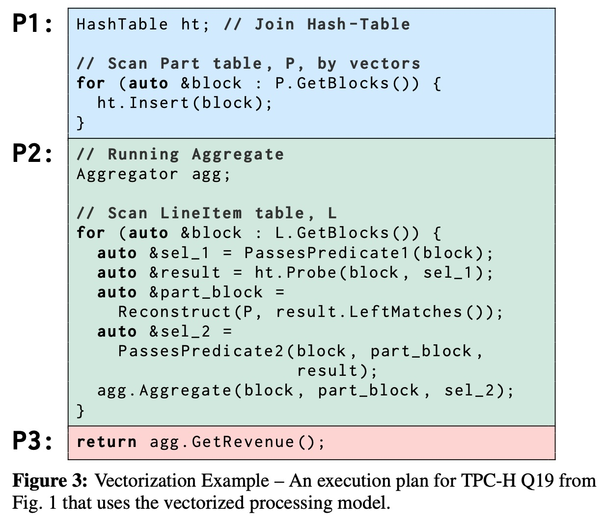  
* **冲突点：**
    “算子融合”是“一次一元组”的，而 SIMD 需要“一次一批（向量）”数据 。你不能同时做到这两点。

#### b. 预取 (Prefetching)
* **是什么？**
    CPU访问内存（DRAM）其实还是“很慢”的（相比于CPU的计算速度）。如果CPU需要的数据不在它自己的高速缓存（CPU Caches）里，就会发生“缓存未命中”（Cache Miss），CPU就必须停下来 **“空等”** 数据从内存过来 。

    “预取”（Prefetching）就是CPU提前发出指令，“预先”去内存把“稍后”可能会用到的数据加载到缓存中 。这样，等CPU真正需要这个数据时，它已经在缓存里了，就不用空等了 。
* **为什么重要？**
    它可以“隐藏”访问内存的延迟（Latency）。
* **冲突点：**
    为了能有效地隐藏延迟，你必须**提前好几条数据**就发出预取指令 。但“算子融合”模型是“一次一元组”的，当你拿到当前元组时，你根本不知道下一个元组是什么（或者说，你没有一个“元组列表”可以让你提前预取）。

### 4. 核心冲突与论文的解决方案

#### 核心冲突 (The Problem)

**“算子融合”** 和 **“向量化/预取”** 是一对冤家：
1.  **算子融合（编译）** ：追求“一次一元组” + “寄存器传递”，**目标是消除内存物化** 。
2.  **向量化/预取**：追求“一次一批元组”，**目标是利用SIMD和隐藏内存延迟** 。

强行把它们合在一起，效果很差。比如论文在 **Figure 4** 的微基准测试中就发现，在处理大数据集（哈希表大于缓存）时，单纯的SIMD（绿色方块线）性能甚至不如简单的标量（蓝色圆圈线），而预取（红色三角线）的效果是最好的 。 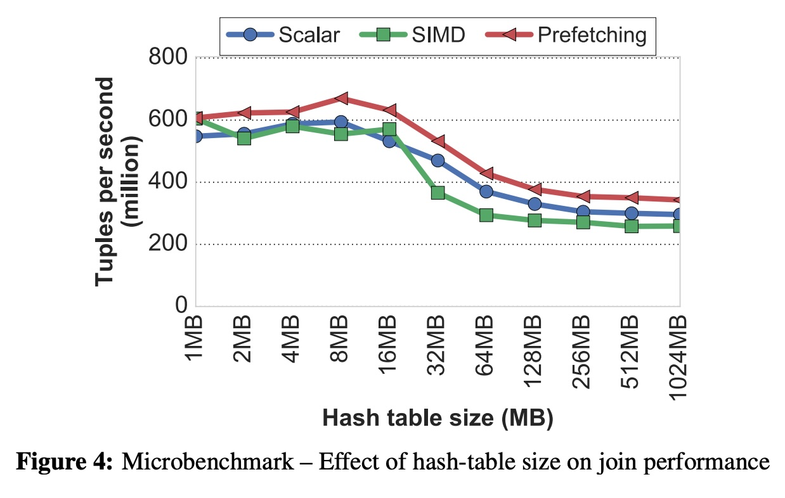  

#### 论文的解决方案：松弛算子融合 (Relaxed Operator Fusion - ROF)

既然“完全融合”不行，那我们就在需要的地方“松弛”一下。
ROF 的核心思想是：**在查询计划中“策略性地”引入临时的“物化点”，称为“阶段”（Stages）** 。

* **它如何工作？**
    请看 **Figure 2b** 和 **Figure 5**。
    1.  **引入“阶段边界”** ：对比 Figure 2a，Figure 2b 在第一个过滤算子 $\sigma_1$ 之后，插入了一个新的符号 $\Xi_1$ 。这就是一个“阶段边界”（Stage Boundary）。    
    2.  **生成阶段性代码**：请看 Figure 5 的代码。P2流水线被拆分成了两个阶段（Stage #1 和 Stage #2）。  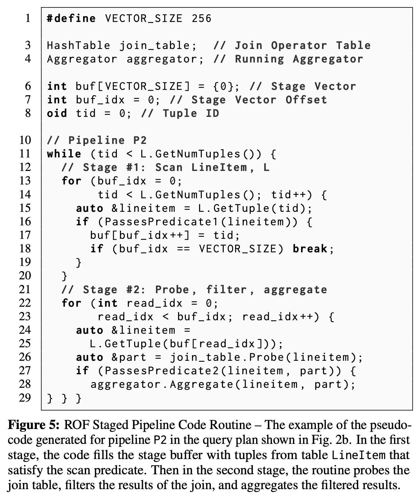  
    3.  **阶段 #1（生产数据）** ：(lines 13-20)  它执行`Scan`和`Predicate1`。如果一个元组通过了过滤，它**不会**立即被交给下一个算子（Join），而是把它（的ID）存入一个**临时的、很小（能放入CPU缓存）的缓冲区 `buf`** 中 。
    4.  **阶段 #2（消费数据）** ：(lines 22-30)  当 `buf` 满了（或者数据源读完了），执行流程切换到阶段 #2。阶段 #2 **以 `buf` 这个“向量”作为输入**，循环处理这批数据 。

* **ROF 为什么能成功？**
    这个小小的 `buf` 缓冲区是点睛之笔：
    1.  **它启用了向量化（SIMD）** ：像阶段 #1 这样的过滤操作，可以非常容易地使用 SIMD 指令来批量处理数据，然后把结果（一个位掩码 Bitmask）高效地转换成存活元组的ID列表（如 Figure 6 所示）。 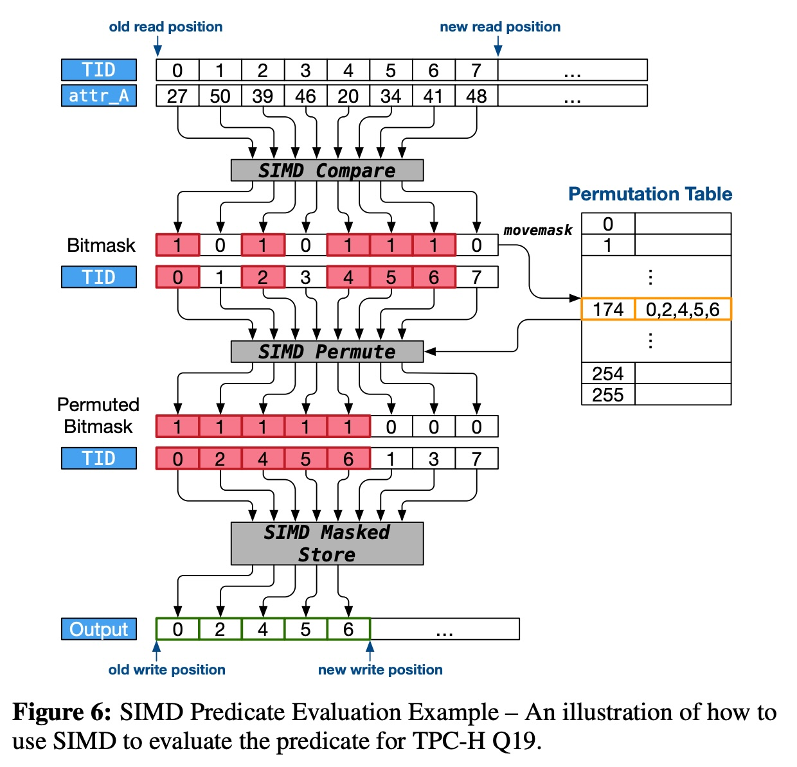  
    2.  **它启用了预取（Prefetching）** ：当阶段 #2 拿到 `buf` 这个缓冲区时，它就得到了一个 **“元组列表”** 。此时，它就可以在处理第 `i` 个元组时，**提前预取**第 `i+k` 个元组需要的数据（比如哈希表中的桶）。这就解决了“算子融合”模型无法预取的难题。
    3.  **它保持了融合的优势**：在一个“阶段”（Stage）内部，比如阶段 #2 中，`Probe`、`Predicate2` 和 `Aggregate` 仍然是**紧密融合**的（见 lines 26-28），数据依然在寄存器中高效传递。

### 总结

要理解这篇论文，你需要掌握的知识点可以总结为：

1.  **背景**：在“内存数据库”中，“CPU”是瓶颈 。
2.  **经典模型**：“火山模型”（一次一元组）效率低 。
3.  **现有优化**：“算子融合”（编译）通过消除内存写入来提速，但它“一次一元组”的特性...
4.  **CPU特性**：...与“向量化（SIMD）”和“预取”（都需要“一次一批”）产生了**根本冲突** 。
5.  **本文方案 (ROF)**：通过在流水线中插入临时的“缓存缓冲区”（Staging Points），ROF 既保留了阶段内部的“算子融合”优势，又在阶段之间创造了“数据向量”，从而一举三得，让**编译、向量化和预取**终于能“协同工作”。
  
## 2 解读论文 
  
这是一篇在数据库领域非常经典的论文。它解决了一个核心的“三难”困境：如何在内存数据库中，让**查询编译**、**向量化（SIMD）和内存预取**这三项强大的CPU优化技术“和平共处”。

简单来说，这篇论文提出了一种名为 **“松弛算子融合”（Relaxed Operator Fusion, ROF）** 的新查询处理模型，它巧妙地在“完全融合”和“完全不融合”之间找到了一个最佳平衡点，从而榨干了现代CPU的性能。

-----

### 一、 核心背景：三项优化技术的“恩怨”

要读懂这篇论文，首先要理解它试图调和的三种技术，以及它们之间的根本**冲突**。

在现代内存数据库中，数据都在内存里，瓶颈不再是慢速的硬盘，而是CPU和内存访问速度 。因此，数据库工程师们想尽办法来加速CPU处理。

**1. 查询编译 (Compilation) + 算子融合 (Operator Fusion)**

  * **是什么？** 这是当时最先进的技术（如HyPer数据库）。它不做“一次一元组”的火山模型，而是将一个查询计划中的多个算子（如“扫描”-\>“过滤”-\>“聚合”） **“融合”成一个紧凑的 `for` 循环，并将其编译** 为本地机器码 。
  * **好处：** 效率极高。数据在算子间传递时，直接通过CPU寄存器（最快的地方）进行，几乎没有函数调用开销，也**避免了将中间结果写回内存** 。
  * **坏处：** 这种模型本质上还是 **“一次处理一个元组”** 。

**2. 向量化 (Vectorization / SIMD)**

  * **是什么？** SIMD（单指令多数据）是CPU的“大杀器”。普通指令是“小勺子”，一次处理一个数（`a+b`）；SIMD指令是“大铲子”，一次能同时处理一批数据（如8个、16个）。
  * **好处：** 大幅提升计算吞吐量。
  * **坏处：** 它要求 **“一次处理一批元组（一个向量）”** ，这与“算子融合”的“一次一个”模型完全冲突。

**3. 内存预取 (Prefetching)**

  * **是什么？** CPU访问内存（DRAM）其实“很慢”，如果数据不在CPU缓存（Cache）里，CPU就要“空等”。“预取”就是提前告诉CPU：“我待会儿要用某个内存地址的数据，你先去取过来”，以此来“隐藏”内存访问的延迟 。
  * **好处：** 大幅减少CPU等待时间，尤其是在数据不规则访问时（如哈希连接）。
  * **坏处：** 预取也需要“预知未来”。在“一次一元组”的模型里，你刚处理完元组 `i`，根本不知道元组 `i+1` 要访问什么内存地址，也就无法预取。它同样需要 **“一次拿到一批元组”** 。

#### 核心冲突

**“算子融合” vs “向量化/预取”**

  * **算子融合（编译）说：** “不要物化！不要把中间结果写回内存！数据在寄存器里跑最快！”
  * **向量化（SIMD）说：** “我需要一个数据向量（一批数据）才能工作！你得把中间结果‘物化’成一个批次给我！”
  * **预取（Prefetching）说：** “我需要一个元组列表来‘预知未来’！你得把中间结果‘物化’成一个列表给我！”

在ROF模型提出之前，大家非此即彼。要么选择“算子融合”来避免物化（但失去了SIMD和预取），要么选择“向量化”来使用SIMD（但频繁物化中间结果，且可能因内存延迟而失效）。

### 二、 关键证据：为什么“预取”至关重要？

论文做了一个关键的微基准测试（**Figure 4**），它比较了三种方式在执行哈希连接（一种典型的内存不规则访问操作）时的性能，横轴是哈希表的大小。

  

*(图解：重新绘制的 Figure 4 趋势图)*

  * **蓝线 (Scalar)：** 传统的“一次一元组”（算子融合）。
  * **绿线 (SIMD)：** 纯粹的向量化。
  * **红线 (Prefetching)：** 带预取的“一次一元组”。

**核心发现：**

1.  **数据小时（\< 32MB，能装进CPU缓存）：** 大家的性能都差不多。
2.  **数据大时（\> 32MB，超出CPU缓存）：**
      * SIMD（绿线）的性能**急剧下降** 。因为它虽然计算快，但CPU一直在“空等”内存数据，SIMD的优势荡然无存 。
      * **Prefetching（红线）成为了绝对的赢家** 。

**结论：** 对于超出CPU缓存的大数据查询， **预取（Prefetching）** 是压倒一切的最重要优化。而要实现预取，我们就必须拿到一个“元组列表”。

### 三、 解决方案：“松弛算子融合” (ROF)

既然预取这么重要，而预取又需要一个“元组列表”（即某种形式的物化），那么“完全不物化”的算子融合就是错的 。

ROF的思想是：**我们不需要“完全融合”，我们可以在流水线中“策略性地”引入临时的、非常小的物化点，称为“阶段”（Stages）** 。

这些“阶段”之间通过一个 **“CPU缓存友好”** 的向量（通常是元组ID列表）来通信 。

#### 核心示例 (Figure 2 & 5)

我们来看论文中TPC-H Q19的例子。

**1. 传统的“算子融合” (Figure 2a/2c)**
P2 流水线 (绿色部分) 是一个大循环，它融合了 `Scan`、`Probe` (Join)、`Predicate2` 和 `Aggregate`。数据在寄存器里“一条龙”处理完毕。

  

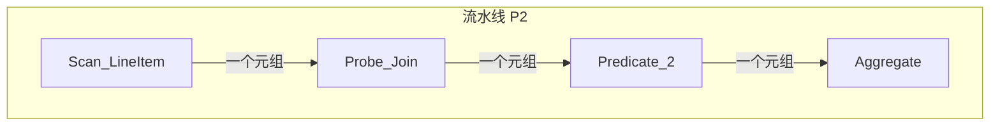

  * **优点：** 没有中间物化。
  * **缺点：** 无法SIMD，无法预取。

**2. “松弛算子融合” (ROF) (Figure 2b/5)**
ROF模型在 `Predicate1` ( $\sigma_1$ ) 之后，插入了一个“阶段边界” $\Xi_1$ 。

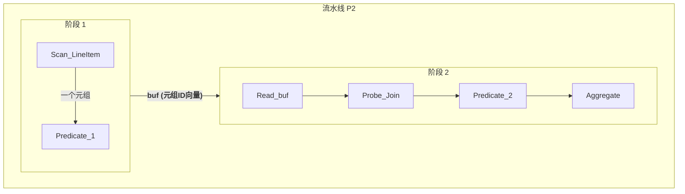

  * **执行过程 (见 Figure 5 的代码)：**    
      * **阶段 1 (lines 13-20):** CPU执行一个`for`循环，扫描`LineItem`表，执行`Predicate1` 。如果元组通过，**不马上处理它**，而是将其**ID**写入一个临时的、很小的缓冲区 `buf` 。
      * **切换：** 当 `buf` 满了（比如装满256个ID），或者表扫完了，切换到阶段2 。
      * **阶段 2 (lines 22-30):** CPU执行另一个`for`循环，**遍历这个 `buf` 缓冲区** 。对于 `buf` 中的每一个ID，它再去执行 `Probe`、`Predicate2` 和 `Aggregate`。

#### ROF 如何实现“一举三得”？

这个小小的 `buf` 缓冲区是点睛之笔：

1.  **它启用了 SIMD (向量化)：**
    在**阶段 1**，任务变成了“扫描数据，过滤，然后把ID写入缓冲区”。这个“过滤”操作（如图Figure 6所示）现在可以非常高效地使用SIMD指令来批量完成 。   

2.  **它启用了 Prefetching (预取)：**
    在**阶段 2**，CPU拿到了 `buf` 这个“元组ID列表”。当它处理 `buf[i]` 时，它已经“预知”了接下来要处理 `buf[i+1]`, `buf[i+2]`... `buf[i+16]`。因此，它可以在处理 `buf[i]` 的计算间隙，**提前发出预取指令**，去内存中抓取 `buf[i+16]` 所需的哈希桶数据 。这就完美地隐藏了内存访问延迟。

3.  **它保留了 Compilation (编译融合)：**
    在**一个阶段的内部**（比如阶段2），`Probe_Join`、`Predicate_2` 和 `Aggregate` 这几个操作**仍然是紧密融合的** 。数据依然可以在寄存器中高效传递。

ROF模型是**一个混合模型**：它在阶段之间是“向量化”的（传递 `buf`），在阶段内部是“元组级融合”的（寄存器传递）。

### 四、 实验效果

论文的实验结果证明了ROF的压倒性优势：

1.  **ROF vs 传统编译 (Figure 9)：**  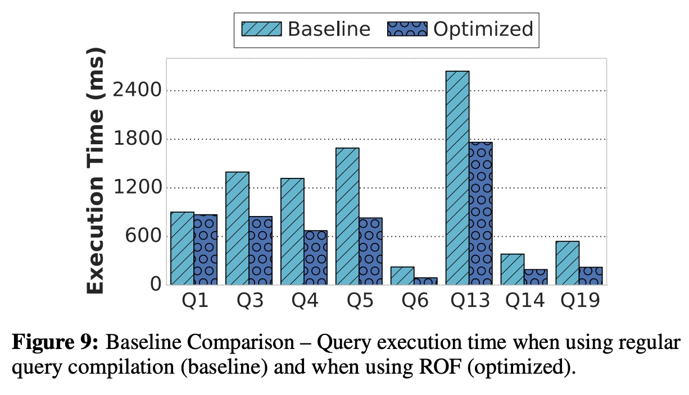  
    在大多数查询上（如Q3, Q4, Q14, Q19），ROF（优化的）比传统编译（基线）快了**1.7倍到2.5倍** 。

      * **Q14/Q19 (Figure 13/14):** 这些查询受益最大。因为它们有高选择性（过滤掉大量数据）的谓词，**阶段1的SIMD** 和 **阶段2的预取** 都发挥了巨大作用 。  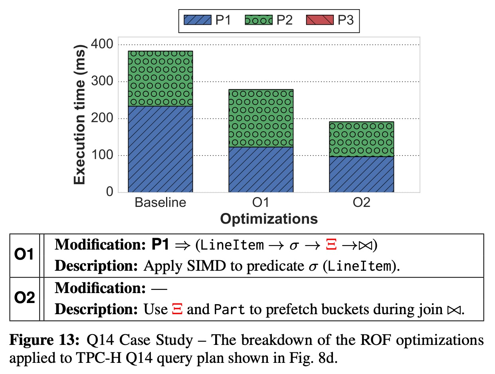  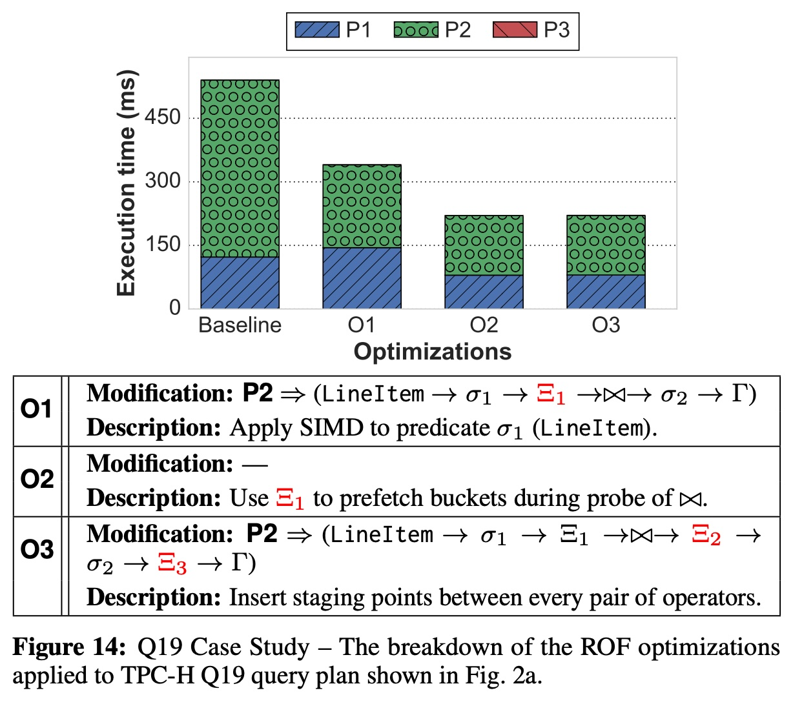  
      * **Q1 (Figure 10):** ROF几乎没有提升。原因是Q1的过滤谓词选择性很差（98%的数据都通过），且聚合用的哈希表极小（只有4项，常驻L1缓存）。对一个已在缓存的数据进行“预取”反而会增加开销 。这反向证明了ROF的优势在于处理**超出缓存**的大数据。 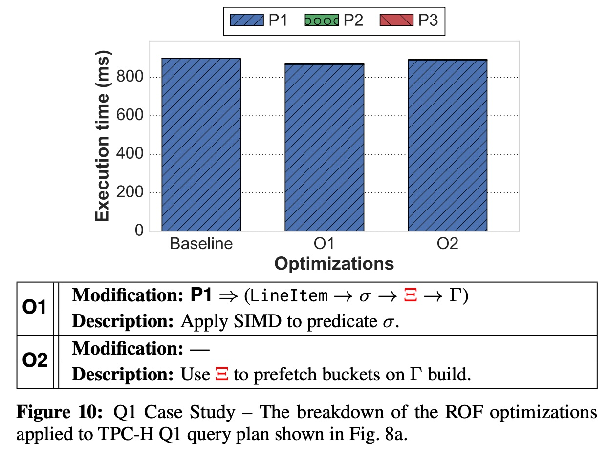  

2.  **ROF vs 其他数据库 (Figure 18)：**  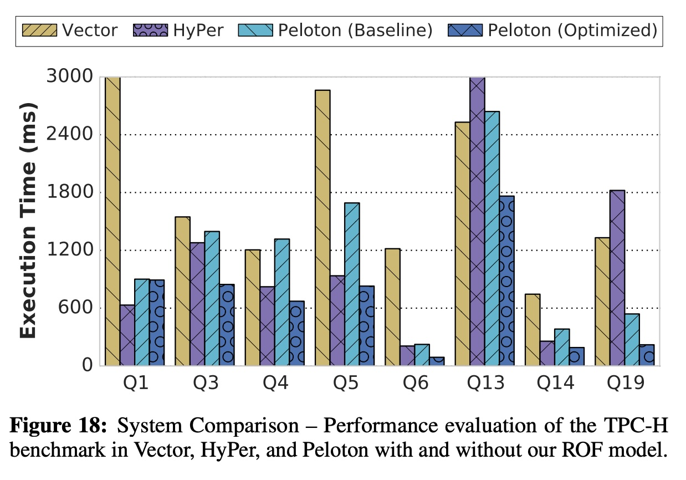  
    搭载ROF的Peloton系统，在多个复杂查询上（如Q3, Q14, Q19），性能均显著优于当时顶级的HyPer（纯编译融合）和Vector（纯向量化）。

### 总结

《Relaxed Operator Fusion》这篇论文解决了一个长期存在的冲突，证明了“为了融合而融合”的思路是片面的。它提出的ROF模型，通过在查询流水线中“策略性地”引入缓存友好的临时物化点（`buf`），成功地将**查询编译**的低开销、**SIMD**的高吞吐和**预取**的低延迟这三大优势集于一身，为现代内存数据库的查询引擎设计提供了全新的思路。
  
## 3 术语 
  
这篇论文的核心是提出一种名为 **“松弛算子融合”（Relaxed Operator Fusion, ROF）** 的新技术，以解决内存数据库中一个棘手的“三难”问题：如何让 **查询编译** 、**向量化（SIMD）和预取**这三种强大的CPU优化技术协同工作 。

以下是理解这篇论文所需的核心术语及其通俗讲解：

### 1\. 内存数据库 (In-Memory DBMS)

  * **讲解：**
    传统的数据库把数据主要存在硬盘 (HDD/SSD) 上，查询时最大的瓶颈是等待硬盘读取数据。内存数据库则把数据全部或主要部分都放在内存 (DRAM) 中 。
  * **为什么重要：**
    因为内存的访问速度比硬盘快成千上万倍，所以数据读取不再是瓶颈 。**瓶颈转移到了 CPU 的处理速度和访问内存的效率上** 。因此，这篇论文研究的所有技术都是为了榨干 CPU 性能。

### 2\. 查询编译 (Query Compilation)

  * **讲解：**
    当数据库收到一条 SQL 查询时，传统的“解释型”引擎会像翻译官一样，一步一步地“解释”执行查询计划。而“编译型”引擎则更进一步，它会像一个程序员一样，把整个查询计划（或其中一部分） **直接编译成高效的本地机器码** （例如 C++ 或 LLVM IR） 。
  * **好处：**
    编译后的代码运行速度远快于解释执行，因为它减少了大量的函数调用和分支预测错误 。

### 3\. 算子融合 (Operator Fusion)

  * **讲解：**
    这是查询编译技术中的“杀手锏”。它将查询计划中一系列连续的算子（如“扫描”-\>“过滤”-\>“连接”） **“融合”进同一个代码循环中** 。
  * **好处：**
    数据可以**直接在 CPU 寄存器（CPU 中最快的存储）中传递**，而不需要把中间结果写回内存 。
  * **类比：**
    想象一条装配线：
      * **无融合：** 工人A加工完零件，放回传送带（*物化到内存*）；工人B再从传送带拿起零件（*从内存读取*）。
      * **有融合：** 工人A加工完，**直接把零件递给**工人B（*在寄存器中传递*）。


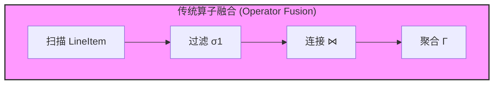

  * **核心问题：**
    这种模型虽然快，但它本质上还是 **“一次一元组” (Tuple-at-a-time)**  的处理模式 ，这与下面两个技术水火不容。

### 4\. 向量化 (Vectorization / SIMD)

  * **讲解：**
      * **向量化处理：** 指一次性处理一个“向量”（即一个“块”或“一批”）的数据，而不是一次一个 。
      * **SIMD：** “单指令，多数据”(Single Instruction, Multiple Data) 的缩写。这是现代 CPU 提供的一种特殊指令，可以**用一条指令同时对多个数据执行相同的操作** 。
  * **类比：**
    普通指令是“小勺子”，一次只能喂一口饭。SIMD 指令是“大铲子”，一次能喂好几口饭。
  * **冲突点：**
    SIMD 需要“一批”数据才能发挥威力 ，而“算子融合”模型是“一个一个”地递数据，SIMD 根本用不上。

### 5\. 预取 (Prefetching)

  * **讲解：**
    CPU 的计算速度远快于它从主内存 (DRAM) 中获取数据的速度。如果 CPU 需要的数据不在它的高速缓存 (Cache) 中，就会发生“缓存未命中”(Cache Miss)，CPU 必须停下来 **“空等”** 数据 。
    “预取”就是 **提前预测** CPU 稍后会需要哪些数据，并发出指令**预先将它们从内存加载到缓存中**。
  * **类比：**
    你是一位顶级大厨，切菜飞快（CPU 计算）。但你每切一根胡萝卜，就要跑到 100 米外的仓库（主内存）去拿。
    “预取”就像你雇了一个助手，在你切这根胡萝卜时，他就提前跑去仓库把下 10 根胡萝卜（以及土豆、洋葱）都拿过来了，放在你手边的桌子（CPU 缓存）上。
  * **冲突点：**
    预取需要“未卜先知”。在“一次一元组”的融合模型中，你刚处理完第 `i` 个元组，根本不知道第 `i+1` 个元组会访问内存的哪个位置（尤其是哈希连接这种不规则访问），因此无法有效预取 。

### 6\. 物化 (Materialization)

  * **讲解：**
    指将一个算子的中间执行结果**完整地写入内存**的过程 。
  * **传统观念：**
    物化是“坏”的，是性能杀手。“算子融合”的主要目的就是**最小化**物化 。
  * **本文的新观点：**
    论文指出， **“策略性地”进行“少量”物化反而是“好”的** 。

### 7\. 松弛算子融合 (Relaxed Operator Fusion - ROF)

这是本文的核心贡献，它解决了上述所有冲突 。

  * **讲解：**
    ROF 是一种新的混合模型 。它 **“松弛”** 了“必须完全融合”的严格规定，允许在流水线（Pipeline）内部 **策略性地引入“阶段”(Stages)** 。

  * **如何工作：**
    一个流水线被分解为多个“阶段” 。一个阶段内的算子仍然是紧密融合的 。但阶段与阶段之间，**通过一个极小的、能放入 CPU 缓存的缓冲区（通常是元组 ID 向量）来通信** 。

  * **图示对比 (基于 Figure 2)：**    

    **A. 传统算子融合 (Figure 2a)**
    `P2` 是一个完整的流水线，所有操作都在一个大循环里。

    ```mermaid
    graph TD
        subgraph P2 [流水线 P2]
            Scan[Scan LineItem] -->|tuple| Join[⋈ Probe] -->|tuple| Agg[Γ Aggregate]
        end
    ```

    **B. 松弛算子融合 (Figure 2b)**
    `P2` 被 $\Xi_1$ （阶段边界）分成了两个阶段。

    ```mermaid
    graph TD
        subgraph P2 [流水线 P2]
            subgraph "阶段 1 (Stage 1)"
                Scan[Scan LineItem] --> Filter[σ1]
            end
            
            Filter -->|"<b>buf[] (ID 向量)</b>"| Stage2[阶段 2]

            subgraph "阶段 2 (Stage 2)"
                Stage2 --> Join[⋈ Probe] --> Filter2[σ2] --> Agg[Γ Aggregate]
            end
        end
    ```

  * **ROF 如何一举三得？**
    这个小小的 `buf` 缓冲区是关键：

    1.  **启用了 SIMD：** “阶段 1” 的任务（如 `Filter`）现在可以批量处理数据，并使用 SIMD 指令高效地将“存活”的元组 ID 写入 `buf` 。
    2.  **启用了预取：** “阶段 2” 在开始处理时，**拿到的是 `buf` 这个“元组ID列表”** 。当它处理 `buf[i]` 时，它可以“预知”接下来要处理 `buf[i+1]`, `buf[i+2]`... 因此可以**提前预取**这些元组在哈希连接中需要的数据 。
    3.  **保留了编译融合：** 在“阶段 2” *内部*，`Probe`、`Filter2` 和 `Aggregate` **仍然是紧密融合的** ，数据依然在寄存器中高效传递。

### 8\. 流水线 (Pipeline) vs. 阶段 (Stage)

  * **流水线 (Pipeline)：** 指查询计划中一组可以连续执行而不需要“全局物化”的算子 。例如，一个哈希连接的“构建端”（Build-side，构建哈希表）是一个流水线（如 Fig 2a 的 P1），“探测端”（Probe-side，查询哈希表）是另一个流水线（P2） 。   
  * **阶段 (Stage)：** 这是 ROF 提出的**新概念**，是对“流水线”的**进一步细分** 。一个流水线可以包含一个或多个阶段。
      * `1 个流水线 = 1 个阶段` $\rightarrow$ 传统算子融合 。
      * `1 个流水线 = N 个阶段` (N=算子数) $\rightarrow$ 传统向量化处理 。
      * ROF 允许 `1 < 阶段数 < N`，找到了最佳平衡点。
  
## 参考        
         
https://www.vldb.org/pvldb/vol11/p1-menon.pdf    
        
<b> 以上内容基于DeepSeek、Qwen、Gemini及诸多AI生成, 轻微人工调整, 感谢杭州深度求索人工智能、阿里云、Google等公司. </b>        
        
<b> AI 生成的内容请自行辨别正确性, 当然也多了些许踩坑的乐趣, 毕竟冒险是每个男人的天性.  </b>        
  
    
#### [期望 PostgreSQL|开源PolarDB 增加什么功能?](https://github.com/digoal/blog/issues/76 "269ac3d1c492e938c0191101c7238216")
  
  
#### [PolarDB 开源数据库](https://openpolardb.com/home "57258f76c37864c6e6d23383d05714ea")
  
  
#### [PolarDB 学习图谱](https://www.aliyun.com/database/openpolardb/activity "8642f60e04ed0c814bf9cb9677976bd4")
  
  
#### [PostgreSQL 解决方案集合](../201706/20170601_02.md "40cff096e9ed7122c512b35d8561d9c8")
  
  
#### [德哥 / digoal's Github - 公益是一辈子的事.](https://github.com/digoal/blog/blob/master/README.md "22709685feb7cab07d30f30387f0a9ae")
  
  
#### [About 德哥](https://github.com/digoal/blog/blob/master/me/readme.md "a37735981e7704886ffd590565582dd0")
  
  

  
