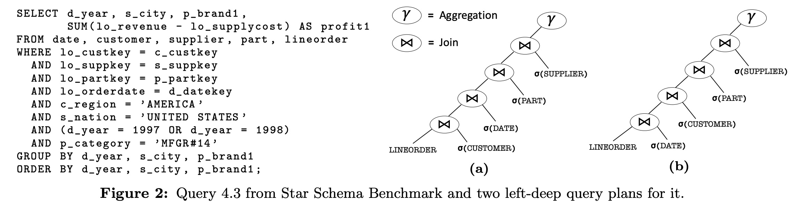
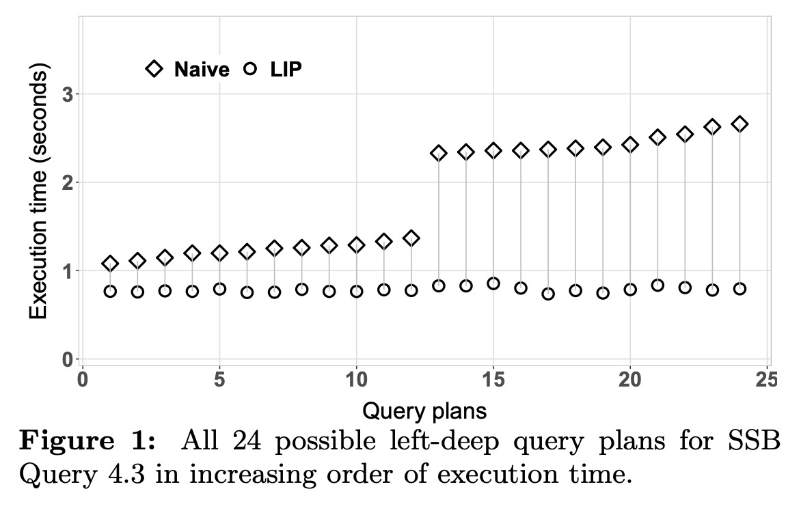
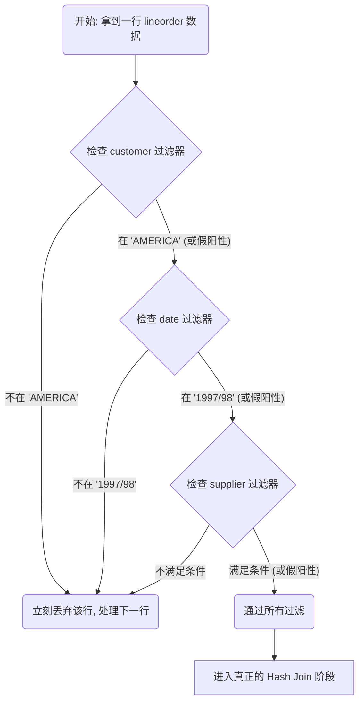
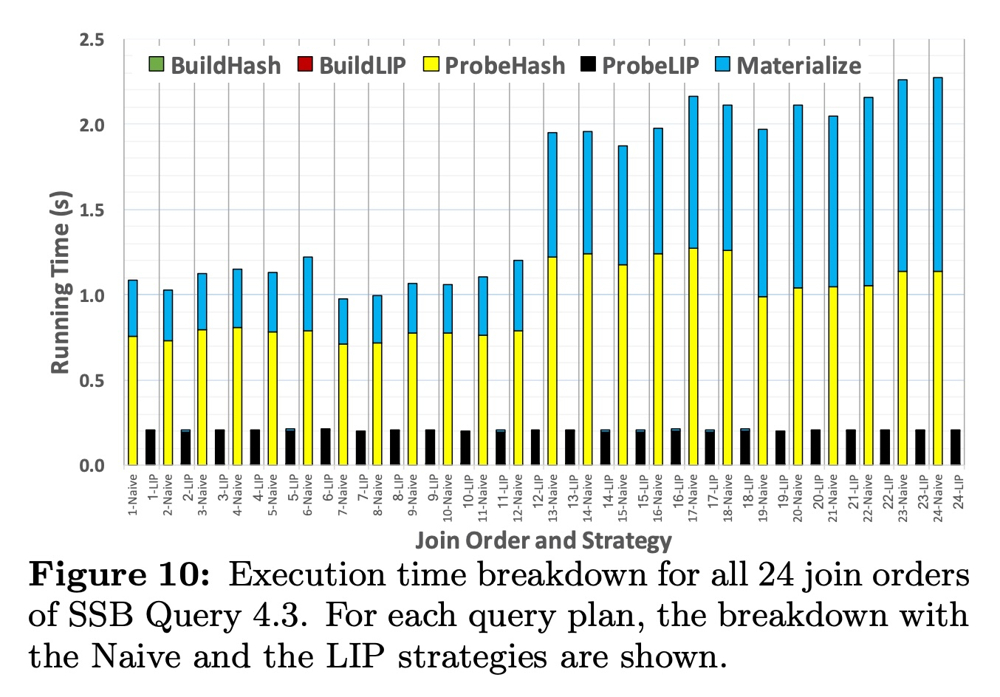

## AI论文解读 | Looking Ahead Makes Query Plans Robust
        
### 作者        
digoal        
        
### 日期        
2025-10-18        
        
### 标签        
PostgreSQL , PolarDB , DuckDB , AI , 论文解读        
        
----        
        
## 背景  
      
https://www.vldb.org/pvldb/vol10/p889-zhu.pdf        
  
提示:          
```          
读懂《Looking Ahead Makes Query Plans Robust》这篇论文需要提前掌握哪些基础知识, 请使用中文通熟易懂的讲解这些基础知识, 可以引用论文中的图、表或使用Markdown支持的图形(text,mermaid等)增加解释性. 
  
使用中文通熟易懂的解读《Looking Ahead Makes Query Plans Robust》这篇论文, 其中的关键内容请着重讲解, 可以引用论文中的图、表或使用Markdown支持的图形(text,mermaid等)增加解释性. 
  
提取《Looking Ahead Makes Query Plans Robust》这篇论文中的重要术语, 使用中文对这些术语进行通熟易懂的讲解, 可以引用论文中的图、表或使用Markdown支持的图形(text,mermaid等)增加解释性. 
```     
  
## 1 前置知识 
  
要读懂这篇论文《Looking Ahead Makes Query Plans Robust》，你需要对数据库系统的一些核心概念有基本的了解。这篇论文的**核心思想**是提出一种叫做 **LIP (Lookahead Information Passing)** 的查询*执行*策略，来解决一个经典难题：数据库的*优化器*有时会选出一个很糟糕的*执行计划*（尤其是连接顺序），导致查询变得巨慢。LIP 策略能让“坏”计划的执行效率也变得和“好”计划一样快，从而使查询执行变得“鲁棒”（Robust）。

以下是你需要掌握的基础知识，我会尽量用通俗的语言并结合论文中的图表来解释：

### 1\. 数据库查询与 SQL

你需要知道用户是如何从数据库获取数据的。通常，用户会使用 **SQL (Structured Query Language)** 来描述他们*想要什么*数据，而不是*如何获取*。

**[论文中的例子]** 论文的图 2 (Figure 2) 就展示了一个 SQL 查询。这个查询想从 `lineorder`（订单详情）、`date`（日期）、`customer`（顾客）、`supplier`（供应商）和 `part`（零件）这五张表中，计算按年、城市、品牌分类的“利润”（`profit`）。

  

```sql
SELECT d_year, s_city, p_brand1,
       SUM(lo_revenue - lo_supplycost) AS profit
FROM date, customer, supplier, part, lineorder
WHERE lo_custkey = c_custkey
  AND lo_suppkey = s_suppkey
  AND lo_partkey = p_partkey
  AND lo_orderdate = d_datekey
  AND c_region = 'AMERICA'
  AND s_nation = 'UNITED STATES'
  ...
GROUP BY d_year, s_city, p_brand1
ORDER BY ...;
```

### 2\. 查询优化器 (Query Optimizer) 与执行计划 (Query Plan)

这是本文最核心的背景。数据库收到上面的 SQL 后，并不会直接开始执行。它会先启动一个叫**查询优化器**的组件。

  * **为什么需要优化器？** 因为同一个 SQL 查询可以有*非常多*种不同的执行方式（“查询计划”）。比如，你是先连接 `lineorder` 和 `customer`，再连接 `date`？还是先连接 `lineorder` 和 `date`，再连接 `customer`？
  * **查询计划是什么？** 它是一个详细的执行步骤图。论文中的图 2 (a) 和 (b) 就展示了*两种不同*的查询计划，它们都对应同一个 SQL 查询 。

  

图 2 (a) 和 (b)：两种不同的查询计划（连接树）  

注意看 (a) 和 (b) 的区别：

  * 计划 (a) 的连接顺序是：`lineorder` $\bowtie$ `customer` $\rightarrow$ $\bowtie$ `date` $\rightarrow$ $\bowtie$ `part` $\rightarrow$ $\bowtie$ `supplier`
  * 计划 (b) 的连接顺序是：`lineorder` $\bowtie$ `date` $\rightarrow$ $\bowtie$ `customer` $\rightarrow$ $\bowtie$ `part` $\rightarrow$ $\bowtie$ `supplier`

**[本文的痛点]** 优化器会*估算*哪个计划最快，然后选一个交给执行引擎。但优化器*经常会估算错* 。如果它选错了计划（比如选了 (a) 但 (b) 其实快得多），查询性能就会“灾难性”地下降 。

### 3\. 星型模型 (Star Schema)

这篇论文的讨论场景限定在“星型模型”的数据仓库中 。

  * **什么是星型模型？** 它是一种数据组织方式，特别适合分析。它包含：
      * 一张巨大的**事实表 (Fact Table)**：在图 2 中就是 `lineorder`，它存储了大量的核心数据（如销售额、成本）。  
      * 多张较小的**维度表 (Dimension Tables)**：在图 2 中就是 `customer`, `date`, `part`, `supplier`。它们提供了描述事实的“上下文”（如顾客信息、日期信息等）。

这种结构就像一个星星，事实表在中心，维度表在四周。

### 4\. 连接算法：哈希连接 (Hash Join)

当论文讨论“连接” ( $\bowtie$ ) 时，你脑中需要有一个具体的算法。在内存数据库中，**哈希连接**是最常用的算法之一。它分为两个阶段：

1.  **构建阶段 (Build Phase)**：
      * 选择一张*较小*的表（通常是维度表，比如 `customer`）。
      * 读取这张表的数据，并对它的连接键（如 `c_custkey`）建立一个**哈希表 (Hash Table)**。
2.  **探测阶段 (Probe Phase)**：
      * 读取那张*较大*的表（通常是事实表，比如 `lineorder`）。
      * 对于 `lineorder` 的*每一行*，拿它的连接键（如 `lo_custkey`）去哈希表中“探测”（查找）是否有匹配。
      * 如果匹配成功，就将两行数据拼在一起，进入下一步。

**[与本文的联系]** “探测阶段”通常是最耗时的，因为它要处理海量的事实表数据 。如果一个“坏”的计划（比如先连接一个过滤效果很差的维度表），会导致中间结果集非常大，让后续的探测阶段更慢 。

### 5\. 左深连接树 (Left-Deep Join Tree)

论文中反复提到 “left-deep query plan trees”（左深查询计划树）。

  * **这是什么？** 你可以观察图 2 (a) 和 (b)，它们都是左深树。    
  * **特征：** 在这种树形结构中，每个连接操作 ( $\bowtie$ ) 的*右侧*总是一张原始的表（维度表），而*左侧*则是上一轮连接的结果（或者是事实表）。
  * **为什么重要？** 因为这种结构非常适合**流水线 (pipelining)** 执行 。数据可以像水流一样，从最底层的 `lineorder` 表开始，流过一个又一个连接节点，而不需要把巨大的中间结果写回内存。

### 6\. 选择率 (Selectivity)

这是理解“好计划”与“坏计划”的关键。

  * **什么是选择率？** 指一个过滤条件（如 `c_region = 'AMERICA'`）能筛掉多少数据。
  * **高选择性 (High Selectivity)**（*论文里也叫低选择率，low selectivity value，容易混淆，我们统一理解为“过滤效果好”*）：指能*留下*的数据很少。比如 `s_nation = 'UNITED STATES'`  可能只留下了 5% 的数据，它的过滤效果就很好。
  * **低选择性 (Low Selectivity)**（过滤效果差）：指会*留下*很多数据。比如 `c_region = 'AMERICA'`  可能留下了 20% 的数据。

**[最优策略]** 最优的连接顺序，应该是*最先*处理那些“过滤效果好”（选择率数值低）的表 。这样，数据流在早期就能变得非常小，后续的连接就会很快。

**[本文的痛点]** 优化器恰恰最容易*估算错*选择率 ，导致它把过滤效果差的表排在了前面，这就是“坏计划”的来源。

### 7\. 布隆过滤器 (Bloom Filter)

这是 LIP 策略用来实现“向前看”的核心技术 。

  * **它是什么？** 你可以把它想象成一个“快速黑名单”或“通行名单”。它是一种非常节省空间的数据结构，用于*概率性*地判断一个元素是否在集合中 。
  * **特点：**
    1.  **空间效率高**：它比哈希表小得多，小到可以塞进 CPU 缓存里 。
    2.  **查询快**：检查一个元素是否“在名单上”非常快。
    3.  **无“假阴性” (False Negatives)**：如果它说“你不在名单上”，那你*肯定*不在 。
    4.  **有“假阳性” (False Positives)**：如果它说“你在名单上”，你*可能*真的在，但也*可能*是它“误判”了（它把一个不在名单上的人错认了）。

**[LIP如何使用它？]**
LIP 策略在“构建阶段”，不仅为每个维度表（如 `customer`, `date`）建立了哈希表，还额外建立了一个*布隆过滤器* 。

在进入耗时的“探测阶段”*之前*，LIP 会先拿事实表 (`lineorder`) 的*每一行*，去*所有的*布隆过滤器里快速查一遍 。

  * 如果*任何一个*布隆过滤器说“你不在名单上”（例如，某订单的顾客不在 `'AMERICA'` 地区），LIP 就会*立刻丢弃*这行数据 。
  * 只有*通过了所有*布隆过滤器检查的数据（真阳性 + 少量假阳性），才有资格进入下一步*真正*的哈希连接探测 。

-----

### 总结：把所有知识串起来

当你具备了以上知识，你就能理解论文在说什么了：

1.  **问题 (Naive)：** 数据库优化器可能会选错**查询计划**（ 图 1 中的菱形 $\Diamond$ ）。在**星型模型**下，一个“坏”的**左深连接树**（把过滤效果差的表排前面）会导致**哈希连接**的探测阶段处理海量数据，性能极差。图 1 (Figure 1) 显示，不同计划的执行时间从约 1.1 秒到 2.7 秒不等，差异巨大 。

  

图 1：LIP 策略的效果 

2.  **方案 (LIP)：** 论文提出的 LIP 策略（ 图 1 中的圆形 $\bigcirc$ ），在执行任何计划时，都会先用**布隆过滤器**（这个小而快的数据结构）把**事实表**中“肯定没用”的数据提前过滤掉 。
3.  **效果 (Robust)：** 由于布隆过滤器很小，LIP 甚至可以“自适应地”调整过滤顺序（**Adaptive Reordering**），总是先把过滤效果最好的过滤器放在最前面。
4.  **结果：** 最终，LIP 策略（ 圆形 $\bigcirc$ ）让*所有*查询计划（无论好坏）的执行时间都变得*几乎一样*，并且都接近（甚至优于）“Naive”策略下的*最好*成绩 。这就是论文标题“向前看使查询计划更鲁棒”的含义。
  
## 2 解读论文 
  
好的，这是一篇非常有意思的数据库论文。我来为你通俗易懂地解读一下《Looking Ahead Makes Query Plans Robust》（“向前看”让查询计划更鲁棒）。

### **核心思想（一句话概括）**

这篇论文提出了一种叫做 **LIP (Lookahead Information Passing)** 的技术。

它的**核心作用**是：数据库的“查询优化器”经常会选错执行方案（比如选了个很慢的查询计划），导致查询性能天差地别 。LIP 技术就像给执行引擎开了一个“上帝视角”，让它能“向前看”，提前知道哪些数据是没用的。这样一来，**无论优化器选的计划是好是坏，LIP 都能让它运行得飞快** ，从而让查询性能变得非常“鲁棒”（Robust，即稳定可靠，不受坏计划的影响）。

-----

### **1. 问题的根源：愚蠢的“优化器”**

要理解它的价值，我们先要看它解决了什么问题。

**场景**：假设你是一个数据分析师，你的数据库里有几张大表：一张巨大的 `lineorder`（订单详情，事实表），以及几张小一点的 `customer`（顾客）、`date`（日期）、`supplier`（供应商）等（维度表）。

**你的需求 (SQL)**：你想看“1997年或1998年”、“美国地区的顾客”、“特定供应商”的“总利润”。

**数据库的工作**：

1.  **查询优化器 (Query Optimizer)**：数据库收到你的 SQL 后，会先“想”一下怎么执行最高效。它可以有很多种执行方案（“查询计划”），比如：

      * **计划 A**：先把 `lineorder` 和 `customer` 连起来，再和 `date` 连...
      * **计划 B**：先把 `lineorder` 和 `date` 连起来，再和 `customer` 连...

2.  **“灾难”的发生**：优化器会*估算*哪个计划快。但它经常估算错！。假设“美国地区”的顾客很多（比如占 30%），而“1997或1998年”的数据很少（比如只占 5%）。

      * **坏计划 (Bad Plan)**：如果优化器选了计划 A，它会先把 `lineorder` 和 30% 的 `customer` 连起来，产生一个*巨大*的中间结果，然后再用这个巨大结果去和 `date` 连。这个过程会巨慢。
      * **好计划 (Good Plan)**：如果选了计划 B，它先和 5% 的 `date` 连，中间结果*很小*，后续步骤自然就快了。

**[关键痛点]** 如图 1 所示，这篇论文用实验证明了同一个查询的 24 种不同计划（Query plans），在传统的（Naive）执行方式下（ 图中的菱形 $\Diamond$ ），执行时间（Execution time）从 1.1 秒到 2.7 秒不等 。最坏的计划比最好的慢了 2 倍多！

  

图 1 解读：横轴是 24 个不同的查询计划，纵轴是执行时间。

菱形( $\Diamond$ )代表传统方案，执行时间波动非常大。

圆形( $\bigcirc$ )代表本文的 LIP 方案，所有计划的执行时间几乎一样快。

-----

### **2. 解决方案：LIP (Lookahead Information Passing)**

LIP 的中文名叫“**前瞻信息传递**”。它的思路非常巧妙： **“既然优化器靠不住，那我就让执行引擎自己变得聪明点。”**

LIP 策略主要做了两件事：

#### **第一步：提前构建“过滤器” (Build Phase)**

在真正开始处理那张巨大的 `lineorder`（事实表）之前，LIP 会先去“偷看”一眼所有的维度表（`customer`, `date` 等）。

它会为每个维度表的*过滤条件*（比如 `c_region = 'AMERICA'`）建立一个非常小、非常快的“过滤器”，最常用的一种就是**布隆过滤器 (Bloom Filter)** 。

你可以把布隆过滤器想象成一个“通行名单”的压缩版：

  * **优点**：它非常小，可以塞进 CPU 缓存里，检查一个数据在不在名单上极快。
  * **特点**：它可能会“误判”（把不在名单上的错当成在名单上的，即“假阳性”），但*绝不会*“漏判”（在名单上的，它一定会说在）。

#### **第二步：“上帝视角”的过滤 (Probe Phase)**

LIP 在处理 `lineorder` 表的*每一行*数据时，不再按照优化器给的“坏计划”傻傻地去（比如先去连 `customer` 表），而是：

**先用所有的“布隆过滤器”把这行数据筛一遍！** 

`LIP的执行逻辑:`



**[关键优势]**

1.  **提前过滤**：99% 的无效数据在第一步就被扔掉了，根本不需要进行后续昂贵的连接（Hash Join）操作 。
2.  **消除坏计划的影响**：LIP 的这个过滤操作是*独立于*“连接顺序”的 。管你优化器是让 `customer` 在前还是 `date` 在前，LIP 都会用*所有*过滤器先筛一遍。这就让“坏计划”的影响降到了最低。

-----

### **3. LIP 的“杀手锏”：自适应重排序 (Adaptive Reordering)**

LIP 还有一个更聪明的机制。它在用布隆过滤器去筛数据时，会发现“咦，`date` 过滤器的过滤效果最好（比如 95% 的数据都被它干掉了），`customer` 的过滤效果最差（只干掉了 70%）”。

于是，LIP 会**动态地调整过滤器的应用顺序** 。它会优先使用*过滤效果最好*（即选择性最高）的那个过滤器。

`自适应重排序:`

> `lineorder` 表的数据流来了 $\rightarrow$ LIP 发现 `date` 过滤器最“狠” $\rightarrow$ **优先用 `date` 过滤器** $\rightarrow$ 95% 的数据被丢弃 $\rightarrow$ 只剩 5% 的数据 $\rightarrow$ 再用 `customer` 过滤器 $\rightarrow$ ...

这个“自适应重排序”是至关重要的 ，因为它确保了LIP总能以*近似最优*的顺序去过滤数据，进一步压榨了性能，使得过滤成本降到最低。

-----

### **4. 惊艳的结果：既鲁棒，又高效**

我们再回到图 1 。

  

Figure 1

  * **鲁棒性 (Robustness)**：看那些圆形 $\bigcirc$ （LIP 方案）。它们几乎在一条水平线上 ！这说明，无论优化器给了 24 种计划中的哪一种，执行时间都*几乎一样*。
  * **高效性 (Performance)**：你还会发现，LIP 的执行时间（约 0.8 秒）甚至比“传统方案”中*最好*的那个（约 1.1 秒）还要快 ！

**为什么会更快？**
论文在图 10 (Figure 10) 中解释了时间都去哪了 。    

  * **传统方案 (Naive)**：时间主要浪费在“结果物化”（Materializing results，即处理巨大的中间结果）和“哈希表探测”（Probing hash tables）上 。
  * **LIP 方案**：LIP 把99%的垃圾数据都提前扔了，所以“结果物化”和“哈希表探测”的时间几乎降为 0 。虽然 LIP 增加了“探测 LIP 过滤器”的成本（图 10 中的灰色部分），但这部分成本（在 CPU 缓存里跑）远低于原来的成本（在内存里跑）。

### **总结**

《Looking Ahead Makes Query Plans Robust》这篇论文的核心贡献是：

1.  **指出了问题**：查询优化器经常犯错，选出的“坏计划”会导致性能灾难，这让数据库的性能非常*不稳定*（不鲁棒）。
2.  **提出了 LIP 策略**：一种在查询*执行*时“向前看”的策略。
3.  **核心技术**：它利用布隆过滤器  作为“前瞻信息”，在数据流的早期就（以自适应的顺序 ）过滤掉绝大部分无效数据。
4.  **实现了目标**：LIP 让所有查询计划（无论好坏）的性能都变得*既稳定又高效*，完美解决了优化器估算不准的顽疾 。
  
## 3 术语 
  
好的, 这篇名为《Looking Ahead Makes Query Plans Robust》(前瞻使查询计划更具鲁棒性)的论文, 核心思想是通过一种名为 **LIP (Lookahead Information Passing)** 的查询执行策略, 来解决数据库优化器偶尔会选错查询计划(Query Plan), 导致性能急剧下降的问题.

以下是论文中几个核心术语的通俗化中文讲解, 并结合了论文中的图示.

### 1\. 查询计划 (Query Plan) & 左深连接树 (Left-deep Join Tree)

  * **通俗讲解**:
    你可以把"查询计划"想象成手机地图为你规划的导航路线. 当你输入起点和终点后, 地图会给出多种方案, 比如"时间最短"、"距离最短"或"避开高速". 数据库在执行一个复杂的查询(尤其是多表连接查询)时, 也有很多种执行"路线", 比如先连接A表和B表, 再连接C表; 或者先连接A表和C表, 再连接B表. 不同的路线(计划)效率可能天差地别.

    "左深连接树"是查询计划的一种特定形态, 就像是导航路线中的一种"主路优先"策略. 它总是一条路走到黑, 将中间结果持续与下一个表进行连接, 结构上看起来像一棵向左倾斜的树.

  * **论文中的解释**:
    论文中的图2展示了同一个查询的两种不同"左深连接树"计划. 这个查询需要将 `LINEORDER` (事实表)与四个维度表(`CUSTOMER`, `DATE`, `PART`, `SUPPLIER`)进行连接.    

      * 图2(a)的连接顺序是: `LINEORDER` → `CUSTOMER` → `DATE` → `PART` → `SUPPLIER`.
      * 图2(b)的连接顺序是: `LINEORDER` → `DATE` → `CUSTOMER` → `PART` → `SUPPLIER`.
        仅仅是 `CUSTOMER` 和 `DATE` 的连接顺序不同, 就可能导致巨大的性能差异, 因为一个糟糕的顺序会产生非常庞大的中间结果集, 耗费大量计算资源.

    *图2: SSB 4.3查询的SQL语句以及它的两种不同左深连接计划.*

### 2\. 鲁棒性 (Robustness)

  * **通俗讲解**:
    继续用导航的例子. 一个"鲁棒性"差的地图应用, 在交通信息稍微不准时, 可能会给你规划出一条比最佳路线慢好几个小时的"死亡路线". 而一个"鲁棒性"好的应用, 即使信息不完美, 它给出的所有路线方案性能都差不多, 不会有一个方案特别糟糕.

    在数据库领域, "鲁棒性"指的就是: **无论优化器选择了哪个查询计划(在某个范围内), 其最终的执行时间都不会和最优计划的执行时间相差太大**. 性能曲线应该是平坦的, 而不是陡峭的.

  * **论文中的解释**:
    图1是展示本文核心贡献的最重要的图. 它对比了传统(Naive)执行策略和LIP策略的鲁棒性.   

      * **菱形(Naive)**: 代表传统执行方式. 针对同一个查询的24种不同连接顺序(查询计划), 执行时间从约1.1秒到2.7秒不等, 波动非常大. 这就是"鲁棒性差"的表现. 如果优化器不幸选了右边的计划, 性能就会很糟糕.
      * **圆形(LIP)**: 代表使用了LIP策略. 同样是这24种计划, 执行时间全都稳定在0.8秒左右, 彼此之间几乎没有差别. 这就是"鲁棒性好"的表现.

    *图1: 24种可能的左深查询计划在传统(Naive)和LIP策略下的执行时间对比, 按执行时间升序排列.*

### 3\. 星型模型 (Star Schema)

  * **通俗讲解**:
    "星型模型"是数据仓库中一种常见的数据组织方式. 它就像一个太阳系, 中间有一颗巨大的恒星, 周围环绕着几颗行星.

      * **恒星**: 称为"事实表"(Fact Table), 记录了核心的业务事件, 数据量非常庞大, 比如上亿条销售记录.
      * **行星**: 称为"维度表"(Dimension Table), 存储对事实的描述信息, 数据量相对较小, 比如客户信息表、产品信息表、时间信息表.

  * **论文中的解释**:
    这篇论文的研究场景就是针对星型模型的. 在图2的查询中, `LINEORDER` 就是事实表, 而 `date`, `customer`, `supplier`, `part` 就是维度表. 这种模型的特点是查询通常涉及一个巨大的事实表和多个较小的维度表之间的连接.

    下面是一个星型模型的简单示意图:   

    ```mermaid
    graph TD;
        Fact_Sales[事实表: 销售记录] --> Dim_Customer[维度表: 客户];
        Fact_Sales --> Dim_Product[维度表: 产品];
        Fact_Sales --> Dim_Date[维度表: 日期];
        Fact_Sales --> Dim_Store[维度表: 商店];
    ```

### 4\. 前瞻信息传递 (Lookahead Information Passing, LIP)

  * **通俗讲解**:
    想象一个多阶段的安检流程. 传统方式是旅客先过第一关, 再过第二关... 如果在最后一关才发现旅客有问题, 那么前面几关的检查就白费了.

    LIP策略就像是在第一关安检时, 就提前拿到后面所有关卡的"关键要求摘要". 比如, 安检员提前知道"只有去B地的旅客才能通过最后一关". 这样, 在第一关就能把所有不去B地的旅客提前拦下, 极大地减轻了后续所有关卡的压力.

  * **论文中的解释**:
    LIP的核心做法是:

    1.  在正式开始连接(Join)之前, 先为**每一个**维度表(安检关卡)根据其过滤条件, 创建一个非常小且查询速度极快的摘要数据结构, 论文中用的是"布隆过滤器".
    2.  用巨大的事实表(所有旅客)去**同时查询所有**这些摘要.
    3.  只有那些能够通过**所有**摘要测试的事实表数据(满足所有关卡要求的旅客), 才会被送入后续真正昂贵的哈希连接(Hash Join)操作中.

    通过这种方式, 事实表在第一步就被极大地"瘦身"了, 无论后续的连接顺序如何, 处理的数据量都已经是最小化的, 从而实现了性能的稳定和提升.

### 5\. 布隆过滤器 (Bloom Filter)

  * **通俗讲解**:
    布隆过滤器是实现LIP策略的关键工具. 它像一个俱乐部的保安, 手里有一份"可能在场的会员"的速查名单.
      * **优点**: 名单非常小(节省内存), 查询速度极快.
      * **特点**: 它能100%确定地告诉你"某人**肯定不在**名单里". 但当它说"某人**可能在**名单里"时, 有极小的概率这个人其实是"冒牌货"(这被称为"假阳性", false positive).
      * **应用**: 在LIP中, 每个维度表都会生成一个布隆过滤器(速查名单). 事实表的每一行数据都会去问每一个保安. 只要有一个保安说"你肯定不在", 这行数据就直接被淘汰. 只有所有保安都说"你可能在", 才会被放行到下一步做精确检查(哈希连接). 尽管有"假阳性", 但它已经能过滤掉绝大多数无效数据了.

### 6\. 自适应重排序 (Adaptive Reordering)

  * **通俗讲解**:
    你有一堆过滤器(比如不同网眼的筛子)来过滤杂物. 你不知道哪个筛子效率最高. "自适应重排序"的做法是:
    先用一小撮样本来快速测试每个筛子, 看看哪个过滤掉的杂物最多. 然后, 就优先使用效率最高的那个筛子来处理大部队, 接着用第二高效的, 依此类推. 这个顺序是动态调整的.

  * **论文中的解释**:
    LIP在用事实表数据去查询多个布隆过滤器时, 并不是按照固定的顺序. 它会实时统计每个过滤器的"拦截率"(miss rate). 在处理每个数据块时, 它会动态地对这些过滤器进行重新排序, 总是先用拦截率最高的过滤器.

    这一步至关重要, 因为它确保了过滤阶段本身的效率就是最优的, 从而进一步增强了整个LIP策略的鲁棒性和性能, 避免了因固定的过滤顺序不佳而带来的性能损耗.

### 总结

这篇论文通过 **LIP** 策略, 利用 **布隆过滤器** 作为信息摘要, 在 **星型模型** 的查询场景下, 对巨大的事实表进行预过滤, 并结合 **自适应重排序** 技术优化过滤效率, 最终使得不同的 **查询计划** (特指左深连接树)都能获得近似最优且非常稳定的性能, 极大地提升了系统的 **鲁棒性**.
  
## 参考        
         
https://www.vldb.org/pvldb/vol10/p889-zhu.pdf    
        
<b> 以上内容基于DeepSeek、Qwen、Gemini及诸多AI生成, 轻微人工调整, 感谢杭州深度求索人工智能、阿里云、Google等公司. </b>        
        
<b> AI 生成的内容请自行辨别正确性, 当然也多了些许踩坑的乐趣, 毕竟冒险是每个男人的天性.  </b>        
  
    
#### [期望 PostgreSQL|开源PolarDB 增加什么功能?](https://github.com/digoal/blog/issues/76 "269ac3d1c492e938c0191101c7238216")
  
  
#### [PolarDB 开源数据库](https://openpolardb.com/home "57258f76c37864c6e6d23383d05714ea")
  
  
#### [PolarDB 学习图谱](https://www.aliyun.com/database/openpolardb/activity "8642f60e04ed0c814bf9cb9677976bd4")
  
  
#### [PostgreSQL 解决方案集合](../201706/20170601_02.md "40cff096e9ed7122c512b35d8561d9c8")
  
  
#### [德哥 / digoal's Github - 公益是一辈子的事.](https://github.com/digoal/blog/blob/master/README.md "22709685feb7cab07d30f30387f0a9ae")
  
  
#### [About 德哥](https://github.com/digoal/blog/blob/master/me/readme.md "a37735981e7704886ffd590565582dd0")
  
  

  
