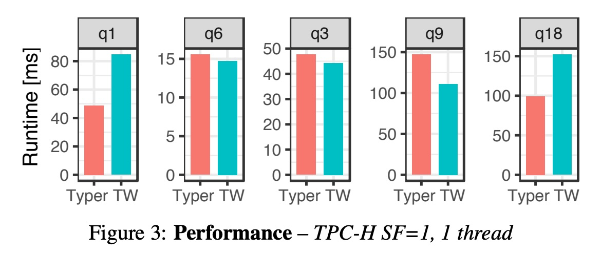

## AI论文解读 | Everything You Always Wanted to Know About Compiled and Vectorized Queries But Were Afraid to Ask
        
### 作者        
digoal        
        
### 日期        
2025-10-18        
        
### 标签        
PostgreSQL , PolarDB , DuckDB , AI , 论文解读        
        
----        
        
## 背景  
      
https://www.vldb.org/pvldb/vol11/p2209-kersten.pdf        
  
提示:          
```          
读懂《Everything You Always Wanted to Know About Compiled and Vectorized Queries But Were Afraid to Ask》这篇论文需要提前掌握哪些基础知识, 请使用中文通熟易懂的讲解这些基础知识, 可以引用论文中的图、表或使用Markdown支持的图形(text,mermaid等)增加解释性. 
  
使用中文通熟易懂的解读《Everything You Always Wanted to Know About Compiled and Vectorized Queries But Were Afraid to Ask》这篇论文, 其中的关键内容请着重讲解, 可以引用论文中的图、表或使用Markdown支持的图形(text,mermaid等)增加解释性. 
  
提取《Everything You Always Wanted to Know About Compiled and Vectorized Queries But Were Afraid to Ask》这篇论文中的重要术语, 使用中文对这些术语进行通熟易懂的讲解, 可以引用论文中的图、表或使用Markdown支持的图形(text,mermaid等)增加解释性. 
```     
  
## 1 前置知识 
  
好的，为了完全理解《Everything You Always Wanted to Know About Compiled and Vectorized Queries But Were Afraid to Ask》这篇论文，您需要掌握一些关于数据库查询处理、CPU 架构和性能衡量的基础知识。下面我将用通俗易懂的方式为您讲解，并引用论文中的图表来辅助说明。

### 核心预备知识概览

这篇论文的核心是比较两种现代数据库的主流查询执行模型：**向量化（Vectorization）** 和 **即时编译（Compilation）** 。它们都是为了解决传统查询引擎在现代硬件上的效率问题而提出的。

因此，理解这篇论文需要您先了解：

1.  **传统查询引擎的工作方式及其瓶颈 (火山模型)**
2.  **向量化执行模型的核心思想**
3.  **编译执行模型的核心思想**
4.  **衡量数据库性能的关键CPU指标**
5.  **现代CPU的一些关键架构特性 (如SIMD)**

-----

### 1\. 基础知识一：传统的“火山模型”及其效率瓶颈

在向量化和编译模型出现之前，大多数数据库查询引擎都使用一种叫做“火山模型”（Volcano-style iteration）的架构 。

  * **工作方式**：它像一座火山一样，数据从底层（数据表）像岩浆一样，一次一个元组（a tuple），通过一系列操作符（Operator）向上喷发，直到顶层输出结果。每个操作符都有一个 `next()` 方法，当上层操作符调用下层操作符的 `next()` 方法时，下层操作符就会处理并返回一个元组 。

  * **图解火山模型**:

    ```mermaid
    graph TD
        A[客户端] -- next() --> B(Projection)
        B -- next() --> C(Filter)
        C -- next() --> D(Table Scan)
        D -- one tuple --> C
        C -- one tuple --> B
        B -- one tuple --> A
    ```

  * **效率瓶颈**：在现代CPU上，这种“一次一元组”的模型效率低下 。因为每次调用 `next()` 都有函数调用的开销，而且CPU需要处理大量零散的元组，无法进行有效的批量处理和优化。论文指出，这种开销在过去磁盘是瓶颈的时代不成问题，但在内存数据库时代就变得非常致命 。

### 2\. 基础知识二：向量化执行 (Vectorized Execution)

向量化是为了解决火山模型的开销问题而提出的。

  * **核心思想**： **“一次一批元组” (vector-at-a-time)** 。它不再是每次 `next()` 调用返回一个元组，而是返回一个“向量”（vector），也就是一批元组（例如1000个）。这样做的好处是，`next()` 函数的调用开销被分摊到了这一批所有元组上，大大降低了单位元组的开销 。

  * **图解向量化模型**:

    ```mermaid
    graph TD
        A[客户端] -- next() --> B(Projection)
        B -- next() --> C(Filter)
        C -- next() --> D(Table Scan)
        D -- a vector of tuples --> C
        C -- a vector of tuples --> B
        B -- a vector of tuples --> A
    ```

  * **论文中的例子**：    
    论文中的图1(b)很好地展示了向量化的特点。为了实现对`color`和`tir`两个字段的筛选，向量化模型必须将其拆分成两个独立的、按类型优化的函数（一个处理字符串，一个处理整数）。这体现了向量化处理的一个特点：操作被分解为针对特定数据类型的简单“原语”（primitives）。

    > **图 1(b) 向量化代码示例** 

    > ```c++
    > // 第一个原语：筛选颜色
    > vec<int> sel_eq_string(vec<string> col, string o)
    > // ... 循环处理一批颜色 ...
    > ```
    >
    > ```c++
    > // 第二个原语：在上一批结果的基础上，筛选轮胎数
    > vec<int> sel\_eq\_int(vec<int> tir, int o, vec<int> s)
    > // ... 循环处理一批轮胎数 ...
    > ```
  
### 3\. 基础知识三：编译执行 (Data-centric Code Generation)

编译执行则采用了更激进的方式来消除开销。

  * **核心思想**：**为每个查询生成专属的、高度优化的机器码**。它不使用通用的操作符，而是遍历查询计划，将所有能连续执行的操作（比如扫描、过滤、投影）“融合”（fuse）成一个紧凑的循环（tight loop），然后利用LLVM等编译器技术将这段逻辑直接编译成高效的机器码 。

  * **论文中的例子**：    
    图1(a)就展示了编译模型生成的代码。它直接将两个筛选条件 `col[i] == "green"` 和 `tir[i] == 4` 整合在了一个循环的一个`if`语句中 。这样做的好处是，中间结果（比如第一次筛选的结果）可以直接保存在CPU寄存器中，无需写入内存，从而减少了大量的CPU指令和内存访问 。

    > **图 1(a) 编译生成代码示例** 

    > ```c++
    > vec<int> sel_eq_row(vec<string> col, vec<int> tir)
    >     vec<int> res;
    >     for(int i=0; i<col.size(); i++) // 一个循环
    >         if(col[i] == "green" && tir[i] == 4) // 融合了两个判断
    >             res.append(i)
    >     return res
    > ```

### 4\. 基础知识四：如何看懂论文中的性能数据

论文通过大量的CPU性能计数器来对比两种模型的优劣。看懂这些指标是理解论文结论的关键。

**表1: TPC-H SF=1, 1个线程下的CPU计数器** (数据经论文归一化处理) 

  

| Query | System | cycles | IPC | instr. | L1 miss | LLC miss | branch miss |
| :--- | :--- | :--- | :--- | :--- | :--- | :--- | :--- |
| Q1 | Typer | 34 | 2.0 | 68 | 0.6 | 0.57 | 0.01 |
| Q1 | TW | 59 | 2.8 | 162 | 2.0 | 0.57 | 0.03 |
| Q9 | Typer | 74 | 0.6 | 42 | 1.7 | 0.46 | 0.34 |
| Q9 | TW | 56 | 1.3 | 76 | 2.1 | 0.47 | 0.39 |

  * **`cycles` (CPU周期)**：完成任务所需的时钟周期数。越少越好，直接关系到执行速度。
  * **`instr.` (Instructions, 指令数)**：执行的总指令数。越少通常意味着代码效率越高。从Q1的对比中可以看到，编译模型(Typer)的指令数远少于向量化模型(TW) 。
  * **`IPC` (Instructions Per Cycle, 每周期指令数)**：每个CPU时钟周期能执行多少条指令。这个值越高，说明CPU的利用率越高，流水线越顺畅。但论文特别提醒，**高IPC不一定代表高性能**，比如在Q1中，TW的IPC更高，但因为总指令数太多，最终耗时反而更长 。
  * **`L1 miss` / `LLC miss` (缓存未命中)**：CPU为了快速存取数据，设置了多级缓存（L1, L2, L3/LLC）。
    ```text
    CPU <-> L1 Cache (快, 小) <-> L2 Cache <-> LLC (慢, 大) <-> 主内存 (非常慢)
    ```
    当CPU需要的数据不在缓存中，就必须去更慢的主内存中读取，这会导致CPU“停顿”（stall），浪费大量时间。缓存未命中次数是衡量内存访问效率的关键指标。
  * **`branch miss` (分支预测错误)**：现代CPU为了提高效率，会预测 `if` 等条件语句的走向并提前执行。如果预测错误，之前执行的工作就全部作废，需要从正确的分支重新开始，造成性能损失。

通过这些指标，论文得出结论：编译模型在计算密集、缓存友好的查询（如Q1）上更优，因为它指令数少 ；而向量化模型在有大量随机内存访问的查询（如Q9的哈希连接）上表现更好，因为它能更好地隐藏缓存未命中带来的延迟 。

### 5\. 基础知识五：现代CPU的并行处理技术 (SIMD)

  * **SIMD (Single Instruction, Multiple Data)**：单指令多数据流。这是一种并行计算技术，允许CPU用一条指令同时对多个数据执行相同的操作 。例如，可以一条指令完成4对整数的加法。

      * `Scalar (普通操作)`: `c1 = a1 + b1; c2 = a2 + b2;` (需要多条指令)
      * `SIMD (并行操作)`: `C_vector = A_vector + B_vector;` (一条指令完成)

  * **论文中的应用**：
    论文探讨了SIMD对性能的提升，特别是在向量化模型中。因为向量化天然地将数据组织成“向量”，非常适合SIMD操作 。如下图所示，在微基准测试中，SIMD带来了高达8.4倍的性能提升 。    

    > **图 6: 标量 vs. SIMD 在选择操作中的性能**

    然而，论文也指出，在真实的、复杂的TPC-H查询中，由于受到内存访问延迟等因素的制约，SIMD带来的整体性能提升相当有限（例如，Q6查询仅提升1.4倍）。

### 总结

掌握以上五个方面的基础知识后，您就可以轻松地读懂这篇论文了。您可以理解：

  * 论文所要解决的**问题背景**（火山模型的瓶颈）。
  * 两种核心技术**是什么**以及它们**如何工作**（向量化 vs. 编译）。
  * 论文用于**对比和论证的依据**（CPU性能指标的含义）。
  * 论文中关于**硬件特性如何影响性能**的讨论（SIMD并行化）。

这样，您就能深刻体会到论文作者在一个公平的环境下（使用相同的算法、数据结构和并行框架 ），对这两种主流技术进行“苹果对苹果”比较的巧思和其结论的精妙之处。
  
## 2 解读论文 
  
好的，这篇名为《Everything You Always Wanted to Know About Compiled and Vectorized Queries But Were Afraid to Ask》的论文，堪称数据库查询处理领域的经典之作。它深入探讨了现代数据库引擎中两种最核心的查询处理技术：**向量化（Vectorization）** 和 **即时编译（Compilation）** 。

本文将为您通俗地解读其核心内容、关键发现和深远意义。

### 核心问题：向量化 vs. 编译，究竟谁更快？

在现代内存数据库中，为了追求极致的性能，传统的“一次一元组”的火山执行模型因其巨大的解释开销已被淘汰 。取而代之的是两种主流技术：

  * **向量化**：由VectorWise系统推广，核心思想是“一次处理一批元组”，以摊销解释开销 。
  * **数据中心代码生成（即时编译）** ：由HyPer系统推广，核心思想是为每条查询动态生成高度优化的机器码，彻底消除解释开销 。

多年来，这两种技术路线都有非常成功的商业和开源数据库产品，但“究竟哪种更快”一直没有定论，因为直接比较两个不同的数据库系统会受到太多无关因素的干扰（如不同的算法、数据结构、并行策略等） 。

这篇论文的**最大贡献**在于，作者在同一个测试系统内，使用完全相同的算法、数据结构和并行框架，分别实现了向量化和编译两种执行引擎，从而进行了一场真正意义上的“苹果对苹果”的公平对决 。

-----

### 两大主角：向量化与编译的运作模式

#### 1\. 向量化执行 (Vectorized Execution)

可以理解为对传统火山模型的升级。它仍然是“拉”（pull-based）数据的模式，但每次不只拉一个元组，而是拉一个 **向量（Vector）** ，也就是一批数据（比如1000个元组） 。所有操作都以这批数据为单位进行。

  * **特点**：操作被分解为一个个独立的、针对特定数据类型的“原语”（Primitives） 。例如，一个包含两种数据类型（字符串和整数）的过滤条件，在向量化模型中必须被拆成两个原语函数，分别处理。

  * **代码示例 (源自论文图1b)**：    

    ```c++
    // 原语1: 筛选颜色 (字符串)
    vec<int> sel_eq_string(vec<string> col, string "green") { ... }

    // 原语2: 在上一批结果上，筛选轮胎数 (整数)
    vec<int> sel_eq_int(vec<int> tir, int 4, vec<int> s) { ... }
    ```

    这种方式的缺点是，第一个原语的筛选结果需要被“物化”（Materialize）到内存中，然后第二个原语再读取这个中间结果进行处理，这会产生额外的内存读写 。

#### 2\. 编译执行 (Data-centric Code Generation)

这是一种更激进的优化方法。它采用“推”（push-based）数据的模式，将查询计划中的多个操作符“融合”（Fuse）成一个单一的、紧凑的循环，并为这个循环动态生成机器码 。

  * **特点**：没有通用的解释器，每一条查询都有一个为它“量身定制”的执行程序。

  * **代码示例 (源自论文图1a)**：

    ```c++
    // 编译生成的代码
    vec<int> sel_eq_row(vec<string> col, vec<int> tir) {
        // 一个循环内完成所有操作
        for (int i=0; i < col.size(); i++) {
            // 两个过滤条件被融合在同一个if语句中
            if (col[i] == "green" && tir[i] == 4) { ... }
        }
    }
    ```

    这种方式的优点是，中间结果可以直接存放在CPU寄存器中，无需写入内存，从而执行更少的指令，效率极高 。

### 关键实验发现：一场势均力敌的对决

论文通过一系列TPC-H基准测试，得出了几个核心结论。

#### 1\. 单线程性能：各有千秋，没有绝对王者

如下图所示，在单线程环境下，编译模型（Typer）和向量化模型（Tectorwise, TW）互有胜负 。

  

> **图3: TPC-H单线程性能对比 (节选)**
>
> * 在 Q1（计算密集型查询）中，Typer比TW快了74% 。
> * 在 Q9（内存访问密集型查询）中，TW比Typer快了32% 。

**为什么会这样？** 论文通过CPU性能计数器揭示了深层原因：

**表1: CPU性能计数器对比 (简化)**

  

| 查询 | 模型 | 指令数 (instr.) | IPC | 缓存未命中 (L1 miss) | 结论 |
| :--- | :--- | :--- | :--- | :--- | :--- |
| **Q1** | Typer | **68 (少)** | 2.0 | **0.6 (低)** | **胜出**  |
| | TW | 162 (多) | 2.8 | 2.0 (高) | |
| **Q9** | Typer | **42 (少)** | 0.6 | 1.7 (低) | |
| | TW | 76 (多) | 1.3 | 2.1 (高) | **胜出**  |

  * **编译 (Typer) 的优势：计算密集、缓存友好** 。
    对于Q1这种计算量大、数据能很好地 फिट 进CPU缓存的查询，编译模型的优势是**执行的指令数更少** 。因为它将中间结果保留在寄存器中，避免了大量内存读写指令 。

  * **向量化 (TW) 的优势：隐藏内存访问延迟** 。
    对于Q9这种需要大量访问哈希表（导致频繁缓存未命中）的查询，向量化模型虽然指令数更多，但其简单的循环结构使得CPU的乱序执行引擎能更好地工作，可以同时发出多个内存读取请求，从而有效**隐藏缓存未命中带来的停顿（stall）** 。

#### 2\. SIMD并行化：理想丰满，现实骨感

SIMD（单指令多数据）技术允许CPU一条指令处理多个数据，理论上与向量化模型是天作之合 。
实验发现，在理想的微基准测试中，SIMD能带来高达**8.4倍**的性能提升 。然而，在真实的TPC-H查询中，由于性能瓶颈是内存访问而非计算，SIMD带来的增益非常有限，对join类查询的提升仅在 **10%** 左右 。

**结论**：SIMD并不能成为向量化模型压倒编译模型的决定性优势 。

#### 3\. 多核并行化：都能很好地扩展

论文采用了先进的“morsel-driven”并行框架，发现两种模型都能在多核CPU上取得近乎理想的性能扩展 。一个有趣的发现是，当启用超线程（Hyper-threading）时，两种模型之间的性能差距会缩小，这表明超线程技术能有效弥补一些微架构上的执行效率差异 。

-----

### 超越性能：定性因素的考量

既然在OLAP（在线分析处理）性能上难分伯仲，那么在其他方面的考量就变得至关重要 。

| 特性 | 编译模型 (Compilation) | 向量化模型 (Vectorization) |
| :--- | :--- | :--- |
| **OLTP 性能** | **优** (可将整个事务编译成一个高效函数)  | 差 (处理单点查询时，批处理优势无法体现)  |
| **语言集成** | **优** (可无缝集成UDF等其他语言代码)  | 差 |
| **编译时间** | 劣 (可能很长，特别是对于大查询)  | **优** (原语都是预编译好的，查询启动快)  |
| **性能分析** | 劣 (难以区分单个操作符的耗时)  | **优** (可精确测量每个原语的耗时)  |
| **自适应执行** | 劣 (代码一旦生成就固定了)  | **优** (可在运行时根据数据动态更换原语)  |
| **实现复杂度** | 高 (需要处理代码生成，像在写一个编译器)  | 高 (需要精心设计原语的拆分和接口)  |

### 总结与启示

这篇论文通过严谨的实验，给出了一个清晰而深刻的结论：

1.  **没有银弹**：在OLAP性能上，编译和向量化都是顶级的高效模型，但各有侧重。编译模型**擅长计算**，而向量化模型**擅长隐藏内存延迟** 。
2.  **选择的艺术**：数据库系统设计师在选择技术路线时，不仅要考虑OLAP性能，还必须权衡其他定性因素。
      * 如果系统需要同时处理高性能的**OLTP**事务（即HTAP系统），或者需要强大的**语言扩展能力**，**编译模型**是更好的选择 。
      * 如果系统追求**快速查询启动**、**精细的性能监控**和**强大的运行时自适应能力**，那么**向量化模型**更具优势 。

最终，这篇论文告诉我们，不存在一个“最好”的查询处理模型，只有“最适合”特定场景和设计目标的模型。它为业界未来的系统设计和优化指明了方向，也终结了长久以来关于“谁更快”的简单争论。
  
## 3 术语 
  
好的，这篇论文《Everything You Always Wanted to Know About Compiled and Vectorized Queries But Were Afraid to Ask》中包含了一些数据库和计算机体系结构领域的关键术语。下面我将用通俗易懂的方式对它们进行讲解，并引用论文中的图表来帮助理解。

-----

### 1\. Volcano-style iteration (火山模型)

  * **一句话解释**：一种传统的查询处理方式，数据就像岩浆一样， **一次一个元组（tuple）** ，从底层操作符（如表扫描）向上层操作符（如过滤、聚合）逐级流动，直到输出最终结果 。

  * **详细讲解**：
    想象一条工厂流水线，每个工人就是一个“操作符”。在火山模型中，每位工人一次只处理一个零件（元组），处理完后交给下一位工人 。上游工人需要零件时，就对下游工人喊一声“下一个！”（调用`next()`方法）。这种方式在现代CPU上效率低下，因为频繁的函数调用会带来巨大的开销，而且无法进行批量处理优化 。

  * **图解**：

    ```mermaid
    graph TD
        subgraph Volcano Model
            A[Client] -- next() & one tuple --> B(Operator 1)
            B -- next() & one tuple --> C(Operator 2)
            C -- next() & one tuple --> D(Table Scan)
        end
    ```

### 2\. Vectorization (向量化)

  * **一句话解释**：对火山模型的改进，数据不再是单个流动，而是 **一次一批（一个向量/Vector）** 地进行处理 。

  * **详细讲解**：
    还是那条工厂流水线，现在工人不再传递单个零件，而是一次性处理一整箱零件（一个向量，比如1000个元组），处理完后再把整箱交给下一个工人 。这样做的好处是，“拿货”（调用`next()`）的次数大大减少，单次调用的开销被分摊到了一整箱零件上，因此效率显著提升 。向量化执行通常将复杂操作分解为针对特定数据类型的简单“原语”（primitives） 。

  * **论文中的例子 (图1b)**：    
    为了执行一个涉及字符串和整数的联合筛选，向量化模型必须将其拆分为两个独立的原语：一个用于比较字符串，另一个用于比较整数 。这会导致第一个原语的结果需要被存储起来（物化），再由第二个原语读取，产生了额外的内存读写 。

### 3\. Data-centric Code Generation (数据中心代码生成 / 编译)

  * **一句话解释**：一种更激进的优化方法，它不使用通用的处理流程，而是为**每一条查询动态生成并编译一段专属的、高度优化的机器码** 。

  * **详细讲解**：
    与其使用一条通用的流水线，不如为每一种订单（查询）专门建造一台定制化的生产机器。这台机器内部没有分立的工位（操作符），而是将所有生产步骤（扫描、过滤、计算） **融合（fuse）** 在一个高效的连续过程中 。这样做的好处是，中间产品（中间结果）无需周转，可以直接在机器内部（CPU寄存器）传递，从而执行更少的指令，速度极快 。

  * **论文中的例子 (图1a)**：
    对于同样的联合筛选任务，编译模型生成的代码在一个循环内，用一个`if`语句就同时完成了字符串和整数的比较 。这与向量化模型需要拆分操作、物化中间结果的方式形成了鲜明对比 。

### 4\. Operator Fusion (操作符融合)

  * **一句话解释**：这是编译模型中的核心技术，指将查询计划中多个连续的操作符合并成一个单一的、紧凑的代码循环 。

  * **详细讲解**：
    在传统模型中，“扫描-\>过滤-\>投影”是三个独立的操作符。操作符融合技术会将这三步合并到同一个`for`循环中。在一个循环迭代里，代码直接完成读取数据、判断是否符合过滤条件、提取所需字段这三件事。这样可以最大化地利用CPU寄存器来保存中间数据，避免了将数据写入缓存或主存再读出的开销，从而极大提升了效率 。

### 5\. SIMD (Single Instruction, Multiple Data / 单指令多数据流)

  * **一句话解释**：现代CPU的一种并行计算能力，可以用**一条指令同时对多个数据执行相同的操作** 。

  * **详细讲解**：
    想象一下，你需要给4个数字分别加上1。普通操作需要执行4次加法指令。而使用SIMD，CPU可以一条指令就完成这4次加法。向量化执行模型由于其数据按“批”组织的特性，天然适合利用SIMD进行加速 。不过，论文指出，虽然SIMD在计算密集的微基准测试中效果显著，但在受内存访问速度限制的真实查询中，其带来的性能提升较为有限 。

### 6\. Morsel-driven Parallelism (小块驱动的并行化)

  * **一句话解释**：一种先进的多核CPU并行处理策略，它将一个大任务分解成许多独立的“小块”（morsels），然后由所有CPU核心去动态认领并执行这些小块 。

  * **详细讲解**：
    这是HyPer系统首创的并行框架 。相比于传统的将数据静态分区给各个线程的方式，这种动态调度机制能实现更好的负载均衡和NUMA内存访问局部性，从而获得更优的多核扩展性 。论文为了实现公平对比，在向量化和编译两个引擎中都采用了这种并行策略 。

### 7\. 关键CPU性能指标

论文通过一系列CPU性能计数器来剖析两种模型的行为。理解这些指标是读懂论文结论的关键。

| 术语 (英文) | 中文含义 | 通俗讲解 |
| :--- | :--- | :--- |
| **Instructions** | **指令数** | CPU为完成任务需要执行的命令总数。通常越少越好 。论文显示编译模型通常指令数更少 。 |
| **IPC** | **每周期指令数** | CPU每个时钟周期能完成几条指令，衡量CPU的“忙碌”程度或效率 。**但高IPC不等于快**，因为总指令数可能更多 。 |
| **Cache Miss** | **缓存未命中** | CPU需要的数据不在高速缓存中，必须去慢速的主内存读取 。这会导致CPU“空等”，严重影响性能。 |
| **Memory Stall Cycles** | **内存停顿周期** | 指CPU因为等待内存数据而浪费掉的时钟周期数 。论文发现向量化模型更擅长通过乱序执行来隐藏这部分延迟 。 |
  
## 参考        
         
https://www.vldb.org/pvldb/vol11/p2209-kersten.pdf    
        
<b> 以上内容基于DeepSeek、Qwen、Gemini及诸多AI生成, 轻微人工调整, 感谢杭州深度求索人工智能、阿里云、Google等公司. </b>        
        
<b> AI 生成的内容请自行辨别正确性, 当然也多了些许踩坑的乐趣, 毕竟冒险是每个男人的天性.  </b>        
  
    
#### [期望 PostgreSQL|开源PolarDB 增加什么功能?](https://github.com/digoal/blog/issues/76 "269ac3d1c492e938c0191101c7238216")
  
  
#### [PolarDB 开源数据库](https://openpolardb.com/home "57258f76c37864c6e6d23383d05714ea")
  
  
#### [PolarDB 学习图谱](https://www.aliyun.com/database/openpolardb/activity "8642f60e04ed0c814bf9cb9677976bd4")
  
  
#### [PostgreSQL 解决方案集合](../201706/20170601_02.md "40cff096e9ed7122c512b35d8561d9c8")
  
  
#### [德哥 / digoal's Github - 公益是一辈子的事.](https://github.com/digoal/blog/blob/master/README.md "22709685feb7cab07d30f30387f0a9ae")
  
  
#### [About 德哥](https://github.com/digoal/blog/blob/master/me/readme.md "a37735981e7704886ffd590565582dd0")
  
  

  
