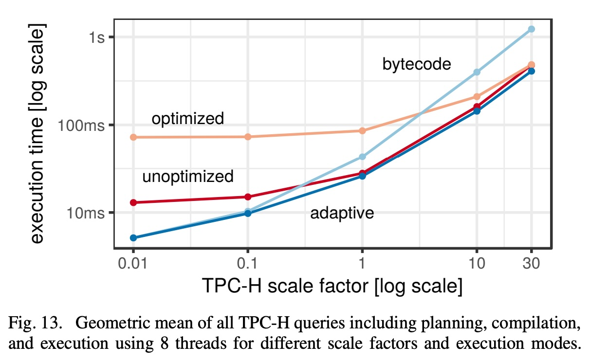
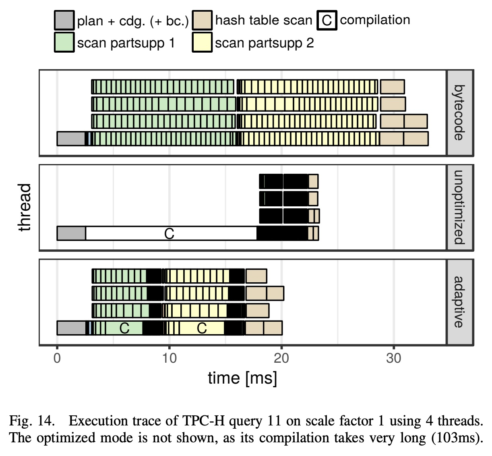

## AI论文解读 | Adaptive Execution of Compiled Queries
        
### 作者        
digoal        
        
### 日期        
2025-10-18        
        
### 标签        
PostgreSQL , PolarDB , DuckDB , AI , 论文解读        
        
----        
        
## 背景  
      
https://db.in.tum.de/~leis/papers/adaptiveexecution.pdf        
  
提示:          
```          
读懂《Adaptive Execution of Compiled Queries》这篇论文需要提前掌握哪些基础知识, 请使用中文通熟易懂的讲解这些基础知识, 可以引用论文中的图、表或使用Markdown支持的图形(text,mermaid等)增加解释性. 
  
使用中文通熟易懂的解读《Adaptive Execution of Compiled Queries》这篇论文, 其中的关键内容请着重讲解, 可以引用论文中的图、表或使用Markdown支持的图形(text,mermaid等)增加解释性. 
  
提取《Adaptive Execution of Compiled Queries》这篇论文中的重要术语, 使用中文对这些术语进行通熟易懂的讲解, 可以引用论文中的图、表或使用Markdown支持的图形(text,mermaid等)增加解释性. 
```     
  
## 1 前置知识 
  
要透彻理解这篇论文《Adaptive Execution of Compiled Queries》（编译后查询的自适应执行），你需要对数据库系统、编译器原理和并发编程有一些基本概念。

这篇论文的核心思想是解决一个“两难”问题：

1.  **编译执行 (Compilation)**：将 SQL 查询直接编译成高效的机器码 。这种方式执行速度极快，但编译本身很耗时 。
2.  **解释执行 (Interpretation)**：传统的数据库一行一行地“解释”执行查询计划。这种方式启动很快（几乎没有编译时间），但执行效率远低于编译后的代码 。

**矛盾点在于**：

  * 对于需要处理海量数据的**长查询**，花几百毫秒甚至1秒去编译  是值得的，因为后续执行能节省几分钟。
  * 对于只处理几行数据的**短查询**（例如，查询元数据），执行时间可能不到1毫秒，但编译却花了54毫秒 。这导致98%的时间都浪费在编译上 ，用户体验很差。

这篇论文提出的“自适应框架”  就像一个智能的混合动力系统：

  * **启动时**：默认使用“解释模式”（他们实现了一个快速的字节码解释器 ），保证查询立刻开始执行，延迟低 。
  * **运行时**：在后台监控查询的执行进度 。
  * **动态切换**：如果发现这个查询“是个大活儿”（会运行很久），系统就会在后台启动“编译模式” 。一旦编译完成，系统会无缝地将执行切换到新编译好的、速度飞快的机器码上 。

为了看懂这个设计，你需要掌握以下几个基础知识点：

-----

### 1\. 数据库查询执行：解释器 vs 编译器

这是理解本文动机的**最重要**的知识点。

  * **解释型引擎 (Interpretation)**

      * **原理**：这是传统的执行方式（比如 Volcano 模型 ）。数据库的优化器生成一个“查询计划树”（Query Plan Tree），执行引擎就像一个“翻译官”，递归地“访问”树上的每个节点（比如“表扫描”、“哈希连接”），每访问一个节点，就取一批数据并处理，然后交给上一个节点。
      * **优点**：启动快，无需等待编译。
      * **缺点**：开销大。CPU 缓存效率低，而且有大量的虚函数调用和数据在不同操作符之间的传递开销 。

  * **编译型引擎 (Compilation)**

      * **原理**：这是现代高性能数据库（如 HyPer, MemSQL）使用的方式 。它不解释查询计划，而是将整个查询计划“翻译”成一段高效的、定制化的 C++ 或 LLVM IR 代码 ，然后再编译成机器码 。
      * **优点**：执行速度极快。所有数据都保留在 CPU 寄存器中，没有解释开销 。
      * **缺点**：编译时间长，导致查询延迟高 。

**论文中的体现 (图2)**：    
论文中的图2  完美地展示了这个权衡：


  * Y轴 (执行时间) ：越低越好（执行快）。
  * X轴 (编译时间) ：越左越好（编译快）。

你会发现没有一个点是完美的（又左又下）。论文的自适应方案就是试图在“解释器”（如 `LLVM bytecode` ）和“编译执行”（如 `LLVM optimized` ）之间找到一条最佳路径。

-----

### 2\. 编译器基础与 LLVM

因为这篇论文是基于 LLVM 实现的，所以你需要对编译器，特别是 LLVM 有个大概了解。

  * **什么是编译器？**
    编译器是将一种语言（如 C++）转换成另一种语言（如 x86 机器码）的程序。这个过程通常很复杂，包括词法分析、语法分析、语义分析、优化和代码生成。

  * **什么是 LLVM？**
    LLVM 是一个非常流行的“编译器框架” 。它最核心的概念是 **LLVM IR** (Intermediate Representation，中间表示)。

  * **为什么 LLVM IR 很重要？**
    你可以把 LLVM IR  想象成一种“通用的、高级的汇编语言”。

      * 数据库的代码生成器 (Code Generation)  只需要把 SQL 查询计划翻译成 LLVM IR 就行了，这个过程相对简单 。
      * 后续的“优化” (LLVM Opt. Passes)  和“编译成特定机器码” (LLVM Comp.)  这类脏活累活，都交由 LLVM 自己去完成。

**论文中的体现 (图1)**：    
图1  展示了使用 LLVM 的编译型数据库的完整流程：
`SQL` -\> `Parser` -\> `Semantic Analysis` -\> `Optimizer` -\> (生成 `plan` )
...到这里，传统数据库会去“解释”这个 `plan` 。
但编译型数据库会继续：
`plan` -\> **`Code Generation` (生成 `LLVM IR` )** -\> `LLVM Opt. Passes` (优化 `LLVM IR` ) -\> `LLVM Comp.` (生成 `x86 code` )

论文的**核心创新点**在于截断了这个流程：
在拿到 `LLVM IR` 后，它**不立即**发送给 `LLVM Comp.` ，而是先发送给一个**自定义的字节码解释器**  去执行。

-----

### 3\. 字节码和虚拟机 (Bytecode & VM)

为了实现“快速启动”，论文需要一个解释器。但他们发现 LLVM 自带的解释器“非常慢” 。因此，他们自己实现了一个“快速字节码解释器” 。

  * **什么是字节码？**
    最著名的例子是 Java。`javac` 编译器把 `.java` 文件编译成 `.class` 文件，`.class` 文件里装的就是“Java 字节码”。
  * **什么是虚拟机 (VM)？**
    Java 虚拟机 (JVM) 就是一个“解释”和“执行”Java 字节码的程序。
  * **为什么用字节码？**
    字节码是一种为“解释”而优化的中间格式。它比 LLVM IR 更紧凑、更易于快速执行 。

**论文中的体现**：
论文的第 IV 节  专门讲解了他们如何实现这个快速解释器：

1.  **翻译**：他们写了一个翻译器，把 `LLVM IR` 快速翻译成他们自定义的 `bytecode` 格式 。这个过程比 LLVM 编译成机器码快得多（见图3，`Byte Code Compiler` 仅 0.4ms ，而 `LLVM Comp.` 需要 6ms 到 17ms ）。   
2.  **执行**：他们写了一个小型 VM（一个 C++ 的 `switch` 循环 ）来执行这些字节码。

-----

### 4\. 并发编程与 "Morsel" 驱动的执行

这是理解“动态切换”的**关键**。系统是如何做到“在查询执行一半时，从解释器切换到编译器”的？

答案是：**Morsel-driven (小块驱动) 执行** 。

  * **原理**：系统不会一次性执行整个查询。它会把一个大的查询任务（比如“扫描表 A”）切分成很多个独立的小工作单元，称为 "Morsel"（意为“一小块食物”）。
  * **并发**：系统有一个线程池（多个“工人”）。这些“工人”线程会不断地从任务队列中抓取（"steal" ）一个 "Morsel" 来执行。

**论文中的体现 (图4 和 图5)**：  
图4  展示了这个模型：  

  * 一个查询被分成了3个“流水线” (Pipelines)：`workerA`, `workerB`, `workerC` 。
  * `workerA` 的工作（比如扫描表 A）被切成了很多绿色小块（Morsels）。
  * 线程 `T1` 和 `T2` 竞争这些小块 。`T1` 抢到一块 `workerA` 的 morsel，执行完；再去抢下一块。

**“动态切换”就发生在这里**：
图5  的伪代码 `dispatch`  展示了每个线程在处理*下一个* morsel *之前*的逻辑：   

1.  `nextMorsel = grabMorsel()`：抢一个小任务块 。
2.  `if (handleB.isCompiled())`: 检查“编译后的机器码”是否准备好了？
3.  **是**：`handleB.fn(state, nextMorsel)` -\> 调用编译好的机器码 。
4.  **否**：`VM.execute(handleB.byteCode, ...)` -\> 使用字节码解释器执行 。
5.  `if (choice != DoNothing)`：同时，系统会根据进度  决定是否要启动后台编译 `runAsync(...)` 。

通过这种方式，查询启动时所有 morsel 都走 (4) 解释器；当后台编译  完成后，`isCompiled()` 变为 true，后续的 morsel 就自动走 (3) 编译码，实现了无缝切换 。

### 总结

你需要的基础知识：

1.  **数据库**：知道 SQL 查询需要被“优化”和“执行”，并理解“解释执行”（启动快、运行慢）和“编译执行”（启动慢、运行快）的核心区别 。
2.  **编译器**：知道 LLVM 是一个工具，它使用一种叫 IR 的“中间语言”。数据库可以生成这种 IR，然后 LLVM 负责把它变成机器码 。
3.  **虚拟机**：理解“字节码” (Bytecode) 是一种可以被快速“解释”的格式，类似 Java 和 JVM 。
4.  **并发**：理解“多线程”和“任务分块”(Morsel)，这是实现“边解释、边编译、边切换”的技术基础 。
  
## 2 解读论文 
  
这篇论文《Adaptive Execution of Compiled Queries》解决的是现代“编译型”数据库系统中的一个核心痛点：**快与慢的权衡**。

简单来说，数据库执行 SQL 查询有两种主流方法：

1.  **解释执行 (Interpretation)**：像一个翻译官，拿到查询计划后，一条一条地“解释”给 CPU 听。

      * **优点**：启动快，几乎没有延迟，SQL 语句发过去马上就能开始执行。
      * **缺点**：执行效率低，就像翻译官在中间传话，总会慢一点。

2.  **编译执行 (Compilation)**：像一个“本地化”团队，拿到查询计划后，直接把它编译成高效的、为当前机器定制的“机器码”（Machine Code）。

      * **优点**：执行效率极高，没有中间商赚差价，CPU 直接运行优化过的代码 。
      * **缺点**：**编译本身非常耗时** 。

### 核心问题：编译的代价

论文指出了一个尖锐的矛盾：编译执行虽然快，但编译过程（比如使用 LLVM 框架）可能需要花费**数百毫秒** 。

这导致了一个尴尬的局面：

  * **对于大数据量的“长查询”** （比如分析一年的销售数据）：花 500 毫秒编译，省下了 5 分钟的执行时间，**非常划算**。
  * **对于小数据量的“短查询”** （比如查询一下元数据，或UI上的一个下拉框）：查询本身执行可能**不到 1 毫秒**，但光是编译就花了 **54 毫秒** 。这意味着 98% 的时间都浪费在了编译上 ，用户会感觉系统“卡顿”。

因此，数据库面临一个“两难”的选择，这在论文的图2（Fig. 2）中体现得淋漓尽致：  


  * 你想要**低延迟**（编译快），就得忍受**低吞吐量**（执行慢）（左上角）。
  * 你想要**高吞吐量**（执行快），就得忍受**高延迟**（编译慢）（右下角）。

-----

### 解决方案：自适应执行 (Adaptive Execution)

论文的作者提出了一种“鱼与熊掌兼得”的智能框架，它就像一辆“混合动力汽车”：

**核心思想：**

1.  **立即启动 (用电)：** 收到任何 SQL 查询，系统**立即**使用一个**快速的字节码解释器** (Bytecode Interpreter) 来执行它。这保证了极低的启动延迟 。
2.  **运行时监控 (看路况)：** 在解释执行的同时，系统在一个后台线程中“监控”查询的进展 。
3.  **动态切换 (上高速开引擎)：** 系统会“估算”：如果切换到编译模式，是否会比“一路解释到底”更快？
      * 如果发现这是个“短查询”（比如在 1 毫秒内就快跑完了），那就**什么也不做**，继续解释执行。
      * 如果发现这是个“长查询”（比如进度条刚过 1% 就花了 10 毫秒），系统会**在后台启动编译**（编译成未优化或优化的机器码）。
4.  **无缝切换 (油电混合)：** 在后台编译时，其他 CPU 核心**仍在继续解释执行**，一刻也不停歇 。一旦后台编译完成，系统会“热切换”，让所有线程在执行完当前任务后，无缝地开始执行新编译好的、速度飞快的机器码 。

这种方法的好处是：它不需要依赖查询优化器“猜”这个查询会快还是会慢 ，而是根据**运行时的真实反馈**来做出动态决策 。

-----

### 关键技术实现

为了实现这个“混动系统”，论文解决了三个关键技术问题：

#### 1\. 三种执行模式 (图3)

系统需要有“三个档位”可选。如图3所示，当数据库生成 LLVM IR (一种中间语言) 后，有三条路可以走 ：  


自适应框架可以在这三者之间动态选择 。

#### 2\. "Morsel" 驱动的执行与切换 (图4, 图5)

系统是如何做到“边开边换引擎”的？答案是：**Morsel (小块) 驱动的并行执行** 。

系统会把一个大任务（比如扫描一张表）切分成无数个“小工作包”(Morsels)。多个 CPU 线程会像工人一样，不断地从队列中抓取一个“Morsel”来处理 。

  * **图4** 展示了 T1 和 T2 两个线程在处理 `workerA` 和 `workerB` 的“Morsels”（那些小色块）。   
  * **切换的关键**在于 **图5** 的 `dispatch` 逻辑。

**图5 的 `dispatch` 伪代码（通俗版）：**   
当一个线程（工人）完成一个“Morsel”（小包裹）后，它在去拿下一个包裹前，会执行以下逻辑：

```c++
// 线程准备拿下一个任务 (morsel)
dispatch(handleB, state):
  
  // 1. 检查“编译好的机器码”是否已经准备好了？
  if (handleB.isCompiled()):
    // 1a. 准备好了！用超快的机器码执行
    handleB.fn(state, nextMorsel)
  else:
    // 1b. 还没好。继续用“字节码解释器”执行
    VM.execute(handleB.byteCode, state, nextMorsel) 

  // 2. 决策：要不要启动后台编译？
  // (通过 extrapolatePipelineDurations() 估算时间) 
  if (（估算后）觉得编译更划算):
    // 2a. 在后台线程悄悄开始编译
    runAsync( ... handleB.compile(...) ) 
```

当后台编译完成后，它会更新 `handleB.isCompiled()` 状态 。下一个线程来检查时，就会自动切换到新编译的代码上 。

#### 3\. 切换时机：成本模型 (图7)

系统如何“估算”是否划算？它使用一个简单的成本模型（见图7伪代码）。   

线程在处理完每个 Morsel 后，会计算当前的执行速率 (r0) 。然后它会比较三种方案的**预估总剩余时间** ：

1.  `t0` (啥也不做)：`剩余元组数 / (当前速率 * 线程数)` 。
2.  `t1` (切换未优化)：`(编译耗时 c1) + (剩余元组数 / (新速率 r1 * 线程数))`（还要减去编译期间其他线程干的活）。
3.  `t2` (切换优化)：`(编译耗时 c2) + (剩余元组数 / (新速率 r2 * 线程数))` 。

系统会选择 `min(t0, t1, t2)` 对应的策略 。如果 `t1` 或 `t2` 最小，就启动后台编译 。

#### 4\. 关键：一个快速的字节码解释器

这个方案的前提是，必须有一个**足够快**的“解释器”作为启动档位。

论文发现 LLVM 自带的解释器非常慢（比机器码慢800倍），因为它所用的 LLVM IR 数据结构是为了“优化”而不是为了“执行”而设计的，缓存极不友好 。

因此，本文的**另一大贡献**是：

1.  他们自己设计了一种新的、紧凑的**字节码 (Bytecode) 格式** 。
2.  他们实现了一个**线性时间 (linear-time)** 的算法，可以极快地将 LLVM IR 翻译成这种字节码 。这个算法在处理超大查询时至关重要，因为标准 LLVM 编译器的某些算法是“超线性”的，在查询变得极大时，编译时间会“爆炸”。

-----

### 实验结果：它真的有用吗？

实验结果非常亮眼，完美达成了“鱼与熊掌兼得”的目标。

#### 1\. 宏观对比 (图13)

这张图展示了在不同数据规模下，运行 TPC-H 基准测试的总时间（编译+执行）。   

  * **小数据量 (左侧, 0.01-0.1)**：`adaptive` (自适应) 和 `bytecode` (纯解释) 一样快，它们都远快于 `optimized` (优化编译) 。**（自适应模式成功选择了“不编译”）**
  * **中数据量 (中间, 1)**：`adaptive` 战胜了 `bytecode` 和 `unoptimized`（未优化编译）。**（自适应模式成功选择了“编译部分管线”）**
  * **大数据量 (右侧, 30)**：`adaptive` 甚至击败了 `optimized`（纯优化编译），因为它会跳过对查询中“小管线”的编译，节省了时间 。
  * **结论**：`adaptive` 曲线在所有数据规模下，始终是 **最低（最快）** 的，它成功地在所有静态策略中（纯解释、纯编译）取得了最佳表现 。

#### 2\. 微观对比 (图14)

这张图（执行追踪）清晰地展示了“为什么”自适应模式更快：  

  * **bytecode (纯解释)**：4个线程立刻开工，但因为是解释执行，总体“很慢”（条带很长）。
  * **unoptimized (未优化编译)**：启动后，必须**等待**一个线程（Thread 0）完成全部编译（灰色的 `C` 块），其他线程都在**空闲**。编译完成后，所有线程才开始工作，虽然执行很快，但启动延迟太高 。
  * **adaptive (自适应)**：
    1.  **0ms**：4个线程**立刻**以“解释模式”开工（像 `bytecode` 一样）。
    2.  **1ms**：系统发现这是个长查询，在**一个**线程上启动编译（`C` 块）。
    3.  **1-10ms (编译期间)**：**其他 3 个线程没有停**，仍在继续“解释执行” 。
    4.  **10ms后**：编译完成，所有线程自动切换到高速的“编译模式” 。

### 总结

《Adaptive Execution of Compiled Queries》提供了一个优雅的工程方案，它通过 **“启动时解释、运行时监控、后台编译、无缝切换”** 的自适应框架 ，完美结合了“解释执行”的低延迟和“编译执行”的高吞吐量。

其核心技术是一个“Morsel 驱动”的并行模型  和一个性能极高（线性时间翻译）的自定义字节码解释器 ，使得系统能够在运行时根据真实反馈，动态地为查询（甚至查询的某个部分）选择最佳的执行模式 。
  
## 3 术语 
  
以下是《Adaptive Execution of Compiled Queries》这篇论文中的核心术语及其通俗易懂的讲解。

### 1\. 查询编译 (Query Compilation)

  * **中文讲解**：
    这是一种高效执行数据库查询的技术 。传统的数据库执行查询时，就像一个“翻译官”（解释器），一边读查询计划，一边执行。而“查询编译”则更进一步：它将整个 SQL 查询计划直接翻译（编译）成高度优化的**机器码**（例如 x86 指令）。
  * **打个比方**：
      * **解释执行**：你给厨师一份菜谱（查询计划），他一边看菜谱，一边做菜。
      * **编译执行**：你为这道菜定制了一个全自动做菜机器人（机器码）。
  * **优缺点**：
      * **优点**：机器人（机器码）做菜极快，效率远超厨师（解释器）。
      * **缺点**：制造这个机器人（编译）的过程本身需要花费很长时间 。

### 2\. 延迟 (Latency) vs. 吞吐量 (Throughput)

  * **中文讲解**：
    这是论文试图解决的核心权衡 。
      * **延迟 (Latency)**：指用户从提交 SQL 到收到第一个结果所需的总时间 。这**包括了编译时间**。对于交互式应用，延迟越低越好 。
      * **吞吐量 (Throughput)**：指系统在执行查询时，每秒能处理多少数据（例如，多少行元组）。这代表了查询的**纯执行效率** 。
  * **论文中的权衡 (图2)**：
    图2  清晰地展示了这个问题：  
      * **优化编译** (`LLVM optimized`)：执行时间（吞吐量）最低，但编译时间（延迟）最长 。
      * **解释执行** (`LLVM bytecode`)：编译时间（延迟）几乎为零，但执行时间（吞吐量）最长 。


### 3\. LLVM & LLVM IR

  * **中文讲解**：
      * **LLVM**：是一个业界广泛使用的“编译器框架” 。你可以把它理解为一个“编译工具箱”。
      * **LLVM IR (Intermediate Representation)**：是 LLVM 使用的一种“中间语言”。
  * **在论文中的作用 (图1)**：
    数据库系统并不需要自己从头写一个编译器。它只需要把 SQL 查询计划翻译成 LLVM IR（这个过程相对较快，如图1中的 `Code Generation` 仅 0.7ms），然后把 IR 交给 LLVM 这个“工具箱”，LLVM 会负责后续所有的“优化”（`LLVM Opt. Passes`）和“机器码生成”（`LLVM Comp.`）。
  * **流程图 (基于 图1)**：  
    `SQL` -\> `Parser` -\> `Optimizer` -\> (生成 `plan`) -\> `Code Generation` -\> **`LLVM IR`** -\> `LLVM Opt.` -\> `LLVM Comp.` -\> **`x86 code`** 

### 4\. 自适应执行 (Adaptive Execution)

  * **中文讲解**：
    这是论文提出的核心解决方案 。它是一个“混合动力”框架，旨在同时获得低延迟和高吞吐量 。
  * **工作原理**：
    1.  **立即启动**：查询总是先用“字节码解释器”开始执行，保证极低的启动延迟 。
    2.  **运行时监控**：在执行过程中，系统会监控查询的进展 ，而不是依赖不准确的成本估算 。
    3.  **后台编译**：如果系统发现这个查询可能会运行很长时间，它会**在后台**启动一个编译任务（编译成未优化或优化的机器码）。
    4.  **动态切换**：编译一旦完成，系统会让所有工作线程**无缝地切换**到新编译的、速度飞快的机器码上，从解释器停下的地方继续执行 。

### 5\. 执行模式 (Execution Modes)

  * **中文讲解**：
    这是自适应框架可以切换的“三个档位”，如图3所示 。   
    1.  **字节码 (Bytecode)**：启动最快（编译到字节码仅 0.4ms），但执行最慢。
    2.  **未优化机器码 (Unoptimized)**：中等 tradeoff。编译较快（6ms），执行速度也较快。
    3.  **优化机器码 (Optimized)**：执行最快（吞吐量最高），但编译最慢（25ms + 17ms）。
  * **流程图 (基于 图3)**：
    ```mermaid
    graph TD
        A[LLVM IR] --> B("<b>1\. 字节码编译器</b><br>耗时: 0.4 ms<br><b>(启动最快)</b>");
        A --> C("<b>2\. LLVM 未优化编译</b><br>耗时: 6 ms<br><b>(中等均衡)</b>");
        A --> D("<b>3\. LLVM 优化编译</b><br>耗时: 25 + 17 ms<br><b>(执行最快)</b>");
    ```
    自适应框架会根据运行时反馈，动态决定是从“档位1”切换到“档位2”还是“档位3”。

### 6\. Morsel (Morsel-driven Parallelism)

  * **中文讲解**：
    “Morsel”在英文中是“一小块（食物）”的意思。在本文中，它指代一个“**小的工作单元**” 。这是实现动态切换的关键机制。
  * **工作原理**：
    系统不会一次执行完一个大任务（比如扫描1亿行数据）。它会把这个大任务切分成很多个“Morsels”（例如，每 10,000 行数据是一个 morsel）。
    CPU 的多个线程会不断地领取（“偷取”）这些 morsels 来执行。
  * **为什么Morsel很重要**：
    “Morsel”定义了切换的粒度。一个线程在处理完一个 morsel 后，再去拿下一个 morsel 之前，就是**动态切换的最佳时机** 。
    如图5  所示，在获取下一个 `nextMorsel` 之前，代码会检查 `handleB.isCompiled()` 。如果编译好了，就用编译码执行；如果没好，就继续用解释器执行。   

### 7\. 查询流水线 (Query Pipeline)

  * **中文讲解**：
    “流水线”是查询计划中的一个独立执行阶段 。例如，一个哈希连接查询（Hash Join）通常被分为两个流水线：
    1.  **Build Pipeline**：扫描小表，建立一个哈希表。
    2.  **Probe Pipeline**：扫描大表，去哈希表中查找匹配项。
  * **在论文中的作用**：
    自适应执行是**细粒度 (fine-grained)的，它不是针对整个查询进行决策，而是针对每一个流水线** 。
      * 如图4所示，查询被分为 `workerA`, `workerB`, `workerC` 三个流水线 。   
      * 系统完全有可能做出这样的决策：`workerA`（构建阶段，数据少） **保持解释执行** ，而 `workerC`（探测阶段，数据多） **切换到优化编译执行** 。

### 8\. 存活度计算 (Liveness Computation)

  * **中文讲解**：
    这是一个相对底层的编译器技术，但它对实现一个**快速字节码解释器**至关重要。
  * **目标**：
    为了让字节码解释器（VM）高效运行，需要一个“寄存器文件”（Register File）来暂存数据 。“存活度计算”的目的是搞清楚一个变量（值）在什么时候是“存活”的（即未来还会被使用），什么时候是“死亡”的（可以被覆盖）。
  * **论文中的创新**：
    标准的“存活度计算”算法在处理超大查询（数千个代码块）时，速度太慢（超线性）。这会导致“编译到字节码”这一步变慢，违背了“低延迟”的初衷。
    因此，作者开发了一种新的**线性时间（Linear-Time）算法**，该算法通过分析循环结构来快速估算存活区间。这个快速算法是实现“快速字节码翻译”的关键。
  
## 参考        
         
https://db.in.tum.de/~leis/papers/adaptiveexecution.pdf    
        
<b> 以上内容基于DeepSeek、Qwen、Gemini及诸多AI生成, 轻微人工调整, 感谢杭州深度求索人工智能、阿里云、Google等公司. </b>        
        
<b> AI 生成的内容请自行辨别正确性, 当然也多了些许踩坑的乐趣, 毕竟冒险是每个男人的天性.  </b>        
  
    
#### [期望 PostgreSQL|开源PolarDB 增加什么功能?](https://github.com/digoal/blog/issues/76 "269ac3d1c492e938c0191101c7238216")
  
  
#### [PolarDB 开源数据库](https://openpolardb.com/home "57258f76c37864c6e6d23383d05714ea")
  
  
#### [PolarDB 学习图谱](https://www.aliyun.com/database/openpolardb/activity "8642f60e04ed0c814bf9cb9677976bd4")
  
  
#### [PostgreSQL 解决方案集合](../201706/20170601_02.md "40cff096e9ed7122c512b35d8561d9c8")
  
  
#### [德哥 / digoal's Github - 公益是一辈子的事.](https://github.com/digoal/blog/blob/master/README.md "22709685feb7cab07d30f30387f0a9ae")
  
  
#### [About 德哥](https://github.com/digoal/blog/blob/master/me/readme.md "a37735981e7704886ffd590565582dd0")
  
  

  
