## AI论文解读 | DB2 Parallel Edition
        
### 作者        
digoal        
        
### 日期        
2025-10-18        
        
### 标签        
PostgreSQL , PolarDB , DuckDB , AI , 论文解读        
        
----        
        
## 背景  
      
https://grape.ics.uci.edu/wiki/asterix/raw-attachment/wiki/cs295-2009-fall/ParallelDB2.pdf        
  
提示:          
```          
读懂《DB2 Parallel Edition》这篇论文需要提前掌握哪些基础知识, 请使用中文通熟易懂的讲解这些基础知识, 可以引用论文中的图、表或使用Markdown支持的图形(text,mermaid等)增加解释性. 
  
使用中文通熟易懂的解读《DB2 Parallel Edition》这篇论文, 其中的关键内容请着重讲解, 可以引用论文中的图、表或使用Markdown支持的图形(text,mermaid等)增加解释性. 
  
提取《DB2 Parallel Edition》这篇论文中的重要术语, 使用中文对这些术语进行通熟易懂的讲解, 可以引用论文中的图、表或使用Markdown支持的图形(text,mermaid等)增加解释性. 
```     
  
## 1 前置知识 
  
好的，要读懂这篇《DB2 Parallel Edition》论文，你需要掌握以下几个层面的基础知识。我会用通俗易懂的中文，并结合论文中的图示和概念来为你讲解。

---

## 一、数据库系统基础 (Database System Basics)

这是理解任何数据库论文的基石。

### 1. 关系型数据库 (Relational Database)
- **是什么**：数据以“表”（Table）的形式组织，表由“行”（记录）和“列”（字段）构成。
- **关键操作**：
  - **SQL**：结构化查询语言，如 `SELECT`（查询）、`INSERT`（插入）、`UPDATE`（更新）、`DELETE`（删除）。
  - **事务 (Transaction)**：保证操作的 **ACID** 特性（原子性、一致性、隔离性、持久性）。论文第 308 页详细描述了 DB2 PE 如何在分布式环境下实现两阶段提交协议来保证 ACID。

> 论文开头就提到，单系统（串行）DBMS 无法满足决策支持等复杂查询的需求，所以需要并行数据库。

---

## 二、并行计算基础 (Parallel Computing Basics)

### 2. 并行 vs 串行
- **串行**：一个任务按顺序一步步执行。
- **并行**：把一个大任务拆成多个小任务，同时在多个 CPU/节点上执行，加快速度。

> 论文第 293 页的 **图1** 展示了三种并行数据库架构，这是理解 DB2 PE 的核心。 

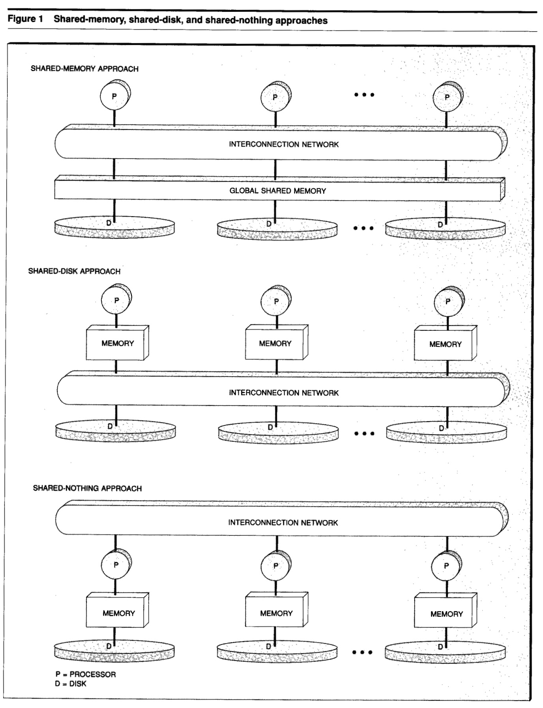  

---

## 三、并行数据库的三种架构 (Three Architectures of Parallel Databases)

论文第 293–294 页的 **图1** 是重中之重！它清晰地展示了三种架构：

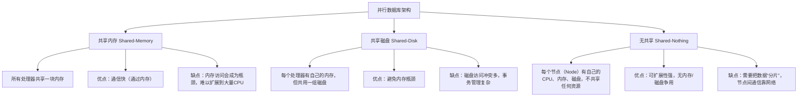
```mermaid
graph TD
    A[并行数据库架构] --> B[共享内存 Shared-Memory]
    A --> C[共享磁盘 Shared-Disk]
    A --> D[无共享 Shared-Nothing]

    B --> B1[所有处理器共享一块内存]
    B --> B2[优点：通信快（通过内存）]
    B --> B3[缺点：内存访问会成为瓶颈，难以扩展到大量CPU]

    C --> C1[每个处理器有自己的内存，但共用一组磁盘]
    C --> C2[优点：避免内存瓶颈]
    C --> C3[缺点：磁盘访问冲突多，事务管理复杂]

    D --> D1[每个节点（Node）有自己的CPU、内存、磁盘，不共享任何资源]
    D --> D2[优点：可扩展性强，无内存/磁盘争用]
    D --> D3[缺点：需要把数据“分片”，节点间通信靠网络]
```

> ✅ **DB2 PE 选择的是 “无共享 (Shared-Nothing)” 架构**，因为它能轻松扩展到上百个节点（见论文第 295 页）。

---

## 四、数据分片与分区 (Data Partitioning)

为了让 Shared-Nothing 架构高效工作，必须把表的数据**合理分布**到各个节点。

### 常见分区方式：
| 方式 | 说明 | 例子 |
|------|------|------|
| **轮询（Round-Robin）** | 一行一行轮流放 | 简单但查询效率低 |
| **哈希（Hash）** | 对某个列的值做哈希运算，结果决定存哪个节点 | 高效，论文中主要使用此方法 |
| **范围（Range）** | 根据某个列的值范围划分 | 适用于有范围查询的场景 |

论文第 299 页的 **图5** 解释了哈希分区的概念：  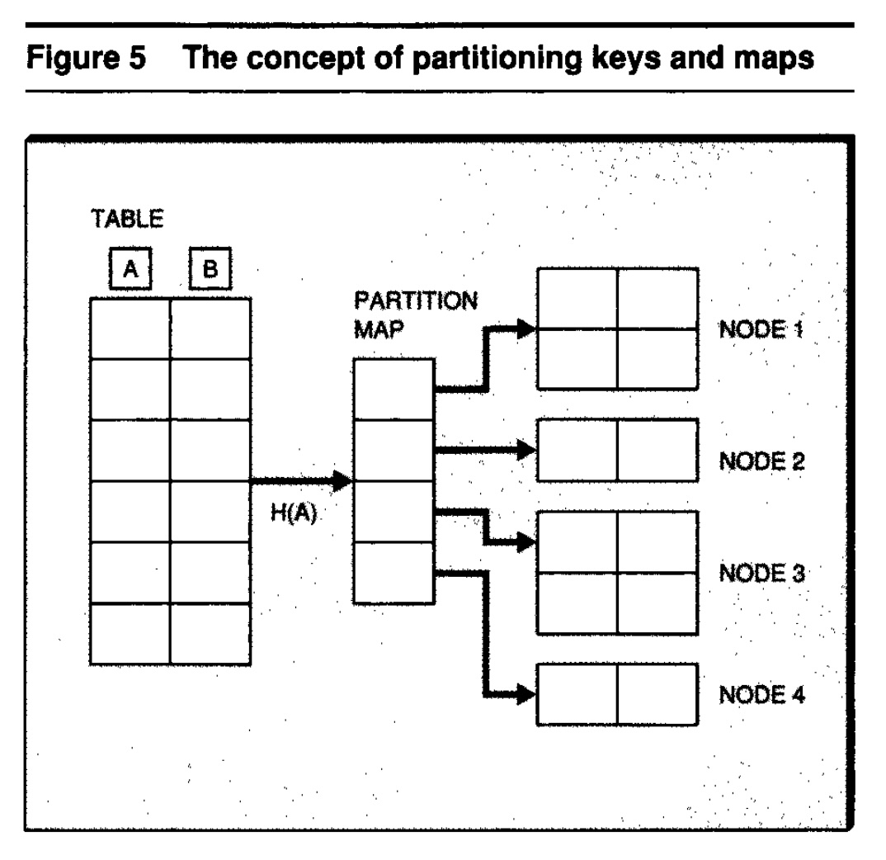  
```text
表: CUSTOMERS (Custkey integer, ...)
分区键: Custkey

哈希函数 H(Custkey) -> 分区号 (0 到 4095)
分区映射表 (Partition Map): [Node1, Node2, Node1, Node3, ...]

如果 H(Custkey=10000) = 100, 那么该行就存储在分区映射表第100个位置对应的节点上。
```
> 这种分区方式是 DB2 PE 实现高性能的关键，因为它能让查询在本地节点完成，减少网络传输。

---

## 五、并行查询优化 (Parallel Query Optimization)

这是论文的核心内容之一。

### 1. 查询优化器 (Query Optimizer)
- **作用**：分析 SQL 语句，生成最优的执行计划。
- **成本模型**：考虑 CPU、I/O、网络传输等开销，选择总成本最低的方案。
- **并行策略**：对于同一个查询，优化器会考虑多种并行执行策略（如广播连接、定向连接、重分区连接），并选择最优的一个。

论文第 301 页的 **图6** 展示了不同连接策略：  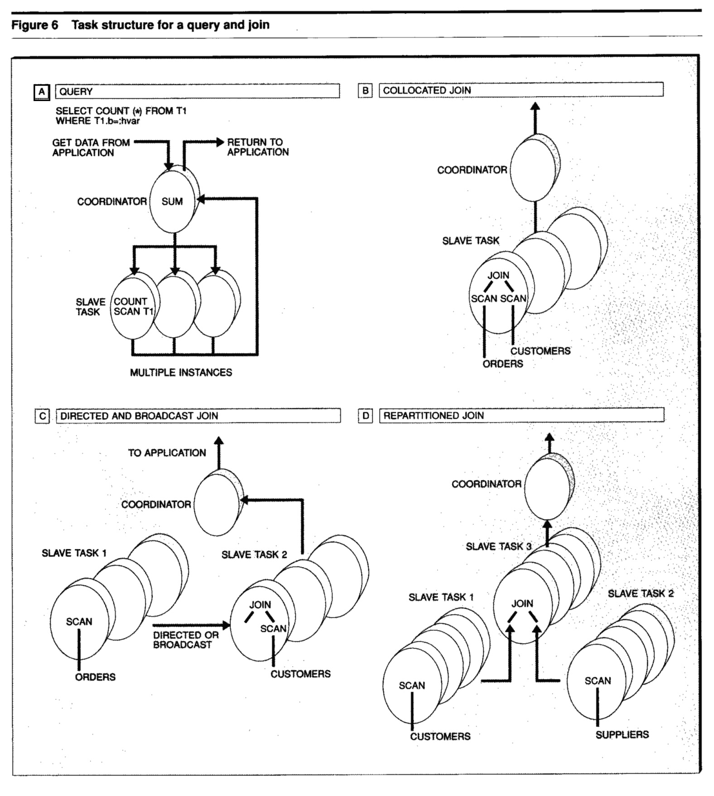  
- **Collocated Join (同位连接)**：两个表根据相同的分区键分区，连接操作可以在每个节点本地完成，无需数据传输。
- **Directed Join (定向连接)**：一个表根据分区键分区，另一个表不分区或分区键不同，需要将第二个表的数据根据连接键哈希后发送到第一个表所在的节点进行连接。
- **Broadcast Join (广播连接)**：将一个小表的数据广播到所有节点，然后在每个节点上与大表的本地分区进行连接。

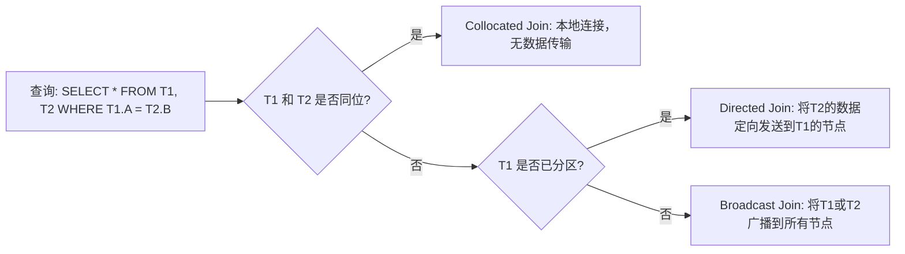
```mermaid
graph LR
    A[查询: SELECT * FROM T1, T2 WHERE T1.A = T2.B] --> B{T1 和 T2 是否同位?}
    B -- 是 --> C[Collocated Join: 本地连接，无数据传输]
    B -- 否 --> D{T1 是否已分区?}
    D -- 是 --> E[Directed Join: 将T2的数据定向发送到T1的节点]
    D -- 否 --> F[Broadcast Join: 将T1或T2广播到所有节点]
```

> 论文强调，DB2 PE 的优化器是“集成式”的，它从一开始就考虑并行性和数据分布信息，而不是在串行计划基础上简单改造。

---

## 六、运行时系统与事务管理 (Runtime & Transaction Management)

### 1. 协调器与从属任务 (Coordinator & Slave Tasks)
- **协调器 (Coordinator)**：接收用户请求，负责协调整个查询的执行。
- **从属任务 (Slave Tasks)**：在不同的节点上执行具体的子任务（如扫描、排序、连接）。

论文第 295 页的 **图2** 展示了一个简单查询的任务结构：  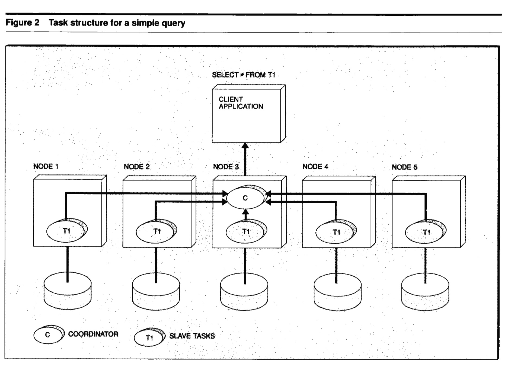  
```text
应用 --> 协调器 --> 5个从属任务 (每个节点一个) --> 扫描本地表分区 --> 返回结果给协调器 --> 返回给应用
```

### 2. 两阶段提交协议 (Two-Phase Commit Protocol)
- **目的**：保证跨多个节点的事务要么全部成功，要么全部失败。
- **过程**：
  1. **准备阶段**：协调器询问所有参与节点是否可以提交。
  2. **提交/回滚阶段**：如果所有节点都同意，则协调器通知所有节点提交；否则通知回滚。

论文第 308 页的 **图10** 描述了事务状态转换： 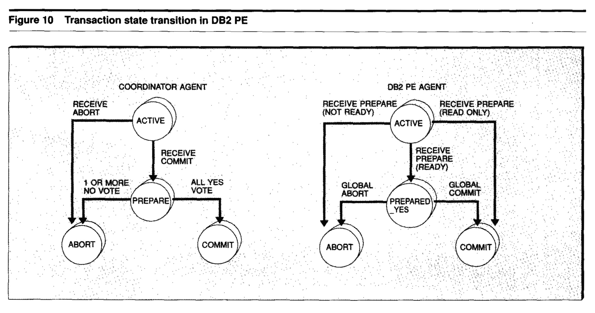  
```text
Active --> Prepare --> Commit / Abort
```

> DB2 PE 使用“预设回滚”协议，即如果事务状态丢失，默认认为事务已回滚。

---

## 七、数据库工具与实用程序 (Database Utilities)

DB2 PE 提供了一系列并行化的工具，用于管理和维护数据库。

### 1. 数据加载 (Data Loading)
- **并行加载**：数据可以并行加载到各个节点的本地分区，大大提高了加载速度。
- **性能指标**：论文第 313 页的 **表1** 显示，加载速率可达 2 GB/节点/小时。  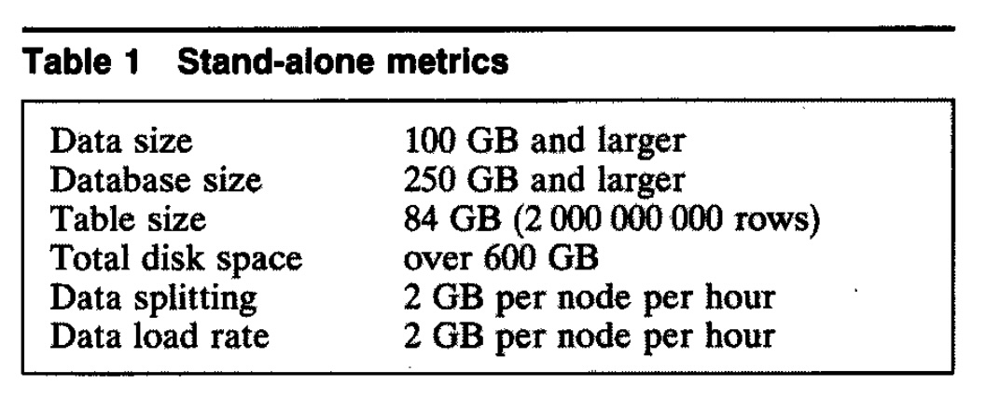  

### 2. 数据重分布 (Data Redistribution)
- **目的**：当数据分布不均时，重新分配数据以平衡负载。
- **在线操作**：可以在不影响其他表的情况下进行重分布。

### 3. 备份与恢复 (Backup & Restore)
- **并行备份**：每个节点可以独立备份自己的数据分区。
- **一致性恢复**：可以通过日志前滚（Roll Forward）确保所有节点恢复到一致的状态。

---

## 总结

要读懂《DB2 Parallel Edition》，你需要掌握以下知识：

1. **数据库基础**：关系型数据库、SQL、事务。
2. **并行计算基础**：并行 vs 串行。
3. **并行数据库架构**：重点理解 Shared-Nothing 架构（图1）。    
4. **数据分区**：哈希分区、分区键、分区映射表（图5）。    
5. **查询优化**：优化器如何选择并行执行策略（图6）。    
6. **运行时系统**：协调器、从属任务、两阶段提交协议（图10）。   
7. **数据库工具**：并行加载、数据重分布、备份恢复。

掌握了这些基础知识，你就能更好地理解 DB2 PE 的设计理念、技术细节和性能优势。希望这个讲解对你有所帮助！
  
## 2 解读论文 
  
好的，我们来用通俗易懂的中文解读这篇《DB2 Parallel Edition》论文。这篇论文的核心是介绍 IBM 如何打造一个能在多台电脑（节点）上并行工作的数据库系统，以应对海量数据和复杂查询的需求。

我们可以把它想象成一个“超级大厨团队”，而不是一个单打独斗的大厨。当面对一个需要处理海量食材（数据）的巨型宴席（复杂查询）时，单个厨师（传统数据库）会手忙脚乱、效率低下。而 DB2 PE 就是把任务分解，让多个厨师（节点）分工合作，从而大大提升效率。

---

## 一、为什么需要并行数据库？（背景与动机）

论文开篇就指出，**数据量的增长速度已经超过了单个处理器和硬盘性能的提升速度**。传统的单机数据库（Serial DBMS）在处理决策支持、数据挖掘等需要分析海量数据的应用时，会显得力不从心。

> **简单说：数据太多、查询太复杂，单台电脑跑不动了！**

DB2 PE 的目标就是解决这个问题，它不是一个全新的数据库，而是基于已有的 DB2/6000 产品，通过增加“并行”能力改造而来，就像给一辆普通汽车加装了涡轮增压和四驱系统。

---

## 二、核心架构：“无共享”（Shared-Nothing）—— 让每个节点都自给自足

这是整篇论文最核心的概念之一。论文第 293 页的 **图1** 清晰地展示了三种并行架构：    

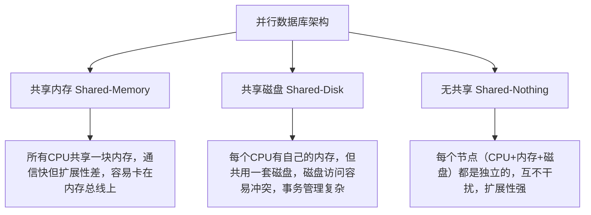
```mermaid
graph TD
    A[并行数据库架构] --> B[共享内存 Shared-Memory]
    A --> C[共享磁盘 Shared-Disk]
    A --> D[无共享 Shared-Nothing]

    B --> B1[所有CPU共享一块内存，通信快但扩展性差，容易卡在内存总线上]
    C --> C1[每个CPU有自己的内存，但共用一套磁盘，磁盘访问容易冲突，事务管理复杂]
    D --> D1[每个节点（CPU+内存+磁盘）都是独立的，互不干扰，扩展性强]
```

> ✅ **DB2 PE 选择了“无共享”架构**，因为它具有**极强的可扩展性**。你可以像搭积木一样，不断增加新的节点，系统就能线性地提升处理能力。这正是它能轻松支持数百GB甚至TB级数据的关键。

**“无共享”的代价是什么？**
- **数据必须分区（Partitioning）**：不能让所有数据都放在一个节点上，必须把一张大表的数据“切”开，分到不同的节点上。
- **需要复杂的协调机制**：比如，一个查询可能需要同时访问多个节点的数据，然后把结果汇总起来，这就需要一个“指挥官”（Coordinator）来调度。

---

## 三、关键核心技术：函数迁移（Function Shipping）—— 数据在哪，计算就在哪

既然数据分布在各个节点上，那么最高效的做法就是**让计算去“找”数据，而不是让数据“跑”到计算的地方**。这就是“函数迁移”（Function Shipping）的核心思想。

论文第 295 页的 **图2** 和 **图3** 很好地说明了这一点：     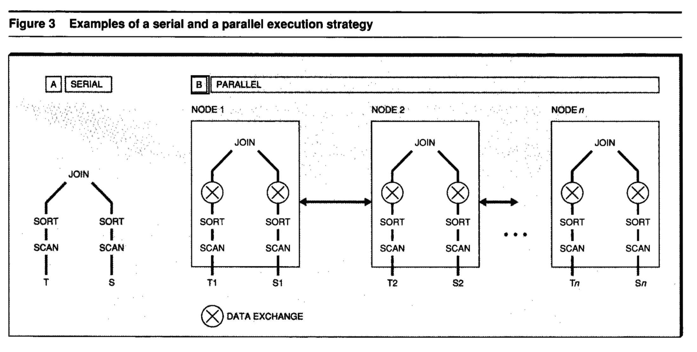  

*   **图2 (简单查询)**：应用发来一个查询 `SELECT * FROM T1`。因为表 T1 的数据被水平分区（Horizontal Partitioning）到了 5 个节点上，所以协调器（Coordinator）会向这 5 个节点各派一个“小弟”（Slave Task），让它们各自扫描自己本地的那部分数据，然后把结果返回给协调器，再由协调器汇总后返回给应用。
*   **图3 (复杂查询 - Join)**：对于更复杂的连接查询 `SELECT T.A, S.A FROM T, S WHERE T.B = S.B`，情况会更复杂。如果两个表 T 和 S 都按相同的键（如 T.B）进行了哈希分区，并且分区映射相同，那么就可以做“同位连接”（Collocated Join）。这意味着，T 表的某一行和 S 表中与之匹配的行，一定在同一个节点上。这样，每个节点上的“小弟”只需要在本地完成连接操作，无需网络传输，效率极高！

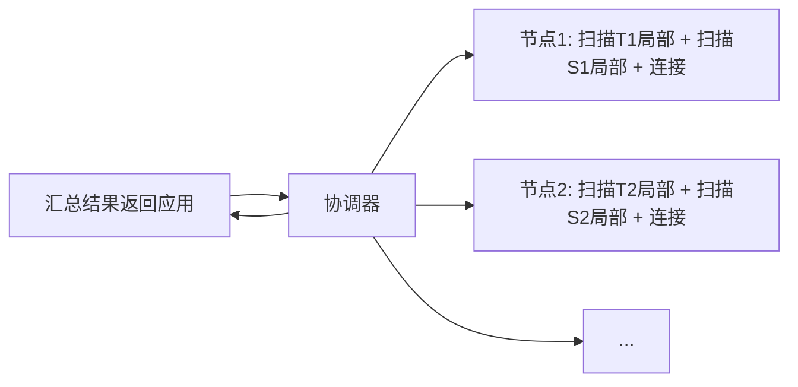
```mermaid
graph LR
    App[应用] --> Coord[协调器]
    Coord --> Slave1[节点1: 扫描T1局部 + 扫描S1局部 + 连接]
    Coord --> Slave2[节点2: 扫描T2局部 + 扫描S2局部 + 连接]
    Coord --> ...[...]
    Coord --> App[汇总结果返回应用]
```

> **总结：函数迁移就是“物尽其用”，充分利用每个节点的本地资源，减少昂贵的网络传输开销。**

---

## 四、数据如何分布？—— 用户可控的“数据布局”（Data Placement）

为了让“函数迁移”发挥最大威力，数据怎么分、分到哪个节点上，就变得至关重要。DB2 PE 提供了强大的用户控制能力。

### 1. 核心概念：NodeGroup（节点组）和 Partitioning Key（分区键）
*   **NodeGroup**：你可以创建一个命名的节点集合，比如 `CREATE NODEGROUP GROUP-1 ON NODES(1 TO 32, 40, 45, 48)`。这个组里的节点就是你用来存放某张表数据的“池子”。
*   **Partitioning Key**：当你创建表时，可以指定一个或多个列作为“分区键”，比如 `CREATE TABLE CUSTOMERS(Custkey integer, ...) IN GROUP-1 PARTITIONING KEY(Custkey) USING HASHING`。系统会根据这个键的值，通过哈希算法决定这条记录存放到 NodeGroup 中的哪个具体节点上。

论文第 299 页的 **图5** 解释了哈希分区的过程：    
```text
1. 对于表CUSTOMERS，分区键是Custkey。
2. 当插入一条记录时，系统计算 H(Custkey) （哈希值）。
3. 假设哈希值是 100，系统会查一个叫“分区映射表”（Partition Map）的数组。
4. 如果分区映射表的第100个位置是节点号 5，那么这条记录就会被存储在节点5上。
```
> **关键点：分区映射表是灵活的！** 你可以随时调整它，比如把原来分配给节点5的分区，重新分配给节点10，从而实现数据的动态平衡。

### 2. “同位表”（Collocated Tables）—— 性能杀手锏
如果两张表（如 CUSTOMERS 和 ORDERS）使用了相同的 NodeGroup 和兼容的分区键（比如都是 Custkey），那么它们就被称为“同位表”。

**好处**：执行 `JOIN` 操作时，关联的行必然在同一个节点上！这使得连接操作完全在本地完成，没有网络传输，性能达到极致。

```sql
-- 这是一个典型的“同位连接”查询，性能非常高
SELECT * FROM CUSTOMERS, ORDERS WHERE CUSTOMERS.Custkey = ORDERS.Custkey;
```

---

## 五、智能大脑：并行查询优化器（Query Optimizer）

有了数据分布的信息，优化器就能做出更聪明的决策。它不再只是为单机优化，而是要为整个分布式系统优化。

论文第 301 页的 **图6** 展示了不同类型的连接策略：   

*   **同位连接 (Collocated Join)**：最优，无数据传输。
*   **定向连接 (Directed Join)**：如果两张表不是同位的，但其中一张表（如 CUSTOMERS）是按连接键分区的，优化器会让另一张表（ORDERS）的数据根据连接键哈希后，“定向”发送到对应的 CUSTOMERS 节点上进行连接。这比全广播要高效。
*   **广播连接 (Broadcast Join)**：当一张表非常小的时候，优化器可能会选择将这张小表的数据“广播”到所有节点，然后每个节点都能用本地的小表和自己的大表分区进行连接。虽然有网络开销，但对小表来说是划算的。
*   **重分区连接 (Repartitioned Join)**：当以上策略都不理想时，优化器会“破釜沉舟”，先把两张表都按连接键重新分区到一组共同的节点上，然后再进行同位连接。这会产生大量的数据移动，成本最高，但有时是唯一的选择。

> **核心原则：成本估算（Cost-Based Optimization）**。优化器会估算每种策略的总成本（包括 CPU、I/O、网络传输），然后选择成本最低的那个方案。

---

## 六、运行时系统：协调者与执行者（Coordinator & Slave Tasks）

为了执行一个并行查询，系统内部需要复杂的协作。

*   **协调器 (Coordinator)**：它是“总指挥”。接收应用的请求，根据优化器生成的计划，把任务拆分成多个子任务（Subtasks），然后分发给各个节点上的“小弟”（Slave Tasks）去执行。
*   **小弟 (Slave Tasks)**：它们是“一线工人”，在各自的节点上执行具体的扫描、排序、连接等操作。
*   **表队列 (Table Queues)**：这是“小弟”之间传递数据的管道。它像一个流式管道，生产者（Sender）一边产生数据，消费者（Receiver）一边消费，中间不需要把所有数据都缓存起来，有效节省了内存。

论文第 306 页的 **图9** 描述了表队列的工作方式： 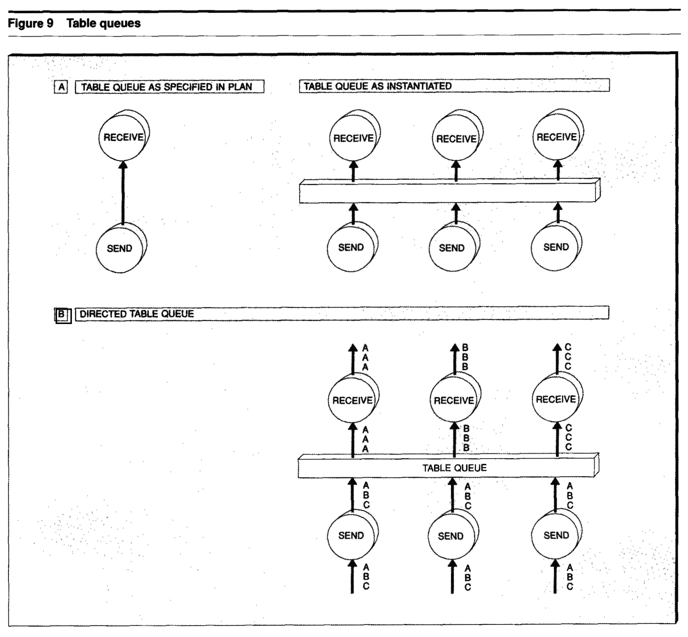  

> **注意：表队列可以是“广播”或“定向”的**。如果是“定向”，发送者会根据数据内容（如分区键）决定把数据发给哪个接收者。

---

## 七、高可用与实用工具：不只是查询，还要好用、可靠

DB2 PE 不仅追求高性能，也注重实用性和可靠性。

*   **高可用性 (High Availability)**：支持 HACMP 等技术，在某个节点宕机时，可以自动切换到备用节点，保证服务不中断。
*   **数据加载 (Load Utility)**：支持并行加载，可以在所有节点上同时导入数据，速度极快。论文第 313 页的 **表1** 显示，加载速率可达 **2 GB/节点/小时**。    
*   **数据重分布 (Redistribute Utility)**：当数据随着时间推移变得不均衡时，可以用这个工具在线地重新分配数据，无需停机。
*   **备份与恢复 (Backup & Restore)**：每个节点可以独立备份，恢复时也可以选择只恢复某个节点的数据，或者通过日志前滚（Roll Forward）恢复到一致状态。

---

## 八、性能表现：用数据说话

论文最后给出了详实的性能测试结果，证明了 DB2 PE 的强大。

*   **线性加速比 (Linear Speedup)**：在很多场景下，增加节点数量，性能几乎能成倍提升。例如，论文第 314 页的 **图11** 显示，对大表的扫描操作，在节点数从 4 增加到 8 时，执行时间几乎减半。  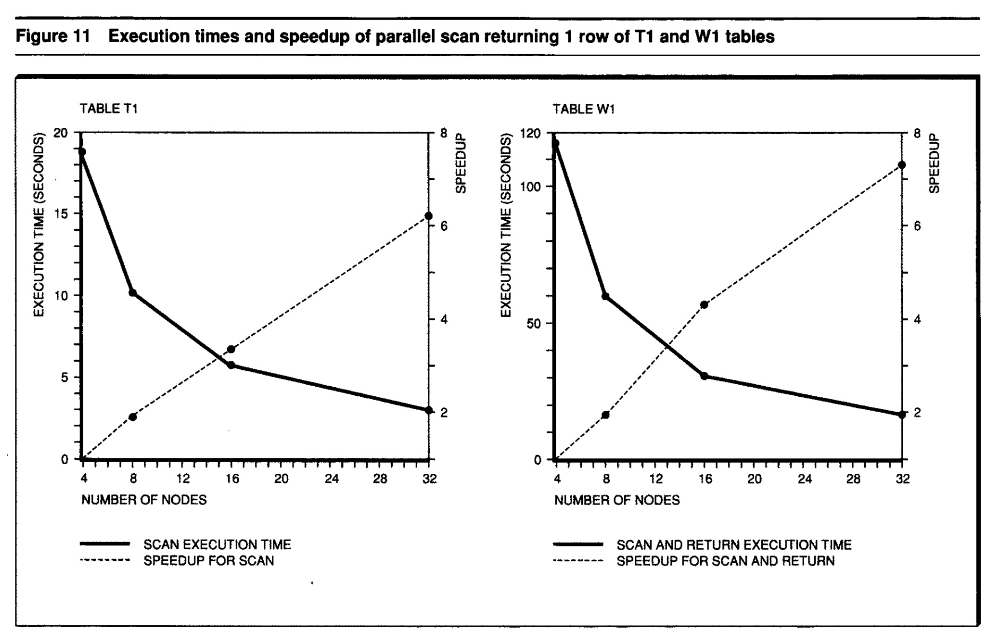  
*   **超线性加速比 (Superlinear Speedup)**：在某些情况下，性能提升甚至超过线性比例！论文第 317 页的 **表4** 显示，在并发用户数从 1 增加到 30 时，总耗时只增加了 1.5 倍，这是因为多个用户可以同时利用不同节点的资源，缓存复用率也提高了。  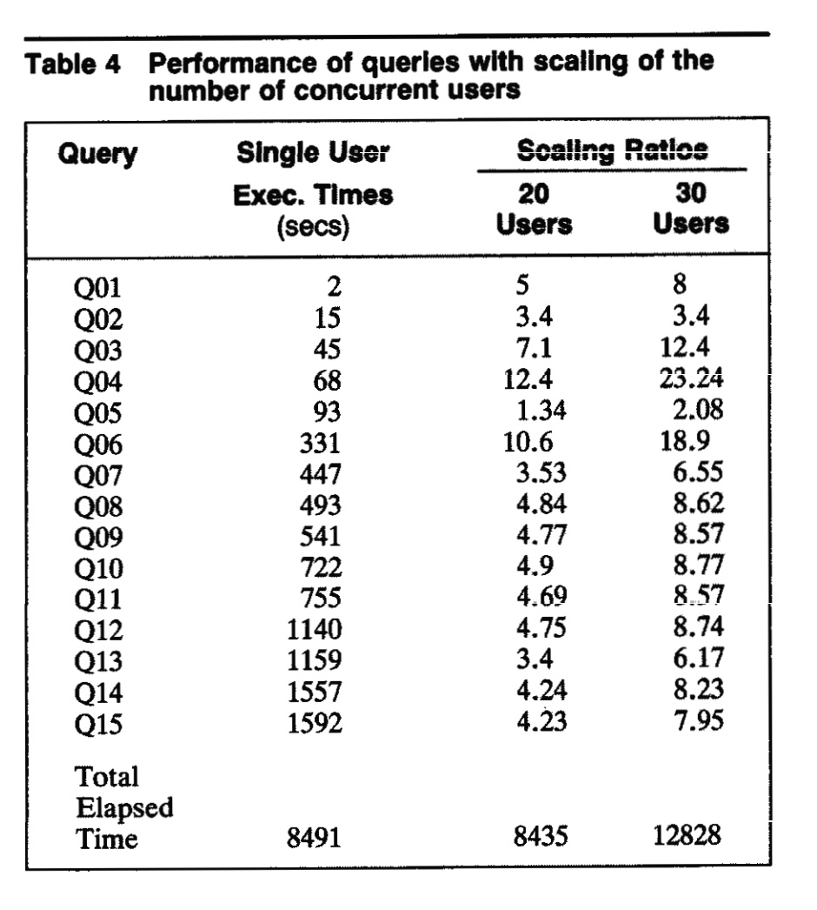  
*   **海量数据支持**：论文第 313 页的 **表1** 显示，系统支持 **超过 600GB 的磁盘空间**，单表大小可达 **84GB**，包含 **20亿行**数据。    

---

## 总结：DB2 PE 的成功之道

读完这篇论文，我们可以看到 DB2 PE 的成功并非偶然，而是源于几个关键的设计哲学：

1.  **拥抱“无共享”架构**：这是实现无限扩展性的基础。
2.  **坚持“函数迁移”模型**：最大化利用本地资源，最小化网络开销。
3.  **赋予用户数据控制权**：通过 NodeGroup 和分区键，让用户能根据业务需求优化数据布局。
4.  **构建智能的并行优化器**：基于成本和数据分布信息，自动选择最优执行计划。
5.  **打造全面的并行工具链**：从数据加载、重分布到备份恢复，所有环节都支持并行，确保系统在真实环境中好用、可靠。

总而言之，DB2 PE 是一个设计精良、功能全面、性能卓越的并行数据库系统，它完美地解决了大规模数据分析面临的性能瓶颈问题，为后来的现代分布式数据库奠定了重要的理论和实践基础。
  
## 3 术语 
  
好的，我们来提取《DB2 Parallel Edition》这篇论文中的核心术语，并用通俗易懂的中文为你讲解。理解这些术语是读懂整篇论文的关键。

---

## 一、核心架构与执行模型

### 1. **无共享架构 (Shared-Nothing Architecture)**

*   **通俗解释**：想象一个大型厨房，里面有很多个独立的小灶台（节点）。每个小灶台都有自己的锅碗瓢盆（内存）和食材仓库（磁盘），互不干扰。厨师们（处理器）只负责自己灶台上的活儿，需要合作时就通过传菜员（网络）传递信息或菜品。
*   **为什么重要**：这是 DB2 PE 的基石。它解决了“共享内存”和“共享磁盘”架构的瓶颈问题（如内存总线带宽、磁盘争抢），使得系统可以像搭积木一样，轻松地增加更多节点，实现近乎无限的扩展性。
*   **论文引用**：论文第 293-295 页的 **图1** 清晰地对比了三种架构，其中“无共享”被选为 DB2 PE 的方案。    

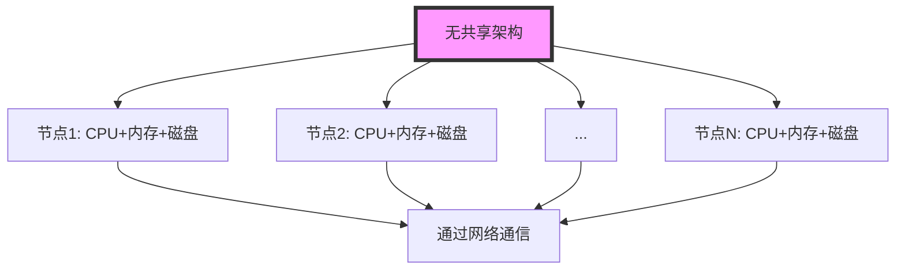
```mermaid
graph TD
    A[无共享架构] --> B[节点1: CPU+内存+磁盘]
    A --> C[节点2: CPU+内存+磁盘]
    A --> D[...]
    A --> E[节点N: CPU+内存+磁盘]
    B & C & D & E --> F[通过网络通信]
    style A fill:#f9f,stroke:#333,stroke-width:4px
```

### 2. **函数迁移 (Function Shipping)**

*   **通俗解释**：这是“无共享”架构下的核心执行策略。简单说就是“数据不动，计算过去”。当一个查询需要处理某个表的数据时，系统不会把数据从一个节点搬到另一个节点，而是把处理数据的“程序”（函数）发送到数据所在的节点去执行。这就像快递员直接去你家取件，而不是让你把包裹送到快递站。
*   **为什么重要**：这是实现高性能的关键，因为它极大地减少了昂贵的网络数据传输开销，让计算发生在数据本地。
*   **论文引用**：论文第 295 页的 **图2** 和 **图3** 展示了函数迁移的例子。图2是一个简单的扫描查询，协调器会向所有节点派发“小弟”（Slave Task）去本地扫描数据。图3则展示了更复杂的连接查询，如何在多个节点上并行执行。     

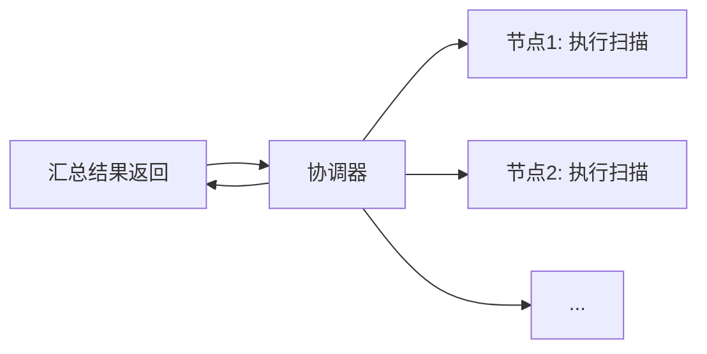
```mermaid
graph LR
    App[应用] --> Coord[协调器]
    Coord --> Slave1[节点1: 执行扫描]
    Coord --> Slave2[节点2: 执行扫描]
    Coord --> ...[...]
    Coord --> App[汇总结果返回]
```

---

## 二、数据管理与分布

### 3. **节点组 (Nodegroup)**

*   **通俗解释**：你可以把它想象成一个“数据分区池”。当你创建一张表时，你可以指定它属于哪个“池子”（Nodegroup）。这个“池子”里包含了一组具体的物理节点（比如节点1到32，以及40、45、48）。
*   **为什么重要**：它让用户能灵活地控制数据存放在哪些节点上，是实现数据负载均衡和优化性能的基础。
*   **论文引用**：论文第 298 页详细介绍了 `CREATE NODEGROUP` 语句。

### 4. **分区键 (Partitioning Key) 与 分区映射表 (Partition Map)**

*   **通俗解释**：
    *   **分区键**：是决定数据“住”在哪个节点的“门牌号”。比如，对于客户表，你可以选择“客户ID”作为分区键。系统会根据这个ID值，通过哈希算法算出一个“房间号”（分区号）。
    *   **分区映射表**：是一张“酒店客房分配表”，它记录了“房间号”（分区号）对应的是哪个“楼层”（节点号）。例如，分区号100可能对应节点5。
*   **为什么重要**：它们共同决定了数据在集群中的物理分布，是实现高效并行查询（尤其是“同位连接”）的前提。
*   **论文引用**：论文第 299 页的 **图5** 生动地解释了这一过程。    

```text
客户表 (Customer)
| Custkey | Name | ...
|---------|------|-----
| 10000   | 张三 | ...

分区键: Custkey
哈希函数 H(10000) = 100 (分区号)

分区映射表 (Partition Map)
索引 | 节点号
-----|------
0    | 1
1    | 2
...
100  | 5  <-- 这行决定了数据存储位置
...
```

### 5. **同位表 (Collocated Tables)**

*   **通俗解释**：如果两张表（比如客户表和订单表）使用了相同的“节点组”和兼容的“分区键”（比如都是Custkey），那么它们就是“同位表”。这意味着，拥有相同客户ID的客户信息和订单信息，一定会被存储在同一个节点上。
*   **为什么重要**：这是性能的“杀手锏”。当进行关联查询（JOIN）时，因为数据就在同一个节点上，所以不需要任何网络传输，可以在本地完成，速度极快。
*   **论文引用**：论文第 299-300 页多次强调其重要性，并给出了例子 `select * from PARTS, PARTSUPP where PARTS.PARTKEY = PARTSUPP.PARTKEY;`

---

## 三、查询处理与优化

### 6. **并行查询优化器 (Parallel Query Optimizer)**

*   **通俗解释**：它是整个系统的“大脑”和“指挥官”。它的任务是接收一条 SQL 查询，然后思考：“我该怎么安排手下的‘小弟’（Slave Tasks）才能最快、最省力地把这个活儿干完？” 它会考虑各种并行执行策略（比如是做“同位连接”还是“广播连接”），并估算每种策略的成本（CPU、I/O、网络），最后选择最优的那个方案。
*   **为什么重要**：没有一个好的优化器，再强大的硬件也发挥不出威力。DB2 PE 的优化器是“集成式”的，从一开始就考虑并行性和数据分布，而不是在串行计划基础上打补丁。
*   **论文引用**：论文第 300-304 页详细描述了其工作原理，特别是 **图6** 和 **图7** 展示了不同类型的连接策略及其成本权衡。     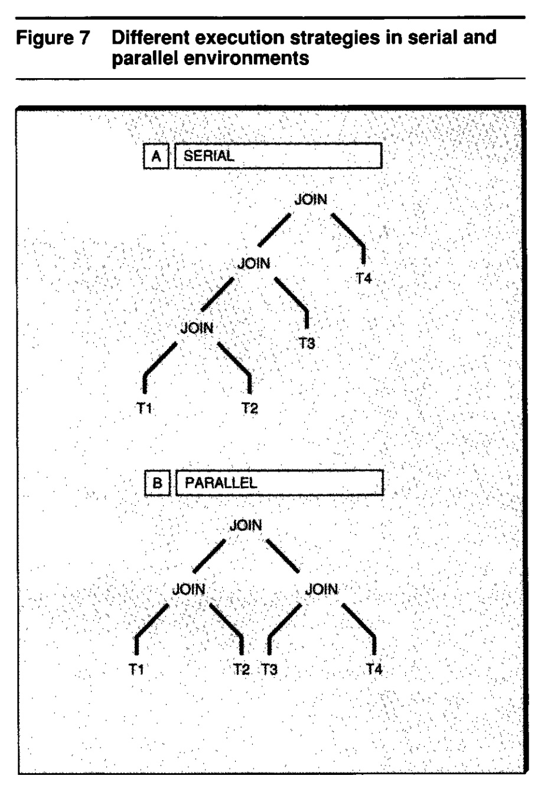  

### 7. **同位连接 (Collocated Join)**

*   **通俗解释**：一种特殊的连接操作。当两个“同位表”按分区键进行连接时，由于数据天然就在同一个节点上，所以连接操作完全在本地完成，无需任何网络数据交换。
*   **为什么重要**：这是最高效的连接方式，性能几乎是完美的线性扩展。
*   **论文引用**：论文第 301 页的 **图6B** 展示了这种策略。  

### 8. **定向连接 (Directed Join)**

*   **通俗解释**：当两个表不是“同位表”时，但其中一个表是按连接键分区的，优化器会选择将另一个表的数据“定向”发送到第一个表所在的节点进行连接。这比全量广播要节省很多网络流量。
*   **为什么重要**：在无法实现“同位连接”时的一种折中方案，能在保证一定性能的同时，尽量减少网络开销。
*   **论文引用**：论文第 302 页的 **图6C** 有说明。

### 9. **广播连接 (Broadcast Join)**

*   **通俗解释**：当一个小表需要和一个大表连接时，优化器可能会选择把小表的数据“广播”到所有节点，让每个节点都能拿到一份小表的副本，然后在本地和大表的分区进行连接。
*   **为什么重要**：虽然代价较高（网络流量大），但在小表参与连接时非常有效。
*   **论文引用**：论文第 302 页的 **图6C** 也有提及。

---

## 四、运行时与事务管理

### 10. **协调器 (Coordinator)**

*   **通俗解释**：它是整个查询的“项目经理”。当应用发起一个请求时，首先由“协调器”接收。它负责分解任务、调度“小弟”（Slave Tasks）、收集结果，并最终把答案返回给应用。
*   **为什么重要**：它是用户与分布式系统之间的桥梁，提供了“单系统视图”，让用户感觉像是在操作一个数据库。
*   **论文引用**：论文第 295 页的 **图2** 和 **图8** 都提到了协调器。    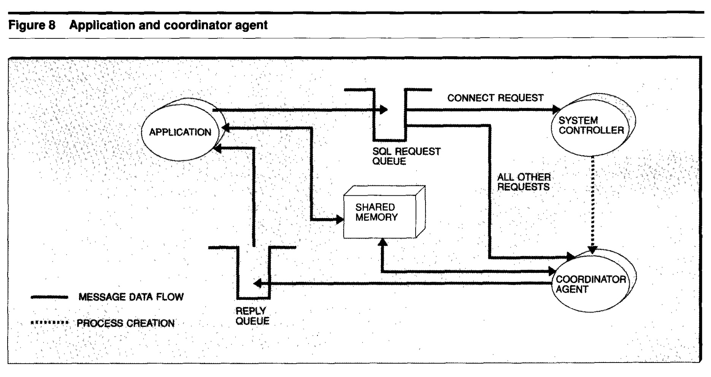  

### 11. **从属任务 (Slave Task / Subordinate Task)**

*   **通俗解释**：它们是“协调器”手下的“工人”。每个“从属任务”通常在一个特定的节点上运行，负责执行该节点上的具体数据操作（如扫描、排序、连接）。
*   **为什么重要**：它们是实际干活的人，构成了并行执行的基础。
*   **论文引用**：论文第 295 页的 **图2** 显示了一个协调器和五个从属任务。  

### 12. **表队列 (Table Queue)**

*   **通俗解释**：这是节点间传递数据的“管道”。它不是一个完整的临时表，而是一个流式的、支持背压（back pressure）的通道。生产者（Sender）一边往里写数据，消费者（Receiver）一边往外读，中间不需要把所有数据都缓存起来。
*   **为什么重要**：它是实现并行查询中数据流动的核心机制，确保了数据能在不同任务和节点间高效、有序地传递。
*   **论文引用**：论文第 305-306 页的 **图9** 解释了表队列的工作方式。   

### 13. **两阶段提交协议 (Two-Phase Commit Protocol)**

*   **通俗解释**：这是保证分布式事务一致性的“投票表决”机制。当一个事务涉及多个节点时，协调器会先问所有节点：“你们准备好了吗？”（准备阶段）。如果所有人都回答“准备好了”，协调器再下达“执行！”的命令（提交阶段）。如果有人没准备好，或者在第一阶段后失败了，整个事务就会被回滚。
*   **为什么重要**：它确保了“要么全部成功，要么全部失败”的原子性（ACID 中的 A），即使在分布式环境下也能保证数据的一致性。
*   **论文引用**：论文第 308 页的 **图10** 描述了事务状态的转换过程。   

---

## 五、实用工具与特性

### 14. **数据重分布 (Data Redistribution)**

*   **通俗解释**：随着时间推移，数据插入和删除会导致某些节点上的数据变多（热点），而另一些节点变少。数据重分布工具就像一个“数据搬运工”，它会自动分析当前数据分布，然后把一些数据从“拥挤”的节点搬到“空闲”的节点，让整个系统重新达到平衡。
*   **为什么重要**：它保证了系统的长期稳定和高性能，避免了因数据倾斜导致的性能瓶颈。
*   **论文引用**：论文第 310 页详细介绍了此功能。

### 15. **高可用性 (High Availability)**

*   **通俗解释**：指系统在部分组件（如某个节点）发生故障时，仍然能够继续提供服务的能力。DB2 PE 支持 HACMP 等技术，当一个节点挂掉时，另一个备用节点可以迅速接管其工作，对用户来说几乎是无感知的。
*   **为什么重要**：对于企业级应用来说，系统不能停，高可用性是基本要求。
*   **论文引用**：论文第 311 页对此进行了讨论。

---

## 总结

以上这些术语构成了理解《DB2 Parallel Edition》论文的骨架。掌握它们，你就能清晰地看到 DB2 PE 是如何通过“无共享”架构、“函数迁移”执行、“智能优化器”和“精细的数据管理”来构建一个强大、可扩展的并行数据库系统的。希望这份通俗易懂的讲解对你有所帮助！
  
## 参考        
         
https://grape.ics.uci.edu/wiki/asterix/raw-attachment/wiki/cs295-2009-fall/ParallelDB2.pdf    
        
<b> 以上内容基于DeepSeek、Qwen、Gemini及诸多AI生成, 轻微人工调整, 感谢杭州深度求索人工智能、阿里云、Google等公司. </b>        
        
<b> AI 生成的内容请自行辨别正确性, 当然也多了些许踩坑的乐趣, 毕竟冒险是每个男人的天性.  </b>        
  
    
#### [期望 PostgreSQL|开源PolarDB 增加什么功能?](https://github.com/digoal/blog/issues/76 "269ac3d1c492e938c0191101c7238216")
  
  
#### [PolarDB 开源数据库](https://openpolardb.com/home "57258f76c37864c6e6d23383d05714ea")
  
  
#### [PolarDB 学习图谱](https://www.aliyun.com/database/openpolardb/activity "8642f60e04ed0c814bf9cb9677976bd4")
  
  
#### [PostgreSQL 解决方案集合](../201706/20170601_02.md "40cff096e9ed7122c512b35d8561d9c8")
  
  
#### [德哥 / digoal's Github - 公益是一辈子的事.](https://github.com/digoal/blog/blob/master/README.md "22709685feb7cab07d30f30387f0a9ae")
  
  
#### [About 德哥](https://github.com/digoal/blog/blob/master/me/readme.md "a37735981e7704886ffd590565582dd0")
  
  

  
