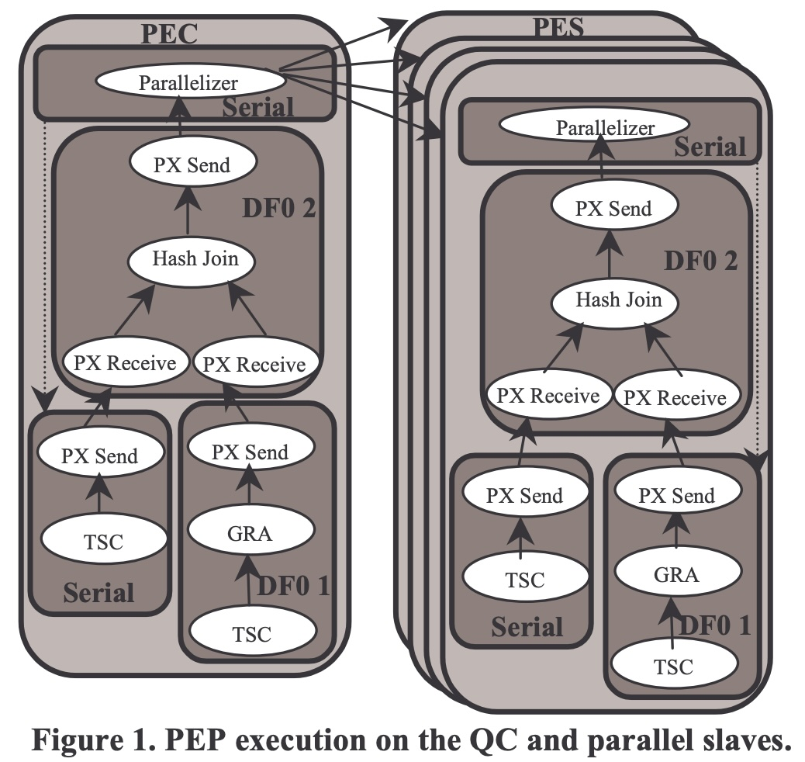
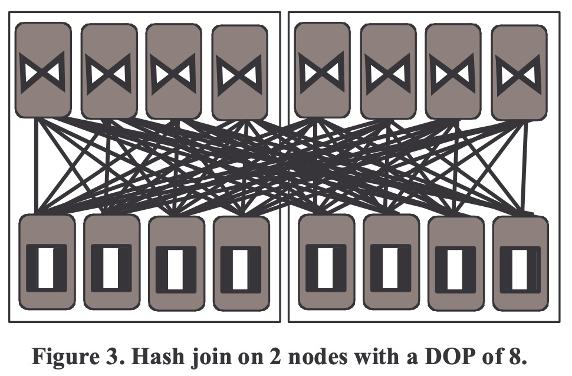
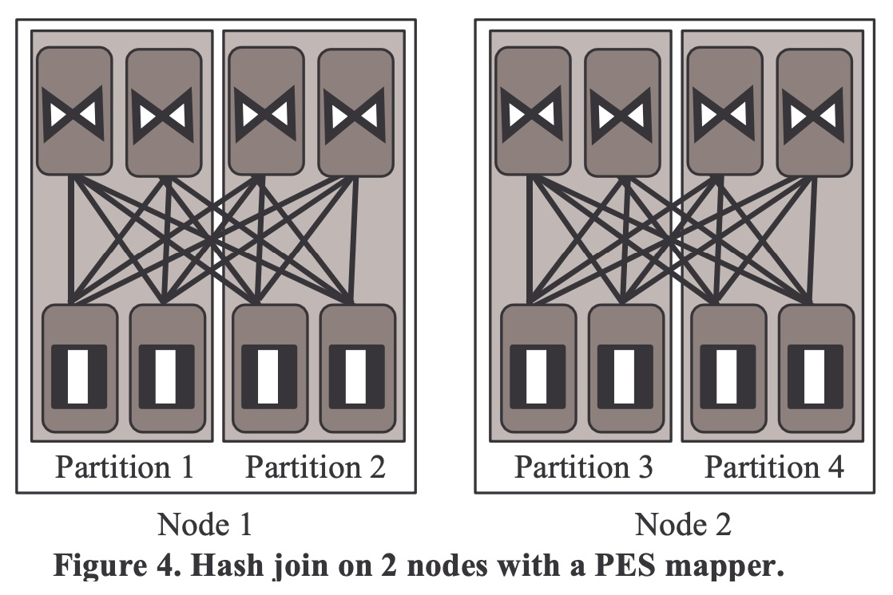
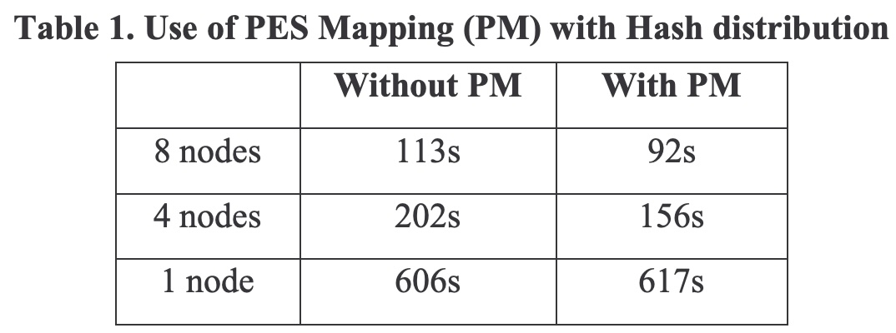

## AI论文解读 | Parallel Sql Execution In Oracle 10G
        
### 作者        
digoal        
        
### 日期        
2025-10-19        
        
### 标签        
PostgreSQL , PolarDB , DuckDB , AI , 论文解读        
        
----        
        
## 背景  
      
https://dl.acm.org/doi/pdf/10.1145/1007568.1007666        
  
提示:          
```          
读懂《Parallel Sql Execution In Oracle 10G》这篇论文需要提前掌握哪些基础知识, 请使用中文通熟易懂的讲解这些基础知识, 可以引用论文中的图、表或使用Markdown支持的图形(text,mermaid等)增加解释性. 
  
使用中文通熟易懂的解读《Parallel Sql Execution In Oracle 10G》这篇论文, 其中的关键内容请着重讲解, 可以引用论文中的图、表或使用Markdown支持的图形(text,mermaid等)增加解释性. 
  
提取《Parallel Sql Execution In Oracle 10G》这篇论文中的重要术语, 使用中文对这些术语进行通熟易懂的讲解, 可以引用论文中的图、表或使用Markdown支持的图形(text,mermaid等)增加解释性. 
```     
  
## 1 前置知识 
  
要深入理解《Parallel SQL Execution in Oracle 10g》这篇论文，你需要掌握一些数据库和并行计算的基础知识。这篇论文介绍的是 Oracle 10g 中并行执行 SQL 的新架构和优化技术 。

以下我将为你梳理阅读这篇论文所需的核心基础知识，并结合论文中的图表（如论文中的图1、图3、图4和表1）来辅助说明。


### 1\. 数据库基础知识

这是最基本的要求，你需要大致了解：

  * **SQL (结构化查询语言):** 了解 SQL 是用来从数据库中查询、插入、更新和删除数据的语言。
  * **查询计划 (Query Plan):** 这是理解本文的重中之重。当你执行一条 SQL 时，数据库并不会直接去读数据，它会先生成一个“执行菜谱”，这个菜谱就叫“查询计划”。它详细说明了是先扫描表A，还是先连接表B，是使用索引，还是全表扫描等。
  * **基本操作符 (Operators):** 查询计划由一系列操作符（或叫“行源” Row Source）组成 。你需要知道几个常见的：
      * **Scan (扫描):** 从磁盘读取数据的操作。
      * **Join (连接):** 将两个表的数据按特定条件（如 `ON a.id = b.id`）合并的操作，有多种实现方式，如论文中提到的“哈希连接”(Hash Join) 。
      * **Aggregation (聚合):** 如 `GROUP BY` 或 `SUM()`，用于数据汇总。

### 2\. 核心概念：并行计算架构

这篇论文的核心是“并行”，即“多个人同时干活”。要理解 Oracle 的做法，你必须先了解两种主流的并行计算架构。

#### a. Shared-Nothing (SN) 架构 (无共享)

  * **通俗比喻：** 想象一个大公司有很多个分部。每个分部有**自己的员工**（CPU/内存）和**自己的文件柜**（磁盘）。
  * **工作方式：** 每个分部只能处理自己文件柜里的文件（数据）。如果分部A需要分部B的文件，必须通过网络发快递（Interconnect）。
  * **特点：** 数据被“静态分区”并固定映射到某个节点 。优点是扩展性好，缺点是灵活性差——如果分部A很忙，分部B很闲，B也没法直接帮A处理A的文件。

#### b. Shared-Disk (SD) 架构 (共享磁盘)

  * **通俗比喻：** 还是这个大公司，但现在它只有一个**中央文件室**（共享磁盘阵列），所有分部（节点）的**所有员工**（CPU）都有权限去这个文件室拿任何文件 。
  * **工作方式：** 这就是 Oracle 采用的基础架构 。所有节点都可以访问所有数据 。
  * **特点：** 极高的灵活性 。因为数据不需要被静态分区和映射 ，任何一个节点（员工）都可以被灵活地指派去处理任何数据（文件）。
  * **论文的观点：** 作者认为，这种灵活性使其能更好地适应“网格计算”(Grid Computing) 环境，因为资源可以被动态分配和释放 。

### 3\. 数据库优化器 (Optimizer)

  * **是什么？** 优化器就是数据库的“大脑”。它负责为你的 SQL 语句制定上面提到的“查询计划”。
  * **基于成本 (Cost-Based):** 优化器会估算多种不同查询计划的“成本”（如CPU、I/O消耗），然后选择一个它认为成本最低的计划 。
  * **并行度 (DOP):** 即 "Degree of Parallelism"，指数据库决定用多少个“工人” (即 PES) 来并行执行这个任务 。优化器在选择计划时会把 DOP 考虑在内 。

### 4\. 论文中的关键术语和抽象

一旦你有了以上基础，就可以开始理解论文提出的概念了。

  * **PEC 和 PES (经理与工人):**

      * **PEC (Parallel Execution Coordinator):** 并行执行协调器 。你可以理解为“项目经理”或“工头”，它负责协调整个任务。
      * **PES (Parallel Execution Server):** 并行执行服务器 。这就是“工人”（在Unix上是进程，在Windows上是线程 ），负责干具体的活。

  * **DFO 和 TQ (子任务与传送带):**

      * **DFO (Dataflow Operator):** 数据流操作符 。一个并行的查询计划会被拆分成多个 DFO（可以理解为“子任务”）。
      * **TQ (Table Queue):** 表队列 。这就是 DFO 之间（即“工人”与“工人”之间）传递数据的“传送带” ，它封装了数据的重分布 。

  * **Granule (工作单元/任务包):**

      * 这是实现动态负载均衡的关键 。PEC (经理) 不会一次性把所有任务分配死，比如“工人A你负责表的前半部分，工人B你负责后半部分”。
      * 相反，PEC 会把整个任务（比如扫描一个大表）切成很多小的“任务包”(Granule) 。
      * **工作流：** 某个 PES (工人) 空闲了，就通过一个叫 GRA (Granule Iterator) 的东西向 PEC (经理) 请求一个“任务包” 。干完后，再要下一个 。
      * **好处：** 这样一来，手脚快的工人 (PES) 就会多干点，手脚慢的就少干点，但大家都能保持忙碌，不会有人闲着等别人，从而自动实现负载均衡 。

### 5\. 论文的核心创新点：PSC 模型

理解了上述概念后，你才能看懂论文最大的创新点：**PSC (Parallel Single Cursor) 模型**，即“并行单游标”模型 。

  * **旧的问题：** 在 Oracle 10g 之前，管理和监控并行操作很复杂 。PEC (经理) 和 PES (工人) 之间可能需要传递不同的“子计划”或“中间语言” ，这不仅复杂、容易出错，而且维护成本高 。

  * **PSC 的解决方案：** **只使用一个单一的、全局的并行计划** 。

  * **看图1：** 这张图完美地诠释了 PSC。  

    ```text
         PEC (经理)                         PES (工人)
    +------------------+             +------------------+
    |   Parallelizer   |             |   Parallelizer   |
    |      Serial      |             |      Serial      |
    |  +-------------+ |             |  +-------------+ |
    |  |   DFO 2     | |             |  |   DFO 2     | |
    |  |  (Hash Join)| |   <----->   |  |  (Hash Join)| |
    |  | (PX Receive)| |             |  | (PX Receive)| |
    |  +-------------+ |             |  +-------------+ |
    |  |   DFO 1     | |             |  |   DFO 1     | |
    |  | (Serial Scan)| |             |  | (Parallel)  | |
    |  +-------------+ |             |  +-------------+ |
    +------------------+             +------------------+
    ```

      * **解释：** 如图所示，PEC 和 PES 使用的是**同一套计划**（或其副本）。唯一的区别是它们“激活”的部分不同。比如在这个例子中，PEC 负责执行串行的 DFO 1（左侧的 Serial Scan）和顶层的协调工作 ，而 PES 负责执行并行的 DFO 1（右侧的 Parallel Scan）和 DFO 2 (并行的 Hash Join) 。
      * **好处：** 极大提升了可管理性、可监控性 。因为所有统计信息（如内存、消息数）都在这一个共享计划的行源 (row source) 中，可以很方便地被聚合和查看 。

### 6\. 结合图表理解优化技巧

论文第4节讨论了具体的执行和优化，理解这些图表很有帮助。

  * **图3 (Hash Join on 2 nodes):**     

      * **场景：** 这是一个常规的并行哈希连接。
      * **问题：** 下方的8个扫描 PES (工人) 需要把数据发送给上方的8个连接 PES (工人)。在跨节点（Node 1, Node 2）时，数据必须通过集群的“互联网络”(Interconnect) 。
      * **图解：** 图中显示了密密麻麻的连接线，表示“全员对全员”(all-to-all) 的通信，这在节点间（跨节点）的成本非常高 。

  * **图4 (Hash Join with a PES mapper):**    

      * **场景：** 这是 Oracle 10g 的“集群感知”(Cluster-aware) 优化，使用了一种叫 **PES Mapper** 的技术 。
      * **解决方案：** 它的核心思想是“本地化”通信。
      * **图解：** 如图所示，Node 1 上的4个扫描工人**只**把数据发给 Node 1 上的4个连接工人。Node 2 也是如此。
      * **好处：** 跨节点的数据传输（图中间的空白）几乎被消除了 。所有的数据交换都在节点内部完成，这比跨节点网络快得多 。

  * **表1 (Table 1):**    

      * 这张表用数据证明了图4（带 PES Mapper）的好处。
      * 在8个节点的环境下，不使用 PM (PES Mapper) 跑完查询要 113 秒，而使用 PM 只需要 92 秒 。这证明了减少跨节点通信能显著提升性能和扩展性 。

-----

### 总结

你需要的基础知识清单：

1.  **数据库入门：** 什么是 SQL、什么是查询计划。
2.  **核心架构对比：** **Shared-Disk (Oracle) vs. Shared-Nothing (其他)**。这是理解 Oracle 所有设计决策（如动态负载均衡）的根源。
3.  **优化器概念：** 知道“基于成本的优化”和“并行度(DOP)”是什么。
4.  **论文术语：** 至少要分清 **PEC (经理)** 和 **PES (工人)**，以及 **Granule (任务包)** 是用来动态分配任务的。

掌握了这些，你就能明白这篇论文的核心贡献：在灵活的 **Shared-Disk** 架构上，通过创新的 **PSC (单一全局计划)** 模型 ，辅以 **Granule (动态任务包)**  和 **PES Mapper (本地化通信)**  等优化手段，实现了一个高效、可扩展且易于管理的并行 SQL 执行引擎。
  
## 2 解读论文 
  
这是一篇关于 Oracle 10g 数据库中并行 SQL 执行新架构的经典论文。简单来说，它讲解了 Oracle 如何“重构”其并行处理引擎，使其更智能、更易于管理，尤其是在当时新兴的“网格计算”环境中 。

这篇论文的核心是解决一个长期存在的痛点：**并行 SQL 性能强大，但难以管理、监控和诊断** 。Oracle 10g 的解决方案是引入了一个名为 **“并行单游标”（Parallel Single Cursor, PSC）** 的新模型 。

以下是对这篇论文关键内容的通俗解读：

### 1\. 基础架构：Oracle 的“共享磁盘” (Shared-Disk)

要理解这篇论文，首先要明白 Oracle 并行架构的根基：**共享磁盘** 。

  * **通俗比喻：** 想象一个大公司的所有员工（节点/服务器）都可以访问同一个中央文件室（共享磁盘）。
  * **这有何不同？** 在另一种“无共享”(Shared-Nothing) 架构中，每个员工（节点）只有自己的文件柜，要别人的文件得通过网络传递。
  * **Oracle 的优势：** “共享磁盘”带来了巨大的**灵活性**。数据不需要被静态地“分区”并绑定到特定节点 。任何一个“工人”进程都可以被灵活地指派去处理*任何*数据 。这篇论文强调，这种灵活性是它们适应动态网格环境的关键 。

### 2\. 核心术语：经理、工人与任务包

论文中提到了几个关键抽象，我们可以把它们理解为：

  * **PEC (Parallel Execution Coordinator - 并行执行协调器):**
      * **角色：** “项目经理”或“工头” 。它负责接收 SQL 任务，制定计划，并协调“工人”。
  * **PES (Parallel Execution Server - 并行执行服务器):**
      * **角色：** “工人” 。这些是真正干活的进程或线程 ，负责扫描数据、连接表等。
  * **DFO (Dataflow Operator - 数据流操作符):**
      * **角色：** “子任务”或“流水线阶段” 。一个复杂的并行计划会被拆分成多个 DFO。
  * **TQ (Table Queue - 表队列):**
      * **角色：** “传送带” 。它负责在不同的“工人”群体之间（即 DFO 之间）重新分配数据。
  * **GRA (Granule Iterator - 任务包迭代器):**
      * **角色：** “动态任务分发器” 。这是实现负载均衡的核心。

### 3\. 【重点】核心创新：PSC (并行单游标) 模型

这是全篇论文**最关键**的创新点。

**(1) 旧的问题：**
在 Oracle 10g 之前，并行执行的管理很复杂 。"经理" (PEC) 和 "工人" (PES) 之间可能使用不同的计划片段或某种“中间语言”来通信 。这导致了几个问题：

  * **难监控：** 很难将所有“工人”的执行统计信息（如内存使用、消息数）汇总成一个清晰的全局视图。
  * **难维护：** 开发团队要维护这种复杂的“函数 shipping”机制，既困难又容易出错 。

**(2) PSC 的解决方案：一个计划，全局共享**
PSC 模型规定，对于一条 SQL 语句，**所有参与者（包括“经理”PEC 和所有“工人”PES）都使用同一个、全局的并行执行计划** 。

我们可以用论文中的 **图1** 来理解这个概念：    

```text
       PEC (经理)                           PES (工人)
    +------------------+             +------------------+
    |   Parallelizer   |             |   Parallelizer   |
    |      Serial      |             |      Serial      |
    |  +-------------+ |             |  +-------------+ |
    |  |   DFO 2     | |             |  |   DFO 2     | |
    |  |  (Hash Join)| |   <----->   |  |  (Hash Join)| |
    |  | (PX Receive)| |             |  | (PX Receive)| |
    |  +-------------+ |             |  +-------------+ |
    |  |   DFO 1     | |             |  |   DFO 1     | |
    |  | (Serial Scan)| |             |  | (Parallel)  | |
    |  +-------------+ |             |  +-------------+ |
    +------------------+             +------------------+
    [ 论文图1的简化示意图 ]
```

  * **解读：** 如图所示，经理 (PEC) 和工人 (PES) 共享*完全相同*的计划结构 。
  * **执行差异：** 它们的区别在于“激活”的部分不同。例如，在这个计划中，经理 (PEC) 可能负责执行那个串行的 DFO 1 (比如扫描一个小表) 。而工人们 (PES) 则被分成两组，一组执行并行的 DFO 1 (扫描大表)，另一组执行 DFO 2 (并行哈希连接) 。
  * **数据流：** 数据通过 `PX Send` 和 `PX Receive` (即 TQ 传送带) 在工人之间传递 。

**(3) PSC 的三大优势：**

1.  **极易管理和监控：** 因为大家共享一个计划，所有的并行执行统计信息（如内存、消息、数据倾斜）都附加在这个计划的相应操作符上 。监控系统可以轻松地聚合这些信息，实时查看进度或事后诊断 。
2.  **简化新功能开发：** 不再需要复杂的“中间语言” 。要并行化一个新功能，开发人员只需定义好它的数据分发方式和 DFO 边界即可 。
3.  **提升维护性/减少内存：** 减少了中间代码的内存占用，代码也更易于维护和调试 。

### 4\. 关键优化技术

基于 PSC 和共享磁盘架构，论文重点介绍了几项关键优化：

#### (1) 动态负载均衡 (Granule)

这是实现“工人不偷懒”的机制。

  * 经理 (PEC) 不会一开始就把任务“写死”（比如：工人A你扫1-100行，工人B你扫101-200行）。
  * 相反，它把任务切成很多个“任务包” (Granules) 。
  * 工人们 (PES) 通过 GRA (任务包迭代器) 主动来“领活” 。
  * **流程：** 一个工人干完一个任务包，就向经理请求下一个 。
  * **好处：** 干得快的工人自然会领到更多任务包，干得慢的（比如机器负载高）就领得少。系统自动实现了负载均衡 。

#### (2) 【重点】集群感知 (Cluster-Aware) 与 PES Mapper

这是论文中一个非常亮眼的优化，尤其针对多节点集群（网格）。

  * **问题 (如图3所示)：** 在一个集群中（比如2个节点），如果执行一个普通的并行哈希连接，节点1上的“扫描工人”可能需要把数据发给节点2上的“连接工人”，反之亦然。这会在节点之间产生密集的网络风暴（All-to-All 通信），成本极高 。

  * **解决方案 (如图4所示)：PES Mapper**

      * **核心思想：** 尽量让数据“本地化”处理，避免跨节点传输 。
      * **做法：** 优化器会使用一个 "PES Mapper" 结构，将工人们 (PES) 分组 。

    下面是**图3 (低效)** 和 **图4 (高效)** 的对比示意图：      

    **图3：常规哈希连接 (网络风暴)**

    ```text
    +---------------- Node 1 ----------------+ +---------------- Node 2 ----------------+
    |  [Join PES] [Join PES] [Join PES] [Join PES] | |  [Join PES] [Join PES] [Join PES] [Join PES] |
    |       ^   ^   ^   ^       ^   ^   ^   ^      |
    |       | / | \ | / | \     | / | \ | / | \      |
    |       X---X---X---X-------X---X---X---X      |  <-- 跨节点网络互联 (成本高)
    |     / | \ | / | \     / | \ | / | \     |
    |   ^   ^   ^   ^       ^   ^   ^   ^        |
    |  [Scan PES] [Scan PES] [Scan PES] [Scan PES] | |  [Scan PES] [Scan PES] [Scan PES] [Scan PES] |
    +------------------------------------------+ +------------------------------------------+
    ```

    **图4：使用 PES Mapper 的哈希连接 (本地化)**

    ```text
    +---------------- Node 1 ----------------+ +---------------- Node 2 ----------------+
    |  [Join PES] [Join PES] [Join PES] [Join PES] | |  [Join PES] [Join PES] [Join PES] [Join PES] |
    |       ^   ^   ^   ^                    | |       ^   ^   ^   ^                    |
    |       | / | \ | / | \                    | |       | / | \ | / | \                    |
    |       X---X---X---X      < NO >      X---X---X---X                    |
    |                                    <DATA>                                    |
    |     ^   ^   ^   ^                      | |     ^   ^   ^   ^                      |
    |  [Scan PES] [Scan PES] [Scan PES] [Scan PES] | |  [Scan PES] [Scan PES] [Scan PES] [Scan PES] |
    +------------------------------------------+ +------------------------------------------+
    ```

      * **图4解读：** 节点1的扫描工人 *只* 把数据发送给 节点1的连接工人。节点2同理。
      * **好处：** 几乎消除了所有跨节点的数据传输，只保留了必要的控制消息 。通信只在节点内部（通过共享内存）进行，速度极快。

  * **证据 (表1)：** 论文给出了性能数据。在一个8节点的集群上，使用 PES Mapper (With PM) 的查询耗时 92 秒，而不使用它 (Without PM) 则耗时 113 秒 。这证明了该优化的巨大优势。    

#### (3) 资源感知 (Resource-Aware)

PSC 模型和 PES Mapper 不仅能提速，还能“保证安全”：

  * **内存感知：** 在并行 `INSERT` 时，如果工人 (PES) 太多，每个工人都为目标表的*所有*分区开辟内存缓冲区，内存可能会爆掉 。此时，引擎会使用 PES Mapper 将工人们分组，每组工人只负责一部分分区，从而控制内存消耗 。
  * **锁感知：** 在并行 `UPDATE` 或 `DELETE` 时，如果太多工人同时修改*同一个*数据块，会超出 Oracle 的锁管理器限制 。引擎同样会使用 PES Mapper 分组，限制修改同一数据块的工人数，保证操作成功 。

### 总结

《Parallel SQL Execution in Oracle 10g》这篇论文的核心贡献在于提出了 **PSC (并行单游标) 模型** 。

这一模型彻底解决了旧架构**难以监控和管理**的顽疾 ，并提供了一个简洁、易于扩展的框架 。

基于这个框架和 Oracle 灵活的**共享磁盘**架构 ，论文展示了诸如 **PES Mapper**（集群本地化通信） 和**资源感知**（内存/锁控制）等高级优化。这些技术使得 Oracle 10g 的并行引擎不仅功能强大（能处理 ETL 、数据挖掘  等复杂任务），而且更智能、更健壮、更适应动态的网格计算环境。
  
## 3 术语 
  
好的，这篇论文《Parallel SQL Execution in Oracle 10g》是数据库并行处理领域的一篇重要文献。它详细介绍了 Oracle 10g 如何重新设计其并行 SQL 引擎，以适应“网格计算”(Grid Computing) 环境，并使其更高效、更易于管理。

以下是这篇论文中几个最核心术语的通俗讲解，希望能帮助你理解：

### 1. 核心参与者：经理与工人

在 Oracle 的并行世界里，一个 SQL 任务是拆分给一个“经理”和一群“工人”来协同完成的。

* **PEC (Parallel Execution Coordinator) - 并行执行协调器**
    * **通俗讲解：** 这就是“项目经理”或“工头” 。当你提交一个需要并行处理的 SQL 语句时，PEC 就是你的主要联系人。
    * **它的职责：**
        1.  负责“接单”，解析 SQL 语句，并制定一个并行执行计划。
        2.  去“招募”一批工人 (PES) 来干活。
        3.  在执行过程中，它负责协调所有工人，分发任务。
        4.  最后，它从工人们那里收集结果，汇总后返回给你 。

* **PES (Parallel Execution Server) - 并行执行服务器**
    * **通俗讲解：** 这就是“工人” 。它们是真正去执行数据扫描、连接、排序等重活的进程或线程 。
    * **它的职责：**
        1.  听从“经理”(PEC) 的指挥。
        2.  从经理那里领取自己的“任务包”(Granule)。
        3.  在不同的“流水线”上工作，并通过“传送带”(TQ) 将自己的中间成果传递给下一个工序的工人。

### 2. 核心架构：共享磁盘 (Shared-Disk)

这是理解 Oracle 并行机制的**基石**。

* **通俗讲解：** 想象一个公司，它有一个巨大的“中央文件室”（共享磁盘），公司里的所有员工（所有服务器节点）都有权限进去拿任何一份文件（数据） 。
* **为什么重要：**
    * **灵活性：** 这与“无共享”(Shared-Nothing) 架构（即每个员工只有自己的文件柜）截然不同。在 Oracle 的共享磁盘模型下，数据不需要被静态地绑定到某个特定的服务器节点 。
    * **动态分配：** 这使得“经理”(PEC) 可以非常灵活地把任何一个“工人”(PES) 派去处理任何一份数据，因为反正所有工人都能访问所有数据 。这是实现动态负载均衡的前提。

### 3. 核心创新：PSC (并行单游标) 模型

这是这篇论文**最重要**的贡献点，是 Oracle 10g 引擎的“灵魂”。

* **PSC (Parallel Single Cursor Model) - 并行单游标模型**
    * **通俗讲解：** 以前（10g 之前），经理和工人之间的沟通可能很混乱，经理需要给不同的工序（DFO）准备不同的“施工指令”（中间语言或子计划），这导致管理和监控非常困难 。
    * **PSC 的革新：** Oracle 10g 决定使用“**统一的施工蓝图**” 。
    * **工作方式：** “经理”(PEC) 在编译 SQL 时，会生成一个*单一的、全局的*并行执行计划（这就是 "Single Cursor"）。然后，这份**完全相同的计划**会被分享给所有参与的“工人”(PES) 。
    * **优势：**
        1.  **极大简化了管理和监控：** 因为所有人都使用同一份计划，所以所有的执行统计信息（比如内存用了多少、消息发了多少、有没有数据倾斜）都可以被清晰地附加到这份计划的各个步骤上，一目了然 。
        2.  **易于维护和扩展：** 增加新的并行功能变得更简单，不再需要去维护复杂的“中间语言”来传递指令 。

### 4. 核心组件：流水线与任务包

PSC 计划是如何被具体执行的？靠的就是下面这几个组件。

* **DFO (Dataflow Operators) - 数据流操作符**
    * **通俗讲解：** 这就是“子任务”或“流水线工序”。一个复杂的并行计划（比如先扫描，再连接，最后排序）会被拆分成多个 DFO 。
    * **例如：**
        * DFO 1：一群“工人”(PES) 负责并行扫描A表。
        * DFO 2：另一群“工人”(PES) 负责并行扫描B表。
        * DFO 3：第三群“工人”(PES) 负责接收前两个 DFO 的数据，并进行并行连接。

* **TQ (Table Queues) - 表队列**
    * **通俗讲解：** 这就是 DFO 之间的“传送带” 。它封装了数据在不同工人群体之间的“重分布”(Redistribution)。
    * **例如：** 在 DFO 1 的“扫描工人”把数据处理完后，通过 TQ (传送带) 发送给 DFO 3 的“连接工人”。这个传送带还可能负责“分拣”（比如按 Join Key 做哈希分配），以确保同一个 Join Key 的数据被送到同一个“连接工人”那里。

* **GRA (Granule Iterator) - 任务包迭代器**
    * **通俗讲解：** 这是实现“动态负载均衡”的关键机制，可以理解为“动态任务分发器” 。
    * **工作方式：** “经理”(PEC) 不会一开始就把活儿全分死（比如：工人A你扫1-100行，工人B你扫101-200行）。它会把一个大任务（比如扫描一个大表）切成很多个小的“任务包”(Granule) 。
    * **动态领活：** 工人 (PES) 通过 GRA 来“领活”。当一个工人干完手里的任务包后，它会通过 GRA 向经理请求下一个任务包 。
    * **好处：** 手脚快的工人（或机器负载低的工人）会领到更多的任务包，手脚慢的则领得少。这样系统就自动达到了平衡，不会有人闲着等别人 。

### 5. 核心优化：PES 映射器

这是论文中提到的一个非常“聪明”的优化技术，它让并行执行变得既“集群感知”又“资源感知”。

* **PES Mapper (PES 映射器)**
    * **通俗讲解：** 这是一个“分组作业”的策略 。它是一种控制机制，用来*约束*哪组“工人”(PES) 去处理哪部分数据，或者*如何*协同工作。
    * **主要应用场景：**
        1.  **集群感知 (Cluster-Aware) - 见论文图4：**    
            * **问题：** 在一个多节点集群（比如两个服务器节点）上，如果节点1的工人需要和节点2的工人频繁通信（如图3所示），跨节点的网络开销会非常大 。
            * **优化：** PES Mapper 会介入，它让节点1的“扫描工人”*只*把数据发给节点1的“连接工人”；节点2同理（如图4所示）。这样，所有的数据交换都在节点内部完成，几乎消除了跨节点网络风暴 。
            * **效果：** 论文中的**表1**显示，在8节点上使用此优化 (With PM) 后，查询时间从 113 秒缩短到了 92 秒 。

        2.  **资源感知 (Resource-Aware) - 控制内存和锁：**
            * **内存：** 在并行 `INSERT` 时，如果每个工人都尝试为所有目标分区分配内存缓冲区，内存可能会爆掉 。PES Mapper 会将工人们分组，每组只负责加载一部分分区，从而控制内存使用 。
            * **锁：** 在并行 `UPDATE` 时，如果太多工人同时修改*同一个*数据块，会超出锁限制 。PES Mapper 同样会分组，确保同一数据块不会被过多工人同时争抢 。
  
## 参考        
         
https://dl.acm.org/doi/pdf/10.1145/1007568.1007666    
        
<b> 以上内容基于DeepSeek、Qwen、Gemini及诸多AI生成, 轻微人工调整, 感谢杭州深度求索人工智能、阿里云、Google等公司. </b>        
        
<b> AI 生成的内容请自行辨别正确性, 当然也多了些许踩坑的乐趣, 毕竟冒险是每个男人的天性.  </b>        
  
    
#### [期望 PostgreSQL|开源PolarDB 增加什么功能?](https://github.com/digoal/blog/issues/76 "269ac3d1c492e938c0191101c7238216")
  
  
#### [PolarDB 开源数据库](https://openpolardb.com/home "57258f76c37864c6e6d23383d05714ea")
  
  
#### [PolarDB 学习图谱](https://www.aliyun.com/database/openpolardb/activity "8642f60e04ed0c814bf9cb9677976bd4")
  
  
#### [PostgreSQL 解决方案集合](../201706/20170601_02.md "40cff096e9ed7122c512b35d8561d9c8")
  
  
#### [德哥 / digoal's Github - 公益是一辈子的事.](https://github.com/digoal/blog/blob/master/README.md "22709685feb7cab07d30f30387f0a9ae")
  
  
#### [About 德哥](https://github.com/digoal/blog/blob/master/me/readme.md "a37735981e7704886ffd590565582dd0")
  
  

  
