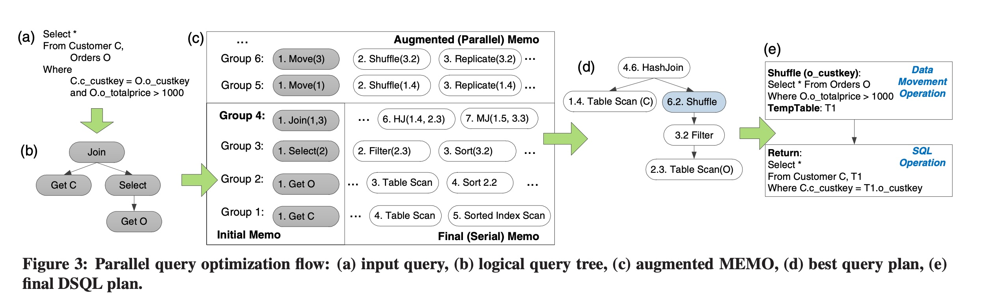
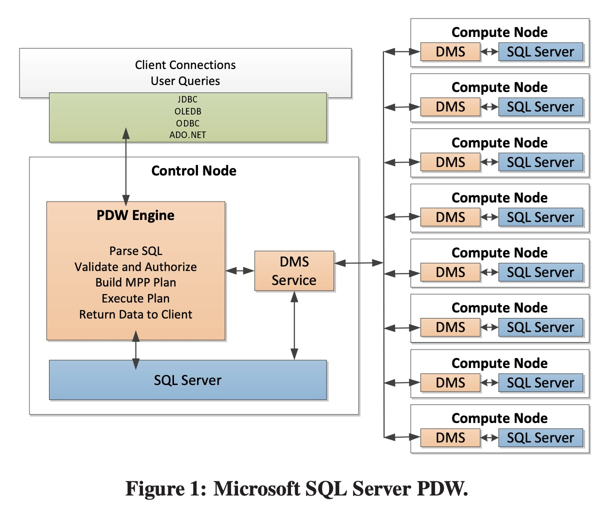
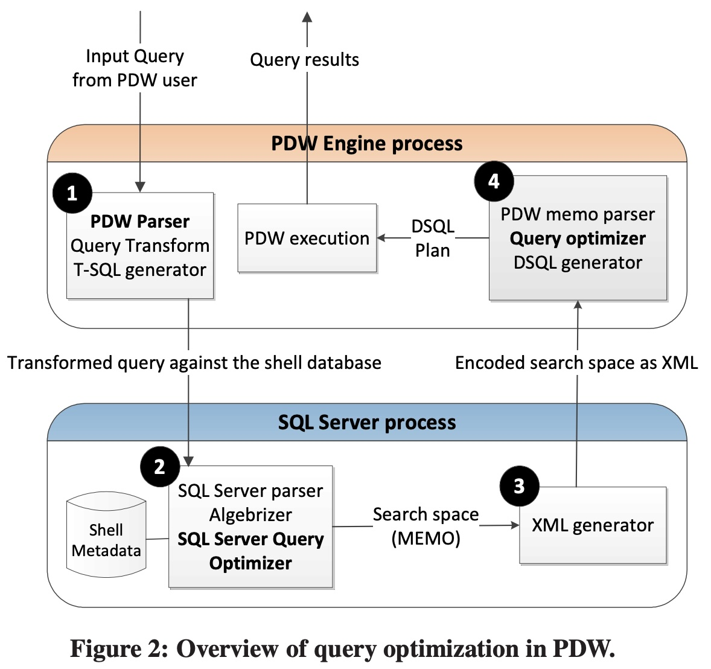
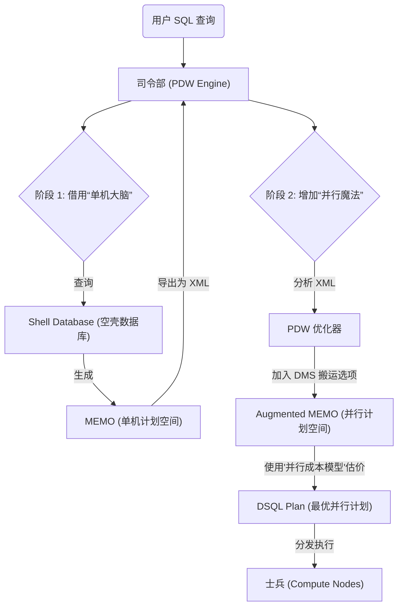

## AI论文解读 | Query Optimization In Microsoft Sql Server Pdw
        
### 作者        
digoal        
        
### 日期        
2025-10-19        
        
### 标签        
PostgreSQL , PolarDB , DuckDB , AI , 论文解读        
        
----        
        
## 背景  
      
https://dl.acm.org/doi/pdf/10.1145/2213836.2213953        
  
提示:          
```          
读懂《Query Optimization In Microsoft Sql Server Pdw》这篇论文需要提前掌握哪些基础知识, 请使用中文通熟易懂的讲解这些基础知识, 可以引用论文中的图、表或使用Markdown支持的图形(text,mermaid等)增加解释性. 
  
使用中文通熟易懂的解读《Query Optimization In Microsoft Sql Server Pdw》这篇论文, 其中的关键内容请着重讲解, 可以引用论文中的图、表或使用Markdown支持的图形(text,mermaid等)增加解释性. 
  
提取《Query Optimization In Microsoft Sql Server Pdw》这篇论文中的重要术语, 使用中文对这些术语进行通熟易懂的讲解, 可以引用论文中的图、表或使用Markdown支持的图形(text,mermaid等)增加解释性. 
```     
  
## 1 前置知识 
  
要读懂《Query Optimization in Microsoft SQL Server PDW》这篇论文，你需要先掌握一些关于数据库系统、查询优化和分布式计算的基础知识。这篇论文的核心是讲如何为一个“大规模并行处理（MPP）”数据库（PDW）设计一个高效的“查询优化器（QO）” 。

下面我将用通俗易懂的中文为你讲解这些必备的基础知识，并结合论文中的图示来帮助你理解。

-----

### 1\. 基础知识一：数据库和 SQL

这是最基本的前提。你需要知道：

  * **什么是数据库？** 一个有组织的数据集合。
  * **什么是 SQL？**（Structured Query Language，结构化查询语言）这是你用来和数据库“对话”的语言。
  * **SQL 的基本操作：** 比如 `SELECT`（查询数据）、`FROM`（从哪张表）、`WHERE`（筛选条件）、`JOIN`（连接多张表）和 `GROUP BY`（分组聚合）。

论文中的例子（如图 3(a)）就是一条 SQL 查询，它需要从 `Customer` (顾客) 表和 `Orders` (订单) 表中找出符合条件的连接数据。    

### 2\. 基础知识二：什么是“查询计划”？（Query Plan）

当你向数据库发送一条 SQL 语句时，数据库并不会马上开始查找数据。它会先制定一个“执行计划”。

  * **SQL 是“你要什么”：** 比如“帮我找出所有价格大于1000的订单和对应的顾客” 。
  * **查询计划是“数据库怎么做”：** 比如：
    1.  先去 `Orders` 表，找到所有 `o_totalprice > 1000` 的订单。
    2.  再去 `Customer` 表，找到所有顾客。
    3.  把这两批数据，按照顾客 ID (`c_custkey`) 和订单的顾客 ID (`o_custkey`)  进行匹配（连接）。

数据库完成这个任务可以有很多种“做法”（即很多个查询计划）。例如，是先筛选订单再连接，还是先把两个大表整个连接起来再筛选？连接时是用“哈希连接 (Hash Join)”还是“嵌套循环连接 (Nested Loop Join)”？

**论文中的体现：**
论文图 3(b) 和 3(d) 展示了这种转变 ：    

  * (a) 是用户写的 SQL。
  * (b) 是“逻辑查询树”，表示“要做什么”（一个连接、两个读取）。
  * (d) 是“物理查询计划”，表示“要怎么做”（用 `Hash Join` 算法、用 `Table Scan` 算法）。

### 3\. 基础知识三：什么是“查询优化器”？（Query Optimizer, QO）

既然执行一个 SQL 有很多种“查询计划”，那么哪一种最好（最快、最省资源）呢？

**查询优化器（QO）** 就是数据库的“大脑”，它的工作就是从成千上万种可能的“查询计划”中，挑选出成本（Cost）最低的那一个。

  * **基于成本的优化（Cost-Based Optimizer, CBO）：** 这就是现代 QO 的工作方式 。它会根据表的统计信息（比如表有多大、数据分布是否均匀），去 *估算* 每一种计划的执行成本。
  * **搜索空间（Search Space）：** 所有可能的执行计划组合起来，形成一个巨大的“搜索空间” 。QO 的任务就是在这个空间里高效地找到“最优解”。

**论文中的体现：**
这篇论文的核心就是 PDW 的查询优化器（PDW QO）。它重用了 SQL Server 的 QO 技术 ，但又针对“并行”环境做了特殊优化。

### 4\. 基础知识四：什么是“并行数据库”？（MPP 架构）

这是理解这篇论文最关键的背景知识。传统的数据库（如你电脑上的 SQL Server）是“单机”的，所有数据和计算都在一台服务器上。

当数据量大到一台机器处理不了时，就有了“分布式”或“并行”数据库。

  * **MPP（Massively Parallel Processing）：** 大规模并行处理。你可以把它想象成一个团队协同工作。
  * **Share-Nothing（无共享架构）：** 这是 MPP 的一种常见架构 。团队里的每个人（节点）都有自己独立的 CPU、内存和硬盘，互不干扰 。他们只通过网络进行通信。

**论文中的体现（请看图 1）：**
论文的 **Figure 1**  完美地展示了 PDW 的 MPP 架构：    

```text
+-------------------+
|   Client (用户)   |
|   (发送 SQL 查询) | 
+-------------------+
        |
        v
+-------------------+
|  Control Node     |  <-- “司令部” (1个) 
| (PDW Engine)      |  (负责接收查询、制定计划、分发任务)
+-------------------+
        |
        v (通过网络分发任务和汇总结果)
+-------------------+ <-> +-------------------+ <-> ...
|  Compute Node     |     |  Compute Node     |
|  (SQL Server)     |     |  (SQL Server)     |  <-- “士兵” (多个) 
|  (存储部分数据)   |     |  (存储部分数据)   |
+-------------------+     +-------------------+
```

  * **Control Node (控制节点)：** 团队的“司令部” 。它接收用户的 SQL 查询 ，负责“查询优化”，制定一个“并行执行计划”（DSQL Plan），然后把任务分发给“士兵”。
  * **Compute Nodes (计算节点)：** 团队的“士兵” 。有多个（图中画了8个）。每个“士兵”都有自己的 SQL Server 实例  和一部分用户数据 。

### 5\. 核心难点：为什么 MPP 需要“特殊”的优化？

单机数据库的优化器只需要考虑 CPU、I/O 成本。而 MPP 优化器必须额外考虑一个最昂贵的成本：**网络数据传输**。

#### A. 数据分布 (Data Distribution)

在 MPP 中，数据是被“切分”存储在各个计算节点上的 。

  * **Replicated（复制表）：** 比如一张很小的“国家表”。每个“士兵”（Compute Node）都有一份完整的拷贝 。
  * **Hash-Partitioned（哈希分区表）：** 比如一张巨大的“订单表”。根据“订单ID”哈希一下，决定这个订单数据存在哪个“士兵”那里 。

#### B. 数据移动 (Data Movement)

**这就是并行优化的核心！**

想象一下，`Customer` 表按 `c_custkey` 分区，`Orders` 表按 `o_orderkey` 分区 。现在你要执行 `JOIN ... WHERE c.c_custkey = o.c_custkey` 。

坏了！一个顾客的数据在“士兵A”那里，而他的订单在“士兵B”那里。他们无法在本地完成 JOIN。

这时，就必须进行 **Data Movement (数据移动)**。论文中由 **DMS (Data Movement Service)**  负责。

**论文中的体现（请看图 3(c) 和 (e)）：**    

  * **Shuffle (重分区/重洗牌)：** 这是最常见的数据移动 。比如，把 `Orders` 表“重新洗牌”，按照 `o_custkey`（而不是它原来的 `o_orderkey`）哈希，发送到对应的节点。这样，`Orders` 和 `Customer` 的数据就“对齐”了（同一个顾客的数据都在同一个节点上），可以高效地在本地 JOIN。
  * **Augmented (Parallel) Memo (增强的搜索空间)：** 如图 3(c)  所示，PDW QO 的核心工作就是在“单机计划空间”（Initial Memo）的基础上，加入了 `Move`、`Shuffle`、`Replicate`  这样的“数据移动”操作选项。
  * **DSQL Plan (并行计划)：** 如图 3(e)  所示，最终生成的计划（DSQL Plan） 包含两类操作：
    1.  **Data Movement Operation (DMS 操作)：** 比如 `Shuffle` ，负责在节点间移动数据。
    2.  **SQL Operation (SQL 操作)：**  比如 `Return`，这是每个计算节点在本地执行的 SQL 语句。

-----

### 总结：你需要理解的论文核心流程

掌握了以上知识后，你就可以理解这篇论文的精髓了（对应 **Figure 2**  的流程）：    

1.  **用户查询  -\> 控制节点 (PDW Engine)**
2.  **“借用大脑”：** 控制节点利用一个只有“元数据”（表结构、统计信息）的“空壳数据库” (Shell Database) ，让**标准的 SQL Server 优化器**  先生成一个“单机”的查询计划搜索空间（MEMO）。
3.  **“导出空间”：** 这个 MEMO 被转换成 XML 格式 ，从 SQL Server 进程  传给 PDW 引擎进程 。
4.  **“并行增强”：** **PDW 优化器**  接手这个 XML，解析它，然后在搜索空间中加入各种“数据移动”（如 Shuffle）的可能性 。
5.  **“选出最优”：** PDW 优化器使用自己**专属的成本模型**（这个模型知道数据移动有多“贵”），从这个“增强后”的空间中，选出成本最低的那个**并行计划 (DSQL Plan)** 。
6.  **“执行计划”：** 控制节点将这个 DSQL 计划（包含 DMS 步骤和 SQL 步骤） 发给计算节点去执行。

如果你能理解 **“为什么单机的最优计划不是并行的最优计划”** （答案：因为它没考虑数据移动的成本 ），以及 PDW 是如何 **“复用单机优化器 + 增强数据移动选项”** 来解决这个问题的，你就读懂了这篇论文。
  
## 2 解读论文 
  
好的，这是一篇非常经典的关于分布式数据库查询优化的论文。我来为你用最通俗易懂的方式，结合论文中的图示，深度解读一下。

### 论文标题：

《Query Optimization in Microsoft SQL Server PDW》（微软 SQL Server 并行数据仓库中的查询优化）

-----

### 一句话总结这篇论文：

这篇论文介绍了一种“**借鸡生蛋**”的聪明方法，来解决“ **大规模并行（MPP）** ”数据库的查询优化难题。

它**没有**重新造一个全新的查询优化器，而是巧妙地**复用**了单机版 SQL Server 成熟的优化器“大脑”，然后再给它“**戴上一顶并行的帽子**”（增加一个并行优化层），专门处理数据在多台机器间的“**搬运**”问题，最终实现了高效的并行查询。

-----

### 1\. 核心背景：为什么需要一个“新”的优化器？

首先，你要理解 PDW (Parallel Data Warehouse) 是什么。

  * **传统数据库：** 就像一个“超级个体户”（一台服务器），所有数据存储和计算都自己扛。
  * **MPP 数据库 (如 PDW)：** 就像一个“大集团军”（大规模并行处理），它由很多台服务器（节点）组成 。

**论文 Figure 1**  (见下图) 非常清晰地展示了这个“集团军”架构：    

```text
+-------------------+
|   Client (用户)   |
|   (发送 SQL 查询) |
+-------------------+
        |
        v
+-------------------+
|  Control Node     |  <-- “司令部” (1个) 
| (PDW Engine)      |  (负责接收查询、制定计划、分发任务)
+-------------------+
        |
        v (通过网络分发任务和汇总结果)
+-------------------+ <-> +-------------------+ <-> ...
|  Compute Node     |     |  Compute Node     |
|  (SQL Server)     |     |  (SQL Server)     |  <-- “士兵” (多个) 
|  (存储部分数据)   |     |  (存储部分数据)   |
+-------------------+     +-------------------+
```

**核心难题来了：**
在这个“集团军”里，最昂贵、最耗时的操作，**不是**计算，而是“**士兵”之间的数据搬运**（网络传输）。

比如，你要连接 `Orders`（订单）表和 `Customer`（顾客）表。但`Orders`表的数据分散在“士兵”1、2、3号，而`Customer`表的数据在“士兵”4、5、6号。

一个 **“单机版”的优化器** （它只懂“个体户”模式）会说：“这俩表连接，用 Hash Join 算法最快！”。
但它**完全没意识到**，为了执行这个 Join，你可能需要先把**几 TB 的数据**从 1、2、3 号“士兵”那里，通过网络“搬运”到 4、5、6 号那里。这个“搬运”成本（论文里叫 **DMS 操作** ）可能占了总时间的 90%！

**所以，PDW 需要一个“懂行”的优化器，它必须把“数据搬运成本”作为最重要的考量因素 。**

-----

### 2\. 关键创新点：PDW 的“两阶段”优化流程（重点讲解）

这篇论文最核心的贡献，就是 **Figure 2**  所展示的这个优化流程。我把它简化成一个更通俗的流程图：    



让我们来“着重讲解”这个流程里的几个关键点：

#### 关键点 1：“Shell Database”（空壳数据库） 

这是个绝妙的设计。当“司令部”拿到一个查询时，它没有把数据发给“士兵”，而是把它发给了“司令部”自己机器上的一个 **“空壳”SQL Server** 。

这个“空壳数据库”里**没有任何真实的用户数据**（比如那 10TB 的订单）。它只有**元数据**和**统计信息** （比如：“订单表大概有100亿行，‘顾客ID’这一列的数值分布很均匀”）。

**作用：** 这就等于“骗”了单机版的 SQL Server 优化器，让它以为自己面对的是一个普通数据库。于是，这个成熟的“单机大脑”就会全力工作，生成所有**逻辑上可行**的查询方案（比如：是先 Join A 和 B，还是先 Join B 和 C？），并把这些方案打包成一个“**搜索空间 (MEMO)**” 。

#### 关键点 2：“Augmented (Parallel) Memo”（增强的并行空间）

“司令部”拿到这个“单机计划空间 (MEMO)”后（论文中说是通过 XML 格式传递的 ），PDW 自己的优化器才真正开始工作。

它的工作是“**增强**”这个空间。

**论文中的 Figure 3(c)**  展示了这一点：    

  * **Initial/Final Memo (左侧)：** 这是“单机大脑”给出的方案，比如 `Group 4` 里的 `1. Join(1,3)` ，意思就是“把 Group 1 和 Group 3 的结果做个连接”。
  * **Augmented (Parallel) Memo (右侧)：** 这是 PDW 优化器“增强”后的。它会增加**数据搬运**的选项 。比如，它增加了 `Group 5` 和 `Group 6` ，代表“**搬运 Group 1**”和“**搬运 Group 3**”。
      * **搬运**又分为好几种，比如 `Shuffle`（重分区，把数据按 Key 重新洗牌发给不同“士兵”）或 `Replicate`（广播，把一份小数据复制给所有“士兵”）。

现在，优化器面对的选项就**不再是** “Join A 和 B”，**而是**：

1.  （如果A和B数据已对齐）直接 Join。
2.  （如果A和B数据未对齐） **Shuffle** A，再 Join B。
3.  （如果A和B数据未对齐） **Shuffle** B，再 Join A。
4.  （如果A是小表） **Replicate** A，再 Join B。
5.  ...等等

#### 关键点 3：“PDW Cost Model”（并行成本模型） 

有了这么多“并行选项”后，总得选一个吧？怎么选？

这就是 PDW 优化器自己的“**成本模型**”。与“单机大脑”只关心 CPU 和 I/O 不同，这个新模型的**核心考量点**就是**DMS（数据移动服务）的成本** 。

论文提到，它会估算“搬运”数据需要多少时间，这个成本主要由以下几部分构成 ：

  * $C_{reader}$ : 从“士兵”本地数据库读数据。
  * $C_{network}$ : 把数据打包发到网络上。
  * $C_{writer}$ : 从网络接收数据。
  * $C_{SQLBlkCpy}$ : 把收到的数据写入本地临时表。

这个成本模型会计算出上面所有选项（Shuffle A、Replicate A...）的预估总时间，**选择那个“总时间”最短的**，哪怕它在“单机”看起来很傻。

#### 关键点 4：“DSQL Plan”（最终的并行作战计划）

优化器选出了最优方案后，会生成一个 **DSQL Plan** 。这个计划就是“司令部”发给“士兵”们的最终指令，它是一系列**串行**的步骤，但**每一步都是并行执行的** 。

**Figure 3(e)** 就是一个例子：    

1.  **Step 1 (DMS Operation):** `Shuffle (o_custkey)`。指令：“所有士兵请注意，把你们本地的 `Orders` 表，按 `o_custkey` 重新哈希分区，发给对应的兄弟，并存入临时表 T1。” 
2.  **Step 2 (SQL Operation):** `Return: Select * From Customer C, T1 ...`。指令：“所有士兵请注意，现在你们本地的 T1 表和 `Customer` 表数据已经‘对齐’了，请在本地执行这个 Join，并把结果返回给我。” 

-----

### 3\. 灵魂拷问：为什么“最好的单机计划”不是“最好的并行计划”？

论文在第 2.5 节末尾  给出了一个绝佳的例子，我来帮你解读一下：

假设你有 3 个大表：`Customer` (顾客), `Orders` (订单), `Lineitem` (订单明细)。

  * `Customer` 按 `custkey` (顾客ID) 分区。
  * `Orders` 按 `orderkey` (订单ID) 分区。
  * `Lineitem` 也按 `orderkey` (订单ID) 分区。

**查询：** 要把这三张表都连接起来。

#### 方案 A：“最优单机计划”

单机优化器发现 `Customer` 表最小，它会说：“先用小表 `Customer` 去 Join `Orders`，再 Join `Lineitem`。”

  * **并行世界的代价：** 这是个**灾难**！`Customer` (按 `custkey`) 和 `Orders` (按 `orderkey`) 数据**没有对齐**。你必须先做一个代价极高的 `Shuffle` (数据大搬运)，才能开始 Join。

#### 方案 B：“最优并行计划”

PDW 优化器会发现：`Orders` 和 `Lineitem` 都是按 `orderkey` 分区的！这意味着**它们的数据从一开始就是“对齐”的**（同一个订单和它的明细，肯定在同一个“士兵”那里）。

  * **PDW 的选择：** “先 Join `Orders` 和 `Lineitem`！” 。
  * **并行世界的代价：** 这一步**成本为零**！ 因为所有 Join 都在“士兵”本地完成，**不需要任何网络数据搬运 (DMS)**。
  * 然后再把（已经缩小了的）Join 结果去和 `Customer` 表 Join（这一步可能需要一次 Shuffle，但代价已经小多了）。

**结论：**
PDW 优化器通过“借用单机大脑”获得了所有逻辑可能性，然后通过自己的“并行成本模型”发现了“方案 B”这个在并行世界中远远优于“方案 A”的执行计划。

-----

### 总结：这篇论文的价值

1.  **工程智慧：** 它展示了如何在一个复杂的（MPP）系统上，通过巧妙的抽象（Shell Database, MEMO XML）来**复用**现有（SQL Server QO）的复杂组件，极大缩短了开发周期，并保证了优化器的“底子”很厚（比如子查询解关联、视图重写等高级功能，PDW 免费获得了）。
2.  **抓住了重点：** 它认识到在 MPP 系统中，**数据移动 (DMS) 是主要矛盾** ，因此它的核心创新（Augmented MEMO 和 Cost Model）都是围绕着“如何最小化数据移动”来构建的 。
3.  **结果有效：** 这种方法生成的计划质量远高于“简单地把最好单机计划并行化” 。
  
## 3 术语 
  
根据这篇论文《Query Optimization in Microsoft SQL Server PDW》，以下是其中一些核心术语及其通俗易懂的中文讲解。

### 1\. MPP (Massively Parallel Processing, 大规模并行处理)

  * **中文讲解：**
    MPP 是一种系统架构，它不是依赖一台超级强大的服务器，而是使用大量通过网络连接在一起的独立服务器（称为“节点”）协同工作 。它被广泛用于管理和查询海量数据 ，通过将一个复杂的查询任务分解，让所有节点“并行”执行，从而实现极高的性能提升 。
  * **通俗比喻：**
    想象一下你需要烹饪一顿有100道菜的盛宴。
      * **传统方式 (非 MPP)：** 你是一个厨神，但只有你一个人，你必须一道一道地做，速度很慢。
      * **MPP 方式：** 你开了一个巨大的厨房，雇佣了 50 个厨师（节点），并把 100 道菜的任务分配给他们。大家同时开工，最后再把所有菜汇总上桌。MPP 系统就是这个“大厨房”。

### 2\. SQL Server PDW (Parallel Data Warehouse, 并行数据仓库)

  * **中文讲解：**
    PDW 是微软推出的一款基于 MPP 架构的数据仓库产品 。它是一个“shared-nothing”（无共享）架构的设备，意味着每个节点都有自己独立的处理器、内存和存储，节点之间不共享资源，只通过网络通信 。

  * **架构简介 (参考论文图1)：**    
    PDW 主要由两类节点组成 ：

      * **Control Node (控制节点)：** 整个系统的“大脑” 。
      * **Compute Nodes (计算节点)：** 负责存储和处理数据的“工人” 。

    下面是一个简化的架构示意图，展示了用户查询的流程：

    ```text
       [ 用户查询 (Client Connections) ] 
                  |
                  v
    +--------- [ 控制节点 (Control Node) ] ---------+ 
    | - 接收和解析查询                      |
    | - 生成分布式执行计划 (DSQL Plan)    |
    | - 协调计算节点的工作                  |
    | - 汇总最终结果并返回给用户              |
    +-------------------|--------------------------+
                        |
                        | (DMS Service) 
                        |
    +----------+--------+---------+----------+
    |          |                  |          |
    v          v                  v          v
    [ 计算节点 ] [ 计算节点 ] ...  [ 计算节点 ]  
    (存储数据a) (存储数据b)     (存储数据n)
    (处理分片) (处理分片)     (处理分片) 
    ```

### 3\. Control Node (控制节点) 与 Compute Node (计算节点)

  * **Control Node (控制节点)：**
      * 它是 PDW 设备的“管理中心”和外部接口 。
      * 它负责接收用户的查询请求 ，解析 SQL ，验证权限 ，并创建最终的“分布式执行计划”（DSQL Plan）。
      * 它像一个“包工头”，把计划中的任务步骤分发给各个计算节点 ，跟踪它们的执行情况 ，最后把所有计算节点返回的零散结果组合成一个完整的结果集，返还给用户 。
  * **Compute Node (计算节点)：**
      * 它们是 PDW 设备的“主力军”，负责实际的数据存储和查询处理 。
      * 用户的数据被分散存储在所有计算节点上 。存储方式有两种：
        1.  **Replicated (复制表)：** 每个计算节点都存有这份表的完整拷贝 。
        2.  **Hash-Partitioned (哈希分区表)：** 根据某个列的值计算哈希，将一张大表切分到不同的计算节点上 。
      * 每个计算节点上都运行着一个 SQL Server 实例  和一个 DMS 进程（见下文）。

### 4\. DMS (Data Movement Service, 数据移动服务)

  * **中文讲解：**
    DMS 是“数据移动服务”的缩写 。它在 PDW 设备的所有节点（控制节点和计算节点）上运行 ，是节点之间传输数据的“物流系统” 。
  * **为什么需要它：**
    在执行分布式查询时，经常需要移动数据。例如，要将一个在节点A上的表T1 和 节点B上的表T2 进行连接 (JOIN)，可能就需要 DMS 先把 T2 的数据从节点B 搬运到 节点A（或者把 T1 和 T2 都搬运到一个新的临时位置）。
  * **主要操作：**
    DMS 提供了多种数据移动策略，如 `Shuffle`（重分区，将数据根据新的哈希规则在节点间重新洗牌） 和 `Replication/Broadcast`（广播，将一份数据复制到所有节点）。

### 5\. Shell Database (空壳数据库)

  * **中文讲解：**
    这是一个非常巧妙的设计。Shell Database（空壳数据库）是一个特殊的 SQL Server 数据库，它**只包含元数据和统计信息，不包含任何真实的用户数据** 。
  * **它在哪里：** 它位于“控制节点”的 SQL Server 实例上 。
  * **它的作用 (参考论文图2)：**    
    PDW 的查询优化器 (QO) 想要复用标准版 SQL Server 已经非常成熟的优化技术 。
    1.  PDW 将所有计算节点上的表结构、列信息、用户权限、数据分布统计信息等“元数据”汇总，在控制节点上创建了这个“空壳数据库” 。
    2.  当用户查询进来时，PDW 先把这个查询扔给控制节点上的标准 SQL Server，让它针对这个“空壳数据库”进行编译和优化 。
    3.  因为“空壳数据库”有所有表的定义和统计信息，SQL Server 优化器会误以为它在处理一个（巨大的）单机数据库，并生成一个它认为最优的“搜索空间”（即 MEMO）。

### 6\. MEMO (优化搜索空间)

  * **中文讲解：**
    MEMO 是一种紧凑的数据结构，用于存储一个查询的“所有可能的执行方案” 。
  * **通俗比喻：**
    如果你要从北京到上海，MEMO 就像是一张包含了所有可行路线的地图：
      * 方案1：北京 -\> (飞机) -\> 上海
      * 方案2：北京 -\> (高铁) -\> 上海
      * 方案3：北京 -\> (高铁) -\> 济南 -\> (高铁) -\> 上海
      * ...等等
        MEMO 把所有这些可能的“路径”和“换乘方式”都记录下来，形成一个巨大的“搜索空间”。
  * **在 PDW 中的应用 (参考论文图3)：**    
    1.  SQL Server 针对“空壳数据库”生成一个“串行 MEMO”（即单机环境下的所有方案）。
    2.  PDW 优化器接管这个 MEMO，并对其进行“增强” (Augmented Memo) 。增强的方式就是加入 MPP 环境特有的操作，比如“数据移动 (DMS)” 。
    3.  如论文图 3(c) 所示，PDW 在原有的（串行）方案基础上，增加了 Group 5 和 Group 6，代表“移动 C 表”或“移动 O 表”的新选项 。

### 7\. DSQL Plan (Distributed SQL Plan, 分布式 SQL 计划)

  * **中文讲解：**
    DSQL 计划是 PDW 优化器在“增强后”的 MEMO 中，根据“成本模型”（见下文）选出的**最终执行方案** 。
  * **它长什么样：**
    它不再是单个 SQL 语句，而是一个包含多个步骤的序列 。这些步骤主要有三类 ：
    1.  **SQL Operations：** 在一个或多个计算节点上并行执行的 SQL 语句 。
    2.  **DMS Operations：** 调用 DMS 服务在节点间传输数据的操作（例如 Shuffle 或 Broadcast）。
    3.  **Return Operations：** 将结果返回给客户端的指令 。
  * **示例 (参考论文图 3(e))：**    
    对于图 3(a) 中的查询，PDW 最终生成的 DSQL 计划 (图 3(e))  可能包含两个步骤：
    1.  **步骤1 (DMS 操作)：** 对 Orders 表执行 `Shuffle`（洗牌），将其按照 `o_custkey` 列重新分区并存入临时表 T1 。
    2.  **步骤2 (SQL 操作)：** 在*所有*计算节点上，并行地将本地的 Customer 表与刚刚生成的临时表 T1 进行连接，并将结果返回 。

### 8\. Cost Model (成本模型)

  * **中文讲解：**
    成本模型就是一套“估价系统” 。当优化器（MEMO）中有很多备选执行方案时，它需要一个方法来评估“哪个方案最快、最省资源” 。成本模型就是用来给每个方案“打分”（估算成本）的 。
  * **PDW 成本模型的特点：**
      * **不同于单机：** PDW 的优化目标和单机 SQL Server 不同 。单机环境下的“最优计划”在 PDW 中几乎肯定不是最优的 ，因为它没有考虑数据分布和网络传输 。
      * **DMS 成本是关键：** 在 MPP 环境中，执行 SQL 计算通常很快，但通过网络移动数据 (DMS) 的开销非常大 。因此，PDW 的成本模型重点就是评估和优化数据移动的成本 。
      * **示例：**
        假设有 A、B、C 三个表。
          * **单机最优解：** (A join B) join C。
          * **PDW 最优解：** 假设 B 和 C 刚好“共置”（co-located，即按相同的键分区在相同的节点上），那么 (B join C) 再 `Shuffle` 结果去 join A，可能会因为避免了一次昂贵的数据移动而快得多 。成本模型就是用来算出这笔账的。
  
## 参考        
         
https://dl.acm.org/doi/pdf/10.1145/2213836.2213953    
        
<b> 以上内容基于DeepSeek、Qwen、Gemini及诸多AI生成, 轻微人工调整, 感谢杭州深度求索人工智能、阿里云、Google等公司. </b>        
        
<b> AI 生成的内容请自行辨别正确性, 当然也多了些许踩坑的乐趣, 毕竟冒险是每个男人的天性.  </b>        
  
    
#### [期望 PostgreSQL|开源PolarDB 增加什么功能?](https://github.com/digoal/blog/issues/76 "269ac3d1c492e938c0191101c7238216")
  
  
#### [PolarDB 开源数据库](https://openpolardb.com/home "57258f76c37864c6e6d23383d05714ea")
  
  
#### [PolarDB 学习图谱](https://www.aliyun.com/database/openpolardb/activity "8642f60e04ed0c814bf9cb9677976bd4")
  
  
#### [PostgreSQL 解决方案集合](../201706/20170601_02.md "40cff096e9ed7122c512b35d8561d9c8")
  
  
#### [德哥 / digoal's Github - 公益是一辈子的事.](https://github.com/digoal/blog/blob/master/README.md "22709685feb7cab07d30f30387f0a9ae")
  
  
#### [About 德哥](https://github.com/digoal/blog/blob/master/me/readme.md "a37735981e7704886ffd590565582dd0")
  
  

  
