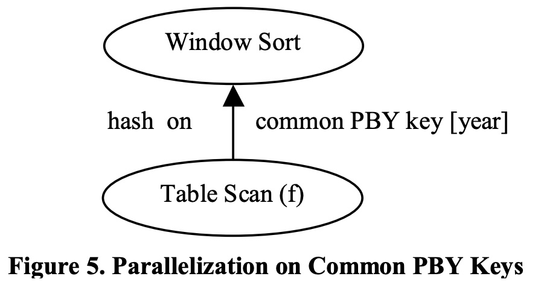

## AI论文解读 | Adaptive And Big Data Scale Parallel Execution In Oracle
        
### 作者        
digoal        
        
### 日期        
2025-10-19        
        
### 标签        
PostgreSQL , PolarDB , DuckDB , AI , 论文解读        
        
----        
        
## 背景  
      
https://dl.acm.org/doi/pdf/10.14778/2536222.2536235        
  
提示:          
```          
读懂《Adaptive And Big Data Scale Parallel Execution In Oracle》这篇论文需要提前掌握哪些基础知识, 请使用中文通熟易懂的讲解这些基础知识, 可以引用论文中的图、表或使用Markdown支持的图形(text,mermaid等)增加解释性. 
  
使用中文通熟易懂的解读《Adaptive And Big Data Scale Parallel Execution In Oracle》这篇论文, 其中的关键内容请着重讲解, 可以引用论文中的图、表或使用Markdown支持的图形(text,mermaid等)增加解释性. 
  
提取《Adaptive And Big Data Scale Parallel Execution In Oracle》这篇论文中的重要术语, 使用中文对这些术语进行通熟易懂的讲解, 可以引用论文中的图、表或使用Markdown支持的图形(text,mermaid等)增加解释性. 
```     
  
## 1 前置知识 
  
要读懂这篇关于Oracle并行执行的论文，你需要先了解一些数据库和SQL的基础知识。这篇论文的核心是讲Oracle数据库如何“更智能”地并行处理海量数据（即“大数据”），尤其是在执行一些复杂的SQL操作时 。

“更智能”主要体现在 **“自适应”（Adaptive）** 上 。传统的数据库在执行一个查询前，会先制定一个“执行计划”，这个计划依赖于数据库对数据量的“估算”。但如果估算错了，执行效率就会很差 。这篇论文的亮点技术，就是让数据库在“执行过程中”根据“真实的数据情况”动态调整执行方式 。

以下是你需要掌握的基础知识点：

### 1\. 核心SQL操作 (论文优化的对象)

你需要熟悉以下SQL操作，因为它们是这篇论文优化的主要目标 ：

  * **GROUP BY (分组聚合):** 这是最基础的数据分析操作，比如计算“每个部门的总工资”。
  * **JOIN (连接):** 将两个或多个表的数据关联起来，比如“查询员工及其所在的部门名称”。
  * **ROLLUP / CUBE (上卷/数据立方):** 这是`GROUP BY`的增强版 。`ROLLUP`可以让你在一次查询中得到多个维度的汇总数据，比如不仅得到“每个月”的销量，还能自动算出“每个季度”、“每年”以及“总共”的销量 。
  * **Window Functions (窗口函数 / 分析函数):** 这是非常强大的SQL功能，允许你在一个“窗口”（一组相关的行）内进行计算，而不会像`GROUP BY`那样把行合并掉 。
      * 它的典型语法是 `OVER (PARTITION BY ... ORDER BY ...)` 。
      * 一个通俗的例子：查询“每个员工的工资”以及“该员工所在部门的平均工资”。
      * 论文中提到了几种窗口函数 ：
          * **Reporting (报告型):** 比如计算“每日销量”和“全年总销量”做对比 。
          * **Cumulative (累积型):** 比如计算“年初至今”的累计销量 。
          * **Ranking (排名型):** 比如 `RANK()`, `ROW_NUMBER()`，用于“按业绩给销售排名” 。

### 2\. 数据库查询处理基础

  * **Query Optimizer (查询优化器):** 这是数据库的“大脑”。当你发送一条SQL时，优化器会估算不同执行方式的成本（比如IO、CPU消耗），然后选择一个它认为“最快”的**执行计划** 。
  * **Execution Plan (执行计划):** 这是数据库执行SQL的具体步骤。比如，是先做Join再做Group By，还是反过来？Join是用Hash Join还是Broadcast？ 。
  * **Statistics & Cardinality (统计信息 & 基数):** 优化器依赖“统计信息”来做决策，比如“这个表有多少行？”（基数），“这一列有多少个不重复的值（NDV）？” 。
  * **核心问题：** 优化器的“估算”经常出错，尤其是数据量巨大或数据分布不均时 。这篇论文的“自适应”技术就是为了解决“估算错误”带来的性能灾难 。

### 3\. 并行数据库基本概念

  * **Parallel Execution (并行执行):** 为了处理海量数据，数据库会把一个大任务拆成很多小任务，交给多个进程（或线程）同时处理 。

  * **DOP (Degree of Parallelism - 并行度):** 指同时有多少个“工人”（并行进程）在干活 。论文中提到，当DOP非常高时（比如160），一些传统方法的开销会变得很大。

  * **Data Redistribution (数据重分布):** 这是并行处理的核心。为了让“工人们”分工，数据库必须把数据“洗牌”并发给它们 。主要方式有：

      * **Hash (哈希分布):** 比如按`group-by keys`（分组键）计算哈希值 ，保证相同键值的数据（如所有“财务部”的员工）都发给同一个工人处理。
      * **Broadcast (广播):** 当一张表很小时，直接把这张“小表”完整复制并发送给所有工人 。
      * **Range (范围分布):** 比如按`ORDER BY`的键切分范围 ，工人1处理A-M的数据，工人2处理N-Z的数据。

    

    ```mermaid
    graph TD
        subgraph "数据源 (原始数据)"
            D(Data)
        end

        subgraph "并行进程 (DOP=3)"
            P1(进程1)
            P2(进程2)
            P3(进程3)
        end

        D -- "数据重分布" --> P1
        D -- "数据重分布" --> P2
        D -- "数据重分布" --> P3

        subgraph "重分布方式"
           H(Hash: 按Key哈希)
           B(Broadcast: 广播给所有)
           R(Range: 按范围切分)
        end

        style H fill:#f9f,stroke:#333
        style B fill:#f9f,stroke:#333
        style R fill:#f9f,stroke:#333
    ```

  * **Data Skew (数据倾斜):** 这是并行处理的“噩梦”。如果数据分布不均（比如90%的订单都来自“北京”，10%来自其他所有城市），那么按“城市”哈希分布后，处理“北京”的那个工人会累死，而其他工人几乎没事干 。这会导致整体效率极低。论文中的**Hybrid Batch Flushing (HBF)**  和 **Adaptive Rollup**  等技术很大程度上就是为了解决倾斜问题。

### 4\. Oracle并行执行模型 (论文的上下文)

论文在引言部分（1.2节）介绍了Oracle自己的并行模型，了解这个模型有助于理解论文中的图表：

  * **Producer-Consumer (生产者-消费者模型):** Oracle的并行执行是基于这个模型的 。简单说，有一组进程（生产者）负责干活（比如扫描表、做Join），然后把处理完的数据发给下一组进程（消费者） 。
  * **DFO (Data Flow Operation - 数据流操作):** 指一个逻辑处理单元，比如一次表扫描、一次Join 。
  * **QC (Query Coordinator - 查询协调器):** 这是一个“总管”进程，负责编译SQL、分发任务、回收结果等 。
  * **论文中的图示：** 论文中的图（如Figure 1, 4, 6, 7等）都是在描述这个模型。           
      * **Figure 1** 就是一个典型的例子：
          * 底部的" producer processes $p_1, p_2, ..., p_n$ "  负责执行"Group By Pushdown"（先在本地做一次预聚合）。
          * 它们通过"distribute on group-by keys"（按分组键哈希分布） 将数据发给...
          * 顶部的" consumer processes $c_1, c_2, ..., c_n$ " ，由它们完成最终的"Group By"（合并结果）。
      * **Figure 14(a)** 展示了一个"Serialization Point"（串行点）问题 ，即某个操作（如`Rownum`）必须在“总管”QC上串行执行 ，这会成为性能瓶颈。论文提出了"Back-To-Parallel"  (如图14(b) ) 来解决这个问题。    

-----

**总结一下：**

要读懂这篇论文，你不需要成为Oracle专家，但你需要：

1.  **懂SQL：** 熟练掌握 `GROUP BY`, `JOIN`, `ROLLUP` 和 `Window Functions` 的概念和用途。
2.  **懂查询优化：** 知道什么是“执行计划”、什么是“优化器”，以及“统计信息”为什么重要。
3.  **懂并行计算：** 理解为什么需要“并行”，以及“数据重分布”（Hash/Broadcast）和“数据倾斜”是什么意思。

如果你具备了这些知识，你就能很好地理解这篇论文所要解决的问题（如优化器估算错误 、数据倾斜 、低基数（NDV）导致并行度上不去），并看懂它提出的“自适应”解决方案（如HBF 、Adaptive Rollup 、Adaptive Joins  等）是如何工作的。
  
## 2 解读论文 
  
这是一篇关于Oracle数据库如何通过“自适应”（Adaptive）技术来解决大数据（Big Data）规模下并行查询性能问题的“炫技”论文。

### 一句话总结：

这篇论文的核心思想是：数据库在“执行查询之前”的**估算**（Optimizer Estimates）经常出错 ，尤其是在大数据和数据倾斜时。为了解决这个问题，Oracle引入了一系列“自适应”技术，允许数据库在“**执行查询过程中**”，根据**真实**的数据情况（如数据量、分布、倾斜度） **动态地改变** 执行计划，从而实现大规模的性能提升 。

-----

### 为什么需要“自适应”？（核心问题）

在传统的数据库中，当你执行一条SQL时，"查询优化器" (Query Optimizer) 会像一个“军师”，根据手上的“兵力地图”（即表的统计信息）来制定一个它认为最快的“作战计划”（Execution Plan）。

**问题出在：** 这份“地图”可能是过时的，或者根本就是错的 。

  * **估算错误 (Optimizer Mistakes)：** 军师以为A表很小，决定“广播”（Broadcast）给所有并行“工人” 。但如果A表其实巨大，广播操作会撑爆网络，导致性能灾难 。
  * **数据倾斜 (Data Skew)：** 军师让100个工人按“城市”分工处理数据。但如果90%的数据都来自“北京”，那么处理“北京”的那个工人会累死，其他99个工人都闲着 。
  * **低基数 (Low NDV)：** 军师发现某个窗口函数是按“年份”分区的 (`PARTITION BY year`) 。如果数据里只有5个年份，那么最多只能派5个工人去干活（DOP=5），即使你有160核CPU也无法充分利用 。

这篇论文的“自适应”技术，就是让“军师”在开战后也能实时调整战术。

-----

### 关键技术解读

论文针对SQL中最常用也最耗时的几个操作（GROUP BY、ROLLUP、Window Functions、JOIN）分别提出了自适应解决方案。

#### 1\. 针对 GROUP BY：自适应“下推”与“混合批量刷新” (HBF)

  * **老问题：** `GROUP BY` 下推 (GPD, 见 Figure 1) 是个好技术，它让“生产者”进程（Producers）先在本地做一次预聚合，大大减少需要通过网络传输给“消费者”进程（Consumers）的数据量 。但如果数据本身就很稀疏（比如每个group只有1条数据），预聚合完全没用，反而白白浪费了CPU 。   

  * **新方案 (HBF)：**

    1.  **先试再说：** 不管优化器怎么想，先默认用GPD方案跑起来 。
    2.  **实时监控：** 在执行时实时统计“输入了多少行、得到了多少个Group” 。
    3.  **动态适应：**
          * 如果发现**压缩率很低**（比如输入1000行，输出990个Group），说明GPD在浪费CPU，系统会自动切换到“**直通模式**”(pass-through)，不再预聚合，直接把数据发给消费者 。
          * 如果发现**数据倾斜**或**内存不足**，系统会采用“**混合批量刷新**”(Hybrid Batch Flushing, HBF)：它会把内存中已经聚合完的批次“刷新”到网络中，释放内存 。更智能的是，它会尝试保留那些“最热门”的Group（倾斜的键）在内存中，继续聚合后续数据，只把冷门的Group刷新出去，最大限度地减少网络流量 。

  * **效果：** 在数据倾斜的场景下，老方法选错了计划，而HBF能自适应，获得了**2倍**的性能提升 (见 Figure 16) 。    

#### 2\. 针对 JOIN：自适应的“广播”与“哈希”

  * **老问题：** Join两个表时，优化器必须在两种计划中二选一：

    1.  **Hash-Hash (Figure 10)：** 两张表都按Join Key哈希分区 。适合两张大表 。    
    2.  **Broadcast (Figure 11)：** 把小表（Build-side）广播复制给所有工人，大表（Probe-side）分区后发给工人 。适合一大一小。   

    

      * **选错的代价是灾难性的：** 优化器以为表 `t` 很大，选了Hash-Hash，结果 `t` 只有10行，白白多做了一次哈希分发 。或者，优化器以为 `t` 很小，选了Broadcast，结果 `t` 有10亿行，网络直接瘫痪 。

  * **新方案 (Adaptive Distribution, Figure 12)：**    

    1.  **增加“统计收集器”：** 在执行计划中（Figure 12的`Statistics Collector`），先不急着处理小表 `t` 。
    2.  **缓冲并计数：** 让“统计收集器”先去读取 `t` 的**头几行数据**（比如 2\*DOP 行）并缓冲起来 。
    3.  **实时决策：**
          * 如果读了几行后发现**表已经读完了**（End-of-Input），说明 `t` 是个**真·小表**。
          * 此时，QC（总管）会**立即改变计划**：将缓冲中的数据**广播**（Broadcast）出去，并通知处理大表 `f` 的进程改为“随机分发”（Random）。
          * 如果读了几行后发现**数据还多得很**，说明 `t` 是个**大表**。
          * 此时，QC**维持原判**：继续按**Hash-Hash**计划执行，将 `t` 和 `f` 都按Join Key哈希分发 。

  * **效果：** 见 Table 6 。当优化器错误地为一个小表（只有2行）选择了Hash-Hash计划时，老方法（Hash-Hash）跑了20.74秒；而新方法（ADDM）在运行时发现表很小，自动切换到Broadcast，只用了0.45秒，获得了**46倍**的提升 。   

    ```mermaid
    graph TD
        A(开始执行Join) --> B{读取表 t 的前 N 行};
        B --> C{表 t 读完了吗?};
        C -- "是 (表 t 很小)" --> D[动态切换计划: <b>Broadcast</b> t];
        C -- "否 (表 t 很大)" --> E[维持原计划: <b>Hash-Hash</b> t];
    ```

#### 3\. 针对 Window Functions：自适应“扩展键”与“下推”

  * **老问题（低基数陷阱）：** 窗口函数（如 `SUM(...) OVER (PARTITION BY year)`）的传统并行方式是按 `PARTITION BY` 的键（PBY key）来分发数据 。如果 PBY key（如 `year`）的**不重复值（NDV）很少**（比如只有5个），那么并行度（DOP）最高只能是5，系统有再多CPU也用不上 。
  * **新方案：**
    1.  **扩展键 (Figure 6)：** 不再只按 `year` 分发，而是按更细粒度的“**扩展键**”（Extended Keys）来分发，比如 `(year, quarter)` 。这样NDV就从5变成了 (5年 \* 4季度) = 20，能利用的工人（DOP）就更多了。   
    2.  **下推 (Figure 7)：** 或者，干脆直接“下推”计算，让所有工人处理各自的数据 。   
    3.  **统一合并：** 这两种新方案都需要一个新步骤：“**窗口合并器**”(Window Consolidator) 。
          * 每个工人在本地计算它那一部分数据的**局部结果**（比如，工人1算出 `year=2001` 的本地和是85，工人2算出 `year=2001` 的本地和是203）。
          * 它们把这个**局部结果**（很小）广播给“合并器” 。
          * “合并器”把所有局部结果相加（`85 + 203 = 288`）得到**全局最终结果** 。
          * “合并器”再把这个全局结果（`year=2001, sum=288`）放进一个哈希表，等待原始数据流过来，把最终值“刷”回每一行 。
  * **自适应能力：** 这个方案也是自适应的。如果在运行时，系统监控到PBY key的NDV**其实非常高**（优化器估算错了），它就会**自动改回**传统的老方案（Figure 5），避免不必要的“合并”开销 。   
  * **效果：** 见 Figure 17。在PBY key的NDV很低时，老方法（common-pby）性能极差，而新方法（adaptive）获得了高达**20倍**的性能提升 。   

#### 4\. 针对 ROLLUP：自适应的“拆分”计算

  * **老问题：** `ROLLUP (country, year, month)` 这种操作并行化很难。
      * 方案1 (Figure 2)：按非Rollup键（如 `country`）分发 。如果 `country` 很少（低NDV）或倾斜，就完了 。
      * 方案2 (Figure 3)：在本地完整做完Rollup（下推）再分发 。如果数据很稀疏，这会导致“**数据爆炸**”，比如1行 (country, year, month) 数据会“炸”成 (c,y,m), (c,y), (c), () 四行，网络传输量暴增4倍 。
  * **新方案 (Adaptive Rollup, Figure 4)：**   
    1.  **运行时决策：** “Rollup分发器”(RD) 在运行时动态**计算所有潜在分发键的NDV**（比如 `(c,y,m)`, `(c,y)`, `(c)`）。
    2.  **动态拆分：** 它会**动态选择一个NDV足够高**的键（比如 `(c,y)`）作为分发键，并通知“总管”QC 。
    3.  **分工合作：** 这个决策**自动拆分**了工作 。
          * “分发器”(RD) 负责计算 `(c,y)` **之上**的聚合级别，即 `(c)` 和 `()` 。
          * “收集器”(RC) 负责计算 `(c,y)` **之下**（包含自身）的聚合级别，即 `(c,y,m)` 和 `(c,y)` 。
  * **效果：** 见 Table 4。当老方案因低NDV而性能极差时（646秒、1663秒），自适应方案能充分利用所有CPU，性能飙升（26秒、119秒），获得了**最高25倍**的提升 。    

#### 5\. 其他关键改进

  * **小表复制 (Small Table Replication, Figure 13)：** 对于那些极小且常用的维度表（如时间、地理表），连“广播”都嫌慢 。新方案是直接把它们**复制并缓存**在每个数据库节点的内存中 。所有并行工人在Join时**直接读取本地内存** ，实现了**零网络开销** 。   
  * **处理串行点 (Handling Serialization, Figure 14)：** `ROWNUM < 100` 这样的操作必须串行执行 。老方案（Figure 14a）是让“总管”QC自己干这个活 ，这会导致总管被“卡住”，无法指挥其他工人 ，并且后续的 `GROUP BY` 也被迫串行 。新方案（Figure 14b）是：  
    1.  **Single-Server DFO：** 把串行工作交给一个“**专职工人**”去做，解放“总管”QC 。
    2.  **Back-To-Parallel：** 这个工人干完串行活后，把结果**重新分发**出去，让下游的 `GROUP BY` **恢复并行**执行 。

### 结论

这篇论文展示了一套非常强大且智能的“自适应”并行执行框架。它不再盲目信任优化器的“静态估算”，而是通过在运行时“边看、边测、边调整”的动态策略，解决了由估算错误、数据倾斜和低基数（NDV）引发的各种性能瓶颈，最终在TPC-H等基准测试和真实客户场景中取得了数倍甚至几十倍的性能飞跃 。
  
## 3 术语 
  
以下是这篇论文中几个最关键的术语，以及通俗易懂的中文讲解。

### 1\. 核心并行概念 (理解并行工作的基础)

这些是Oracle数据库并行执行（Parallel Execution）的基础架构 。

  * **DOP (Degree of Parallelism) - 并行度**
      * **讲解：** 就是“工人”的数量 。DOP=160 意味着数据库会派出160个进程（工人）来同时处理你下达的SQL任务 。
  * **QC (Query Coordinator) - 查询协调器**
      * **讲解：** 这是“总管”或“工头” 。它自己不干重活（比如处理数据），它的职责是：编译SQL 、把任务分发给底下的“工人”（并行进程）、以及在最后把所有工人的结果汇总起来 。
  * **DFO (Data Flow Operation) - 数据流操作**
      * **讲解：** 可以理解为一道“工序” 。一个复杂的SQL查询会被拆分成多个连续的工序（DFO）。在论文的图中，**每一个椭圆形**就代表一个DFO 。
  * **Producer-Consumer - 生产者-消费者模型**
      * **讲解：** 这是“工序”之间交接工作的方式 。
          * **生产者 (Producer)：** 上游工序（比如扫描表）。
          * **消费者 (Consumer)：** 下游工序（比如做Join）。
          * “生产者”干完活，把数据通过网络或内存“喂”给“消费者” 。
      * **图示 (例如 Figure 1)：**   
          * 底部的 `Group By Pushdown` DFO 是“生产者”。
          * 顶部的 `Group By` DFO 是“消费者”。
          * 中间的箭头 `distribute on group-by keys` 就是数据交接的方式。
  * **数据重分布 (Data Redistribution)**
      * **讲解：** 在“生产者”把数据交给“消费者”时，如何“分发”数据 。
      * **Hash (哈希分布)：** 比如按 `join_key` 计算哈希值，保证 `join_key` 相同的数据（比如所有`'OrderID'=1001`的行）都去同一个“消费者”那里，方便Join 。
      * **Broadcast (广播)：** 把一张小表完整地复制N份，发给*所有*“消费者” 。
      * **Range (范围分布)：** 按数据的顺序范围来切分，比如`A-M`的数据给1号工人，`N-Z`的数据给2号工人 。

### 2\. "自适应" 相关的核心问题

这篇论文的核心是“自适应”(Adaptive) ，目的是解决以下传统数据库的“顽疾”。

  * **Optimizer Mistakes - 优化器估算错误**
      * **讲解：** 数据库的“总管”(QC) 在制定执行计划时，依赖的是“统计信息” 。比如它“估算”A表很小，决定用“广播”方案。但如果A表其实很大，这个“估算错误”就会导致灾难性的性能 。
  * **NDV (Number of Distinct Values) - 不重复值的数量**
      * **讲解：** 这是一个非常关键的统计值 。
      * **为什么重要：** 假设你按 `PARTITION BY year`（按年分区）来并行计算窗口函数 。如果你的数据里只有5个年份 (NDV=5)，那么你最多只能用5个工人 (DOP=5) ，即使你有160核CPU也只能闲着。这就是“低NDV”导致的性能瓶颈。
  * **Data Skew - 数据倾斜**
      * **讲解：** 数据分布“东倒西歪”，严重不均衡 。
      * **例子：** 比如按城市 `GROUP BY`，全国10亿条数据，结果9亿条都是“北京”。当你按“城市”哈希分发数据时，处理“北京”的那个工人会累死，而其他处理“拉萨”、“乌鲁木齐”的工人都闲着。这会导致“长尾效应”，整体性能极差。

### 3\. 关键的“自适应”技术 (论文的解决方案)

针对上述问题，论文提出了以下核心技术：

  * **GPD (Group-by Pushdown) - 分组下推**
      * **讲解：** 这是 `GROUP BY` 的一种并行优化（见 Figure 1）。它让“生产者”在把数据“洗牌”（分发）出去*之前*，先在本地做一次预聚合 。   
      * **好处：** 如果数据压缩率高（比如100万行数据预聚合后只剩1000个group），就能极大减少网络传输量 。
  * **HBF (Hybrid Batch Flushing) - 混合批量刷新**
      * **讲解：** 这是论文对GPD的“自适应”改进 。
      * **解决问题：** 解决GPD时内存不足或数据倾斜。
      * **工作方式：** 想象内存是一个“缓冲区”。
        1.  **自适应：** 如果发现压缩率很低（做了GPD也没用），就自动切换为“直通模式”(pass-through)，不浪费CPU了 。
        2.  **混合刷新：** 如果内存满了，HBF会智能地把“冷门”数据（不常出现的group）“刷新”（Flush）到网络中 ，同时把“热门”数据（倾斜的key）留在内存里继续聚合 。
  * **Adaptive Distribution (for Joins) - 自适应分发 (用于Join)**
      * **讲解：** 解决Join时“广播”和“哈希”二选一“赌错”的灾难 。
      * **工作方式 (见 Figure 12)：** 计划中增加一个“统计收集器”(Statistics Collector) 。   
      * **流程：**
        ```mermaid
        graph TD
            A(开始执行Join) --> B{偷看小表 t 的数据 };
            B --> C{表 t 真的小吗?};
            C -- "是 (很快读完了)" --> D["动态切换: 广播(Broadcast) t "];
            C -- "否 (数据还很多)" --> E["维持原判: 哈希(Hash-Hash) t "];
        ```
      * **效果：** Table 6显示，当优化器选错计划时，老方法（Hash-Hash）跑了20.74秒，而ADDM（自适应）在运行时自动纠错，只用了0.45秒，性能提升了**46倍** 。   
  * **Window Consolidator - 窗口合并器**
      * **讲解：** 解决窗口函数（Window Function）因“低NDV”而无法并行的问题 。
      * **工作方式 (见 Figure 6, 7)：**    
        1.  不再按低NDV的PBY key（如 `year`）分发，而是按更细的“扩展键”（Extended Keys）分发（如 `year, quarter`），这样就能用满所有工人 (DOP)。
        2.  但此时，每个工人只知道“局部”结果（比如 `2001年Q1` 的数据）。
        3.  “窗口合并器”(Window Consolidator)  是一个新的工序，负责收集所有工人的“局部结果”，拼成“全局结果”（比如 `2001年` 的总和），再“刷”回给每一行数据 。
  * **Adaptive Rollup - 自适应 Rollup**
      * **讲解：** 解决 `ROLLUP` 并行化时“怕倾斜”和“怕数据爆炸”的矛盾 。
      * **工作方式 (见 Figure 4)：** 在运行时动态地看真实数据的NDV ，然后**动态地决定**按哪个级别（比如 `(c,y,q)`）来分发数据 。这个决策会自动把计算任务“拆分” ：
          * “分发器”(RD) 负责算 `(c,y)` 和 `(c)` 级别 。
          * “收集器”(RC) 负责算 `(c,y,q,m)` 和 `(c,y,q)` 级别 。
  * **Back-To-Parallel - 返回并行**
      * **讲解：** 解决“串行点”(Serialization Point)  拖垮整个查询的问题。
      * **例子 (见 Figure 14)：** 像 `ROWNUM < 1000` 这样的操作必须串行（排队）处理 。   
      * **老方案 (Figure 14a)：** “总管”QC自己干这个串行活 ，导致后续的 `Group By` 也被迫串行 。
      * **新方案 (Figure 14b)：** 把串行活交给一个“专职工人”(Single Server DFO) ，更重要的是，这个工人干完活后，把数据**重新分发**出去，让下游的 `Group By` 恢复并行执行 。
  
## 参考        
         
https://dl.acm.org/doi/pdf/10.14778/2536222.2536235    
        
<b> 以上内容基于DeepSeek、Qwen、Gemini及诸多AI生成, 轻微人工调整, 感谢杭州深度求索人工智能、阿里云、Google等公司. </b>        
        
<b> AI 生成的内容请自行辨别正确性, 当然也多了些许踩坑的乐趣, 毕竟冒险是每个男人的天性.  </b>        
  
    
#### [期望 PostgreSQL|开源PolarDB 增加什么功能?](https://github.com/digoal/blog/issues/76 "269ac3d1c492e938c0191101c7238216")
  
  
#### [PolarDB 开源数据库](https://openpolardb.com/home "57258f76c37864c6e6d23383d05714ea")
  
  
#### [PolarDB 学习图谱](https://www.aliyun.com/database/openpolardb/activity "8642f60e04ed0c814bf9cb9677976bd4")
  
  
#### [PostgreSQL 解决方案集合](../201706/20170601_02.md "40cff096e9ed7122c512b35d8561d9c8")
  
  
#### [德哥 / digoal's Github - 公益是一辈子的事.](https://github.com/digoal/blog/blob/master/README.md "22709685feb7cab07d30f30387f0a9ae")
  
  
#### [About 德哥](https://github.com/digoal/blog/blob/master/me/readme.md "a37735981e7704886ffd590565582dd0")
  
  

  
