## AI论文解读 | Optimizing Queries Over Partitioned Tables In Mpp Systems
        
### 作者        
digoal        
        
### 日期        
2025-10-19        
        
### 标签        
PostgreSQL , PolarDB , DuckDB , AI , 论文解读        
        
----        
        
## 背景  
      
https://dl.acm.org/doi/pdf/10.1145/2588555.2595640        
  
提示:          
```          
读懂《Optimizing Queries Over Partitioned Tables In Mpp Systems》这篇论文需要提前掌握哪些基础知识, 请使用中文通熟易懂的讲解这些基础知识, 可以引用论文中的图、表或使用Markdown支持的图形(text,mermaid等)增加解释性. 
  
使用中文通熟易懂的解读《Optimizing Queries Over Partitioned Tables In Mpp Systems》这篇论文, 其中的关键内容请着重讲解, 可以引用论文中的图、表或使用Markdown支持的图形(text,mermaid等)增加解释性. 
  
提取《Optimizing Queries Over Partitioned Tables In Mpp Systems》这篇论文中的重要术语, 使用中文对这些术语进行通熟易懂的讲解, 可以引用论文中的图、表或使用Markdown支持的图形(text,mermaid等)增加解释性. 
```     
  
## 1 前置知识 
  
好的，为了更好地理解《Optimizing Queries Over Partitioned Tables In Mpp Systems》这篇论文，您需要掌握一些关于数据库、数据仓库和分布式系统的基础知识。下面我将用通俗易懂的方式，结合论文中的图表，为您讲解这些核心概念。

### 核心知识体系概览

阅读这篇论文，您可以将所需知识分为以下四个层面，层层递进：

1.  **数据库基础**：这是理解一切的基石，包括SQL查询是如何被数据库“翻译”和“执行”的。
2.  **数据仓库概念**：了解论文中查询场景的业务背景，为什么这类查询需要被高度优化。
3.  **表分区 (Table Partitioning)**：论文要解决的核心问题域，即如何利用“分区”这个技术让查询变得飞快。
4.  **MPP 数据库架构**：论文的技术最终落地的平台，理解其架构有助于明白为什么优化会这么复杂。

-----

### 1\. 数据库基础知识

#### 1.1 SQL 查询

这应该是您最熟悉的部分。我们通过写SQL（如 `SELECT * FROM orders WHERE date > '2013-10-01'`）来告诉数据库我们想要什么数据。

#### 1.2 查询执行计划 (Query Execution Plan)

这是**至关重要**的概念。您写的SQL只说明了“**要什么**”，而数据库需要制定一个详细的步骤来说明“**怎么干**”，这个步骤就是查询执行计划。它通常被表示为一个树状结构。

例如，一个简单的查询 `SELECT a.name, b.order_amount FROM table_a a JOIN table_b b ON a.id = b.id WHERE a.city = '北京'`，其执行计划可能如下所示：

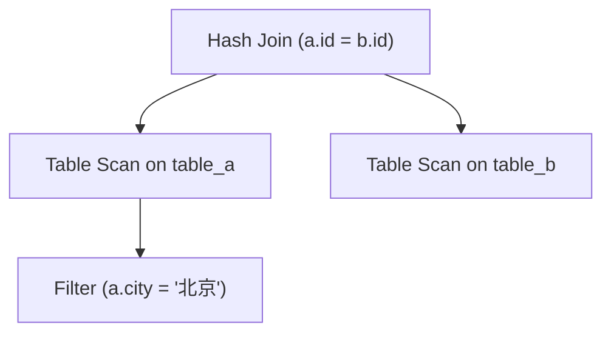

  * **Scan (扫描)**：读取表中的数据。
  * **Filter (过滤)**：根据 `WHERE` 条件筛选数据。
  * **Join (连接)**：将两个表的数据根据连接条件合并。

**查询优化器 (Query Optimizer)** 的工作就是从众多可能的执行计划中，挑选出一个它认为“成本”最低（例如，执行最快）的计划。这篇论文的核心，就是介绍一种更智能的优化器，它能生成更高效的、利用了“分区”特性的执行计划。

-----

### 2\. 数据仓库概念

#### 2.1 事实表 (Fact Table) 与维度表 (Dimension Table)

在数据分析领域（尤其是论文提到的数据仓库场景），表通常被设计成“星型模型”。

  * **事实表 (Fact Table)**：存储核心的业务度量值（“事实”），通常数据量巨大。例如，论文**图3**中的`orders`表就是一个事实表，包含了`order_id`, `amount`, `date_id` 等交易记录 。  
  * **维度表 (Dimension Table)**：存储对事实的描述信息（“维度”），数据量相对较小。例如，**图3**中的`Date_dim`表就是维度表，它解释了`date_id`对应的具体年份、月份、星期几等信息 。

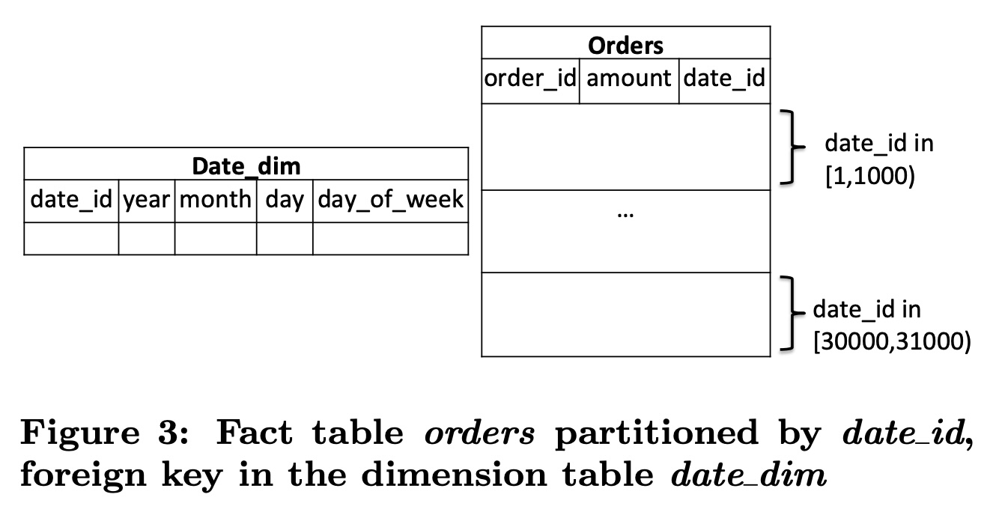

```
+------------------------------------+      +-----------------------------------------+
|           事实表 (Orders)            |      |            维度表 (Date_dim)            |
|------------------------------------|      |-----------------------------------------|
| order_id | amount | date_id (外键) |      | date_id (主键) | year | month | day |
| ...      | ...    | ...            | ---> | ...            | ...  | ...   | ... |
| (数据量巨大)                         |      | (数据量相对小)                            |
+------------------------------------+      +-----------------------------------------+
```

这种设计使得分析查询通常需要将巨大的事实表和多个维度表进行`JOIN`操作。

-----

### 3\. 核心概念：表分区 (Table Partitioning)

这是理解本论文的**绝对核心**。

#### 3.1 什么是表分区？

当一张表的数据量变得非常庞大时（例如上亿条记录），管理和查询它会变得很慢。分区技术就是将这张逻辑上完整的“大表”，在物理上分割成多个更小、更易于管理的“小块”（即分区），每一块都存储着表的一部分数据。

这就好比一个巨大的图书馆，我们不把所有的书都混在一起，而是按照“文学”、“历史”、“科技”等类别分门别类地放在不同的书架上。这里的每个书架就是一个“分区”。

论文中的**图1**非常形象地展示了这一点：`Orders`这张大表，被按照日期分成了`Jan-2012`, `...`, `Dec-2013`等多个月度分区 。 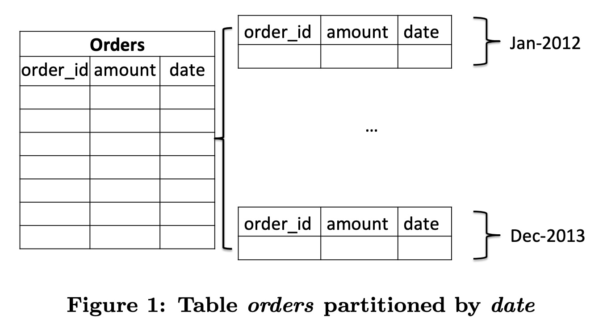 

#### 3.2 为什么需要分区？ -\> 分区消除 (Partition Elimination)

分区的最大好处是，在查询时可以只访问相关的分区，而完全跳过那些不含所需数据的分区。这个过程就叫做**分区消除**或**分区裁剪 (Partition Pruning)**。

回到图书馆的例子，如果你要找一本关于“人工智能”的书，你只需要去“科技”区的书架查找，而完全不需要看“文学”和“历史”区的书架，大大提高了查找效率。

论文中介绍了两种分区消除技术：

##### a) 静态分区消除 (Static Partition Elimination)

当查询条件直接明确地指定了分区键的范围时，优化器在“编译”SQL时（优化阶段）就能静态地确定需要扫描哪些分区。

  * **例子**: 论文**图2**中的查询 `WHERE date BETWEEN '10-01-2013' AND '12-31-2013'` 。  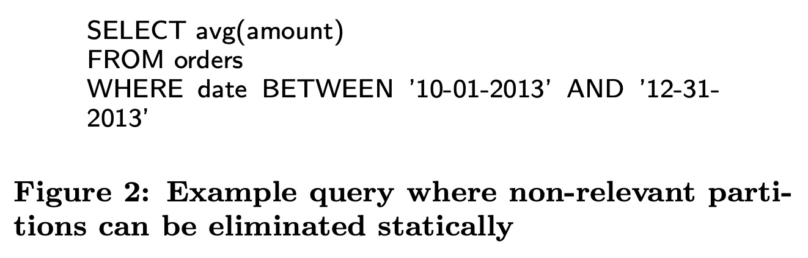 
  * **过程**: 优化器在生成执行计划时，看到日期范围是2013年的最后一个季度，就会直接决定只扫描 `Oct-2013`, `Nov-2013`, `Dec-2013` 这三个分区，而忽略其他所有分区 。这在大多数数据库中都已实现 。

##### b) 动态分区消除 (Dynamic Partition Elimination)

这是本论文的**重点和难点**。当分区键的过滤条件不是一个常量，而是需要通过查询另一张表才能确定时，就无法在优化阶段静态地决定扫描哪些分区了。

  * **例子**: 论文**图4**中的查询 。  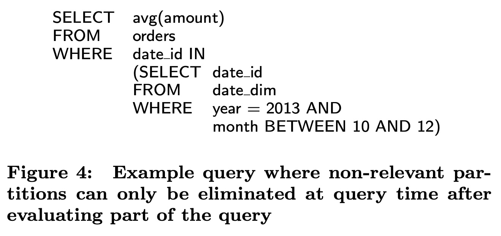 
      * `orders` (事实表) 根据 `date_id` 分区 。
      * 查询条件是 `year = 2013` 并且 `month BETWEEN 10 AND 12`，但这些条件作用在`date_dim` (维度表)上 。
      * 要过滤`orders`表，必须先从`date_dim`中找出所有符合条件的`date_id`，然后用这些`date_id`作为过滤条件去扫描`orders`表的分区 。
  * **挑战**: 具体的`date_id`值只有在查询 **运行时(run-time)** 才能知道，优化器在编译时无法预知。如何设计一个执行计划，能够“动态地”、“在运行时”才决定扫描哪些分区，就是这篇论文要解决的关键问题。

为了解决这个问题，论文提出了`PartitionSelector`（分区选择器，生产者）和`DynamicScan`（动态扫描，消费者）这两个新的执行算子 。如 **图5(d)** 所示，`PartitionSelector`可以在`JOIN`的一侧，根据从另一张表（`TableScan(R)`）流动过来的数据动态地计算出需要扫描的分区ID（如图中蓝色的T15, T21, T31），然后传递给另一侧的`DynamicScan`去执行真正的扫描 。  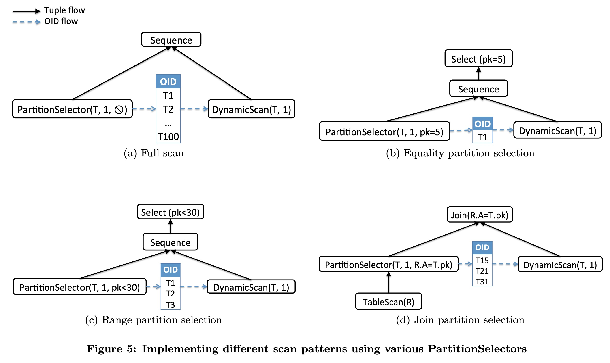 
 
-----

### 4\. 核心概念：MPP 数据库架构

MPP（Massively Parallel Processing，大规模并行处理）是论文技术应用的平台背景。

#### 4.1 什么是MPP？

简单来说，MPP就是“人多力量大”。它不是用一台超级计算机来处理数据，而是由成百上千台普通的服务器构成一个集群，每台服务器都有自己独立的CPU、内存和硬盘（这被称为“Share Nothing”架构），它们通过高速网络连接，协同完成计算任务。Greenplum, Teradata, 以及论文中提到的HAWQ都属于MPP数据库 。

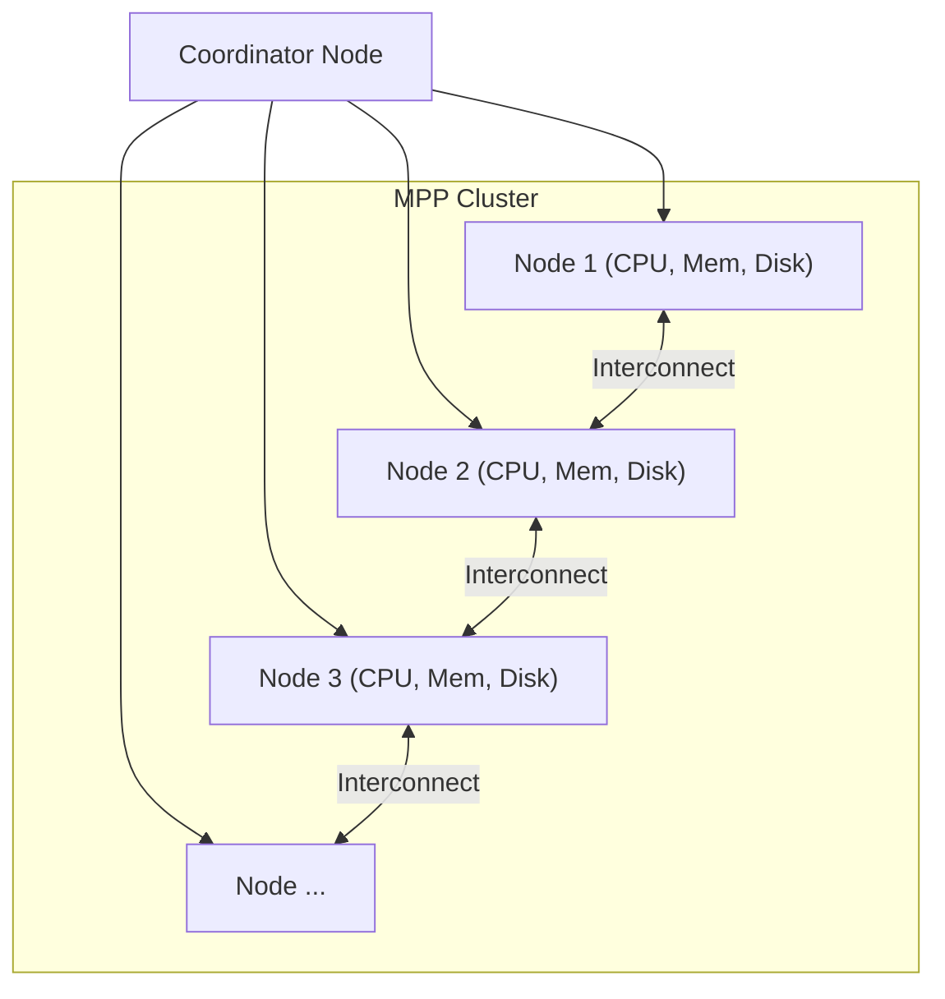

#### 4.2 数据分布 (Data Distribution) 与 数据移动 (Motion)

在MPP系统中，一张大表的数据会被打散，分布存储在所有的计算节点上（例如，根据`order_id`进行哈希分布）。

当执行`JOIN`时，如果两张表的连接键（`JOIN key`）和它们的数据分布键不一致，部分数据就可能需要通过网络从一个节点传输到另一个节点，以便能匹配上。这个数据传输的动作，在执行计划中通常由一个叫做**Motion**（或Shuffle, Exchange）的算子来完成。

**这对论文意味着什么？**
论文提出的`PartitionSelector`和`DynamicScan`需要进行通信（传递分区ID）。在MPP环境下，这两个算子可能运行在不同的物理节点上。如果它们之间存在一个`Motion`算子，这种通信就无法通过简单的共享内存完成，会导致执行计划非法。因此，优化器在生成计划时，必须保证这对“生产者-消费者”算子位于同一个进程内，不能被`Motion`算子隔开 。论文的第3节和**图12**详细讨论了如何处理这种复杂情况 。  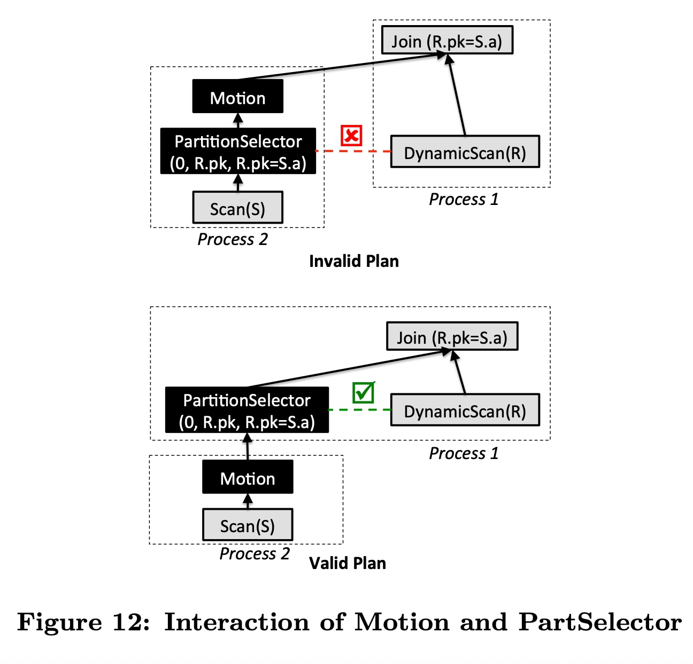 

### 总结

要读懂这篇论文，您需要带着以下问题去阅读：

1.  **背景**: 这是一个数据仓库场景，查询涉及巨大的事实表和维度表的连接 (参考**图3**)。   
2.  **目标**: 利用表分区技术，尽可能少地扫描数据，从而加速查询。
3.  **挑战**: 如何在`JOIN`场景下实现**动态分区消除**，即在运行时根据`JOIN`的另一端传来的数据，才决定扫描哪些分区 (参考**图4**)。  
4.  **方案**: 论文提出了一种新的执行计划模型，包含`PartitionSelector`和`DynamicScan`两个算子，以生产者-消费者的模式优雅地解决了动态分区消除的问题 (参考**图5**)。   
5.  **难点**: 如何将这个模型无缝地、高效地、正确地实现在一个复杂的**MPP**分布式数据库的查询优化器中，同时处理好数据分布和`Motion`带来的约束 (参考**图12, 13**)。   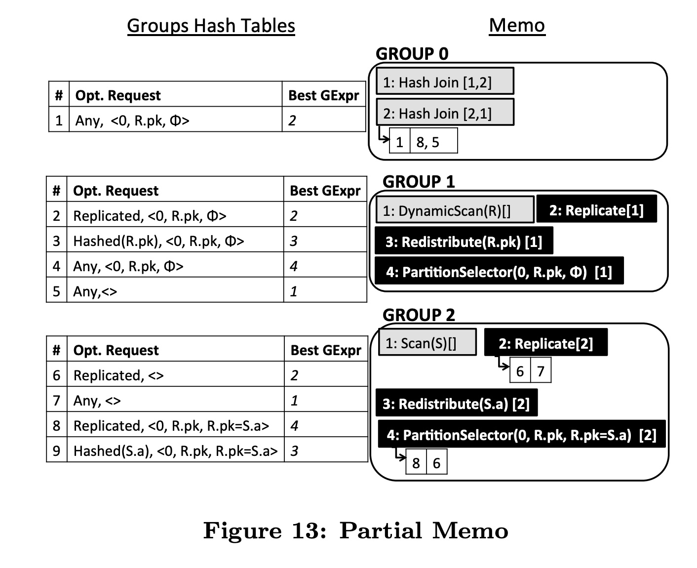 

掌握了这些基础知识后，您会发现论文中的算法和实现细节都将变得更加清晰。祝您阅读顺利！
  
## 2 解读论文 
  
好的，这篇名为《Optimizing Queries Over Partitioned Tables In MPP Systems》的论文，核心是解决一个在“大数据”时代非常普遍且重要的问题：**如何让数据库在处理海量数据时，能够通过“只读必要的数据，跳过无关的数据”来极大地提升查询速度。**

下面我将为您通俗地解读这篇论文的关键内容。

### 1\. 问题的背景：又大又“笨”的表查询

想象一下，你有一张订单表，记录了公司过去十年的所有交易，数据量高达数十亿条。现在，老板让你分析一下“2013年第四季度，加州地区的销售情况”。

传统的数据库可能会从头到尾扫描整张巨大的表，耗费大量时间。为了解决这个问题，人们引入了**表分区 (Table Partitioning)** 技术。

#### 什么是表分区？

分区就像是给一个巨大的文件柜（一张大表）安装了很多个抽屉，并给每个抽屉贴上标签。例如，我们可以按月份给订单表分区，`2012年1月`的数据放一个抽屉，`2012年2月`的数据放另一个，以此类推 。

**论文图1** 直观地展示了这个概念：`Orders` 表被分成了从 `Jan-2012` 到 `Dec-2013` 的多个月度分区。

 

图1: 按日期分区的Orders表示意图

有了分区，当查询 `WHERE date BETWEEN '2013-10-01' AND '2013-12-31'` 时，数据库只需打开对应2013年10、11、12月这三个抽屉即可，其他所有抽屉都无需理会。这个过程叫做**分区消除 (Partition Elimination)** 。

### 2\. 论文的挑战：“动态”分区消除的难题

上面提到的情况属于**静态分区消除 (Static Partition Elimination)**，因为查询条件是写死的常量，数据库在优化查询计划时就能“静态地”知道要扫描哪些分区 。

但现实中的分析查询往往更复杂。比如，数据常被设计成**星型模型 (Star Schema)**，包含巨大的事实表和多个维度表 。

**论文图3** 展示了这样一个场景：

  * **事实表 (Fact Table)**: `Orders` 表，按 `date_id` 分区 。
  * **维度表 (Dimension Table)**: `Date_dim` 表，存储了 `date_id` 对应的年、月、日等详细信息 。

 

图3: 事实表Orders按外键date\_id分区

现在，查询变成了**图4** 的样子：找出2013年10月至12月的平均订单金额 。   

```sql
SELECT avg(amount)
FROM orders
WHERE date_id IN (
    SELECT date_id FROM date_dim WHERE year = 2013 AND month BETWEEN 10 AND 12
)
```

这里的挑战是：

1.  过滤条件 (`year=2013`, `month BETWEEN 10 AND 12`) 是作用在 `date_dim` 表上的。
2.  `orders` 表到底需要扫描哪些分区，取决于子查询从 `date_dim` 中返回的 `date_id` 集合。
3.  这个 `date_id` 集合在查询真正**运行时 (run-time)** 才能确定，在优化阶段是未知的。

这种情况就需要**动态分区消除 (Dynamic Partition Elimination)** 。大多数数据库要么不支持，要么支持得非常有限 。

### 3\. 论文的核心方案：生产者-消费者模型

为了优雅地解决动态分区消除问题，论文设计了一套全新的查询执行模型，引入了两个核心算子(operator)：

1.  **PartitionSelector (分区选择器)**：一个“生产者”。它的任务是在运行时动态地计算出需要扫描哪些分区的ID 。
2.  **DynamicScan (动态扫描器)**：一个“消费者”。它接收来自 `PartitionSelector` 的分区ID，然后只扫描这些被指定的分区 。

这两个算子成对出现，通过一个 `partScanId` 进行关联 。

**论文图5** 清晰地展示了这个模型如何应对不同场景：   

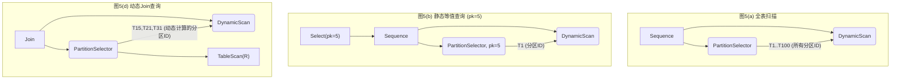

  * **(a) 全表扫描**: `PartitionSelector` 生成所有分区的ID给 `DynamicScan`。
  * **(b) 静态查询**: `PartitionSelector` 根据常量 `pk=5` 计算出分区ID `T1` 。
  * **(d) 动态Join查询**: 这是精髓所在。`PartitionSelector` 被放置在`Join`的左侧（外侧）。当左侧的 `TableScan(R)` 流出数据时，`PartitionSelector` 会根据这些数据实时计算出 `orders` 表需要扫描的分区ID，然后传递给`Join`右侧（内侧）的 `DynamicScan` 。

**这个模型的巨大优势在于：**

  * **统一性**：无论是静态还是动态消除，都使用同一套模型 。
  * **计划简洁**：查询计划的大小与表的分区数量无关 。即使表有数千个分区，计划依然小巧。这与传统方法（将每个分区都列在计划中）形成鲜明对比 。

### 4\. 关键实现：在MPP架构中的挑战

论文的技术是在 **MPP (大规模并行处理)** 数据库（如Greenplum）中实现的 。在MPP架构中，数据分布在多个节点上，节点间通过网络通信。

一个关键的执行算子是 **Motion (数据移动)**，它负责在节点间重新分发数据 。

**论文图12** 指出了一个核心约束：`PartitionSelector` 和 `DynamicScan` 必须在同一个进程中执行，才能高效通信 。因此，它们的执行路径上**不能存在 Motion 算子** 。

 

图12: 非法与合法的执行计划  

  * **Invalid Plan (上图)**: `Motion` 算子横在了 `PartitionSelector` 和 `DynamicScan` 的共同祖先节点之上，将它们分隔在了不同的进程中，导致无法通信。
  * **Valid Plan (下图)**: `Motion` 算子位于 `PartitionSelector` 的下方，保证了通信路径的畅通。

论文详细介绍了如何在查询优化器（Orca ）的 `Memo` 结构中，通过属性传递和规则检查，自动探索并生成所有合法的、包含 `PartitionSelector` 的高效执行计划 。

### 5\. 实验效果与结论

论文通过在TPC-DS基准测试上的实验证明了其方法的有效性：

  * **性能提升显著**：启用分区选择后，超过一半的查询性能提升50%以上，超过25%的查询性能提升70%以上 。
  * **扫描数据量减少**：与传统优化器相比，Orca能够消除更多的分区，例如，对 `web_returns` 表的扫描量减少了高达80% 。
  * **查询计划大小可控**：与传统方法相比，即使分区数量增加，论文方法的查询计划大小也基本保持不变，而传统方法的计划大小会线性甚至二次方级增长 。

### 总结

这篇论文的**核心贡献**可以概括为：

1.  **提出了一种创新的“生产者-消费者”模型**（`PartitionSelector` 和 `DynamicScan`），统一并优雅地解决了数据库中静态和（尤其是）动态分区消除的难题。
2.  **保证了查询计划的简洁性和可扩展性**，其大小不随分区数量的增加而膨胀，这对于拥有成千上万个分区的大型数据仓库至关重要。
3.  **成功地将该模型整合进一个先进的MPP数据库查询优化器中**，解决了分布式环境下数据移动（Motion）带来的复杂约束，并在真实场景中取得了显著的性能提升。

简而言之，它为现代大规模并行数据库如何“更聪明”地处理海量分区表提供了一套完整、高效且可扩展的解决方案。
  
## 3 术语 
  
好的，这篇论文《Optimizing Queries Over Partitioned Tables In MPP Systems》包含了一些数据库和分布式系统领域的关键术语。下面我将用通俗易懂的方式，结合论文中的图示，对这些核心术语进行讲解。

-----

### 1\. 表分区 (Table Partitioning)

  * **讲解**: 当一张表的数据量特别大时（例如上亿条记录），为了便于管理和提高查询效率，可以把它在物理上“切”成很多小块，但逻辑上它仍然是一张完整的表 。这个“切分”的过程就是分区。每一小块就是一个“分区”。

  * **类比**: 想象一个巨大的文件柜，与其把所有文件混在一起，不如按年份（2021、2022、2023...）分别放进不同的抽屉里。每个抽屉就是一个分区。

  * **论文图示**: **图1** 就清晰地展示了 `Orders` 这张大表，被按照 `date`（日期）分成了 `Jan-2012` 到 `Dec-2013` 等多个月度分区 。   

    Figure 1: Table orders partitioned by date

### 2\. 分区消除 (Partition Elimination)

  * **讲解**: 这是使用分区技术带来的最大好处。当查询带有过滤条件时，数据库优化器可以足够“聪明”地判断出只需要访问某些特定的分区，而完全跳过（消除）那些不包含所需数据的分区，从而大幅减少扫描的数据量，提升查询速度 。
  * **类比**: 如果你要找2023年的文件，你只需要打开标有“2023”的抽屉，而无需理会其他年份的抽屉。

这篇论文重点讨论了两种分区消除方式：

#### a) 静态分区消除 (Static Partition Elimination)

  * **讲解**: 指查询条件是一个明确的常量，优化器在“编译”SQL时就能**静态地**确定需要扫描哪些分区 。
  * **论文示例**: **图2** 中的查询 `WHERE date BETWEEN '10-01-2013' AND '12-31-2013'` 。优化器在生成计划时就已知道只需扫描2013年最后三个月的分区。   

#### b) 动态分区消除 (Dynamic Partition Elimination)

  * **讲解**: 这是论文要解决的核心难题。指分区的过滤条件在查询 **运行时(run-time)** 才能确定，通常因为它依赖于查询另一张表的结果 。
  * **论文示例**: **图4** 的查询场景 。`orders` 表按 `date_id` 分区，但过滤条件 `year = 2013 AND month BETWEEN 10 AND 12` 作用在 `date_dim` 表上 。系统必须先从 `date_dim` 查出符合条件的 `date_id`，然后才能**动态地**决定去扫描 `orders` 表的哪些分区 。   

### 3\. 星型模型 (Star Schema)

  * **讲解**: 这是数据仓库中一种常见的数据组织方式，由一个中心**事实表 (Fact Table)** 和周围多个**维度表 (Dimension Table)** 组成，形似星星 。
      * **事实表**: 存储核心的、大量的业务度量数据，如销售记录 。
      * **维度表**: 存储对事实的描述性信息，如时间、地点、产品类别等 。
  * **论文图示**: **图3** 展示了一个典型的星型模型，`Orders` 是事实表，`Date_dim` 是维度表 。这种模型下的查询常常需要进行动态分区消除。   

### 4\. `PartitionSelector` 与 `DynamicScan`

这是论文提出的两个**创新**的查询执行算子(operator)，它们以“生产者-消费者”模式协同工作 。

  * **`PartitionSelector` (分区选择器)**: 充当**生产者**角色 。它的核心任务是在查询运行时，根据上游传来的数据（例如Join的另一端）或其他条件，动态地计算出需要被扫描的分区ID 。

  * **`DynamicScan` (动态扫描器)**: 充当**消费者**角色 。它接收由 `PartitionSelector` 生成的分区ID列表，然后只去扫描这些被指定的分区，执行真正的数据读取操作 。

  * **论文图示**: **图5(d)** 完美地展示了它们的协作 。`PartitionSelector` 在Join的左侧，根据从 `TableScan(R)` 获得的数据，动态计算出分区ID `T15, T21, T31`，然后通过OID flow（OID流）传递给Join右侧的 `DynamicScan` 执行扫描 。   

    Figure 5(d): Join partition selection 

### 5\. MPP (Massively Parallel Processing)

  * **讲解**: 即“大规模并行处理”，是一种用于处理海量数据的数据库架构 。它由许多独立的服务器（节点）组成集群，每个节点都有自己的CPU、内存和硬盘（称为“Shared Nothing”架构）。查询任务会被分解后并行地在所有节点上执行，最后汇总结果。
  * **论文语境**: 论文提出的优化技术正是在这种复杂的分布式环境中设计和实现的，因此需要考虑跨节点数据通信等问题 。

### 6\. Motion (数据移动)

  * **讲解**: 在MPP系统中，当需要Join的两张表的数据没有按照Join的键分布在对应的节点上时，数据库就需要通过网络将数据从一个节点重分布（移动）到另一个节点。这个操作就由 `Motion` 算子完成 。`Motion` 通常是查询中非常耗费资源的一步。
  * **论文图示**: **图12** 展示了 `Motion` 对 `PartitionSelector` 和 `DynamicScan` 通信的影响 。优化器必须生成一个**合法的计划 (Valid Plan)**，确保 `Motion` 不会阻断这两个算子之间的通信路径 。   

### 7\. 查询执行计划 (Query Execution Plan)

  * **讲解**: 用户提交SQL后，查询优化器会生成一个详细的执行“步骤图”，告诉数据库底层该如何一步步地获取数据。这个步骤图就是查询执行计划，它通常是一个由各种算子（如Scan, Join, Filter, Motion等）组成的树状结构。

  * **类比**: 如同一份菜谱，详细说明了做一道菜的每一步。

  * **图示**: 论文中的 **图8(a)** 和 **图8(b)** 分别展示了优化前和优化后（加入了 `PartitionSelector`）的复杂查询执行计划 。  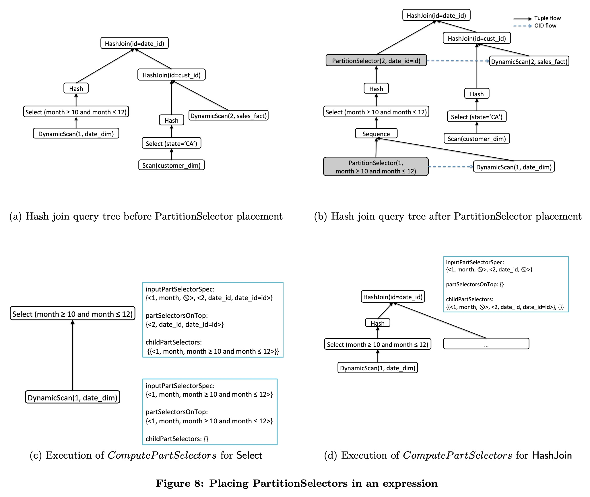 

    ```mermaid
    graph TD
        A[Join] --> B[Scan Table A];
        A --> C[Filter];
        C --> D[Scan Table B];
    ```

    一个简化的查询执行计划示意图

通过理解以上术语，您就能更好地把握这篇论文的核心思想：**通过创新的 `PartitionSelector` 和 `DynamicScan` 算子，在复杂的MPP环境中，实现了一套统一且高效的动态分区消除框架，从而显著提升了大数据分析查询的性能**。
  
## 参考        
         
https://dl.acm.org/doi/pdf/10.1145/2588555.2595640    
        
<b> 以上内容基于DeepSeek、Qwen、Gemini及诸多AI生成, 轻微人工调整, 感谢杭州深度求索人工智能、阿里云、Google等公司. </b>        
        
<b> AI 生成的内容请自行辨别正确性, 当然也多了些许踩坑的乐趣, 毕竟冒险是每个男人的天性.  </b>        
  
    
#### [期望 PostgreSQL|开源PolarDB 增加什么功能?](https://github.com/digoal/blog/issues/76 "269ac3d1c492e938c0191101c7238216")
  
  
#### [PolarDB 开源数据库](https://openpolardb.com/home "57258f76c37864c6e6d23383d05714ea")
  
  
#### [PolarDB 学习图谱](https://www.aliyun.com/database/openpolardb/activity "8642f60e04ed0c814bf9cb9677976bd4")
  
  
#### [PostgreSQL 解决方案集合](../201706/20170601_02.md "40cff096e9ed7122c512b35d8561d9c8")
  
  
#### [德哥 / digoal's Github - 公益是一辈子的事.](https://github.com/digoal/blog/blob/master/README.md "22709685feb7cab07d30f30387f0a9ae")
  
  
#### [About 德哥](https://github.com/digoal/blog/blob/master/me/readme.md "a37735981e7704886ffd590565582dd0")
  
  

  
