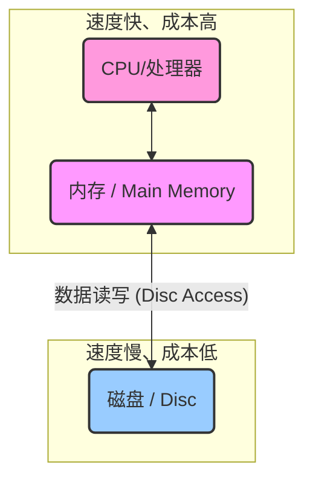
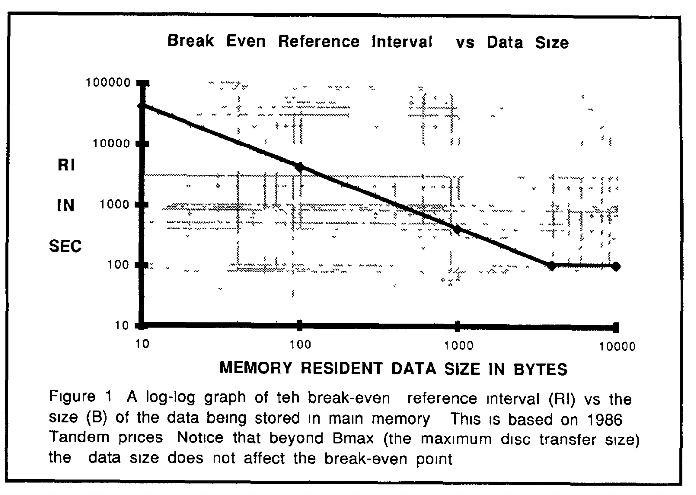

## AI论文解读 | The 5 Minute Rule For Trading Memory For Disc Accesses And The 10 Byte Rule For Trading Memory For Cpu Time
        
### 作者        
digoal        
        
### 日期        
2025-10-19        
        
### 标签        
PostgreSQL , PolarDB , DuckDB , AI , 论文解读        
        
----        
        
## 背景  
      
https://dl.acm.org/doi/pdf/10.1145/38713.38755        
  
提示:          
```          
读懂《The 5 Minute Rule For Trading Memory For Disc Accesses And The 10 Byte Rule For Trading Memory For Cpu Time》这篇论文需要提前掌握哪些基础知识, 请使用中文通熟易懂的讲解这些基础知识, 可以引用论文中的图、表或使用Markdown支持的图形(text,mermaid等)增加解释性. 
  
使用中文通熟易懂的解读《The 5 Minute Rule For Trading Memory For Disc Accesses And The 10 Byte Rule For Trading Memory For Cpu Time》这篇论文, 其中的关键内容请着重讲解, 可以引用论文中的图、表或使用Markdown支持的图形(text,mermaid等)增加解释性. 
  
提取《The 5 Minute Rule For Trading Memory For Disc Accesses And The 10 Byte Rule For Trading Memory For Cpu Time》这篇论文中的重要术语, 使用中文对这些术语进行通熟易懂的讲解, 可以引用论文中的图、表或使用Markdown支持的图形(text,mermaid等)增加解释性. 
```     
  
## 1 前置知识 
  
要读懂这篇经典的论文，你并不需要非常高深的计算机算法知识，但你需要对计算机系统设计中的一些基本概念和经济学权衡有清晰的认识。

这篇论文的核心思想是：**在计算机系统设计中，很多决策本质上是经济学决策** 。它试图用简单的“经验法则”（Rules of Thumb）来指导工程师在“时间”和“空间”（或者更具体地说，在不同硬件成本）之间做出划算的选择。

以下是理解这篇论文所需的基础知识，我会用通俗的语言为你讲解：

### 1\. 基础知识一：计算机的存储层次 (Storage Hierarchy)

这是理解“5分钟法则”  的关键。你需要知道计算机存储数据的地方不是铁板一块，而是分“等级”的。

  * **主存储器 (Main Memory / 内存 / RAM):**

      * **特点：** 速度极快（CPU可以直接读写），但价格昂贵，而且是“易失”的（断电后数据就没了）。
      * **类比：** 就像你书桌的桌面。你正在处理的文件（数据）会放在桌面上，方便你随时拿起来看（访问）。

  * **辅助存储器 (Disc / 磁盘 / 硬盘):**

      * **特点：** 速度很慢（相比内存），但价格非常便宜，而且是“非易失”的（断电后数据还在）。
      * **类比：** 就像你书房的书架。不常用的文件会放在书架上。当你需要它时，你必须先起身，走到书架，找到它，然后把它拿到桌面上（这个过程就是“磁盘访问”）。

**论文的权衡点：**
论文中的“5分钟法则”  探讨的就是：哪些数据应该一直放在昂贵但快速的“桌面”（内存）上，哪些数据应该放在便宜但缓慢的“书架”（磁盘）上？

如果一个文件（数据）你每隔几分钟就要用一次，那么每次都去书架上拿（访问磁盘）就太浪费时间了 。虽然把它一直放在桌面上会占用宝贵的桌面空间（内存成本），但如果这个动作足够频繁，那么节省下来的“跑去书架拿”的时间成本（磁盘访问成本）是值得的 。

你可以用下面的文本图来理解这个层次：



### 2\. 基础知识二：CPU 与程序执行

这是理解“10字节法则”  的关键。

  * **CPU (中央处理器):** 计算机的大脑。它通过执行“指令”（Instructions）来完成所有工作 。
  * **指令 (Instruction):** CPU能看懂的最小操作命令，比如“把两个数加起来”、“从内存加载一个数据”或“检查一个标志位” 。
  * **CPU 时间 (CPU Time):** CPU执行这些指令所花费的时间 。CPU的“算力”是有限且宝贵的资源。
  * **数据打包 (Packing Data):** 为了节省内存空间，程序员有时会“精打细算”。比如，一个开关状态（“开”或“关”）只需要1个“比特”（bit）就能表示。但计算机存储数据的最小单位通常是“字节”（byte，1字节=8比特）。为了省空间，程序员可能会把8个开关状态“打包”塞进1个字节里 。
  * **打包的代价：** 这样做虽然节省了7个比特的*内存空间*，但当CPU想要检查其中*某一个*开关的状态时，它就必须执行额外的“指令”——比如“掩码”（MASK）和“移位”（SHIFT）——才能把这个比特从字节中“提取”出来 。

**论文的权衡点：**
“10字节法则”  探讨的就是：我们是应该“打包”数据来**节省内存空间**，还是应该让数据“松散”存放（例如用一整个字节去存1个比特的开关状态 ）来**节省CPU指令**（即CPU时间）？

论文的结论是（基于1986年的价格）：每秒钟能为CPU节省1条指令的执行，其价值大约等于10个字节的内存 。

### 3\. 基础知识三：基本的经济学概念

这是贯穿全文的核心，也是最重要的基础。

  * **成本效益分析 (Cost-Benefit Analysis):** 论文中的一切决策都是基于“划不划算” 。
  * **盈亏平衡点 (Break-Even Point):** 论文计算的“5分钟”  就是一个平衡点 。
      * 如果访问间隔*短于*5分钟：把数据放内存（花内存钱）比频繁访问磁盘（花I/O钱）更划算 。
      * 如果访问间隔*长于*5分钟：让数据待在磁盘上更划算。
  * **价格比率 (Price Ratios):** 论文中所有的“法则”都不是物理定律，而是基于当时（1986年）硬件的“价格比率”得出的 。
      * **$A\$$ (每秒磁盘访问成本):** 支撑“每秒一次磁盘访问”需要花多少钱（包括磁盘、控制器、CPU开销等）。
      * **$M\$$ (每字节内存成本):** 购买1MB或1KB内存需要花多少钱 。
      * **MIP成本 (每MIP成本):** 购买“每秒执行一百万条指令”的CPU算力需要多少钱 。

### 4\. 基础知识四：计算机性能指标

你需要理解论文中用来衡量性能的几个基本单位：

  * **访问 (Access):** 指对数据的一次读取或写入操作 。
  * **每秒访问次数 (Accesses per Second, a/s):** 衡量磁盘性能的单位 。论文提到当时的磁盘大约能提供15 a/s 。
  * **访问间隔 (Reference Interval, RI):** 指数据*两次*被访问之间平均隔了多少秒 。这是“5分钟法则”中的关键变量。
  * **指令/秒 (Instructions per Second, IPS):** 衡量CPU性能的单位 。

-----

### 总结：读懂论文你需要掌握什么？

总而言之，要读懂这篇论文，你需要：

1.  **硬件概念：** 知道内存很快但贵，磁盘很慢但便宜 。
2.  **CPU概念：** 知道CPU通过执行指令工作，“打包”数据可以省内存但会消耗额外的CPU指令 。
3.  **经济学思维：** 理解所有决策都是为了“省钱”——在不同硬件的成本之间找到平衡点 。
4.  **认识变量：** 知道论文中的图表（如第2页的图1 ）是在描述数据“访问间隔”（RI）和“数据大小”（B）之间的关系 。   

这篇论文之所以经典，是因为它开创性地将经济学原理量化为简单易记的工程法则。作者也明确指出，随着技术发展，硬件的价格比率会变化，因此这些“法则”中的具体数字（比如“5分钟”或“10字节”）也会随之改变 。例如，作者预测“5分钟法则”未来会变成“5小时法则” 。
  
## 2 解读论文 
  
这是一篇在计算机系统设计领域具有里程碑意义的经典论文 。它的核心思想非常简单：**系统设计中的许多决策，本质上都是经济学决策**。

这篇论文（请注意，标题原文是“10字节法则” ，不是5字节）提出了两条“经验法则”，用以指导工程师如何在不同硬件资源（如内存、磁盘、CPU）之间做出最“划算”的权衡 。

以下是对这篇论文关键内容的通俗解读。

---

### 关键内容一：5分钟法则 (The Five Minute Rule)

**法则：** 如果一份数据被访问的频率高于大约**每5分钟一次**，那么它应该被保存在**主内存**（Memory）中，而不是放在**磁盘**（Disc）上 。

#### 1. 问题背景：内存 vs. 磁盘

要理解这个法则，你首先要明白内存和磁盘的区别：

* **主内存 (Memory / RAM):** 像你办公室的**桌面**。它速度极快，CPU可以直接在上面读写数据。但它非常昂贵，而且空间有限 。
* **磁盘 (Disc / 硬盘):** 像你办公室的**书架**。它容量巨大且价格便宜。但速度极慢，当CPU需要“书架”上的数据时，必须执行一次“磁盘访问”（Disc Access）——即起身、走到书架、找到文件、再拿回桌上——这个过程非常耗时 。

**决策点：** 对于一份数据，我们是应该让它常驻在昂贵的“桌面”（内存）上，还是在每次需要时都去“书架”（磁盘）上取？

#### 2. “5分钟”是怎么算出来的？(1986年经济账)

作者Jim Gray和Franco Putzolu算了一笔1986年的经济账，这个计算过程是论文的精髓 ：

1.  **买“访问速度”的成本 (A$)：**
    * 当时的磁盘硬件（加上控制器和CPU开销）为了支撑“每秒1次磁盘访问（1 a/s）”的性能，综合成本大约是 **$2000\$** 。
    * `A$ = 2000 / (access/second)`  

2.  **买“内存空间”的成本 (M$)：**
    * 当时 1MB 内存的价格大约是 $5000\$$ 。
    * 那么 1KB (1000 字节) 内存的价格就是 **$5\$** 。
    * `M$ = 0.005 $ / byte`  

3.  **盈亏平衡点 (Break-Even Point)：**
    * 现在的问题是：花 $5\$$ 买 1KB 的内存空间，能省下多少磁盘访问才“回本”？
    * 我们用“买内存的钱”( $5\$$ ) 除以“买访问速度的钱”( $2000\$$ )，看看这 $5\$$ 等价于多少访问速度：
        $$\frac{5\$}{2000 \$\text{/ (a/s)}} = 0.0025 \text{ a/s}$$
    * 这意味着，如果把 1KB 数据放内存，我们至少要节省 0.0025 a/s 才不亏。
    * 那么，0.0025 a/s 的访问频率是多久访问一次呢？
        $$\text{访问间隔} (RI) = \frac{1}{0.0025 \text{ a/s}} = 400 \text{ 秒}$$
    * **400秒**，大约就是“5分钟” 。

**结论：** 如果你对这 1KB 数据的访问间隔**短于**400秒（即访问更频繁），那么把它放内存（ 花费 $5\$ ）就比忍受磁盘访问（ 成本高于 $5\$ ）更划算 。

#### 3. 不只是“5分钟”：访问间隔与数据大小的关系

论文进一步指出，“5分钟”只是针对 1KB 大小数据的近似值 。作者给出了一个更通用的公式 ：

$$\text{访问间隔} (RI) = \frac{A\$}{M\$ \times B}$$
( $B$ 是数据大小 )

使用1986年的价格 ( $A\$=2000$ , $M\$=0.005$ )，公式变为： $RI = \frac{400,000}{B}$ 。

这在论文的图1（Figure 1）中有清晰的体现 。我们可以用一个表格来理解这个关系：   

| 数据大小 (B) | 盈亏平衡的访问间隔 (RI) | 通俗理解 |
| :--- | :--- | :--- |
| 100 字节 (小数据) | 4000 秒 (约 67 分钟) | 即使1小时访问一次，也值得放内存 [cf: 35] |
| 1KB (1000 字节) | 400 秒 (约 7 分钟) | “5分钟法则”的由来 [cf: 31] |
| 4KB (4000 字节) | 100 秒 (约 1.7 分钟) | 数据越大，占内存成本越高，必须访问得更频繁才划算 [cf: 36] |
| > 4KB (大于磁盘传输块) | 100 秒 (固定) | 当数据大于磁盘单次传输上限时，访问成本不再增加，平衡点固定  |

这个法则的应用非常广泛，例如数据库的缓存（Buffer Pool）大小设计、操作系统的虚拟内存页面替换（如 CLOCK 算法）等 。

---

### 关键内容二：10字节法则 (The Ten Byte Rule)

**法则：** （在1986年）花费 **10个字节（Bytes）的主内存** 来为CPU **每秒节省1条指令（Instruction per second, IPS）** 的执行，是划算的 。

#### 1. 问题背景：内存 vs. CPU 时间

这第二个法则，是关于“空间换时间”的 。

* **CPU 时间：** CPU是计算机的大脑，它的算力是宝贵的。
* **节省内存的代价：** 程序员有时为了节省内存空间，会使用一些“技巧”。例如，一个“开关”状态（开/关）只需要1个比特（bit），但内存的最小读写单位是1个字节（byte，等于8比特）。为了省空间，程序员可能把8个不同的“开关”状态“打包”（Pack）塞进1个字节里 。
* **CPU的代价：** 这样做虽然节省了7个比特的内存，但当CPU想要检查其中*第3个*开关的状态时，它就必须执行额外的指令（如 `MASK` 和 `SHIFT` 指令）才能把这个比特“提取”出来 。

**决策点：** 我们是应该“打包”数据来**节省内存空间**，还是应该让数据“松散”存放（例如用一整个字节去存1个比特的开关状态）来**节省CPU指令**？

#### 2. “10字节”是怎么算出来的？(1986年经济账)

作者再次算了一笔经济账 ：

1.  **买“CPU算力”的成本：**
    * 当时 1 MIP（每秒执行一百万条指令）的CPU算力，成本大约是 **$50,000\$** 。
    * 那么“每秒1条指令（1 IPS）”的成本是多少？
        $50,000\$ / 1,000,000 \text{ IPS} = \textbf{0.05\$ / IPS}$  

2.  **买“内存空间”的成本：**
    * 上面算过，1MB 内存 $5000\$$ 。
    * 那么“10个字节”的成本是多少？
        $(5000\$ / 1,000,000 \text{ 字节}) \times 10 \text{ 字节} = \textbf{0.05\$}$ 。

3.  **盈亏平衡点：**
    * 成本完全相等 。
    * **$ \text{Cost(10 Bytes)} \approx \text{Cost(1 IPS)} $**

**结论：** （在1986年）10字节内存的成本，恰好约等于每秒节省1条CPU指令的成本 。

#### 3. 如何应用“10字节法则”？

论文给出了一个操作系统的例子 ：

* **场景：** 操作系统里有一个“标志位”（Flag）被打包在1个字节里 。
* **CPU消耗：** 检查这个标志位需要一条 `MASK` 指令 。
* **频率：** 这个检查动作每秒要执行 1000 次 。
* **优化：** 如果我们不打包，把这个标志位单独存为1个字节，就可以省掉 `MASK` 指令 。

**分析：**
1.  **节省的CPU：** 我们每秒节省了 1000 条指令 。
2.  **换算价值：** 根据“10字节法则”，1000 IPS 的价值 $\approx 1000 \times 10 = 10,000$ 字节的内存 。
3.  **花费的内存：** 假设系统中有100个这样的标志位，从1 bit扩展到1 byte（8 bits），额外花费了大约 88 个字节的内存 。
4.  **投资回报：** 我们只花了 88 字节的内存，却换来了价值 10,000 字节的CPU性能 。这是一笔回报率高达 100:1 的血赚买卖 。

---

### 论文的核心思想与未来预测

这篇论文最重要的贡献，是提供了一种**用经济学量化分析系统设计**的方法。

作者在最后强调，“5分钟”和“10字节”不是一成不变的物理定律，它们完全取决于**当前硬件的价格比率** 。

作者还做出了惊人准确的预测：

* **硬件趋势：** 内存和磁盘容量每十年增长100倍（价格随之下降），CPU速度每十年增长10倍 ，但磁盘的访问速度（a/s）几乎不变 。
* **法则的演变：**
    1.  由于内存相对于“磁盘访问”会变得越来越便宜， **“5分钟法则”在未来（1996年）将变成“5小时法则”** 。数据只要几小时访问一次，就值得放内存。
    2.  由于内存相对于“CPU算力”也会变得越来越便宜， **“10字节法则”将变成“100字节法则”** 。工程师将可以“挥霍”内存来节省CPU。

这些预测在后来的几十年里基本得到了验证，也让这篇论文成为了计算机系统设计领域的必读经典。
  
## 3 术语 
  
以下是《The 5 Minute Rule For Trading Memory For Disc Accesses And The 10 Byte Rule For Trading Memory For Cpu Time》这篇论文中的重要术语及其通俗讲解：

（*请注意：论文原文标题和内容使用的是“10字节法则” (The 10 Byte Rule) ，而不是“5字节法则”。*）

### 1\. 五分钟法则 (The 5 Minute Rule)

  * **出处：** 
  * **通俗讲解：**
    这是论文提出的第一个核心观点。它是一个“经验法则”，用来帮助工程师决定：一份数据是应该“常驻”在昂贵的**内存**中，还是应该放在便宜的**磁盘**上？
  * **法则内容：**
    （在1986年）如果一份数据被访问的频率**高于**大约**每五分钟一次**，那么它就应该被保存在主内存（Main Memory）中 。
  * **为什么：**
    因为频繁地从磁盘读取数据（即“磁盘访问”）需要花费很多成本（包括硬件和时间开销） 。如果访问很频繁（短于5分钟），那么把数据放在内存里一次性付清“内存占用费”，会比每次访问都支付“磁盘过路费”更划算 。

-----

### 2\. 十字节法则 (The 10 Byte Rule)

  * **出处：** 
  * **通俗讲解：**
    这是论文的第二个核心观点，用于权衡**内存空间**和**CPU时间** 。
  * **法则内容：**
    （在1986年）花费 **10个字节（Bytes）的主内存空间**，来换取CPU **每秒少执行1条指令（Instruction per second）** ，是划算的 。
  * **为什么：**
    在1986年，购买10字节内存的成本，约等于购买“每秒执行1条指令”的CPU算力成本 。因此，如果你能通过多花10字节内存，让程序在1秒内少执行1条指令，这笔交易就是“划算”的。

-----

### 3\. 磁盘访问 (Disc Access)

  * **出处：** 
  * **通俗讲解：**
    指计算机从磁盘（硬盘）读取或写入数据的动作 。
  * **关键点：**
    磁盘访问在当时被认为是昂贵的。论文估算，在1986年的Tandem系统上，要支撑“每秒1次磁盘访问”的持续性能，其综合成本（包括磁盘、控制器、CPU开销等）高达 **2000美元** 。这是“五分钟法则”计算的基础。

-----

### 4\. 内存驻留 (Main Memory Resident)

  * **出处：** 

  * **通俗讲解：**
    指将数据（例如一个文件或一条数据库记录）固定地保存在主内存（RAM）中，而不是在需要时才从磁盘加载 。

  * **权衡：**
    “五分钟法则”探讨的就是何时“内存驻留”在经济上是合理的 。

    ```mermaid
    graph TD
        subgraph 决策点: 数据放哪里?
            A(内存驻留) --- B(成本: 占用昂贵的内存 )
            A --- C(收益: 节省磁盘访问成本 )
            D(存磁盘) --- E(成本: 每次用都需昂贵的磁盘访问 )
            D --- F(收益: 节省内存空间)
        end
    ```

-----

### 5\. 盈亏平衡点 (Break-Even Point)

  * **出处：** 
  * **通俗讲解：**
    这是“五分钟法则”的计算核心。它指一个临界点，在这个点上， **“A：把数据放内存的成本”** 正好等于 **“B：把数据放磁盘所节省的访问成本”** 。
  * **计算：**
      * **A (内存成本):** 1986年 1KB 内存约 5$ 。
      * **B (磁盘访问成本):** 1986年 1 (a/s) 约 2000$ 。
      * **平衡点：** 5$ (内存) / 2000$ (访问) = 0.0025 a/s（每秒访问0.0025次）。
      * **换算：** 1 / 0.0025 = 400 秒。
      * **结论：** 400秒（约“5分钟”）就是1KB数据的盈亏平衡点 。

-----

### 6\. 访问间隔 (RI - Reference Interval)

  * **出处：**  

  * **通俗讲解：**
    指一份数据**两次被访问之间**的平均时间间隔（单位：秒） 。

  * **在法则中的应用：**

      * 如果 $RI < 400秒$ （访问间隔小于5分钟），意味着访问很频繁，应**内存驻留**。
      * 如果 $RI > 400秒$ （访问间隔大于5分钟），意味着访问不频繁，放**磁盘**更划算。

  * **论文图1 (Figure 1) 解读：**
    该图  展示了“盈亏平衡的访问间隔 (RI)” 与 “数据大小 (B)” 之间的关系。   

      * 数据越小（如100字节），占内存成本越低，平衡点越长（约1小时） 。
      * 数据越大（如4K字节），占内存成本越高，平衡点越短（约2分钟） 。
      * “五分钟法则”是针对1KB数据的一个近似值 。

-----

### 7\. 数据打包 (Packing Data)

  * **出处：** 
  * **通俗讲解：**
    这是“十字节法则”讨论的场景。指一种编程技巧，为了节省内存空间，把多个数据（例如8个“开关”状态，每个状态只需要1 bit）强行“塞”进一个字节（Byte）里 。
  * **代价：**
    这样做虽然节省了内存，但当CPU需要读取其中某个“开关”的状态时，就必须执行额外的指令（如“掩码 MASK”或“移位 SHIFT”）来把它“提取”出来 。
  * **权衡：**
    “十字节法则”告诉我们，如果这种“打包”带来的额外CPU计算负担（换算成成本）超过了它所节省的内存成本，那就不划算 。

-----

### 8\. MIP (每秒百万指令)

  * **出处：** 
  * **通俗讲解：**
    "Million Instructions Per Second" 的缩写，是衡量CPU处理器速度（算力）的单位。
  * **在法则中的应用：**
    论文使用MIP来估算CPU时间的成本。1986年，1 MIP算力的价格约为 50,000$ 。这是推导“十字节法则”（即每秒1条指令的成本）的基础 。

-----

### 9\. 价格比率 (Price Ratios)

  * **出处：** 
  * **通俗讲解：**
    这是整篇论文的基石。论文指出，“5分钟”和“10字节”这两个数字**不是物理定律**，而是由当时（1986年）的**硬件价格比率**决定的 。
  * **关键点：**
    随着技术发展，硬件（内存、磁盘、CPU）之间的价格比例会发生变化 。因此，这些“法则”中的常数（5分钟和10字节）也必须随之改变 。
  * **预测：**
    作者预测，随着内存和磁盘价格比率的变化，未来“五分钟法则”可能会变成“五小时法则” 。
  
## 参考        
         
https://dl.acm.org/doi/pdf/10.1145/38713.38755    
        
<b> 以上内容基于DeepSeek、Qwen、Gemini及诸多AI生成, 轻微人工调整, 感谢杭州深度求索人工智能、阿里云、Google等公司. </b>        
        
<b> AI 生成的内容请自行辨别正确性, 当然也多了些许踩坑的乐趣, 毕竟冒险是每个男人的天性.  </b>        
  
    
#### [期望 PostgreSQL|开源PolarDB 增加什么功能?](https://github.com/digoal/blog/issues/76 "269ac3d1c492e938c0191101c7238216")
  
  
#### [PolarDB 开源数据库](https://openpolardb.com/home "57258f76c37864c6e6d23383d05714ea")
  
  
#### [PolarDB 学习图谱](https://www.aliyun.com/database/openpolardb/activity "8642f60e04ed0c814bf9cb9677976bd4")
  
  
#### [PostgreSQL 解决方案集合](../201706/20170601_02.md "40cff096e9ed7122c512b35d8561d9c8")
  
  
#### [德哥 / digoal's Github - 公益是一辈子的事.](https://github.com/digoal/blog/blob/master/README.md "22709685feb7cab07d30f30387f0a9ae")
  
  
#### [About 德哥](https://github.com/digoal/blog/blob/master/me/readme.md "a37735981e7704886ffd590565582dd0")
  
  

  
