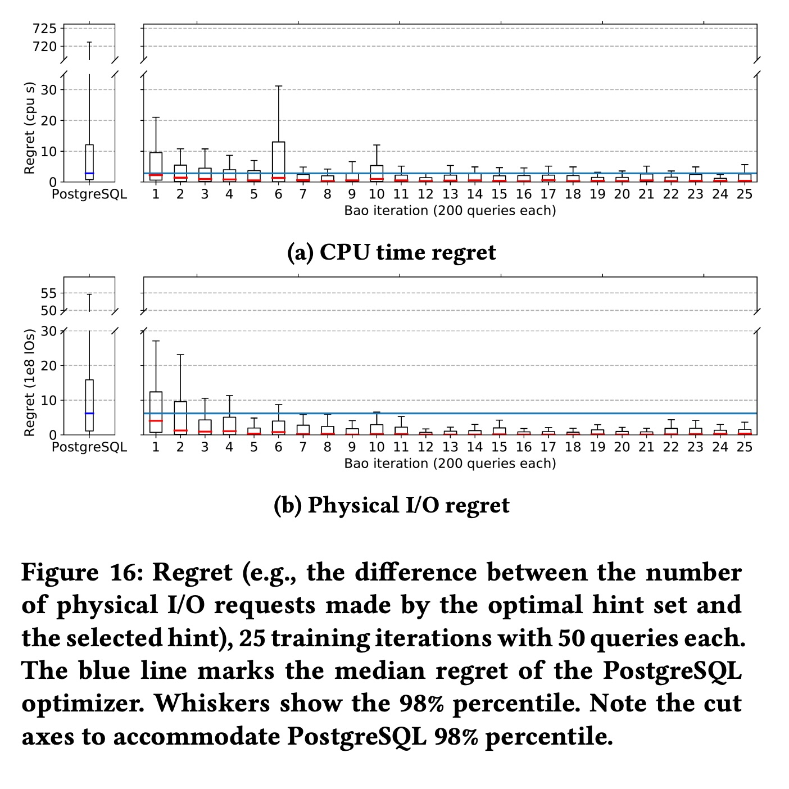

## AI论文解读 | Bao: Making Learned Query Optimization Practical
        
### 作者        
digoal        
        
### 日期        
2025-10-20        
        
### 标签        
PostgreSQL , PolarDB , DuckDB , AI , 论文解读        
        
----        
        
## 背景  
      
https://dl.acm.org/doi/pdf/10.1145/3448016.3452838        
  
提示:          
```          
读懂《Bao: Making Learned Query Optimization Practical》这篇论文需要提前掌握哪些基础知识, 请使用中文通熟易懂的讲解这些基础知识, 可以引用论文中的图、表或使用Markdown支持的图形(text,mermaid等)增加解释性. 
  
使用中文通熟易懂的解读《Bao: Making Learned Query Optimization Practical》这篇论文, 其中的关键内容请着重讲解, 可以引用论文中的图、表或使用Markdown支持的图形(text,mermaid等)增加解释性. 
  
提取《Bao: Making Learned Query Optimization Practical》这篇论文中的重要术语, 使用中文对这些术语进行通熟易懂的讲解, 可以引用论文中的图、表或使用Markdown支持的图形(text,mermaid等)增加解释性. 
```     
  
## 1 前置知识 
  
要读懂《Bao: Making Learned Query Optimization Practical》这篇论文，你需要对数据库系统和机器学习两个领域的基础知识都有所了解。Bao 的核心思想是**不造一个新的查询优化器，而是用机器学习（ML）来“指导”现有的优化器** ，告诉它在处理某个特定查询时，应该“启用”或“禁用”哪些功能（比如某种连接算法）。

以下是理解这篇论文所需的核心基础知识，我会用通俗的语言为你讲解：

### 1\. 数据库查询优化 (The Problem Domain)

这是理解“Bao要解决什么问题”的基础。

  * **什么是查询优化器 (Query Optimizer)？**

      * **通俗解释：** 当你向数据库发出一条 SQL 查询（比如多表连接查询）时，数据库并不会马上执行。它会先启动一个叫做“查询优化器”的内部程序 。这个程序就像一个智能的“地图APP”。
      * **类比：** 你想从A点到B点，地图APP会分析所有可能的路线（比如走高速、走国道、穿小路），然后根据实时路况（数据分布）、每条路的限速（算法成本）等，估算出一个“最快”的路线。
      * **对应论文：** 查询优化器会生成许多可能的“**查询计划**”（Query Plan），然后估算每个计划的“**代价**”（Cost），最后选择一个它认为代价最低的计划去执行 。

  * **关键挑战：基数估计 (Cardinality Estimation)**

      * **通俗解释：** “代价估算”这个环节非常容易出错 。其中最难的就是“基数估计”，即预测一个操作（比如`WHERE age > 30`）会返回多少行数据。
      * **类比：** 这就像地图APP预测“前方路段未来10分钟会有多少辆车”。如果它预测错了（比如它以为路很空，但实际堵车了），它推荐的“最快路线”可能反而是最慢的。
      * **对应论文：** 传统优化器经常因为基数估计错误，选出非常糟糕的查询计划 。例如，它可能错误地选择了一个“嵌套循环连接”（Loop Join），导致查询慢得离谱。

  * **什么是“提示” (Hints)？**

      * **通俗解释：** 很多数据库（如 PostgreSQL）允许DBA（数据库管理员）手动给优化器一些“提示” 。
      * **类比：** 这就像你手动告诉地图APP：“**别走高速**，我知道高速现在肯定堵车。”
      * **对应论文：** Bao的核心就是**自动**且**智能**地生成这些“提示” 。比如，Bao在分析一个查询后，可能会告诉优化器：“**禁用嵌套循环连接**”（`SET enable_nestloop TO off`）。论文中的图1  就展示了“禁用循环连接”对不同查询的巨大影响：它让查询16b快了3倍 ，但让查询24b慢了近50倍 。这说明“提示”必须针对**特定查询**（per-query）来给，不能一概而论。   

### 2\. 机器学习：强化学习 (The Solution's Field)

这是理解“Bao是如何学习的”的基础。

  * **什么是强化学习 (Reinforcement Learning, RL)？**

      * **通俗解释：** 这是一种通过“试错”来学习的机器学习方法 。
      * **类比：** 训练一只宠物。
          * **智能体 (Agent)**：宠物。
          * **动作 (Action)**：宠物做出动作（比如“握手”）。
          * **奖励 (Reward)**：你给它一块零食（正奖励）或训斥它（负奖励）。
          * **学习目标：** 宠物通过不断尝试，学会了“做出什么动作能得到最多零食”。
      * **对应论文：** Bao就是这个“智能体” 。它的“动作”是为当前查询选择一个“提示组合”（Hint Set），它的“奖励”是观察到的查询执行速度（比如执行时间越短，奖励越高）。Bao的目标是学会给每个查询匹配一个能让执行时间最短的“提示组合” 。

  * **核心算法：上下文多臂老虎机 (Contextual Multi-Armed Bandit, CMAB)**

      * **通俗解释：** 这是强化学习中的一个经典问题，也是Bao使用的核心框架 。
      * **类比：** 想象你面前有一排老虎机（“多臂”）。你不知道哪台机器的中奖率最高。你的目标是在有限的次数内，赢到最多的钱。
      * **“探索” (Exploration) vs. “利用” (Exploitation)：**
          * **利用：** 你只玩目前为止表现最好的那台机器。
          * **探索：** 你去试试别的机器，万一有中奖率更高的呢？
      * **“上下文” (Contextual) 的含义：** 在你拉摇杆之前，每台机器上会亮起一盏灯（比如“红灯”或“绿灯”）。这个灯就是“上下文”。也许A机器在“红灯”时中奖率最高，B机器在“绿灯”时中奖率最高。
      * **对应论文：**
          * **“臂” (Arms)：** 每一个“提示组合”就是一个“臂”（比如“禁用Loop Join”是1号臂，“禁用Hash Join”是2号臂）。
          * **“上下文” (Context)：** 当前的 SQL 查询（Bao会把它转换成一个查询计划树的特征向量）。
          * **Bao的目标：** 学会一个策略，即看到一个“上下文”（查询），就去拉那个最可能中奖（查询最快）的“臂”（提示组合）。

  * **Bao的具体策略：汤普森采样 (Thompson Sampling)**

      * **通俗解释：** 这是一种非常高效的平衡“探索”和“利用”的策略 。它不只是选择“过去平均表现最好的”那个臂，而是根据历史数据，为每个臂估算一个“表现概率分布”，然后从这个分布中“采样”一个值。谁采样的值最高，就选谁 。
      * **对应论文：** Bao使用汤普森采样来选择提示集，这使它能快速“从错误中学习”并适应变化 。

### 3\. 机器学习：神经网络 (The "Brain")

这是理解“Bao如何做决策”的基础。

  * **什么是神经网络 (Neural Network)？**

      * **通俗解释：** 一种模拟人脑神经元连接方式的数学模型。它擅长在复杂数据中寻找规律。你可以把它看作一个非常复杂的“函数”，你给它一个输入（比如一张图片），它给你一个输出（比如“这是一只猫”）。
      * **对应论文：** Bao需要一个模型来预测：“如果我用了这个提示集（生成了这个查询计划），那么这个查询会跑多快？” 。这个预测模型就是用神经网络构建的。

  * **Bao的独特结构：树卷积神经网络 (Tree-CNN, TCNN)**

      * **通俗解释：** 传统的“卷积神经网络”（CNN）非常擅长处理网格状数据，比如2D的图像。但一个“查询计划”不是网格，它是一个“**树**”形结构（见论文图3 ）。    
      * **TCNN：** 是一种专门为处理“树”结构数据而设计的神经网络 。
      * **类比：** 普通CNN像是在一张平面的照片上找线索。而TCNN则像是在一个“家族树”上找遗传规律，它会分析“父节点-子节点”之间的关系。
      * **对应论文：** Bao首先把数据库生成的查询计划（如图3左侧）转换成一个标准的二叉树（如图3右侧），然后把树上的每个节点（如“Sort”、“Loop Join”）转换成一个数学向量（如图4）。这个“向量树”随后被喂给TCNN 。TCNN通过“卷积”操作，学习识别出查询计划树中那些“好的模式”（比如一个高效的连接组合）和“坏的模式”（比如一次不必要的排序），最终给出一个对查询执行时间的预测 。    

### 总结：Bao 的工作流程

为了帮你把这些知识串起来，这里用一个`mermaid`流程图总结一下Bao的工作流程：


**流程解读：**

1.  一个SQL查询来了 。
2.  Bao 让 PostgreSQL 优化器分别带上**所有**可能的“提示集”（Hint Set）去生成查询计划（Plan 1, Plan 2, ...）。
3.  Bao 的“大脑”（TCNN模型）会**预测**每一个查询计划的执行耗时 。
4.  “汤普森采样”策略根据这些预测值（以及历史经验）来做决策，在“探索”和“利用”之间做出平衡，选出一个“胜出的提示集” 。
5.  数据库**只**用这个胜出的提示集去真正执行查询 。
6.  Bao 观察这次执行的“真实耗时” ，把它作为一个“奖励”信号，用来更新和训练它的 TCNN 大脑 ，使其在下一次遇到相似查询时能做出更好的预测。
  
## 2 解读论文 
  
这是一篇在数据库顶级会议 SIGMOD 2021 上发表的重磅论文，它介绍了一个名为 **Bao (Bandit optimizer)** 的新型“学习型查询优化器” 。

用一句话总结这篇论文：**Bao 并不是要从零开始造一个新的 AI 优化器来取代数据库（如 PostgreSQL）原有的优化器，而是像一个聪明的“领航员”，通过机器学习来“指导”现有优化器，告诉它在处理特定查询时应该使用哪些“提示 (Hints)”，从而在实际应用中真正做到了既快又好，还能适应变化。**

这篇论文之所以重要，是因为它真正解决了“学习型优化器”落地难的几大核心痛点。

-----

### 1\. 核心痛点：为什么“AI 优化器”以前不实用？

在 Bao 出现之前，很多“学习型优化器”都停留在研究原型阶段 ，难以在真实世界中应用。论文指出了它们的核心“五宗罪” ：

1.  **训练时间太长 (Long training time)**：模型需要处理数千个查询，训练好几天才能开始有效果 。
2.  **无法适应变化 (Inability to adjust to changes)**：一旦数据、查询负载或表结构 (Schema) 发生变化，模型就“懵了”，必须从头开始重新训练 。
3.  **“长尾灾难” (Tail catastrophe)**：这类优化器可能在“平均”表现上不错，但对某些特定查询会做出灾难性的误判，导致查询性能退化 100 倍 ，这是生产环境无法接受的。
4.  **“黑盒”决策 (Black-box decisions)**：传统的优化器虽然复杂，但至少 DBA 还能分析。深度学习模型则像个黑盒，出了问题很难理解和调试 。
5.  **集成成本高 (Integration cost)**：它们大多是研究原型，不支持所有 SQL 功能，想集成到现有的商业数据库里无异于重构 。

### 2\. Bao 的核心思想：不做“革命者”，只做“领航员”

Bao 的设计哲学就是为了解决上述所有问题。

它的核心思想是：**充分利用（而不是抛弃）数据库几十年开发迭代积累下来的“内置智慧”** 。

Bao 不会自己去从头生成一个查询计划，它只做一件事：**为每一条查询，智能地选择一组“提示 (Hints)”** 。

**什么是“提示”？**
“提示”是数据库（如 PostgreSQL）提供给 DBA 的一种干预手段，允许你“建议”优化器“启用”或“禁用”某些功能。

**一个绝佳的例子（图 1）：**
论文中的 **图 1** 完美地展示了为什么需要“因地制宜”的提示 。    

  * **对于查询 16b**：PostgreSQL 原本的计划很糟糕（60.2 秒）。如果我们“提示”它“禁用循环连接 (loop join)”，性能会暴涨 3 倍（21.2 秒）。
  * **对于查询 24b**：PostgreSQL 原本的计划非常好（0.4 秒）。但如果我们用同样的“提示”（禁用循环连接），性能会灾难性地退化近 50 倍（19.7 秒）。

**结论**：你不能“一刀切”地禁用某个功能。**Bao 的目标就是学习到一个策略：在遇到 16b 这样的查询时，自动给出“禁用 Loop Join”的提示；在遇到 24b 这样的查询时，就使用默认配置。**

### 3\. Bao 的系统架构：它如何工作？

Bao 将这个问题巧妙地建模为一个“**上下文多臂老虎机 (Contextual Multi-Armed Bandit)**”问题 ，并通过强化学习来解决。

我们可以用**图 2**  结合下面的流程图来理解它的工作原理：    


**工作流程解读：**

1.  **生成多个计划 (Plan Generation)**：当一个 SQL 查询进来时，Bao 不会只让优化器生成 1 个计划。它会“克隆”优化器 N 次，让它带上 N 组不同的“提示集”（Hint Sets）分别生成 N 个不同的查询计划 。
2.  **预测计划质量 (Prediction)**：Bao 的“大脑”——一个**树卷积神经网络 (TCNN)** ——会“阅读”这 N 个查询计划树，并**预测**出每一个计划的“质量”（比如预估执行时间）。
3.  **决策与执行 (Decision & Execution)**：Bao 的“策略”——**汤普森采样 (Thompson Sampling)** ——会根据 TCNN 的预测，并结合“探索”（试试新计划）和“利用”（用已知的最好计划）的平衡，**只选择一个**它认为最好的计划去真正执行 。
4.  **学习与反馈 (Feedback Loop)**：计划执行完毕后，Bao 会观察到它“真实”的执行时间（即“奖励”）。这个宝贵的“经验”（（计划，真实耗时）元组）会被存起来 ，用于定期**反向训练 (Training)** TCNN 大脑 ，让它下次的预测更准。

### 4\. 关键技术：Bao 的“大脑”和“策略”

  * **“大脑”：树卷积神经网络 (TCNN)**

      * 为什么是 TCNN？因为查询计划（Query Plan）天生就是一种**树状结构**（见图 3）。    
      * TCNN 就像一个专为“树”设计的 CNN（常用于图像识别），它非常擅长从查询计划树中自动学习和识别那些“好”或“坏”的模式（比如“一个排序操作下面接了另一个排序操作”，这可能就是个坏模式）。
      * **Bao 如何“喂”数据给 TCNN？**（见图 4）Bao 会把查询计划树的每个节点（如 `Loop Join`、`Seq Scan`）转换成一个“**特征向量**”，这个向量里包含了**操作员类型**（one-hot 编码）、优化器估算的**基数 (Card)** 和**代价 (Cost)** 等信息 。这样 TCNN 就能“看懂”这个计划了。   

  * **“策略”：上下文多臂老虎机 (CMAB) 与汤普森采样**

      * 这是一个非常经典的强化学习模型，你可以把它想象成在玩 N 台老虎机 。
      * **“臂” (Arms)**：就是 N 个不同的“提示集” 。
      * **“上下文” (Context)**：就是当前这条 SQL 查询（Bao 使用 TCNN 预测的 N 个计划的质量作为上下文）。
      * **“目标”** ：Bao 必须决定拉哪台老虎机（用哪个提示集），才能让回报（查询速度）最大化。
      * **“汤普森采样”**  是一种非常高效的平衡“探索”与“利用”的算法 。它使得 Bao 能够“自动从错误中学习” ，并且在环境（数据、负载）变化时也能快速适应。

### 5\. 实验结果：Bao 真的“实用”吗？

这部分是论文的精华，Bao 用数据证明了它的“实用性”。

  * **重点 1：完胜 PostgreSQL 和商业系统 (图 7)**    

      * 实验在三个真实且**动态变化**（包括数据、负载、甚至表结构变化）的数据集上进行 。
      * **结果 (图 7a)**：Bao (蓝条) 在 PostgreSQL 上的总成本和总时间，比原生 PostgreSQL (橙条) 降低了近 50% 。
      * **结果 (图 7b)**：更惊人的是，Bao (蓝条) 甚至在某**商业数据库系统 (ComSys)** (红条) 上，也取得了约 20% 的成本和性能优势 。

  * **重点 2：大幅优化“长尾延迟” (图 9)**    

      * “长尾延迟”指的是那些最慢的 5%、1% 的查询，它们是系统的主要瓶颈 。
      * **结果 (图 9)**：Bao 对平均（50%）的查询提升不大，但它**极大改善了长尾延迟** 。例如，在 N1-8 机器上 (top-right)，PostgreSQL 99% 的查询延迟高达 130 秒，而 Bao 将其**降低到了 20 秒以下** 。这证明 Bao 擅长“啃硬骨头”。

  * **重点 3：快速收敛 (图 10)**    

      * Bao 需要多久才能“学会”？
      * **结果 (图 10)**：Bao (蓝线) 在运行**大约 1-2 小时**后，其性能曲线（完成的查询数）就开始超越原生的 PostgreSQL (黄线) 。这与动辄训练几天的模型相比，是真正的“实用”。

  * **重点 4：碾压其他“AI 优化器” (图 14)**    

      * Bao 和其他“从零学起”的 AI 优化器（如 Neo, DQ）相比如何？
      * **结果 (图 14b，动态负载)**：在**动态变化**的查询负载下，Neo (绿线) 和 DQ (红线) 几乎“学废了”，难以适应变化 。而 Bao (蓝线) 则一路高歌猛进，因为它不是从零学，而是**站在了 PostgreSQL 这个“巨人”的肩膀上** ，它只需要学习如何“指导”巨人，因此适应力极强。

### 总结

《Bao》这篇论文的真正贡献在于，它为学习型查询优化器找到了一个**极其务实且高效**的落地路径。它通过“ **指导（Hints）** ”而非“ **替代（Replace）** ”的巧妙思路，结合 **TCNN** 和 **CMAB (汤普森采样)**，打造了一个能够快速部署、快速收敛、自动适应变化，并能显著改善长尾性能的实用系统。
  
## 3 术语 
  
以下是《Bao: Making Learned Query Optimization Practical》这篇论文中的重要术语及其通俗讲解：

### 1\. Bao (Bandit optimizer)

  * **中文讲解：**
    Bao 是这篇论文提出的系统的名字，全称是“Bandit 优化器” 。

  * **通俗解释：**
    你可以把 Bao 理解为一个“智能领航员”。它**不会取代**数据库（如 PostgreSQL）原有的查询优化器，而是**辅助**它工作 。Bao 的工作是“指导”现有优化器 ，告诉它在处理某条特定 SQL 语句时，应该“启用”或“禁用”哪些功能（比如某种连接算法），从而找到比优化器自己“默认”选的更好的执行计划 。

    ```mermaid
    graph TD
        A[SQL 查询] --> B[Bao 智能领航员];
        B --> |"给它一组'提示'"| C[PostgreSQL 优化器];
        C --> |生成优化的计划| D[数据库执行引擎];
    ```

### 2\. 查询提示集 (Query Hint Sets)

  * **中文讲解：**
    这是 Bao 用来“指导”优化器的核心工具 。一个“提示集”就是一组“提示”的组合。

  * **通俗解释：**
    “提示”就像是给优化器的一组“建议”或“强制指令”，例如“不要使用嵌套循环连接 (Loop Join)”  或“强制使用索引扫描”。

    Bao 的关键在于，它知道没有“万能”的提示集。论文中的 **图 1** 就是一个绝佳的例子 ：     

      * 对于查询 `16b`，禁用 Loop Join (橙色柱) 能让查询从 60.2 秒缩短到 21.2 秒，性能**提升 3 倍** 。
      * 但对于查询 `24b`，禁用 Loop Join (橙色柱) 却让查询从 0.4 秒恶化到 19.7 秒，性能**下降近 50 倍** 。

    Bao 要做的就是学习在遇到 `16b` 这样的查询时自动禁用 Loop Join，而在遇到 `24b` 时则不禁用。

### 3\. 上下文多臂老虎机 (Contextual Multi-Armed Bandit, CMAB)

  * **中文讲解：**
    这是 Bao 使用的核心强化学习框架 。

  * **通俗解释：**
    想象你面前有一排老虎机（“多臂”），你的目标是赢取最多的奖金。

      * **“臂” (Arms)**：在 Bao 中，每一个“提示集” (Hint Set) 就是一个“臂”（一个选项） 。
      * **“上下文” (Context)**：你不是盲目拉杆的。在拉杆前，你会先看到一些“情报”（比如老虎机屏幕上显示的图案），这就是“上下文”。在 Bao 中，“上下文”就是当前这条 SQL 查询（以及由它生成的查询计划）的特征 。
      * **“奖励” (Reward)**：拉动摇杆后得到的奖金。在 Bao 中，这就是执行查询后观测到的“性能”（比如执行时间越短，奖励越高） 。

    Bao 的目标就是学会一个“策略”：当看到某个“上下文”（查询）时，就去拉动那个它预测“奖励”最高（查询最快）的“臂”（提示集） 。

### 4\. 汤普森采样 (Thompson Sampling)

  * **中文讲解：**
    一种用于解决“多臂老虎机”问题的经典算法 。

  * **通俗解释：**
    这是 Bao 用来做决策的具体策略 。它非常聪明地平衡了“**探索 (Exploration)**”和“**利用 (Exploitation)**” ：

      * **利用 (Exploitation)**：选择那个“过去经验中”表现最好的提示集。
      * **探索 (Exploration)**：偶尔试试那些“没怎么用过、但不确定好坏”的提示集，万一它效果更好呢？

    通过这种方式，Bao 能够“自动从错误中学习” ，并且在数据、负载发生变化时也能快速“适应”新情况 。

### 5\. 树卷积神经网络 (Tree Convolutional Neural Network, TCNN)

  * **中文讲解：**
    这是 Bao 的“大脑”，即它的“预测模型” 。

  * **通俗解释：**
    在 Bao 决定使用哪个“提示集”之前，它需要一个模型来预测“如果我用了这个提示集，生成的查询计划会有多好？” 。

      * **为什么是“树” (Tree)？** 因为查询计划（Query Plan）天生就是一种“树”形结构（如 **图 3** 所示） 。    
      * **为什么是“卷积” (Convolutional)？** TCNN 是一种特殊的神经网络，它非常擅长从这种树状结构中“自动学习”和识别出有用的“模式”或“特征” 。

    Bao 会先把查询计划树（如图 3）转换成一个“向量树”（如 **图 4**，每个节点都用数字向量表示），然后把这个向量树“喂”给 TCNN，TCNN 会输出一个对该计划质量的“预测分数” 。    

### 6\. 长尾延迟 (Tail Latency) / 长尾灾难 (Tail Catastrophe)

  * **中文讲解：**
    这是传统查询优化器和早期“学习型优化器”的致命弱点 。
  * **通俗解释：**
    “长尾”指的是那些极少数、但运行时间极长的查询（比如 95%、99% 的查询都很快，就那 1% 的查询慢得离谱） 。
      * **长尾灾难 (Tail Catastrophe)**：很多 ML 优化器虽然“平均”性能不错，但在某些查询上会犯下“灾难性”的错误，导致性能比原来慢 100 倍 。这是生产环境绝对无法接受的。
      * **Bao 的优势**：Bao 通过其学习机制，被证明能**显著改善长尾延迟** 。**图 9** 的实验结果显示，Bao (蓝条) 在 99% 和 99.5% 分位点的延迟表现上，远好于原生的 PostgreSQL (橙条) 。      

### 7\. 遗憾/悔恨 (Regret)

  * **中文讲解：**
    这是评估“多臂老虎机”算法性能好坏的一个核心数学指标 。

  * **通俗解释：**
    “遗憾”的定义是：
    `Regret = (你这次选择的“臂”所带来的奖励) - (“事后诸葛亮”视角下那个最好的“臂”所能带来的奖励)` 。
    （在 Bao 中，奖励是负的执行时间，所以目标是最小化遗憾）。

    Bao 的目标就是通过不断学习，让这个“遗憾”值越来越接近 0 。**图 16** 就展示了 Bao 的“遗憾”分布（箱线图）是如何随着训练迭代（从左到右）快速降低，并始终优于 PostgreSQL （蓝线）的 。    

### 8\. 顾问模式 (Advisor Mode)

  * **中文讲解：**
    Bao 在 PostgreSQL 中集成的一种非常实用的功能模式 。

  * **通俗解释：**
    在“顾问模式”下，Bao 不会“自动”帮你改查询计划 。相反，它扮演一个“军师”的角色。
    当你对一条慢查询执行 `EXPLAIN`（分析查询计划）时，Bao 会在输出中额外告诉你：

    1.  你这个计划预计要跑多久 。
    2.  我（Bao）推荐你使用 XXX 提示集 。
    3.  如果你用我推荐的提示集，预计性能能提升 YYY 毫秒 。

    **图 6** 就展示了这个功能的输出样例 。这允许 DBA（数据库管理员）在“人机回圈” (human-in-the-loop) 中工作，自己来决定是否采纳 Bao 的建议 。   
  
## 参考        
         
https://dl.acm.org/doi/pdf/10.1145/3448016.3452838

- [《AI论文解读 | Bao: Learning to Steer Query Optimizers》](../202507/20250721_05.md)  
- https://ajinjink.github.io/posts/balsa/
- https://ajinjink.github.io/posts/bao/
- https://github.com/balsa-project/balsa
- https://rmarcus.info/blog/    
        
<b> 以上内容基于DeepSeek、Qwen、Gemini及诸多AI生成, 轻微人工调整, 感谢杭州深度求索人工智能、阿里云、Google等公司. </b>        
        
<b> AI 生成的内容请自行辨别正确性, 当然也多了些许踩坑的乐趣, 毕竟冒险是每个男人的天性.  </b>        
    
#### [期望 PostgreSQL|开源PolarDB 增加什么功能?](https://github.com/digoal/blog/issues/76 "269ac3d1c492e938c0191101c7238216")
  
  
#### [PolarDB 开源数据库](https://openpolardb.com/home "57258f76c37864c6e6d23383d05714ea")
  
  
#### [PolarDB 学习图谱](https://www.aliyun.com/database/openpolardb/activity "8642f60e04ed0c814bf9cb9677976bd4")
  
  
#### [PostgreSQL 解决方案集合](../201706/20170601_02.md "40cff096e9ed7122c512b35d8561d9c8")
  
  
#### [德哥 / digoal's Github - 公益是一辈子的事.](https://github.com/digoal/blog/blob/master/README.md "22709685feb7cab07d30f30387f0a9ae")
  
  
#### [About 德哥](https://github.com/digoal/blog/blob/master/me/readme.md "a37735981e7704886ffd590565582dd0")
  
  

  
