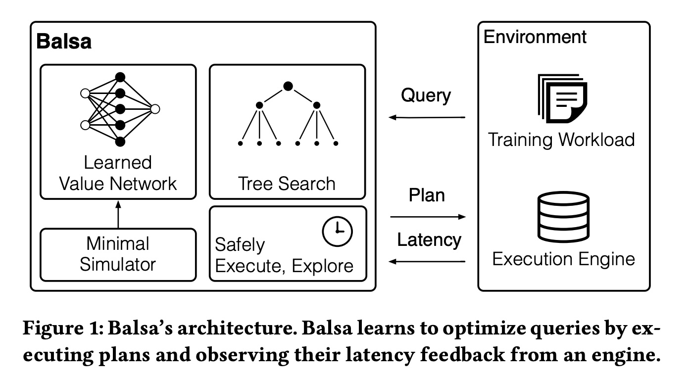
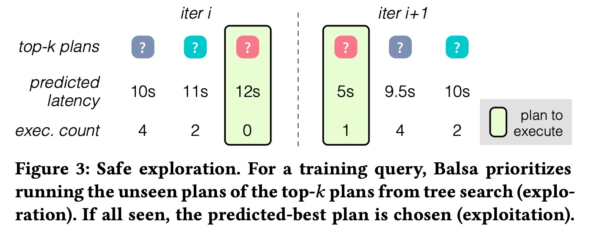
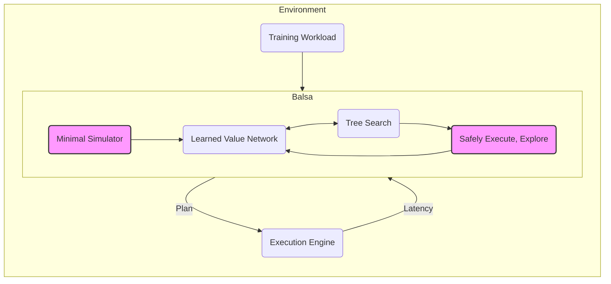
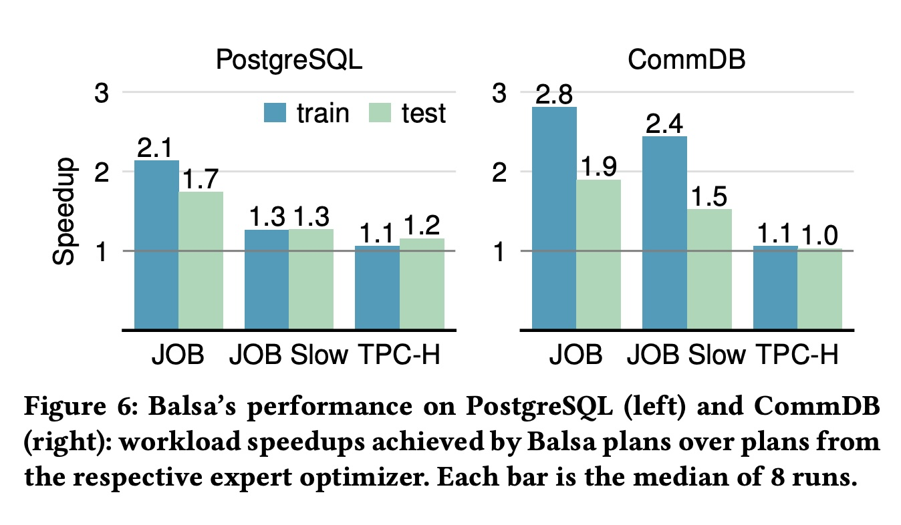
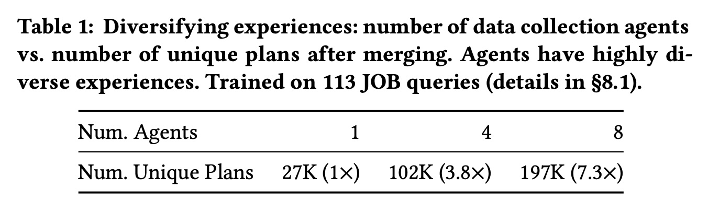

## AI论文解读 | Balsa: Learning a Query Optimizer Without Expert
        
### 作者        
digoal        
        
### 日期        
2025-10-20        
        
### 标签        
PostgreSQL , PolarDB , DuckDB , AI , 论文解读        
        
----        
        
## 背景  
      
https://arxiv.org/pdf/2201.01441        
  
提示:          
```          
读懂《Balsa: Learning a Query Optimizer Without Expert》这篇论文需要提前掌握哪些基础知识, 请使用中文通熟易懂的讲解这些基础知识, 可以引用论文中的图、表或使用Markdown支持的图形(text,mermaid等)增加解释性. 
  
使用中文通熟易懂的解读《Balsa: Learning a Query Optimizer Without Expert》这篇论文, 其中的关键内容请着重讲解, 可以引用论文中的图、表或使用Markdown支持的图形(text,mermaid等)增加解释性. 
  
提取《Balsa: Learning a Query Optimizer Without Expert》这篇论文中的重要术语, 使用中文对这些术语进行通熟易懂的讲解, 可以引用论文中的图、表或使用Markdown支持的图形(text,mermaid等)增加解释性. 
```     
  
## 1 前置知识 
  
要读懂《Balsa》这篇论文，你需要对数据库、机器学习（特别是强化学习）和神经网络有一些基本了解。

这篇论文的核心思想是：**我们能不能让一个查询优化器“从零开始”，通过自己“试错”来学会如何优化查询，而不需要人类专家或者一个已经很牛的优化器来“教”它？** 。

下面我们来通俗地讲解你需要掌握的基础知识点：

### 1\. 数据库与查询优化器 (The Problem)

想象一下你用导航软件（比如谷歌地图）规划路线。

  * **你要做的事 (SQL 查询):** “我想从A点到B点，中间要经过C点。”
  * **数据库系统：** 就是整个导航App。
  * **执行计划 (Execution Plan):** 导航App为你规划的具体路线。比如：
      * **路线1 (好计划):** "先走高速A (10分钟)，再走国道B (20分钟)"。总共30分钟。
      * **路线2 (坏计划):** "先穿过市中心 (堵车60分钟)，再走小路C (30分钟)"。总共90分钟。
  * **查询优化器 (Query Optimizer):** 这就是导航App里的“路线规划引擎” 。它的工作是在成千上万条可能的路线（执行计划）中，找到那条“最快”（执行效率最高）的路线 。

**为什么这很难？**
传统的优化器依赖一个 **“成本模型” (Cost Model)**  ——它就像导航App里的“路况估算器”。它会根据一些统计数据（比如“这条路限速80”、“这个路口有红绿灯”）来 *估算* 走每条路线要花多少时间 。

**问题在于：**

1.  **估算不准：** 就像导航估不准堵车一样，数据库的成本模型也常常估不准一个查询到底要跑多久 。
2.  **开发太难：** 编写和维护这个“估算器”需要耗费专家数年时间 。

Balsa的目标就是 **扔掉这个需要专家手写的“估算器”** ，用机器学习来 *自动学会* 怎么选出最好的计划。

### 2\. 强化学习 (Reinforcement Learning - RL) (The Method)

Balsa的核心技术是**深度强化学习** 。

你可以把强化学习理解为“训练宠物”。

  * **智能体 (Agent):** Balsa 优化器 。
  * **环境 (Environment):** 数据库执行引擎 。
  * **状态 (State):** 当前“拼”到一半的查询计划 。比如，(A join B)
  * **动作 (Action):** 下一步怎么拼 。比如，是 ( (A join B) join C ) 还是 ( (A join C) join B )？
  * **奖励 (Reward):** 反馈。Balsa 把一个完整的计划（比如路线1）交给数据库去执行，执行完后：
      * 如果只花了0.1秒 (很快)，就给一个 **高奖励** (好样的！)。
      * 如果花了100秒 (很慢)，就给一个 **低奖励** (不行！) 。

Balsa 的学习过程就是不断地“试错”：**它尝试生成一个计划 -\> 运行它 -\> 得到反馈 (奖励) -\> 根据反馈调整自己，让自己下次更有可能做出能得高分的动作** 。

用论文中的**图1**  来看这个流程：  

1.  **Balsa** (左侧) 里的 **Tree Search (树搜索)**  负责制定一个 **Plan (计划)** 。
2.  这个 Plan 被交给 **Environment (环境)**  里的 **Execution Engine (执行引擎)**  去运行。
3.  引擎返回一个 **Latency (延迟)**  (比如 "花了0.5秒")。
4.  这个 Latency 作为“奖励”反馈给 Balsa，Balsa 用它来更新自己的“大脑”—— **Learned Value Network (学习到的价值网络)** 。


```text
       +----------+         (2) 尝试一个"计划"         +-------------+
       |  Balsa   | --------------------------------> |   数据库    |
       | (Agent)  |                                   | (Environment) |
       |          | <-------------------------------- |             |
       +----------+       (3) 返回"延迟" (奖励)        +-------------+
            ^
            |
(1) 从 "训练数据" 中拿一个 "Query"
            |
   +-------------------+
   | Training Workload |
   +-------------------+
```

### 3\. 神经网络与价值网络 (The "Brain")

强化学习的“大脑”是怎么工作的？Balsa 用的是一个**神经网络 (Neural Network)**，在论文里它被称为 **“价值网络” (Value Network)** 。

  * **什么是神经网络？** 你可以把它想象成一个非常复杂的函数，你给它输入，它给你输出。通过“训练”，它可以学会任何复杂的模式。
  * **Balsa 的“价值网络”是干嘛的？**
      * **输入：** 一个查询 + 一个 *拼到一半* 的计划（比如 (A join B) ） 。
      * **输出 (预测)：** “**从这个半成品出发，我能得到的 *最好* 的总延迟是多少？**” 。

这个“价值网络”就像一个经验丰富的棋手，看一眼当前的棋局（状态），就能估算出“这局赢面大不大”（价值）。

当 Balsa 需要做“动作”（比如下一步是 join C 还是 join D）时，它会分别问一下“价值网络”：

  * 如果我 join C，你估计最后总延迟是多低？
  * 如果我 join D，你估计最后总延迟是多低？

然后 Balsa 会选择那个网络预测的“总延迟最低”的动作。

### 4\. 模拟到现实 (Sim-to-Real) (The Key Challenge)

这是理解 Balsa 最关键的知识点之一。

**强化学习的独特挑战：** 在下棋或玩游戏时，一个“坏动作”顶多就是“这局输了”，然后马上可以开下一局 。

但在数据库里，一个“坏计划”可能会**跑几个小时都跑不完**！。如果 Balsa 刚开始学习时，不幸选了这么一个计划，那它的整个学习过程就会被“卡死”，因为它一直在等那个永远也跑不完的查询反馈结果 。

**Balsa 的解决方案：两阶段学习**

**阶段 1：在“模拟器”里学 (Bootstrapping from Simulation)** 

  * Balsa 不一上来就去碰“真实”的数据库。它先在一个 **“最小模拟器” (Minimal Simulator)**  里练习。
  * 这个模拟器是一个非常非常简单的成本模型（论文里叫 $C_{out}$ ），它不真的跑查询，只是飞快地 *估算* 一个成本 。
  * **目标：** 这个模拟器虽然不准，但它足以教会 Balsa 避免那些“灾难性”的坏计划 (比如“把两个10亿行的大表先做连接”) 。这就像飞行员先在飞行模拟器上练习，至少学会了“别一头栽到地上”。

**阶段 2：在“真实环境”中学 (Learning from Real Execution)** 

  * 在模拟器里“毕业”后，Balsa 才开始在真实的数据库上训练 。
  * **安全措施 (Safe Execution)：** 为了防止被“卡死”，Balsa 引入了 **“超时” (Timeouts)** 机制 。
      * 比如 Balsa 知道查询 Q 之前 *最快* 跑完过 10 秒钟。
      * 这次它尝试了一个新计划，如果这个计划跑了 11 秒还没跑完，Balsa 就会**强制终止 (timeout)** 它 。
      * Balsa 会给这个被终止的计划一个很差的“奖励”，告诉自己：“这条路不通，以后别试了” 。
      * 随着学习的进行，这个“超时”时间会越来越短（因为 Balsa 找到的最好计划越来越快）。

### 总结：你需要的基础知识

1.  **数据库基础：** 知道 SQL 是什么，知道数据库为了执行 SQL 会生成一个叫“执行计划”的东西，而“查询优化器”就是用来找最好的“执行计划”的。
2.  **强化学习 (RL)：** 知道 Agent (智能体)、Environment (环境)、Action (动作)、Reward (奖励) 这个基本循环。
3.  **神经网络：** 知道它是一个“黑盒”，可以通过数据训练来学习复杂的预测（比如 Balsa 用的“价值网络”，就是用来预测“这个计划有多好”的）。
4.  **Sim-to-Real (可选但重要)：** 知道在“模拟器”里训练便宜但“不真”，在“现实”中训练“真”但昂贵且危险。Balsa 结合了两者，先“模拟”再“现实”，并用“超时”来保证安全。

如果你理解了“**Balsa 是一个像训练宠物一样的强化学习智能体，它的大脑是个神经网络，它先在模拟器里学会基本功，然后再到真实的数据库上用‘超时’机制安全地‘试错’，最终学会了如何比专家还快地规划路线**”，你就抓住了这篇论文的精髓。
  
## 2 解读论文 
  
这是一篇开创性的数据库论文，它展示了一种全新的、“白手起家”的构建数据库“大脑”（查询优化器）的方法。

通俗来说，这篇论文的核心思想是：**我们能否让一个查询优化器像 AlphaGo 一样，通过“自我试错”和“强化学习”，从零开始学会如何高效执行 SQL 查询，而完全不需要人类专家或现有的优化器来“指导”它？** 。

答案是：**可以**。论文提出的 **Balsa**  不仅做到了，而且在短短几小时的“自我训练”后，其性能甚至超越了那些由专家花费数年时间精心打造的顶级商业和开源数据库优化器 。

下面我们将深入解读 Balsa 是如何解决这个核心难题的。

### 1\. 核心问题：为什么从零学习优化器这么难？

传统的查询优化器（Query Optimizer）是数据库的“大脑”，负责将用户写的 SQL 查询（“你要什么”）转换成一个高效的执行计划（“具体怎么做”）。这个“大脑”非常难构建，需要专家花费数年时间去编写和调优 。

如果我们想用强化学习（RL）来自动学习：

  * **Agent (智能体)**：就是 Balsa 优化器。
  * **Action (动作)**：构建查询计划的每一步（例如：先连接 A 和 B，再连接 C）。
  * **Reward (奖励)**：执行这个计划所花费的时间（越短越好）。

这里就遇到了一个**致命的挑战：“灾难性计划” (Disastrous Plans)**。

在下棋时，一个“坏动作”顶多让你“输掉这局棋”，几分钟后就可以开始下一局。但在数据库中，一个“坏计划”可能会比“好计划”慢上**数千倍甚至数万倍** 。

如果 Balsa 在学习初期（像个新手）随机尝试了一个“灾难性计划”，它可能需要**运行几个小时甚至几天**才能得到一个“坏”的反馈。这将导致学习过程被完全卡死，无法取得任何进展 。

### 2\. Balsa 的三大核心技术：如何安全高效地“试错”

Balsa 之所以能成功，关键在于它设计了一套机制，**既能大胆尝试，又不会被“灾难性计划”卡死**。这套机制可以分为三个步骤：

#### 关键内容 1：从“模拟器”起步 (Bootstrapping from Simulation)

Balsa 不会一上来就在真实的数据库上“瞎试”。它采用了一种“模拟-到-现实” (Sim-to-Real) 的策略 。

**第 1 阶段：在模拟器中“军训”** 

  * Balsa 首先在一个 **“最小模拟器” (Minimal Simulator)** 中进行快速训练 。
  * 这个模拟器本质上是一个非常简单、通用的成本模型（ 论文中称为 $C_{out}$ ），它不真正执行查询，只是根据数据的“大小”（基数）快速估算一个成本 。
  * **目的：** 这个模拟器的估算*不需要*很准确 。它的唯一目标是教会 Balsa 区分“还行的计划”和“绝对的灾难” 。

如下图所示，这个模拟器就像一个“粗筛子”，Balsa 通过它迅速学会了如何避免那些最离谱的计划。

```text
       (所有可能的计划)
             |
             V
+---------------------------+
|      最小模拟器 (粗筛)      |  (目标: 快速识别灾难性计划)
|  (例如: 成本估算 > 10^12)  |  
+---------------------------+
             |
             V
  (过滤掉 99% 的灾难性计划)
             |
             V
   (进入下一阶段的“候选计划”)
```

通过这个阶段，Balsa 获得了“基本常识”，为进入真实环境打下了基础 。

#### 关键内容 2：用“超时”安全执行 (Safe Execution via Timeouts)

**第 2 阶段：在真实环境中“实战”** 

当 Balsa 具备基本常识后，它开始在真实的数据库引擎上执行计划，并获取 **真实的延迟（Latency）** 作为反馈 。

为了解决在“实战”中仍可能遇到的慢查询，Balsa 引入了 **“安全执行” (Safe Execution) 机制，其核心是动态超时 (Timeouts)** 。

  * Balsa 会记录针对*同一个查询*，它目前找到的 **“历史最佳成绩” (best latency so far)** 。
  * 当它尝试一个新计划时，它会设置一个超时时间（比如：历史最佳成绩的 2 倍）。
  * **如果新计划超时了：** Balsa 会立即**终止 (kill)** 这个查询 ，并给它一个极差的“惩罚” 。这既节省了时间，也让 Balsa 学会了“此路不通”。
  * **如果新计划没超时且更快：** Balsa 就更新“历史最佳成绩”，**这个“超时”标准会自动收紧 (tightened)** 。

这个机制非常巧妙，它创造了一个 **“自动进阶的学习课程” (implicit learning curriculum)** ：Balsa 总是在自己“历史最佳”的基础上寻求小小的突破，既保证了安全（不会被卡死），又确保了效率（总在挑战更优解）。

#### 关键内容 3：在“安全区”内探索 (Safe Exploration)

强化学习不仅要“利用” (Exploit) 已知的最好策略，还要“探索” (Explore) 未知的新可能，以防陷入局部最优 。

  * **问题：** 随机探索 = 灾难性计划 。
  * **Balsa 的方案：安全探索 (Safe Exploration)** 。

Balsa 利用其“大脑”（价值网络）和“树搜索”  (见图 1)，一次性生成 **k 个“预测下来还不错的”计划**（比如 k=10）。    

然后，Balsa 会在**这 k 个“优等生”中，优先选择那个“它以前没执行过的” (unseen)** 计划来执行 。

如论文**图 3** 所示 (下图为示意)：    

  * 在第 $i$ 代，Balsa 预测出 Top 3 计划，延迟分别是 10s, 11s, 12s。
  * 它发现 12s 的计划没试过 (exec. count = 0)，于是它会 **“探索”** 这个 12s 的计划 。
  * 在第 $i+1$ 代，它预测的 Top 3 计划都试过了 (exec. count \> 0)。
  * 此时它会 **“利用”**  (exploitation)，选择预测最快的 9.5s 的计划 。

这个方法确保了 Balsa 的“探索”始终发生在一个由“大脑”筛选过的 **“安全信任区” (trust region)** 内 ，从而避免了随机探索的巨大风险。

### Balsa 的架构与学习流程 (图 1 解读)    

论文的**图 1**  完美总结了 Balsa 的工作流程：



  * **Environment (环境)**：右侧是数据库环境，Balsa 从“训练负载 (Training Workload)”  中获取查询 (Query) 。
  * **Balsa (智能体)**：
    1.  **Learned Value Network (大脑)** ：这是 Balsa 的“大脑”，一个神经网络，用于评估计划的好坏 。
    2.  **Tree Search (规划器)** ：Balsa 使用“大脑”的评估，通过搜索来构建一个具体的“计划 (Plan)” 。
    3.  **Plan -\> Latency**：计划被交给“执行引擎 (Execution Engine)”  运行，并返回一个“延迟 (Latency)” 。
  * **核心学习循环**：
    1.  **模拟起步**：“最小模拟器 (Minimal Simulator)”  先对“大脑”进行初步训练 。
    2.  **安全试错**：“安全执行/探索 (Safely Execute, Explore)”  模块负责接收“延迟”反馈，并应用“超时”和“安全探索”策略 ，然后用这个真实的反馈更新“大脑” 。
    3.  Balsa 的“大脑”就这样在“模拟预训练 + 真实安全试错”中不断迭代变强。

### 关键成果：Balsa 真的有效吗？

**非常有效！**

论文的**图 6**  展示了 Balsa 在两个数据库（PostgreSQL 和一个匿名商业数据库 CommDB）上的最终性能：    

  * **图 6（左，PostgreSQL）** ：在 JOB（一个极具挑战性的基准测试 ）上，Balsa 最终生成的计划在**训练集上快 2.1 倍，在未见过的测试集上快 1.7 倍** 。
  * **图 6（右，CommDB）** ：Balsa 的优势更明显，在训练集上快 **2.8 倍**，测试集上快 **1.9 倍** 。

更重要的是，Balsa 达到或超过专家性能所需的时间非常短。在 JOB 上，Balsa 仅用约 **2 小时**的训练就追平了 PostgreSQL 的专家优化器 。

### 总结：Balsa 的贡献与意义

《Balsa》这篇论文的真正意义在于，它**推翻了“构建高性能优化器必须依赖专家”这一基本假设** 。

它证明了，通过巧妙地结合 **模拟训练（用于打基础）** 、**安全执行（用于防卡死）和安全探索（用于找最优）** ，一个机器学习系统完全有能力“从零开始”，自动学习成为一个世界级的查询优化器。

这为未来自动驾驶的数据库系统（Self-Driving Databases）铺平了道路，使得为新型硬件或新型数据系统（目前还没有专家优化器）自动构建高性能“大脑”成为可能 。
  
## 3 术语 
  
好的，这篇名为《Balsa: Learning a Query Optimizer Without Expert Demonstrations》的论文介绍了一种无需专家演示即可学习的查询优化器。以下是其中一些重要术语的通俗化中文讲解：

### 1\. 查询优化器 (Query Optimizer)

查询优化器是所有数据库系统中的一个性能关键组件 。当你向数据库发出一个查询请求时（例如，从多个表中查找符合特定条件的数据），优化器会负责将这个声明式的查询请求转换成一个高效的执行计划 。

  * **通俗比喻**：想象一下你要从A地到D地，可以有很多条路线。查询优化器就像一个智能导航系统，它会分析所有可能的路线（执行计划），并利用它所掌握的交通状况信息（数据统计信息），为你推荐一条最快、最省事的路线 。
  * **挑战**：开发这样一个“导航系统”非常复杂且昂贵，通常需要专家花费数月甚至数年时间来编写和完善 。

### 2\. Balsa

Balsa 是这篇论文提出的一个核心系统，它是一个通过**深度强化学习**构建的查询优化器 。它的最大特点是**不需要学习现有专家的优化方案**，而是通过“试错”的方式自主学习如何优化查询 。

  * **核心思想**：“Balsa”这个名字源于轻木 (Balsa wood)，寓意其轻量化，无需依赖沉重的专家知识 。
  * **学习方式**：它像一个学习下棋的AI，不断地尝试不同的“走法”（生成查询计划），然后观察每种走法的“结果”（执行查询所需的时间），并根据结果的好坏来调整自己的策略，最终学会如何走出“好棋”（生成高效的计划） 。

### 3\. 强化学习 (Reinforcement Learning - RL)

强化学习是机器学习的一个分支，也是 Balsa 学习的核心机制 。它由一个**智能体 (agent)** 和一个**环境 (environment)** 组成。智能体通过与环境的互动来学习如何完成任务 。

在 Balsa 的场景下：

  * **智能体 (Agent)**：Balsa 优化器本身 。
  * **环境 (Environment)**：数据库的执行引擎 。
  * **状态 (State)**：一个尚未完成的、部分的查询计划 。
  * **动作 (Action)**：向部分计划中添加新的操作（比如一个表连接） 。
  * **奖励 (Reward)**：一个完整计划的执行延迟（取负值，因为延迟越低越好） 。

通过这个循环，Balsa 不断尝试动作，观察奖励，并调整其决策网络，以期在未来获得更高的奖励（即更低的查询延迟） 。

### 4\. 从模拟到现实 (Simulation-to-Reality)

这是 Balsa 采用的一种两阶段学习策略，旨在解决在真实环境中学习可能遇到的“灾难性计划”问题 。在查询优化的世界里，一个坏的计划可能比最优计划慢上成千上万倍，如果一开始就直接在真实环境中尝试，学习过程可能会被这些极慢的计划卡住 。

  * **第一阶段：模拟 (Simulation)**
      * Balsa 首先在一个**模拟器**（一个非常基础的成本模型）中学习 。这个模拟器能快速地对一个计划的好坏给出一个粗略的估计（成本），而无需真正去执行它 。
      * **目的**：快速学习基础知识，学会避免那些明显糟糕的“灾难性”计划 。
  * **第二阶段：现实 (Reality)**
      * 将在模拟器中学到的知识作为“初始经验”，迁移到真实环境中进行微调 。
      * **目的**：通过在真实数据库引擎上执行查询并获取精确的延迟反馈，来学习和修正模拟知识中的不准确之处，最终产生高性能的计划 。

### 5\. 安全执行 (Safe Execution) 与 安全探索 (Safe Exploration)

这两个机制是 Balsa 在真实环境中学习时的“安全带”，用于解决学习过程中的效率和稳定性问题。

  * **安全执行 (Safe Execution)**：通过**超时 (Timeouts)** 机制实现。Balsa 会为每个查询设置一个执行超时时间，这个时间通常是该查询到目前为止所发现的最快执行时间 。如果一个新计划的执行时间超过了这个阈值，Balsa 就会提前终止它，并给它一个很差的“惩罚”分数 。这确保了学习的每一次迭代都不会因为某个糟糕的计划而无限期地等待下去，从而保证了学习过程的安全和高效 。

  * **安全探索 (Safe Exploration)**：传统的随机探索（比如随机选一个计划）在查询优化中是危险的，因为随机计划大概率很慢 。Balsa 的方法是：

    1.  首先，利用其学习到的知识生成一批（Top-k）它认为“可能不错”的计划 。
    2.  然后，在执行时，**优先选择这批计划中以前没见过的那个来执行** 。
    3.  如果这批计划都执行过了，就选择其中预测效果最好的那个（这被称为“利用”） 。

    这种方法确保了探索行为被限制在一个“值得信赖的区域”内，既能发现新计划，又避免了执行灾难性计划的风险 。下图展示了这个过程：    

    *来源: 论文图3*

      * **图解**：在第 `i` 次迭代时，Balsa 生成了3个预测延迟分别为10秒、11秒和12秒的计划。由于预测为12秒的计划执行次数为0（未见过），Balsa 会优先选择它进行探索。

### 6\. 价值网络 (Value Network)

价值网络是 Balsa 内部使用的一个神经网络，用来近似一个**价值函数** $V(query, plan)$ 。

  * **价值函数的作用**：预测当一个查询 `query` 使用了某个（可能是部分的）计划 `plan` 时，最终完成整个查询所需要的**总体延迟** 。

  * **与传统成本模型的区别**：

      * **成本模型 (Cost Model)**：评估一个给定计划本身的成本 。
      * **价值函数 (Value Function)**：着眼于未来，评估一个部分计划对完成整个查询的**最终结果**有多大好处 。

    Balsa 的整体架构如下图所示，其中“Learned Value Network”就是其核心决策组件。    

    *来源: 论文图1*

### 7\. 多样化经验 (Diversified Experiences)

这是论文提出的一种进一步提升 Balsa **泛化能力**（即优化未见过查询的能力）的方法 。

  * **问题**：单个学习的智能体可能会陷入自己的“思维定式”或“模式”中，比如特别偏爱使用某种类型的连接操作 。这可能会导致它在处理需要不同优化思路的新查询时表现不佳 。

  * **解决方法**：

    1.  独立训练多个 Balsa 智能体（使用不同的随机种子） 。
    2.  将这些智能体在学习过程中收集到的所有“经验数据”（即执行过的计划和对应的延迟）合并在一起 。
    3.  用这个合并后的、更加丰富多样的数据集来重新训练一个新的、最终的 Balsa 智能体 。

    实验数据表明，不同智能体的经验确实是高度多样化的，合并经验可以显著增加所见过的独特计划数量，从而训练出更鲁棒的模型 。    

    | Num. Agents (智能体数量) | 1 | 4 | 8 |
    | :--- | :--- | :--- | :--- |
    | **Num. Unique Plans (独特计划数量)** | 27K (1x) | 102K (3.8x) | 197K (7.3x) |

    *来源: 论文表1*

希望这些解释能帮助你更好地理解这篇论文的核心概念。
  
## 参考        
         
https://arxiv.org/pdf/2201.01441

- [《AI论文解读 | Bao: Learning to Steer Query Optimizers》](../202507/20250721_05.md)  
- https://ajinjink.github.io/posts/balsa/
- https://ajinjink.github.io/posts/bao/
- https://github.com/balsa-project/balsa
- https://rmarcus.info/blog/    
        
<b> 以上内容基于DeepSeek、Qwen、Gemini及诸多AI生成, 轻微人工调整, 感谢杭州深度求索人工智能、阿里云、Google等公司. </b>        
        
<b> AI 生成的内容请自行辨别正确性, 当然也多了些许踩坑的乐趣, 毕竟冒险是每个男人的天性.  </b>        
    
#### [期望 PostgreSQL|开源PolarDB 增加什么功能?](https://github.com/digoal/blog/issues/76 "269ac3d1c492e938c0191101c7238216")
  
  
#### [PolarDB 开源数据库](https://openpolardb.com/home "57258f76c37864c6e6d23383d05714ea")
  
  
#### [PolarDB 学习图谱](https://www.aliyun.com/database/openpolardb/activity "8642f60e04ed0c814bf9cb9677976bd4")
  
  
#### [PostgreSQL 解决方案集合](../201706/20170601_02.md "40cff096e9ed7122c512b35d8561d9c8")
  
  
#### [德哥 / digoal's Github - 公益是一辈子的事.](https://github.com/digoal/blog/blob/master/README.md "22709685feb7cab07d30f30387f0a9ae")
  
  
#### [About 德哥](https://github.com/digoal/blog/blob/master/me/readme.md "a37735981e7704886ffd590565582dd0")
  
  

  
