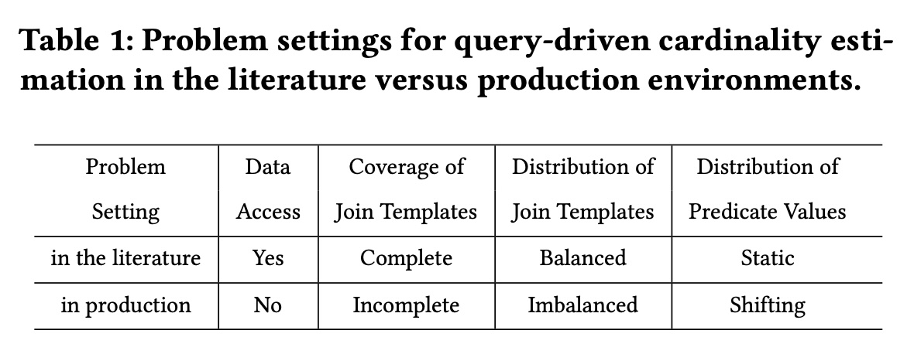
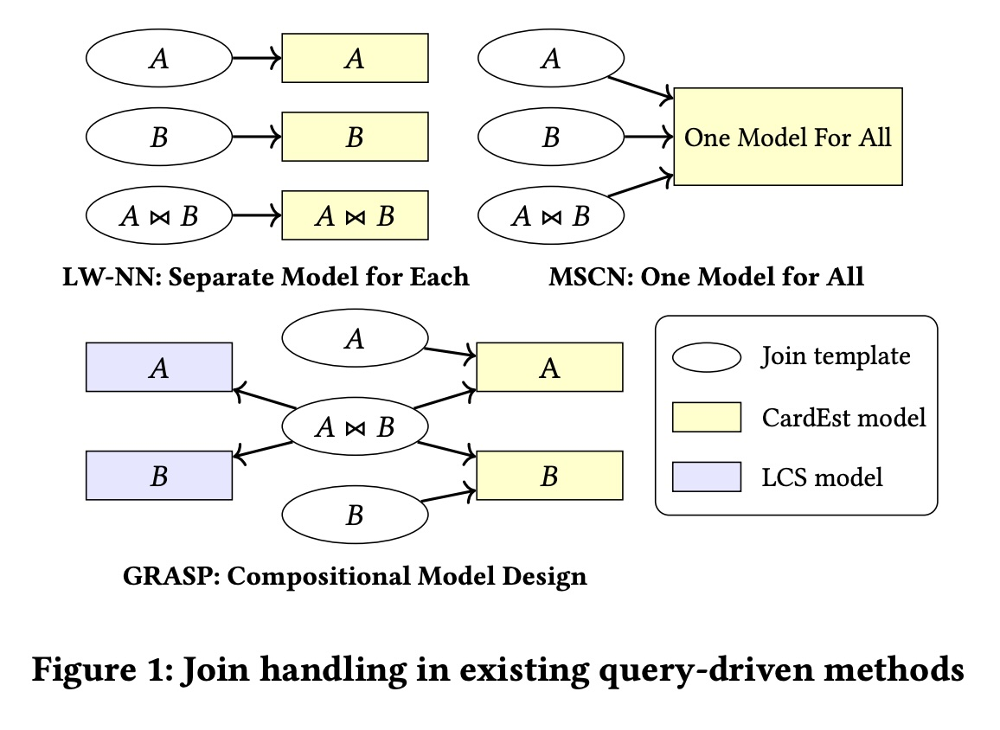
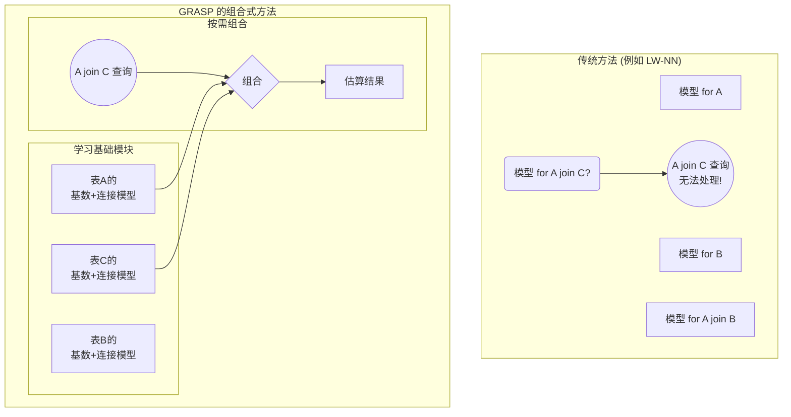
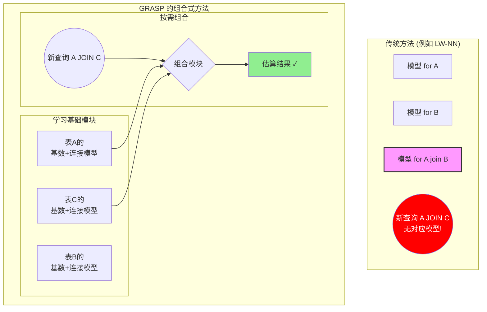
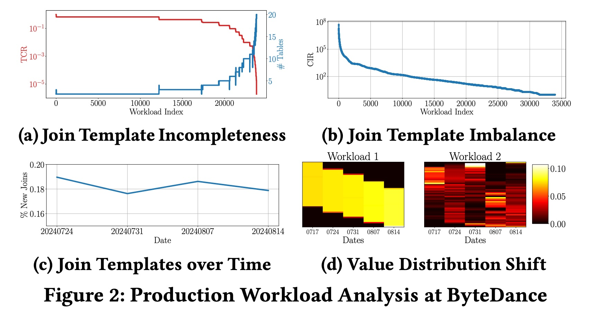
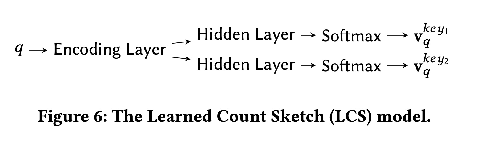

## AI论文解读 | Data-Agnostic Cardinality Learning from Imperfect Workloads
        
### 作者        
digoal        
        
### 日期        
2025-10-20        
        
### 标签        
PostgreSQL , PolarDB , DuckDB , AI , 论文解读        
        
----        
        
## 背景  
      
https://www.arxiv.org/pdf/2506.16007        
  
提示:          
```          
读懂《Data-Agnostic Cardinality Learning from Imperfect Workloads》这篇论文需要提前掌握哪些基础知识, 请使用中文通熟易懂的讲解这些基础知识, 可以引用论文中的图、表或使用Markdown支持的图形(text,mermaid等)增加解释性. 
  
使用中文通熟易懂的解读《Data-Agnostic Cardinality Learning from Imperfect Workloads》这篇论文, 其中的关键内容请着重讲解, 可以引用论文中的图、表或使用Markdown支持的图形(text,mermaid等)增加解释性. 
  
提取《Data-Agnostic Cardinality Learning from Imperfect Workloads》这篇论文中的重要术语, 使用中文对这些术语进行通熟易懂的讲解, 可以引用论文中的图、表或使用Markdown支持的图形(text,mermaid等)增加解释性. 
```     
  
## 1 前置知识 
  
好的，为了完全理解《Data-Agnostic Cardinality Learning from Imperfect Workloads》这篇论文，你需要掌握一些数据库、机器学习和特定算法的基础知识。下面我将用通俗易懂的中文为你逐一讲解，并结合论文中的图表来加深理解。

### 1\. 核心概念：什么是基数估计 (Cardinality Estimation)？

想象一下，你正在使用地图App规划一次长途旅行，你需要从A点到B点。App会为你提供多条路线，比如走高速、走国道或者穿过市区。它会告诉你哪条路最快，对吗？

**基数估计 (Cardinality Estimation, CardEst)** 就好比地图App里的“路况预测系统”。

  * **查询 (Query)**：就是你的出行需求，"从A到B"。在数据库里，就是一条SQL语句，比如 `SELECT * FROM users WHERE registration_date > '2024-01-01' AND country = 'USA';`
  * **查询计划 (Query Plan)**：就是地图App提供的不同路线。数据库为了执行你的查询，也有很多种方法，比如先按日期筛选再按国家筛选，或者反过来。
  * **基数 (Cardinality)**：就是某条路上的“车流量”。在数据库里，它指**满足一个查询条件的数据行数**。比如，上面那条查询会返回多少个符合条件的美国用户？这个数量就是基数。
  * **查询优化器 (Query Optimizer)**：就是地图App里的“路线规划引擎”。它会根据预测的“路况”（基数），选择一条成本最低、速度最快的“路线”（查询计划）。

> **为什么重要？**
> 如果基数估计错了，优化器就可能选错路。比如，它以为某条小路（使用索引）上车很少，结果车流量巨大（基数估计过低），导致整个查询变得极度缓慢。**所以，准确的基数估计是数据库高性能运行的基石** 。

-----

### 2\. 关键背景：数据不可知 (Data-Agnostic) 与不完美的工作负载 (Imperfect Workloads)

这篇论文的核心，是解决在一种非常苛刻的现实场景下的基数估计问题。

#### A. 数据不可知 (Data-Agnostic)

简单来说，就是**在不直接读取数据库里存储的数据的情况下，进行基数估计** 。想象一下，你是一个交通规划师，但你不能在路上安装摄像头或传感器来直接看车流量。你唯一能用的信息是：很多人向你查询“从A到B要多久”，并且事后会告诉你他们实际花了多长时间。

这就是“查询驱动” (Query-Driven) 的思想 。通过分析大量的`(查询, 真实基数)`对，来学习一个模型，用它来预测新查询的基数。

> **为什么需要数据不可知？**
> 论文中提到，在大公司（如字节跳动），由于数据隐私、安全规定或部门墙，负责优化数据库的团队可能无权直接访问业务数据（如用户个人信息、交易记录等）。

#### B. 不完美的工作负载 (Imperfect Workloads)

理想情况下，我们用来训练模型的数据（即过去的查询记录）是“完美”的。但现实是骨感的。论文总结了现实世界中工作负载的几个“不完美”之处，并用 **表1**  做了清晰的对比：    

| 问题设定 (Problem Setting) | 理想文献中 (In the literature) | 现实生产中 (In production) | 解释 |
| :--- | :--- | :--- | :--- |
| **数据访问 (Data Access)** | Yes | **No** | 现实中常常无法直接访问数据。 |
| **连接模板覆盖率 (Coverage of Join Templates)** | Complete (完整的) | **Incomplete (不完整的)** | 见下文解释。 |
| **连接模板分布 (Distribution of Join Templates)** | Balanced (均衡的) | **Imbalanced (不均衡的)** | 见下文解释。 |
| **查询值分布 (Distribution of Predicate Values)** | Static (静态的) | **Shifting (变化的)** | 见下文解释。 |

##### 什么是连接模板 (Join Template)？

一个“连接模板”就是指一个查询涉及了哪些表以及它们之间是如何连接的。可以理解为一张图，每个节点是一个表，边代表连接关系 。

  * **不完整 (Incomplete)**: 你的训练数据里可能只见过 `(A join B)` 和 `(B join C)` 的查询，但从未见过 `(A join C)` 或 `(A join B join C)` 的查询 。模型需要有能力泛化到这些**未曾见过**的连接组合上。

  * **不均衡 (Imbalanced)**: 在你的查询历史里，`(A join B)` 的查询出现了10000次，而 `(B join C)` 的查询只出现了10次 。这会导致模型对常见组合学得很好，对罕见组合则几乎一无所知。

  * **值分布变化 (Shifting)**: 查询的具体过滤条件在不断变化。比如，双十一期间的查询主要集中在最近一周的订单 `date > '11.04'`, 而平时则可能查询范围更广 。模型需要对这种数据分布的变化保持鲁棒性。

-----

### 3\. GRASP的核心思想：组合式设计 (Compositional Design)

为了解决上述“不完美”问题，特别是未见过的连接模板，GRASP提出了一个非常巧妙的“组合式”思想，可以类比为**搭乐高积木**。

论文中的 **图1**  直观地展示了这一点：    

  * **过去的方法 (LW-NN, MSCN)**:

      * `LW-NN`: 为每一种积木成品（A, B, A join B）都单独制作一个模具。如果来了一个新的设计（比如 A join C），就傻眼了，因为没有对应的模具 。
      * `MSCN`: 用一个超级复杂的“万能模具”来试图制造所有的成品。虽然能处理多种情况，但对未见过的设计泛化能力有限，而且容易被不均衡的数据带偏 。

  * **GRASP的方法**:

      * 不学习“成品”，而是学习“**基础积木块**”的特性。它为每个单独的表（比如A, B）都学习两种模型：
        1.  **每个表自己的基数模型 (Per-Table CardEst Model)**：预测只查询这张表时的基数。
        2.  **每个表的连接特性模型 (Per-Table LCS Model)**：描述这张表的“连接处”（Join Key）长什么样。
      * 当遇到一个新查询，比如 `A join B`，GRASP会拿出 A 和 B 的模型，把它们预测的结果**组合**起来，得到最终的基(shù)估计。




> **这种设计的好处是什么？**
> 1.  **泛化能力强**：即使没见过 `A join C`，只要有 A 和 C 的基础模型，就能把它“组合”出来，解决了**连接模板不完整**的问题 。
> 2.  **鲁棒性好**：关于表A的信息，可以从所有包含A的查询中学习（不管是 `A join B` 还是 `A join D`）。这使得知识得以共享，大大缓解了**连接模板不均衡**带来的问题 。

-----

### 4\. 关键技术细节

为了实现上述“组合式设计”，GRASP内部使用了两个关键技术。

#### A. 学习计数摘要 (Learned Count Sketch, LCS)

  * **要解决的问题**：如何描述一个表的“连接处”特性？连接操作本质上是看两个表的连接键（比如 `user.id = order.user_id`）的值是否匹配。如果连接键的值非常多（比如几百万个用户ID），直接学习它们的分布是不现实的 。
  * **解决方法**：“计数摘要 (Count Sketch)”是一种降维技术，可以把一个庞大、稀疏的分布向量（比如所有用户ID的频率分布）压缩成一个很小的、稠密的向量（比如长度只有500）。这个小向量就像是原始数据分布的“指纹”。
  * **GRASP的创新**：传统的Count Sketch需要扫描原始数据来生成，但这在“数据不可知”的设定下是不允许的。因此，GRASP设计了一个**可以从查询中学习生成这个“指纹”向量的模型**，即 `LCS Model` 。这样，通过计算两个表对应“指纹”向量的点积，就能高效地估算出它们的连接结果大小，同时又无需访问真实数据。

#### B. 自回归累积分布函数模型 (ARCDF)

  * **要解决的问题**：如何让模型对**查询值的分布变化**具有鲁棒性 ？比如，模型在训练时见的都是 `age > 20 AND age < 30` 这样的查询，测试时却来了个 `age > 50 AND age < 55` 的查询。
  * **解决方法**：不直接学习一个从`查询范围`到`基数`的映射，而是学习一个更本质的东西——**数据的累积分布函数 (Cumulative Distribution Function, CDF)** 。
      * CDF(x) 表示 `P(属性值 <= x)` 的概率。
      * 一旦知道了CDF，任何范围查询的基数都可以通过简单的减法得到。例如，`P(20 < age <= 30) = CDF(30) - CDF(20)`。
      * 这种方法更加稳健，因为它学习的是整个数据的分布曲线，而不是对特定查询点的“死记硬背”，从而能更好地泛化到未见过的查询范围 。
  * **GRASP的创新**：ARCDF通过引入**自回归模型**和**单调样条函数**，确保学习到的CDF函数是严格单调递增的（这是CDF的数学性质），解决了之前方法可能估算出负数基数的缺陷 。

### 总结

要读懂这篇论文，你需要理解：

1.  **基数估计**是数据库查询优化的核心。
2.  论文的挑战在于**数据不可知**和**工作负载不完美**（连接不完整、不均衡，值分布变化）。
3.  GRASP的核心对策是**组合式设计**：学习单表的基础模型，然后按需组合，从而获得强大的泛化能力。
4.  实现这一设计的两大技术支柱是：用 **LCS** 在不看数据的情况下高效捕捉表的连接特性，以及用 **ARCDF** 学习数据的CDF来鲁棒地处理范围查询。

掌握了这些基础知识后，你再去看论文中的具体公式、算法和实验结果，就会感到清晰很多。
  
## 2 解读论文 
  
好的，我们来一起用通俗易懂的方式解读《Data-Agnostic Cardinality Learning from Imperfect Workloads》这篇论文。

### 核心问题：在“看不见数据”和“数据不完美”的现实世界中估算查询结果数量

首先，这篇论文解决的是数据库领域一个经典且至关重要的问题——**基数估计 (Cardinality Estimation)**。简单说，就是在真正执行一条SQL查询前，预估它会返回多少行结果 。这个估算对数据库的“查询优化器”至关重要，如果估算准确，优化器就能选择最高效的执行路径，让查询飞快；如果估不准，查询可能慢如蜗牛 。

然而，现实世界的基数估计面临两大严峻挑战，这也是本文着力解决的痛点：

1.  **数据不可知 (Data-Agnostic)**：出于隐私、安全或组织规定，负责性能优化的团队往往无权直接访问数据库中的真实数据 。他们只能依赖“查询工作负载”，即一系列查询及其最终返回的真实行数 。
2.  **工作负载不完美 (Imperfect Workloads)**：从生产环境中收集到的查询记录，远非理想的训练数据。它们存在各种问题 。
  
论文中的 **表1** 非常清晰地对比了理想与现实的差距：    

| 问题设定 | 理想文献中 | **现实生产中** |
| :--- | :--- | :--- |
| 数据访问 | 可访问 | **不可访问**  |
| 连接模板覆盖率 | 完整 | **不完整**  |
| 连接模板分布 | 均衡 | **不均衡**  |
| 查询值分布 | 静态 | **变化的**  |

**关键概念解释**：

  * **连接模板 (Join Template)**：指一个查询连接了哪些表。例如，`订单表 JOIN 用户表` 就是一个模板。
  * **不完整 (Incomplete)**：训练数据里可能有很多 `订单 JOIN 用户` 的查询，但一次也没见过 `订单 JOIN 商品` 的查询。
  * **不均衡 (Imbalanced)**：`订单 JOIN 用户` 的查询出现了1万次，而 `用户 JOIN 地址` 的查询只出现了10次。
  * **变化的 (Shifting)**：今天用户主要查询近一周的数据，明天可能变成查询一年前的数据，查询的数值范围在不断变化。

现有方法在这样“束手束脚”且数据“残缺不全”的场景下，表现往往不佳 。

-----

### GRASP：像搭乐高一样解决问题的“组合式”新方法

为了应对上述挑战，论文提出了一个名为 **GRASP** 的新系统 。其核心思想是**组合式泛化 (Compositional Generalization)** ，我们可以把它理解为“搭乐高积木”。

论文中的 **图1** 直观地展示了GRASP与以往方法的区别：    

  * **传统方法 (LW-NN & MSCN)**:

      * `LW-NN`：为每一种查询模式（如`A表查询`、`B表查询`、`A JOIN B查询`）都训练一个独立的模型 。这就像为每一种乐高成品都做一个专门的模具，一旦遇到新设计（未见过的Join），就无能为力了。
      * `MSCN`：试图用一个巨大的“万能模型”来处理所有查询 。这好比一个复杂的万能模具，虽然能处理更多情况，但面对不均衡的数据时容易被带偏，泛化能力也有限。

  * **GRASP 的组合式方法**:
    GRASP不学习“最终成品”，而是学习“**基础积木块**”的特性 。它为数据库中的**每一张表**，都学习两个基础模型 ：

    1.  **每个表的基数模型 (Per-Table CardEst Model)**：预测只查询这张表时的结果行数。
    2.  **每个表的连接特性模型 (Learned Count Sketch Model, LCS)**：捕捉这张表的“连接点”（即Join Key）的分布特征，好比乐高积木块上的凸起和凹槽。

当遇到一个复杂的连接查询时，比如 `A JOIN B JOIN C`，GRASP会分别调用A、B、C三个表的基础模型，然后将它们的结果**组合**起来，估算出最终的基数 。



这种设计的巨大优势在于：

  * **强大的泛化能力**：即使从未见过 `A JOIN C` 的查询，只要有A和C的基础模型，就能估算出来，解决了**连接模板不完整**的问题 。
  * **出色的鲁棒性**：关于A表的信息可以从所有包含A的查询中学习，无论它是 `A JOIN B` 还是 `A JOIN D`。知识得以共享，有效缓解了**连接模板不均衡**的问题 。

-----

### 两大关键技术支撑

为了实现这套优雅的“乐高”体系，GRASP依赖两大核心技术：

#### 1\. 学习计数摘要 (Learned Count Sketch, LCS)

  * **目的**：在不访问数据的前提下，高效捕捉表的“连接特性” 。
  * **挑战**：连接操作依赖于连接键（如`user_id`）的数值分布。这些键的值可能有数百万甚至更多，直接学习其分布是不现实的，更何况我们还不能看数据 。
  * **LCS的解决方案**：“计数摘要(Count Sketch)”是一种数据压缩技术，能将一个庞大的数据分布压缩成一个短小的向量，就像是原始数据的“指纹” 。传统的Sketch需要扫描数据才能生成，而GRASP创新地设计了一个**能直接从查询语句中学习生成这个“指纹”向量的模型** 。这样，通过计算两个表“指纹”向量的点积，就能近似得到它们连接后的结果大小，完美绕开了数据访问的限制 。

#### 2\. 自回归累积分布函数模型 (ARCDF)

  * **目的**：解决**查询值分布变化**的问题，让模型对范围查询更鲁棒 。
  * **挑战**：如果模型训练时看到的都是 `age > 20 AND age < 30`，测试时遇到 `age > 60 AND age < 70` 可能就估不准了。
  * **ARCDF的解决方案**：它不直接学习“范围 -\> 行数”的映射，而是学习一个更本质的数学概念——**累积分布函数(CDF)** 。CDF描述了“小于等于某个值的概率”。一旦学到了CDF曲线，任何范围查询 `(a, b]` 的概率都可以通过 `CDF(b) - CDF(a)` 计算得出 。这种方法学习的是数据的整体分布规律，而非特定范围的特例，因此泛化能力更强 。ARCDF通过精巧的模型设计，保证了学习到的CDF严格单调，避免了估算出负数基数的尴尬问题 。

-----

### 实验效果：真实世界中的卓越表现

论文在三个数据集上进行了验证，其中包括一个复杂的公开基准 **CEB-IMDb-full** 和一个来自**字节跳动的真实生产业务(BD)** 。

  * **泛化能力（应对不完整）** ：在训练数据只覆盖10%连接模板的苛刻条件下，GRASP对**未见过**的连接模板的估算精度远超其他方法，甚至优于需要访问数据的PostgreSQL优化器和MSCN 。
  * **鲁棒性（应对不均衡）** ：在连接模板分布极不均衡的情况下，GRASP的估算精度依然保持稳定，显著优于其他模型 。
  * **对下游任务的提升**：更准确的基数估计带来了更好的查询计划。在复杂的CEB-IMDb-full基准上，使用GRASP估算所生成的查询计划，其端到端执行时间**比PostgreSQL快了约23%，比MSCN快了近9倍**，几乎接近使用真实基数的理想情况 。

### 结论

《Data-Agnostic Cardinality Learning from Imperfect Workloads》这篇论文直面了在真实工业环境中进行基数估计的核心痛点。它提出的GRASP系统，通过创新的**组合式设计**，并辅以**LCS**和**ARCDF**两大关键技术，巧妙地在**数据不可知**和**工作负载不完美**的双重约束下，实现了高精度、高鲁棒性的基数估计。这不仅是一个理论上的突破，更是一个经过真实场景验证、具有高度实用价值的解决方案。
  
## 3 术语 
  
好的，这是对《Data-Agnostic Cardinality Learning from Imperfect Workloads》论文中关键术语的中文解读，希望能帮助你更好地理解。

-----

### 1\. 基数估计 (Cardinality Estimation / CardEst)

  * **通俗讲解**：这是数据库的“大脑”——查询优化器——在执行一条SQL查询前，进行的一次“预估”。它要猜一下这条查询会返回多少行数据。这个“猜测”的结果就是**基数**。猜得准不准，直接决定了数据库选择的执行计划是“高速公路”还是“乡间小路”，对查询性能影响巨大 。

### 2\. 数据不可知 (Data-Agnostic)

  * **通俗讲解**：这是一种工作模式，指的是在进行基数估计时，**完全不能直接访问或查看数据库里存储的真实数据内容** 。就好像一个交通顾问，他不能在路上装摄像头看车流，只能通过分析人们的历史出行记录（查询）和最终花费时间（真实基数）来预测新路线的路况。这主要是出于数据隐私和安全的考虑 。

### 3\. 不完美的工作负载 (Imperfect Workloads)

  * **通俗讲解**：这是指从真实生产环境中收集到的，用来训练模型的查询记录（工作负载）远非理想，存在各种缺陷。论文中的**表1**清晰地总结了这些不完美之处 。    

    | 现实世界中的问题 | 中文解释 |
    | :--- | :--- |
    | **Incomplete Join Templates** (不完整的连接模板) | 训练数据里只包含了所有可能的数据表连接方式中的一小部分 。比如，系统里见过“用户表”和“订单表”的连接，也见过“订单表”和“商品表”的连接，但从未见过“用户表”和“商品表”的直接连接。模型需要具备泛化到这些**未知连接**的能力。 |
    | **Imbalanced Join Templates** (不均衡的连接模板) | 不同的数据表连接方式，在查询记录中出现的频率差异巨大 。比如，“用户-订单”连接查询有10000次，而“用户-地址”连接查询只有10次。这会导致模型“偏科”，对常见查询很准，对罕见查询则一无所知 。 |
    | **Shifting Predicate Values** (变化的查询值分布) | 查询语句中过滤条件的值是动态变化的 。例如，**图2(d)**  显示，业务系统中的ID查询可能随时间推移而集中在最新的ID段，或者用户ID的查询是随机的。模型需要适应这种数据分布的漂移 。 |

  

### 4\. 组合式设计 (Compositional Design)

  * **通俗讲解**：这是本文核心的创新思想，可以比喻为“**搭乐高积木**”。它不为每一种复杂的查询（乐高成品）单独学习一个模型，而是去学习构成查询的**基础单元（单个数据表）的特性 。然后，当遇到新查询时，再将这些基础单元的特性组合**起来，得到最终的估算结果 。

    论文的**图1**  直观地对比了GRASP与之前方法的不同：    

    ```mermaid
    graph TD
        subgraph "传统方法 (如 LW-NN)"
            A[模型 for A]
            B[模型 for B]
            A_join_B[模型 for A join B]
            A_join_C((A join C 查询<br>无法处理!))
        end

        subgraph "GRASP 的组合式方法"
            subgraph "学习基础模块"
                P_A["表A的<br>基础模型"]
                P_B["表B的<br>基础模型"]
                P_C["表C的<br>基础模型"]
            end
            subgraph "按需组合"
                New_Query((A join C 查询)) --> Combine{组合模块}
                P_A --> Combine
                P_C --> Combine --> Result[估算结果 ✓]
            end
        end
    ```

    这种设计的最大好处是，即使没见过 `A join C` 的查询，只要有A和C的基础模型，就能把它“拼”出来，从而解决了“不完整连接模板”的难题 。

### 5\. 学习计数摘要 (Learned Count Sketch, LCS)

  * **通俗讲解**：这是GRASP用来捕捉数据表“连接特性”的关键技术。
      * **背景**：数据表连接时，需要看连接键（如`user_id`）的分布。但这些键的值非常多，且我们又不能直接看数据。
      * **解决方案**：“计数摘要”是一种数据压缩技术，能把一个庞大的数据分布压缩成一个短小的向量，就像是原始数据的“**指纹**” 。
      * **GRASP的创新**：传统的摘要技术需要扫描数据来生成“指纹”。LCS模型则是一个**从查询语句中学习如何生成这个“指纹”向量**的神经网络模型 。这样，在不看数据的情况下，通过计算两个表“指纹”向量的点积，就能高效地估算出连接后的数据量 。**图6**  展示了LCS模型的架构。    

### 6\. 自回归累积分布函数模型 (ARCDF)

  * **通俗讲解**：这是GRASP中用于处理带范围查询（如`date > '2024-01-01'`）的基数模型，它对“变化的查询值分布”问题特别有效。
      * **核心思想**：它不直接学习“一个范围 -\> 多少行数据”，而是学习一个更本质的数学概念——**累积分布函数 (CDF)** 。CDF描述的是“数据值小于等于x的概率”。
      * **好处**：一旦学到了CDF这条曲线，任何范围`(a, b]`的基数都可以通过 `CDF(b) - CDF(a)` 计算得出 。这使得模型对未曾见过的查询范围具有更好的泛化能力，更加鲁棒 。
      * **GRASP的创新**：ARCDF通过自回归模型和单调样条函数，确保了学习到的CDF曲线严格单调递增，解决了之前类似方法可能估算出负数基数的缺陷 。
  
## 参考        
         
https://www.arxiv.org/pdf/2506.16007

- [《AI论文解读 | Bao: Learning to Steer Query Optimizers》](../202507/20250721_05.md)  
- https://ajinjink.github.io/posts/balsa/
- https://ajinjink.github.io/posts/bao/
- https://github.com/balsa-project/balsa
- https://rmarcus.info/blog/    
        
<b> 以上内容基于DeepSeek、Qwen、Gemini及诸多AI生成, 轻微人工调整, 感谢杭州深度求索人工智能、阿里云、Google等公司. </b>        
        
<b> AI 生成的内容请自行辨别正确性, 当然也多了些许踩坑的乐趣, 毕竟冒险是每个男人的天性.  </b>        
    
#### [期望 PostgreSQL|开源PolarDB 增加什么功能?](https://github.com/digoal/blog/issues/76 "269ac3d1c492e938c0191101c7238216")
  
  
#### [PolarDB 开源数据库](https://openpolardb.com/home "57258f76c37864c6e6d23383d05714ea")
  
  
#### [PolarDB 学习图谱](https://www.aliyun.com/database/openpolardb/activity "8642f60e04ed0c814bf9cb9677976bd4")
  
  
#### [PostgreSQL 解决方案集合](../201706/20170601_02.md "40cff096e9ed7122c512b35d8561d9c8")
  
  
#### [德哥 / digoal's Github - 公益是一辈子的事.](https://github.com/digoal/blog/blob/master/README.md "22709685feb7cab07d30f30387f0a9ae")
  
  
#### [About 德哥](https://github.com/digoal/blog/blob/master/me/readme.md "a37735981e7704886ffd590565582dd0")
  
  

  
