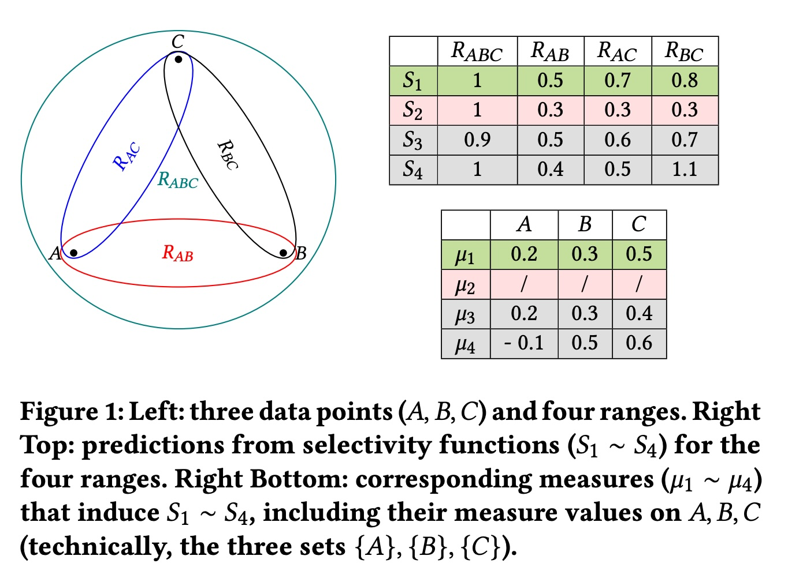
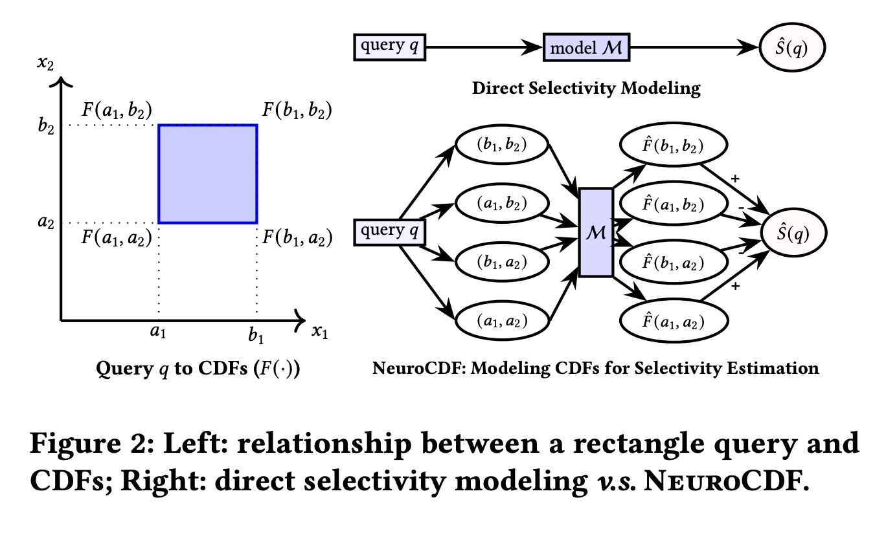
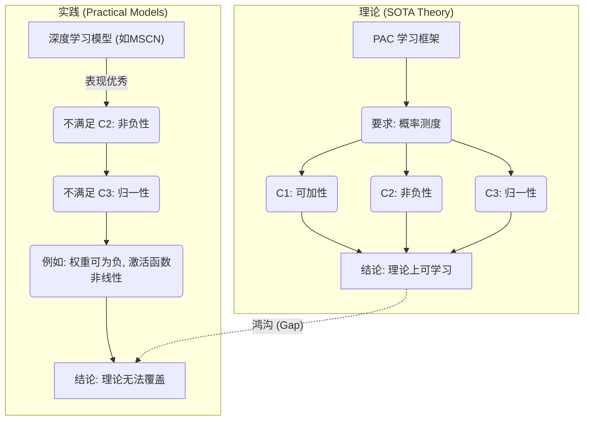
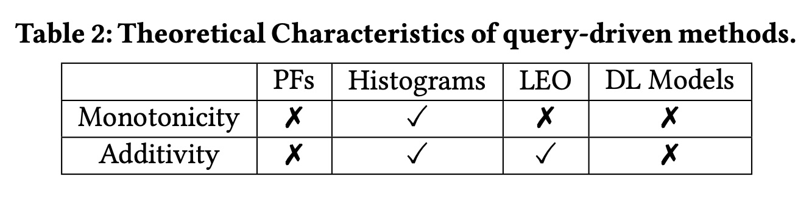
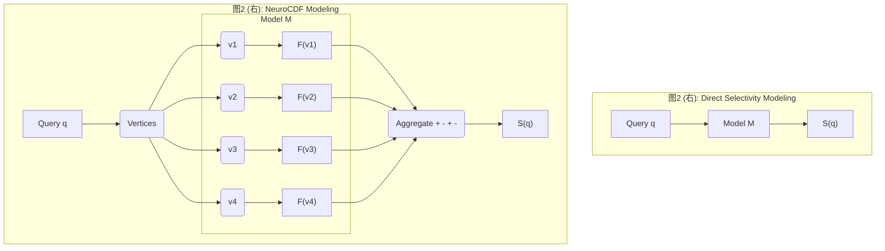
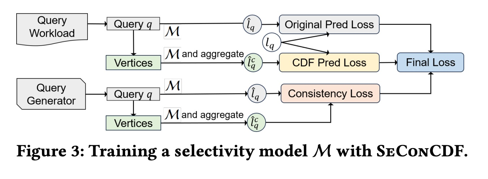
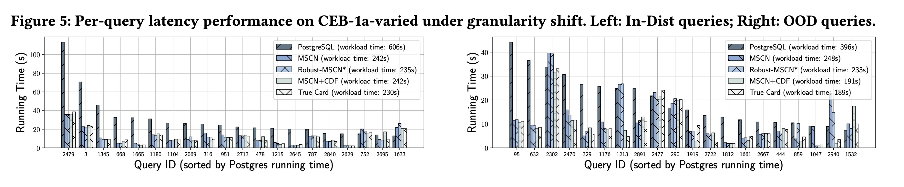
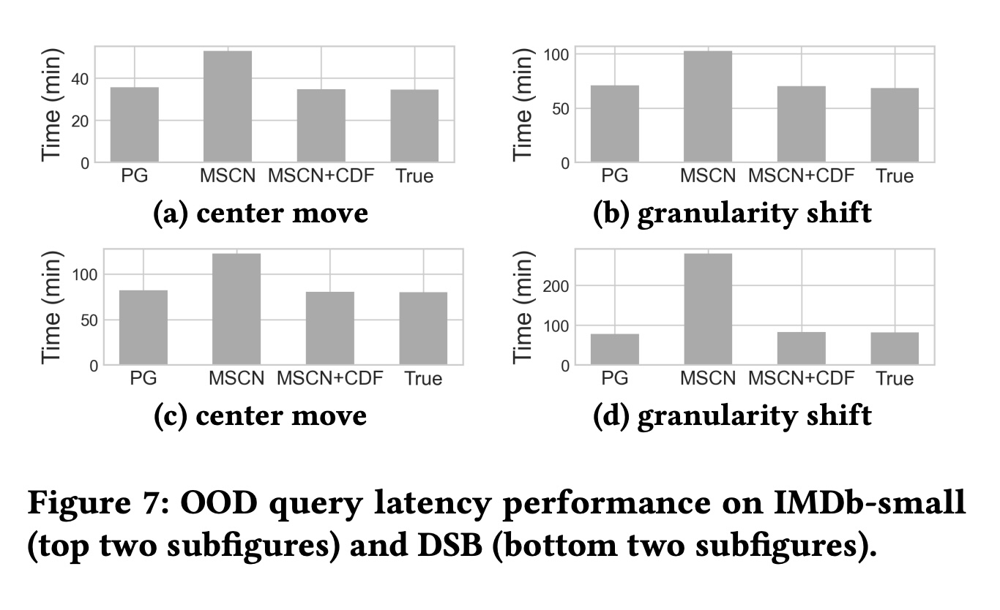
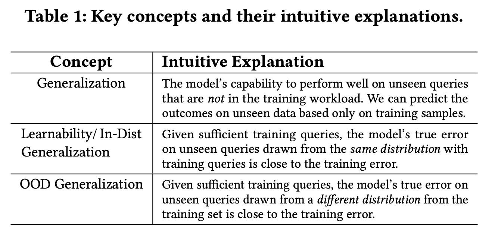
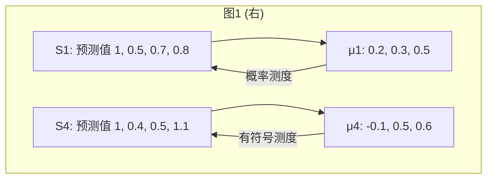

## AI论文解读 | A Practical Theory of Generalization in Selectivity Learning
        
### 作者        
digoal        
        
### 日期        
2025-10-20        
        
### 标签        
PostgreSQL , PolarDB , DuckDB , AI , 论文解读        
        
----        
        
## 背景  
      
https://arxiv.org/pdf/2409.07014        
  
提示:          
```          
读懂《A Practical Theory of Generalization in Selectivity Learning》这篇论文需要提前掌握哪些基础知识, 请使用中文通熟易懂的讲解这些基础知识, 可以引用论文中的图、表或使用Markdown支持的图形(text,mermaid等)增加解释性. 
  
使用中文通熟易懂的解读《A Practical Theory of Generalization in Selectivity Learning》这篇论文, 其中的关键内容请着重讲解, 可以引用论文中的图、表或使用Markdown支持的图形(text,mermaid等)增加解释性. 
  
提取《A Practical Theory of Generalization in Selectivity Learning》这篇论文中的重要术语, 使用中文对这些术语进行通熟易懂的讲解, 可以引用论文中的图、表或使用Markdown支持的图形(text,mermaid等)增加解释性. 
```     
  
## 1 前置知识 
  
要读懂这篇论文 (A Practical Theory of Generalization in Selectivity Learning) ，你需要一些跨越“数据库”和“机器学习理论”的基础知识。

这篇论文的核心目标是：为数据库中一个叫做“选择性估计”的老问题，建立一套更实用、更能指导实践的机器学习理论。

下面我将用通俗的语言，为你讲解需要掌握的几个关键基础知识点：

### 1. 数据库基础：什么是“选择性 (Selectivity)”？

想象一下你是一个“数据库查询优化器” (Query Optimizer) ，你的工作是制定最高效的计划去执行用户的查询请求。

* **查询 (Query):** 比如用户想知道：“数据库里所有‘年龄大于30岁’且‘住在北京’的‘男性’用户有多少？”
* **查询计划 (Query Plan):** 你有好几种执行方法：
    1.  先找出所有“男性”，再从里面筛选“大于30岁”，最后看“住在北京”的。
    2.  先找出所有“住在北京”的，再从里面筛选“大于30岁”，最后看“男性”。
    3.  ...等等。
* **选择性 (Selectivity):** 为了决定哪个计划最快，你需要估算每一步会筛选出多少数据 。这个“百分比”就是选择性。比如，“住在北京”的用户可能只占总用户的1%（选择性低），而“男性”可能占50%（选择性高）。你肯定希望先执行选择性低的步骤，这样后续步骤处理的数据量就大大减少了。

**简而言之：选择性就是对一个查询条件能过滤出多少数据（占总量的百分比）的估算** 。这个估算越准，查询计划就越优，数据库跑得就越快。

### 2. 机器学习基础：什么是“泛化 (Generalization)”？

传统的估算方法（比如直方图）经常出错 。因此，现代方法是使用机器学习 (ML) 来“学习”如何估算 。

* **模型 (Model):** 你构建一个ML模型，喂给它很多历史查询和它们的真实选择性（答案）。模型会学习这个模式，比如 `f(查询条件) -> 估算的选择性`。
* **泛化 (Generalization):** 模型的“泛化能力”  是指它在“没见过的新查询”上的表现。

这篇论文特别强调了两种泛化 ：

1.  **分布内 (In-Distribution, In-Dist):** 你用“北京地区”的查询来训练模型。现在来了一个新的、你没见过的、但*仍然是*关于“北京地区”的查询。模型能估算准吗？
2.  **分布外 (Out-of-Distribution, OOD):** 你用“北京地区”的查询来训练模型。突然，来了一个关于“广州地区”的查询（这叫“工作负载转移” ）。模型完全没见过“广州”的数据，它还能估算准吗？

**这篇论文的核心之一，就是研究 OOD 泛化能力**，因为现实世界中的查询总是变来变去的 。

### 3. 学习理论：什么是“PAC 学习”？

为了在数学上严格证明一个模型是“可学习的”，理论家们发明了 PAC 学习框架 。

* **PAC (Probably Approximately Correct):** 意思是“概率上近似正确”。
* **目标：** 它提供了一种保证：“只要你给我足够多的训练数据，我（学习算法）有*很高的概率* (Probably) 能找到一个模型，这个模型在未来新数据上的错误率*足够低* (Approximately Correct)。”
* **复杂度度量 (VC 维等):** 为了实现 PAC 学习，你需要度量模型家族的“复杂度”或“表达能力”。如果一个模型太复杂（比如能死记硬背所有答案），它就学不到东西，泛化能力会很差。
    * **VC 维 (VC Dimension):** 用于度量分类模型（是/否问题）的复杂度 。
    * **Fat-Shattering 维:** 用于度量回归模型（预测一个数值，比如选择性）的复杂度 。

**论文的出发点：** 之前的理论  使用 PAC 框架证明了选择性函数是“可学习的” ，但这个证明有很大局限性。

### 4. 核心数学工具：什么是“测度论 (Measure Theory)”？

这是理解本论文技术细节的**最关键**部分。

“测度 (Measure)” 在数学上是“测量大小”的一种推广（比如长度、面积、体积、概率）。

#### a. 概率测度 (Probability Measure)

一个“概率测度”  必须满足三个严格的条件：
1.  **C1. 可加性 (Additivity):** 两个不相交集合的大小之和，等于它们并集的大小 。
2.  **C2. 非负性 (Positivity):** 任何集合的大小都必须 $\ge 0$ 。
3.  **C3. 归一性 (Sum to unity):** 整个空间的总大小必须等于 1 。

**旧理论的局限：** 之前的理论  都假设“选择性模型”必须满足“概率测度”的所有条件 。
**现实的矛盾：** 但论文指出，很多在实践中表现*最好*的ML模型（比如深度学习模型），根本不满足 C2 和 C3 。

#### b. 有符号测度 (Signed Measure)

为了解决这个矛盾，论文引入了“有符号测度 (Signed Measure)” 。

* **定义：** “有符号测度”是一个更宽松的概念。它*只*要求满足 C1 (可加性)，但*不*要求 C2 (非负性) 和 C3 (归一性) 。
* **直观理解：** 它允许“负数”的存在。

你可以参考论文中的图1 ：    
* $S_1$ 是一个标准的“概率测度”，所有 $\mu_1$ 的值（0.2, 0.3, 0.5）都是正数，加起来等于 1 。
* $S_3$ 违反了 C3（加起来不等于1）。
* $S_4$ 违反了 C2（ $\mu_4(A) = -0.1$ 是负数 ）。
* $S_3$ 和 $S_4$ 都属于“有符号测度”。

**论文的贡献：**
1.  证明了即使模型只满足“有符号测度”（一个更弱的条件），它在*分布内* (In-Dist) 仍然是可学习的（即“泛化理论”仍然成立） 。
2.  更重要的是，证明了这类模型在*分布外* (OOD) 也具有良好的泛化能力保证 。

这就**搭起了理论和实践的桥梁**：实践中好用的模型（不满足概率测度）终于在理论上得到了（有符号测度）的泛化保证。

---

### 总结：你需要的基础知识

要读懂这篇论文，你需要：

1.  **数据库 (基础):** 知道“查询优化”和“选择性估计”是干什么的。
2.  **机器学习 (基础):** 理解“模型训练”和“泛化能力”，特别是“分布内 (In-Dist)”和“分布外 (OOD)”的区别 。
3.  **学习理论 (进阶):** 了解 “PAC 学习”框架是用来干什么的（即为“泛化能力”提供数学保证）。
4.  **测度论 (核心):** 能够区分“概率测度”和“有符号测度” 。这是理解本文核心创新的钥匙——为什么从“概率”放宽到“有符号”是至关重要的。

此外，论文还提出了一个叫 NEUROCDF  的新模型，它用到了 **CDF (累积分布函数)** 的概念，即通过计算查询范围几个顶点的 CDF 值来算出查询的选择性（如图2所示 ）。这部分也建立在测度论的基础之上。     
  
## 2 解读论文 
  
这是一篇连接“数据库理论”与“机器学习实践”的重要论文。它解决了一个长期存在的核心问题：**为什么很多先进的机器学习模型（如深度学习）在数据库的选择性估计上效果很好，但现有的理论却无法解释它们的成功，尤其是在面对未知查询（OOD）时？**

简单来说，这篇论文做了三件事：

1.  **指出现有问题：** 现有的“理论”（PAC学习）太理想化，它要求模型必须像“概率”一样完美（例如，预测值总是正数且总和为1）。但实际中好用的模型（如深度学习）根本不满足这个要求 。
2.  **提供新理论：** 论文放宽了理论假设，从严格的“概率测度”放宽到更通用的“**有符号测度**”（Signed Measure）。并基于此，首次为选择性估计提供了 **OOD泛化（分布外泛化）** 的理论保证 。
3.  **给出新方法：** 基于这个新理论，论文设计了一个名为 **SECONCDF** 的通用训练框架 ，它可以显著提升现有模型（如MSCN、LW-NN）在面对未知查询时的准确性和稳定性 。

-----

### 1\. 核心问题：理论与实践的鸿沟

在数据库中，“选择性估计”是查询优化器的灵魂 。它需要估算一个查询（比如 `SELECT * WHERE age > 30 AND city = '北京'`）能命中多少数据。估得越准，查询计划就越优，数据库跑得越快。

近年来，大家开始用深度学习来做这个估算，效果很好 。但理论研究却远远落后了。



  * **理论的局限 (Gap 1):** 如上图，SOTA（最先进的）理论基于 PAC 学习框架，它假设模型必须是“概率测度” 。
  * **实践的矛盾 (Gap 2):** 论文在 表2 和 3.6 节中分析，实际中最好用的深度学习模型（DL Models）和 LEO，都无法保证“非负性”或“可加性” 。例如，神经网络中的负权重就违反了“非负性” 。    
  * **OOD 的缺失 (Gap 3):** PAC 学习只能保证“分布内”（In-Distribution）的泛化 。也就是说，它只能保证你用“北京”的查询训练，在测试新的“北京”查询时效果好。但如果突然来了“广州”的查询（即 OOD，分布外），PAC 理论就失效了 。

### 2\. 关键洞察：从“概率测度”到“有符号测度”

为了解决这个鸿沟，论文提出了一个关键洞察：**我们不需要模型像“概率”一样完美，只需要它满足更弱的“有符号测度”！**

  * **概率测度 (Probability Measure):** 必须满足 C1 (可加性), C2 (非负性), C3 (归一性) 。
  * **有符号测度 (Signed Measure):** **只需要满足 C1 (可加性)** 。它允许预测值为负，总和也不必为 1 。

我们可以通过论文中的图1来理解这个差异：    

  * 在右下角的表格中， $S_1$ 对应的 $\mu_1$ 都是正数 (0.2, 0.3, 0.5)，且加和为 1.0。这是一个“概率测度” 。
  * $S_4$ 对应的 $\mu_4$ 中有一个 **-0.1**，这违反了 C2 (非负性) 。
  * $S_3$ 对应的 $\mu_3$ 加和为 0.9，违反了 C3 (归一性) 。
  * $S_3$ 和 $S_4$ 都属于“有符号测度” 。

实践中的深度学习模型虽然不是“概率测度”，但它们更接近“有符号测度”。

### 3\. 论文的重大理论贡献

基于“有符号测度”这个新假设，论文提供了两大理论突破：

#### 贡献一：证明“有符号测度”模型是可学习的 (Thm 4.1)

论文首先证明了，即使是“有符号测度”模型（ $S_{sgn}(C)$ ），它们的“复杂度”（fat-shattering dimension）也是有限的 。
**通俗解释：** 这意味着，只要训练数据足够多，这些模型（包括那些有负权重的深度学习模型）在“分布内”(In-Dist) 的表现一定能接近它们在训练集上的表现 。这就为深度学习模型在理论上“正名”了。

#### 贡献二：建立“分布外 (OOD) 泛化”理论 (Thm 4.2)

这是本文最核心的贡献。论文（在简化版定理4.2中）指出，在一些温和的假设下（例如训练数据覆盖了测试数据的范围）：
**如果一个“有符号测度”模型在“分布内”(In-Dist) 的误差 $\epsilon$ 很小，那么它在“分布外”(OOD) 的误差也会被 $O(\sqrt{\epsilon})$ 限制住** 。

**通俗解释：** 这是第一次有理论敢保证 OOD 的性能！它告诉我们，只要你把 In-Dist 的任务学得足够好（ $\epsilon$ 足够小 ），那么模型在面对 OOD 查询（如“广州”查询）时，表现也不会差得太离谱 。

### 4\. 从理论到实践：SECONCDF 框架

新理论（尤其是 OOD 理论）启发了论文作者设计新的训练方法。

#### 策略1：NEUROCDF (理论上的完美方案)

论文首先提出了 NEUROCDF 。

  * **思想：** 不直接学习查询 $q$ 的选择性 $\hat{S}(q)$ ，而是学习数据的累积分布函数 (CDF) $\hat{F}(x)$ 。
  * **方法：** 如图2所示，一个查询（矩形）的选择性，可以通过其 $2^d$ 个顶点的 CDF 值加加减减（包容排斥原理）得到 。    




  * **理论优势：** 这种方法（NEUROCDF）被证明 **天生就是“有符号测度”** （Thm 5.3, Cor 5.4）。因此，它自动享受前面所有的理论保证（In-Dist 和 OOD 泛化）。
  * **实践缺陷：** 这种方法在计算中可能产生负数，导致无法使用 Qerror（一种数据库中非常重要的损失函数）进行优化 。

#### 策略2：SECONCDF (实践中的智慧结晶)

为了解决 NEUROCDF 的缺陷，论文提出了 **SECONCDF (Self-Consistency with Cumulative Distribution Functions)** 。

**核心思想：** 这是一种“软约束”。我们*不*强迫模型必须是 CDF 模型，而是：

1.  **保留**原有的模型（如 MSCN）和它原有的损失函数（如 Qerror）。这能保证它在 In-Dist 上的优异性能 。
2.  **增加**一个“CDF 自洽性”的正则项（约束）。

**具体做法 (见图3)：**
在训练时，模型的总损失 (Final Loss) $\mathcal{L}$ 由三部分构成 ：    

1.  **$\mathcal{L}_{OriPred}$ (原始预测损失):** 模型 $M$ 直接预测查询 $q$ 的 selectivity，计算 Qerror 。
2.  **$\mathcal{L}_{CDFPred}$ (CDF 预测损失):** 把模型 $M$ *假装*当作一个 CDF 模型（如 NEUROCDF），用它计算出 $q$ 的几个“顶点”的 CDF，再“拼”回 selectivity，计算这部分与真实值之间的 RMSE 损失 。
3.  **$\mathcal{L}_{Consistent}$ (一致性损失):** 确保“直接预测”的结果（来自1）和“CDF拼凑”的结果（来自2）两者保持一致 。

**通俗解释：** SECONCDF 就像在训练一个学生时，不仅要求他“答对题”（ $\mathcal{L}_{OriPred}$ ），还要求他必须“用符合逻辑（CDF）的方式思考”，并且“思考过程（ $\mathcal{L}_{CDFPred}$ ）要和最终答案（ $\mathcal{L}_{OriPred}$ ）对得上”（ $\mathcal{L}_{Consistent}$ ）。

这种“自洽性”训练，迫使模型学习到了数据底层的结构（CDF），使其行为更接近“有符号测度”，从而获得了理论上的 OOD 泛化能力 。

### 5\. 实验效果：新理论的胜利

实验部分有力地证明了新理论和新方法的有效性。

  * **看图4 (Census 单表数据):**    

      * **In-Distribution (浅色柱):** 所有模型表现都不错 。
      * **Out-of-Distribution (深色柱):** LW-NN 和 MSCN（原始模型）的 RMSE（a）和 Qerror（b） **瞬间爆炸** ，说明它们完全无法处理 OOD 查询 。
      * **LW-NN-CDF 和 MSCN-CDF (使用 SECONCDF 后):** OOD 表现**极其稳定**，几乎和 In-Dist 一样好 。

  * **看表4 (IMDb-small 多表数据):**

      * **MSCN (原始):** In-Dist Qerror 中位数 1.6（很好）；OOD Qerror 中位数 **103**（灾难性）。
      * **MSCN + CDF (使用 SECONCDF 后):** In-Dist Qerror 中位数 1.9（保持优秀）；OOD Qerror 中位数 **2.0**（极大提升）。

  * **看图7 (查询延迟):**    

      * 这个实验证明了准确性真的能转化为“速度”。
      * 在 OOD 查询上 (a, b, c, d)，原始 MSCN 的估算错误导致它选择了极差的查询计划，**运行时间（Time）比数据库默认的 PostgreSQL (PG) 还要慢得多** 。
      * 而 MSCN+CDF (使用 SECONCDF 后) 的估算很准，其运行时间**恢复到了接近最优（True）的水平** 。

### 总结

这篇论文漂亮地填补了数据库选择性估计领域中“理论”与“实践”的鸿沟。它通过将理论基础从“概率测度”放宽到“有符号测度”，不仅成功解释了为什么深度学习模型有效，还首次提供了宝贵的 OOD 泛化理论保证。最后，它提出的 SECONCDF 框架是一个即插即用的实用工具，能显著增强现有模型在面对未知查询时的鲁棒性，在实验中取得了压倒性的性能提升。
  
## 3 术语 
  
以下是《A Practical Theory of Generalization in Selectivity Learning》这篇论文中的核心术语及其通俗讲解：

### 1\. 数据库与查询相关术语

#### 1.1 选择性 (Selectivity / Selectivity Functions)

  * **通俗讲解：** 指一个数据库查询条件（例如 `WHERE age > 30`）能从数据表中“筛选”出多少数据（占总数据量的百分比）。
  * **为什么重要：** 它是数据库“查询优化器”的灵魂 。优化器需要估算查询中每一步的选择性，才能制定出最高效的执行计划（比如是先按年龄筛选，还是先按城市筛选）。
  * **论文中的定义：** 对于一个数据集 D 和一个查询范围 R，选择性 $S_D(R)$ 是数据点 $x$ 落在 $R$ 范围内的概率 。

#### 1.2 查询驱动模型 (Query-driven Models)

  * **通俗讲解：** 一种估算选择性的机器学习方法 。与“数据驱动”模型（需要扫描全部原始数据 ）不同，它通过“观察”大量历史查询及其真实的查询结果（即选择性）来进行学习 。
  * **论文中的定位：** 本文主要关注查询驱动模型，因为它们通常模型更小、训练更快，且性能优异 。

### 2\. 机器学习理论术语

#### 2.1 泛化 (Generalization)

  * **通俗讲解：** 指一个机器学习模型在“没见过的、新的”数据上的表现能力 。
  * **为什么重要：** 在选择性估计中，训练时用的查询只占所有可能查询的极小部分 。因此，模型必须具备良好的泛化能力，才能准确估算那些“没在训练中见过”的新查询 。

#### 2.2 分布内泛化 (In-Distribution Generalization)

  * **通俗讲解：** 如论文表1所述 ，这指模型在测试集上的表现，前提是**测试查询和训练查询来自同一个分布** 。    
  * **举例：** 你用“北京地区”的用户查询来训练模型，然后用一批新的、没见过的、但也*仍然是*关于“北京地区”的查询来测试它。

#### 2.3 分布外泛化 (Out-of-Distribution, OOD Generalization)

  * **通俗讲解：** 论文的核心关注点。如论文表1所述 ，这指模型在测试集上的表现，但此时**测试查询来自一个与训练集不同的分布** 。
  * **举例：** 现实世界中查询负载经常变化 。
      * **查询中心移动 (Query Center Move):** 用“北京地区”的查询（例如 `age` 在 20-30 岁）训练，却去测试“广州地区”的查询（例如 `age` 在 40-50 岁）。
      * **查询粒度偏移 (Query Granularity Shift):** 用“小范围”查询（例如 `age > 20 AND age < 21`）训练，却去测试“大范围”查询（例如 `age > 20 AND age < 40`）。

#### 2.4 PAC 学习 (Probably Approximately Correct Learning)

  * **通俗讲解：** 机器学习中一套经典的、用于分析“分布内泛化”的数学框架 。
  * **论文中的定位：** 论文指出，PAC 学习是之前相关理论 [26] 的基础 。但它的**局限性**在于：它只能分析“分布内”的情况 ，无法描述和保证模型在 OOD 场景下的表现 。

### 3\. 核心数学概念：测度论 (Measure Theory)

这是理解本论文理论突破的**最关键**术语。

#### 3.1 概率测度 (Probability Measure)

  * **通俗讲解：** 一种严格的“测量”方式，类似于“概率”。它必须满足三个条件：
    1.  **C1. 可加性：** 两个不相交集合的“大小”之和，等于它们并集的“大小” 。
    2.  **C2. 非负性：** “大小”必须 $\ge 0$ 。
    3.  **C3. 归一性：** 整个空间的“总大小”必须等于 1 。
  * **理论的鸿沟：** 之前的 SOTA 理论 [26] 严格**假设**选择性模型必须是“概率测度” 。但论文指出（见表2），实际中性能最好的深度学习模型（DL Models）和 LEO，根本不满足 C2 和 C3 。   

#### 3.2 有符号测度 (Signed Measure)

  * **通俗讲解：** 这是本文理论的核心。它是一种更宽松的“测量”方式，它**只要求满足 C1 (可加性)** 。它允许“大小”为负数（违反C2），也允许总和不为1（违反C3） 。
  * **举例：** 论文中的图1（右下表）：    
      * $S_1$ 对应的 $\mu_1$ 是“概率测度”（值 0.2, 0.3, 0.5 都是正数，和为1）。
      * $S_4$ 对应的 $\mu_4$ 是“有符号测度”，因为它包含了 **-0.1** ，违反了 C2 非负性 。
  * **论文的贡献：** 论文的第一个理论突破就是证明了，即使模型是“有符号测度”（而不是“概率测度”），它们也是可学习的（即“分布内泛化”有保证）。

#### 3.3 由测度归纳/诱导 (Induced by a measure)

  * **通俗讲解：** 指一个选择性估算模型 $\hat{S}$ 的行为，可以用一个（概率或有符号）测度 $\mu$ 来完整描述 。即对于任何查询 $R$ ，模型的预测值 $\hat{S}(R)$ 刚好等于测度 $\mu(R)$ 的值 。
  * **论文中的图示：**




  * 如图1所示， $S_1$ 是由“概率测度” $\mu_1$ 归纳的 。 $S_4$ 是由“有符号测度” $\mu_4$ 归纳的 。而 $S_2$ 甚至不满足可加性，无法由任何有符号测度归纳 。

### 4\. 论文提出的新方法

#### 4.1 NEUROCDF

  * **通俗讲解：** 论文基于新理论提出的一个模型范式 。
  * **工作原理：** 它不直接学习 $\hat{S}(q)$ ，而是用神经网络去学习数据的**累积分布函数 (CDF)** 。
  * **图示（见论文图2）：** 传统模型是 `Query q -> Model M -> S(q)` 。NEUROCDF 则是将查询 $q$ 拆解为其所有顶点 (vertices)，分别扔给模型 $M$ 得到各自的 CDF 值，最后通过加减法（包容排斥原理）组合成最终的选择性 $\hat{S}(q)$ 。   
  * **理论优势：** 论文证明，这种 CDF 建模方式**天生就是“有符号测度”** 。因此，它自动享受本文提出的（包括 OOD 在内的）泛化理论保证 。

#### 4.2 SECONCDF (CDF 自洽性)

  * **通俗讲解：** 一个通用的**训练框架**，全称是“与学习到的CDF保持自洽性” (Self-Consistency with the learned Cumulative Distribution Functions) 。
  * **为什么需要它：** NEUROCDF 是一种“硬约束”，但在实践中有限制（比如不能很好地使用 Qerror 损失函数 ）。
  * **工作原理（见论文图3）：** SECONCDF 是一种“软约束” 。    
    1.  它保留了原有的模型 $M$ 和原有的损失（如 Qerror）。
    2.  它额外增加了一个“CDF 自洽性”损失 。这个损失要求模型的“直接预测值”必须和它“通过CDF推算出的值”保持一致 。
  * **效果：** 这种训练方式迫使模型学习到底层的数据结构，使其行为更接近“有符号测度”，从而在不牺牲原有优势（如使用Qerror）的同时，极大提升 OOD 泛化能力 。
  
## 参考        
         
https://arxiv.org/pdf/2409.07014

- [《AI论文解读 | Bao: Learning to Steer Query Optimizers》](../202507/20250721_05.md)  
- https://ajinjink.github.io/posts/balsa/
- https://ajinjink.github.io/posts/bao/
- https://github.com/balsa-project/balsa
- https://rmarcus.info/blog/    
        
<b> 以上内容基于DeepSeek、Qwen、Gemini及诸多AI生成, 轻微人工调整, 感谢杭州深度求索人工智能、阿里云、Google等公司. </b>        
        
<b> AI 生成的内容请自行辨别正确性, 当然也多了些许踩坑的乐趣, 毕竟冒险是每个男人的天性.  </b>        
    
#### [期望 PostgreSQL|开源PolarDB 增加什么功能?](https://github.com/digoal/blog/issues/76 "269ac3d1c492e938c0191101c7238216")
  
  
#### [PolarDB 开源数据库](https://openpolardb.com/home "57258f76c37864c6e6d23383d05714ea")
  
  
#### [PolarDB 学习图谱](https://www.aliyun.com/database/openpolardb/activity "8642f60e04ed0c814bf9cb9677976bd4")
  
  
#### [PostgreSQL 解决方案集合](../201706/20170601_02.md "40cff096e9ed7122c512b35d8561d9c8")
  
  
#### [德哥 / digoal's Github - 公益是一辈子的事.](https://github.com/digoal/blog/blob/master/README.md "22709685feb7cab07d30f30387f0a9ae")
  
  
#### [About 德哥](https://github.com/digoal/blog/blob/master/me/readme.md "a37735981e7704886ffd590565582dd0")
  
  

  
