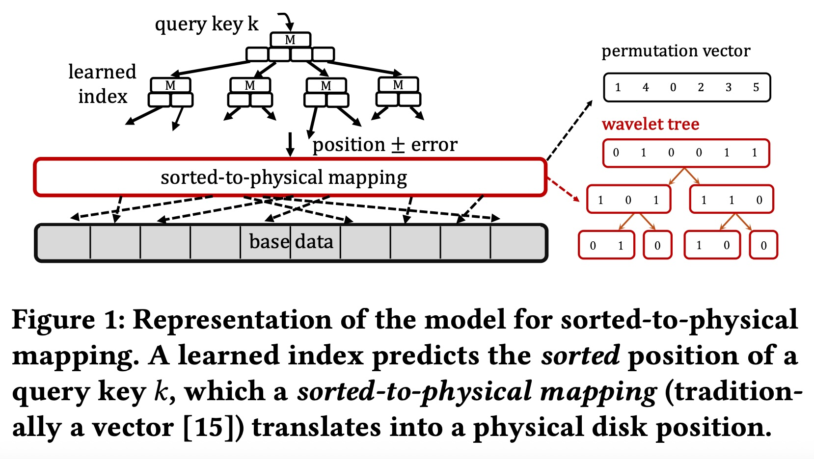
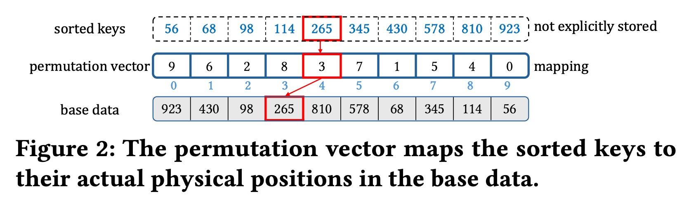
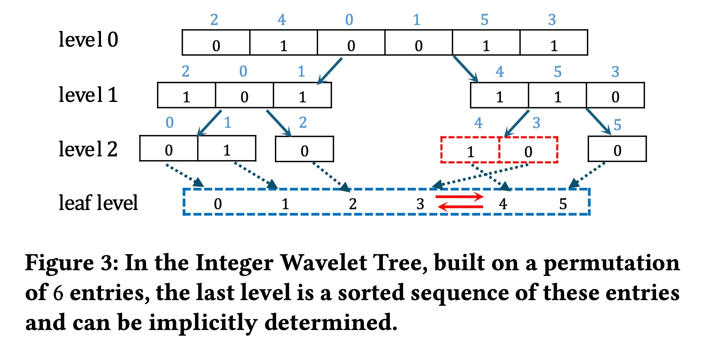
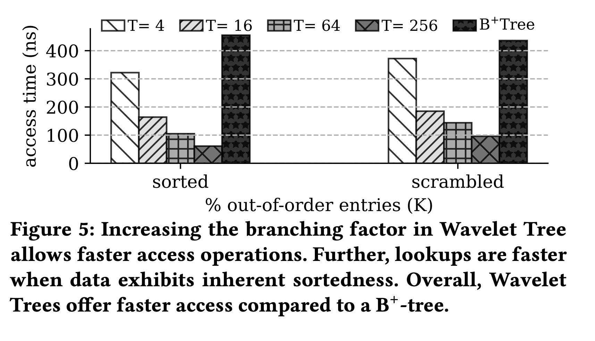
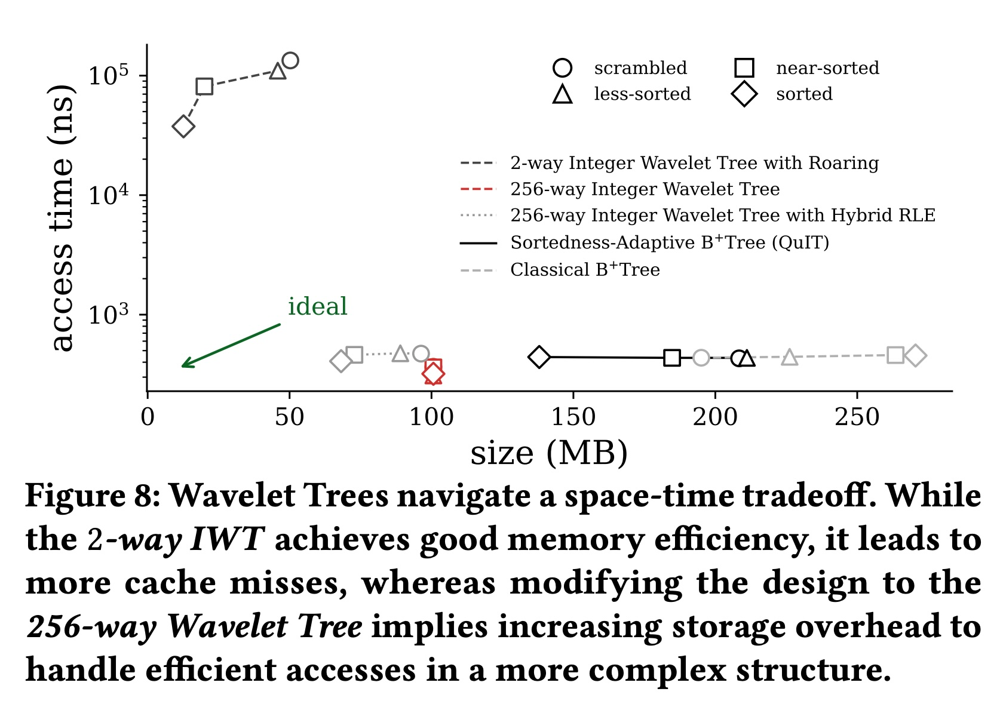
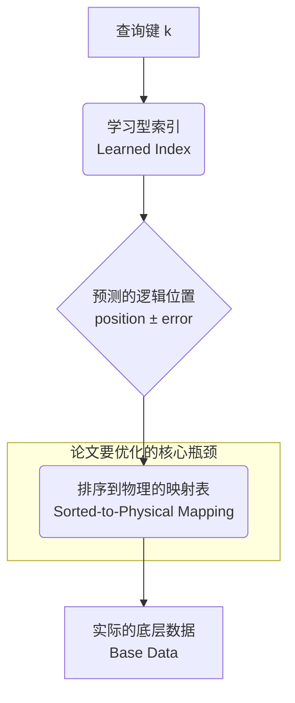
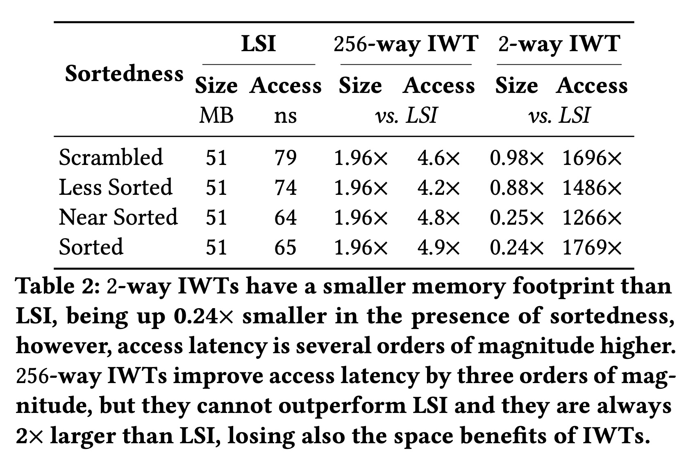
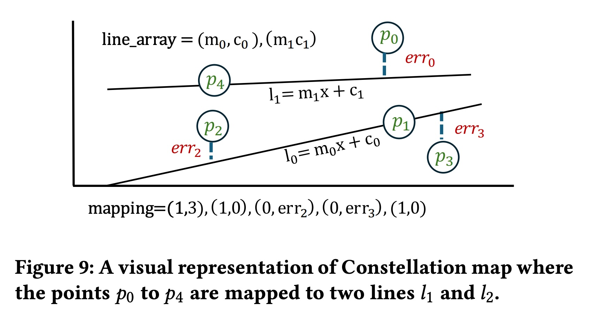
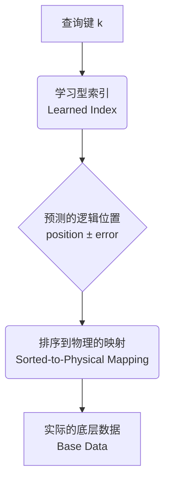

## AI论文解读 | Exploring Wavelet Trees as Space-Efficient Physical-to-Sorted Mapping for Learned Indexes
        
### 作者        
digoal        
        
### 日期        
2025-10-20        
        
### 标签        
PostgreSQL , PolarDB , DuckDB , AI , 论文解读        
        
----        
        
## 背景  
      
https://www.vldb.org/2025/Workshops/VLDB-Workshops-2025/AIDB/AIDB25_10.pdf        
  
提示:          
```          
读懂《Exploring Wavelet Trees as Space-Efficient Physical-to-Sorted Mapping for Learned Indexes》这篇论文需要提前掌握哪些基础知识, 请使用中文通熟易懂的讲解这些基础知识, 可以引用论文中的图、表或使用Markdown支持的图形(text,mermaid等)增加解释性. 
  
使用中文通熟易懂的解读《Exploring Wavelet Trees as Space-Efficient Physical-to-Sorted Mapping for Learned Indexes》这篇论文, 其中的关键内容请着重讲解, 可以引用论文中的图、表或使用Markdown支持的图形(text,mermaid等)增加解释性. 
  
提取《Exploring Wavelet Trees as Space-Efficient Physical-to-Sorted Mapping for Learned Indexes》这篇论文中的重要术语, 使用中文对这些术语进行通熟易懂的讲解, 可以引用论文中的图、表或使用Markdown支持的图形(text,mermaid等)增加解释性. 
```     
  
## 1 前置知识 
  
你好！要完全理解这篇论文《Exploring Wavelet Trees as Space-Efficient Physical-to-Sorted Mapping for Learned Indexes》，你需要先掌握几个核心的计算机科学概念。

这篇论文的核心是关于**数据库索引**的。简单来说，索引就像一本书的目录，能帮你快速找到你想要的数据，而不用一页一页地翻（即“全表扫描”）。

我将为你通俗地讲解理解这篇论文所需的 6 个关键基础知识：

1.  **经典索引：B+树 (B+-tree)**
2.  **AI 索引：学习型索引 (Learned Index)**
3.  **核心问题：排序到物理的映射 (Sorted-to-Physical Mapping)**
4.  **论文方案：小波树 (Wavelet Tree)**
5.  **关键权衡：空间 vs. 时间 (附带：缓存未命中)**
6.  **核心概念：数据有序性 (Data Sortedness)**

---

### 1. 经典索引：B+树 (B+-tree)

* **这是什么？**
    这是目前数据库中**最常用**的一种索引结构 。你可以把它想象成图书馆里一种非常高效的“多层目录”。

* **怎么工作？**
    它是一种平衡树。你从顶层（根节点）开始查找，每个节点都会告诉你下一步该往哪一层、哪个方向走（比如“A-F 在左边”，“G-M 在中间”，“N-Z 在右边”）。你不断“向下”查找，直到到达最底层的“叶子节点”，那里存储着排好序的数据或指向数据的指针 。

* **优点：** 查找、插入、删除都很快，非常可靠。查找速度是“对数时间” ( $log N$ ) ，比“线性时间” ( $N$ ) 快得多。
* **缺点：** 它不关心数据长什么样（数据分布）。无论你的数据是 `1, 2, 3, 4, 5...` 还是 `1, 100, 500, 999...`，它都用同样的方式去构建索引，这可能导致空间浪费 。

### 2. AI 索引：学习型索引 (Learned Index)

* **这是什么？**
    这是近几年提出的“AI 索引”。它用一个（或多个） **机器学习模型**来替代 B+树的内部节点 。

* **怎么工作？**
    它相信数据是有“规律”的（即数据分布）。
    * **举个例子：** 假设你的数据是 `[10, 20, 30, 40, ..., 1000]`。
    * **B+树：** 会建立一个树形结构来帮你找到，比如 `500`。
    * **学习型索引：** 它会“学习”到一个**函数**，比如 $f(key) = key / 10$ 。当你查询 `500` 时，它直接**预测** $f(500) = 50$ ，告诉你数据大概在第 50 个位置 。

* **优点：** 预测非常快（接近“常数时间”），而且模型本身可能比 B+树的内部节点占用更少的空间 。
* **缺点（论文要解决的）：** 模型预测的是“逻辑位置”（比如“第 50 个”），但它不知道这个数据在硬盘上的“物理位置”。

### 3. 核心问题：排序到物理的映射 (Sorted-to-Physical Mapping)

这正是论文的**核心挑战**。

* **这是什么？**
    学习型索引（Learned Index）为了能准确预测，它需要数据是“逻辑上”排序的 。但数据在硬盘上的实际存储（物理位置）通常是乱序的 。

* **论文图 1 和图 2 的解释：**
    * **图 1** 展示了整个流程：    
        1.  你给出一个 `query key k` (要查的键) 。
        2.  `learned index` (学习型索引模型)  预测它在“排好序的列表”中的位置 `position ± error` 。
        3.  这个“逻辑位置”必须通过一个`sorted-to-physical mapping` (排序到物理的映射)  来转换。
        4.  最终找到它在 `base data` (底层数据)  中的真正位置。

    * **图 2** 更清晰地展示了这个“映射”：    
        * `sorted keys` (逻辑上排好序的键)：`56, 68, 98, ...` 。
        * `base data` (实际存储的数据)：`923, 430, 98, ...` 。
        * `permutation vector` (排列向量，即“映射表”) ：这个表告诉我们：
            * 逻辑第 **0** 位 (键 `56`) 实际在物理第 **9** 位 。
            * 逻辑第 **1** 位 (键 `68`) 实际在物理第 **6** 位 。
            * 逻辑第 **2** 位 (键 `98`) 实际在物理第 **2** 位 。

* **挑战在于：** 这个 `permutation vector` (映射表) 本身可能**非常巨大**，甚至和原始数据一样大 。这使得学习型索引“节省空间”的优势荡然无存 。

### 4. 论文方案：小波树 (Wavelet Tree)

* **这是什么？**
    论文提出，用“小波树”这种数据结构来**压缩**存储上面提到的那个巨大的“映射表” (permutation vector) 。

* **怎么工作（简化版）？**
    小波树是一种能高效表示“序列”的树状结构 。它最简单的形式是“二叉”的（2-way IWT）。
    * 它通过**递归地**把数据范围一分为二来实现。
    * **举例（如图 3）：** 假设我们要存储映射 `[... , 3, 4, ...]`（范围 0-5）。    
        1.  **Level 0：** 先按范围（比如 <3 和 >=3）分成两组。用一个`0`或`1`的“位图 (bitmap)”来表示每个数属于哪一组。
        2.  **Level 1：** 再对 <3 的组（范围 0-2）和 >=3 的组（范围 3-5）分别进行下一轮划分。
        3.  依此类推，直到叶子节点。

* **优点：**
    1.  **空间效率：** 产生的“位图” (bitmaps) 非常适合压缩 。
    2.  **利用有序性：** 如果数据**越有序**（见第 6 点），这个位图就会出现越多连续的 `000...` 或 `111...`，压缩效果就**越好** 。

### 5. 关键权衡：空间 vs. 时间 (附带：缓存未命中)

这是理解论文**实验结果**（如图 5 和图 8）的关键。    

* **2-way IWT (二叉小波树)：**
    * **空间 (Size)：** 非常小，压缩率高 。
    * **时间 (Access)：** **非常慢** 。因为它树的“层数”太多了 ( $log_2N$ ) 。每次访问下一层，CPU 都可能需要从内存（RAM）中读取新数据，这会导致“**缓存未命中 (Cache Miss)**” 。CPU 访问缓存很快，但访问内存很慢，大量的“未命中”会导致查询延迟极高 。

* **T-way IWT (T路小波树)：**
    * 这是作者的改进方案 。它不再是“二叉”的，而是“T路”的（比如 4路、16路、256路）。
    * 这就像 B+树一样，树变得更“**矮胖**”了 。
    * **空间 (Size)：** 变大了 。因为它不再是简单的 0/1 位图，结构更复杂，还需要存储额外的“秩信息 (rank)”来帮助快速导航 。
    * **时间 (Access)：** **变得非常快** 。因为树的层数大大减少，“缓存未命中”也随之减少 。

* **论文图 8 (The Trade-off)：**    
    这张图完美总结了论文的发现：
    * `2-way IWT`（二叉树）在左上角：`size` (空间) 很小，但 `access time` (时间) 很高 。
    * `256-way IWT`（256路树）在右下角：`size` (空间) 变大了，但 `access time` (时间) 大幅降低 。
    * `B+ Tree` 和 `QuIT` (经典索引) 在它们之间，作为参照物 。
    * `ideal` (理想)  的位置是左下角（空间又小、时间又快），但很难达到。

### 6. 核心概念：数据有序性 (Data Sortedness)

* **这是什么？**
    指你的数据在物理存储上，有多接近“完全排好序”的状态 。
    * **完全有序 (Sorted)：** `[1, 2, 3, 4, 5]`
    * **近乎有序 (Near-sorted)：** `[1, 2, 4, 3, 5]` (只有一点点乱) 
    * **完全无序 (Scrambled)：** `[4, 1, 5, 3, 2]` 

* **为什么重要？**
    * 如第 4 点所述，数据越有序，`permutation vector` (映射表) 就越接近 `[0, 1, 2, 3, 4...]` 。
    * 这样的序列在小波树中产生的“位图”会包含大量连续的 0 或 1，从而**压缩率极高** 。
    * 因此，小波树这种方案，在数据**近乎有序**时，空间节省的效果最好。

### 总结

要读懂这篇论文，你需要理解：
1.  **目标：** 我们想用“学习型索引”替代“B+树”，因为它可能更快更小 。
2.  **问题：** 学习型索引需要一个“排序到物理的映射表” (Permutation Vector) ，但这个表本身太占空间了 。
3.  **方案：** 论文尝试使用“小波树” (Wavelet Tree) 来压缩这个映射表 。
4.  **探索：**
    * “二叉小波树” (2-way IWT) 空间小，但太慢（缓存未命中多）。
    * “T路小波树” (T-way IWT) 速度快，但空间开销又上来了 。
5.  **结论：** 这是一个经典的空间和时间之间的“权衡” (Trade-off) 。虽然小波树没有成为完美的解决方案 ，但它为这个方向（为学习型索引设计节省空间的映射结构）提供了有价值的探索 。
  
## 2 解读论文 
  
这是一篇关于数据库索引优化的论文。

简单来说，这篇论文在 **“学习型索引 (Learned Index)”** 这个AI技术上，试图解决一个非常棘手的“工程落地”问题：**如何在节省空间的同时，保持极快的查询速度。**

论文的结论是：他们尝试了“小波树 (Wavelet Tree)”这个方案，虽然在理论上很省空间，但在实际测试中，为了弥补其速度短板所做的优化，最终导致它失去了原有的空间优势。

下面，我将为你详细解读这篇论文的**关键问题、解决方案、核心权衡、以及最终结论**。

-----

### 1\. 核心问题：学习型索引的“阿喀琉斯之踵”

首先，我们需要理解“学习型索引”是什么。

  * **传统索引 (如 B+树)**：像一棵“目录树”。你从根节点开始，一层层比较，最后找到数据 。
  * **学习型索引 (Learned Index)**：用一个AI模型（比如线性回归）来“学习”数据的分布规律 。它不“查找”，而是“**预测**”数据的位置 。
      * *例子：* 如果你的数据是 `[10, 20, 30, ..., 1000]`，模型会学会一个函数 $f(x) = x/10 - 1$ 。当你查询 `30` 时，它直接预测位置在 $f(30) = 2$ 。

**这带来了什么问题？**

AI模型预测的是数据在“逻辑排序”下的位置（比如“第2个”），但数据在硬盘上的“物理存储”通常是乱序的 。因此，学习型索引必须额外存储一个 **巨大的“映射表”** ，来完成“逻辑位置”到“物理位置”的转换。

这个映射表在论文中被称为 `permutation vector` (排列向量) 。

**图 1 和 图 2  清晰地展示了这个问题：**      



如 **图 2** 所示 ，`sorted keys` (逻辑排序) 和 `base data` (物理存储) 是不同的。`permutation vector` (映射表) 必须告诉系统：逻辑第 0 位的数据 (56)，实际存储在物理第 9 位 。

这个“映射表”本身可能和原始数据一样大 ，这使得学习型索引“节省空间”的优势荡然无存 。

**这篇论文的目标：** 找到一种方法，**极度压缩**这个“排序到物理的映射表” 。

-----

### 2\. 解决方案探索 (一)：2-way IWT (二叉小波树)

论文提出的第一个方案是使用 **Integer Wavelet Tree (IWT)**，这是一种二叉（2-way）小波树 。

  * **它是什么？**
    小波树是一种“紧凑数据结构” (Succinct Data Structure)，它通过位图 (bitmaps) 来分层表示一个序列 。
  * **为什么选它？**
    1.  **高压缩率：** 它非常善于压缩 。
    2.  **利用“有序性”：** 如果数据本身（物理存储）就有点接近排序好的状态（即“近乎有序”），位图里就会出现大量连续的 0 或 1，压缩效果会极好 。

**实验结果（如 表 1 所示 ）：**    

这个方案带来了“冰火两重天”的结果：

1.  **优点（空间）：** 空间占用**极小**。它比 B+树节省了 84% 的空间，比LSI（另一种学习型索引）节省了 38% 。
2.  **缺点（速度）：** 速度**极其慢** 。比 B+树慢了几个数量级 。

**为什么这么慢？**
因为二叉树太“深”了。要查找一个位置，你需要从根访问到叶子，层数高达 $log_2N$ 。每一次访问不同层级的位图，CPU 都极有可能发生“**缓存未命中 (Cache-miss)**”，这在现代CPU上是致命的性能杀手 。

-----

### 3\. 解决方案探索 (二)：T-way IWT (T路小波树)

为了解决 2-way IWT 太慢的问题，作者提出了改进版：**T-way IWT** 。

  * **思路：** 既然“深”树（二叉）导致了缓存未命中，那就把它改成“**矮胖**”的树 。
  * **做法：** 增加树的“扇出” (fanout)，从 2路 增加到 T路（比如 4路、16路、甚至 256路）。

这就像 B+树的扇出很大（一个节点有很多孩子），所以 B+树总能保持很矮 。T-way IWT 也是同理，更少的层数意味着更少的缓存未命中 。

**实验结果（如 图 5 所示 ）：**    

这个方案在速度上取得了巨大成功：

  * 随着 T 的增加（从 4 到 256），访问速度越来越快 。
  * 256-way IWT 的访问速度甚至比 B+树 快了 4.4 倍以上 。

**但这是有代价的：**
为了在“矮胖”的树中快速导航，T-way IWT 必须存储额外的“秩信息 (rank)” 。这导致它占用的**空间变大了** 。

-----

### 4\. 关键权衡：没有“银弹” (The Space-Time Tradeoff)

这是整篇论文**最核心**的发现，集中体现在 **图 8** 。    

这张图展示了不同方案在“访问时间 (Access Time)”和“空间大小 (Size)”上的权衡：

  * **Y 轴（Access Time）：** 越低越好（越快）。
  * **X 轴（Size）：** 越左越好（越小）。
  * **理想点 (Ideal)：** 左下角（又快又小）。

**我们从 图 8  中看到了什么？**

1.  **2-way IWT (二叉树)**：在图的**左上角**。它实现了极小的空间（X 轴很靠左），但付出了极高的时间代价（Y 轴很高）。
2.  **256-way IWT (T路树)**：在图的**中间**。通过增加 T，它把时间降了下来（Y 轴很低），但代价是空间变大了（X 轴右移了）。
3.  **B+ Tree (传统索引)**：在图的**右侧**。作为对比基准，它空间大，速度中等 。

**结论：** 作者的优化（从 2-way 到 T-way），只是让方案**从“空间小、速度慢” 移动到了 “空间大、速度快”** 。他们并没有实现“又小又快”的理想目标 。

-----

### 5\. 最终结论与未来展望

**1. 小波树还不够好 (Wavelet Trees are not Enough)**

论文在 **表 2**  中给出了最终的“判决”。当 T-way IWT 与 LSI（一种成熟的学习型索引）对比时：    

  * **256-way IWT 还是输了**：它不仅没能超越 LSI 的速度，反而还比 LSI 多占用了近 2 倍的空间 。
  * 它为了追求速度，彻底牺牲了小波树最初“节省空间”的优势 。

**2. 为什么失败？**

小波树的设计初衷（节省空间）和索引的需求（快速访问）存在根本冲突。为了快速访问，T-way IWT 必须存储大量额外的秩信息 (rank)，这破坏了它的空间紧凑性 。

**3. 未来展望：星座图 (Constellation Maps)**

论文最后指出，小波树这条路走不通了，并提出了一个全新的思路，名为“**星座图 (Constellation Maps)**” 。

  * **思路（如图 9 ）：**    
      * 把“映射表”看作 2D 平面上的点 $(i, p[i])$ ，其中 $i$ 是逻辑位置， $p[i]$ 是物理位置 。
      * **用几条直线去“拟合”这些点** 。
      * 只存储这些直线（ 比如斜率 $m$ 和截距 $c$ ），以及每个点离它最近的直线是哪条、误差 (err) 是多少 。
  * **优势：** 如果数据（映射表）足够“规律”（比如近乎有序），可能用很少的几条线就能覆盖所有点，从而实现极高的空间压缩和快速的查找 。这被作者留作未来的研究方向 。

### 总结

这篇论文进行了一次非常有价值的工程探索。它试图解决学习型索引的“映射表”空间问题：

1.  它首先尝试了 **2-way 小波树**，实现了**极小空间**，但**速度极慢**。
2.  接着改进为 **T-way 小波树**，实现了**极快速度**，但**空间又变大了**。
3.  最终发现，小波树无法同时满足“空间小”和“速度快”的索引需求 。
4.  论文最后为未来的研究指明了一个新方向：**Constellation Maps** 。
  
## 3 术语 
  
以下是对《Exploring Wavelet Trees...》这篇论文中关键术语的提取和通俗讲解。

### 1\. 学习型索引 (Learned Index)

**讲解：**
这是一种新型的数据库索引技术，它使用**机器学习（AI）模型**来替代传统索引（如 B+树）的内部节点 。

传统的 B+树像一本“目录”，你必须一层层地比较来查找。而学习型索引则更像一个“聪明的预言家”，它通过“学习”你数据的分布规律（比如数据是 `10, 20, 30...` 还是 `1, 100, 1000...`），来 **“预测”** 一个键（key）大概在什么位置 。

  * **优点：** 预测速度极快（接近 $O(1)$ 常数时间），并且模型本身占用的空间可能很小 。
  * **缺点：** 它预测的是“逻辑位置”，而不是数据在硬盘上的“物理位置” 。

### 2\. 排序到物理的映射 (Sorted-to-Physical Mapping)

**讲解：**
这是学习型索引面临的核心问题 。

  * **逻辑位置 (Sorted)：** 学习型索引告诉你：“你要找的键 `k` 是第 50 个最小的元素。”
  * **物理位置 (Physical)：** 但在硬盘上，这个元素可能存储在第 1024 个位置。

“排序到物理的映射”就是一张“换算表”，它负责把“逻辑第 50”翻译成“物理第 1024” 。

论文中的 **图 1** 清晰地展示了这个流程：    



### 3\. 排列向量 (Permutation Vector)

**讲解：**
这是实现“排序到物理的映射”最直接的数据结构，通常就是一个大数组 。

**图 2**  是最好的例子：    

  * `sorted keys` (逻辑排序的键)：`[56, 68, 98, ...]`
  * `base data` (物理存储的数据)：`[923, 430, 98, ...]`
  * `permutation vector` (映射表)：`[9, 6, 2, ...]`

这个映射表的意思是：

  * 逻辑第 **0** 位 (键 `56`) 实际在物理第 **9** 位。
  * 逻辑第 **1** 位 (键 `68`) 实际在物理第 **6** 位。
  * 逻辑第 **2** 位 (键 `98`) 实际在物理第 **2** 位。

**挑战：** 这个“映射表”本身非常占内存，可能和原始数据一样大 ，这违背了学习型索引节省空间的初衷。

### 4\. 小波树 (Wavelet Tree)

**讲解：**
这是论文提出的**核心解决方案** 。

小波树是一种“紧凑数据结构” (Succinct Data Structure)，它非常擅长用很小的空间来表示一个序列（比如上面那个“排列向量”）。

它的工作原理是**递归地分解数据**。最简单的（二叉）小波树在每一层把数据范围“一分为二”（比如小于中值的去左边，大于等于中值的去右边），并用一个“位图” (Bitmap, 即0和1的序列) 来记录这个分配 。

**为什么用它？**
因为这些“位图” **非常容易被压缩** 。如果数据越有序（见下一条），位图中就会出现越多连续的 `000...` 或 `111...`，压缩效果就越好 。

### 5\. 数据有序性 (Data Sortedness)

**讲解：**
指数据在物理存储上，有多接近“完全排好序”的状态 。

  * **完全有序：** `[1, 2, 3, 4, 5]`
  * **近乎有序：** `[1, 2, 4, 3, 5]` （只有一点点乱）
  * **完全无序 (Scrambled)：** `[4, 1, 5, 3, 2]`

这篇论文的一个重要动机是，真实世界的数据（如日志、时间序列）往往是“近乎有序”的 。论文希望利用这个特性，让小波树达到极高的压缩率 。

### 6\. IWT (整数小波树) 与 T-way IWT (T路小波树)

**讲解：**
这是论文对小波树的两种具体实现，体现了方案的演进：

1.  **IWT (或 2-way IWT)：**
    这是标准的二叉（2-way）小波树 。

      * **优点：** 空间压缩率极高，非常省空间 。
      * **缺点：** **非常慢**。因为它树的“层数”太多了 ( $log_2N$ ) 。

2.  **T-way IWT：**
    这是论文的改进版，它增加了“扇出” (Fanout) 。不再是二叉，而是 T 路（比如 4路、16路、256路）。

      * **优点：** 树变得“更矮胖”，层数减少，查询速度**大幅提升** 。
      * **缺点：** 结构变复杂了，空间占用也变大了 。

### 7\. 缓存未命中 (Cache Misses)

**讲解：**
这是理解 2-way IWT 为什么慢的关键。

CPU 访问数据的速度：`高速缓存 (Cache)` \> `主内存 (RAM)`。
当 CPU 要的数据不在 Cache 里，必须去 RAM 里取，这个动作就叫“缓存未命中” 。

  * **B+树** (传统索引) 的设计很巧妙，它节点大且扇出高，一次读取（进 Cache）就能看很多个键，所以“缓存未命中”很少 。
  * **2-way IWT** 是二叉树，非常“深” 。查询一次要访问很多层 ，每访问一层都可能导致一次“缓存未命中”，所以性能很差 。

T-way IWT 把树变“矮”，就是为了减少访问层数，从而减少缓存未命中 。

### 8\. 时空权衡 (Space-Time Tradeoff)

**讲解：**
这是计算机科学中的一个经典概念：**你无法同时拥有最快的速度和最小的空间**。

这篇论文的实验结果（尤其是 **图 8** ）完美地展示了这一点：    

  * `2-way IWT`：在图的**左上角**。它实现了极小的空间 (Size)，但付出了极高的时间 (Access Time) 代价 。
  * `256-way IWT`：在图的**中间**。它通过增加 T (扇出) 和存储额外的秩信息 (rank) ，牺牲了空间，换取了更短的时间 。
  * `ideal` (理想状态)：在图的**左下角**（又小又快），但论文中的方案没能达到 。

论文的最终结论是，虽然小波树在理论上很吸引人，但在实际工程中，为了速度而做的优化（T-way），使其失去了原有的空间优势 。
  
## 参考        
         
https://www.vldb.org/2025/Workshops/VLDB-Workshops-2025/AIDB/AIDB25_10.pdf

- [《AI论文解读 | Bao: Learning to Steer Query Optimizers》](../202507/20250721_05.md)  
- https://ajinjink.github.io/posts/balsa/
- https://ajinjink.github.io/posts/bao/
- https://github.com/balsa-project/balsa
- https://rmarcus.info/blog/    
        
<b> 以上内容基于DeepSeek、Qwen、Gemini及诸多AI生成, 轻微人工调整, 感谢杭州深度求索人工智能、阿里云、Google等公司. </b>        
        
<b> AI 生成的内容请自行辨别正确性, 当然也多了些许踩坑的乐趣, 毕竟冒险是每个男人的天性.  </b>        
    
#### [期望 PostgreSQL|开源PolarDB 增加什么功能?](https://github.com/digoal/blog/issues/76 "269ac3d1c492e938c0191101c7238216")
  
  
#### [PolarDB 开源数据库](https://openpolardb.com/home "57258f76c37864c6e6d23383d05714ea")
  
  
#### [PolarDB 学习图谱](https://www.aliyun.com/database/openpolardb/activity "8642f60e04ed0c814bf9cb9677976bd4")
  
  
#### [PostgreSQL 解决方案集合](../201706/20170601_02.md "40cff096e9ed7122c512b35d8561d9c8")
  
  
#### [德哥 / digoal's Github - 公益是一辈子的事.](https://github.com/digoal/blog/blob/master/README.md "22709685feb7cab07d30f30387f0a9ae")
  
  
#### [About 德哥](https://github.com/digoal/blog/blob/master/me/readme.md "a37735981e7704886ffd590565582dd0")
  
  

  
