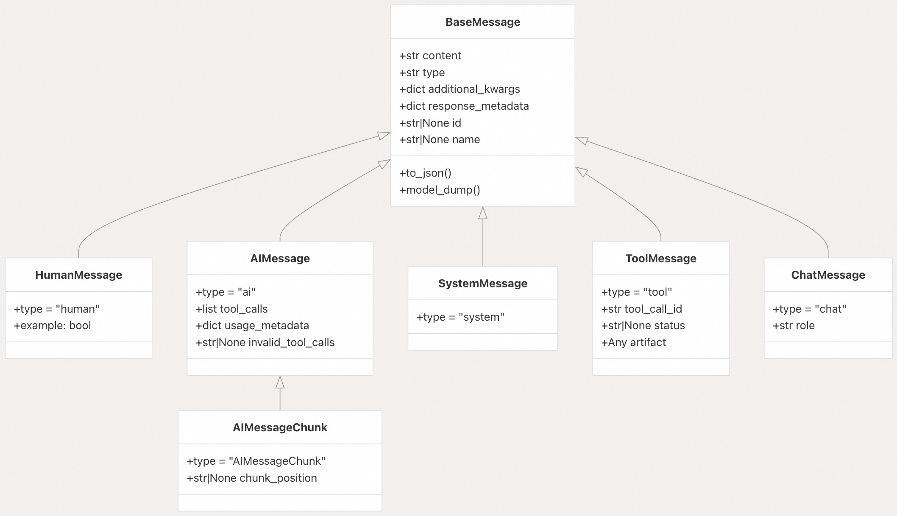
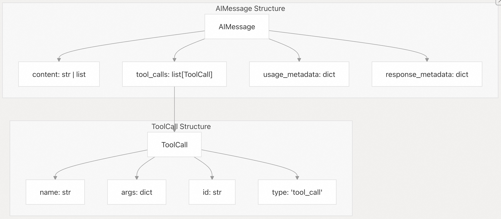
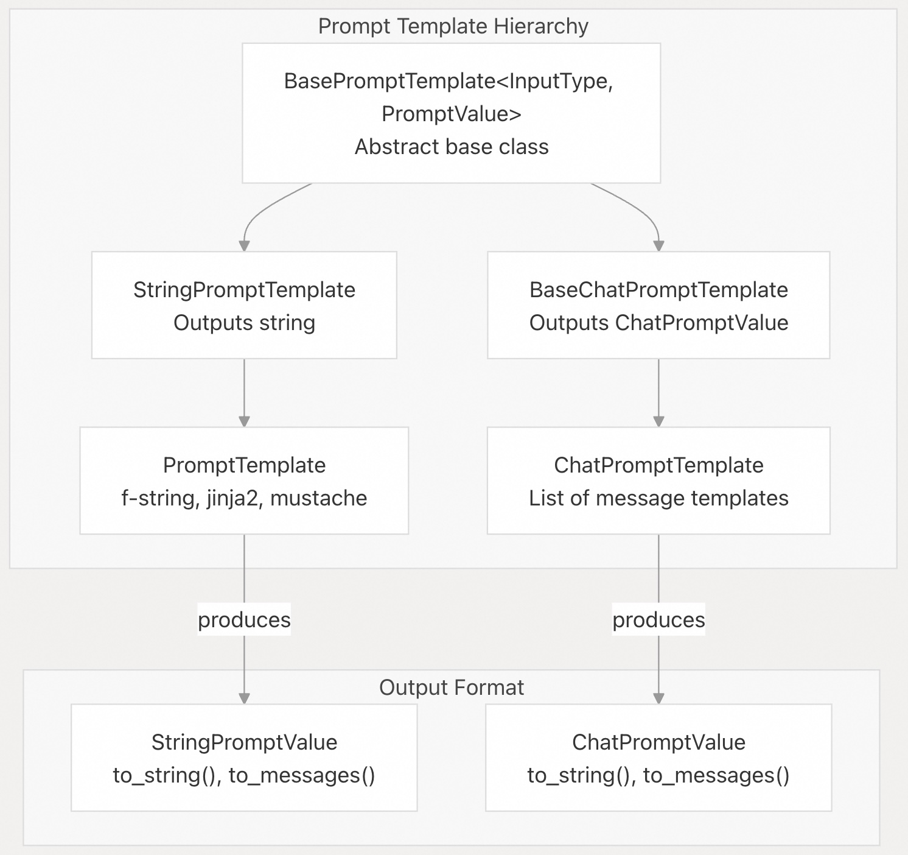
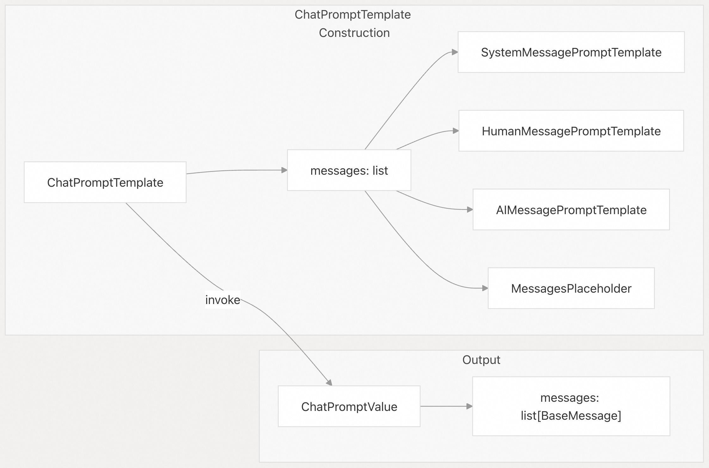
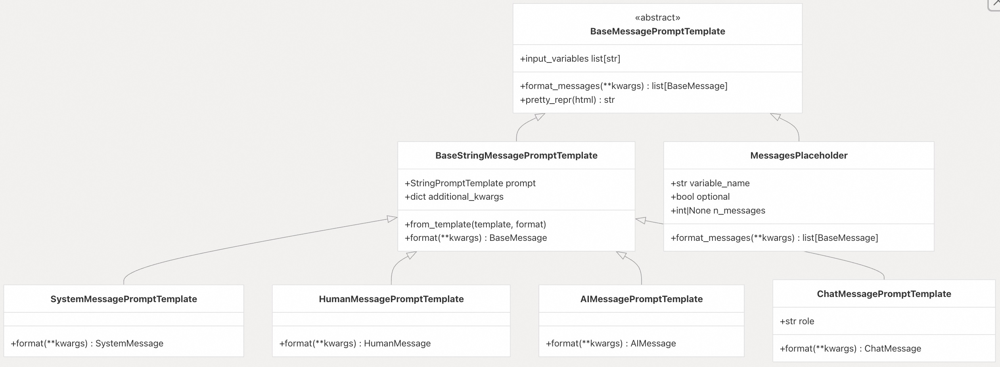
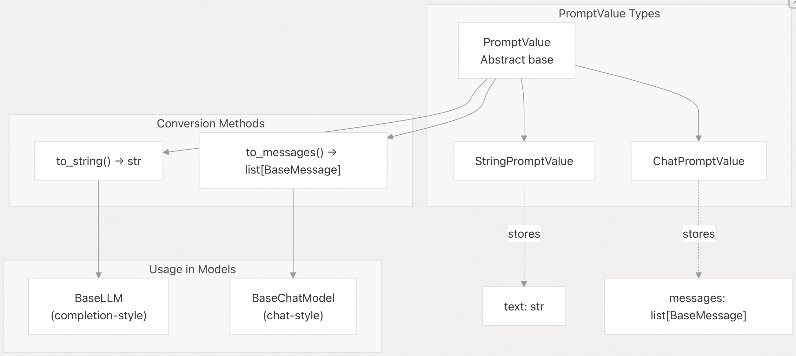
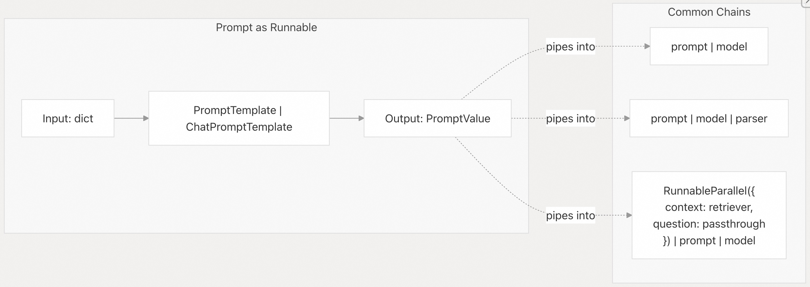

## LangChain 源码学习: 2.4 消息与提示（Messages and Prompts）                                     
                                                                  
### 作者                                                          
digoal                                                          
                                                                  
### 日期                                                            
2025-10-20                                                                
                                                           
### 标签                                                                
AI Agent , Powered by LLM , LangChain , 源码学习                                                           
                                                                 
----                                                             
                                                             
## 背景                        
本文介绍 LangChain Core 中的消息与提示系统，该系统定义了如何为语言模型结构化和格式化对话输入。 **消息（Messages）** 表示对话中的单个单元（如用户输入、AI 回复、系统指令、工具输出），而 **提示（Prompts）** 是将输入格式化为消息或字符串以供模型使用的模板。  
  
## 消息类型层次结构  
  
LangChain 为基于聊天(chat-based)的交互定义了一种标准化的消息格式。所有消息类型都继承自 `BaseMessage`，并代表对话中的不同角色。  
  
### 类层次结构  
  
    
  
**消息类型概览**  
  
| 消息类型        | 角色             | 关键属性                          | 主要使用场景                             |  
|----------------|------------------|-----------------------------------|------------------------------------------|  
| `HumanMessage` | 用户输入         | `content`, `example`              | 表示用户查询或指令                       |  
| `AIMessage`    | 模型响应         | `content`, `tool_calls`, `usage_metadata` | 表示模型生成的回复，包括工具调用         |  
| `SystemMessage`| 系统指令         | `content`                         | 为模型设置上下文、行为或指令             |  
| `ToolMessage`  | 工具结果         | `content`, `tool_call_id`, `artifact` | 返回工具执行的结果                       |  
| `ChatMessage`  | 通用消息         | `content`, `role`                 | 表示不符合其他类别的自定义角色消息       |  
  
来源：    
- [libs/core/langchain_core/messages/base.py](https://github.com/langchain-ai/langchain/blob/e3fc7d8a/libs/core/langchain_core/messages/base.py#L1-L500)  
- [libs/core/langchain_core/messages/human.py](https://github.com/langchain-ai/langchain/blob/e3fc7d8a/libs/core/langchain_core/messages/human.py#L1-L100)  
- [libs/core/langchain_core/messages/ai.py](https://github.com/langchain-ai/langchain/blob/e3fc7d8a/libs/core/langchain_core/messages/ai.py#L1-L300)  
- [libs/core/langchain_core/messages/system.py](https://github.com/langchain-ai/langchain/blob/e3fc7d8a/libs/core/langchain_core/messages/system.py#L1-L100)  
- [libs/core/langchain_core/messages/tool.py](https://github.com/langchain-ai/langchain/blob/e3fc7d8a/libs/core/langchain_core/messages/tool.py#L1-L200)  
  
### 带工具调用的 AIMessage  
  
`AIMessage` 通过 `tool_calls` 属性对工具调用工作流提供专门支持，其中包含模型希望调用的工具的结构化信息。  
  
    
  
`tool_calls` 列表包含 `ToolCall` 对象，其字段包括：  
- `name`：要调用的工具名称    
- `args`：传递给工具的参数字典    
- `id`：此工具调用的唯一标识符    
- `type`：始终为 `"tool_call"`  
  
这种结构支持代理循环（agent loop）模式，流程如下：  
- 1\. 模型返回一个带有 `tool_calls` 的 `AIMessage`    
- 2\. 执行工具后，返回引用 `tool_call_id` 的 `ToolMessage` 对象  
- 3\. 消息反馈给模型进行下一步  
  
来源：    
- [libs/core/langchain_core/messages/ai.py](https://github.com/langchain-ai/langchain/blob/e3fc7d8a/libs/core/langchain_core/messages/ai.py#L1-L300)  
- [libs/core/langchain_core/messages/tool.py](https://github.com/langchain-ai/langchain/blob/e3fc7d8a/libs/core/langchain_core/messages/tool.py#L1-L200)  
  
### 内容块（Content Blocks）  
  
现代消息类型通过 `content` 字段支持多模态内容，该字段可以是字符串，也可以是内容块列表。  
```  
# String content  
HumanMessage(content="What is in this image?")  
  
# Multi-modal content blocks  
HumanMessage(content=[  
    {"type": "text", "text": "What is in this image?"},  
    {"type": "image_url", "image_url": {"url": "https://..."}}  
])  
```  
  
支持的内容块类型包括：`text`、`image_url`、`image`、`file`、`json` 等（详见 `TOOL_MESSAGE_BLOCK_TYPES` 定义）。  
  
来源：    
- [libs/core/langchain_core/messages/base.py](https://github.com/langchain-ai/langchain/blob/e3fc7d8a/libs/core/langchain_core/messages/base.py#L100-L300)  
- [libs/core/langchain_core/tools/base.py](https://github.com/langchain-ai/langchain/blob/e3fc7d8a/libs/core/langchain_core/tools/base.py#L72-L81)  
  
## 提示模板（Prompt Templates）  
  
提示模板用于将变量输入格式化为字符串或消息，供语言模型使用。该系统基于 `Runnable` 接口构建，使提示(Prompt)可与其他组件组合使用。  
  
### 架构概览  
  
    
  
所有提示模板均具备以下特性：  
- 继承自 `BasePromptTemplate`，而 `BasePromptTemplate` 又继承自 `Runnable`    
- 包含 `input_variables`，用于指定所需的格式化键    
- 支持仅填充部分变量  
- 提供 `format()`、`invoke()` 和 `format_prompt()` 方法    
- 输出为 `PromptValue` 对象，可转换为字符串或消息列表  
  
来源：    
- [libs/core/langchain_core/prompts/base.py](https://github.com/langchain-ai/langchain/blob/e3fc7d8a/libs/core/langchain_core/prompts/base.py#L1-L600)  
- [libs/core/langchain_core/prompts/string.py](https://github.com/langchain-ai/langchain/blob/e3fc7d8a/libs/core/langchain_core/prompts/string.py#L1-L300)  
- [libs/core/langchain_core/prompts/chat.py](https://github.com/langchain-ai/langchain/blob/e3fc7d8a/libs/core/langchain_core/prompts/chat.py#L1-L100)  
  
### PromptTemplate（基于字符串, String-Based）  
  
`PromptTemplate` 使用支持变量的格式化字符串模板，支持多种模板格式。  
  
**模板格式**  
  
| 格式        | 描述                     | 示例                     |  
|-------------|--------------------------|--------------------------|  
| `f-string`  | Python f-string 风格（默认） | `"Hello {name}!"`        |  
| `jinja2`    | Jinja2 模板引擎           | `"Hello {{ name }}!"`    |  
| `mustache`  | Mustache 模板             | `"Hello {{name}}!"`      |  
  
**创建样式**  
```  
# From template string  
prompt = PromptTemplate.from_template("Tell me a {adjective} joke about {content}")  
  
# With explicit input variables  
prompt = PromptTemplate(  
    template="Tell me a {adjective} joke about {content}",  
    input_variables=["adjective", "content"]  
)  
  
# With partial variables (pre-filled)  
prompt = PromptTemplate(  
    template="Tell me a {adjective} joke about {content}",  
    input_variables=["content"],  
    partial_variables={"adjective": "funny"}  
)  
  
# Different template format  
prompt = PromptTemplate.from_template(  
    "Hello {{ name }}!",  
    template_format="jinja2"  
)  
```  
  
模板变量通过 `get_template_variables()` 自动从模板字符串中推断，该函数会根据模板格式进行解析。  
  
来源：    
- [libs/core/langchain_core/prompts/prompt.py](https://github.com/langchain-ai/langchain/blob/e3fc7d8a/libs/core/langchain_core/prompts/prompt.py#L1-L500)  
- [libs/core/langchain_core/prompts/string.py](https://github.com/langchain-ai/langchain/blob/e3fc7d8a/libs/core/langchain_core/prompts/string.py#L1-L400)  
  
### ChatPromptTemplate（基于消息, Message-Based）  
  
`ChatPromptTemplate` 将一组消息模板组合成完整的聊天提示(prompt)。每条消息模板会格式化为特定类型的消息。  
  
    
  
**常见使用样式**  
```  
# From messages using tuples (role, content)  
prompt = ChatPromptTemplate.from_messages([  
    ("system", "You are a helpful assistant."),  
    ("human", "Tell me about {topic}")  
])  
  
# With explicit message templates  
prompt = ChatPromptTemplate.from_messages([  
    SystemMessagePromptTemplate.from_template("You are a helpful assistant."),  
    HumanMessagePromptTemplate.from_template("Tell me about {topic}")  
])  
  
# With MessagesPlaceholder for dynamic message lists  
prompt = ChatPromptTemplate.from_messages([  
    ("system", "You are a helpful assistant."),  
    MessagesPlaceholder("history"),  
    ("human", "{input}")  
])  
  
# Invocation  
result = prompt.invoke({  
    "history": [("human", "Hi"), ("ai", "Hello!")],  
    "input": "What's the weather?"  
})  
# result.messages: [SystemMessage(...), HumanMessage("Hi"), AIMessage("Hello!"), HumanMessage("What's the weather?")]  
```  
  
工厂方法 `from_messages()` 使用 `_convert_to_message_template()` 将多种输入格式（元组、消息对象、模板对象等, tuples, message objects, template objects）转换为 `BaseMessagePromptTemplate` 实例。  
  
来源：    
- [libs/core/langchain_core/prompts/chat.py](https://github.com/langchain-ai/langchain/blob/e3fc7d8a/libs/core/langchain_core/prompts/chat.py#L500-L1000)  
- [libs/core/langchain_core/prompts/chat.py](https://github.com/langchain-ai/langchain/blob/e3fc7d8a/libs/core/langchain_core/prompts/chat.py#L1-L500)  
  
## 消息提示模板（Message Prompt Templates）  
  
消息提示模板是专门用于生成单条消息的提示模板，通常在 `ChatPromptTemplate` 中用于格式化对话中的每条消息。  
  
### 模板层次结构  
  
    
  
来源：    
- [libs/core/langchain_core/prompts/chat.py](https://github.com/langchain-ai/langchain/blob/e3fc7d8a/libs/core/langchain_core/prompts/chat.py#L1-L600)  
  
### MessagesPlaceholder  
  
`MessagesPlaceholder` 是一种特殊的模板，可将消息列表直接插入提示中。它不执行格式化，而是期望变量本身已经是消息列表。  
  
**关键特性：**  
- `variable_name`：包含消息的输入变量名    
- `optional`：若为 `True`，允许变量缺失（返回空列表）    
- `n_messages`：限制消息数量（取最后 N 条）  
  
**使用样式：**  
```  
# Basic usage  
placeholder = MessagesPlaceholder("history")  
messages = placeholder.format_messages(  
    history=[  
        ("human", "What is 2+2?"),  
        ("ai", "2+2 is 4")  
    ]  
)  
# Returns: [HumanMessage(content="What is 2+2?"), AIMessage(content="2+2 is 4")]  
  
# Optional placeholder (no error if missing)  
placeholder = MessagesPlaceholder("history", optional=True)  
messages = placeholder.format_messages()  # Returns []  
  
# Limit messages  
placeholder = MessagesPlaceholder("history", n_messages=1)  
messages = placeholder.format_messages(  
    history=[  
        ("human", "First"),  
        ("human", "Second")  
    ]  
)  
# Returns: [HumanMessage(content="Second")]  # Only last message  
```  
  
输入消息通过 `convert_to_messages()` 转换，该函数支持多种格式，包括元组、字典和消息对象(tuples, dicts, and message objects)。  
  
来源：    
- [libs/core/langchain_core/prompts/chat.py](https://github.com/langchain-ai/langchain/blob/e3fc7d8a/libs/core/langchain_core/prompts/chat.py#L55-L210)  
  
### BaseStringMessagePromptTemplate  
  
这是一个抽象基类，包装一个 `StringPromptTemplate` 并将其输出转换为特定消息类型。具体子类指定要生成的消息类。  
  
**模板创建：**  
```  
# From template string  
system_prompt = SystemMessagePromptTemplate.from_template(  
    "You are a {role}. Your task is {task}."  
)  
  
# With different formats  
human_prompt = HumanMessagePromptTemplate.from_template(  
    "Hello {{ name }}!",  
    template_format="jinja2"  
)  
  
# From file  
template = HumanMessagePromptTemplate.from_template_file(  
    "path/to/template.txt"  
)  
```  
  
每个子类（如 `SystemMessagePromptTemplate`、`HumanMessagePromptTemplate`、`AIMessagePromptTemplate`、`ChatMessagePromptTemplate`）都实现 `format()` 方法，返回对应类型的消息，内容为格式化后的文本。  
  
来源：    
- [libs/core/langchain_core/prompts/chat.py](https://github.com/langchain-ai/langchain/blob/e3fc7d8a/libs/core/langchain_core/prompts/chat.py#L218-L342)  
  
## PromptValue 抽象  
  
`PromptValue` 是提示模板的输出格式，提供统一接口，可转换为字符串或消息列表。该抽象使提示能同时适用于补全式（completion-style）和聊天式（chat-style）语言模型。  
  
    
  
**StringPromptValue**  
  
存储一个简单字符串, 转换方法：    
- `to_string()`：直接返回字符串    
- `to_messages()`：包装为 `HumanMessage(content=text)`  
  
**ChatPromptValue**  
  
存储消息列表, 转换方法：    
- `to_string()`：调用 `get_buffer_string(messages)` 将消息格式化为文本    
- `to_messages()`：直接返回消息列表  
  
**与模型的集成**  
  
语言模型使用 `_convert_input()` 接受灵活输入，例如：  
```  
# In BaseChatModel._convert_input()  
def _convert_input(self, model_input: LanguageModelInput) -> PromptValue:  
    if isinstance(model_input, PromptValue):  
        return model_input  
    elif isinstance(model_input, str):  
        return StringPromptValue(text=model_input)  
    elif isinstance(model_input, Sequence):  
        return ChatPromptValue(messages=convert_to_messages(model_input))  
```  
  
这使得模型可以接受  
- 原始字符串: `model.invoke("Hello")`    
- 消息列表: `model.invoke([("human", "Hello")])`    
- PromptValue 对象: `model.invoke(prompt.invoke({"name": "Alice"}))`  
  
来源：    
- [libs/core/langchain_core/prompt_values.py](https://github.com/langchain-ai/langchain/blob/e3fc7d8a/libs/core/langchain_core/prompt_values.py#L1-L300)  
- [libs/core/langchain_core/language_models/chat_models.py](https://github.com/langchain-ai/langchain/blob/e3fc7d8a/libs/core/langchain_core/language_models/chat_models.py#L354-L366)  
  
## 与 Runnable 的集成  
  
提示实现了 `Runnable` 接口，可通过管道操作符（`|`）与其他组件组合。  
  
    
  
**Runnable 方法**  
  
| 方法                | 描述                   | 返回类型             |  
|---------------------|------------------------|----------------------|  
| `invoke(input, config)`   | 同步格式化提示         | `PromptValue`        |  
| `ainvoke(input, config)`  | 异步格式化提示         | `PromptValue`        |  
| `batch(inputs, config)`   | 批量格式化多个提示     | `list[PromptValue]`  |  
| `stream(input, config)`   | 流式输出提示（一次性） | `Iterator[PromptValue]` |  
| `get_input_schema(config)`| 获取 Pydantic 输入模式 | `type[BaseModel]`    |  
| `get_output_schema(config)`| 获取 Pydantic 输出模式 | `type[BaseModel]`    |  
  
**模式推断**  
  
提示会根据其 `input_variables` 自动生成 Pydantic 模式。  
```  
prompt = PromptTemplate.from_template("Tell me about {topic} in {language}")  
  
# Input schema  
schema = prompt.get_input_schema()  
# Generated schema has fields: topic (str), language (str)  
  
# Can be used for validation  
prompt.invoke({"topic": "Python", "language": "English"})  
```  
  
**部分变量（Partial Variables）**  
  
提示支持填充部分变量，即预先填充部分变量：  
```  
# Define with partial  
prompt = PromptTemplate(  
    template="Tell me a {adjective} joke about {content}",  
    input_variables=["content"],  
    partial_variables={"adjective": "funny"}  
)  
  
# Or use partial() method  
base_prompt = PromptTemplate.from_template("Tell me a {adjective} joke about {content}")  
partial_prompt = base_prompt.partial(adjective="funny")  
  
# Now only need to provide content  
partial_prompt.invoke({"content": "chickens"})  
```  
  
部分变量也可以是函数，在格式化时被调用。  
```  
from datetime import datetime  
  
prompt = PromptTemplate(  
    template="The time is {time}. Tell me about {topic}",  
    input_variables=["topic"],  
    partial_variables={"time": lambda: datetime.now().isoformat()}  
)  
```  
  
来源：    
- [libs/core/langchain_core/prompts/base.py](https://github.com/langchain-ai/langchain/blob/e3fc7d8a/libs/core/langchain_core/prompts/base.py#L1-L600)  
- [libs/core/langchain_core/prompts/prompt.py](https://github.com/langchain-ai/langchain/blob/e3fc7d8a/libs/core/langchain_core/prompts/prompt.py#L1-L500)  
- [libs/core/langchain_core/runnables/base.py](https://github.com/langchain-ai/langchain/blob/e3fc7d8a/libs/core/langchain_core/runnables/base.py#L122-L254)  
  
## 常见使用模式  
  
### 模式1：简单字符串格式化    
```  
from langchain_core.prompts import PromptTemplate  
  
prompt = PromptTemplate.from_template("What is the capital of {country}?")  
result = prompt.invoke({"country": "France"})  
# result.to_string() -> "What is the capital of France?"  
```  
  
### 模式2：带历史记录的聊天    
```  
from langchain_core.prompts import ChatPromptTemplate, MessagesPlaceholder  
  
prompt = ChatPromptTemplate.from_messages([  
    ("system", "You are a helpful assistant."),  
    MessagesPlaceholder("history"),  
    ("human", "{input}")  
])  
  
result = prompt.invoke({  
    "history": [  
        ("human", "My name is Alice"),  
        ("ai", "Hello Alice!")  
    ],  
    "input": "What's my name?"  
})  
# result.messages -> [SystemMessage(...), HumanMessage("My name is Alice"),   
#                     AIMessage("Hello Alice!"), HumanMessage("What's my name?")]  
```  
  
### 模式3：RAG（检索增强生成）流水线    
```  
from langchain_core.prompts import ChatPromptTemplate  
from langchain_core.runnables import RunnablePassthrough  
  
prompt = ChatPromptTemplate.from_template(  
    "Context: {context}\n\nQuestion: {question}\n\nAnswer:"  
)  
  
chain = (  
    {  
        "context": retriever,  
        "question": RunnablePassthrough()  
    }  
    | prompt  
    | model  
)  
```  
  
### 模式4：多模态消息  
```  
from langchain_core.prompts import HumanMessagePromptTemplate  
  
prompt = HumanMessagePromptTemplate.from_template([  
    {"type": "text", "text": "What is in this image?"},  
    {"type": "image_url", "image_url": {"url": "{image_url}"}}  
])  
  
result = prompt.format(image_url="https://example.com/image.jpg")  
# result.content -> [{"type": "text", ...}, {"type": "image_url", ...}]  
```  
  
来源：    
- [libs/core/langchain_core/prompts/prompt.py](https://github.com/langchain-ai/langchain/blob/e3fc7d8a/libs/core/langchain_core/prompts/prompt.py#L1-L500)  
- [libs/core/langchain_core/prompts/chat.py](https://github.com/langchain-ai/langchain/blob/e3fc7d8a/libs/core/langchain_core/prompts/chat.py#L1-L1000)  
- [tests/unit_tests/prompts/test_chat.py](https://github.com/langchain-ai/langchain/blob/e3fc7d8a/tests/unit_tests/prompts/test_chat.py#L1-L500)  
      
#### [期望 PostgreSQL|开源PolarDB 增加什么功能?](https://github.com/digoal/blog/issues/76 "269ac3d1c492e938c0191101c7238216")
  
  
#### [PolarDB 开源数据库](https://openpolardb.com/home "57258f76c37864c6e6d23383d05714ea")
  
  
#### [PolarDB 学习图谱](https://www.aliyun.com/database/openpolardb/activity "8642f60e04ed0c814bf9cb9677976bd4")
  
  
#### [PostgreSQL 解决方案集合](../201706/20170601_02.md "40cff096e9ed7122c512b35d8561d9c8")
  
  
#### [德哥 / digoal's Github - 公益是一辈子的事.](https://github.com/digoal/blog/blob/master/README.md "22709685feb7cab07d30f30387f0a9ae")
  
  
#### [About 德哥](https://github.com/digoal/blog/blob/master/me/readme.md "a37735981e7704886ffd590565582dd0")
  
  

  
