## LangChain 源码学习: 3.1 主流大模型提供商集成（Major Provider Integrations）                                   
                                                                    
### 作者                                                            
digoal                                                            
                                                                    
### 日期                                                              
2025-10-20                                                                  
                                                             
### 标签                                                                  
AI Agent , Powered by LLM , LangChain , 源码学习                                                             
                                                                   
----                                                               
                                                               
## 背景                          
本文介绍 LangChain 中对主流大语言模型（LLM）提供商的集成，包括 **OpenAI、Anthropic、MistralAI、Groq 和 Fireworks 等**。这些集成提供了 LangChain 应用程序所依赖的主要聊天模型实现，均基于核心的 `BaseChatModel` 抽象类，同时暴露各提供商特有的功能。  
  
## 提供商集成架构  
  
所有主流提供商的集成都遵循一致的架构模式：在实现 LangChain 的 `BaseChatModel` 抽象的同时，对接各自提供商的 SDK 与 API。  
  
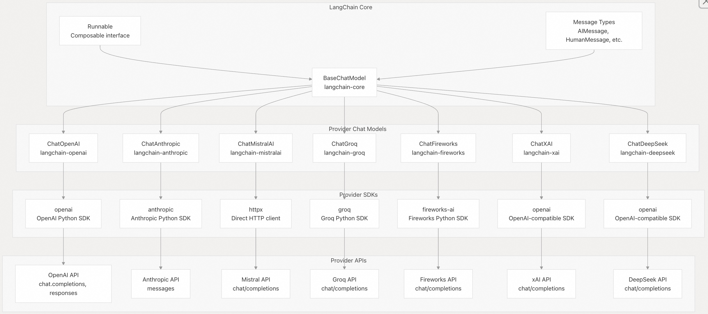  
  
来源：    
- [libs/partners/openai/langchain_openai/chat_models/base.py](https://github.com/langchain-ai/langchain/blob/e3fc7d8a/libs/partners/openai/langchain_openai/chat_models/base.py#L447-L447)  
- [libs/partners/anthropic/langchain_anthropic/chat_models.py](https://github.com/langchain-ai/langchain/blob/e3fc7d8a/libs/partners/anthropic/langchain_anthropic/chat_models.py#L502-L502)  
- [libs/partners/mistralai/langchain_mistralai/chat_models.py](https://github.com/langchain-ai/langchain/blob/e3fc7d8a/libs/partners/mistralai/langchain_mistralai/chat_models.py#L385-L385)  
- [libs/partners/groq/langchain_groq/chat_models.py](https://github.com/langchain-ai/langchain/blob/e3fc7d8a/libs/partners/groq/langchain_groq/chat_models.py#L65-L65)  
- [libs/partners/fireworks/langchain_fireworks/chat_models.py](https://github.com/langchain-ai/langchain/blob/e3fc7d8a/libs/partners/fireworks/langchain_fireworks/chat_models.py#L60-L60)  
  
## 提供商对比  
  
| 提供商      | 包名（Package）        | 核心模型                              | 特色功能                                      | API 模式              |  
|-------------|------------------------|---------------------------------------|-----------------------------------------------|------------------------|  
| OpenAI      | `langchain-openai`     | GPT-4、GPT-3.5、o1、o3、o4-mini       | 结构化输出、Responses API、推理模型、热门工具 | OpenAI 兼容            |  
| Anthropic   | `langchain-anthropic`  | Claude 3.5、Claude 3                  | Computer Use、思考/推理块、缓存、Files API    | Messages API           |  
| MistralAI   | `langchain-mistralai`  | Mixtral、Mistral Large                | 直连 HTTP 客户端、自定义工具 ID 处理          | OpenAI 兼容            |  
| Groq        | `langchain-groq`       | 快速推理模型、Llama 系列模型              | 高速推理、推理格式支持                        | OpenAI 兼容            |  
| Fireworks   | `langchain-fireworks`  | 开源模型、自定义部署                  | 模型灵活性、Firebase 集成                     | OpenAI 兼容            |  
| xAI         | `langchain-xai`        | Grok 系列模型                         | xAI 平台集成                                  | OpenAI 兼容            |  
| DeepSeek    | `langchain-deepseek`   | DeepSeek 系列模型                     | DeepSeek 平台集成                             | OpenAI 兼容            |  
  
来源：各提供商的 `pyproject.toml` 配置文件, 如  
- [libs/partners/openai/pyproject.toml](https://github.com/langchain-ai/langchain/blob/e3fc7d8a/libs/partners/openai/pyproject.toml#L14-L14)  
- [libs/partners/anthropic/pyproject.toml](https://github.com/langchain-ai/langchain/blob/e3fc7d8a/libs/partners/anthropic/pyproject.toml#L14-L14)  
- [libs/partners/mistralai/pyproject.toml](https://github.com/langchain-ai/langchain/blob/e3fc7d8a/libs/partners/mistralai/pyproject.toml#L16-L16)  
- [libs/partners/groq/pyproject.toml](https://github.com/langchain-ai/langchain/blob/e3fc7d8a/libs/partners/groq/pyproject.toml#L10-L10)  
- [libs/partners/fireworks/pyproject.toml](https://github.com/langchain-ai/langchain/blob/e3fc7d8a/libs/partners/fireworks/pyproject.toml#L16-L16)  
  
## OpenAI 集成  
  
### ChatOpenAI 实现  
  
`ChatOpenAI` 通过 `BaseChatOpenAI` 类实现，为 OpenAI 的各类模型（包括 GPT-4、GPT-3.5 以及推理模型如 o1）提供核心功能支持。  
  
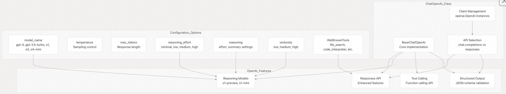  
  
来源：    
- [libs/partners/openai/langchain_openai/chat_models/base.py](https://github.com/langchain-ai/langchain/blob/e3fc7d8a/libs/partners/openai/langchain_openai/chat_models/base.py#L438-L851)  
- [libs/partners/openai/langchain_openai/chat_models/base.py](https://github.com/langchain-ai/langchain/blob/e3fc7d8a/libs/partners/openai/langchain_openai/chat_models/base.py#L497-L534)  
- [libs/partners/openai/langchain_openai/chat_models/base.py](https://github.com/langchain-ai/langchain/blob/e3fc7d8a/libs/partners/openai/langchain_openai/chat_models/base.py#L670-L677)  
- [libs/partners/openai/langchain_openai/chat_models/base.py](https://github.com/langchain-ai/langchain/blob/e3fc7d8a/libs/partners/openai/langchain_openai/chat_models/base.py#L123-L131)  
  
### OpenAI 消息转换  
  
OpenAI 集成包含完整的消息格式转换逻辑，可在 LangChain 消息与 OpenAI API 格式之间相互转换，支持多模态内容和工具调用。  
  
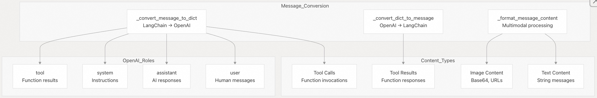  
  
来源：    
- [libs/partners/openai/langchain_openai/chat_models/base.py](https://github.com/langchain-ai/langchain/blob/e3fc7d8a/libs/partners/openai/langchain_openai/chat_models/base.py#L251-L319)  
- [libs/partners/openai/langchain_openai/chat_models/base.py](https://github.com/langchain-ai/langchain/blob/e3fc7d8a/libs/partners/openai/langchain_openai/chat_models/base.py#L134-L203)  
- [libs/partners/openai/langchain_openai/chat_models/base.py](https://github.com/langchain-ai/langchain/blob/e3fc7d8a/libs/partners/openai/langchain_openai/chat_models/base.py#L206-L248)  
  
## Anthropic 集成  
  
### ChatAnthropic 实现  
  
`ChatAnthropic` 提供对 Claude 模型的集成，具备高级功能，如 Computer Use（计算机使用）、思考块（thinking blocks）和提示缓存（prompt caching）。  
  
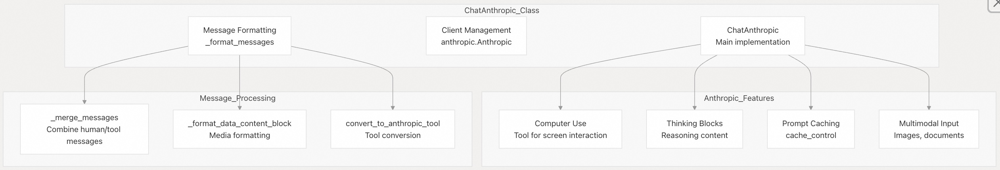  
  
来源：    
- [libs/partners/anthropic/langchain_anthropic/chat_models.py](https://github.com/langchain-ai/langchain/blob/e3fc7d8a/libs/partners/anthropic/langchain_anthropic/chat_models.py#L502-L1400)  
- [libs/partners/anthropic/langchain_anthropic/chat_models.py](https://github.com/langchain-ai/langchain/blob/e3fc7d8a/libs/partners/anthropic/langchain_anthropic/chat_models.py#L142-L188)  
- [libs/partners/anthropic/langchain_anthropic/chat_models.py](https://github.com/langchain-ai/langchain/blob/e3fc7d8a/libs/partners/anthropic/langchain_anthropic/chat_models.py#L282-L490)  
  
### Anthropic 内容块系统  
  
Anthropic 使用复杂的内容块（content block）系统来处理消息中的不同类型内容，包括对 Files API 的支持。  
  
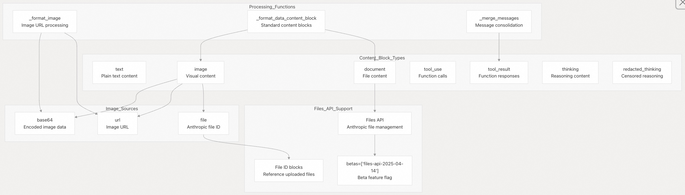  
  
来源：    
- [libs/partners/anthropic/langchain_anthropic/chat_models.py](https://github.com/langchain-ai/langchain/blob/e3fc7d8a/libs/partners/anthropic/langchain_anthropic/chat_models.py#L98-L142)  
- [libs/partners/anthropic/langchain_anthropic/chat_models.py](https://github.com/langchain-ai/langchain/blob/e3fc7d8a/libs/partners/anthropic/langchain_anthropic/chat_models.py#L193-L282)  
- [libs/partners/anthropic/langchain_anthropic/chat_models.py](https://github.com/langchain-ai/langchain/blob/e3fc7d8a/libs/partners/anthropic/langchain_anthropic/chat_models.py#L145-L190)  
- [docs/docs/integrations/chat/anthropic.ipynb](https://github.com/langchain-ai/langchain/blob/e3fc7d8a/docs/docs/integrations/chat/anthropic.ipynb#L788-L815)  
  
## MistralAI 集成  
  
### ChatMistralAI 实现  
  
`ChatMistralAI` 通过 `httpx` 直接与 Mistral 的 API 进行 HTTP 通信，支持自定义工具调用 ID 处理和基于 Server-Sent Events（SSE）的流式响应。  
  
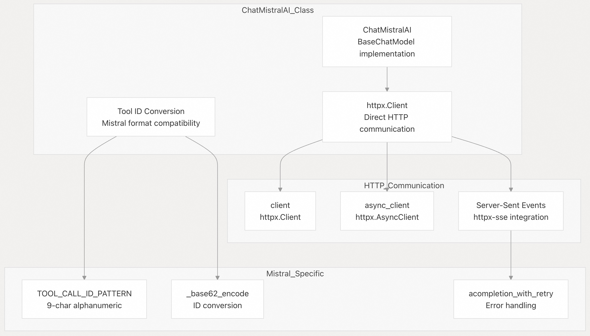  
  
来源：    
- [libs/partners/mistralai/langchain_mistralai/chat_models.py](https://github.com/langchain-ai/langchain/blob/e3fc7d8a/libs/partners/mistralai/langchain_mistralai/chat_models.py#L385-L445)  
- [libs/partners/mistralai/langchain_mistralai/chat_models.py](https://github.com/langchain-ai/langchain/blob/e3fc7d8a/libs/partners/mistralai/langchain_mistralai/chat_models.py#L82-L133)  
- [libs/partners/mistralai/langchain_mistralai/chat_models.py](https://github.com/langchain-ai/langchain/blob/e3fc7d8a/libs/partners/mistralai/langchain_mistralai/chat_models.py#L208-L231)  
  
## Groq 集成  
  
### ChatGroq 实现  
  
`ChatGroq` 提供高速推理能力，支持推理模型和自定义推理格式。  
  
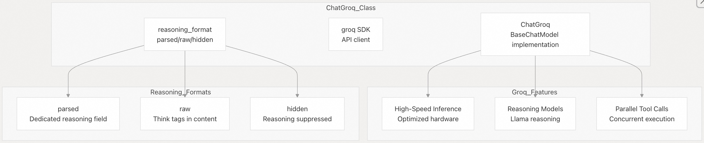  
  
来源：    
- [libs/partners/groq/langchain_groq/chat_models.py](https://github.com/langchain-ai/langchain/blob/e3fc7d8a/libs/partners/groq/langchain_groq/chat_models.py#L65-L300)  
- [libs/partners/groq/langchain_groq/chat_models.py](https://github.com/langchain-ai/langchain/blob/e3fc7d8a/libs/partners/groq/langchain_groq/chat_models.py#L90-L105)  
  
## Fireworks 集成  
  
### ChatFireworks 实现  
  
`ChatFireworks` 利用 Fireworks 平台访问开源模型和自定义部署，采用 OpenAI 兼容接口。  
  
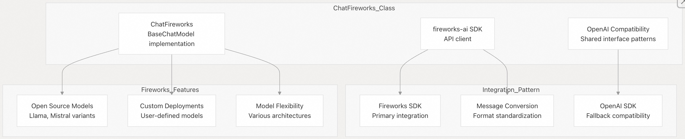  
  
来源：    
- [libs/partners/fireworks/langchain_fireworks/chat_models.py](https://github.com/langchain-ai/langchain/blob/e3fc7d8a/libs/partners/fireworks/langchain_fireworks/chat_models.py#L60-L400)  
- [libs/partners/fireworks/pyproject.toml](https://github.com/langchain-ai/langchain/blob/e3fc7d8a/libs/partners/fireworks/pyproject.toml#L11-L14)  
  
## 通用集成模式  
  
### 工具调用实现  
  
所有主流提供商均实现了工具调用功能，并根据底层 API 进行了适配：  
  
| 提供商      | 工具实现方式                         | 特色功能                                      |  
|-------------|--------------------------------------|-----------------------------------------------|  
| OpenAI      | 原生 `tools` 参数                    | 并行调用、热门工具（如 `file_search`、`code_interpreter` 等） |  
| Anthropic   | `convert_to_anthropic_tool` 转换     | 内置工具（`computer_use`、`text_editor`、`bash`、`web_search`） |  
| MistralAI   | `_format_tool_call_for_mistral` 转换 | 长度为 9 位的字符串 ID(字母数字组合)、base62 编码                   |  
| Groq        | OpenAI 兼容格式                      | 高速并行执行                                   |  
| Fireworks   | OpenAI 兼容格式                      | 模型依赖的支持                                 |  
| xAI         | OpenAI 兼容格式                      | Grok 模型优化                                  |  
| DeepSeek    | OpenAI 兼容格式                      | DeepSeek 模型优化                              |  
  
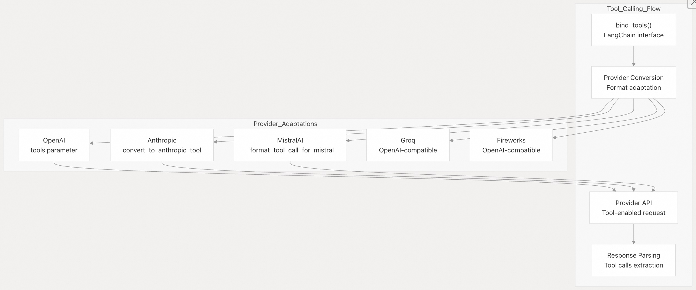  
  
来源：    
- [libs/partners/openai/.../base.py](https://github.com/langchain-ai/langchain/blob/e3fc7d8a/libs/partners/openai/langchain_openai/chat_models/base.py#L123-L130)  
- [libs/partners/anthropic/.../chat_models.py](https://github.com/langchain-ai/langchain/blob/e3fc7d8a/libs/partners/anthropic/langchain_anthropic/chat_models.py#L26-L44)  
- [libs/partners/mistralai/.../chat_models.py](https://github.com/langchain-ai/langchain/blob/e3fc7d8a/libs/partners/mistralai/langchain_mistralai/chat_models.py#L294-L305)  
  
### 流式架构（Streaming Architecture）  
  
所有提供商均实现了统一的流式接口，同时适配各自底层不同的流式机制（如 SSE、chunked response 等）。  
  
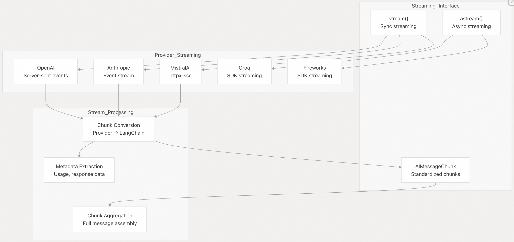  
  
来源：    
- [libs/partners/openai/langchain_openai/chat_models/base.py](https://github.com/langchain-ai/langchain/blob/e3fc7d8a/libs/partners/openai/langchain_openai/chat_models/base.py#L472-L478)  
- [libs/partners/anthropic/langchain_anthropic/chat_models.py](https://github.com/langchain-ai/langchain/blob/e3fc7d8a/libs/partners/anthropic/langchain_anthropic/chat_models.py#L1300-L1400)  
- [libs/partners/mistralai/langchain_mistralai/chat_models.py](https://github.com/langchain-ai/langchain/blob/e3fc7d8a/libs/partners/mistralai/langchain_mistralai/chat_models.py#L234-L291)  
  
### 消息格式标准化  
  
每个提供商都实现了消息转换函数，将 LangChain 的标准化消息格式转换为各自 API 所需的格式：  
  
| 提供商      | 关键转换函数                                      | 特殊处理                              |  
|-------------|--------------------------------------------------|----------------------------------------|  
| OpenAI      | `_convert_message_to_dict`, `_convert_dict_to_message` | 多模态内容、工具调用                   |  
| Anthropic   | `_format_messages`, `_merge_messages`            | 内容块、思考块                         |  
| MistralAI   | `_convert_message_to_mistral_chat_message`       | 工具 ID 转换                           |  
| Groq        | OpenAI 兼容转换                                  | 推理内容提取                           |  
| Fireworks   | OpenAI 兼容转换                                  | 模型特定适配                           |  
  
来源：  
- [libs/partners/openai/langchain_openai/chat_models/base.py](https://github.com/langchain-ai/langchain/blob/e3fc7d8a/libs/partners/openai/langchain_openai/chat_models/base.py#L251-L319)  
- [libs/partners/anthropic/langchain_anthropic/chat_models.py](https://github.com/langchain-ai/langchain/blob/e3fc7d8a/libs/partners/anthropic/langchain_anthropic/chat_models.py#L282-L490)  
- [libs/partners/mistralai/langchain_mistralai/chat_models.py](https://github.com/langchain-ai/langchain/blob/e3fc7d8a/libs/partners/mistralai/langchain_mistralai/chat_models.py#L322-L382)  
  
## API 集成模式  
  
### 双 API 支持（OpenAI）  
  
OpenAI 集成同时支持传统的 **Chat Completions API** 和较新的 **Responses API**，并能根据使用模式自动选择。  
  
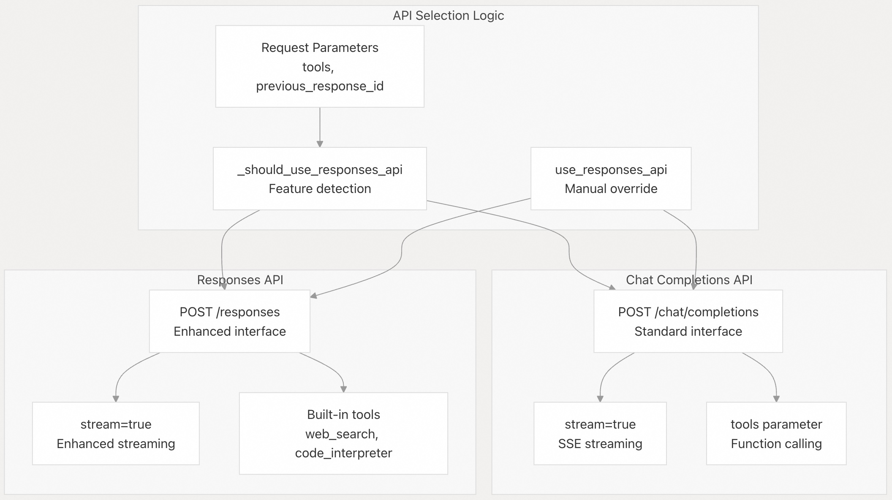  
  
来源：    
- [libs/partners/openai/langchain_openai/chat_models/base.py](https://github.com/langchain-ai/langchain/blob/e3fc7d8a/libs/partners/openai/langchain_openai/chat_models/base.py#L675-L682)  
- [libs/partners/openai/tests/integration_tests/chat_models/test_responses_api.py](https://github.com/langchain-ai/langchain/blob/e3fc7d8a/libs/partners/openai/tests/integration_tests/chat_models/test_responses_api.py#L55-L114)  
  
### 客户端管理与缓存  
  
集成为避免重复创建 HTTP 连接，实现了高效的客户端缓存机制：  
  
| 客户端特性       | 实现方式                     | 目的               |  
|------------------|------------------------------|--------------------|  
| 客户端缓存       | 基于配置的 LRU 缓存          | 性能优化           |  
| 连接池复用       | 复用 httpx 客户端            | 资源效率           |  
| 代理支持         | `openai_proxy` 参数          | 网络配置           |  
| 超时管理         | 可配置的超时设置             | 提高可靠性         |  
  
来源：    
- [libs/partners/openai/tests/unit_tests/chat_models/test_base.py](https://github.com/langchain-ai/langchain/blob/e3fc7d8a/libs/partners/openai/tests/unit_tests/chat_models/test_base.py#L83-L105)  
- [libs/partners/openai/langchain_openai/chat_models/base.py](https://github.com/langchain-ai/langchain/blob/e3fc7d8a/libs/partners/openai/langchain_openai/chat_models/base.py#L754-L817)  
  
### 错误处理与校验  
  
集成包含对常见 OpenAI API 错误和模型限制的全面错误处理机制。  
  
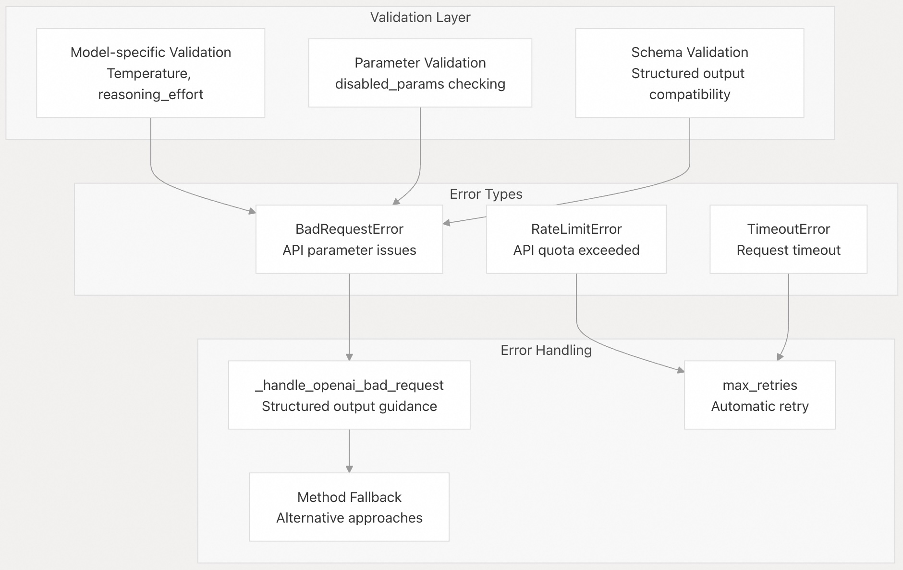  
  
来源：    
- [libs/partners/openai/langchain_openai/chat_models/base.py](https://github.com/langchain-ai/langchain/blob/e3fc7d8a/libs/partners/openai/langchain_openai/chat_models/base.py#L405-L428)  
- [libs/partners/openai/langchain_openai/chat_models/base.py](https://github.com/langchain-ai/langchain/blob/e3fc7d8a/libs/partners/openai/langchain_openai/chat_models/base.py#L715-L737)  
- [libs/partners/openai/langchain_openai/chat_models/base.py](https://github.com/langchain-ai/langchain/blob/e3fc7d8a/libs/partners/openai/langchain_openai/chat_models/base.py#L588-L604)  
    
#### [期望 PostgreSQL|开源PolarDB 增加什么功能?](https://github.com/digoal/blog/issues/76 "269ac3d1c492e938c0191101c7238216")
  
  
#### [PolarDB 开源数据库](https://openpolardb.com/home "57258f76c37864c6e6d23383d05714ea")
  
  
#### [PolarDB 学习图谱](https://www.aliyun.com/database/openpolardb/activity "8642f60e04ed0c814bf9cb9677976bd4")
  
  
#### [PostgreSQL 解决方案集合](../201706/20170601_02.md "40cff096e9ed7122c512b35d8561d9c8")
  
  
#### [德哥 / digoal's Github - 公益是一辈子的事.](https://github.com/digoal/blog/blob/master/README.md "22709685feb7cab07d30f30387f0a9ae")
  
  
#### [About 德哥](https://github.com/digoal/blog/blob/master/me/readme.md "a37735981e7704886ffd590565582dd0")
  
  

  
