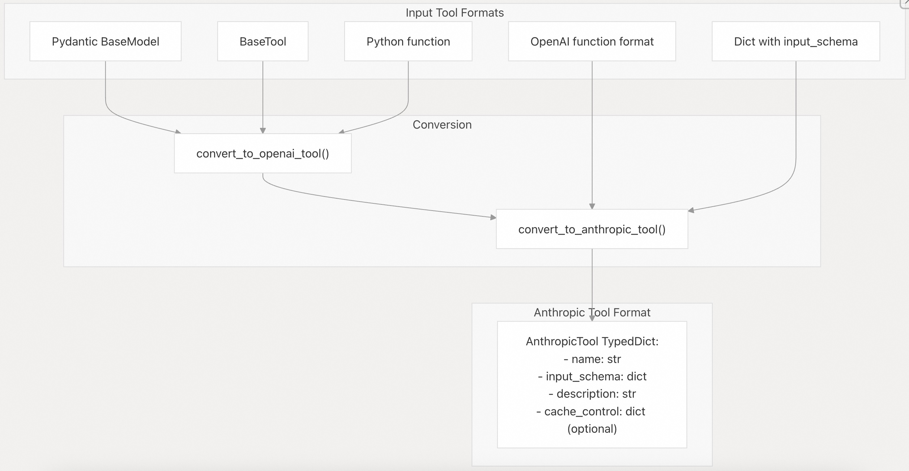

## LangChain 源码学习: 3.2 Anthropic 集成                                     
                                                                      
### 作者                                                              
digoal                                                              
                                                                      
### 日期                                                                
2025-10-20                                                                    
                                                               
### 标签                                                                    
AI Agent , Powered by LLM , LangChain , 源码学习                                                               
                                                                     
----                                                                 
                                                                 
## 背景                            
本文介绍 LangChain 中针对 Anthropic Claude 聊天模型的原生集成包 **`langchain-anthropic`**。该集成直接支持 Anthropic 的 **Messages API**，并提供 Claude 特有的高级功能，包括**扩展思考（extended thinking）**、**引用（citations）**、**提示缓存（prompt caching）** 和**多模态输入**。  
  
该包通过实现 `ChatAnthropic` 类（`BaseChatModel` 的原生子类），处理 Anthropic 特有的消息格式、工具模式(tool schema)转换，以及 OpenAI 兼容 API 无法提供的高级功能。  
  
## 包结构  
  
`langchain-anthropic` 包位于 [`libs/partners/anthropic/`](https://github.com/langchain-ai/langchain/blob/e3fc7d8a/libs/partners/anthropic/) 目录下，遵循标准的合作伙伴集成结构。  
  
  
  
**来源：**    
- [libs/partners/anthropic/langchain_anthropic/chat_models.py](https://github.com/langchain-ai/langchain/blob/e3fc7d8a/libs/partners/anthropic/langchain_anthropic/chat_models.py#L1-L100)  
- [libs/partners/anthropic/pyproject.toml](https://github.com/langchain-ai/langchain/blob/e3fc7d8a/libs/partners/anthropic/pyproject.toml#L1-L124)  
  
## ChatAnthropic 架构  
  
### 继承与核心抽象  
  
`ChatAnthropic` 实现了 `BaseChatModel` 接口，提供对 Anthropic 原生 API 的支持，而非通过 OpenAI 兼容端点。  
  
**来源：**    
- [libs/partners/anthropic/langchain_anthropic/chat_models.py](https://github.com/langchain-ai/langchain/blob/e3fc7d8a/libs/partners/anthropic/langchain_anthropic/chat_models.py#L569-L1180)  
  
### 关键字段与配置  
  
`ChatAnthropic` 类定义了连接和使用 Anthropic API 所需的配置参数：  
  
| 字段 | 类型 | 默认值 | 说明 |  
|------|------|--------|------|  
| `model` | `str` | `"claude-3-5-sonnet-latest"` | 模型标识符 |  
| `max_tokens` | `int` | 依模型而定 | 最大输出 token 数（自动根据模型设置） |  
| `temperature` | `float \| None` | `None` | 采样温度（0.0-1.0）, 决定了模型输出的创作性(高温)和稳定性(低温) |  
| `anthropic_api_key` | `SecretStr` | 从环境变量读取 | 来自 `ANTHROPIC_API_KEY` 的 API 密钥 |  
| `anthropic_api_url` | `str` | `"https://api.anthropic.com"` | API 请求的基础 URL |  
| `anthropic_proxy` | `str \| None` | 从环境变量读取 | HTTP 代理 URL |  
| `default_request_timeout` | `float \| None` | `None` | 请求超时（秒） |  
| `max_retries` | `int` | `2` | 重试次数 |  
| `streaming` | `bool` | `False` | 启用流式响应 |  
| `stream_usage` | `bool` | `True` | 在流中包含 token 使用量元数据 |  
  
**来源：**    
- [libs/partners/anthropic/langchain_anthropic/chat_models.py](https://github.com/langchain-ai/langchain/blob/e3fc7d8a/libs/partners/anthropic/langchain_anthropic/chat_models.py#L569-L780)  
  
### 各模型的默认 max_tokens  
  
集成会根据模型系列自动设置 `max_tokens`：  
  
  
  
**来源：**    
- [libs/partners/anthropic/langchain_anthropic/chat_models.py](https://github.com/langchain-ai/langchain/blob/e3fc7d8a/libs/partners/anthropic/langchain_anthropic/chat_models.py#L65-L89)  
  
## 消息格式化流水线  
  
Anthropic 的 Messages API 对消息结构有特定要求。`ChatAnthropic` 负责将 LangChain 的通用消息格式转换为 Anthropic 所需格式。  
  
### 消息类型映射  
  
  
  
消息类型映射定义于：    
- [libs/partners/anthropic/langchain_anthropic/chat_models.py](https://github.com/langchain-ai/langchain/blob/e3fc7d8a/libs/partners/anthropic/langchain_anthropic/chat_models.py#L57-L62)  
  
```  
_message_type_lookups = {  
    "human": "user",  
    "ai": "assistant",  
    "AIMessageChunk": "assistant",  
    "HumanMessageChunk": "user",  
}  
```  
  
**来源：**    
- [libs/partners/anthropic/langchain_anthropic/chat_models.py](https://github.com/langchain-ai/langchain/blob/e3fc7d8a/libs/partners/anthropic/langchain_anthropic/chat_models.py#L57-L558)  
  
### 消息合并逻辑  
  
Anthropic 要求来自同一角色的连续消息必须合并。`_merge_messages()` 函数（ [代码在此](https://github.com/langchain-ai/langchain/blob/e3fc7d8a/libs/partners/anthropic/langchain_anthropic/chat_models.py#L171-L216) ）负责处理：  
- 1、ToolMessage 转换: 将 `ToolMessage` 合并为带有 `tool_result` 内容块的 `HumanMessage`    
- 2、连续合并: 合并连续的 `HumanMessage` 或 `SystemMessage`   
- 3、内容块处理: 将内容合并到 text/tool_result blocks lists 中  
  
  
  
**来源：**    
- [libs/partners/anthropic/langchain_anthropic/chat_models.py](https://github.com/langchain-ai/langchain/blob/e3fc7d8a/libs/partners/anthropic/langchain_anthropic/chat_models.py#L171-L216)  
- [libs/partners/anthropic/tests/unit_tests/test_chat_models.py](https://github.com/langchain-ai/langchain/blob/e3fc7d8a/libs/partners/anthropic/tests/unit_tests/test_chat_models.py#L260-L398)  
  
### 内容块格式化  
  
`_format_messages()` 函数（ [代码在此](https://github.com/langchain-ai/langchain/blob/e3fc7d8a/libs/partners/anthropic/langchain_anthropic/chat_models.py#L345-L558) ）负责内容块转换：  
  
  
  
**来源：**    
- [libs/partners/anthropic/langchain_anthropic/chat_models.py](https://github.com/langchain-ai/langchain/blob/e3fc7d8a/libs/partners/anthropic/langchain_anthropic/chat_models.py#L124-L558)  
  
## 工具调用支持  
  
### 工具模式(tool schema)转换  
  
`ChatAnthropic` 使用 `convert_to_anthropic_tool()`（ [代码在此](https://github.com/langchain-ai/langchain/blob/e3fc7d8a/libs/partners/anthropic/langchain_anthropic/chat_models.py#L1273-L1342) ）将 LangChain 工具定义转换为 Anthropic 的工具格式。  
  
  
  
`AnthropicTool` 类型 [定义于此](https://github.com/langchain-ai/langchain/blob/e3fc7d8a/libs/partners/anthropic/langchain_anthropic/chat_models.py#L91-L98) ：  
```  
class AnthropicTool(TypedDict):  
    """Anthropic tool definition."""  
    name: str  
    input_schema: dict[str, Any]  
    description: NotRequired[str]  
    cache_control: NotRequired[dict[str, str]]  
```  
  
**来源：**    
- [libs/partners/anthropic/langchain_anthropic/chat_models.py](https://github.com/langchain-ai/langchain/blob/e3fc7d8a/libs/partners/anthropic/langchain_anthropic/chat_models.py#L91-L1342)  
  
### 内置工具检测  
  
Anthropic 提供若干内置工具。`_is_builtin_tool()` 函数（ [代码在此](https://github.com/langchain-ai/langchain/blob/e3fc7d8a/libs/partners/anthropic/langchain_anthropic/chat_models.py#L100-L122) ）可识别以下工具：  
- `text_editor_*`：文本编辑工具    
- `computer_*`：计算器使用工具（Computer Use）    
- `bash_*`：Shell 执行    
- `web_search_*`：网络搜索    
- `web_fetch_*`：网页抓取    
- `code_execution_*`：代码执行    
- `memory_*`：记忆工具  
  
**来源：**    
- [libs/partners/anthropic/langchain_anthropic/chat_models.py](https://github.com/langchain-ai/langchain/blob/e3fc7d8a/libs/partners/anthropic/langchain_anthropic/chat_models.py#L100-L122)  
  
### 工具调用提取  
  
`extract_tool_calls()` 函数（ [output_parsers.py](https://github.com/langchain-ai/langchain/blob/e3fc7d8a/libs/partners/anthropic/langchain_anthropic/output_parsers.py#L80-L94) ）从消息内容中解析“工具调用”：  
  
  
  
**来源：**    
- [libs/partners/anthropic/langchain_anthropic/output_parsers.py](https://github.com/langchain-ai/langchain/blob/e3fc7d8a/libs/partners/anthropic/langchain_anthropic/output_parsers.py#L80-L94)  
- [libs/partners/anthropic/langchain_anthropic/chat_models.py](https://github.com/langchain-ai/langchain/blob/e3fc7d8a/libs/partners/anthropic/langchain_anthropic/chat_models.py#L1367-L1433)  
  
### 节省 Token 的工具调用（Beta）  
  
Anthropic 支持一种节省 token 的工具调用 Beta 功能，可通过额外 HTTP 头启用：  
```  
model = ChatAnthropic(  
    model="claude-3-7-sonnet-20250219",  
    model_kwargs={  
        "extra_headers": {"anthropic-beta": "token-efficient-tools-2025-02-19"}  
    }  
)  
```  
  
**来源：**    
- [libs/partners/anthropic/tests/integration_tests/test_chat_models.py](https://github.com/langchain-ai/langchain/blob/e3fc7d8a/libs/partners/anthropic/tests/integration_tests/test_chat_models.py#L487-L543)  
  
## Claude 特有功能  
  
### 扩展思考（Extended Thinking）  
  
Claude 3.7 Sonnet 支持扩展思考模式，可输出中间推理步骤。通过 `thinking` 参数配置：  
  
  
  
思考块(thinking block)的格式化 [代码在此](https://github.com/langchain-ai/langchain/blob/e3fc7d8a/libs/partners/anthropic/langchain_anthropic/chat_models.py#L476-L484) ：  
```  
elif block["type"] == "thinking":  
    content.append(  
        {  
            k: v  
            for k, v in block.items()  
            if k in ("type", "thinking", "cache_control", "signature")  
        },  
    )  
```  
  
**来源：**    
- [libs/partners/anthropic/langchain_anthropic/chat_models.py](https://github.com/langchain-ai/langchain/blob/e3fc7d8a/libs/partners/anthropic/langchain_anthropic/chat_models.py#L476-L976)  
  
### 引用（Citations）  
  
Anthropic 的引用功能允许 Claude 引用源文档。在文档内容块中设置 `citations: {"enabled": True}` 即可启用：  
  
  
  
引用格式化处理 [代码在此](https://github.com/langchain-ai/langchain/blob/e3fc7d8a/libs/partners/anthropic/langchain_anthropic/chat_models.py#L453-L475) ：  
```  
# Clean up citations to remove null file_id fields  
if formatted_block.get("citations"):  
    cleaned_citations = []  
    for citation in formatted_block["citations"]:  
        cleaned_citation = {  
            k: v  
            for k, v in citation.items()  
            if not (k == "file_id" and v is None)  
        }  
        cleaned_citations.append(cleaned_citation)  
    formatted_block["citations"] = cleaned_citations  
```  
  
**来源：**    
- [libs/partners/anthropic/langchain_anthropic/chat_models.py](https://github.com/langchain-ai/langchain/blob/e3fc7d8a/libs/partners/anthropic/langchain_anthropic/chat_models.py#L333-L1048)  
  
### 提示缓存（Prompt Caching）  
  
Anthropic 的提示缓存可降低重复内容的成本。通过内容块的 `cache_control` 字段指定缓存策略：  
  
  
  
使用量元数据包含了缓存详情（ [代码在此](https://github.com/langchain-ai/langchain/blob/e3fc7d8a/libs/partners/anthropic/langchain_anthropic/chat_models.py#L1655-L1676) ）：  
```  
def _create_usage_metadata(  
    usage: anthropic.types.Usage,  
) -> UsageMetadata:  
    total = usage.input_tokens + usage.output_tokens  
    usage_metadata = UsageMetadata(  
        input_tokens=total_input_tokens,  
        output_tokens=usage.output_tokens,  
        total_tokens=total_input_tokens + usage.output_tokens,  
        input_token_details={},  
    )  
      
    if usage.cache_creation_input_tokens:  
        usage_metadata["input_token_details"]["cache_creation"] = (  
            usage.cache_creation_input_tokens  
        )  
    if usage.cache_read_input_tokens:  
        usage_metadata["input_token_details"]["cache_read"] = (  
            usage.cache_read_input_tokens  
        )  
```  
  
**来源：**    
- [libs/partners/anthropic/langchain_anthropic/chat_models.py](https://github.com/langchain-ai/langchain/blob/e3fc7d8a/libs/partners/anthropic/langchain_anthropic/chat_models.py#L1655-L1676)  
- [libs/partners/anthropic/tests/integration_tests/test_standard.py](https://github.com/langchain-ai/langchain/blob/e3fc7d8a/libs/partners/anthropic/tests/integration_tests/test_standard.py#L76-L148)  
  
## 多模态输入支持  
  
### 图像输入  
  
`ChatAnthropic` 支持多种图像格式，由 `_format_image()`（ [代码在此](https://github.com/langchain-ai/langchain/blob/e3fc7d8a/libs/partners/anthropic/langchain_anthropic/chat_models.py#L124-L169) ）处理：  
  
  
  
**来源：**    
- [libs/partners/anthropic/langchain_anthropic/chat_models.py](https://github.com/langchain-ai/langchain/blob/e3fc7d8a/libs/partners/anthropic/langchain_anthropic/chat_models.py#L124-L267)  
  
### PDF 与文档输入  
  
文档（PDF、文本文件）通过 `_format_data_content_block()`（ [代码在此](https://github.com/langchain-ai/langchain/blob/e3fc7d8a/libs/partners/anthropic/langchain_anthropic/chat_models.py#L219-L343) ）进行格式化处理：  
  
  
  
文档可包含元数据字段（如 `cache_control`、`citations`、`title`、`context`），这些字段在格式化过程中会被保留（ [代码在此](https://github.com/langchain-ai/langchain/blob/e3fc7d8a/libs/partners/anthropic/langchain_anthropic/chat_models.py#L332-L341) ）：  
  
**来源：**    
- [libs/partners/anthropic/langchain_anthropic/chat_models.py](https://github.com/langchain-ai/langchain/blob/e3fc7d8a/libs/partners/anthropic/langchain_anthropic/chat_models.py#L219-L343)  
  
## 客户端管理与缓存  
  
### HTTP 客户端缓存策略  
  
为避免为每个 `ChatAnthropic` 实例重复创建 HTTP 客户端，包内通过 `_get_default_httpx_client()` 和 `_get_default_async_httpx_client()`（ [_client_utils.py](https://github.com/langchain-ai/langchain/blob/e3fc7d8a/libs/partners/anthropic/langchain_anthropic/_client_utils.py#L48-L84) ）实现客户端缓存。  
  
  
  
缓存键包含 `base_url`、`timeout` 和 `anthropic_proxy`。参数相同的实例共享同一个底层 HTTP 客户端。  
  
**来源：**    
- [libs/partners/anthropic/langchain_anthropic/_client_utils.py](https://github.com/langchain-ai/langchain/blob/e3fc7d8a/libs/partners/anthropic/langchain_anthropic/_client_utils.py#L48-L84)  
- [libs/partners/anthropic/tests/unit_tests/test_chat_models.py](https://github.com/langchain-ai/langchain/blob/e3fc7d8a/libs/partners/anthropic/tests/unit_tests/test_chat_models.py#L56-L70)  
  
### 客户端初始化  
  
客户端初始化在 `validate_environment()` 方法中完成（ [代码在此](https://github.com/langchain-ai/langchain/blob/e3fc7d8a/libs/partners/anthropic/langchain_anthropic/chat_models.py#L855-L944) ）：  
  
  
  
**来源：**    
- [libs/partners/anthropic/langchain_anthropic/chat_models.py](https://github.com/langchain-ai/langchain/blob/e3fc7d8a/libs/partners/anthropic/langchain_anthropic/chat_models.py#L855-L944)  
  
### 代理支持  
  
通过 `anthropic_proxy` 参数或 `ANTHROPIC_PROXY` 环境变量配置代理，代理信息会传递给底层 httpx 客户端：  
  
**来源：**    
- [libs/partners/anthropic/langchain_anthropic/_client_utils.py](https://github.com/langchain-ai/langchain/blob/e3fc7d8a/libs/partners/anthropic/langchain_anthropic/_client_utils.py#L62-L83)  
- [libs/partners/anthropic/tests/unit_tests/test_chat_models.py](https://github.com/langchain-ai/langchain/blob/e3fc7d8a/libs/partners/anthropic/tests/unit_tests/test_chat_models.py#L72-L119)  
  
## 流式实现  
  
### 流式架构  
  
`ChatAnthropic` 通过 `_stream()` 和 `_astream()` 方法（ [代码在此](https://github.com/langchain-ai/langchain/blob/e3fc7d8a/libs/partners/anthropic/langchain_anthropic/chat_models.py#L1536-L1626) ）实现流式响应：  
  
  
  
**来源：**    
- [libs/partners/anthropic/langchain_anthropic/chat_models.py](https://github.com/langchain-ai/langchain/blob/e3fc7d8a/libs/partners/anthropic/langchain_anthropic/chat_models.py#L1536-L1626)  
  
### 流式中的使用量元数据  
  
当 `stream_usage=True`（默认值）时，流中会包含使用量元数据：  
- 第一个 chunk 包含 `message_start` 元数据    
- 最后一个 chunk 包含 `message_delta`，含最终 token 统计  
  
```  
# From message_start event  
if event.type == "message_start":  
    usage_metadata = _create_usage_metadata(event.message.usage)  
  
# From message_delta event    
elif event.type == "message_delta":  
    if hasattr(event, "usage") and event.usage:  
        usage_metadata = _create_usage_metadata(event.usage)  
```  
  
**来源：**    
- [libs/partners/anthropic/langchain_anthropic/chat_models.py](https://github.com/langchain-ai/langchain/blob/e3fc7d8a/libs/partners/anthropic/langchain_anthropic/chat_models.py#L1554-L1595)  
- [libs/partners/anthropic/tests/integration_tests/test_chat_models.py](https://github.com/langchain-ai/langchain/blob/e3fc7d8a/libs/partners/anthropic/tests/integration_tests/test_chat_models.py#L147-L163)  
  
## 测试基础设施  
  
### 标准集成测试  
  
该集成继承自 `ChatModelIntegrationTests`（ [`test_standard.py`](https://github.com/langchain-ai/langchain/blob/e3fc7d8a/libs/partners/anthropic/tests/integration_tests/test_standard.py#L17-L158) ）：  
  

  
**来源：**    
- [libs/partners/anthropic/tests/integration_tests/test_standard.py](https://github.com/langchain-ai/langchain/blob/e3fc7d8a/libs/partners/anthropic/tests/integration_tests/test_standard.py#L17-L158)  
  
### 支持功能表  
  
标准测试验证以下功能支持情况：  
  
| 功能 | 是否支持 | 测试方法 |  
|------|--------|--------|  
| 图像输入 | ✓ | `supports_image_inputs` |  
| 图像 URL | ✓ | `supports_image_urls` |  
| PDF 输入 | ✓ | `supports_pdf_inputs` |  
| 图像工具消息 | ✓ | `supports_image_tool_message` |  
| PDF 工具消息 | ✓ | `supports_pdf_tool_message` |  
| Anthropic 特有输入 | ✓ | `supports_anthropic_inputs` |  
| 缓存创建追踪 | ✓ | `supported_usage_metadata_details` |  
| 缓存读取追踪 | ✓ | `supported_usage_metadata_details` |  
  
**来源：**    
- [libs/partners/anthropic/tests/integration_tests/test_standard.py](https://github.com/langchain-ai/langchain/blob/e3fc7d8a/libs/partners/anthropic/tests/integration_tests/test_standard.py#L28-L74)  
  
### VCR 测试录像（Cassettes）  
  
集成测试使用 VCR 录像记录 HTTP 交互，实现无需真实 API 调用的确定性测试。录像以 gzipped YAML 格式存储于：    
[`libs/partners/anthropic/tests/cassettes/`](https://github.com/langchain-ai/langchain/blob/e3fc7d8a/libs/partners/anthropic/tests/cassettes/)  
  
**来源：**    
- [libs/partners/anthropic/tests/integration_tests/test_standard.py](https://github.com/langchain-ai/langchain/blob/e3fc7d8a/libs/partners/anthropic/tests/integration_tests/test_standard.py#L53-L54)  
- [libs/partners/anthropic/tests/cassettes/test_thinking.yaml.gz](https://github.com/langchain-ai/langchain/blob/e3fc7d8a/libs/partners/anthropic/tests/cassettes/test_thinking.yaml.gz)   
- [libs/partners/anthropic/tests/cassettes/test_web_search.yaml.gz](https://github.com/langchain-ai/langchain/blob/e3fc7d8a/libs/partners/anthropic/tests/cassettes/test_web_search.yaml.gz)  
  
## 输出解析  
  
### ToolsOutputParser  
  
`ToolsOutputParser` 类（ [`output_parsers.py`](https://github.com/langchain-ai/langchain/blob/e3fc7d8a/libs/partners/anthropic/langchain_anthropic/output_parsers.py#L14-L94) ）从 `AIMessage` 响应中提取并解析“工具调用”：  
  
  
  
**来源：**    
- [libs/partners/anthropic/langchain_anthropic/output_parsers.py](https://github.com/langchain-ai/langchain/blob/e3fc7d8a/libs/partners/anthropic/langchain_anthropic/output_parsers.py#L14-L94)  
  
### 使用示例  
```  
# Parse as Pydantic models  
parser = ToolsOutputParser(pydantic_schemas=[WeatherSchema])  
result = parser.invoke(ai_message)  # Returns WeatherSchema instance  
  
# Parse as args only  
parser = ToolsOutputParser(args_only=True)  
result = parser.invoke(ai_message)  # Returns [{"location": "SF"}, ...]  
  
# Get first tool only  
parser = ToolsOutputParser(first_tool_only=True)  
result = parser.invoke(ai_message)  # Returns single tool call or None  
```  
  
**来源：**    
- [libs/partners/anthropic/tests/unit_tests/test_output_parsers.py](https://github.com/langchain-ai/langchain/blob/e3fc7d8a/libs/partners/anthropic/tests/unit_tests/test_output_parsers.py#L33-L115)  
  
## 已弃用组件  
  
### AnthropicLLM  
  
`AnthropicLLM` 类（ [`llms.py`](https://github.com/langchain-ai/langchain/blob/e3fc7d8a/libs/partners/anthropic/langchain_anthropic/llms.py#L129-L392) ）已被弃用，推荐使用 `ChatAnthropic`。初始化时会发出警告：  
```  
@model_validator(mode="before")  
@classmethod  
def raise_warning(cls, values: dict) -> Any:  
    """Raise warning that this class is deprecated."""  
    warnings.warn(  
        "This Anthropic LLM is deprecated. "  
        "Please use `from langchain_anthropic import ChatAnthropic` "  
        "instead",  
        stacklevel=2,  
    )  
```  
  
**来源：**    
- [libs/partners/anthropic/langchain_anthropic/llms.py](https://github.com/langchain-ai/langchain/blob/e3fc7d8a/libs/partners/anthropic/langchain_anthropic/llms.py#L148-L158)  
  
### 旧版工具调用  
  
`experimental.py` 模块（ [代码在此](https://github.com/langchain-ai/langchain/blob/e3fc7d8a/libs/partners/anthropic/langchain_anthropic/experimental.py#L1-L141) ）包含旧版基于 XML 的工具调用支持，早于 Anthropic 原生工具调用 API。  
  
**来源：**    
- libs/partners/anthropic/langchain_anthropic/experimental.py](https://github.com/langchain-ai/langchain/blob/e3fc7d8a/libs/partners/anthropic/langchain_anthropic/experimental.py#L1-L141)  
              
#### [期望 PostgreSQL|开源PolarDB 增加什么功能?](https://github.com/digoal/blog/issues/76 "269ac3d1c492e938c0191101c7238216")
  
  
#### [PolarDB 开源数据库](https://openpolardb.com/home "57258f76c37864c6e6d23383d05714ea")
  
  
#### [PolarDB 学习图谱](https://www.aliyun.com/database/openpolardb/activity "8642f60e04ed0c814bf9cb9677976bd4")
  
  
#### [PostgreSQL 解决方案集合](../201706/20170601_02.md "40cff096e9ed7122c512b35d8561d9c8")
  
  
#### [德哥 / digoal's Github - 公益是一辈子的事.](https://github.com/digoal/blog/blob/master/README.md "22709685feb7cab07d30f30387f0a9ae")
  
  
#### [About 德哥](https://github.com/digoal/blog/blob/master/me/readme.md "a37735981e7704886ffd590565582dd0")
  
  

  
