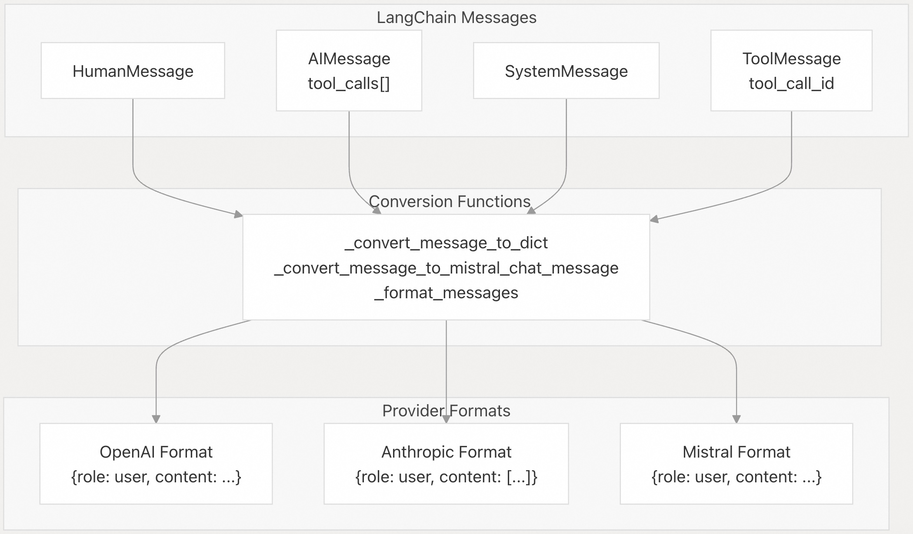
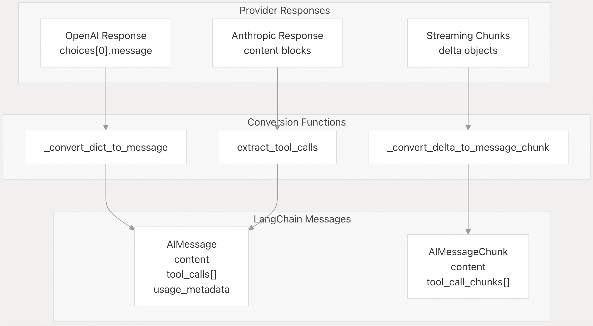
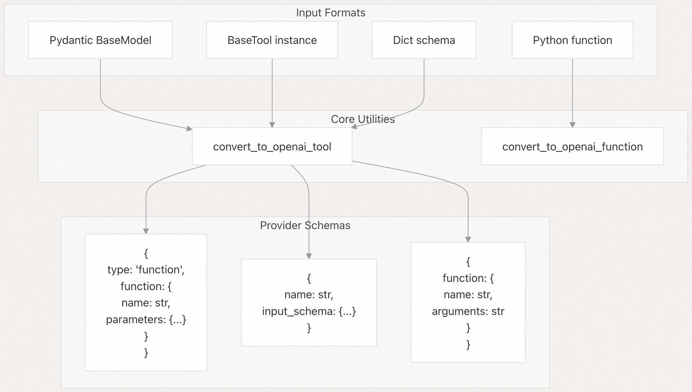
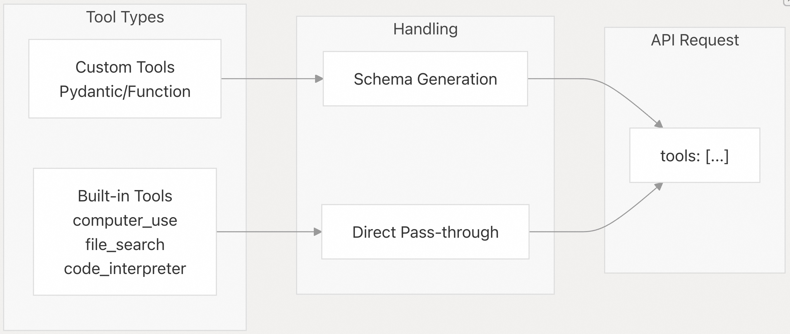
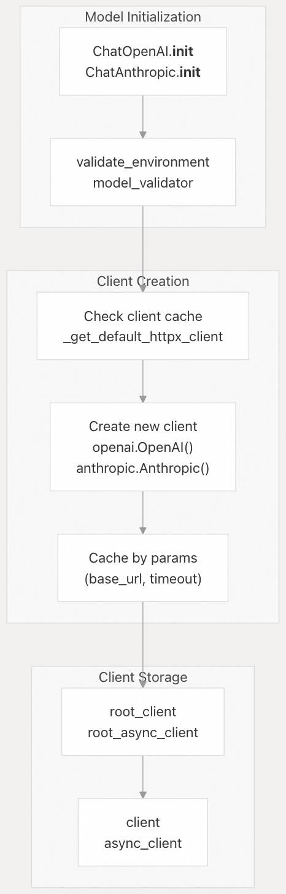
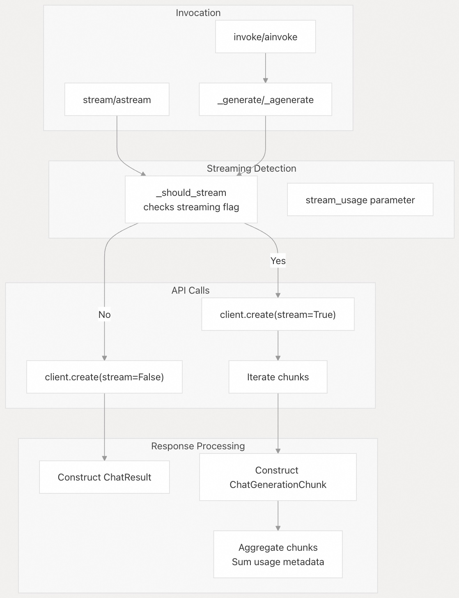
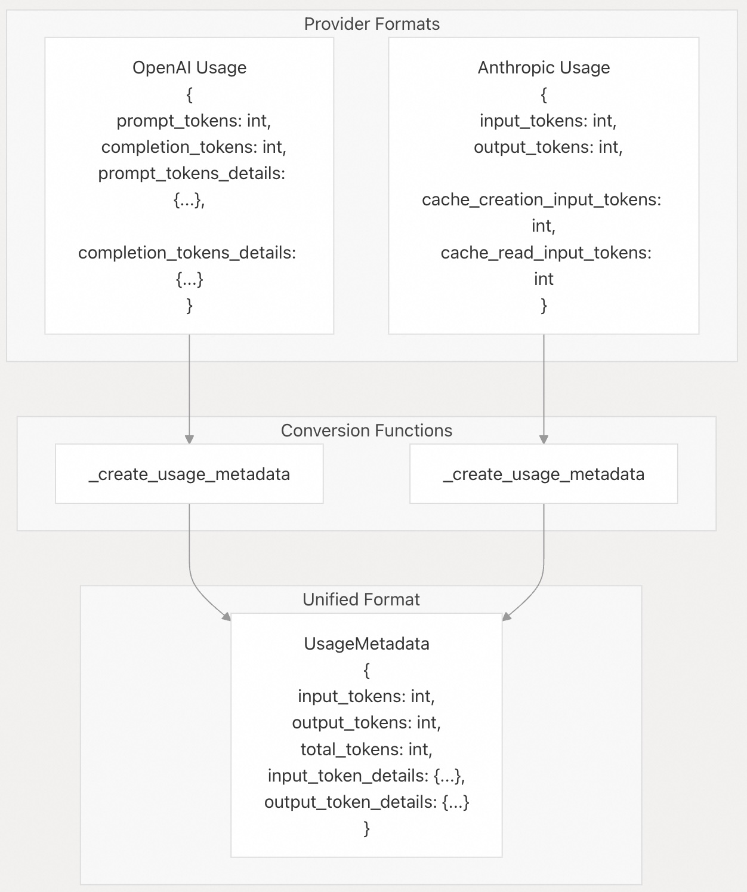
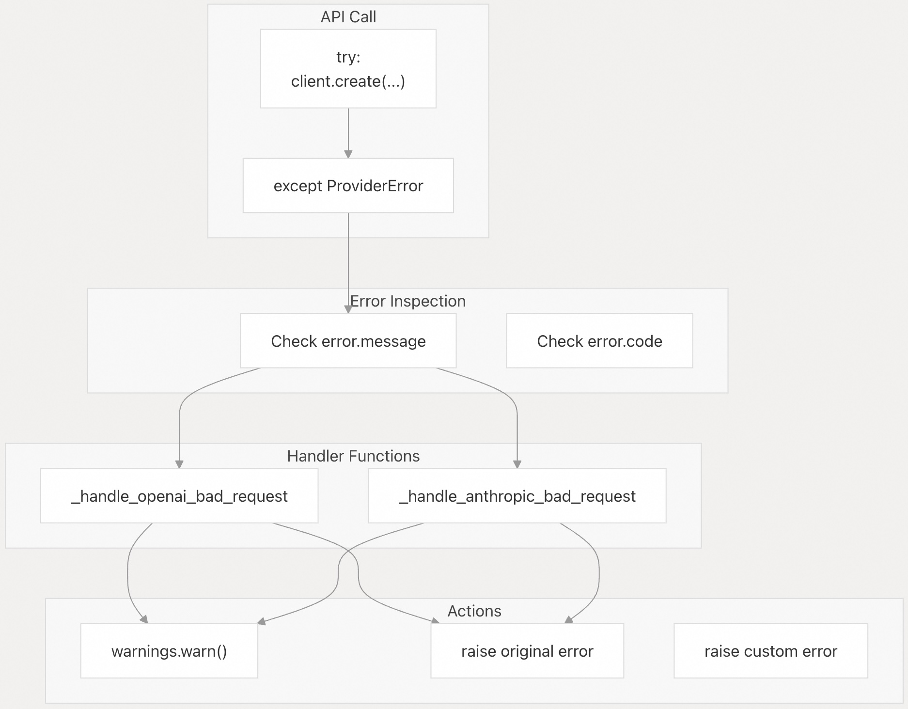
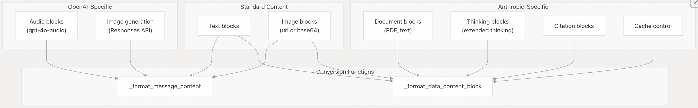
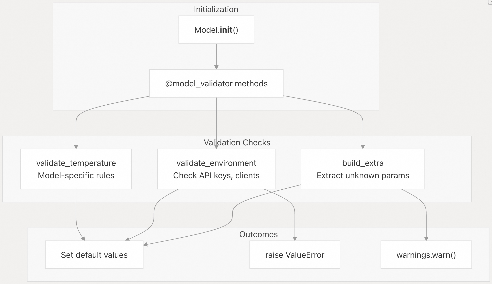

## LangChain 源码学习: 3.3 集成模式与架构（Integration Patterns and Architecture）                                     
                                                                        
### 作者                                                                
digoal                                                                
                                                                        
### 日期                                                                  
2025-10-20                                                                      
                                                                 
### 标签                                                                      
AI Agent , Powered by LLM , LangChain , 源码学习                                                                 
                                                                       
----                                                                   
                                                                   
## 背景                             
本文介绍 LangChain 各大模型提供商集成中常用的架构模式。这些模式在保持行为一致性的同时，也能适配各提供商特有的功能。    
  
## 消息转换管道  
  
所有聊天模型集成都实现了双向消息转换：    
- 从 LangChain 的 `BaseMessage` 格式转换为提供商特定格式（出站, Outbound）   
- 从提供商响应格式转换回 `BaseMessage`（入站, Inbound）    
  
这一转换主要通过两个核心函数完成，构成整个翻译层的基础。  
  
### 出站消息转换  
  
    
  
- **OpenAI 兼容模式**：    
  `BaseChatOpenAI` 中的 `_convert_message_to_dict` 函数负责所有 OpenAI 兼容提供商的消息转换。工具调用会被序列化到 `tool_calls` 字段中，并采用标准化结构：    
  [`libs/partners/openai/langchain_openai/chat_models/base.py`](https://github.com/langchain-ai/langchain/blob/e3fc7d8a/libs/partners/openai/langchain_openai/chat_models/base.py#L261-L338)  
  
- **Anthropic 模式**：    
  `_format_messages` 函数会合并连续的同类型消息，并处理包含图像、文档和工具结果在内的复杂内容块：    
  [`libs/partners/anthropic/langchain_anthropic/chat_models.py`](https://github.com/langchain-ai/langchain/blob/e3fc7d8a/libs/partners/anthropic/langchain_anthropic/chat_models.py#L171-L216)  
  [`libs/partners/anthropic/langchain_anthropic/chat_models.py`](https://github.com/langchain-ai/langchain/blob/e3fc7d8a/libs/partners/anthropic/langchain_anthropic/chat_models.py#L345-L557)  
  
- **Mistral 模式**：    
  `_convert_message_to_mistral_chat_message` 函数强制执行 Mistral 特有的约束，例如工具调用 ID 必须是 9 位字母数字组合：    
  [`libs/partners/mistralai/langchain_mistralai/chat_models.py`](https://github.com/langchain-ai/langchain/blob/e3fc7d8a/libs/partners/mistralai/langchain_mistralai/chat_models.py#L321-L381)  
  
### 入站消息转换  
  
    
  
入站转换负责提取工具调用、使用量元数据（usage metadata）和响应元数据，并对流式与非流式响应进行差异化处理：    
- [`libs/partners/openai/langchain_openai/chat_models/base.py`](https://github.com/langchain-ai/langchain/blob/e3fc7d8a/libs/partners/openai/langchain_openai/chat_models/base.py#L139-L203)  
- [`libs/partners/openai/langchain_openai/chat_models/base.py`](https://github.com/langchain-ai/langchain/blob/e3fc7d8a/libs/partners/openai/langchain_openai/chat_models/base.py#L341-L394)  
  
源文件:  
- libs/partners/openai/langchain_openai/chat_models/base.py  
- libs/partners/anthropic/langchain_anthropic/chat_models.py  
- libs/partners/mistralai/langchain_mistralai/chat_models.py  
  
## 工具 Schema 转换  
  
提供商集成会将 LangChain 的工具定义（来自 `BaseTool`、Pydantic 模型或普通函数）转换为提供商特定的 JSON Schema。该转换通常分为两个阶段：先转为 OpenAI 格式，再适配到具体提供商。  
  
### Schema 转换流程  
  
    
  
- **OpenAI 兼容格式**：    
  `langchain-core` 中的 `convert_to_openai_tool` 工具函数生成大多数提供商都能接受的基础 Schema 结构：    
  [`libs/partners/openai/langchain_openai/chat_models/base.py`](https://github.com/langchain-ai/langchain/blob/e3fc7d8a/libs/partners/openai/langchain_openai/chat_models/base.py#L89-L92)  
  
- **Anthropic 转换**：    
  Anthropic 使用结构类似但更简化的 Schema，通过 `convert_to_anthropic_tool` 实现：    
  [`libs/partners/anthropic/langchain_anthropic/chat_models.py`](https://github.com/langchain-ai/langchain/blob/e3fc7d8a/libs/partners/anthropic/langchain_anthropic/chat_models.py#L44-L44)  
  
- **Mistral 工具调用 ID 转换**：    
  Mistral 要求工具调用 ID 为 9 位字母数字格式，需通过哈希算法转换：    
  [`libs/partners/mistralai/langchain_mistralai/chat_models.py`](https://github.com/langchain-ai/langchain/blob/e3fc7d8a/libs/partners/mistralai/langchain_mistralai/chat_models.py#L103-L132)  
  
### 内置工具 vs 自定义工具  
  
    
  
OpenAI 与 Anthropic 支持提供商原生的内置工具，这类工具无需生成 Schema，可直接透传：    
- OpenAI：[`libs/partners/openai/langchain_openai/chat_models/base.py`](https://github.com/langchain-ai/langchain/blob/e3fc7d8a/libs/partners/openai/langchain_openai/chat_models/base.py#L128-L136)   
- Anthropic：[`libs/partners/anthropic/langchain_anthropic/chat_models.py`](https://github.com/langchain-ai/langchain/blob/e3fc7d8a/libs/partners/anthropic/langchain_anthropic/chat_models.py#L100-L121)  
  
源文件:  
- libs/partners/openai/langchain_openai/chat_models/base.py  
- libs/partners/anthropic/langchain_anthropic/chat_models.py  
- libs/partners/mistralai/langchain_mistralai/chat_models.py  
  
## 客户端初始化与缓存  
  
提供商集成在初始化 HTTP 客户端时，会谨慎使用缓存机制，避免重复创建连接池，同时允许自定义配置。  
  
### 客户端生命周期  
  
    
  
- **缓存策略**：    
  客户端根据配置参数（如 `base_url`、`timeout`）进行缓存，以便在多个模型实例间复用：    
  [`libs/partners/openai/langchain_openai/chat_models/base.py`](https://github.com/langchain-ai/langchain/blob/e3fc7d8a/libs/partners/openai/langchain_openai/chat_models/base.py#L98-L103)  
  
- **客户端层级结构**：    
  模型同时维护根客户端（如 `openai.OpenAI`）和作用域客户端（如 `client.chat.completions`）以访问 API：    
  [`libs/partners/openai/langchain_openai/chat_models/base.py`](https://github.com/langchain-ai/langchain/blob/e3fc7d8a/libs/partners/openai/langchain_openai/chat_models/base.py#L739-L844)  
  
- **Anthropic 客户端缓存**：    
  Anthropic 也实现了类似的缓存机制：    
  [`libs/partners/anthropic/tests/unit_tests/test_chat_models.py`](https://github.com/langchain-ai/langchain/blob/e3fc7d8a/libs/partners/anthropic/tests/unit_tests/test_chat_models.py#L56-L70)  
  
### 配置管理  
  
所有提供商集成遵循一致的配置模式：  
  
| 配置字段 | 类型 | 优先级来源 |  
|----------|------|-------------|  
| API 密钥 | `SecretStr` | 1. 构造函数参数   2. 环境变量 |  
| 基础 URL | `str` | 1. 构造函数参数   2. 环境变量   3. 默认值 |  
| 超时时间 | `float | tuple` | 构造函数参数或默认值 |  
| 最大重试次数 | `int` | 构造函数参数或默认值 |  
| HTTP 客户端 | `httpx.Client` | 自定义或自动生成 |  
  
相关实现：    
- OpenAI：[`libs/partners/openai/langchain_openai/chat_models/base.py`](https://github.com/langchain-ai/langchain/blob/e3fc7d8a/libs/partners/openai/langchain_openai/chat_models/base.py#L468-L496)  
- Anthropic：[`libs/partners/anthropic/langchain_anthropic/chat_models.py`](https://github.com/langchain-ai/langchain/blob/e3fc7d8a/libs/partners/anthropic/langchain_anthropic/chat_models.py#L396-L405)  
  
### 自定义 HTTP 客户端  
  
集成支持传入自定义的 `httpx.Client` 实例，以支持代理等高级配置：    
- [`libs/partners/openai/langchain_openai/chat_models/base.py`](https://github.com/langchain-ai/langchain/blob/e3fc7d8a/libs/partners/openai/langchain_openai/chat_models/base.py#L565-L571)  
- [`libs/partners/openai/langchain_openai/chat_models/base.py`](https://github.com/langchain-ai/langchain/blob/e3fc7d8a/libs/partners/openai/langchain_openai/chat_models/base.py#L791-L843)  
  
源文件:  
- libs/partners/openai/langchain_openai/chat_models/base.py  
- libs/partners/anthropic/langchain_anthropic/chat_models.py  
- libs/partners/openai/langchain_openai/chat_models/_client_utils.py  
- libs/partners/openai/tests/unit_tests/chat_models/test_base.py  
- libs/partners/anthropic/tests/unit_tests/test_chat_models.py  
  
## 流式 vs 非流式执行  
  
提供商集成对流式和非流式请求采用不同的执行路径，并谨慎处理使用量元数据的聚合。  
  
### 执行流程  
  
    
  
- **非流式**：直接调用 API，返回包含完整元数据的响应：    
  [`libs/partners/openai/langchain_openai/chat_models/base.py`](https://github.com/langchain-ai/langchain/blob/e3fc7d8a/libs/partners/openai/langchain_openai/chat_models/base.py#L1111-L1176)  
  
- **带使用量的流式响应**：OpenAI 支持 `stream_options={"include_usage": True}`，在最后一个数据块中包含使用量信息：    
  [`libs/partners/openai/langchain_openai/chat_models/base.py`](https://github.com/langchain-ai/langchain/blob/e3fc7d8a/libs/partners/openai/langchain_openai/chat_models/base.py#L1227-L1347)  
  
- **数据块聚合**：使用量元数据会在各数据块间累加，对嵌套字典（如 `completion_tokens_details`）有特殊处理：    
  [`libs/partners/openai/langchain_openai/chat_models/base.py`](https://github.com/langchain-ai/langchain/blob/e3fc7d8a/libs/partners/openai/langchain_openai/chat_models/base.py#L397-L423)  
  
### 流式使用量控制  
  
模型支持对流式响应中的使用量元数据进行细粒度控制：    
- [`libs/partners/openai/langchain_openai/chat_models/base.py`](https://github.com/langchain-ai/langchain/blob/e3fc7d8a/libs/partners/openai/langchain_openai/chat_models/base.py#L484-L496)  
  
测试验证了 `stream_usage` 可全局启用或按调用启用：    
- [`libs/partners/openai/tests/integration_tests/chat_models/test_base.py`](https://github.com/langchain-ai/langchain/blob/e3fc7d8a/libs/partners/openai/tests/integration_tests/chat_models/test_base.py#L284-L308)  
  
源文件:  
- libs/partners/openai/langchain_openai/chat_models/base.py  
- libs/partners/anthropic/langchain_anthropic/chat_models.py  
- libs/partners/mistralai/langchain_mistralai/chat_models.py  
- libs/partners/openai/tests/integration_tests/chat_models/test_base.py  
  
## 使用量元数据提取  
  
所有集成都会从提供商响应中提取 token 使用量，并转换为 LangChain 标准化的 `UsageMetadata` 格式。  
  
### 元数据结构  
  
    
  
- **OpenAI 元数据提取**：支持详细的 token 分类，包括推理 token 和缓存 token：    
  [`libs/partners/openai/langchain_openai/chat_models/base.py`](https://github.com/langchain-ai/langchain/blob/e3fc7d8a/libs/partners/openai/langchain_openai/chat_models/base.py#L1743-L1777)  
  
- **Anthropic 元数据提取**：将 Anthropic 的使用量格式映射到标准结构：    
  [`libs/partners/anthropic/langchain_anthropic/chat_models.py`](https://github.com/langchain-ai/langchain/blob/e3fc7d8a/libs/partners/anthropic/langchain_anthropic/chat_models.py#L1694-L1714)  
  
- **元数据附加**：    
  - 非流式：附加到 `AIMessage.usage_metadata`    
  - 流式：附加到最后一个 `AIMessageChunk`    
  [`libs/partners/openai/langchain_openai/chat_models/base.py`](https://github.com/langchain-ai/langchain/blob/e3fc7d8a/libs/partners/openai/langchain_openai/chat_models/base.py#L957-L958)  
  
源文件:  
- libs/partners/openai/langchain_openai/chat_models/base.py  
- libs/partners/anthropic/langchain_anthropic/chat_models.py  
- libs/partners/mistralai/langchain_mistralai/chat_models.py  
  
## 错误处理模式  
  
集成实现了针对特定提供商的错误处理逻辑，同时向用户保持一致的错误报告体验。  
  
### 错误处理器模式  
  
    
  
- **OpenAI 请求错误处理器**：对常见配置错误（如在不支持的模型上使用 `json_schema` 响应格式）给出友好警告：    
  [`libs/partners/openai/langchain_openai/chat_models/base.py`](https://github.com/langchain-ai/langchain/blob/e3fc7d8a/libs/partners/openai/langchain_openai/chat_models/base.py#L425-L447)  
  
- **Anthropic 请求错误处理器**：当仅提供系统消息时发出警告：    
  [`libs/partners/anthropic/langchain_anthropic/chat_models.py`](https://github.com/langchain-ai/langchain/blob/e3fc7d8a/libs/partners/anthropic/langchain_anthropic/chat_models.py#L560-L566)  
  
- **重试机制**：Mistral 集成为瞬时错误实现了自定义重试装饰器：    
  [`libs/partners/mistralai/langchain_mistralai/chat_models.py`](https://github.com/langchain-ai/langchain/blob/e3fc7d8a/libs/partners/mistralai/langchain_mistralai/chat_models.py#L92-L100)  
  [`libs/partners/mistralai/langchain_mistralai/chat_models.py`](https://github.com/langchain-ai/langchain/blob/e3fc7d8a/libs/partners/mistralai/langchain_mistralai/chat_models.py#L208-L230)  
  
源文件:  
- libs/partners/openai/langchain_openai/chat_models/base.py  
- libs/partners/anthropic/langchain_anthropic/chat_models.py  
- libs/partners/mistralai/langchain_mistralai/chat_models.py  
  
## 提供商特有功能  
  
在保持标准 `BaseChatModel` 接口的同时，各集成通过专用参数和内容处理方式暴露提供商特有能力。  
  
### 内容块处理  
  
不同提供商支持的文本以外的内容类型各不相同：  
  
    
  
- **OpenAI 音频内容**：支持音频输入/输出，并对多轮对话做特殊处理：    
  [`libs/partners/openai/langchain_openai/chat_models/base.py`](https://github.com/langchain-ai/langchain/blob/e3fc7d8a/libs/partners/openai/langchain_openai/chat_models/base.py#L303-L322)  
  
- **Anthropic 文档块**：支持多种文档格式，并自动检测来源类型：    
  [`libs/partners/anthropic/langchain_anthropic/chat_models.py`](https://github.com/langchain-ai/langchain/blob/e3fc7d8a/libs/partners/anthropic/langchain_anthropic/chat_models.py#L268-L316)  
  
- **Anthropic 思考块**：保留扩展思考内容和脱敏后的思考内容：    
  [`libs/partners/anthropic/langchain_anthropic/chat_models.py`](https://github.com/langchain-ai/langchain/blob/e3fc7d8a/libs/partners/anthropic/langchain_anthropic/chat_models.py#L476-L492)  
  
### API 特定参数  
  
集成在保持兼容性的同时暴露(expose)提供商专属参数：  
  
- **OpenAI Responses API**：为 Responses API 提供独立代码路径，输出格式不同：    
  [`libs/partners/openai/langchain_openai/chat_models/base.py`](https://github.com/langchain-ai/langchain/blob/e3fc7d8a/libs/partners/openai/langchain_openai/chat_models/base.py#L678-L684)  
  
- **Anthropic 提示缓存**：支持系统提示缓存和工具定义缓存：    
  [`libs/partners/anthropic/langchain_anthropic/chat_models.py`](https://github.com/langchain-ai/langchain/blob/e3fc7d8a/libs/partners/anthropic/langchain_anthropic/chat_models.py#L97-L98)  
  
- **推理参数**：OpenAI 为 o1/o3 模型支持“推理努力”（reasoning effort）参数：    
  [`libs/partners/openai/langchain_openai/chat_models/base.py`](https://github.com/langchain-ai/langchain/blob/e3fc7d8a/libs/partners/openai/langchain_openai/chat_models/base.py#L521-L542)  
  
源文件:  
- libs/partners/openai/langchain_openai/chat_models/base.py  
- libs/partners/anthropic/langchain_anthropic/chat_models.py  
  
## 配置验证  
  
集成实现了验证逻辑，用于尽早发现配置错误并强制执行提供商特定约束。  
  
### 验证流程  
  
    
  
- **温度参数验证**：o1/o3 模型仅支持 `temperature=1`：    
  [`libs/partners/openai/langchain_openai/chat_models/base.py`](https://github.com/langchain-ai/langchain/blob/e3fc7d8a/libs/partners/openai/langchain_openai/chat_models/base.py#L707-L737)  
  
- **环境配置验证**：检查必需的 API 密钥并验证客户端配置：    
  [`libs/partners/openai/langchain_openai/chat_models/base.py`](https://github.com/langchain-ai/langchain/blob/e3fc7d8a/libs/partners/openai/langchain_openai/chat_models/base.py#L739-L844)  
  
- **额外参数处理**：未知参数会被移至 `model_kwargs` 并发出警告：    
  - OpenAI：[`libs/partners/openai/langchain_openai/chat_models/base.py`](https://github.com/langchain-ai/langchain/blob/e3fc7d8a/libs/partners/openai/langchain_openai/chat_models/base.py#L707-L712)   
  - Anthropic：[`libs/partners/anthropic/tests/unit_tests/test_chat_models.py`](https://github.com/langchain-ai/langchain/blob/e3fc7d8a/libs/partners/anthropic/tests/unit_tests/test_chat_models.py#L188-L191)  
  
源文件:  
- libs/partners/openai/langchain_openai/chat_models/base.py  
- libs/partners/anthropic/langchain_anthropic/chat_models.py  
- libs/partners/anthropic/tests/unit_tests/test_chat_models.py  
      
#### [期望 PostgreSQL|开源PolarDB 增加什么功能?](https://github.com/digoal/blog/issues/76 "269ac3d1c492e938c0191101c7238216")
  
  
#### [PolarDB 开源数据库](https://openpolardb.com/home "57258f76c37864c6e6d23383d05714ea")
  
  
#### [PolarDB 学习图谱](https://www.aliyun.com/database/openpolardb/activity "8642f60e04ed0c814bf9cb9677976bd4")
  
  
#### [PostgreSQL 解决方案集合](../201706/20170601_02.md "40cff096e9ed7122c512b35d8561d9c8")
  
  
#### [德哥 / digoal's Github - 公益是一辈子的事.](https://github.com/digoal/blog/blob/master/README.md "22709685feb7cab07d30f30387f0a9ae")
  
  
#### [About 德哥](https://github.com/digoal/blog/blob/master/me/readme.md "a37735981e7704886ffd590565582dd0")
  
  

  
