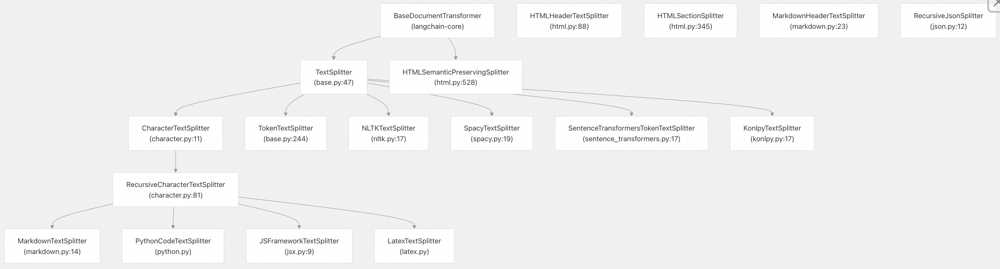
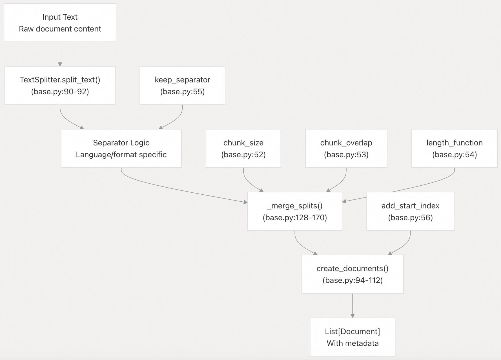
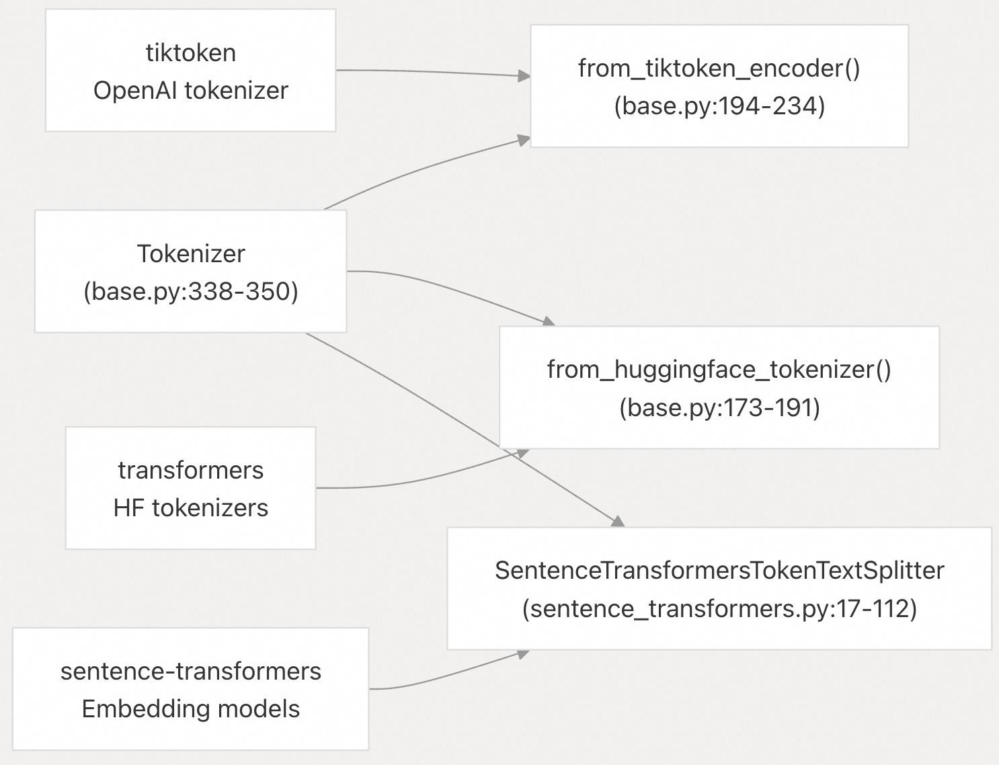
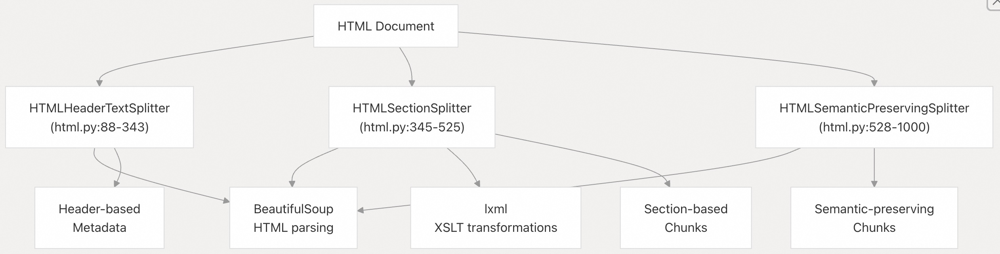
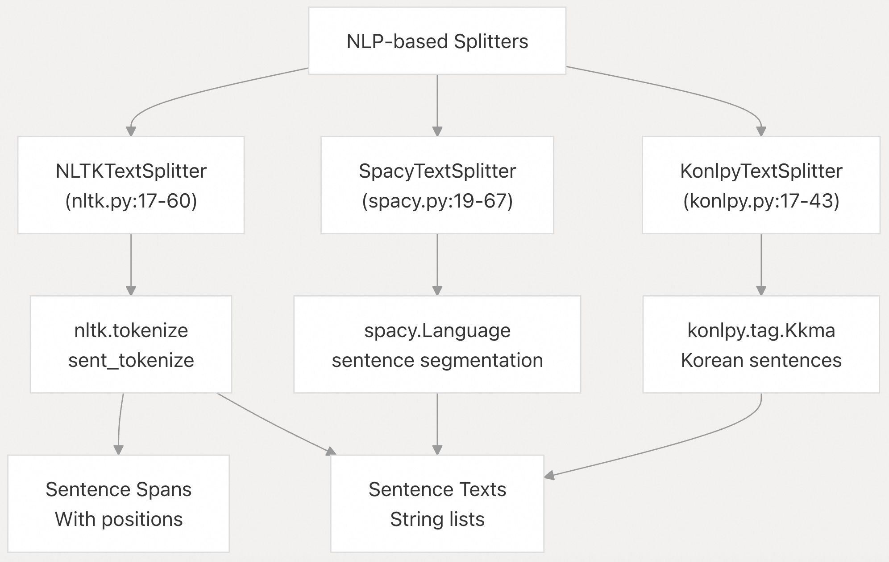

## LangChain 源码学习: 4.1 文本处理与文档处理                                     
                                                                          
### 作者                                                                  
digoal                                                                  
                                                                          
### 日期                                                                    
2025-10-20                                                                        
                                                                   
### 标签                                                                        
AI Agent , Powered by LLM , LangChain , 源码学习                                                                   
                                                                         
----                                                                     
                                                                     
## 背景                               
本文涵盖 LangChain 的文本处理与文档处理能力，特别是 `langchain-text-splitters` 包，该包提供了一系列工具，用于将文本智能地切分为便于 LLM 管理的片段，同时保留语义结构。  
  
## 目的与范围    
文本切分器（text splitters）包旨在解决为大语言模型（LLM）准备文本时的基本挑战：将大型文档切分为语义上有意义的片段，同时尊重上下文边界。该系统为各种文档格式提供统一的切分接口，在保持元数据关系的同时，支持基于 token、字符或语义边界的可配置切分策略。  
  
## 架构概览    
文本切分器的架构采用分层设计模式，包含可针对不同内容类型和切分策略进行特殊化(针对性)的基础抽象。  
  
### 核心类层次结构    
  
  
来源：    
- [`libs/text-splitters/langchain_text_splitters/__init__.py`](https://github.com/langchain-ai/langchain/blob/e3fc7d8a/libs/text-splitters/langchain_text_splitters/__init__.py#L1-L84)  
- [`libs/text-splitters/langchain_text_splitters/base.py`](https://github.com/langchain-ai/langchain/blob/e3fc7d8a/libs/text-splitters/langchain_text_splitters/base.py#L47-L243)  
- [`libs/text-splitters/langchain_text_splitters/character.py`](https://github.com/langchain-ai/langchain/blob/e3fc7d8a/libs/text-splitters/langchain_text_splitters/character.py#L11-L170)  
  
### 文本处理流水线    
  
  
来源：  
- [`libs/text-splitters/langchain_text_splitters/base.py`](https://github.com/langchain-ai/langchain/blob/e3fc7d8a/libs/text-splitters/langchain_text_splitters/base.py#L47-L171)  
  
## 核心抽象  
  
### TextSplitter 基类    
`TextSplitter` 类定义了所有文本切分操作的基础接口。它提供了对块大小、重叠管理(重叠指两个相邻的chunk之间给出一定的重叠内容, 让模型在语义层面可更好的处理上下文相关性.)以及元数据处理的配置支持。  
  
**关键方法与属性：**    
- `split_text(text: str) -> list[str]`：由子类实现的抽象方法    
- `create_documents()`：将文本块转换为带元数据的 `Document` 对象    
- `split_documents()`：处理已有的 `Document` 对象    
- `_merge_splits()`：将较小的片段合并为合适大小的块    
  
**配置参数：**    
- `chunk_size`：每个块的最大大小（默认：4000）    
- `chunk_overlap`：块之间重叠的字符数（默认：200）    
- `length_function`：用于度量块长度的函数（默认：`len`）    
- `keep_separator`：是否在块中保留分隔符    
- `add_start_index`：是否在文档元数据中包含起始位置    
  
来源：  
- [`libs/text-splitters/langchain_text_splitters/base.py`](https://github.com/langchain-ai/langchain/blob/e3fc7d8a/libs/text-splitters/langchain_text_splitters/base.py#L47-L243)  
  
### 分词器集成    
系统通过 `Tokenizer` 数据类及与主流分词库的集成，支持多种分词策略。    
  
  
  
来源：    
- [`libs/text-splitters/langchain_text_splitters/base.py`](https://github.com/langchain-ai/langchain/blob/e3fc7d8a/libs/text-splitters/langchain_text_splitters/base.py#L173-L234)  
- [`libs/text-splitters/langchain_text_splitters/sentence_transformers.py`](https://github.com/langchain-ai/langchain/blob/e3fc7d8a/libs/text-splitters/langchain_text_splitters/sentence_transformers.py#L17-L112)  
  
## 文本切分策略  
  
### 基于字符的切分  
  
#### CharacterTextSplitter    
最简单的切分器，根据指定的分隔字符或字符串分割文本。支持正则表达式分隔符及可配置的分隔符处理方式。  
  
**主要特性：**    
- 可自定义分隔符（默认为换行符 `"\n"`）    
- `is_separator_regex`：指定分隔符是否为正则表达式    
- `keep_separator`：是否在切分好的 chunk 中保留分隔符    
  
来源：  
- [`libs/text-splitters/langchain_text_splitters/character.py`](https://github.com/langchain-ai/langchain/blob/e3fc7d8a/libs/text-splitters/langchain_text_splitters/character.py#L11-L52)  
  
#### RecursiveCharacterTextSplitter    
一种更复杂的策略，按优先级顺序尝试多个分隔符，递归切分直到块大小满足要求。  
  
**默认分隔符层级：**  `["\n\n", "\n", " ", ""]`  
- `"\n\n"` → `"\n"` → `" "` → `""`  
  
通过 `from_language()` 类方法，还支持针对编程语言（如 Python、JavaScript、Java、Go 等）的专用分隔符配置。  
  
来源：    
- [`libs/text-splitters/langchain_text_splitters/character.py`](https://github.com/langchain-ai/langchain/blob/e3fc7d8a/libs/text-splitters/langchain_text_splitters/character.py#L81-L170)  
- [`libs/text-splitters/langchain_text_splitters/character.py`](https://github.com/langchain-ai/langchain/blob/e3fc7d8a/libs/text-splitters/langchain_text_splitters/character.py#L172-L586)  
  
### 基于 Token 的切分  
  
#### TokenTextSplitter    
根据 token 数量而非字符数量切分文本，使用可配置的分词器实现精确的 token 边界管理。  
  
**与主流分词库集成：**    
- **tiktoken** : OpenAI's tokenizer（`encoding_name`、`model_name` 参数）    
- **transformers** : HuggingFace tokenizers  
- **sentence-transformers** : Embedding model tokenizers  
  
来源：  
- [`libs/text-splitters/langchain_text_splitters/base.py`](https://github.com/langchain-ai/langchain/blob/e3fc7d8a/libs/text-splitters/langchain_text_splitters/base.py#L244-L304)  
  
## 特定格式的切分器  
  
### HTML 处理    
HTML 切分器提供多种策略，在保留语义结构的同时处理 HTML 文档。  
  
  
  
#### HTMLHeaderTextSplitter    
根据 HTML 标题标签（如 `h1`、`h2` 等）切分内容，并生成反映文档结构的层级元数据。  
  
**配置项：**    
- `headers_to_split_on`：指定含 `(tag, metadata_key)` 的元组(tuples) list  
- `return_each_element`：是否返回单个元素或聚合内容    
  
来源：  
- [`libs/text-splitters/langchain_text_splitters/html.py`](https://github.com/langchain-ai/langchain/blob/e3fc7d8a/libs/text-splitters/langchain_text_splitters/html.py#L88-L343)  
  
#### HTMLSemanticPreservingSplitter    
在保留完整 HTML 元素的同时，将其转换为类似 Markdown 的格式。支持为特定标签(tag)设置自定义处理器，并保持语义完整性。  
  
**特性：**    
- 保留表格(tables)、列表(lists)和其他结构化元素  
- 将链接(links)转换为 Markdown 格式  
- 通过参数 `custom_handlers` 自定义标签(tag)处理程序  
- 图像和媒体保留选项  
  
来源：  
- [`libs/text-splitters/langchain_text_splitters/html.py`](https://github.com/langchain-ai/langchain/blob/e3fc7d8a/libs/text-splitters/langchain_text_splitters/html.py#L528-L1000)  
  
### Markdown 处理  
  
#### MarkdownHeaderTextSplitter    
通过识别 Markdown 标题（如 `#`、`##`）来处理文档，并构建层级元数据结构。支持标准及自定义标题模式。  
  
**核心能力：**    
- 标题层次结构跟踪, 自动提取标题层级    
- 代码块检测和保存, 生成结构化元数据   
- 自定义标题模式支持  
- 可配置的标题剥离  
  
来源：  
- [`libs/text-splitters/langchain_text_splitters/markdown.py`](https://github.com/langchain-ai/langchain/blob/e3fc7d8a/libs/text-splitters/langchain_text_splitters/markdown.py#L23-L267)  
  
#### ExperimentalMarkdownSyntaxTextSplitter    
增强型 Markdown 处理器，在保留原始空白字符的同时提取结构化元数据，包括标题、代码块和水平线等。  
  
来源：  
- [`libs/text-splitters/langchain_text_splitters/markdown.py`](https://github.com/langchain-ai/langchain/blob/e3fc7d8a/libs/text-splitters/langchain_text_splitters/markdown.py#L284-L500)  
  
### 代码专用切分器  
  
#### 编程语言感知切分    
通过 `RecursiveCharacterTextSplitter.from_language()` 方法，为编程语言提供专用分隔符：  
  
| 语言       | 关键分隔符                     | 类/函数边界       |  
|------------|-------------------------------|------------------|  
| Python     | `\nclass `, `\ndef `, `\tdef ` | 类和函数         |  
| JavaScript | `\nfunction `, `\nconst `, `\nclass ` | 函数和声明       |  
| Java       | `\nclass `, `\npublic `, `\nprivate ` | 类和方法         |  
| Go         | `\nfunc `, `\ntype `, `\nvar ` | 函数和类型       |  
  
来源：  
- [`libs/text-splitters/langchain_text_splitters/character.py`](https://github.com/langchain-ai/langchain/blob/e3fc7d8a/libs/text-splitters/langchain_text_splitters/character.py#L154-L586)  
  
#### JSFrameworkTextSplitter    
专为 React、Vue 和 Svelte 代码设计的切分器，动态提取组件标签并将其用作切分边界。  
  
**处理流程：**   
- 使用正则表达式提取组件标签：`r"<\s*([a-zA-Z0-9]+)[^>]*>"`  
- 创建基于组件的分隔符  
- 与 JavaScript 语法分隔符结合  
- 应用递归切分策略  
  
来源：  
- [`libs/text-splitters/langchain_text_splitters/jsx.py`](https://github.com/langchain-ai/langchain/blob/e3fc7d8a/libs/text-splitters/langchain_text_splitters/jsx.py#L9-L103)  
  
### JSON 处理  
  
#### RecursiveJsonSplitter    
处理 JSON 文档，在切分为可管理块的同时保留层级结构。  
  
**特性：**    
- 嵌套结构保留  
- 可配置的块大小阈值  
- 列表到字典的转换选项  
- 基于路径的值设置  
  
**关键方法：**    
- `split_json()`：返回 JSON 字典列表    
- `split_text()`：返回 JSON 字符串列表    
- `_list_to_dict_preprocessing()`：将数组预处理为索引字典    
  
来源：  
- [`libs/text-splitters/langchain_text_splitters/json.py`](https://github.com/langchain-ai/langchain/blob/e3fc7d8a/libs/text-splitters/langchain_text_splitters/json.py#L12-L155)  
  
## 基于 NLP 的切分器  
  
### 句子级切分(Sentence-Level Splitting)   
系统提供多种句子感知(sentence-aware)的切分策略：  
  
  
  
#### NLTKTextSplitter    
使用 NLTK 的句子分词功能，支持 span 分词以保留原始文本位置。  
  
**配置项：**    
- `language`：句子检测语言（默认："english"）    
- `use_span_tokenize`：返回位置区间(position spans)而非文本片段(text segments)   
  
来源：  
- [`libs/text-splitters/langchain_text_splitters/nltk.py`](https://github.com/langchain-ai/langchain/blob/e3fc7d8a/libs/text-splitters/langchain_text_splitters/nltk.py#L17-L60)  
  
#### SpacyTextSplitter    
利用 spaCy 的句子分割功能，支持可配置的流水线选择。  
  
**选项：**    
- `pipeline`：spaCy 模型名称或使用 "sentencizer" 实现更快处理    
- `max_length`：spaCy 处理的最大文本长度    
- `strip_whitespace`：空白字符处理配置    
  
来源：  
- [`libs/text-splitters/langchain_text_splitters/spacy.py`](https://github.com/langchain-ai/langchain/blob/e3fc7d8a/libs/text-splitters/langchain_text_splitters/spacy.py#L19-L67)  
  
## 文档集成  
  
### 文档创建与元数据    
文本切分器与 LangChain 的 `Document` 对象无缝集成，在整个切分过程中保留并增强元数据：  
  
| 元数据字段       | 用途                         | 来源                     |  
|------------------|------------------------------|--------------------------|  
| `start_index`    | 原始文本中的字符位置         | `add_start_index=True`   |  
| 标题层级(Header hierarchy)         | 来自 HTML/Markdown 的结构    | 标题切分器               |  
| 自定义元数据     | 用户提供的文档属性           | `metadatas` 参数         |  
  
`create_documents()` 方法负责元数据传播，并可添加位置信息以实现块的可追溯性。  
  
来源：  
- [`libs/text-splitters/langchain_text_splitters/base.py`](https://github.com/langchain-ai/langchain/blob/e3fc7d8a/libs/text-splitters/langchain_text_splitters/base.py#L94-L112)  
  
### 批量处理    
所有切分器均通过 `split_documents()` 方法支持批量处理，可在保留各文档元数据上下文的同时处理多个 `Document` 对象。  
  
来源：  
- [`libs/text-splitters/langchain_text_splitters/base.py`](https://github.com/langchain-ai/langchain/blob/e3fc7d8a/libs/text-splitters/langchain_text_splitters/base.py#L114-L120)  
  
## 配置与优化  
  
### 块大小(chunk size)策略    
最佳块大小取决于目标 LLM 的上下文窗口和具体用例。  
- 小块（200-500 个标记(tokens)）：更适合精确检索、语义搜索  
- 中等块（500-1000 个标记(tokens)）：适用于大多数应用程序的平衡方法  
- 大块（1000+ 个标记(tokens)）：更好的上下文保存，更少的 API 调用  
  
### 重叠(Overlap)管理    
块重叠(Overlap)确保边界处的上下文连续性。`_merge_splits()` 方法通过以下方式处理重叠：    
- 在不超过 `chunk_size` 限制的前提下，将前一块的末尾部分复制到下一块开头    
  
来源：  
- [`libs/text-splitters/langchain_text_splitters/base.py`](https://github.com/langchain-ai/langchain/blob/e3fc7d8a/libs/text-splitters/langchain_text_splitters/base.py#L128-L170)  
  
### 性能考量    
- Character-based splitters：最快，适用于简单文本  
- Token-based splitters：更准确，更符合 LLM 兼容性，但速度较慢  
- NLP-based splitters：语义边界最准确，速度最慢  
- Format-specific splitters：针对结构化(如json, 代码, html等)内容保存进行了优化  
  
该包包含全面的测试覆盖，展示了在不同配置和边界情况下的预期行为。  
  
来源：  
- [`libs/text-splitters/tests/unit_tests/test_text_splitters.py`](https://github.com/langchain-ai/langchain/blob/e3fc7d8a/libs/text-splitters/tests/unit_tests/test_text_splitters.py#L1-L2000)  
      
#### [期望 PostgreSQL|开源PolarDB 增加什么功能?](https://github.com/digoal/blog/issues/76 "269ac3d1c492e938c0191101c7238216")
  
  
#### [PolarDB 开源数据库](https://openpolardb.com/home "57258f76c37864c6e6d23383d05714ea")
  
  
#### [PolarDB 学习图谱](https://www.aliyun.com/database/openpolardb/activity "8642f60e04ed0c814bf9cb9677976bd4")
  
  
#### [PostgreSQL 解决方案集合](../201706/20170601_02.md "40cff096e9ed7122c512b35d8561d9c8")
  
  
#### [德哥 / digoal's Github - 公益是一辈子的事.](https://github.com/digoal/blog/blob/master/README.md "22709685feb7cab07d30f30387f0a9ae")
  
  
#### [About 德哥](https://github.com/digoal/blog/blob/master/me/readme.md "a37735981e7704886ffd590565582dd0")
  
  

  
