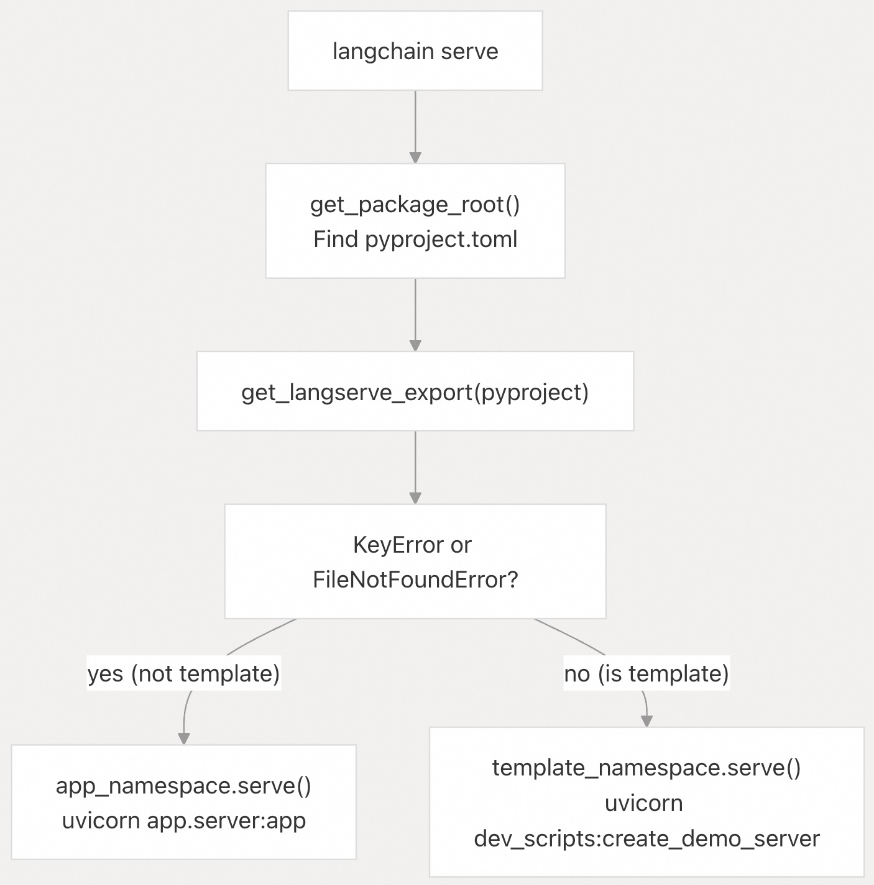

## LangChain 源码学习: 4.2 CLI 与项目脚手架 (CLI and Project Scaffolding)                                    
                                                                            
### 作者                                                                    
digoal                                                                    
                                                                            
### 日期                                                                      
2025-10-20                                                                          
                                                                     
### 标签                                                                          
AI Agent , Powered by LLM , LangChain , 源码学习                                                                     
                                                                           
----                                                                       
                                                                       
## 背景                                 
`langchain-cli` 包提供了一套命令行工具，用于脚手架搭建、开发和管理 LangChain 项目。它支持四种主要工作流：  
- 1. **创建和管理 LangServe 应用**，支持基于 Git 的模板安装；    
- 2. **开发可复用的链（chain）模板**；    
- 3. **脚手架生成合作伙伴集成包**，并自动进行命名转换；    
- 4. **生成代码现代化(code modernization)所需的迁移脚本**。  
  
**来源**：  
- [`libs/cli/pyproject.toml`](https://github.com/langchain-ai/langchain/blob/e3fc7d8a/libs/cli/pyproject.toml#L1-L111)  
- [`libs/cli/langchain_cli/cli.py`](https://github.com/langchain-ai/langchain/blob/e3fc7d8a/libs/cli/langchain_cli/cli.py#L1-L89)  
  
## CLI 架构与命令结构  
CLI 基于 `typer` 框架构建，提供单一入口点（`langchain` 或 `langchain-cli`），包含四个命名空间（子命令），每个命名空间负责开发流程中的不同方面。  
  
    
  
根级别的 `serve` 命令具有**多态行为**：它会检测当前目录是否包含模板包或 LangServe 应用（通过尝试从 `pyproject.toml` 中加载 `tool.langserve` 配置），然后路由到对应命名空间的 `serve` 实现。  
  
**来源**：  
- [`libs/cli/langchain_cli/cli.py`](https://github.com/langchain-ai/langchain/blob/e3fc7d8a/libs/cli/langchain_cli/cli.py#L1-L89)  
- [`libs/cli/pyproject.toml`](https://github.com/langchain-ai/langchain/blob/e3fc7d8a/libs/cli/pyproject.toml#L30-L33)  
  
## App 命名空间：LangServe 应用管理  
  
`app` 命名空间通过基于项目的工作流管理 LangServe 应用。这些应用本质上是 FastAPI 项目，包含一个 `packages/` 目录，用于存放从 Git 获取的模板。  
  
### 命令概览  
  
| 命令 | 用途 | 修改的关键文件 |  
|------|------|----------------|  
| `app new` | 创建新的 LangServe 应用 | `pyproject.toml`、`README.md`、`app/server.py` |  
| `app add` | 从 Git 仓库添加模板 | `packages/*`、`pyproject.toml` |  
| `app remove` | 从应用中移除模板 | 删除 `packages/` 中的内容 |  
| `app serve` | 启动 uvicorn 开发服务器 | 无（仅运行时） |  
  
**来源**：  
- [`libs/cli/langchain_cli/namespaces/app.py`](https://github.com/langchain-ai/langchain/blob/e3fc7d8a/libs/cli/langchain_cli/namespaces/app.py#L1-L372)  
  
### 应用创建流程  
  
`app new` 命令会复制 `project_template` 目录，并执行名称替换。  
  
    
  
生成的应用结构如下：  
- `app/server.py`：包含 LangServe 路由的 FastAPI 应用    
- `packages/`：存放从 Git 获取的模板    
- `pyproject.toml`：包含本地可编辑依赖的 Poetry 配置    
- `README.md`：使用说明    
  
**来源**：  
- [`libs/cli/langchain_cli/namespaces/app.py`](https://github.com/langchain-ai/langchain/blob/e3fc7d8a/libs/cli/langchain_cli/namespaces/app.py#L36-L125)  
  
### 基于 Git 的模板系统  
  
`app add` 命令解析依赖字符串、克隆 Git 仓库，并将模板作为可编辑包安装。依赖解析器支持多种格式：  
  
| 格式 | 示例 | 说明 |  
|------|------|------|  
| Simple name | `extraction-openai-functions` | 使用默认仓库/分支 |  
| Git SSH | `git+ssh://git@github.com/user/repo.git` | 自定义仓库 |  
| Git HTTPS | `git+https://github.com/user/repo.git#branch` | 指定分支或引用 |  
| Subdirectory | `git+https://...#subdirectory=path` | 模板位于子目录中 |  
  
    
  
缓存策略使用 `{gitstring}:{ref}` 的 SHA256 哈希值生成目录名，例如：`langchain_ai_langchain_abc12345/` 位于 `~/.langchain/git_repos/` 中, 这样可避免在多个项目中重复克隆同一仓库。  
  
**来源**：  
- [`libs/cli/langchain_cli/namespaces/app.py`](https://github.com/langchain-ai/langchain/blob/e3fc7d8a/libs/cli/langchain_cli/namespaces/app.py#L128-L301)  
- [`libs/cli/langchain_cli/utils/git.py`](https://github.com/langchain-ai/langchain/blob/e3fc7d8a/libs/cli/langchain_cli/utils/git.py#L1-L254)  
  
### LangServe 导出配置  
  
模板必须在 `pyproject.toml` 中定义 `tool.langserve` 部分(section)。    
```  
[tool.langserve]  
export_module = "my_template"  
export_attr = "chain"  
```  
  
`get_langserve_export()` 工具函数会提取该配置，用于生成导入语句和路由代码。  
```  
from {export_module} import {export_attr} as {chain_name}  
add_routes(app, {chain_name}, path="/{package_name}")  
```  
  
**来源**：  
- [`libs/cli/langchain_cli/utils/packages.py`](https://github.com/langchain-ai/langchain/blob/e3fc7d8a/libs/cli/langchain_cli/utils/packages.py#L39-L76)  
- [`libs/cli/langchain_cli/namespaces/app.py`](https://github.com/langchain-ai/langchain/blob/e3fc7d8a/libs/cli/langchain_cli/namespaces/app.py#L262-L300)  
  
### 依赖字符串解析细节  
  
`parse_dependency_string()` 函数使用状态机解析复杂的 Git URL，能处理以下边界情况：  
  
    
  
- SSH URL 中使用冒号（`git@github.com:user/repo`）与斜杠（`git@github.com/user/repo`）的区别    
- `@` 符号既用于身份认证（如 `git@`），也用于指定引用（如 `@branch`）  
  
**来源**：  
- [`libs/cli/langchain_cli/utils/git.py`](https://github.com/langchain-ai/langchain/blob/e3fc7d8a/libs/cli/langchain_cli/utils/git.py#L34-L128)  
  
## Template 命名空间：链模板  
  
`template` 命名空间提供用于开发可复用链模板(reusable chain templates)的命令，这些模板可通过 Git 分发，并由 `app add` 消费。  
  
### 模板包结构  
  
`template new` 命令从 `package_template/` 目录生成模板包.  
  
    
  
脚手架模板包含：  
- `{module_name}/`：包含 `chain.py` 的 Python 包    
- `pyproject.toml`：含 `tool.langserve` 配置    
- `README.md`：集成说明    
- `__init__.py`：链的导出接口    
  
**来源**：  
- [`libs/cli/langchain_cli/namespaces/template.py`](https://github.com/langchain-ai/langchain/blob/e3fc7d8a/libs/cli/langchain_cli/namespaces/template.py#L18-L85)  
  
### 模板开发服务器  
  
`template serve` 命令启动一个开发服务器，支持三种模式：  
  
| 模式 | 标志(flag) | 脚本 |  
|------|------|------|  
| 默认 | 无 | `create_demo_server` |  
| 可配置 | `--configurable` | `create_demo_server_configurable` |  
| 聊天游乐场(Chat playground) | `--chat-playground` | `create_demo_server_chat` |  
  
每种模式都会动态导入当前包中的链，并创建一个 FastAPI 应用。  
```  
# From dev_scripts.py  
package = get_langserve_export(pyproject)  
mod = __import__(package["module"], fromlist=[package["attr"]])  
chain = getattr(mod, package["attr"])  
add_routes(app, chain, config_keys=config_keys, playground_type=playground_type)  
```  
  
**来源**：  
- [`libs/cli/langchain_cli/namespaces/template.py`](https://github.com/langchain-ai/langchain/blob/e3fc7d8a/libs/cli/langchain_cli/namespaces/template.py#L87-L140)  
- [`libs/cli/langchain_cli/dev_scripts.py`](https://github.com/langchain-ai/langchain/blob/e3fc7d8a/libs/cli/langchain_cli/dev_scripts.py#L1-L71)  
  
## Integration 命名空间：合作伙伴集成包脚手架  
  
`integration` 命名空间用于按照 LangChain 规范脚手架生成完整的合作伙伴集成包，支持两种工作流：完整包创建和组件级脚手架。  
  
### 名称转换系统  
  
`_process_name()` 函数将用户输入转换为多种命名规范。  
  

  
例如输入 `my-integration` 时：  
  
| 占位符 | 值 | 用途 |  
|--------|-----|------|  
| `__package_name__` | `langchain-my-integration` | PyPI 包名 |  
| `__module_name__` | `langchain_my_integration` | Python 导入路径 |  
| `__ModuleName__` | `MyIntegration` | 类名前缀 |  
| `__MODULE_NAME__` | `MY_INTEGRATION` | 常量名 |  
| `__package_name_short__` | `my-integration` | URL、路径 |  
| `__package_name_short_snake__` | `my_integration` | 文件名 |  
  
**来源**：  
- [`libs/cli/langchain_cli/namespaces/integration.py`](https://github.com/langchain-ai/langchain/blob/e3fc7d8a/libs/cli/langchain_cli/namespaces/integration.py#L29-L56)  
  
### 完整包脚手架  
  
不带 `--src`/`--dst` 参数的 `integration new` 命令会创建一个完整包.  
  
   
  
模板包含：  
- 聊天模型、LLM、嵌入、向量存储（可选）  
- 继承自 `BaseStandardTests` 的标准测试  
- 具有依赖关系组的 `pyproject.toml`  
- 文档模板  
- GitHub Actions workflows  
  
**来源**：  
- [`libs/cli/langchain_cli/namespaces/integration.py`](https://github.com/langchain-ai/langchain/blob/e3fc7d8a/libs/cli/langchain_cli/namespaces/integration.py#L60-L150)  
  
### 组件级脚手架  
  
使用 `--src` 和 `--dst` 参数可在现有包中添加单个组件。    
```  
# Example: Add chat model to existing package  
langchain integration new my-integration \  
  --src integration_template/chat_models.py \  
  --dst langchain_my_integration/chat_models.py  
```  
  
若省略 `--dst`，CLI 会根据 `--src` 自动计算目标路径，保持相对目录结构。  
  
`create_doc` 命令是专门用于生成文档的封装命令。  
  
   
  
**来源**：  
- [`libs/cli/langchain_cli/namespaces/integration.py`](https://github.com/langchain-ai/langchain/blob/e3fc7d8a/libs/cli/langchain_cli/namespaces/integration.py#L151-L261)  
  
### 模板替换机制  
  
`replace_file()` 和 `replace_glob()` 工具函数在文件内容和路径中执行字符串替换，  
```  
# From utils/find_replace.py (inferred from usage)  
replacements = {  
    "__package_name__": "langchain-openai",  
    "__module_name__": "langchain_openai",  
    "__ModuleName__": "OpenAI",  
}  
replace_glob(dest_dir, "**/*", replacements)  
```  
  
例如：  
- 文件内容替换  
- 文件名替换（ 例如 `__module_name__.py` → `langchain_openai.py` ）  
- 目录名称替换  
  
**来源**：  
- [`libs/cli/langchain_cli/namespaces/integration.py`](https://github.com/langchain-ai/langchain/blob/e3fc7d8a/libs/cli/langchain_cli/namespaces/integration.py#L113-L127)  
- [`libs/cli/langchain_cli/namespaces/integration.py`](https://github.com/langchain-ai/langchain/blob/e3fc7d8a/libs/cli/langchain_cli/namespaces/integration.py#L186-L188)  
  
## Migrate 命名空间：代码迁移脚本生成  
  
`migrate` 命名空间通过内省 Python 包，自动生成迁移脚本，检测类和函数的移动，并输出 JSON 映射和 Grit 模式文件用于代码重构。  
  
### 迁移生成策略  
  
系统支持三种策略（略，详见源码）。  
  
   
  
**来源**：  
- [`libs/cli/scripts/generate_migrations.py`](https://github.com/langchain-ai/langchain/blob/e3fc7d8a/libs/cli/scripts/generate_migrations.py#L1-L136)  
- [`libs/cli/langchain_cli/namespaces/migrate/generate/generic.py`](https://github.com/langchain-ai/langchain/blob/e3fc7d8a/libs/cli/langchain_cli/namespaces/migrate/generate/generic.py#L1-L183)  
- [`libs/cli/langchain_cli/namespaces/migrate/generate/partner.py`](https://github.com/langchain-ai/langchain/blob/e3fc7d8a/libs/cli/langchain_cli/namespaces/migrate/generate/partner.py#L1-L54)  
  
### 模块内省流程  
  
通用迁移生成器(generic migration generator)使用 `pkgutil.walk_packages()` 遍历模块层级，检测如下的导入关系：  
  
   
  
```python  
langchain.chains.SomeChain → langchain_community.chains.some_chain.SomeChain  
```  
  
通过检查 `SomeChain.__module__` 是否以 `"langchain_community"` 开头来判断。  
  
**来源**：  
- [`libs/cli/langchain_cli/namespaces/migrate/generate/generic.py`](https://github.com/langchain-ai/langchain/blob/e3fc7d8a/libs/cli/langchain_cli/namespaces/migrate/generate/generic.py#L9-L73)  
  
### 顶层导入简化 (Top-Level Import Simplification)  
  
`generate_top_level_imports()` 函数扫描 `__init__.py` 文件，查找简化的导入路径。    
```  
# If langchain_community/chat_models/openai.py defines ChatOpenAI  
# And langchain_community/chat_models/__init__.py has:  
#   from .openai import ChatOpenAI  
# Then mapping is:  
#   langchain_community.chat_models.openai.ChatOpenAI  
#   → langchain_community.chat_models.ChatOpenAI  
```  
  
`generate_simplified_migrations()` 将原始迁移与顶层简化合并，生成最终映射。  
  
**来源**：  
- [`libs/cli/langchain_cli/namespaces/migrate/generate/generic.py`](https://github.com/langchain-ai/langchain/blob/e3fc7d8a/libs/cli/langchain_cli/namespaces/migrate/generate/generic.py#L75-L183)  
  
### 合作伙伴包检测  
  
合作伙伴迁移策略查找继承自核心抽象类的类.   
```  
# From partner.py  
classes_ = find_subclasses_in_module(  
    package,  
    [  
        BaseLanguageModel,  
        Embeddings,  
        BaseRetriever,  
        VectorStore,  
        BaseDocumentTransformer,  
        BaseDocumentCompressor,  
    ],  
)  
```  
  
然后与社区包中的类匹配，生成类似以下的迁移规则：  
```  
langchain_community.chat_models.openai.ChatOpenAI → langchain_openai.ChatOpenAI  
```  
  
**来源**：  
- [`libs/cli/langchain_cli/namespaces/migrate/generate/partner.py`](https://github.com/langchain-ai/langchain/blob/e3fc7d8a/libs/cli/langchain_cli/namespaces/migrate/generate/partner.py#L21-L54)  
  
### 输出格式  
  
迁移系统支持两种输出格式：  
  
| 格式 | 文件 | 结构 |  
|------|------|------|  
| JSON | `.json` | `[["old.path.Class", "new.path.Class"], ...]` |  
| Grit | `.grit` | 用于自动重构的 GritQL 模式 |  
  
Grit 输出使用 `gritql` 库生成转换模式。  
```  
# Example Grit pattern (simplified)  
`from old.path import Class` => `from new.path import Class`  
```  
  
**来源**：  
- [`libs/cli/scripts/generate_migrations.py`](https://github.com/langchain-ai/langchain/blob/e3fc7d8a/libs/cli/scripts/generate_migrations.py#L53-L78)  
  
## Git 集成实现细节  
  
### 仓库缓存策略  
  
`update_repo()` 函数实现了一个**内容寻址缓存系统**。    
  
   
  
例如，对于 `https://github.com/langchain-ai/langchain.git@v0.2`，缓存路径为：  
```  
~/.langchain/git_repos/langchain_ai_langchain_a1b2c3d4/  
```  
  
8 位哈希(8-character hash)确保同一仓库的不同引用（ref）拥有独立目录。  
  
**来源**：  
- [`libs/cli/langchain_cli/utils/git.py`](https://github.com/langchain-ai/langchain/blob/e3fc7d8a/libs/cli/langchain_cli/utils/git.py#L196-L238)  
  
### 依赖源结构  
  
`DependencySource`（TypedDict）捕获所有解析后的信息。    
```  
class DependencySource(TypedDict):  
    git: str              # Clean git URL (https://... or ssh://...)  
    ref: str | None       # Branch, tag, or commit  
    subdirectory: str | None  # Path within repo  
    api_path: str | None      # LangServe route path  
    event_metadata: dict      # Analytics tracking  
```  
  
`parse_dependencies()` 函数支持多模板安装(multi-template)，可将单个 `--repo`/`--branch` 值广播到所有依赖。  
  
**来源**：  
- [`libs/cli/langchain_cli/utils/git.py`](https://github.com/langchain-ai/langchain/blob/e3fc7d8a/libs/cli/langchain_cli/utils/git.py#L24-L32)  
- [`libs/cli/langchain_cli/utils/git.py`](https://github.com/langchain-ai/langchain/blob/e3fc7d8a/libs/cli/langchain_cli/utils/git.py#L141-L193)  
  
## 多态的 Serve 命令  
  
根级 `serve` 命令提供统一接口，自动检测项目类型：    
  
   
  
它会尝试解析 `tool.langserve` 配置，从而决定调用 `langchain app serve` 还是 `langchain template serve`，用户无需记忆具体命令。  
  
**来源**：  
- [`libs/cli/langchain_cli/cli.py`](https://github.com/langchain-ai/langchain/blob/e3fc7d8a/libs/cli/langchain_cli/cli.py#L62-L85)  
  
## 开发与安装  
  
CLI 包使用现代 Python 工具链：  
- Package manager: `uv`：用于可复现构建    
- CLI framework: `typer`：用于类型安全的命令定义    
- Git operations: `gitpython`：Git 操作库    
- TOML parsing: `tomlkit`：保留 TOML 格式    
- HTTP: `uvicorn`：用于运行 FastAPI 应用    
- Migration output: `gritql`：用于代码转换模式    
  
该包在 PyPI 上以 `langchain-cli` 名称发布，并提供两个控制台脚本入口点（`langchain` 和 `langchain-cli`），均调用同一个 Typer 应用：`langchain_cli.cli:app`。  
  
**来源**：  
- [`libs/cli/pyproject.toml`](https://github.com/langchain-ai/langchain/blob/e3fc7d8a/libs/cli/pyproject.toml#L1-L111)  
      
#### [期望 PostgreSQL|开源PolarDB 增加什么功能?](https://github.com/digoal/blog/issues/76 "269ac3d1c492e938c0191101c7238216")
  
  
#### [PolarDB 开源数据库](https://openpolardb.com/home "57258f76c37864c6e6d23383d05714ea")
  
  
#### [PolarDB 学习图谱](https://www.aliyun.com/database/openpolardb/activity "8642f60e04ed0c814bf9cb9677976bd4")
  
  
#### [PostgreSQL 解决方案集合](../201706/20170601_02.md "40cff096e9ed7122c512b35d8561d9c8")
  
  
#### [德哥 / digoal's Github - 公益是一辈子的事.](https://github.com/digoal/blog/blob/master/README.md "22709685feb7cab07d30f30387f0a9ae")
  
  
#### [About 德哥](https://github.com/digoal/blog/blob/master/me/readme.md "a37735981e7704886ffd590565582dd0")
  
  

  
