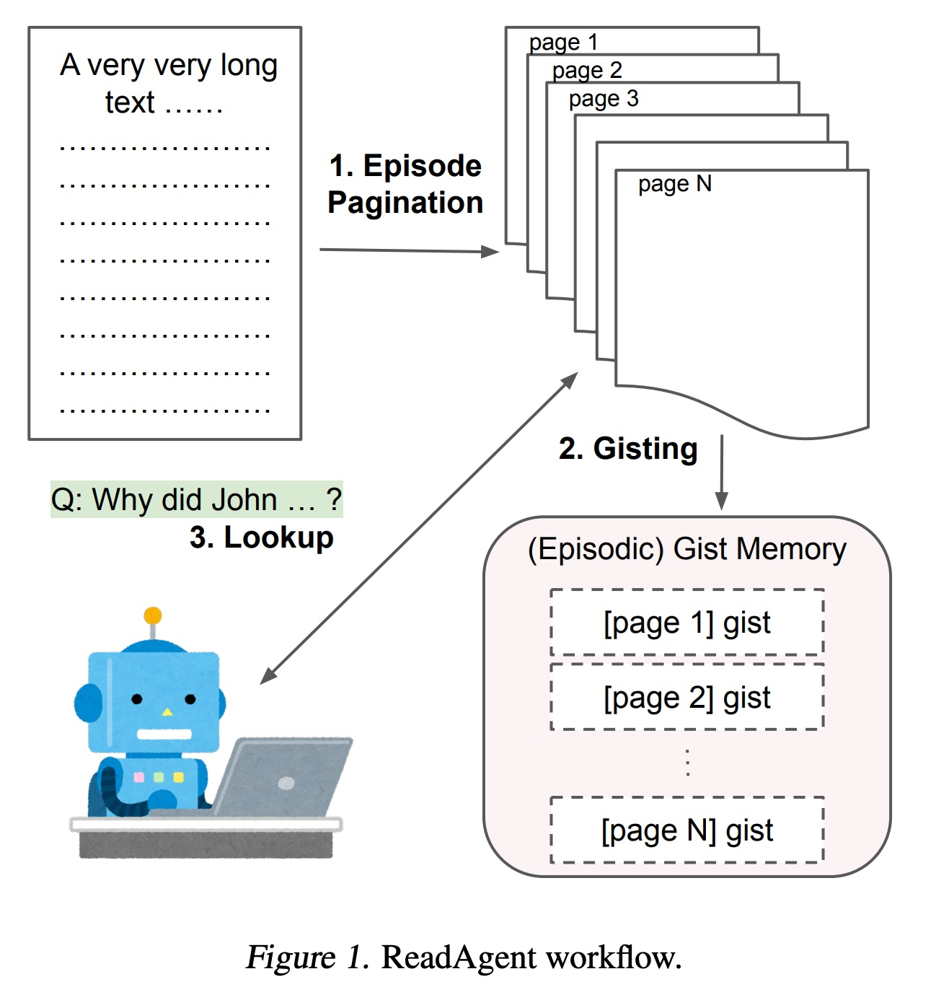
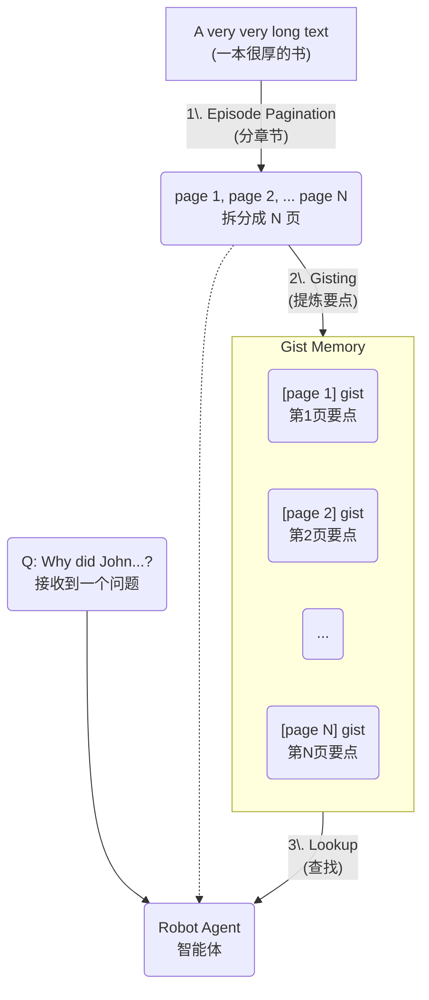
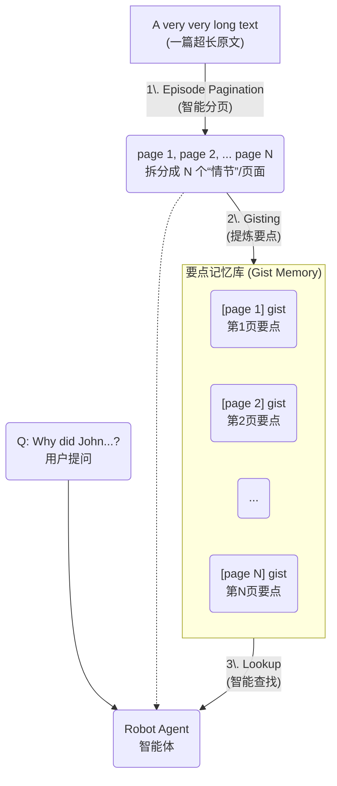
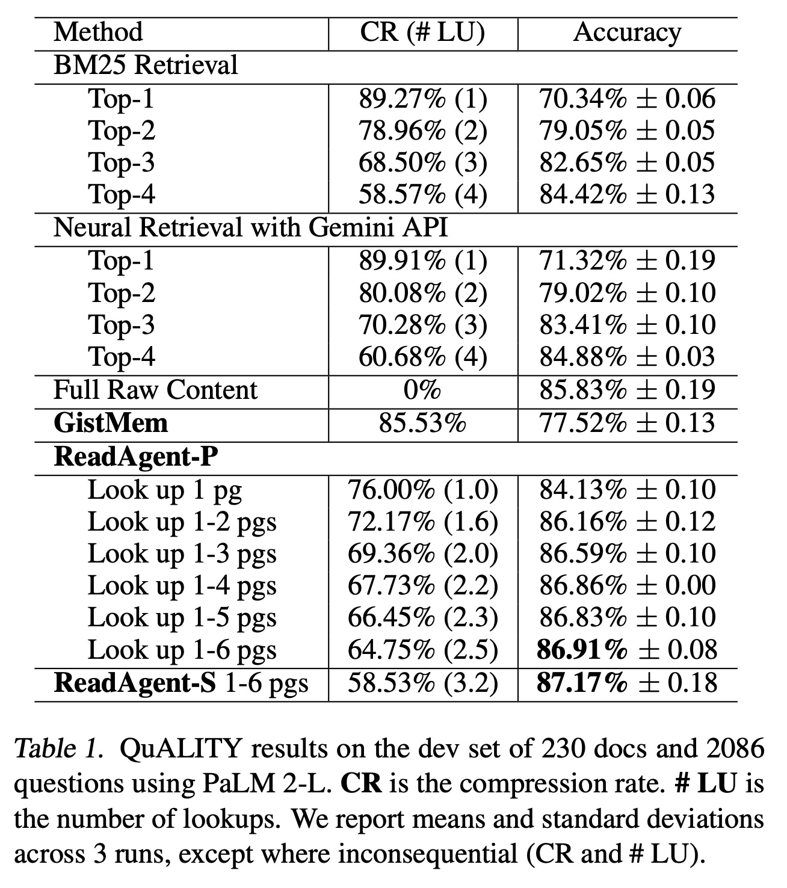
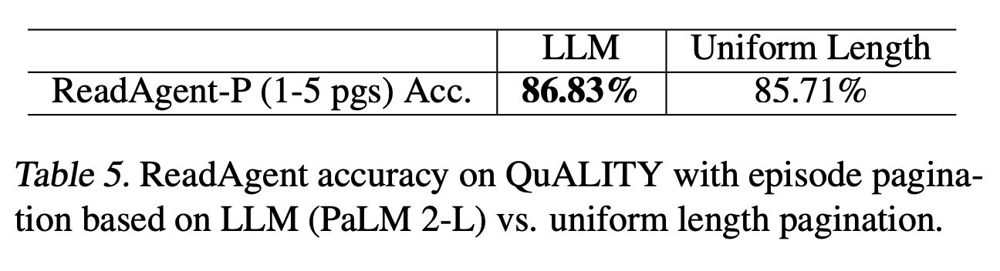

## AI论文解读 | A Human-Inspired Reading Agent with Gist Memory of Very Long Contexts
        
### 作者        
digoal        
        
### 日期        
2025-10-21        
        
### 标签        
PostgreSQL , PolarDB , DuckDB , AI , 论文解读        
        
----        
        
## 背景  
      
https://arxiv.org/pdf/2402.09727        
  
提示:          
```          
读懂《A Human-Inspired Reading Agent with Gist Memory of Very Long Contexts》这篇论文需要提前掌握哪些基础知识, 请使用中文通熟易懂的讲解这些基础知识, 可以引用论文中的图、表或使用Markdown支持的图形(text,mermaid等)增加解释性. 
  
使用中文通熟易懂的解读《A Human-Inspired Reading Agent with Gist Memory of Very Long Contexts》这篇论文, 其中的关键内容请着重讲解, 可以引用论文中的图、表或使用Markdown支持的图形(text,mermaid等)增加解释性. 
  
提取《A Human-Inspired Reading Agent with Gist Memory of Very Long Contexts》这篇论文中的重要术语, 使用中文对这些术语进行通熟易懂的讲解, 可以引用论文中的图、表或使用Markdown支持的图形(text,mermaid等)增加解释性. 
```     
  
## 1 前置知识 
  
要读懂《A Human-Inspired Reading Agent with Gist Memory of Very Long Contexts》这篇论文，你需要先了解一些关于大型语言模型（LLM）和信息处理的基础知识。

这篇论文的核心思想是：**模仿人类阅读长篇文章的方式，来帮助AI（大型语言模型）处理它“记不住”的超长文本。**

人类在阅读一本很厚的书时，不会记住每一个字（Verbatim Memory，逐字记忆），而是记住每一章的“要点”（Gist Memory，要点记忆）。当需要回答某个具体问题时，我们会先根据“要点记忆”定位到相关的章节，然后再回去“查找”（Lookup）那几页的具体细节 。

这篇论文提出的 **ReadAgent**  就是在模仿这个过程。

-----

以下是理解这篇论文所需的 6 个关键基础知识：

### 1\. 什么是大型语言模型 (LLM)？

  * **通俗解释：** 你可以把 LLM 想象成一个“超级大脑”，比如大家熟知的 ChatGPT、文心一言，或者这篇论文里使用的 PaLM 2-L 。
  * **它们能做什么：** 它们通过学习海量的文本数据，变得非常擅长理解和生成人类语言 。
  * **它们如何工作：** 它们基于一种叫做 Transformer 的架构 。

### 2\. LLM 的核心痛点：“上下文窗口” (Context Window)

这是驱动这篇论文要解决的核心问题。

  * **通俗解释：** “上下文窗口”就像是 LLM 的“短期记忆”或“工作台”。
  * **它有两个主要限制：**
    1.  **长度限制 (Hard Limit)：** LLM 一次性只能处理固定长度的文本（比如论文中 PaLM 2-L 的 8K Tokens）。如果文本太长，就“放不下”了。
    2.  **鲁棒性问题 (Soft Limit)：** 论文指出，即使文本没有“溢出”，只要它变得很长，LLM 的表现也会下降 。它们容易“忘记”开头或结尾的内容，这被称为“Lost in the Middle”（迷失在中间）。

### 3\. 什么是 RAG (检索增强生成)？

这是 ReadAgent 的主要“竞争对手”，也是目前解决长文本问题的主流方法之一。

  * **通俗解释：** RAG 的思路是“开卷考试”。

  * **工作流程：** 当你问 LLM 一个问题时，它不会去读完整的“书”（原始长文本），而是：

    1.  **检索 (Retrieve)：** 先用一个搜索引擎（比如论文中提到的 BM25 或神经检索 ）从“书库”里找出最相关的几个“片段”。
    2.  **增强 (Augment)：** 把这些相关片段和你的问题一起“喂”给 LLM。
    3.  **生成 (Generate)：** LLM 根据这些片段来回答你的问题。

  * **与 ReadAgent 的区别：** RAG 是一种“被动检索”，而 ReadAgent 是一种“主动阅读和查找”。ReadAgent 会先“通读”一遍全文并生成“要点笔记”（Gist Memory），然后再根据问题决定“回头查阅”哪些“原始页面” 。

### 4\. 什么是 LLM 智能体 (Agent)？

论文将 ReadAgent 描述为一个“LLM 智能体系统” (LLM agent system) 。

  * **通俗解释：** Agent 不仅仅是“回答问题”，它更像一个“行动者”。
  * **它能做什么：** 它可以根据任务需求，自主地做决策、分步骤行动、甚至使用工具 。
  * **在本文中：** ReadAgent 的“智能体”体现在它的“交互式查找” (interactive look-up) 。它会 *自主决策* 应该去查找原文的哪一页（Page）来获取更详细的信息，而不是被动地接受检索结果。

### 5\. 论文的核心工作流：Gist Memory (要点记忆)

理解论文的图 1  是理解全文的关键。ReadAgent 的工作分为三步，完全模仿了人类的阅读行为：    



1.  **Episode Pagination (分段/分页)：** LLM 首先决定在哪里“暂停阅读”，把长文本切分成若干个有意义的“情节”或“页面”（Pages）。
2.  **Gisting (提炼要点)：** LLM 读取每一个“页面”，并把它压缩成一个很短的“要点”（Gist）。所有这些“要点”组合起来，就成了“要点记忆”（Gist Memory）。这个“要点记忆”非常短，可以轻松放入 LLM 的“短期记忆”（上下文窗口）。
3.  **Lookup (查找)：** 当收到一个问题时 ，智能体（Agent）首先查看“要点记忆”，判断哪些“页面”可能包含答案，然后它会“回头”去读取那些原始“页面”的 *完整内容*，最后结合“要点”和“细节”来回答问题 。

### 6\. 如何评估模型的好坏？(关键指标)

为了证明 ReadAgent 更好，论文使用了一些特定的评估标准。

  * **Accuracy (准确率)：** 用于像 QUALITY 这样的多项选择题任务 。答对多少，一目了然。
  * **ROUGE (召回率导向的摘要评估)：** 用于像 NarrativeQA 和 QMSum 这样的开放式问答或摘要任务 。
      * **通俗解释：** 它通过比较“模型生成的答案”和“标准答案”之间 *重叠的词语* 有多少，来判断答案的质量。
  * **LLM Rater (LLM 评分员)：** 这是一个很有趣的评价方式。
      * **通俗解释：** 他们不再使用复杂的数学公式（如 ROUGE）来打分，而是直接去问 *另一个* 强大的 LLM：“你觉得这个答案（模型回答）和标准答案匹配吗？” 。
      * 他们设置了两种评分标准：**Strict (严格)**  和 **Permissive (宽松)** ，分别判断“完全匹配”和“部分匹配” 。

-----

**总结一下：**

要读懂这篇论文，你只需要记住：

1.  LLM 有“短期记忆”限制，处理不了长文本（**问题**）。
2.  人类通过“记要点 + 回头查细节”的方式来阅读长文本（**灵感**）。
3.  ReadAgent 就是模仿人类，先制作一个“要点笔记”（Gist Memory），再根据问题“智能查找”（Lookup）原文（**方案**）。
4.  这种方法（ReadAgent）比传统的“开卷考试”（RAG） 和“死记硬背”（Full Context） 效果更好，甚至在某些任务上（如 QUALITY）超过了读取全文 。
  
## 2 解读论文 
  
这是一个非常棒的论文！它提出了一种非常巧妙的方法，来解决目前大型语言模型（LLM）在处理“超长文本”时遇到的核心困难。

我将为你通俗地解读这篇论文的核心内容。

### 论文标题与核心思想

  * **论文标题：** 《A Human-Inspired Reading Agent with Gist Memory of Very Long Contexts》
  * **中文大意：** 一个受人类启发的、拥有“要点记忆”的阅读智能体，用于处理超长上下文。
  * **核心思想（一句话概括）：** AI（LLM）在阅读一篇很长的文章（比如一整本书）时，就像人一样，**不需要记住每一个字** ；它只需要记住 **每一章的“要点”（Gist）** ，当需要回答问题时，再**根据“要点”的指引，回头去“查找”（Lookup）原文的具体细节** 。

-----

### 1\. 亟需解决的“痛点”：AI 的“短期记忆”

目前的大型语言模型（LLM）虽然强大，但它们有一个致命弱点： **“上下文窗口”（Context Window）有限** 。

你可以把“上下文窗口”想象成 AI 的 **“短期记忆”或“工作台”** 。

1.  **装不下：** 一篇几万、几十万字的文档或一本书，远远超过了 AI（如 PaLM 2-L 的 8K Token）一次性所能处理的长度 。
2.  **记不牢：** 论文指出，一个更严重的问题是，**即使文本勉强能装下，AI 的表现也会严重下降** 。它们容易“分心” ，或者“迷失在中间”（Lost in the Middle），忘记开头或结尾的重要信息。

-----

### 2\. ReadAgent：像人类一样阅读的“三部曲”

为了解决这个问题，作者提出了 **ReadAgent** 。它不是一个单一的模型，而是一个“智能体系统”（Agent System），它通过提示（Prompting）的方式指挥 LLM 像人一样工作 。

它的工作流程完美复刻了人类的阅读习惯，我们可以参考论文的 **图 1** ：    



#### 第 1 步：Episode Pagination (智能分页)

  * **做什么：** 把一篇“非常非常长的文本”切分成有意义的“情节”（Episodes）或“页面”（Pages）。
  * **关键点：** 这不是粗暴地按字数“一刀切”。ReadAgent 会让 LLM **自己决定在哪里“暂停阅读”** 。比如，LLM 会选择在“场景转换”、“一段对话结束”或“一个论点讲完”时进行分页 。
  * **好处：** 这样分的“页”在逻辑上更完整，更利于后续提炼要点。

#### 第 2 步：Gisting (提炼要点)

  * **做什么：** ReadAgent 指挥 LLM 阅读上一步生成的每一“页”（Page），并将其 **压缩成一个非常简短的“要点”（Gist）** 。
  * **关键点：** 论文发现，使用 "shorten"（缩短）这个词的提示语比 "summarize"（总结）效果更好 ，因为它倾向于保持原文的叙事流程，而不是重新组织内容 。
  * **结果：** 最终，AI 得到了一份 **“要点记忆库”（Gist Memory）** 。这份“笔记”非常精炼（例如，在 QUALITY 数据集上，压缩率高达 85.53% ），可以被轻松完整地放入 AI 的“短期记忆”中。

#### 第 3 步：Interactive Lookup (交互式查找)

  * **做什么：** 这是最智能的一步。当你向 AI 提问时（例如：“约翰为什么...？”），它会执行“查找”动作 。
  * **工作流程：**
    1.  AI **首先只阅读“要点记忆库”（Gist Memory）** 。
    2.  根据“要点”和问题，AI 会**主动决策**：“为了回答这个问题，我需要回头去仔细阅读原文的第 2 页、第 7 页和第 15 页”。
    3.  AI 调取原文的第 2、7、15 页， **用这些“原始细节”替换掉“要点记忆”中的对应“要点”** 。
    4.  最后，AI 结合这份“既有全局要点、又有关键细节”的上下文，生成最终答案 。
  * **两种查找策略：**
      * **ReadAgent-P (并行)：** AI 一口气决定它要看哪几页 。
      * **ReadAgent-S (串行)：** AI 先看一页，看完后，再决定下一页要看什么，如此往复 。这种方式更“深思熟虑”，在 QMSum 这样的复杂任务上表现明显更好 。

-----

### 3\. 关键实验结果：“少即是多”

ReadAgent 的效果如何？论文通过三个数据集（QUALITY, NarrativeQA, QMSum）给出了震撼的结果 。

#### 发现一：AI 也会“分心”，少即是多（最惊艳的发现）

在 **QUALITY 数据集**  上，原文长度平均约 4000 多词，可以被完整放入 LLM 的上下文窗口 。作者比较了 ReadAgent 和“直接读取全文”的效果。

**结果（见表 1 ）：**      

| 方法 (Method) | 准确率 (Accuracy) |
| :--- | :--- |
| Full Raw Content (直接读取全文) | 85.83% |
| GistMem (只看“要点”，不查找) | 77.52% |
| **ReadAgent-P (查找 1-2 页)** | **86.16%** |
| **ReadAgent-S (查找 1-6 页)** | **87.17%** |

**解读：**
这是一个反直觉但极其重要的发现。**ReadAgent（只看要点+少量细节）的表现，竟然超过了“直接读取完整原文”！** 
这证明了论文的假设：**太长的上下文会“分散”LLM 的注意力** ，而 ReadAgent 这种“要点+细节”的组合，反而提供了更清晰、干扰更少的信息，帮助 AI 取得了更好的成绩。

#### 发现二：有效扩展上下文 3.5x - 20x

在 **NarrativeQA 数据集**  上，原文平均长达 7.1 万词，最长 34.3 万词 ，这远远超出了 LLM 的极限。

**结果：** ReadAgent 取得了碾压性的胜利。

  * 它将 LLM 的**有效上下文窗口扩展了约 20 倍** 。
  * 在 Gutenberg 测试集上，ReadAgent 的 ROUGE-L（一种评估指标）比最好的传统检索基线（RAG） **提升了 31.98%** 。

#### 发现三：智能分页 \> 粗暴切分

论文还做了一个对比实验（见表 5 ）：如果使用 ReadAgent 的“智能分页”（LLM 决定在哪分）对比“均匀长度分页”（按固定字数切），哪个效果好？    

**结果：** 智能分页 (86.83%) \> 均匀长度分页 (85.71%) 。
这证明了让 LLM 模拟人类阅读节奏、在“自然断点”分页，确实是更有效的方法 。

-----

### 总结

《ReadAgent》这篇论文的核心贡献在于，它没有“卷”模型架构或上下文窗口大小，而是回归常识，从“人类如何阅读”这一根本问题出发 。

它证明了，通过“ **智能分页（Pagination）** ”、“ **提炼要点（Gisting）** ”和“ **交互式查找（Lookup）** ”这三步，AI 可以像人类一样，在“全局概览”和“局部精读”之间取得精妙的平衡 ，从而高效、准确地理解它以前根本无法处理的超长文本。
  
## 3 术语 
  
以下是对《A Human-Inspired Reading Agent with Gist Memory of Very Long Contexts》这篇论文中关键术语的提取和通俗讲解。

-----

### 1\. ReadAgent (阅读智能体)

  * **通俗讲解：**
    这是本论文提出的核心“AI 智能体系统” 。它的设计灵感来源于人类阅读和理解长篇文档的方式 。
    你可以把它想象成一个“AI 读书助手”，它不会试图一次性“死记硬背”一整本书，而是会像人一样，先“做笔记”（Gisting），然后在需要时“回头查书”（Lookup） 。

  * **工作流程 (源自图 1)：**    
    论文中的图 1  清晰地展示了 ReadAgent 的三步工作流：

    ```mermaid
    graph TD
        A["A very very long text <br> (一篇超长原文)"] -- "1\. Episode Pagination <br> (情节分页)" --> B(page 1 ... page N <br> 拆分成 N 页);
        B -- "2\. Gisting <br> (提炼要点)" --> C["(Episodic) Gist Memory <br> (要点记忆库)"];
        E(Q: Why did John...? <br> 用户提问) --> D(Robot Agent / 智能体);
        C -- "3\. Lookup <br> (智能查找)" --> D;
        B -.-> D;
    ```

### 2\. Gist Memory (要点记忆)

  * **通俗讲解：**
    这是 ReadAgent 的核心部件，也是论文标题的来源 。它指的是一种 **“模糊的、只保留了实质内容”的记忆** ，而不是逐字逐句的精确记忆 。
    简单来说，Gist Memory 就是 AI 为长文章的每一“页”（Page）生成的 **“一句话总结”或“核心要点”** 。
    AI 在回答问题时，会首先快速浏览这份“要点笔记”，而不是全文。

  * **灵感来源：Fuzzy-trace theory (模糊痕迹理论)**

      * 这是一个心理学理论，论文用它作为 ReadAgent 的灵感来源 。
      * 该理论认为，人类在经历事件后会形成两种记忆：
        1.  **Verbatim Memory (逐字记忆)：** 包含精确细节，但遗忘很快 。
        2.  **Gist Memory (要点记忆)：** 模糊的“要点”，但更持久，人类更倾向于用它来进行推理 。

### 3\. ReadAgent 的三个关键动作

#### 1\. Episode Pagination (情节分页)

  * **通俗讲解：**
    这是 ReadAgent 处理长文本的第一步 。
    它不是简单地按字数“一刀切”，而是**让 LLM 自己决定在文章的什么地方“暂停阅读”** 。
    LLM 会被要求在“自然断点”处（如场景转换、对话结束或一个新论点开始时）进行分页 。

#### 2\. Memory Gisting (记忆要点化)

  * **通俗讲解：**
    这是第二步 。
    ReadAgent 会读取上一步生成的每一“页”（Page），然后**提示 LLM 将其“缩短”（shorten）** 。
    论文特意提到，使用“缩短”比使用“总结”（summarize）更好，因为“缩短”倾向于保留原文的叙事流程，便于后续拼接 。

#### 3\. Interactive Look-up (交互式查找)

  * **通俗讲解：**
    这是第三步，也是 ReadAgent“智能”的体现 。
    当收到一个任务（比如一个问题）时，AI 会先查看“Gist Memory”（要点笔记），然后**主动决定需要“回头”去查看原文的哪些“页面”** 。
    它会用查回来的“原始页面”的详细内容，来替换掉“要点笔记”中的对应“要点”，然后再进行回答 。

### 4\. ReadAgent 的两种查找策略

#### 1\. ReadAgent-P (Parallel Look-up / 并行查找)

  * **通俗讲解：**
    这是一种“一次性”查找策略 。
    AI 在看了“要点笔记”和问题后，会**一次性列出它想看的所有原始页面**（例如：“我想看第 2、5、8 页”） 。

#### 2\. ReadAgent-S (Sequential Look-up / 串行查找)

  * **通俗讲解：**
    这是一种“迭代式”查找策略 。
    AI **一次只请求查看一个页面** 。在看完这个页面的详细内容后，它再决定下一步是“停止查找”还是“再看另一页” 。
    这种方式更“深思熟虑”，允许 AI 根据新信息调整查找策略 ，但计算成本也更高 。

### 5\. 关键的对比基线 (Baselines)

#### 1\. RAG (Retrieval-Augmented Generation / 检索增强生成)

  * **通俗讲解：**
    这是目前解决长文本问题的主流技术之一，也是 ReadAgent 的主要“竞争对手” 。
    RAG 的工作方式是“开卷考试”：当遇到问题时，它**使用一个“搜索引擎”（如 BM25 或神经检索）从原文中“检索”出最相关的几个片段**，然后把这些片段和问题一起交给 LLM 来回答 。

#### 2\. GistMem (仅要点记忆基线)

  * **通俗讲解：**
    这是一个用于“对照实验”的基线方法 。
    它指的是**只让 AI 看“Gist Memory”（要点笔记），而不允许它执行“Lookup”（查找）动作** 。
    通过比较 ReadAgent 和 GistMem 的表现，论文证明了“交互式查找”这一步对于提升准确率至关重要。

### 6\. 关键的评估指标

#### 1\. Compression Rate (CR) / 压缩率

  * **通俗讲解：**
    这是一个衡量 ReadAgent 效率的指标 。
    它衡量的是，与“阅读全文”相比，ReadAgent（阅读要点 + 少量查阅的页面） **到底少读了百分之多少的单词量** 。
    例如，在 QUALITY 任务上，ReadAgent-P (查找 1-2 页) 的 CR 达到了 72.17% ，这意味着它只用了约 28% 的原文信息量，就取得了比阅读全文（CR 0%）更好的成绩 。

#### 2\. LLM Rater (LLM 评分员)

  * **通俗讲解：**
    对于 NarrativeQA 和 QMSum 这样的开放式问答任务，很难用传统指标（如 ROUGE）精确评估答案好坏 。
    因此，论文采用了一个新方法：**让另一个强大的 LLM（作为“裁判”）来判断模型生成的答案和标准答案是否“匹配”** 。
      * **LR-1 (LLM-Rating-1):** 严格评分，只计算“完全匹配”的比例 。
      * **LR-2 (LLM-Rating-2):** 宽松评分，计算“完全匹配”和“部分匹配”的比例 。
  
## 参考        
         
https://arxiv.org/pdf/2402.09727   
  
https://read-agent.github.io/  
        
<b> 以上内容基于DeepSeek、Qwen、Gemini及诸多AI生成, 轻微人工调整, 感谢杭州深度求索人工智能、阿里云、Google等公司. </b>        
        
<b> AI 生成的内容请自行辨别正确性, 当然也多了些许踩坑的乐趣, 毕竟冒险是每个男人的天性.  </b>        
  
    
#### [期望 PostgreSQL|开源PolarDB 增加什么功能?](https://github.com/digoal/blog/issues/76 "269ac3d1c492e938c0191101c7238216")
  
  
#### [PolarDB 开源数据库](https://openpolardb.com/home "57258f76c37864c6e6d23383d05714ea")
  
  
#### [PolarDB 学习图谱](https://www.aliyun.com/database/openpolardb/activity "8642f60e04ed0c814bf9cb9677976bd4")
  
  
#### [PostgreSQL 解决方案集合](../201706/20170601_02.md "40cff096e9ed7122c512b35d8561d9c8")
  
  
#### [德哥 / digoal's Github - 公益是一辈子的事.](https://github.com/digoal/blog/blob/master/README.md "22709685feb7cab07d30f30387f0a9ae")
  
  
#### [About 德哥](https://github.com/digoal/blog/blob/master/me/readme.md "a37735981e7704886ffd590565582dd0")
  
  

  
