## AI论文解读 | Benchmarking Learned Indexes
        
### 作者        
digoal        
        
### 日期        
2025-10-21        
        
### 标签        
PostgreSQL , PolarDB , DuckDB , AI , 论文解读        
        
----        
        
## 背景  
      
https://www.vldb.org/pvldb/vol14/p1-marcus.pdf        
  
提示:          
```          
读懂《Benchmarking Learned Indexes》这篇论文需要提前掌握哪些基础知识, 请使用中文通熟易懂的讲解这些基础知识, 可以引用论文中的图、表或使用Markdown支持的图形(text,mermaid等)增加解释性. 
  
使用中文通熟易懂的解读《Benchmarking Learned Indexes》这篇论文, 其中的关键内容请着重讲解, 可以引用论文中的图、表或使用Markdown支持的图形(text,mermaid等)增加解释性. 
  
提取《Benchmarking Learned Indexes》这篇论文中的重要术语, 使用中文对这些术语进行通熟易懂的讲解, 可以引用论文中的图、表或使用Markdown支持的图形(text,mermaid等)增加解释性. 
```     
  
## 1 前置知识 
  
要读懂《Benchmarking Learned Indexes》（《学习型索引的基准测试》）这篇论文 ，你需要对计算机科学的三个领域有基本的了解：**数据结构**、**机器学习**和**计算机系统**。

这篇论文的核心思想非常巧妙：我们能不能用机器学习（ML）模型（比如线性回归）来“学习”数据的分布规律，从而取代像B树这样的传统索引结构？。

下面我们来通俗地讲解一下你需要掌握的基础知识点。

### 1\. 核心概念：什么是“索引”？

在数据库或数据处理中，“索引”就像一本书的目录。它能帮你快速“查找”到你想要的数据，而不需要从头到尾“扫描”一遍。

**传统索引 (Traditional Index)**

  * 比如论文中反复提到的 **B-Tree (B树)** ，是数据库中最常见的索引结构。它像一个多叉树，通过一层层比较键值（key）来缩小查找范围。

**论文中的“索引”定义 (Figure 1)**  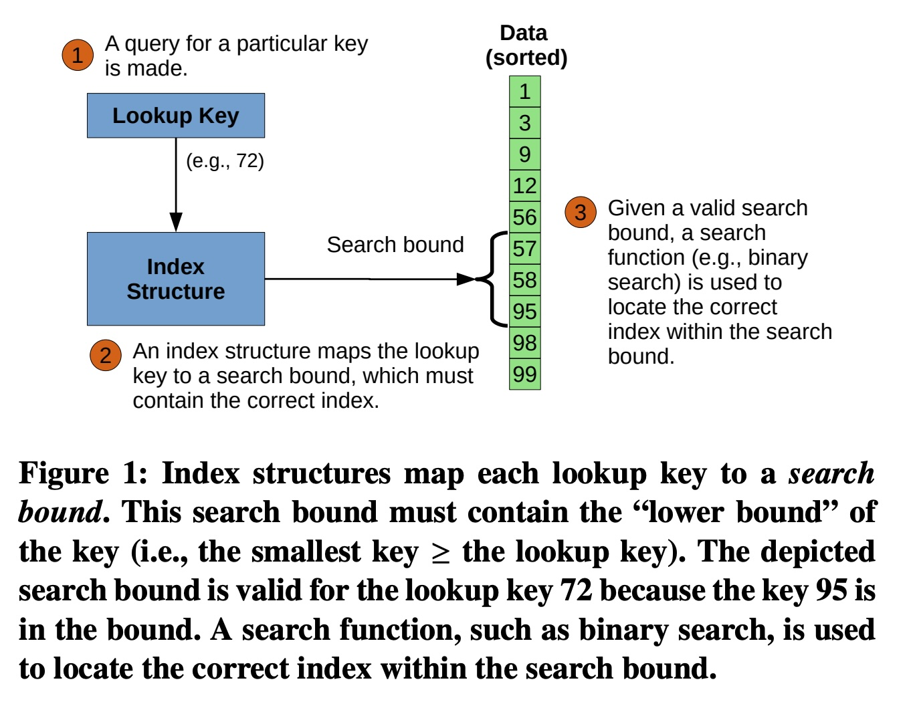  
这篇论文对索引的功能做了一个更通用的定义，理解这个定义是读懂论文的第一步。

  * **第1步：查询 (Query)** 
      * 用户提供一个要查找的 **"Lookup Key" (查找键)**，比如图中的 `72` 。
  * **第2步：索引结构 (Index Structure)** 
      * 索引结构（无论是B树还是“学习型”索引）并不直接返回精确位置。
      * 它返回一个 **"Search bound" (搜索边界)** 。这是一个很小的范围，论文保证你要找的键（或它的“下界”）一定在这个范围内。
  * **第3步：最后一英里搜索 (Last Mile Search)** 
      * 在这个很小的“搜索边界”内，我们使用一个快速的搜索算法（比如 **二分查找**）来精确定位数据 。

**你需要的基础知识：**

  * **二分查找 (Binary Search)**：这是论文中一个关键的性能步骤 。你必须知道它是一个在**已排序数组**  上运行的、时间复杂度为 $O(\log n)$ 的高效搜索算法。学习型索引的目标，就是把二分查找的范围从“整个数组”缩小到“一个极小的区域”。
  * **B树 (B-Tree)**：你至少要对B树有概念性的了解，知道它是一种平衡树结构，是传统数据库索引的代表 。
  * **哈希表 (Hash Table)**：知道它是一种通过哈希函数实现 $O(1)$ 级别快速查找的数据结构 。

  


### 2\. 核心概念：什么是“学习”？

这篇论文的“学习”(Learned) 指的是用机器学习模型来**近似模拟数据的累积分布函数 (CDF)** 。

**累积分布函数 (CDF)**
这是理解“学习型索引”最核心的知识点。

  * **定义**：在一个**已排序**的数据集 D 中，一个键 $x$ 的CDF值，就是它在这个数据集中的“相对排名”或“相对位置” 。
  * **看图 2 (Figure 2)** ：  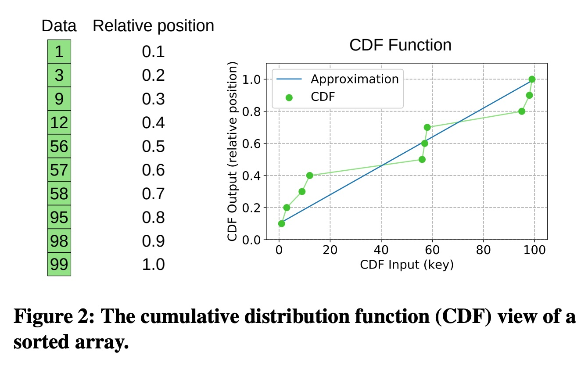  
      * 左侧是排好序的数据 。
      * 数据 `1` 是10个数据中的第1个，所以它的“相对位置”是 `0.1` 。
      * 数据 `56` 是第5个，相对位置是 `0.5` 。
      * 数据 `99` 是最后一个，相对位置是 `1.0` 。
      * 右侧的图表，横坐标 (CDF Input) 是键 (Key) ，纵坐标 (CDF Output) 是相对位置 。绿色的点就是真实数据的CDF 。

**“学习”如何工作？**

  * **目标**：如果我们有一个完美的函数 $f(key)$ 能够算出任何 $key$ 的相对位置，那查找就太简单了：`位置 = f(key) * 数据总量` 。
  * **方法**：我们用一个简单的机器学习模型（比如一条直线）来“近似”这个CDF函数 。
  * **看图 2 (Figure 2)**：那条蓝色的“Approximation” (近似) 线 ，就是一个ML模型（具体来说，是线性回归）。它虽然不完美（和绿点有误差 ），但它非常简单、计算得非常快。

**你需要的基础知识：**

  * **线性回归 (Linear Regression)**：这是最基础的ML模型。你只需要知道它是用来在数据点中拟合出一条直线 $y = ax + b$ 。论文中提到的 PGM  和 RS  都是基于分段的线性模型。
  * **多项式回归 (Polynomial Regression)**：比如用 $y = ax^2 + bx + c$ 这样的曲线来拟合数据。论文中的 RMI 就使用了更复杂的模型，如“三次模型”(cubic models) 。

### 3\. 核心概念：什么是“基准测试”？

这篇论文的贡献是“Benchmarking”(基准测试) ，即公平地比较不同索引的性能。要看懂性能图表，你需要了解一些计算机系统底层的知识。

**你需要的基础知识：**

  * **CPU 缓存 (CPU Cache) 和缓存未命中 (Cache Miss)**：

      * 这是论文中最重要的性能指标 。
      * **通俗理解**：CPU 访问“缓存”就像从你的桌子上拿东西（非常快，几纳秒），访问“内存(RAM)”就像去地下室仓库拿东西（非常慢，几十到上百纳秒）。
      * 如果CPU要的数据不在“桌子”（缓存）上，就发生了一次“缓存未命中”，必须去“地下室”（内存）拿，这会浪费大量时间。
      * 这篇论文发现，学习型索引之所以快，很大程度上是因为它们**体积小**（比B树小），能装在CPU缓存里，从而**缓存未命中次数更少** 。

  * **性能指标 (Metrics)**：

      * **Lookup Time (ns) (查找时间/延迟)**：查找一个数据花了多少纳秒（ns）。越低越好 。
      * **Size (MB) (空间占用)**：索引结构本身占用了多少兆字节（MB）的内存。越低越好 。
      * **Throughput (吞吐量)**：在多线程测试中，每秒能完成多少次查找 。越高越好。

  * **如何阅读性能图 (Figure 7)** ：  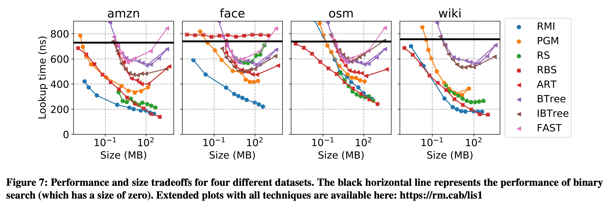  

      * 这是典型的“帕累托”分析图 。
      * **横坐标 (X轴)**：Size (MB)，越往左越小（越好）。
      * **纵坐标 (Y轴)**：Lookup time (ns)，越往下越快（越好）。
      * **理想的索引**：应该在图的 **左下角**。
      * **帕累托最优 (Pareto optimal)** ：在图的“左下边缘”上的点。这意味着不存在任何其他索引“既比它小，又比它快”。
      * **论文结论**：在很多数据集上 (如 amzn, face, wiki)，学习型索引 (RMI, PGM, RS) 构成了这个“最优边缘”，意味着它们在“空间/时间”的权衡上击败了传统B树 。

### 总结

要读懂这篇论文，你需要提前掌握：

1.  **数据结构**：
      * **二分查找** (必须懂)
      * **B树** (有概念)
      * **哈希表** (有概念)
2.  **机器学习**：
      * **线性回归** (知道它是在拟合一条直线)
      * **CDF (累积分布函数)** (理解它是“数据的相对排名”)
3.  **计算机系统**：
      * **CPU缓存** 和 **缓存未命中** (性能分析的关键)
      * **如何读懂 Figure 7** 这样的X-Y性能权衡图 (空间 vs. 时间)    
  
## 2 解读论文 
  
这是一篇非常著名的论文，它为“学习型索引”（Learned Index）这一新兴领域提供了一个关键的、公正的基准测试。

通俗来说，这篇论文在回答一个问题： **“我们用一个（机器学习）AI模型来替代数据库中传统的B树索引，这事儿靠谱吗？”**

在它出现之前，学术界对这个想法有很大争议 ，因为缺乏公平的比较 。这篇论文就是那个“裁判”，它搭建了一个公平的“擂台” ，让新（学习型）旧（传统型）两种索引打了一架。

**剧透：** 论文的结论是，**在特定场景下，学习型索引确实能赢** ，而且赢得漂亮，可以做到**又小又快** 。

下面我们来详细解读这篇论文的关键内容。

### 1\. 核心思想：什么是“学习型索引”？

要理解“学习型索引”，我们先要用论文的视角来看什么是“索引”。

**传统索引（如B树）** 就像一个巨大的、层层嵌套的“通讯录”，你为了找“张三”，先按首字母Z，再找Zh，再找Zhang... 一层层下去。

**学习型索引** 的思路完全不同。它认为，**索引的本质是一个函数**。

**关键点一：索引 = 预测位置**
论文在图1和图2中解释了它的核心机制：       

1.  **目标**：数据是**排好序**的（这是关键前提）。
2.  **学习**：我们能不能“学习”出一个函数（ML模型），你给它一个键（Key，比如 `72`），它就直接“预测”出这个键在数组中的大概位置（相对排名）？。
3.  **这个函数就是“累积分布函数”(CDF)** 。如图2所示，CDF就是“键”和它“相对位置”之间的关系 。
4.  **预测**：这个ML模型（图2中的蓝线）就是对真实CDF（绿点）的近似 。
5.  **查找**：
      * **第1步**：用户查询 `Key=72` 。
      * **第2步**：ML模型（索引）计算，预测 `72` 的位置，并给出一个很小的“**搜索边界 (Search bound)**”（如图1）。模型保证，你要找的 `72`（或者比它大的最小的键）一定在这个小范围里 。
      * **第3步**：我们在这个小范围内执行一次“**二分查找**” (Binary Search)，精确定位 。

这个流程可以用下图来理解：

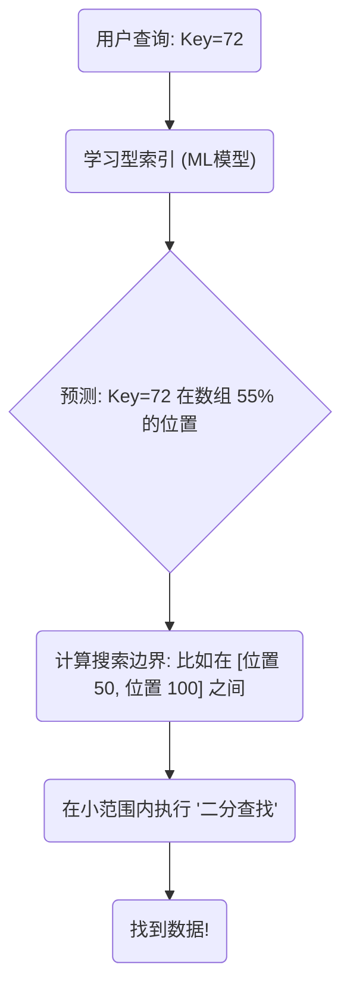

**为什么这可能更快？** B树查找需要从根节点一层层读数据，可能涉及多次（缓慢的）内存访问。而ML模型（如果很简单，比如线性回归）的计算可能非常快，几乎全在CPU缓存里完成。

**关键点二：参赛的“学习型”选手**
论文比较了三种主要的学习型索引 ：

  * **RMI (递归模型索引)**：如图3，它是一个“模型的模型”。第一层是一个简单的模型，它不直接预测最终位置，而是预测 *应该由哪个第二层模型* 来接手 。它像一个“总管”在指挥一群“专家”。  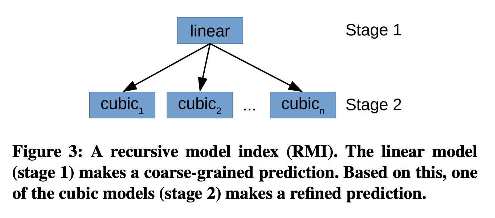  
  * **PGM (分段几何模型)**：如图5，它用很多个简单的“线性模型”（直线）来分段拟合数据 。它还递归地对这些“分段点”建立索引，形成一个层次结构 。  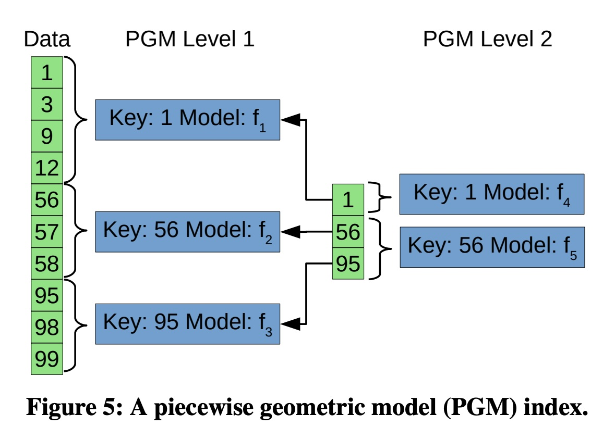  
  * **RS (基数样条索引)**：它也用线性分段（样条）。但它使用一个“基数表”（Radix Table，如图4）来快速定位一个键（Key）应该属于哪一段 。 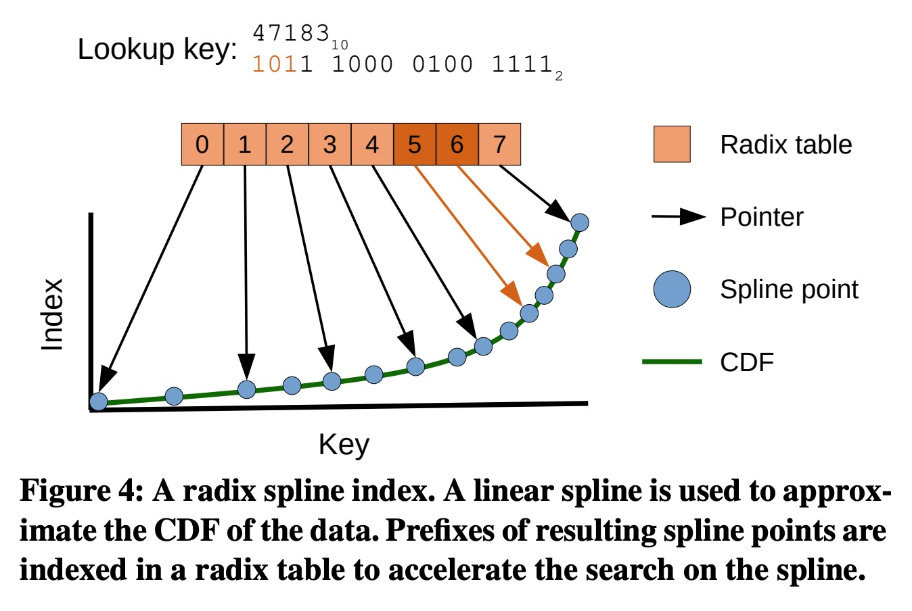  

### 2\. 核心实验与发现

这篇论文的精髓在它的实验评估（第4章）。

#### 发现一：“学习型”真的赢了 (图 7)

  

这是整篇论文**最重要的图**。它比较了不同索引的 **“查找时间” (Y轴，越低越好)** 和 **“内存占用” (X轴，越低越好)** 。

**看图方法**：所有应用都想要“左下角”的点，即**又小又快**。在图上，构成“左下包络线”（Pareto 边界）的点就是最优的选择 。

  * **结论**：在 `amzn`、`face` 和 `wiki` 这三个真实数据集上，**学习型索引（RMI, PGM, RS）全面胜出** 。它们构成了那条最优的“左下包络线” 。
  * **翻译**：在相同大小下，学习型索引比B树（BTree）、ART树（ART）等传统索引**更快**。或者，在相同速度下，它们**占用的空间更小** 。
  * **例外**：在 `osm` 数据集上，所有索引的表现都很差 。论文分析这是因为 `osm` 数据（一种地图数据）的分布太复杂，局部也没有规律性，导致模型“学不会” 。

#### 发现二：它们到底为什么快？ (图 12)

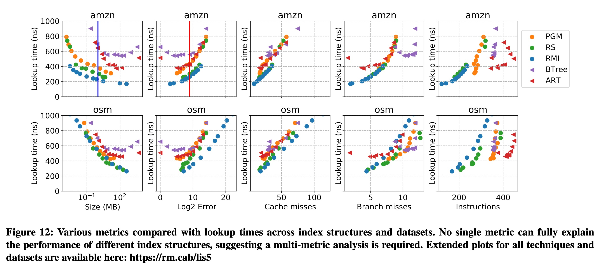  

这也许是论文最有价值的洞察。之前的论文猜测，学习型索引快是因为“分支预测失误更少” 。

**这篇论文用数据推翻了这个猜测** 。

  * **关键指标**：论文通过回归分析发现，在所有性能指标中（包括分支、指令数、大小等）， **“缓存未命中”(Cache misses) 是最重要的解释变量** 。
  * **通俗解释**：CPU访问“缓存”（Cache，像你的桌面）极快，访问“内存”（RAM，像地下室的仓库）极慢。
      * **B树**：通常很大，查找时需要从内存（地下室）读取好几次数据（节点），导致多次“缓存未命中”，浪费时间 。
      * **学习型索引**：模型本身非常小，经常能完全塞进CPU缓存（桌面）。查找时，模型计算（在桌面上完成）+ 最后一英里搜索（可能去1-2次地下室）。
  * **结论**：学习型索引之所以快，**不是因为计算少，而是因为“等待内存”的时间少** 。

#### 发现三：学习型索引的“弱点”和“依赖”

论文还做了很多“压力测试”，揭示了学习型索引的弱点：

1.  **CPU流水线依赖 (图 15)**  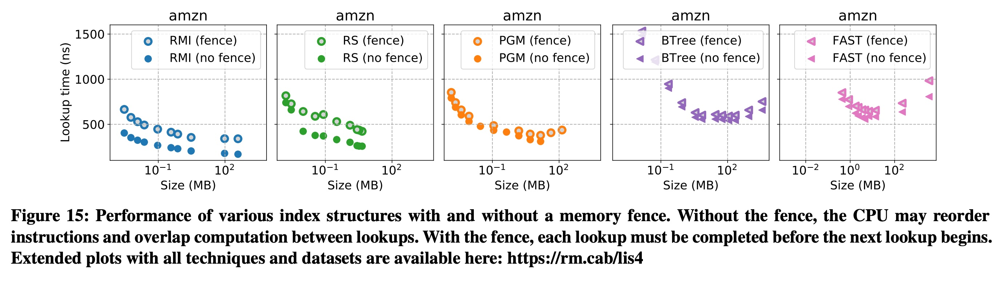  

      * 现代CPU会自动“重排指令”（Pipelining）来加速。论文通过插入“内存栅栏”(Memory fence) 来禁止这种优化 。
      * **结果**：BTree 和 PGM 几乎不受影响 。但 **RMI 和 RS 的性能暴跌了约 50%** ！
      * **结论**：RMI 和 RS 的惊人速度，有很大一部分功劳要归功于现代CPU的流水线优化 。

2.  **构建时间长 (图 17)**  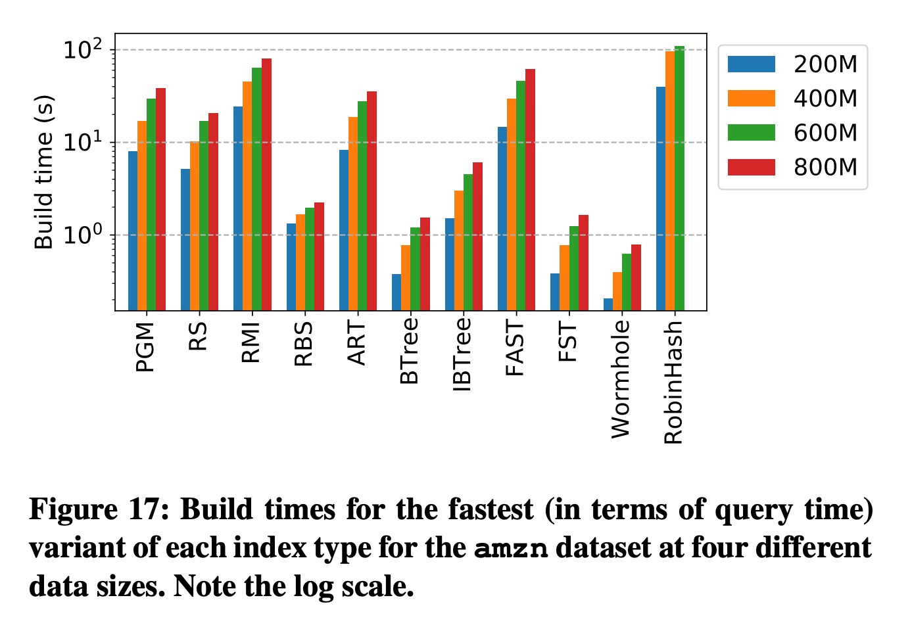  

      * B树这类传统索引是为“写入”优化的，构建（或插入）很快 。
      * 学习型索引是为“只读”设计的 。它们的“训练”（构建）时间要长得多 。
      * **对比**：在三种学习型索引中，RS（单遍构建）最快 ，PGM 其次 ，而 RMI（需要自动调优）则明显更慢 。

3.  **多线程表现 (图 16)**  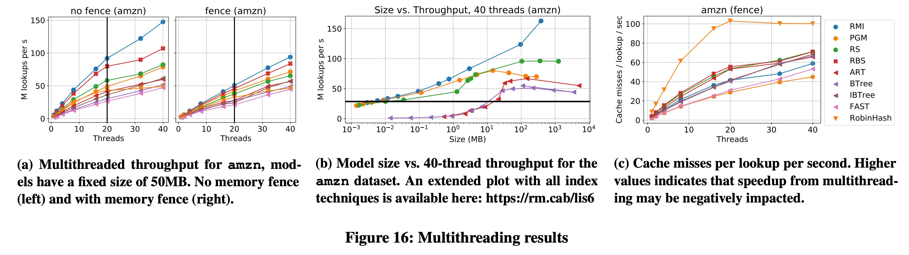  

      * 在多线程（高吞吐）环境下，学习型索引的扩展性依然良好 。
      * 有趣的是，单线程延迟最低的哈希表（RobinHash）在多线程下的吞吐量却不行 ，因为它造成了太多的缓存未命中 。这再次印证了“缓存”是性能的关键。

### 总结

《Benchmarking Learned Indexes》这篇论文的贡献是：

1.  **提供了第一个公平、开源的基准测试平台** ，结束了“公说公有理，婆说婆有理”的混乱局面。
2.  **证明了学习型索引的价值**：在**只读、内存中**的工作负载下，它们在“空间/性能”权衡上**优于**传统索引 。
3.  **揭示了性能的来源**：学习型索引的胜利是“**缓存的胜利**”。它们的小体积带来了极低的缓存未命中率 。
4.  **指出了局限性**：它们严重依赖现代CPU的**流水线优化** ，且**构建时间很长** ，目前还不适用于高频写入的场景。
  
## 3 术语 
  
好的，这是对论文《Benchmarking Learned Indexes》中一些重要术语的通俗化中文讲解。

### 核心概念：学习索引 (Learned Index)

在理解其他术语之前，我们首先需要明白什么是“学习索引”。

想象一下，你要在一本很厚的、按姓氏排序的电话簿里找 "张伟"。

  * **传统索引 (如 B-Tree)**: 就像电话簿的目录。目录会告诉你，“王”姓在第500页，“赵”姓在第800页。你根据目录就能快速翻到大概位置。这种方法非常精确可靠，但目录本身可能也很大。
  * **学习索引 (Learned Index)**: 就像一个非常聪明的图书管理员。你告诉他要找“张伟”，他不对照目录，而是根据自己对“中国姓氏分布”的经验“猜”一个页码，比如“第758页”。这个猜测可能不完全准确，但会非常接近。他会告诉你：“去第750页到760页之间找找，肯定在那儿。”

**学习索引**就是利用机器学习模型来“学习”数据的分布规律，从而预测一个键（Key）在排序数据中的大致位置。它的目标是用一个更小、更快的模型来替代传统的、基于严格规则的索引结构。

-----

### 重要术语详解

#### 1\. 索引结构 (Index Structure) 与 搜索边界 (Search Bound)

  * **索引结构 (Index Structure)**
    是数据库中用于加速数据查询的核心组件。它的任务是根据你提供的查询键（Lookup Key），快速定位到数据在存储中的位置。

  * **搜索边界 (Search Bound)**
    是学习索引给出的一个预测范围 `(lo, hi)`。索引结构并不直接告诉你数据的精确位置，而是承诺你要找的数据一定在这个边界范围内。

论文中的图1完美地解释了这个过程：    

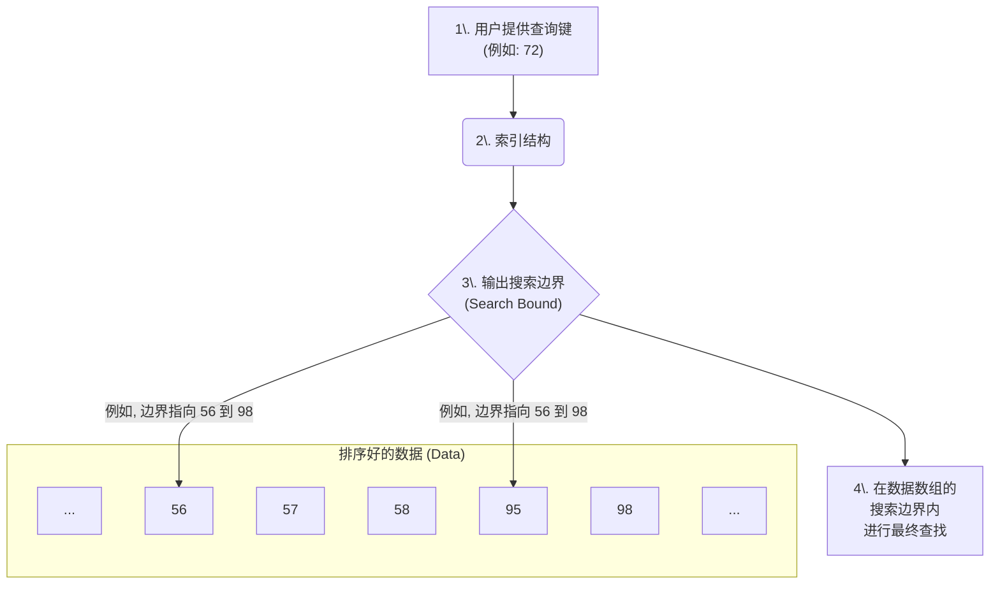

在这个例子中，索引结构接收到查询键`72`后，给出了一个包含 `[56, 57, 58, 95, 98]` 的搜索边界。下一步，我们只需要在这个小范围内使用二分查找等方法就能精确定位到不小于72的第一个值（即95）。这个最终的查找过程被称为**最后一英里搜索 (Last Mile Search)**。

#### 2\. 累积分布函数 (Cumulative Distribution Function, CDF)

  * **是什么**: CDF 是一个数学概念，它描述了一个数据集中，小于或等于某个值的键所占的比例。在论文的语境中，它被简化为**一个键（Key）到其在有序数组中相对位置（Relative Position）的映射**。

  * **为什么重要**: 学习索引的核心思想就是**用一个机器学习模型来近似这个CDF**。如果模型能完美地拟合CDF，那么对于任何一个键 `x`，我们就可以通过公式 `CDF(x) * 数据总量` 直接计算出它的位置。

论文中的图2非常直观：  

  * **绿色的点 (CDF)**: 代表了真实的数据分布。例如，键`56`是第5个数据（总共10个），所以它的相对位置是`0.5`。
  * **蓝色的线 (Approximation)**: 是机器学习模型（这里是简单的线性回归）学到的近似函数。它并不完美，与真实值之间存在误差。学习索引需要保证，即便存在误差，给出的**搜索边界**也必须是正确的。

  

引用自论文图2：CDF的真实分布与模型近似

#### 3\. 三种学习索引结构

论文详细评测了三种具体的学习索引实现：

##### a. 递归模型索引 (Recursive Model Index, RMI) 

  * **结构**: 一种分层的模型结构，通常由两个或多个阶段的模型组成 。

  * **工作方式 (自顶向下 Top-down)**:

    1.  **阶段1 (Stage 1)**: 一个顶层的、粗粒度的模型（例如线性模型）对查询键进行第一次预测 。
    2.  **阶段2 (Stage 2)**: 根据第一次预测的结果，选择一个更专业的、细粒度的“子模型”（例如多个三次模型之一）进行第二次、更精确的预测，最终输出搜索边界 。
        这个过程就像一个大领导（阶段1模型）接到任务后，不会自己处理，而是把它分配给最合适的部门经理（阶段2的某个子模型）去完成。

    引用自论文图3：RMI结构示意图    

##### b. 基数样条索引 (Radix Spline Index, RS) 

  * **结构**: 由两个核心部分组成：**样条点 (Spline points)** 和 **基数表 (Radix table)** 。
  * **工作方式 (自底向上 Bottom-up)**:
    1.  **样条点**: 用一系列的直线段（由样条点连接而成）来近似数据的CDF。这就像用很多短的直尺去拟合一条曲线 。
    2.  **基数表**: 一个小型的查找表，用于快速定位查询键应该属于哪个直线段（样条段）。它通过读取键的最高几个比特位（前缀）来实现快速跳转，避免了对所有样条点进行二分查找，从而加速了查询 。

##### c. 分段几何模型索引 (Piecewise Geometric Model Index, PGM) 

  * **结构**: 一种多层的、由分段线性模型构成的索引 。
  * **工作方式 (自底向上 Bottom-up)**:
    1.  **底层**: 首先，它将整个数据集切分成若干段，并为每一段找到一个能满足预设误差范围的、最简单的线性模型 。
    2.  **上层**: 然后，它将这些分段的边界点本身看作一个新的、更小的数据集，再为这个新数据集构建一个索引 。
    3.  **递归**: 这个过程会一直重复，直到最顶层的索引小到可以被快速查找 。查询时则反过来，从顶层开始，逐层找到对应的下一层模型，直到抵达最底层的模型，从而获得最终的预测位置。

#### 4\. 帕累托分析 (Pareto Analysis)

  * **是什么**: 这是一种评估方法，用于权衡两个（或多个）相互冲突的目标，例如**空间占用 (Size)和查询性能 (Lookup time)** 。
  * **如何解读**: 在论文的性能图中（如下方的图7），x轴是索引大小，y轴是查询耗时。一个理想的索引应该同时满足“小”和“快”，也就是尽可能地靠近图的**左下角**。
  * **帕累托最优 (Pareto Optimal)**: 位于所有数据点左下边缘的那些点被称为“帕累托最优”的。这意味着，对于这些点上的任何一个索引，都不存在另一个索引能够同时比它更小并且更快 。论文指出，在很多数据集上，学习索引结构（RMI, RS, PGM）都展现出了帕累托最优的特性 。

  

引用自论文图7：不同索引在amzn数据集上的帕累托分析 

#### 5\. 性能计数器 (Performance Counters)

  * **是什么**: 论文为了深入探究学习索引为什么快，使用了一些CPU层面的性能指标，而不仅仅是看最终的耗时 。
  * **关键指标**:
      * **缓存未命中 (Cache Misses)**: CPU访问数据时，如果数据不在高速缓存中而需要去访问慢速的主内存，就称为一次缓存未命中。这是影响性能的最主要因素之一 。
      * **分支预测错误 (Branch Misses)**: 现代CPU为了提高效率，会“猜测”代码的执行路径。如果猜错了，就需要撤销操作并走另一条路，这会浪费时间。
      * **指令数 (Instructions)**: CPU执行一条查询所需要的总指令数量。
  * **结论**: 论文通过回归分析发现，没有任何单一指标能完全解释性能差异，但**缓存未命中**是其中最具解释力的变量 。学习索引通常能通过一个紧凑的模型进行计算，从而减少对内存的随机访问，导致更少的缓存未命中。
  
## 参考        
         
https://www.vldb.org/pvldb/vol14/p1-marcus.pdf  
  
https://rmarcus.info/blog/    
        
<b> 以上内容基于DeepSeek、Qwen、Gemini及诸多AI生成, 轻微人工调整, 感谢杭州深度求索人工智能、阿里云、Google等公司. </b>        
        
<b> AI 生成的内容请自行辨别正确性, 当然也多了些许踩坑的乐趣, 毕竟冒险是每个男人的天性.  </b>        
  
    
#### [期望 PostgreSQL|开源PolarDB 增加什么功能?](https://github.com/digoal/blog/issues/76 "269ac3d1c492e938c0191101c7238216")
  
  
#### [PolarDB 开源数据库](https://openpolardb.com/home "57258f76c37864c6e6d23383d05714ea")
  
  
#### [PolarDB 学习图谱](https://www.aliyun.com/database/openpolardb/activity "8642f60e04ed0c814bf9cb9677976bd4")
  
  
#### [PostgreSQL 解决方案集合](../201706/20170601_02.md "40cff096e9ed7122c512b35d8561d9c8")
  
  
#### [德哥 / digoal's Github - 公益是一辈子的事.](https://github.com/digoal/blog/blob/master/README.md "22709685feb7cab07d30f30387f0a9ae")
  
  
#### [About 德哥](https://github.com/digoal/blog/blob/master/me/readme.md "a37735981e7704886ffd590565582dd0")
  
  

  
