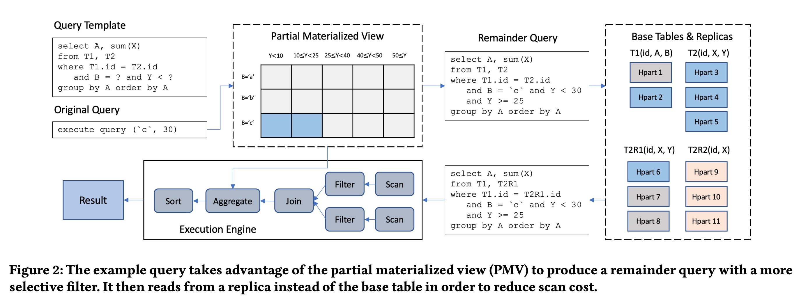
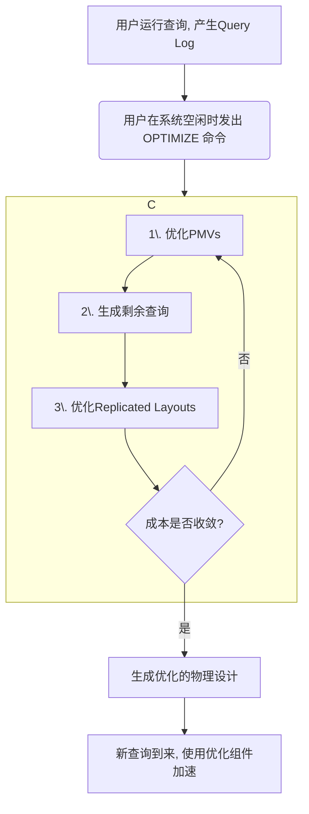
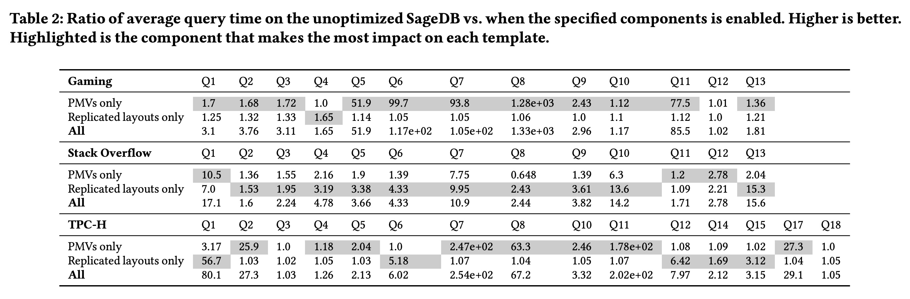

## AI论文解读 | SageDB: An Instance-Optimized Data Analytics System
        
### 作者        
digoal        
        
### 日期        
2025-10-21        
        
### 标签        
PostgreSQL , PolarDB , DuckDB , AI , 论文解读        
        
----        
        
## 背景  
      
https://www.vldb.org/pvldb/vol15/p4062-ding.pdf        
  
提示:          
```          
读懂《SageDB: An Instance-Optimized Data Analytics System》这篇论文需要提前掌握哪些基础知识, 请使用中文通熟易懂的讲解这些基础知识, 可以引用论文中的图、表或使用Markdown支持的图形(text,mermaid等)增加解释性. 
  
使用中文通熟易懂的解读《SageDB: An Instance-Optimized Data Analytics System》这篇论文, 其中的关键内容请着重讲解, 可以引用论文中的图、表或使用Markdown支持的图形(text,mermaid等)增加解释性. 
  
提取《SageDB: An Instance-Optimized Data Analytics System》这篇论文中的重要术语, 使用中文对这些术语进行通熟易懂的讲解, 可以引用论文中的图、表或使用Markdown支持的图形(text,mermaid等)增加解释性. 
```     
  
## 1 前置知识 
  
好的，为了完全读懂《SageDB: An Instance-Optimized Data Analytics System》这篇论文，你需要对数据库系统的一些核心概念、传统的性能优化方法以及一些新兴的、由机器学习驱动的系统设计思想有所了解。

下面我将用通俗易懂的中文，为你梳理这些必备的基础知识，并结合论文中的图表进行解释。

### 核心思想：通用系统 vs. 定制系统

在深入技术细节之前，最重要的是理解这篇论文试图解决的核心矛盾。我们可以用一个生活中的比喻来理解：

  * **通用系统 (General-Purpose System)**：就像一件“均码”的成衣。它被设计出来以适应大多数人的身材和各种场合，比如PostgreSQL或Spark 。它足够灵活，应用广泛，但对于任何一个特定的人来说，它永远不会是最合身的。为了让它更合身，你可能需要做些调整（比如调参），但效果有限 。
  * **专用系统 (Application-Specific System)**：就像一套“高级定制”的西装。它是为一个特定的人、一个特定的场合量身打造的，因此性能和效率极高，比如谷歌为自家广告业务定制的Mesa系统 。但它的缺点是开发成本极高，耗时数年，且无法用于其他任何场景 。

**SageDB的目标**：论文想做的是，**既拥有“高级定制”的极致性能，又具备“成衣”的易用性和灵活性** 。它希望通过一种自动化的方式，让一个通用系统能够根据你的“身材”（数据集）和你要出席的“场合”（查询负载），自动“改衣”，变成最适合你的那一套。这个自动“改衣”的过程，就是论文的核心概念——**实例优化 (Instance-Optimization)** 。

-----

### 必备基础知识清单

#### 1\. 数据库系统基础

你需要了解一个数据库是如何工作的，尤其是分析型数据库（这也是SageDB的重点）。

  * **OLAP vs. OLTP**：

      * **OLTP (联机事务处理)**：主要处理短时间、高并发的“增删改”操作，如银行转账、下订单。
      * **OLAP (联机分析处理)**：主要处理长时间、复杂的“查询”操作，分析大量历史数据，如“统计过去一年所有商品的销售额”。SageDB是一个OLAP系统，专注于分析类任务 。

  * **SQL查询处理流程**：当用户输入一条SQL查询时，数据库内部大致会经历以下步骤。SageDB的很多优化都发生在此流程中。

    ```mermaid
    graph TD
        A[用户输入SQL查询] --> B{查询优化器 Query Optimizer};
        B --> C[生成执行计划 Execution Plan];
        C --> D[执行引擎 Execution Engine];
        D --> E[返回结果];
        subgraph 存储层 Storage Layer
            F[数据文件 Data Files]
        end
        D <--> F;
    ```

      * **查询优化器 (Query Optimizer)**：这是数据库的“大脑”。它会分析SQL语句，并决定如何最高效地执行它（比如先过滤哪个表，用哪种连接方式等）。SageDB的优化器非常智能，它会决定是否以及如何使用其独特的优化组件 。
      * **执行引擎 (Execution Engine)**：负责按照优化器给出的“执行计划”去真正地读取数据、计算并返回结果。
      * **存储层 (Storage Layer)**：数据实际存放的地方。数据的组织方式（行存还是列存、如何分区）会极大地影响查询性能。

#### 2\. 传统数据库性能优化技术

在SageDB出现之前，数据库管理员（DBA）已经有很多方法来提升性能。了解这些传统方法，你才能理解SageDB的创新之处。

  * **索引 (Index)**：就像书的目录，可以帮助数据库快速定位到需要的数据，而无需扫描整张表。最经典的是B+树索引。论文中提到的“学习型索引 (Learned Index)”  就是用机器学习模型替代传统B+树的一种实例优化技术。

  * **数据布局 (Data Layout / Physical Design)**：指数据在磁盘上的物理排列方式。

      * **排序 (Sorting)**：将表中的数据按某一列（或几列）排序。例如，如果订单表按“下单日期”排序，那么查询某个时间范围内的订单就会非常快。
      * **分区 (Partitioning)**：将一张大表水平切分成多个小文件（分区）。查询时，如果过滤条件可以确定数据只在某几个分区内，数据库就只需要读取这些分区，从而跳过大量无关数据，这被称为“分区裁剪”或“数据跳过 (Data Skipping)” 。SageDB也采用了水平分区的思想 。

  * **物化视图 (Materialized View)**：这是一个非常重要的概念，也是理解SageDB核心创新的基础。

      * **是什么**：你可以把物化视图看作是一个**被预先计算并存储下来的查询结果** 。比如，你经常需要查询“每个品类商品的总销售额”，这个查询可能很慢。你可以创建一个物化视图，把这个结果存成一张新表。之后再查询时，系统直接从这张结果表中读取，速度极快。
      * **缺点**：传统物化视图是“要么全用，要么不用”。如果你的查询和物化视图的定义不完全匹配（比如多了一个过滤条件），它就可能完全失效。论文在`3.2.1`节举了一个例子，说明当过滤列的基数很高时（比如每个值都不同），传统物化视图不仅没用，反而会更慢 。

#### 3\. 核心概念：实例优化 (Instance-Optimization)

这是理解论文的关键。

  * **定义**：指的是系统能够**根据给定的“实例”（即特定的数据集和查询负载），自动调整其内部的数据结构和算法，以达到最优性能** 。
  * **与传统调优的区别**：
      * **传统调优**：像是在一辆现成的车上调整各种“旋钮 (knobs)” ，比如调整缓冲区大小。车的核心结构（引擎、底盘）是不变的。
      * **实例优化**：则是根据你要跑的路况（Workload）和车上装的货物（Data），**重新设计甚至替换掉车的某些核心部件**（比如把普通轮胎换成雪地胎）。SageDB就是通过替换和增强核心组件来实现优化的。

-----

### 理解SageDB两大创新的基础

掌握了以上知识后，你就可以理解SageDB的两大核心技术了。它们都是对传统技术的深度扩展和结合。

#### 1\. 从“物化视图”到“部分物化视图 (PMV)”

这是对传统物化视图的巨大改进。

  * **核心思想**：传统物化视图是“一整块”的预计算结果。而PMV则是把结果**切分成一个网格 (Grid)**，每个单元格 (cell) 存储一小部分预计算结果 。

  * **如何工作 (参考论文图2)**：    

      * 上图左侧是一个查询模板，它按`B`和`Y`列进行过滤。PMV就为这两列创建了一个二维网格。
      * 当一个具体查询进来时，比如 `B='c'` 并且 `Y<30`，优化器会发现，查询条件完全“覆盖”了PMV中蓝色高亮的两个单元格（代表 `B='c'` 且 `Y<25` 的区域）。
      * 系统可以直接使用这两个单元格里的预计算结果，然后只需要执行一个 **“剩余查询 (Remainder Query)”** ，去处理剩下的一小部分数据（`B='c'` 且 `25 <= Y < 30` 的区域）。
      * **优势**：这种方式非常灵活，即使查询不能完全被PMV满足，也能利用其大部分能力，极大地减少了需要实时计算的数据量。

#### 2\. 从“数据布局”到“复制数据布局 (Replicated Data Layouts)”

这是对传统数据布局的增强。

  * **核心思想**：一张表只有一种物理排序方式，这可能对某些查询友好，但对另一些查询不友好。SageDB的解决方案是：**不修改原始表，而是创建多个只包含部分列的“副本 (Replicas)”，每个副本都有针对特定查询模式优化的、完全不同的数据布局** 。

  * **如何工作 (参考论文图2右侧)**：    

      * 原始表T2有(id, X, Y)三列。SageDB为它创建了两个副本：T2R1(id, X, Y) 和 T2R2(id, X)。
      * 假设T2R1的物理布局是专门为“剩余查询”优化过的，扫描它远比扫描原始的T2要快得多 。
      * 因此，查询优化器在执行“剩余查询”时，会智能地选择读取T2R1，而不是T2，从而大幅降低I/O成本 。

### 总结

要读懂这篇论文，你需要搭建一个知识体系：

1.  **理解基本矛盾**：通用系统（灵活但慢） vs. 专用系统（快但不灵活）。
2.  **掌握数据库基础**：了解SQL查询是如何被优化和执行的。
3.  **熟悉传统优化**：知道索引、分区、物化视图等经典技术是如何工作的，以及它们的局限性。
4.  **抓住核心概念**：“实例优化”是如何通过学习数据和负载的模式，来自动“量身定制”系统的。
5.  **聚焦两大创新**：理解**部分物化视图 (PMV)** 是如何通过网格化预计算来灵活加速查询的，以及**复制数据布局**是如何通过创建多个专用副本来优化数据读取的。

最后，SageDB通过一个 `OPTIMIZE` 命令 ，将PMV和复制布局的创建与配置过程**自动化**和**协同优化**，用户只需设定资源预算，系统就能自己变强。这就是这篇论文的精髓所在。
  
## 2 解读论文 
  
好的，这篇名为《SageDB: An Instance-Optimized Data Analytics System》的论文，介绍了一种新型的、能自我优化的数据分析系统。下面我将用通俗易懂的方式，为你深入解读其核心思想与关键技术。

### 核心问题：数据库系统设计的“两难困境”

在数据库领域，系统设计者一直面临一个选择：

1.  **通用系统 (General-Purpose System)**：像我们熟知的PostgreSQL或Spark，它们功能全面，能应对各种不同的数据和查询任务 。这就像一把“瑞士军刀”，什么都能做一点，但在任何特定任务上，它都比不上专门的工具。为了让它在特定场景下跑得更快，用户需要手动进行大量复杂的参数调优 。
2.  **专用系统 (Application-Specific System)**：例如谷歌为其广告业务定制的Mesa系统 。这种系统是为一个非常具体的使用场景“量身打造”的，性能极致 。但这就像F1赛车，虽然在赛道上飞快，但开发成本极高，耗时数年，而且只能跑在特定赛道上，无法用于其他目的 。

**SageDB的目标**：打破这种“两难困境”，创造一个既有专用系统的高性能，又有通用系统的易用性和灵活性的数据库 。它想实现的目标是，让一个数据库系统能够自动地“看懂”你的数据和查询需求，然后“自我进化”，为你的特定场景进行深度优化。这个核心理念，就是**实例优化 (Instance-Optimization)** 。

-----

### SageDB的核心武器：两大实例优化组件

为了实现自我进化，SageDB引入了两种创新的、可以协同工作的核心技术。用户不需要理解它们的复杂原理，只需要在适当的时候执行一个简单的`OPTIMIZE`命令，SageDB就会根据历史查询记录，自动配置和部署这两个“武器” 。

#### 1\. 部分物化视图 (Partial Materialized Views, PMVs)

这是对传统“物化视图”技术的巨大升级。

  * **传统物化视图的局限**：物化视图是预先计算好的查询结果，可以极大加速查询。但它非常“死板”。如果你的查询和预先定义好的视图只有一点点不同（比如过滤条件更苛刻），整个视图可能就完全用不上了。论文中举例，如果一个视图按某个值唯一的列（高基数列）来聚合，那么视图本身和原表一样大，失去了意义 。

  * **PMV的创新之处**：PMV不再预计算“一整块”的结果，而是将查询涉及的过滤条件（论文中称为`templated columns`）划分成一个**网格 (Grid)**，并预计算每个 **单元格 (Cell)** 内的结果 。

    我们通过论文中的**图2**来理解这个过程：    

      * **场景**: 一个查询模板需要根据`B`列和`Y`列进行过滤 。PMV为此创建了一个二维网格。
      * **查询执行**: 当一个具体的查询（例如 `B='c'` 且 `Y<30`）到来时，SageDB的优化器会发现，查询的条件**部分覆盖**了PMV中的内容（图中蓝色的两个单元格，代表 `B='c'` 且 `Y<25` 的区域） 。
      * **智能处理**: SageDB会：
        1.  直接从PMV中取出蓝色单元格的**预计算结果**。
        2.  生成一个 **“剩余查询 (Remainder Query)”** ，只去原始数据中计算剩余的、未被覆盖的一小部分（即 `B='c'` 且 `25 <= Y < 30` 的区域）。
        3.  最后将两部分结果合并。

    **PMV的优势**：通过这种“部分满足”的机制，PMV变得极其灵活。它极大地减少了需要实时处理的数据量，即便查询无法被完全覆盖，也能从中受益 。

#### 2\. 复制数据布局 (Replicated Data Layouts)

这是对传统数据物理组织方式的革新。

  * **传统数据布局的局限**：在传统数据库中，一张大表通常只有一种物理排序方式。这种布局可能只对某一种查询友好，而对其他类型的查询则性能很差。改变布局是个高风险操作，可能会让原本很快的查询变慢 。

  * **SageDB的解决方案**：SageDB秉持“不破坏原件”的原则。它不修改原始数据表（称为`base tables`），而是在用户给定的额外磁盘空间预算内，创建多个 **“部分副本 (Partial Replicas)”** 。

      * **部分副本**：每个副本可能只包含原始表的一部分列，即查询所必需的列 。
      * **独立优化布局**：每个副本都可以拥有一个为特定查询模式深度优化的、完全不同的数据布局（物理分区和排序方式） 。
      * **智能选择**：当查询（特别是上面提到的“剩余查询”）到来时，查询优化器会自动评估，是从原始表读取数据，还是从某个能以更低成本完成扫描的、经过优化的副本读取 。

    **复制数据布局的优势**：它允许系统为多种不同的查询模式都提供最优的数据扫描路径，同时通过不修改原始数据来避免性能回退的风险 。

### 工作流程：神奇的 `OPTIMIZE` 命令

SageDB将所有优化的复杂性都封装在一个命令背后。



这个流程的关键在于，PMV和Replicated Layouts的优化是**相互依赖、迭代进行**的 ：

  * PMV的选择会影响“剩余查询”的样子，从而决定了应该如何优化数据布局 。
  * 反过来，一个高效的数据布局能让“剩余查询”的成本变得很低，这又会影响系统是否值得为一个查询模板分配更多的内存去构建更精细的PMV 。

SageDB通过循环迭代，不断调整两者的配置，直到找到一个总查询成本最低的全局最优解 。

### 实验效果：性能提升显著

论文通过在真实和标准数据集上的实验，证明了SageDB的有效性。

  * **端到端性能**：在整体工作负载上，优化后的SageDB比一个主流的商业云数据仓库（论文中称为System X）快了**高达3倍** 。
  * **单查询性能**：对于特定的查询，SageDB的性能提升更为惊人，最高可达**近250倍** 。
  * **组件贡献**：**表2**的消融研究显示，不同的查询受益于不同的组件。有些查询从PMV中获益最多（如Gaming Q8），有些则主要依赖复制布局来加速（如TPC-H Q1），而很多查询则是在两者协同作用下达到最佳性能（如Stack Overflow Q4） 。这证明了两种组件设计的互补性和必要性。    

### 结论与启示

SageDB作为首个以“实例优化”为核心设计原则的数据系统原型，给出了一个清晰的信号：未来的数据库不应再让用户去适应系统，而应是**系统主动去适应用户**。

通过**部分物化视图 (PMVs)** 和 **复制数据布局 (Replicated Data Layouts)** 这两大创新，并配以自动化的协同优化算法，SageDB证明了在不给用户增加额外负担的前提下，实现专用系统级别的高性能是完全可行的。尽管它还是一个研究原型，但它为下一代“自驾驶 (Self-Driving)”数据库系统的发展方向，迈出了坚实而重要的一步。
  
## 3 术语 
  
好的，这里是《SageDB: An Instance-Optimized Data Analytics System》论文中的一些关键术语及其通俗易懂的中文讲解。

-----

### 1\. 实例优化 (Instance-Optimization)

  * **中文讲解**:
    这可以理解为一种“量身定制”的优化思想 。传统的数据库像是一件均码的成衣，试图适应所有用户 ；而实例优化则是要让数据库系统像一位聪明的裁缝，能够自动分析你的“身材”（数据集）和你要出席的“场合”（查询负载），然后为这个特定的“实例”修改内部核心组件，从而达到最佳性能 。这与传统的、仅调整外部“旋钮”（配置参数）的自动调优有本质区别 。

  * **核心区别**:

      * **传统调优**: 调整现有组件的参数（比如内存缓冲区大小） 。
      * **实例优化**: 根据数据和查询的特点，生成或替换掉系统内部的数据结构和算法本身（比如用一个学习模型替代传统的B+树索引） 。

### 2\. 查询模板 (Query Template)

  * **中文讲解**:
    查询模板，也叫预处理语句 (prepared statements)，指的是一类结构相同、只是部分过滤条件的值不同的SQL查询 。SageDB假设用户的查询负载不是完全随机的，而是可以归纳为若干个模板 。

  * **示例 (源自论文图2)**:    
    下面这个SQL就是一个查询模板，其中的 `?` 就是可以变化的参数 。

    ```sql
    select A, sum(X) 
    from T1, T2
    where T1.id = T2.id 
      and B = ?       -- 参数1
      and Y < ?       -- 参数2
    group by A 
    order by A
    ```

    用户每次执行时，会为 `?` 提供具体的值，例如 `execute query ('c', 30)` 。SageDB会针对这些模板进行优化 。

### 3\. 部分物化视图 (Partial Materialized View - PMV)

  * **中文讲解**:
    这是SageDB的一大核心创新，是对传统物化视图（预先计算好的查询结果）的升级 。PMV不再是预计算一整个查询的结果，而是为某个**查询模板** ，根据其过滤参数（例如上例中的`B`和`Y`列 ）创建一个逻辑上的**网格 (Grid)** 。网格中的每个单元格 (Cell)，都存储了对应数据范围内的预计算（聚合）结果 。

  * **工作原理示意 (基于论文图2)**:    

    当一个查询到来时（如 `Y < 30`），优化器会发现其条件完全覆盖了网格中的 `Y<10` 和 `10<=Y<25` 这两个区域 。系统可以直接使用这些单元格里的预计算结果，而只需去计算剩余的一小部分数据 。

### 4\. 剩余查询 (Remainder Query)

  * **中文讲解**:
    这是使用PMV后产生的概念。当一个查询的大部分计算可以由PMV中的单元格满足后，剩下的、未被覆盖的一小部分数据，就需要通过一个新的、范围更小的查询来处理 。这个新的查询就被称为“剩余查询” 。

  * **示例**:
    对于原始查询 `Y < 30`，在使用PMV覆盖了 `Y < 25` 的区域后，剩余查询需要处理的范围就变成了 `Y >= 25 AND Y < 30` 。因为处理的数据量大大减少，这个查询会快得多 。

### 5\. 复制数据布局 (Replicated Data Layouts)

  * **中文讲解**:
    这是SageDB的另一大核心创新，是一种更安全、更灵活的数据物理组织方式 。传统的做法是为一张表指定一种排序或分区方式，但这可能对某些查询有利，对另一些查询不利 。SageDB的做法是：
    1.  **不修改原始数据表** (base table)，以避免性能回退的风险 。
    2.  在用户给定的额外磁盘预算内，创建表的多个**部分副本 (Partial Replicas)** 。

### 6\. 部分副本 (Partial Replica)

  * **中文讲解**:
    一个部分副本是原始表的一个子集，它通常包含原始表的所有行，但只包含执行特定查询所必需的**部分列** 。每个副本都可以拥有自己独立的、为特定查询模板（或剩余查询）深度优化的数据布局 。查询时，优化器会自动选择成本最低的扫描对象——可能是原始表，也可能是某个经过优化的副本 。

### 7\. OPTIMIZE 命令

  * **中文讲解**:
    这是SageDB暴露给用户的核心接口，是一个简单易用的命令 。用户无需关心内部复杂的优化细节，只需在系统负载较低时（例如夜间）执行 `OPTIMIZE` ，并提供两个预算参数：
      * **内存预算 (memory budget)**: 用于存储PMV 。
      * **磁盘预算 (disk budget)**: 用于存储复制数据布局 。
        SageDB随后会根据历史查询日志，自动完成所有优化组件的配置 。

### 8\. 全局优化 (Global Optimization)

  * **中文讲解**:
    指SageDB在执行 `OPTIMIZE` 命令时，**协同地、统一地**优化PMV和复制布局的过程 。之所以需要全局优化，是因为这两个组件互相影响 ：

      * PMV的配置决定了“剩余查询”的样子，从而影响了数据布局应该如何优化 。
      * 数据布局的效率又反过来影响了为某个模板构建PMV是否“划算” 。

  * **优化流程**:
    SageDB采用一个迭代循环的算法来寻找全局最优解 。

    ```mermaid
    graph TD
        A(开始) --> B(1\. 根据当前布局, 优化PMVs);
        B --> C(2\. 根据优化后的PMVs, 生成剩余查询);
        C --> D(3\. 根据剩余查询, 优化复制数据布局);
        D --> E{总成本是否收敛?};
        E -- 否 --> B;
        E -- 是 --> F(结束);
    ```

    这个过程会一直持续，直到总的工作负载执行成本不再显著下降为止 。
  
## 参考        
         
https://www.vldb.org/pvldb/vol15/p4062-ding.pdf  
  
https://rmarcus.info/blog/        
        
<b> 以上内容基于DeepSeek、Qwen、Gemini及诸多AI生成, 轻微人工调整, 感谢杭州深度求索人工智能、阿里云、Google等公司. </b>        
        
<b> AI 生成的内容请自行辨别正确性, 当然也多了些许踩坑的乐趣, 毕竟冒险是每个男人的天性.  </b>        
  
    
#### [期望 PostgreSQL|开源PolarDB 增加什么功能?](https://github.com/digoal/blog/issues/76 "269ac3d1c492e938c0191101c7238216")
  
  
#### [PolarDB 开源数据库](https://openpolardb.com/home "57258f76c37864c6e6d23383d05714ea")
  
  
#### [PolarDB 学习图谱](https://www.aliyun.com/database/openpolardb/activity "8642f60e04ed0c814bf9cb9677976bd4")
  
  
#### [PostgreSQL 解决方案集合](../201706/20170601_02.md "40cff096e9ed7122c512b35d8561d9c8")
  
  
#### [德哥 / digoal's Github - 公益是一辈子的事.](https://github.com/digoal/blog/blob/master/README.md "22709685feb7cab07d30f30387f0a9ae")
  
  
#### [About 德哥](https://github.com/digoal/blog/blob/master/me/readme.md "a37735981e7704886ffd590565582dd0")
  
  

  
